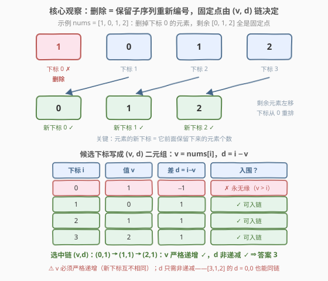
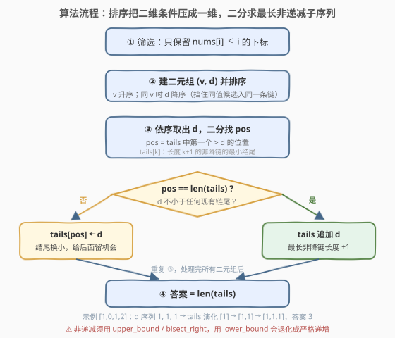

# 删除元素后最大固定点数目

- **题目名称**：删除元素后最大固定点数目
- **链接**：[3920. Maximize Fixed Points After Deletions](https://leetcode.cn/problems/maximize-fixed-points-after-deletions/)
- **难度**：困难
- **标签**：数组、排序、动态规划、二分查找

## 1. 题目概述

给你一个整数数组 `nums`。如果 $\text{nums}[i] = i$，则称位置 $i$ 为**固定点**。

允许从数组中删除**任意数量**的元素（包括零个）。每次删除后，剩余元素向左移动，下标从 0 开始重新分配。

返回执行任意次删除操作后，能获得的**最大固定点数量**。

**示例 1**：

```text
输入：nums = [0,2,1]
输出：2
解释：删除 nums[1] = 2，数组变为 [0, 1]，两个下标都是固定点。
```

**示例 2**：

```text
输入：nums = [3,1,2]
输出：2
解释：不删除任何元素，nums[1] = 1、nums[2] = 2 均为固定点。
```

**示例 3**：

```text
输入：nums = [1,0,1,2]
输出：3
解释：删除 nums[0] = 1，数组变为 [0, 1, 2]，三个下标都是固定点。
```

**约束条件**：

- $1 \le n \le 10^5$
- $0 \le \text{nums}[i] \le 10^5$

> 💡 **审题关键**：①删除只改变**位置**、不改变**相对顺序**——最终数组永远是原数组的**子序列**；②元素的新下标 = 它前面**保留下来的元素个数**，与更后面的元素无关；③固定点的新下标互不相同，而固定点的值 = 新下标，所以能成为固定点的元素天然要求**值互不相同**；④$\text{nums}[i] > i$ 的元素永远当不成固定点（新下标只会 ≤ 原下标），但可以被保留下来当"占位填充"。

---

## 2. 解题思路

### 2.1 暴力思路：枚举保留集合

每个元素只有"保留 / 删除"两种状态，枚举全部 $2^n$ 个保留方案，把每个方案的保留元素拼成新数组、数一遍固定点，取最大值。$n = 25$ 就要三千多万次拼接，$n = 10^5$ 完全不可行。

瓶颈在于把"删除"当成了逐个的独立决策。其实最终数组里**谁能成为固定点**只取决于一个局部量——每个元素前面保留了多少个元素。把这个量算清楚，"哪些元素能同时成为固定点"就有了紧凑的判定条件，问题就从指数级坍缩成一个经典的最长链模型。

### 2.2 核心观察：固定点 ⇔ (v, d) 二元组的最长链



**第一步：删除 ⟺ 保留子序列。** 任意删除方案对应一个保留下标集合，最终数组是 `nums` 的子序列：元素相对顺序不变，只是重新从 0 编号。

**第二步：新下标 = 前面保留的元素个数。** 设原下标 $i$ 被保留，它的新下标等于保留集合中小于 $i$ 的下标个数。注意这个量**只由前面的决策决定**——这是后面所有推导的锚点。

**第三步：刻画能同时成为固定点的下标链。** 设下标 $i_1 < i_2 < \cdots < i_m$ 的元素最终都是固定点，记 $v_t = \text{nums}[i_t]$（它同时等于该元素的新下标），$d_t = i_t - v_t$：

- **链首**：$i_1$ 前面要恰好保留 $v_1$ 个元素，只能从 $[0, i_1)$ 的 $i_1$ 个元素里挑 ⟹ $v_1 \le i_1$，即 $d_1 \ge 0$；
- **相邻一对**：$i_{t+1}$ 前面保留的元素 = $i_t$ 前面保留的（$v_t$ 个）+ $i_t$ 自己 + 夹在 $(i_t, i_{t+1})$ 里的填充元素 $c_t$ 个，于是 $v_{t+1} = v_t + 1 + c_t$，而 $0 \le c_t \le i_{t+1} - i_t - 1$，拆开就是两个不等式：

$$v_{t+1} \ge v_t + 1 \qquad\text{且}\qquad v_{t+1} - v_t \le i_{t+1} - i_t$$

前者说**值 $v$ 必须严格递增**（固定点的新下标互不相同），后者移项后恰是 $i_{t+1} - v_{t+1} \ge i_t - v_t$，即**差 $d = i - v$ 非递减**（每往右走一步，"需要垫在前面"的余量不许倒退）；
- **链尾**：最后一个固定点之后的元素全部删掉即可，无额外约束。

**第四步：条件也是充分的——链总能实现。** 反过来，任取满足「$d \ge 0$、$v$ 严格递增、$d$ 非递减」的下标链：链首前任意保留 $v_1$ 个元素（数量够），相邻链节之间保留 $c_t = v_{t+1} - v_t - 1$ 个填充（$d$ 非递减恰好保证 $c_t \le i_{t+1} - i_t - 1$，不超额），链尾后全删——每个链节都精确落在正确的新下标上。所以判定条件与"可实现"严格等价。

> 💡 **一句话总结**：答案 = 最长的下标链，链上每个下标满足 $\text{nums}[i] \le i$，且沿链 **值 $v = \text{nums}[i]$ 严格递增、差 $d = i - \text{nums}[i]$ 非递减**。

**第五步：二维偏序 ⟹ 排序 + 最长非递减子序列。** 链条件只依赖二元组 $(v, d)$，是"第一维严格、第二维非严格"的经典偏序。把所有候选按 **$v$ 升序、$v$ 相同时 $d$ 降序**排序后，问题恰好转成 **$d$ 的最长非递减子序列**：

- 排序后任何子序列的 $v$ 非降；同一 $v$ 的候选因 $d$ 被**降序**排布，一条 $d$ 非降的链至多选中其中一个 ⟹ 链上 $v$ 自动**严格**递增——这正是降序 tie-break 的目的（值不能重复）；
- 原下标 $i = v + d$：$v$ 严格增 + $d$ 非降 ⟹ $i$ 严格增，链自动对应一组互不相同且递增的原下标，天然合法。

> ⚠️ **两个易错点**：① $d$ 的条件是**非递减**而非严格递增——例如 `[3,1,2]` 中下标 1、2 的 $d$ 都是 0，却能同时为固定点（官方 hint 把相邻条件写成严格不等式 $i-\text{nums}[i] < j-\text{nums}[j]$，那只是充分条件，照抄实现会在这种用例上漏解）；② $v$ 必须**严格**递增——例如 `[0,0]` 最多产生 1 个固定点，排序 tie-break 用 $d$ 降序正是为了挡住同 $v$ 候选混进同一条链。

### 2.3 算法流程图



| 步骤 | 操作 | 说明 |
|------|------|------|
| ① | 筛出 $\text{nums}[i] \le i$ 的下标 | 其余 $d < 0$，永无缘成为固定点 |
| ② | 建二元组 $(v, d) = (\text{nums}[i],\ i - \text{nums}[i])$，按 $v$ 升、同 $v$ 时 $d$ 降排序 | 降序 tie-break 挡住同值候选成链 |
| ③ | 依序取出 $d$，二分找 `tails` 中**第一个大于 $d$** 的位置 `pos` | 非递减子序列 ⟹ `bisect_right` / `upper_bound` |
| ④ | `pos` 在结尾则追加（最长链 +1），否则 `tails[pos] ← d` | `tails[k]` = 长度 $k+1$ 的非降链的最小结尾 |
| ⑤ | 返回 `len(tails)` | 即最长非递减子序列长度 |

### 2.4 示例演算

以示例 3 `nums = [1, 0, 1, 2]` 为例。

**第一步：筛选候选并建二元组。**

| 下标 $i$ | 值 $\text{nums}[i]$ | 入围？($\text{nums}[i] \le i$) | $v$ | $d = i - v$ |
|---------|------|------|-----|-----|
| 0 | 1 | ✗（$1 > 0$） | — | — |
| 1 | 0 | ✓ | 0 | 1 |
| 2 | 1 | ✓ | 1 | 1 |
| 3 | 2 | ✓ | 2 | 1 |

**第二步：排序。** 二元组序列 $(0,1), (1,1), (2,1)$ 本身已按 $v$ 升序（无同 $v$，tie-break 不生效）。

**第三步：最长非递减子序列。**

| 处理 | 二分结果（第一个 $> d$ 的位置） | `tails` 变化 |
|------|------------------------|------------|
| $d = 1$ | 无（追加） | `[] → [1]` |
| $d = 1$ | 无（追加） | `[1] → [1, 1]` |
| $d = 1$ | 无（追加） | `[1, 1] → [1, 1, 1]` |

答案 $= \text{len(tails)} = 3$，对应链 $(v,d) = (0,1) \to (1,1) \to (2,1)$，即原下标 $1, 2, 3$：删掉下标 0 的元素后数组变为 $[0, 1, 2]$，三个位置全是固定点 ✓。

再速验另外两个示例：`[3,1,2]` 的候选为 $(1,0), (2,0)$，$d$ 序列 $0, 0$ 非降全保留，答案 2——正体现「$d$ 相等也能成链」；`[0,2,1]` 的候选为 $(0,0), (1,1)$，$d$ 序列 $0, 1$，答案 2 ✓。

---

## 3. 参考代码

### C++

```cpp
class Solution {
  public:
    int maxFixedPoints(vector<int>& nums) {
        int n = nums.size();
        vector<pair<int, int>> a;               // (v, -d)：v 升序、同 v 时 d 降序
        a.reserve(n);
        for (int i = 0; i < n; i++) {
            if (nums[i] <= i) a.emplace_back(nums[i], -(i - nums[i]));
        }
        sort(a.begin(), a.end());

        vector<int> tails;                      // tails[k]：长度 k+1 的非降链的最小结尾
        for (auto& [v, negd] : a) {
            int d = -negd;
            auto pos = upper_bound(tails.begin(), tails.end(), d);
            if (pos == tails.end()) tails.push_back(d);
            else *pos = d;
        }
        return (int)tails.size();
    }
};
```

> 💡 **写法要点**：
> - 存 $-d$ 让 `pair` 的默认字典序直接实现「$v$ 升、同 $v$ 时 $d$ 降」，省去手写比较器；
> - **非递减**子序列必须用 `upper_bound`（找第一个**严格大于** $d$ 的位置）；写成 `lower_bound` 就退化成严格递增，会漏掉 $d$ 相等的合法链；
> - 没有任何候选时 `tails` 为空，自然返回 0（如 `nums = [5]`），无需特判。

### Python

```python
from bisect import bisect_right

class Solution:
    def maxFixedPoints(self, nums: List[int]) -> int:
        pairs = [(v, i - v) for i, v in enumerate(nums) if v <= i]
        pairs.sort(key=lambda p: (p[0], -p[1]))     # v 升序，同 v 时 d 降序
        tails = []                                   # 长度 k+1 的非降链的最小结尾
        for _, d in pairs:
            pos = bisect_right(tails, d)             # 非递减用 bisect_right
            if pos == len(tails):
                tails.append(d)
            else:
                tails[pos] = d
        return len(tails)
```

> 💡 **写法要点**：
> - 列表推导一次完成筛选 + 建二元组；`key` 中用 `-p[1]` 实现降序 tie-break；
> - `bisect_right` 与 `bisect_left` 的差别只在**等于** $d$ 的元素上：`bisect_right` 允许相等元素接在链后（非递减），`bisect_left` 不允许（严格递增）——本题必须用前者。

---

## 4. 复杂度分析

| 维度 | 复杂度 | 说明 |
|------|--------|------|
| 时间 | $O(n \log n)$ | 筛选 $O(n)$、排序 $O(n \log n)$、每个二元组一次二分 $O(\log n)$ |
| 空间 | $O(n)$ | 候选二元组数组 + `tails` 数组 |
| 正确性边界 | — | 无候选时答案 0；$d$ 全相等（非递减二分统一覆盖）、$v$ 有重复（降序 tie-break 挡住）等边界无需特判 |

---

## 5. 扩展：两个条件缺一不可 & 二维偏序的一般化

**为什么不能只对 $d$ 求最长（非递减）子序列？** $d$ 非降只保证"垫脚余量"不倒退，不保证值不撞车：`nums = [2, 0, 0]` 中下标 1、2 的 $d$ 分别为 1、2（还在严格递增），但值都是 0，最多一个成为固定点（真实答案 1，只看 $d$ 会算出 2）。值严格递增必须单独约束——降序 tie-break 正是为此。

**为什么不能只对 $v$ 求最长递增子序列？** 值严格递增不保证余量不倒退：`nums = [1, 0, 2]` 中下标 1、2 的值 $0 < 2$ 严格递增，但 $d$ 从 1 倒退到 0——第二个元素落到新下标 1 时值是 2，对不上（真实答案 1，只看 $v$ 会算出 2）。

**二维偏序最长链的一般套路。** 「第一维严格、第二维非严格」的最长链是一类经典模型（354 俄罗斯套娃信封是同款）：**第一维升序排序，等值时第二维降序 tie-break，再对第二维做一维 LIS**；第二维的 LIS 严格性与链的要求保持一致（本题要求非降，故用 `upper_bound`/`bisect_right`）。口诀：**哪一维等值时会"冒充可比"，就在那一维等值时把另一维倒过来排**。

**还原具体删除方案。** 从 LIS 结果回溯出链 $(i_1, v_1, d_1), \dots, (i_m, v_m, d_m)$ 后：链首前任意保留 $v_1$ 个元素、相邻链节之间保留 $v_{t+1} - v_t - 1$ 个夹层元素、链尾后全删。填充元素没有任何值约束、可任选，故方案通常不唯一。

---

## 6. 面试要点

**Q1：为什么"任意次删除"可以等价为"选一个保留子序列"？**

> 删除不改变剩余元素的相对顺序，最终数组永远是原数组的子序列；反之任何子序列都能通过"删掉其余元素"得到。于是决策对象从"每次删谁"（顺序敏感、指数级）简化为"最终留下谁"（一个集合）。

**Q2：固定点链的三个条件分别是什么？各自由哪一步推出？**

> ① $\text{nums}[i] \le i$：元素只会左移，新下标 ≤ 原下标；② 值严格递增：固定点的新下标互不相同，值 = 新下标，故沿链互不相同且递增；③ $d = i - \text{nums}[i]$ 非递减：相邻固定点之间的保留数 $v_{t+1} - v_t - 1$ 不能超过夹层可用元素数 $i_{t+1} - i_t - 1$。三者合起来同时也是充分的（填充元素任意选即可实现）。

**Q3：排序时同一 $v$ 为什么按 $d$ 降序？换成升序会怎样？**

> 链要求 $v$ 严格递增，同 $v$ 候选至多入选一个。若同 $v$ 按 $d$ 升序排，两个同值候选的 $d$ 恰好非降、会被 LIS 误接进同一条链（如 `[0,0]` 会算出 2，真实答案 1）；按 $d$ 降序后同值候选在序列中 $d$ 递减，非降链天然至多取一个。

**Q4：二分为什么用 `upper_bound` / `bisect_right`，不能用 `lower_bound` / `bisect_left`？**

> `tails` 维护的是**非递减**子序列，遇到与当前链尾相等的 $d$ 应当能接上（$d$ 相等合法，如 `[3,1,2]`）。`upper_bound` 定位"第一个 $> d$ 的位置"，等于 $d$ 的链尾不会被替换、新 $d$ 追加其后；`lower_bound` 会把相等的 $d$ 当作不可接，退化成严格递增，答案偏小。

**Q5：`nums[i] > i` 的元素是不是就没用了？**

> 作为**固定点**永远无望（新下标 ≤ 原下标 < 值）；但作为**填充元素**完全合法——链首前和链节之间的占位元素没有任何值约束。不过填充可以任选，它们不影响最优链长度，算法里直接过滤即可。

> 💡 **一句话总结**：删除 ⟺ 保留子序列，新下标 = 前面保留数 ⟹ 固定点链条件「$d \ge 0$、$v$ 严格增、$d$ 非降」⟹ 排序（$v$ 升、$d$ 降）+ $d$ 的最长非递减子序列（`bisect_right`），$O(n \log n)$。

---

## 7. 同类练习题

- [300. 最长递增子序列](https://leetcode.cn/problems/longest-increasing-subsequence/)：`tails` 贪心 + 二分的原型，本题是其"非递减 + 排序预处理"升级版
- [354. 俄罗斯套娃信封](https://leetcode.cn/problems/russian-doll-envelopes/)：二维偏序最长链同款套路——第一维升序、等值时第二维降序，再做一维 LIS
- [646. 最长数对链](https://leetcode.cn/problems/maximum-length-of-pair-chain/)：按第二维排序 + 贪心求最长链，体会链问题里"严格 / 非严格"的差别
- [1064. 不动点](https://leetcode.cn/problems/fixed-point/)：固定点概念的裸题（有序数组二分找 $\text{nums}[i] = i$），可作热身
- [1626. 无矛盾的最佳球队](https://leetcode.cn/problems/best-team-with-no-conflicts/)：排序消掉一维后做 LIS 的综合练习，与本题"排序 + LIS"同构
