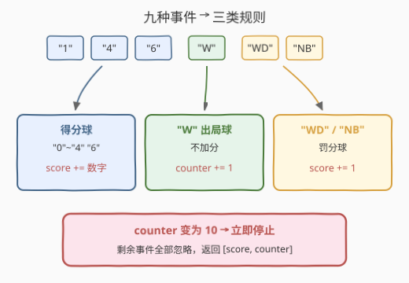
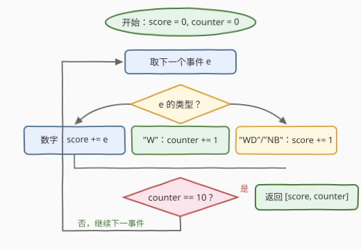

# LeetCode 分数验证器 题解

## 1. 题目概述

- **标题 / 题号**：分数验证器（#3921，easy）
- **链接**：https://leetcode.cn/problems/score-validator/
- **难度**：简单
- **标签**：数组、字符串、模拟

**题意**：给你一个字符串数组 `events`。一开始，`score = 0` 且 `counter = 0`。`events` 中的每个元素为以下之一：

- `"0"`、`"1"`、`"2"`、`"3"`、`"4"`、`"6"`：将该值加到总得分中。
- `"W"`：计数器加 1，不增加得分。
- `"WD"`：总得分加 1。
- `"NB"`：总得分加 1。

从左到右处理数组，当满足以下任一条件时**停止处理**：

- `events` 中的所有元素都已处理完毕，或
- 计数器变为 10。

返回整数数组 `[score, counter]`。

**示例 1**：

```text
输入：events = ["1","4","W","6","WD"]
输出：[12,1]
解释："1"→score=1；"4"→score=5；"W"→counter=1；"6"→score=11；"WD"→score=12。
```

**示例 2**：

```text
输入：events = ["WD","NB","0","4","4"]
输出：[10,0]
解释："WD"→score=1；"NB"→score=2；"0"→score=2；"4"→score=6；"4"→score=10。全程无 "W"，counter 保持 0。
```

**示例 3**：

```text
输入：events = ["W","W","W","W","W","W","W","W","W","W","W"]
输出：[0,10]
解释：出现 10 次 "W" 后计数器达到 10，停止处理，第 11 个 "W" 被忽略。
```

**约束**：

- `1 <= events.length <= 1000`
- `events[i]` 是 `"0"`、`"1"`、`"2"`、`"3"`、`"4"`、`"6"`、`"W"`、`"WD"` 或 `"NB"` 之一。

> 💡 这题背景是板球（cricket）计分：`W` 是出局（wicket），`WD` 是宽球（wide），`NB` 是无效球（no ball），后两者各罚 1 分。

## 2. 解题思路

### 2.1 暴力思路

按题意从左到右逐个事件处理，用一串 `if-else` 对每个字符串做完整比较，维护 `score` 和 `counter` 两个变量，处理完（或触发停止）后返回。由于每个事件的处理是 `O(1)` 的字符串比较（长度至多 2），这就是最优做法——线性模拟本身没有可优化的余地，**难点只在把规则翻译对、把停止边界卡准**。

### 2.2 核心观察：九种事件归三类 + 提前终止



虽然事件有 9 种，但按"作用对象"可以归为**三类**：

1. **得分球**（`"0"`~`"4"`、`"6"`）：`score += 该数字`。
2. **出局球 `"W"`：只影响 `counter`，`counter += 1`，`score` 不变**。
3. **罚分球 `"WD"`、`"NB"`：只影响 `score`，`score += 1`**。

两个容易出错的细节：

- **前缀冲突**：`"W"` 是 `"WD"` 的前缀，判断时必须做**完整字符串相等**比较（`e == "W"`），不能只看首字符，否则 `"WD"` 会被误判成 `"W"`。
- **停止时机**：使 `counter` **变为 10** 的那个 `"W"` 本身已经处理完毕（计入 counter），之后立即停止——剩余事件（哪怕是继续加分的 `"6"`）全部忽略。即"处理完一个事件后检查 `counter == 10`"，而不是"处理前检查"。

### 2.3 算法流程图



流程：初始化两个变量 → 逐事件按三类规则更新 → 每次更新后检查 `counter == 10`，满足则立即跳出 → 返回 `[score, counter]`。

### 2.4 示例演算：停止边界

以示例 3（11 个 `"W"`）为例，验证停止时机：

| 步骤 | 事件 | score | counter | 说明 |
|------|------|-------|---------|------|
| 1~9 | "W" ×9 | 0 | 9 | 继续处理 |
| 10 | "W" | 0 | **10** | 该事件已处理完，counter 变为 10 |
| — | 停止 | 0 | 10 | 第 11 个 "W" **不再处理** |

最终返回 `[0, 10]`——若错误地"处理前检查 counter"或"处理完全部事件"，都拿不到这个结果。

## 3. 参考代码

### C++

```cpp
class Solution {
  public:
    vector<int> scoreValidator(vector<string>& events) {
        int score = 0, counter = 0;
        for (const string& e : events) {
            if (e == "W") {
                counter += 1;
            } else if (e == "WD" || e == "NB") {
                score += 1;
            } else {
                score += e[0] - '0';
            }
            if (counter == 10) {
                break;
            }
        }
        return {score, counter};
    }
};
```

### Python

```python
class Solution:
    def scoreValidator(self, events: List[str]) -> List[int]:
        score = counter = 0
        for e in events:
            if e == "W":
                counter += 1
            elif e in ("WD", "NB"):
                score += 1
            else:
                score += int(e)
            if counter == 10:
                break
        return [score, counter]
```

> ⚠️ 判断顺序上先比较 `e == "W"` 再比较 `"WD"`，避免把 `"WD"` 误判为出局球；数字分支兜底即可（约束保证 `events[i]` 只可能是 9 种合法事件之一，无需额外防御）。

## 4. 复杂度分析

| 维度 | 复杂度 | 说明 |
|------|--------|------|
| 时间复杂度 | O(n) | 每个事件至多被处理一次，单次处理是 O(1) 的字符串比较（长度 ≤ 2） |
| 空间复杂度 | O(1) | 只使用 score、counter 两个计数变量 |

## 5. 扩展：规则表驱动写法

如果规则继续增多（比如再加边界球 `"B"`、腿侧球 `"LB"`），一长串 `if-else` 会越来越难维护。可以改用**规则表驱动**：用哈希表把事件映射到 `(得分增量, 计数增量)`，循环体只剩查表 + 更新 + 检查：

```python
class Solution:
    def scoreValidator(self, events: List[str]) -> List[int]:
        rule = {"W": (0, 1), "WD": (1, 0), "NB": (1, 0)}
        score = counter = 0
        for e in events:
            ds, dc = rule.get(e, (int(e), 0))
            score += ds
            counter += dc
            if counter == 10:
                break
        return [score, counter]
```

新规则只需在表里加一行，主逻辑完全不动——这是模拟类题目常见的可维护性优化。

## 6. 面试要点

1. **`"W"` 和 `"WD"` 都以 W 开头，如何避免误判？**
   - 必须做完整字符串相等比较（`e == "W"`），或先比较长度 / 先判断更长的 `"WD"`；只看首字符会把 `"WD"` 误判成出局球。

2. **`counter` 达到 10 的确切停止时机是什么？**
   - 使 `counter` 变为 10 的那个 `"W"` 处理完毕后立即停止，该事件本身生效；其后所有事件（包括会加分的球）全部忽略。

3. **为什么这题不需要对非法输入做防御？**
   - 约束保证 `events[i]` 只能是 9 种合法事件之一，数字分支可以放心兜底；面试中若被追问"生产环境"，再谈输入校验。

4. **如果规则改成"出局满 10 次后仍需统计罚分"，代码怎么改？**
   - 把 `if (counter == 10) break` 改成 `if (counter == 10 && e == "W") break` 之类的条件，或去掉 break、在循环外返回——体现模拟题"规则变了只改分发逻辑"的特点。

5. **这题的时间/空间复杂度？**
   - 时间 O(n)，每个事件 O(1) 处理；空间 O(1)，只有两个计数变量。

## 同类练习题

| # | 题目 | 与本题的关联 |
|---|------|-------------|
| 657 | [机器人能否返回原点](https://leetcode.cn/problems/robot-return-to-origin/) | 逐指令模拟，字符串按字符分发更新状态 |
| 1688 | [配对比赛轮数](https://leetcode.cn/problems/count-of-matches-in-tournament/) | 按规则逐轮模拟（也有 O(1) 公式），注意终止条件 |
| 228 | [汇总区间](https://leetcode.cn/problems/summary-ranges/) | 线性扫描 + 边界条件处理，练习"什么时候停" |
| 1041 | [困于环中的机器人](https://leetcode.cn/problems/robot-bounded-in-circle/) | 按指令序列逐条模拟并更新方向状态 |
