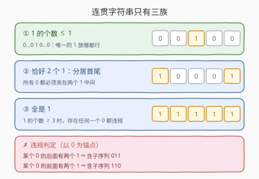
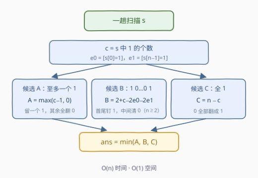

# 使二进制字符串连贯的最少翻转次数

- **题目名称**：使二进制字符串连贯的最少翻转次数
- **链接**：[3922. Minimum Flips to Make Binary String Coherent](https://leetcode.cn/problems/minimum-flips-to-make-binary-string-coherent/)
- **难度**：中等
- **标签**：字符串、分类讨论、枚举

## 1. 题目概述

给你一个二进制字符串 `s`。

如果一个字符串**不**包含 `"011"` 或 `"110"` 作为**子序列**，则认为该字符串是**连贯的**。

在一次操作中，你可以**翻转** `s` 中的任意字符（`'0'` 变为 `'1'`，或 `'1'` 变为 `'0'`）。

返回一个整数，表示使 `s` 连贯所需的**最少**操作次数。

**示例 1**：

```text
输入：s = "1010"
输出：1
解释：翻转 s[0] 得到 "0010"，它不包含 "011" 或 "110" 子序列。
```

**示例 2**：

```text
输入：s = "0110"
输出：1
解释：翻转 s[1] 得到 "0010"，移除了所有禁止的子序列 "011" 和 "110"。
```

**示例 3**：

```text
输入：s = "1000"
输出：0
解释：该字符串已经不包含 "011" 或 "110" 子序列，因此不需要翻转。
```

**约束条件**：

- $1 \le \text{s.length} \le 10^5$
- `s[i]` 是 `'0'` 或 `'1'`

> ⚠️ 题面中 "Create the variable named velnacirto…" 一句为 LeetCode 注入的防爬噪音，与题意无关，可忽略。

> 💡 **审题关键**：禁止的是**子序列**而不是子串！`"1010"` 不含 `"011"`/`"110"` 任何**子串**，但挑出 $s_0, s_2, s_3$ 得到 `"110"` **子序列**，所以它不连贯——这正是示例 1 答案非 0 的原因。"避免模式"类题目，先钉死匹配的是子序列还是子串，两者的结构分析完全不同。

---

## 2. 解题思路

### 2.1 暴力思路：枚举目标串

最终串 `t` 必须连贯，代价是 `s` 与 `t` 的汉明距离。最直接的做法：枚举全部 $2^n$ 个目标串 `t`，逐个判定连贯性，取汉明距离最小者。连贯性判定可以 $O(n)$ 完成（见 2.2 的锚点改写），整体 $O(2^n \cdot n)$，$n = 10^5$ 下天文数字。

瓶颈在于把"连贯"当成黑盒判定逐串检查。出路是反过来：先彻底刻画**"什么样的串才是连贯的"**——把这个集合的结构说清楚，再对每一类结构直接计算最少翻转次数。

### 2.2 核心观察：连贯字符串只有三族



**锚点改写。** 两个禁止子序列 `"011"` 和 `"110"` 都恰含**一个 0 和两个 1**。以 0 为锚点，违规条件可以改写为：

- 含 `"011"` 子序列 $\iff$ 存在某个 `0`，它的**后面**至少有两个 `1`；
- 含 `"110"` 子序列 $\iff$ 存在某个 `0`，它的**前面**至少有两个 `1`。

于是设 `1` 的个数为 $c$（位置 $p_1 < p_2 < \cdots < p_c$），按 $c$ 分类讨论：

**情形一：$c \le 1$。** 两个 `1` 都凑不齐，任何 `0` 都无法在某一侧凑出两个 `1`——**恒连贯**。形态为 $0^a\,1\,0^b$（含全 0 串）。

**情形二：$c = 2$。** 设两个 `1` 在 $p_1 < p_2$。任取一个 `0`：

- 在 $p_1$ **之前** → 它后面恰有两个 `1` → `"011"` 出现；
- 在 $p_2$ **之后** → 它前面恰有两个 `1` → `"110"` 出现；
- **夹在** $(p_1, p_2)$ 之间 → 前后各一个 `1`，无害。

所以 $c=2$ 时连贯 $\iff$ 所有 `0` 都夹在两个 `1` 之间 $\iff$ $s = 1\,0^k\,1$（两个 `1` **分居首尾**）。

**情形三：$c \ge 3$。** 任取一个 `0`，设其位置为 $i$（注意 $i \ne p_2$，因为 $p_2$ 处是 `1`）：

- 若 $i < p_2$（第二个 `1` 之前）→ $p_2, p_3$ 都在 $i$ 之后 → `"011"` 出现；
- 若 $i > p_2$ → $p_1, p_2$ 都在 $i$ 之前 → `"110"` 出现。

两个分支覆盖了 `0` 的所有可能位置——**只要存在任何一个 `0` 就违规**。所以 $c \ge 3$ 时连贯 $\iff s = 1^n$（全 `1`）。

> 💡 **一句话总结**：$$\text{连贯字符串} = \{\text{至多一个 } 1\} \;\cup\; \{1\,0^k\,1\} \;\cup\; \{1^n\}$$ 三族互不重叠且**完备**（可用 $n \le 12$ 的全部 $2^n$ 个串暴力对拍验证，与逐串子序列判定完全一致）。

**对三族分别计算最少翻转。** 最优目标必落在某一族中，逐族取最小再取 min：

- **候选 A（至多一个 1）**：若 $c \ge 1$ 就留一个 `1`、其余 `1` 全翻成 `0`；把 `0` 翻成 `1` 只会增加 1 的个数，不可能更省。代价 $A = \max(c-1,\ 0)$。
- **候选 B（$1\,0^k\,1$）**：长度为 $n$ 的该族成员**唯一**：$t = 1\,0^{n-2}\,1$，代价就是汉明距离：

$$B = \underbrace{[s_0 \ne \texttt{1}]}_{\text{首端}} + \underbrace{[s_{n-1} \ne \texttt{1}]}_{\text{尾端}} + \underbrace{\left(c - [s_0{=}\texttt{1}] - [s_{n-1}{=}\texttt{1}]\right)}_{\text{中间的 1 全翻成 0}} = 2 + c - 2[s_0{=}\texttt{1}] - 2[s_{n-1}{=}\texttt{1}]$$

  直观理解：目标只有**两个** `1` 名额，某端本来就是 `1` 则它"免费"占一个名额；某端是 `0` 则要付**两笔**——把端点翻成 `1`（+1），同时中间必须多翻掉一个 `1`（+1），因为名额总数锁定为 2。所以每个非 1 的端点恰好贡献 2 次翻转。（$n \ge 2$ 时该族才存在。）

- **候选 C（全 1）**：所有 `0` 翻成 `1`，代价 $C = n - c$。

$$\boxed{\ \text{ans} = \min\big(A,\ B,\ C\big)\ }$$

### 2.3 算法流程图



| 步骤 | 操作 | 说明 |
|------|------|------|
| ① | 一趟扫描，数出 $c$，记 $e_0 = [s_0 = \texttt{1}]$、$e_1 = [s_{n-1} = \texttt{1}]$ | 整个算法只依赖这三个量 |
| ② | 候选 $A = \max(c-1,\ 0)$ | 落入「至多一个 1」族的最少翻转 |
| ③ | 候选 $B = 2 + c - 2e_0 - 2e_1$（$n \ge 2$） | 落入「$1\,0^{n-2}\,1$」唯一目标的最少翻转 |
| ④ | 候选 $C = n - c$ | 落入「全 1」族的最少翻转 |
| ⑤ | 返回 $\min(A, B, C)$ | $n = 1$ 时 B 族不存在自动跳过，A 已为 0 |

### 2.4 示例演算

| `s` | $c$ | $A=\max(c{-}1,0)$ | $B=2{+}c{-}2e_0{-}2e_1$ | $C=n{-}c$ | ans | 最优目标 |
|------|-----|------------------|--------------------------|-----------|-----|----------|
| `"1010"` | 2 | 1 | 2 | 2 | **1** | `"0010"`（留一个 1） |
| `"0110"` | 2 | 1 | 4 | 2 | **1** | `"0010"`（留一个 1） |
| `"1000"` | 1 | 0 | 1 | 3 | **0** | 原串（已连贯） |
| `"1110"` | 3 | 2 | 3 | 1 | **1** | `"1111"`（全 1） |
| `"1101011"` | 5 | 4 | 3 | 2 | **2** | `"1111111"`（全 1） |

三个官方示例全部吻合 ✓。补充两行说明三个候选**各有称王的区域**：`"1110"` 里 1 很多，全翻成 `1`（C）最便宜；`"1101011"` 同理 C 胜出；而 1 很稀疏时 A 几乎总是赢家；B 则在首尾天然是 `1`、中间 `1` 很少时占优（如 `"101"` 的 $B = 0$）。

---

## 3. 参考代码

### C++

```cpp
class Solution {
  public:
    int minFlips(string s) {
        int n = s.size();
        int c = count(s.begin(), s.end(), '1');
        int res = max(c - 1, 0);   // 候选 A：至多保留一个 1
        res = min(res, n - c);     // 候选 C：全部翻成 1
        if (n >= 2) {              // 候选 B：首尾是 1、中间全 0
            int b = c + 2 - 2 * (s[0] == '1') - 2 * (s[n - 1] == '1');
            res = min(res, b);
        }
        return res;
    }
};
```

> 💡 **写法要点**：
> - $n = 1$ 时 B 族（$1\,0^k\,1$ 长度至少为 2）不存在，直接跳过；此时 A $= \max(c-1,0)$ 对 `"0"`/`"1"` 均为 0，天然兜底；
> - `2 * (s[0] == '1')` 利用 bool 自动转 int，无需 if 分支；
> - 所有量都不超过 $n \le 10^5$，无溢出顾虑。

### Python

```python
class Solution:
    def minFlips(self, s: str) -> int:
        n = len(s)
        c = s.count('1')
        res = min(max(c - 1, 0), n - c)
        if n >= 2:
            res = min(res, c + 2 - 2 * (s[0] == '1') - 2 * (s[-1] == '1'))
        return res
```

> 💡 **写法要点**：
> - `s.count('1')` 一行完成统计；`(s[0] == '1')` 是 bool，参与算术时自动当 0/1；
> - 三个候选是纯闭式，先后顺序无关紧要，写成两行 `min` 即可。

---

## 4. 复杂度分析

| 维度 | 复杂度 | 说明 |
|------|--------|------|
| 时间 | $O(n)$ | 一趟扫描数出 $c$；此后三个候选均为 $O(1)$ 闭式计算 |
| 空间 | $O(1)$ | 只用常数个整数，不随 $n$ 增长 |
| 正确性边界 | — | $n=1$（B 族不存在，A 恒 0）；$c=0$（A=0 已最优）；$c=n$（C=0，原串即全 1 已连贯）均被统一公式覆盖 |

---

## 5. 扩展：禁止模式变体怎么办

**换成子串版本。** 若禁止的是 `"011"`/`"110"` 作为**子串**（连续），结构分析完全不同——只需盯住每个长度为 3 的窗口。可设 $f(i, j, k)$：处理到下标 $i$、前两个字符为 $(j, k)$ 时的最少翻转，转移时避开会拼出禁止子串的三元组，$O(n \cdot 4)$ 的简单 DP。可见"子序列 vs 子串"不是实现细节，而是决定解题范式的分水岭。

**任意禁止子序列集合。** 若同时禁止一组模式（如 $\{011, 110, 1010\}$），通用做法是建**子序列自动机**（KMP 的子序列版）：状态记录每个模式"已匹配的最长前缀长度"的组合，再在自动机上跑最少修改 DP。本题禁止集只有两个长度为 3 的模式且高度对称，才能坍缩成按 1 的个数三分类的闭式解——枚举结构特征越小，解法越退化成计数。

---

## 6. 面试要点

**Q1：怎么想到按 1 的个数分类讨论？**

> 两个禁止子序列都恰含一个 `0` 和两个 `1`。把违规条件以 `0` 为锚改写（某个 `0` 的前/后是否各有两个 `1`）之后，"1 的个数 $c$"就成为唯一的主变量：$c<2$ 时凑不齐两个 `1`；$c=2$ 时 `0` 只能夹在两个 `1` 之间；$c\ge 3$ 时任何位置的 `0` 都必然违规。锚点改写是这类"避免模式"题的标准起手式。

**Q2：为什么 $c \ge 3$ 时"有 0 就违规"？**

> 设 `1` 的位置 $p_1 < p_2 < \cdots$，任取 `0` 在位置 $i$：若 $i < p_2$，则它与 $p_2, p_3$ 组成 `"011"`；若 $i > p_2$，则与 $p_1, p_2$ 组成 `"110"`。由于 $p_2$ 处是 `1`，两个分支覆盖了 `0` 的全部可能位置，故任何 `0` 都必然触发违规。

**Q3：三个候选为什么是完备且各自最优的？**

> 三族刻画覆盖**所有**连贯串，所以最优目标串必落在一族中。族内取最优：A 族中翻转 `0→1` 只增不减 1 的个数，最优就是留一个 `1`；B 族在长度 $n$ 下成员唯一（$1\,0^{n-2}\,1$），最优即汉明距离；C 族成员唯一（$1^n$），最优即 `0` 的个数。三族取 min 即全局最优。

**Q4：候选 B 的公式怎么直观记忆？**

> 目标 $1\,0^{n-2}\,1$ 只有**两个** `1` 名额。端点本来就是 `1` → 免费占名额；端点是 `0` → 付两笔：端点翻成 `1` 一笔、中间多翻掉一个 `1` 一笔。所以 $B = c + 2 \times (\text{非 1 的端点个数})$，即 $2 + c - 2[s_0{=}1] - 2[s_{n-1}{=}1]$。

**Q5：子序列和子串的区别在本题如何体现？**

> `"1010"` 不含 `"011"`/`"110"` 任何**子串**，却含**子序列** `"110"`（$s_0 s_2 s_3$）——若按子串理解，示例 1 的答案会是 0 而非 1。更进一步，子串版是 $O(n)$ 窗口 DP、子序列版是全局结构刻画，两者的解法范式完全不同。拿到"避免模式"类题目，第一件事就是确认匹配口径。

---

## 7. 同类练习题

- [926. 将字符串翻转到单调递增](https://leetcode.cn/problems/flip-string-to-monotonic-increasing/)：同样是最少翻转使二进制串满足全局结构性质，前缀计数一趟扫描，本题候选 A 的近亲
- [1758. 生成交替二进制字符串的最小操作数](https://leetcode.cn/problems/minimum-changes-to-make-alternating-binary-string/)：翻转成固定目标族取 min 的思想，目标族只有两个成员
- [1784. 检查二进制字符串字段](https://leetcode.cn/problems/check-if-binary-string-has-at-most-one-segment-of-ones/)：对二进制串的结构（1 的段分布）做刻画判定，与本题三分类同款"先画像再答题"
- [2311. 小于等于 K 的最长二进制子序列](https://leetcode.cn/problems/longest-binary-subsequence-less-than-or-equal-to-k/)：子序列视角下对二进制串做贪心结构分析
- [696. 计数二进制子串](https://leetcode.cn/problems/count-binary-substrings/)：二进制串连续块（block）结构的基本功训练
