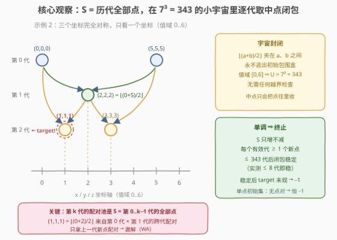
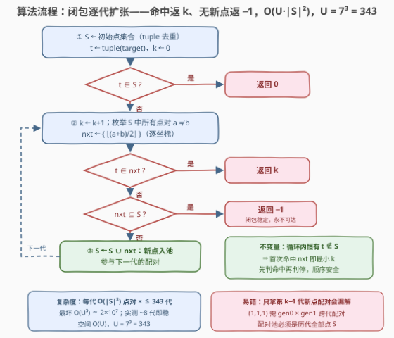

# LeetCode 得到目标点的最少代数 题解

## 1. 题目概述

- **标题 / 题号**：得到目标点的最少代数（#3923，medium）
- **链接**：https://leetcode.cn/problems/minimum-generations-to-target-point/
- **难度**：中等
- **标签**：数组、哈希表、模拟

**题意**：给定三维空间中的初始点列表 `points`（`points[i] = [x_i, y_i, z_i]`），**第 0 代**即初始点集合。对每个整数 $k \ge 1$，第 $k$ 代按如下方式形成：

- 从**第 0 代到第 $k-1$ 代**产生过的所有点中，取每一对**不同**的点 $a = [x_1, y_1, z_1]$ 与 $b = [x_2, y_2, z_2]$（坐标完全相同的两个点也不能配对，一个点不能与自身配对）；
- 对每对计算 $c = [\lfloor (x_1+x_2)/2 \rfloor,\ \lfloor (y_1+y_2)/2 \rfloor,\ \lfloor (z_1+z_2)/2 \rfloor]$，全部收入第 $k$ 代；
- 第 $k$ 代中的点由历代点**同时**产生，形成之后即可参与后续代的配对。

返回使 `target` 出现在第 0 代到第 $k$ 代之中的**最小**整数 $k$；`target` 已在初始点中则返回 0；无法获得则返回 -1。

**示例 1**：

```text
输入：points = [[0,0,0],[6,6,6]], target = [3,3,3]
输出：1
解释：⌊(0+6)/2⌋ = 3，第 1 代即生成 [3,3,3]。
```

**示例 2**：

```text
输入：points = [[0,0,0],[5,5,5]], target = [1,1,1]
输出：2
解释：第 1 代：⌊(0+5)/2⌋ = 2 → [2,2,2]；
     第 2 代：⌊(0+2)/2⌋ = 1 → [1,1,1]（由第 0 代与第 1 代的点跨代配对得到）。
```

**示例 3**：

```text
输入：points = [[0,0,0],[2,2,2],[3,3,3]], target = [2,2,2]
输出：0
解释：target 已在初始点中，最小 k 为 0。
```

**示例 4**：

```text
输入：points = [[1,2,3]], target = [5,5,5]
输出：-1
解释：只有一个初始点，凑不出"不同的两点"，永远无法生成新点。
```

**约束**：

- $1 \le \text{points.length} \le 20$，$\text{points}[i] = [x_i, y_i, z_i]$
- $0 \le x_i, y_i, z_i \le 6$，$0 \le \text{target}[i] \le 6$
- 初始点集合不包含重复项

> 💡 **审题关键**：①**配对池是历代全部点**——第 $k$ 代由第 0 到 $k-1$ 代的点**同时**产生，不是只拿第 $k-1$ 代的新点互相配对（示例 2 的 $[1,1,1]$ 恰好要靠第 0 代 × 第 1 代的**跨代配对**）；②**"不同点"按整体坐标判定**——集合去重后枚举两两组合天然满足；③**值域 $[0,6]$ 是隐藏题眼**——整个三维宇宙只有 $7^3 = 343$ 个点，这决定了模拟的终止性与复杂度。

## 2. 解题思路

### 2.1 朴素直觉与两个坑

最直接的想法是照题面逐代模拟：维护"当前所有点"，每代枚举点对生成中点。但有两处必须想清楚，否则不是 WA 就是死循环：

- **坑一（配对池拿错）**：若只让第 $k-1$ 代**新产生**的点互相配对，示例 2 就会错——$[1,1,1] = \text{mid}([0,0,0], [2,2,2])$ 中，$[0,0,0]$ 是第 0 代的点、$[2,2,2]$ 是第 1 代的点，必须跨代配对；
- **坑二（不知道何时停）**：若只是无限一代代生成下去，什么时候能断定 target **永远**不会出现？没有终止判据，循环可能停不下来。

两个坑的解法是同一个：盯住**值域**。坐标 $\in [0,6]$，三维空间里总共只有 $7^3 = 343$ 个不同点——整个过程其实是**有限集合上的闭包运算**。

### 2.2 核心观察：有限宇宙上的集合闭包



**观察一（配对池 = 全部历史点）。** 维护集合 $S$ = 第 0 至 $k-1$ 代出现过的所有点，则第 $k$ 代恰是

$$\text{gen}_k = \{\, \lfloor (a+b)/2 \rfloor \;:\; a, b \in S,\ a \ne b \,\}$$

（逐坐标向下取整）。生成后将新点并入 $S$，继续下一代。

**观察二（宇宙封闭）。** $\lfloor (a_i + b_i)/2 \rfloor$ 落在 $[a_i, b_i]$ 之间——中点的每个坐标都夹在两个父点对应坐标之间，永远不会逃出初始点张成的包围盒，更不会逃出 $[0,6]^3$。宇宙大小 $U = 7^3 = 343$，**无需任何越界检查**。

**观察三（单调 + 终止）。** $S$ 只增不减。每个"有效代"至少引入 1 个新点；一旦某代的中点全部落在 $S$ 里，配对池不再变化，之后也不可能再有新点——**闭包稳定**。因此至多 $U$ 代后过程必然稳定，此时 target 还没出现就是永远不出现，返回 $-1$。又因 $\lfloor$中点$\rfloor$ 是收缩操作（可达分辨率逐代翻倍），实测任意初始集的闭包在**个位数代（≤ 8）内**就稳定。

**观察四（最小 $k$ 语义）。** 逐代模拟按 $k$ 递增推进，第一次在 $\text{gen}_k$ 里见到 target 的 $k$ 即答案；初始就有返回 0。

> 💡 **一句话总结**：$S$ 从初始点出发逐代做"两两取 $\lfloor$中点$\rfloor$"的闭包，命中 target 返回当前代号；一旦某代没有任何新点，闭包稳定，返回 $-1$。

### 2.3 算法流程图



| 步骤 | 操作 | 说明 |
|------|------|------|
| ① | $S \leftarrow$ 初始点集合（去重），$t \leftarrow$ target | 三元组 tuple/array 作哈希键 |
| ② | 若 $t \in S$：返回 0 | 对应示例 3 |
| ③ | $k{+}{=}1$，枚举 $S$ 中所有点对 $a \ne b$，得中点集合 $\text{nxt}$ | $O(\lvert S\rvert^2)$ 对，逐坐标 $\lfloor\cdot/2\rfloor$ |
| ④ | 若 $t \in \text{nxt}$：返回 $k$ | 首次命中即最小 $k$ |
| ⑤ | 若 $\text{nxt} \subseteq S$：返回 $-1$ | 闭包稳定，永不可达 |
| ⑥ | $S \leftarrow S \cup \text{nxt}$，回到 ③ | 新点入池参与后续配对 |

### 2.4 示例演算

以示例 2 `points = [[0,0,0],[5,5,5]]`、`target = [1,1,1]` 为例（三个坐标完全对称，看一个坐标即可）：

| 代 $k$ | 配对（取自 $S$） | 新点 | $S$（累计） | 命中？ |
|--------|------------------|------|-------------|--------|
| 0 | — | — | {(0,0,0), (5,5,5)} | ✗ |
| 1 | (0,0,0)×(5,5,5) | (2,2,2) | 3 个点 | ✗ |
| 2 | (0,0,0)×(5,5,5)、(0,0,0)×(2,2,2)、(5,5,5)×(2,2,2) | (1,1,1)、(3,3,3) | 5 个点 | ✓ 返回 2 |

注意第 2 代的 $(1,1,1)$ 正是**跨代配对**（第 0 代 × 第 1 代）的产物——只拿上一代新点配对的做法在这里会漏解。继续模拟：第 3 代新增 $(4,4,4)$（$\lfloor (5+3)/2 \rfloor = 4$），第 4 代再无新点，闭包稳定于 $\{0..5\}^3$ 中的对角线 6 个点——此后若 target（如 $(6,6,6)$）仍未出现，即返回 $-1$。

## 3. 参考代码

### C++

```cpp
class Solution {
  public:
    int minGenerations(vector<vector<int>>& points, vector<int>& target) {
        array<int, 3> t = {target[0], target[1], target[2]};
        set<array<int, 3>> S;
        for (auto& p : points) S.insert({p[0], p[1], p[2]});
        if (S.count(t)) return 0;

        int k = 0;
        while (true) {
            k++;
            vector<array<int, 3>> cur(S.begin(), S.end());
            set<array<int, 3>> nxt;
            for (int i = 0; i < (int)cur.size(); i++) {
                for (int j = i + 1; j < (int)cur.size(); j++) {
                    nxt.insert({(cur[i][0] + cur[j][0]) / 2,
                                (cur[i][1] + cur[j][1]) / 2,
                                (cur[i][2] + cur[j][2]) / 2});
                }
            }
            if (nxt.count(t)) return k;
            int added = 0;
            for (auto& p : nxt) added += S.insert(p).second;
            if (!added) return -1;
        }
    }
};
```

> 💡 **写法要点**：
> - 坐标非负（0..6），`/2` 即向下取整；若值域含负数需改用 `(a + b - (a + b < 0)) / 2` 式修正，本题无需；
> - `S.insert(p).second` 一步完成"插入 + 是否新点"，作为判停依据；
> - 循环内先判 $t \in \text{nxt}$ 再判停：由不变量 $t \notin S$（命中即返回、从未并入），命中时必有新点，两个判定的先后不影响正确性。

### Python

```python
class Solution:
    def minGenerations(self, points: List[List[int]], target: List[int]) -> int:
        t = tuple(target)
        S = {tuple(p) for p in points}
        if t in S:
            return 0
        k = 0
        while True:
            k += 1
            cur = list(S)
            nxt = set()
            for i in range(len(cur)):
                x1, y1, z1 = cur[i]
                for j in range(i + 1, len(cur)):
                    x2, y2, z2 = cur[j]
                    nxt.add(((x1 + x2) // 2, (y1 + y2) // 2, (z1 + z2) // 2))
            if t in nxt:
                return k
            new = nxt - S
            if not new:
                return -1
            S |= new
```

> 💡 **写法要点**：
> - 元组作哈希键进集合，枚举的是集合元素的两两组合，天然满足"不同点才可配对"；
> - `new = nxt - S` 为空是**唯一**的失败出口（闭包稳定）；单点初始集时第 1 代 `nxt` 即为空，自动落入该分支；
> - Python 的 `//` 对负数也是向下取整，与题面 floor 语义一致。

## 4. 复杂度分析

| 维度 | 复杂度 | 说明 |
|------|--------|------|
| 时间 | $O(U \cdot \lvert S\rvert^2) \le O(U^3)$，$U = 7^3 = 343$ | 有效代数 $\le U$（每代至少 1 个新点），每代枚举 $O(\lvert S\rvert^2)$ 个点对；理论最坏约 $2\times10^7$ 次基本运算，实测闭包 ≤ 8 代即稳，实际仅 ~$10^5$ 级 |
| 空间 | $O(U)$ | 集合 $S$ 与 $\text{nxt}$ 至多存下整个宇宙的 343 个点 |
| 正确性边界 | — | 单点初始集（无点对 → 恒 −1）、target 初始即在（返回 0）、跨代配对命中，均被统一流程覆盖 |

## 5. 扩展：值域放大与运算变体

**值域是本题的"隐藏题眼"。** $[0,6]$ 的小宇宙让朴素闭包模拟直接成为正解。若坐标值域放大到 $[0, C]$：

- 宇宙 $U = (C+1)^3$ 爆炸，逐代闭包在时间与空间上都不可行；
- 但收缩性仍在：一维上从 $\{0, C\}$ 出发，第 $g$ 代能分辨的格点间距约为 $C / 2^g$，填满整数格只需 $O(\log C)$ 代。此时应转向"按位构造 / 逐代可达性"的分析——代数深度仍然极浅，但必须脱离暴力模拟来证明。

**运算变体。** 把 $\lfloor (a+b)/2 \rfloor$ 换成其它结果仍落在 $[0,6]$ 内的组合函数（如 $\gcd$、按位与——它们只会把值变小、不会越界），闭包模拟与"无新点即停"的判据原样适用：**终止性只依赖"宇宙有限 + $S$ 单调不减"，与运算是否为取中点无关**。真正破坏该框架的是无限值域或非确定型运算，那就得另找结构了。

## 6. 面试要点

**Q1：第 $k$ 代的配对池是什么？为什么不能只用第 $k-1$ 代的新点？**

> 题面明说第 $k$ 代由第 0 到 $k-1$ 代的点**同时**产生。示例 2 中 $[1,1,1] = \text{mid}([0,0,0], [2,2,2])$ 是第 0 代 × 第 1 代的跨代配对；只拿上一代新点互相配对会直接漏掉它，示例 2 就 WA。

**Q2：模拟为什么一定会终止？什么时候返回 −1？**

> 值域 $[0,6]$ ⇒ 宇宙仅 $7^3 = 343$ 个点；$S$ 单调不减，每个有效代至少新增 1 点。一旦某代中点全部落在 $S$ 里，配对池不再变化，闭包稳定——此后再无新点，target 若仍未出现即返回 $-1$。特例：初始只有 1 个点，凑不出不同的点对，第 1 代就稳定。

**Q3：中点会不会"跑出"值域，需要判越界吗？**

> 不需要。$\lfloor (a_i + b_i)/2 \rfloor$ 逐坐标夹在 $[a_i, b_i]$ 之间，任何产物都在初始点包围盒内、更在 $[0,6]^3$ 内，宇宙对运算是封闭的。

**Q4：答案 $k$ 的"最小性"如何保证？**

> 逐代模拟按 $k$ 递增推进，第一次在某代中点集合里见到 target 就返回；又因循环不变量"$t \notin S$"（命中即返回、从未并入 $S$），这个 $k$ 恰是 target 首次出现的代号，天然最小。

**Q5：复杂度怎么估？会不会超时？**

> 每代枚举 $O(\lvert S\rvert^2) \le 343^2/2 \approx 5.9\times 10^4$ 个点对，有效代数至多 343，理论最坏 $O(U^3) \approx 2\times 10^7$；而 $\lfloor$中点$\rfloor$ 逐代收缩（分辨率翻倍），实测任意初始集 ≤ 8 代就闭包稳定，实际运算量 ~$10^5$ 级，轻松通过。

> 💡 **一句话总结**：配对池取历代全部点 → $S$ 在 343 点的有限宇宙上单调扩张 → 命中 target 返回当前代号、无新点即闭包稳定返回 −1，模拟即正解。

## 同类练习题

| # | 题目 | 与本题的关联 |
|---|------|-------------|
| 752 | [打开转盘锁](https://leetcode.cn/problems/open-the-lock/) | 有限状态空间上 BFS + 哈希集合去重，与本题"闭包扩张 + 判停"同款骨架 |
| 365 | [水壶问题](https://leetcode.cn/problems/water-and-jug-problem/) | 状态闭包 + 判定不可达，同为"把过程建成集合上的扩张" |
| 1553 | [吃掉 N 个橘子的最少分钟数](https://leetcode.cn/problems/minimum-number-of-days-to-eat-n-oranges/) | 按"天"分层扩张、记忆化去重，与本题"最小代数"的分层语义同构 |
| 994 | [腐烂的橘子](https://leetcode.cn/problems/rotting-oranges/) | 逐分钟分层感染，对应本题"第 $k$ 代同时产生"的层语义 |
| 815 | [公交路线](https://leetcode.cn/problems/bus-routes/) | 分层 BFS，上一层的产出立即参与下一层扩张——正是"新点入池"的放大版 |
