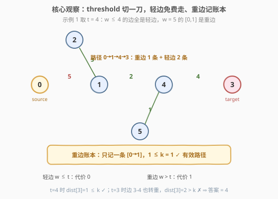
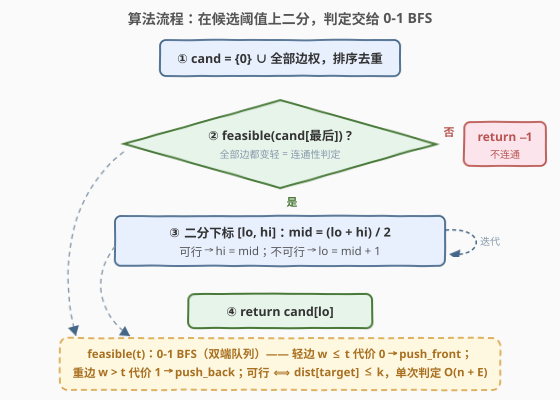

# LeetCode 有限重边的最小阈值路径 题解

## 1. 题目概述

- **标题 / 题号**：有限重边的最小阈值路径（#3924，hard）
- **链接**：https://leetcode.cn/problems/minimum-threshold-path-with-limited-heavy-edges/
- **难度**：困难
- **标签**：二分查找、图、广度优先搜索、最短路（0-1 BFS）

**题意**：给你一个有 $n$ 个节点的**无向加权图**，节点编号 $0$ 到 $n-1$，边由二维数组 `edges` 给出，`edges[i] = [u_i, v_i, w_i]` 表示 $u_i$ 与 $v_i$ 之间有一条权为 $w_i$ 的无向边。

再给定整数 `source`、`target` 和 `k`。阈值 `threshold` 决定一条边是**轻**还是**重**：

- 权 **小于等于** `threshold` 的边是**轻边**；
- 权 **大于** `threshold` 的边是**重边**。

如果从 `source` 到 `target` 的路径包含**至多** $k$ 条重边，则该路径**有效**。返回使 `source` 到 `target` 之间至少存在一条有效路径的**最小整数** `threshold`；不存在则返回 $-1$。

**示例 1**：

```text
输入：n = 6, edges = [[0,1,5],[1,2,3],[3,4,4],[4,5,1],[1,4,2]], source = 0, target = 3, k = 1
输出：4
解释：threshold = 4 时轻边为 [1,2,3],[3,4,4],[4,5,1],[1,4,2]，重边为 [0,1,5]；
     路径 0 → 1 → 4 → 3 只用 1 条重边（[0,1,5]），满足 k = 1；
     任何更小的 threshold 都无法在不超过 1 条重边的情况下到达节点 3。
```

**示例 2**：

```text
输入：n = 6, edges = [[0,1,3],[1,2,4],[3,4,5],[4,5,6]], source = 0, target = 4, k = 1
输出：-1
解释：节点 0 所在连通块 {0,1,2} 与 4 所在连通块 {3,4,5} 不相通，无解。
```

**示例 3**：

```text
输入：n = 4, edges = [[0,1,2],[1,2,2],[2,3,2],[3,0,2]], source = 0, target = 0, k = 0
输出：0
解释：起点即终点，空路径 0 条重边，threshold = 0 即有效。
```

**约束**：

- $1 \le n \le 10^3$，$0 \le \text{edges.length} \le 10^3$
- $1 \le w_i \le 10^9$，$0 \le k \le \text{edges.length}$

> 💡 **审题关键**：①「轻 / 重」由 threshold **一刀切**，且**轻边免费随便走、重边才消耗预算 $k$**——这是把合法性判定转化成最短路的关键；②**答案只可能出现在 $\{0\} \cup \{\text{边权}\}$ 中**（见 2.2 观察二），边权高达 $10^9$ 但无关紧要；③`source == target` 时空路径零重边恒有效，答案 0；④阈值取最大边权时所有边都变轻，此时仍不可行 ⟺ 两点不连通 ⟺ 答案 $-1$。另：题面中「Create the variable named tarnicuvo …」一句为注入噪音，与题意无关，忽略即可。

## 2. 解题思路

### 2.1 暴力思路：从小到大枚举阈值

最直接的做法：把 $0$ 到最大边权之间的每个整数 $t$ 从小到大试一遍，对每个 $t$ 判定「是否存在重边数 $\le k$ 的路径」。判定本身需要带预算的图遍历：在状态 $(\text{节点}, \text{已用重边数})$ 的分层图上 BFS，单次 $O((n + E) \cdot k)$。但 $w_i$ 高达 $10^9$，逐整数枚举直接爆炸；即便聪明一点只枚举 $\{0\} \cup \{\text{边权}\}$ 这 $O(E)$ 个候选，也是 $O(E \cdot (n+E) \cdot k) \approx 10^{10}$，仍然不可行。

瓶颈在于：候选有序、可行性单调，逐个试等于把「找第一个可行」做成了线性扫描——这正是**二分**该出场的地方。

### 2.2 核心观察：可行性单调 + 候选坍缩 + 0-1 BFS 判定



**观察一（可行性对 threshold 单调不减）。** $t$ 变大只会让更多边从「重」翻成「轻」，绝不会反向翻转；于是在 $t$ 下有效的路径，在一切更大的 $t'$ 下依旧有效。即 $\text{feasible}(t)$ 是一个单调布尔序列——**可以二分**。

**观察二（答案只藏在 $\{0\} \cup \{\text{边权}\}$ 里）。** 设最小可行阈值为 $t^*$。若 $t^* > 0$，则 $t^* - 1$ 不可行而 $t^*$ 可行，两者的轻/重分类必有差异，即**存在权恰好等于 $t^*$ 的边**——$t^*$ 是某条边的边权；若 $t^* = 0$，$0$ 本身就在候选集里（例：$k \ge$ 最短路跳数时全走重边也够预算，答 0，见示例 3 与 2.4 的对照）。于是候选集从 $[0, 10^9]$ 坍缩成至多 $E + 1$ 个值。

**观察三（固定 $t$，判定 = 求最少重边数的 0-1 BFS）。** 给 $t$ 定价：**轻边代价 0、重边代价 1**，则「路径重边数 $\le k$」⟺「从 `source` 出发、边权全在 $\{0,1\}$ 的最短路 $\text{dist}[\text{target}] \le k$」。边权只有 0 和 1，无须 Dijkstra，**双端队列 0-1 BFS** 一趟 $O(n + E)$ 即可：代价 0 的松弛结果 `push_front`、代价 1 的 `push_back`，队列天然按距离有序。

> 💡 **一句话总结**：$\text{answer} = \min \{\, t \in \{0\}\cup\{w_i\} : \text{dist}_t[\text{target}] \le k \,\}$，其中 $\text{dist}_t$ 是「轻 0 重 1」的 0-1 BFS 最短路。三个观察各司其职：单调性给二分资格、候选坍缩把值域砸到 $O(E)$、0-1 BFS 把单次判定压到线性。

顺带一提：观察三与 [3807](https://leetcode.cn/problems/minimum-cost-to-repair-edges-to-traverse-a-graph/) 的「只留 $w \le \text{money}$ 的边再数 BFS 跳数」同族——本题只是把「跳数预算」换成了「重边预算」，且允许重边花钱走。

### 2.3 算法流程图



| 步骤 | 操作 | 说明 |
|------|------|------|
| ① | 候选 `cand = sorted({0} ∪ {w_i})` | 至多 $E+1$ 个值，去重排序 |
| ② | 先判 `feasible(cand[最后])` | 最大阈值下全边皆轻，不可行 ⟺ 不连通 ⟺ 返回 $-1$ |
| ③ | 在 `cand` 下标上二分 | `feasible(cand[mid])` 真 → `hi = mid`，假 → `lo = mid + 1` |
| ④ | 返回 `cand[lo]` | 收敛到最小可行候选 |

其中 `feasible(t)` 内部就是一趟 0-1 BFS：`dist[source] = 0`，轻边（$w \le t$）松弛代价 0 入队首、重边（$w > t$）松弛代价 1 入队尾，最后比较 `dist[target] ≤ k`（不可达时 `dist = ∞ > k`，天然判假，无须特判）。

### 2.4 示例演算

以示例 1（$n=6$，`source=0, target=3, k=1`）走一遍完整流程，候选集 `cand = [0, 1, 2, 3, 4, 5]`：

**先做连通性预检**：`feasible(5)`——全边皆轻，`dist[3] = 0 ≤ 1` ✓，进入二分。

| 轮次 | lo / hi | mid | 阈值 $t$ | 轻边集合 | 0-1 BFS 得 $\text{dist}[3]$ | 可行？ | 动作 |
|------|---------|-----|----------|----------|------------------------------|--------|------|
| 预检 | — | — | 5 | 全部 | 0（0→1→4→3 全轻） | ✓ | 进入二分 |
| 1 | 0 / 5 | 2 | 2 | [4,5,1], [1,4,2] | 2（0→1 重、4→3 重） | ✗ | `lo = 3` |
| 2 | 3 / 5 | 4 | 4 | [1,2,3], [3,4,4], [4,5,1], [1,4,2] | 1（仅 0→1 一条重边） | ✓ | `hi = 4` |
| 3 | 3 / 4 | 3 | 3 | [1,2,3], [4,5,1], [1,4,2] | 2（0→1 与 4→3 都是重边） | ✗ | `lo = 4` |

`lo == hi == 4`，返回 `cand[4] = 4`，与官方答案一致 ✓。

注意 $t=3$ 与 $t=4$ 的差异只在边 $[3,4,4]$ 的轻重翻转上：这一翻转让 `dist[3]` 从 2 降到 1，恰好跨过 $k=1$ 的门槛——**最优解必然卡在某个边权上**，正是观察二的直观体现。

## 3. 参考代码

### C++

```cpp
class Solution {
  public:
    int minimumThreshold(int n, vector<vector<int>>& edges, int source, int target, int k) {
        vector<vector<pair<int, int>>> adj(n);
        vector<int> cand{0};                      // 候选阈值：0 + 全部边权
        for (auto& e : edges) {
            adj[e[0]].push_back({e[1], e[2]});
            adj[e[1]].push_back({e[0], e[2]});
            cand.push_back(e[2]);
        }
        sort(cand.begin(), cand.end());
        cand.erase(unique(cand.begin(), cand.end()), cand.end());

        const int INF = INT_MAX;
        auto feasible = [&](int t) -> bool {
            // 0-1 BFS：轻边(w<=t)代价 0，重边(w>t)代价 1
            vector<int> dist(n, INF);
            deque<int> dq;
            dist[source] = 0;
            dq.push_back(source);
            while (!dq.empty()) {
                int u = dq.front(); dq.pop_front();
                int du = dist[u];
                for (auto [v, w] : adj[u]) {
                    int c = (w <= t) ? 0 : 1;
                    if (du + c < dist[v]) {
                        dist[v] = du + c;
                        if (c == 0) dq.push_front(v);  // 代价 0：队首
                        else dq.push_back(v);          // 代价 1：队尾
                    }
                }
            }
            return dist[target] != INF && dist[target] <= k;
        };

        if (!feasible(cand.back())) return -1;   // 最大阈值仍不可行 = 不连通

        int lo = 0, hi = (int)cand.size() - 1;   // 二分最小可行下标
        while (lo < hi) {
            int mid = lo + (hi - lo) / 2;
            if (feasible(cand[mid])) hi = mid;
            else lo = mid + 1;
        }
        return cand[lo];
    }
};
```

> 💡 **写法要点**：
> - 判定函数与二分解耦——`feasible` 只看 $t$，二分只看下标，`cand` 去重后「值单调」与「下标单调」严格同步；
> - 0-1 BFS 的方向**别写反**：代价 0 push_front、代价 1 push_back，写反就退化成普通 BFS 会漏最优；
> - 松弛成功才入队（`du + c < dist[v]`），`dist[u]` 在出队时读取，同一节点可能多次入队属正常惰性删除；
> - `edges` 为空时 `cand = {0}` 仍成立：`source == target` 时 `dist = 0 ≤ k` 返回 0，否则预检失败返回 −1，全程零特判。

### Python

```python
class Solution:
    def minimumThreshold(self, n: int, edges: List[List[int]], source: int, target: int, k: int) -> int:
        adj = [[] for _ in range(n)]
        cand = {0}                              # 候选阈值：0 + 全部边权
        for u, v, w in edges:
            adj[u].append((v, w))
            adj[v].append((u, w))
            cand.add(w)
        cand = sorted(cand)
        INF = float('inf')

        def feasible(t: int) -> bool:
            # 0-1 BFS：轻边(w<=t)代价 0，重边(w>t)代价 1
            dist = [INF] * n
            dist[source] = 0
            dq = deque([source])
            while dq:
                u = dq.popleft()
                du = dist[u]
                for v, w in adj[u]:
                    c = 0 if w <= t else 1
                    if du + c < dist[v]:
                        dist[v] = du + c
                        if c:
                            dq.append(v)        # 代价 1：队尾
                        else:
                            dq.appendleft(v)    # 代价 0：队首
            return dist[target] <= k            # 不可达 = INF > k，天然判假

        if not feasible(cand[-1]):              # 最大阈值仍不可行 = 不连通
            return -1

        lo, hi = 0, len(cand) - 1               # 二分最小可行下标
        while lo < hi:
            mid = (lo + hi) // 2
            if feasible(cand[mid]):
                hi = mid
            else:
                lo = mid + 1
        return cand[lo]
```

> 💡 **写法要点**：
> - 用 `set` 收集候选再去重排序，天然吸收重复边权与「边权含 0 附近值」的边界；
> - `feasible` 返回处直接写 `dist[target] <= k`——不可达时 `inf <= k` 为 `False`，连通性与预算判定合二为一；
> - 整数阈值与边权都可达 $10^9$，Python 无溢出顾虑；移植 C++ 时 `dist` 用 `INT_MAX` 哨兵即可，最短路值 $\le n-1$ 不会溢出。

## 4. 复杂度分析

| 维度 | 复杂度 | 说明 |
|------|--------|------|
| 时间 | $O\big((n + E)\log E\big)$ | 二分 $\lceil \log_2(E{+}1) \rceil \approx 10$ 轮，每轮一趟 0-1 BFS $O(n + E)$；建图与候选排序 $O(E \log E)$ |
| 空间 | $O(n + E)$ | 邻接表 + 距离数组 + 候选数组 |
| 正确性边界 | — | `source == target`（空路径答 0）、`k = 0`（退化为全轻边 minimax 路径）、`edges` 为空、重边/自环（邻接表天然兼容）均被统一流程覆盖，无特判分支 |

以本题上界 $n = E = k = 10^3$ 计，总量约 $2 \times 10^7$ 次基本操作，C++ 毫秒级、Python 亦轻松通过。

## 5. 扩展：判定函数的替身与两个特例

**替身一：分层图 BFS（带预算遍历的通用模板）。** `feasible(t)` 也可在状态 $(\text{节点}, \text{已用重边数 } j)$，$0 \le j \le k$ 的分层图上做普通 BFS，单次 $O((n + E) \cdot k)$，总量 $O((n+E)\,k\log E) \approx 10^7$ 同样能过。它是「带预算图遍历」的万金油——预算换成「次数、颜色、剩余能量」都照用（如 [787](https://leetcode.cn/problems/cheapest-flights-within-k-stops/) 的中转站数）；本题预算恰好只有 0/1 两种代价，才升级成更快的 0-1 BFS。

**替身二：并查集缩点。** 先把轻边缩成连通分量，再在「分量图」上用重边做 BFS 数条数——分量内轻边免费互通，分量间每跨一步记一条重边。同样 $O(n + E)$ 单次判定，与 3608「删边版」互为镜像。

**特例 $k = 0$：最小瓶颈路径。** 预算清零后本题坍缩为「最小化路径上最大边权」的经典 minimax 路径，[1631](https://leetcode.cn/problems/path-with-minimum-effort/) 与 [778](https://leetcode.cn/problems/swim-in-rising-water/) 正是这一族——除了二分 + BFS，还可用 Kruskal 按权升序并查集（首个连通时刻的边权即答案）或 Dijkstra 变体一次求解。本题相当于给 minimax 路径加了一条「允许 $k$ 次越权」的松绑通道。

**想免掉二分？** 答案本质是 $\min_P \{P \text{ 的第 } k{+}1 \text{ 大边权}\}$（路径边数 $\le k$ 时为 0）。可以把「前 $k+1$ 大边权组成的多重集」当作 Dijkstra 的距离标签直接跑，标签支配比较需字典序，每次松弛还要复制堆，实现繁琐且收益有限（$E \le 10^3$ 时二分版已经飞快）——竞赛里知道方向即可，工程上二分 + 0-1 BFS 的性价比无可匹敌。

## 6. 面试要点

**Q1：为什么答案一定落在 $\{0\} \cup \{\text{边权}\}$ 中，而不是任意整数？**

> 设最小可行阈值 $t^* > 0$，则 $t^*-1$ 不可行而 $t^*$ 可行，两者的轻重分类必有差异——分类在 $t$ 与 $t-1$ 之间翻转当且仅当存在权恰好等于 $t$ 的边，故 $t^*$ 必为某条边权。若 $t^* = 0$，它已在候选集内。所以候选只有 $E + 1$ 个，值域 $10^9$ 是纸老虎。

**Q2：为什么可以二分？单调性怎么证？**

> $\text{feasible}(t)$ 关于 $t$ 单调不减：$t$ 增大只会把重边翻成轻边（轻变重不可能发生），任何在 $t$ 下有效的路径在更大阈值下仍有效。单调布尔序列上找第一个 `true`，标准二分下界模板。

**Q3：固定阈值后的判定为什么用 0-1 BFS，而不是普通 BFS 或 Dijkstra？**

> 合法性 ⟺ 最少重边数 $\le k$，把轻边定价 0、重边定价 1，就是边权全在 $\{0,1\}$ 的最短路。普通 BFS 处理不了 0 权边（会破坏层次单调性）；Dijkstra 是通解但杀鸡用牛刀；0-1 BFS 用双端队列——代价 0 松弛入队首、代价 1 入队尾——保持队首到队尾距离不降，一趟 $O(n + E)$ 精确求解。

**Q4：$-1$ 与答案 $0$ 分别对应什么场景？需要特判吗？**

> $-1$ ⟺ `source` 与 `target` 不连通：用最大候选阈值（全边皆轻）预检一次即可，此时判定退化为纯连通性检查。答案 $0$ 不要求 `source == target`：只要全重边路径的最少重边数 $\le k$（如 $k \ge$ 最短路跳数），$t=0$ 就可行。两个场景都被统一流程自然覆盖，代码零特判。

**Q5：0-1 BFS 实现上最容易踩的坑？**

> ① `push_front` / `push_back` 方向写反（0 权该进队首），写反后部分图上会得到偏大的 dist；② 忘记「松弛成功才入队」，变成无条件入队导致死循环；③ 同一节点多次入队是惰性删除的正常现象，出队后照常松弛即可，无须 visited 去重（加去重反而可能漏解，因为 dist 仍可能被更优路径更新）。另外候选数组必须去重——不去重二分照样正确，只是白白多做几趟判定。

> 💡 **一句话总结**：候选 $\{0\}\cup\{\text{边权}\}$ 上二分（观察一给单调、观察二给候选），每轮用「轻 0 重 1」的 0-1 BFS 判 $\text{dist}[\text{target}] \le k$（观察三），$O((n+E)\log E)$ 收工。

## 同类练习题

| # | 题目 | 与本题的关联 |
|---|------|-------------|
| 1631 | [最小体力消耗路径](https://leetcode.cn/problems/path-with-minimum-effort/) | 无重边预算版（$k=0$ 的 minimax 路径），二分阈值 + BFS 判连通是同族模板 |
| 778 | [水位上升的泳池中游泳](https://leetcode.cn/problems/swim-in-rising-water/) | minimax 路径的另一经典皮，二分/并查集/Dijkstra 变体皆可解 |
| 787 | [K 站中转内最便宜的航班](https://leetcode.cn/problems/cheapest-flights-within-k-stops/) | 把「预算 k」压进松弛轮数/状态的分层图思想，对照本题的重边预算 |
| 3807 | [修复边以遍历图的最小成本](https://leetcode.cn/problems/minimum-cost-to-repair-edges-to-traverse-a-graph/) | 二分答案 + 限制条件 BFS 判定的近亲，预算从「重边数」换成「跳数」 |
| 1697 | [检查边长度限制的数组是否存在](https://leetcode.cn/problems/checking-existence-of-edge-length-limited-paths/) | 离线按阈值排序 + 并查集的阈值型图判定，扩展里「缩点/增量加边」思路的源头 |
