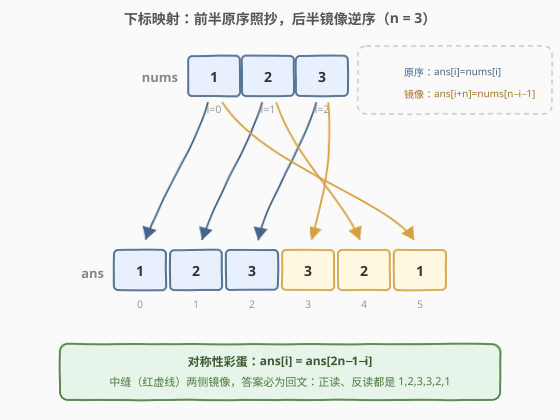
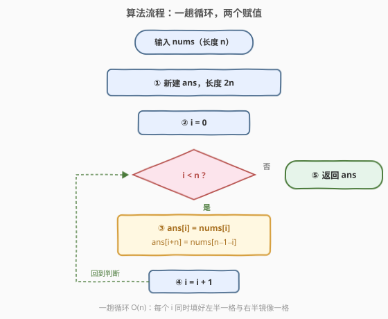

# LeetCode 连接逆序数组 题解

## 1. 题目概述

- **标题 / 题号**：连接逆序数组（#3925，easy）
- **链接**：https://leetcode.cn/problems/concatenate-array-with-reverse/
- **难度**：简单
- **标签**：数组、模拟

**题意**：给你一个长度为 $n$ 的整数数组 $nums$。构造一个长度为 $2n$ 的新数组 $ans$：

- **前半**：与 $nums$ 完全相同，即 $ans[i] = nums[i]$；
- **后半**：为 $nums$ 的逆序，即 $ans[i+n] = nums[n-1-i]$。

以上两个映射对一切 $0 \le i \le n-1$ 成立。返回数组 $ans$。

**示例 1**：

```text
输入：nums = [1,2,3]
输出：[1,2,3,3,2,1]
解释：前 3 个元素与 nums 相同；后 3 个元素按 nums 的逆序填入：
     ans[3] = nums[2] = 3，ans[4] = nums[1] = 2，ans[5] = nums[0] = 1。
```

**示例 2**：

```text
输入：nums = [1]
输出：[1,1]
解释：长度为 1 的数组逆序后保持不变，前后两半都是 [1]。
```

**约束**：

- $1 \le nums.length \le 100$
- $1 \le nums[i] \le 100$

> 💡 **审题关键**：本题没有陷阱，唯二要弄清的是两个**下标映射**——后半的第 $i$ 个位置是全局下标 $i+n$，取值来自 $nums[n-1-i]$；注意是「逆序**抄写**到新数组」，**不是**把前半原地反转。

## 2. 解题思路

### 2.1 朴素思路：两趟写法

最直接的写法分两步：

1. 把 $nums$ 整个复制进 $ans$ 的前半（或直接拼接一份 $nums$）；
2. 倒序遍历 $nums$（$i$ 从 $n-1$ 到 $0$），逐个把元素追加到 $ans$ 尾部。

$n \le 100$，两趟当然能过。但仔细看两个下标映射：$ans[i] = nums[i]$ 与 $ans[i+n] = nums[n-1-i]$ **都只由循环变量 $i$ 决定**——第二趟的倒序遍历完全可以并进第一趟，一个 $i$ 同时填两个格子。

### 2.2 核心观察：一趟循环 + 对称下标映射



**观察一（两个映射共享同一个 $i$）。** 对每个 $0 \le i \le n-1$：

$$ans[i] = nums[i] \qquad ans[i+n] = nums[n-1-i]$$

左半第 $i$ 格照抄 $nums[i]$；右半第 $i$ 格（全局位置 $i+n$）取 $nums[n-1-i]$。一趟循环、每轮两个赋值，前后两半同时填满。

**观察二（镜像位成对出现）。** 位置 $i$ 与位置 $2n-1-i$ 关于中缝对称——两者下标之和恒为 $2n-1$。一轮循环填的正是这样一对**镜像位**，分别取 $nums$ 的第 $i$ 个与倒数第 $i+1$ 个元素。也可以换用**双指针**从 $ans$ 两端向中间填：$l = 0$、$r = 2n-1$，每轮令 $ans[l] = ans[r] = nums[i]$，效果完全等价。

**观察三（答案必为回文）。** 由构造直接可得 $ans[i] = ans[2n-1-i]$——整个 $ans$ 是一个**回文数组**。这解释了示例 1 的 `1,2,3,3,2,1`：正读反读完全一样。这个性质还可以当**自检工具**：写完后验证 $ans[i] == ans[2n-1-i]$，即可确认后半没有填错方向。

> 💡 **一句话总结**：一趟循环，每个 $i$ 同时写 $ans[i]$（照抄）与 $ans[i+n]$（镜像取 $nums[n-1-i]$）；答案天然回文，可用对称性自检。

### 2.3 算法流程图



| 步骤 | 操作 | 说明 |
|------|------|------|
| ① | 新建长度 $2n$ 的 $ans$ | C++ `vector<int> ans(2 * n)`；Python `[0] * (2 * n)` |
| ② | $i = 0$ | 循环变量，同时驱动两个映射 |
| ③ | $ans[i] = nums[i]$；$ans[i+n] = nums[n-1-i]$ | 一轮填左半一格 + 右半镜像一格 |
| ④ | $i = i + 1$，回到判断 | 循环 $n$ 轮后两半恰好同时填满 |
| ⑤ | $i \ge n$ 时返回 $ans$ | — |

### 2.4 示例演算

以 $nums = [1,2,3]$（$n = 3$）为例：

| 轮次 $i$ | $ans[i] = nums[i]$ | $ans[i+n] = nums[n-1-i]$ | $ans$ 当前状态 |
|---------|--------------------|--------------------------|----------------|
| $i=0$ | $ans[0] = 1$ | $ans[3] = nums[2] = 3$ | `[1, _, _, 3, _, _]` |
| $i=1$ | $ans[1] = 2$ | $ans[4] = nums[1] = 2$ | `[1, 2, _, 3, 2, _]` |
| $i=2$ | $ans[2] = 3$ | $ans[5] = nums[0] = 1$ | `[1, 2, 3, 3, 2, 1]` ✓ |

边界 $n = 1$：唯一一轮 $i=0$ 填 $ans[0] = ans[1] = nums[0]$，得 `[1,1]` ✓——单元素数组逆序不变，前后两半相同，统一映射天然覆盖，无需特判。

## 3. 参考代码

### C++

```cpp
class Solution {
  public:
    vector<int> concatWithReverse(vector<int>& nums) {
        int n = nums.size();
        vector<int> ans(2 * n);
        for (int i = 0; i < n; i++) {
            ans[i] = nums[i];              // 左半：原序照抄
            ans[i + n] = nums[n - 1 - i];  // 右半：镜像逆序
        }
        return ans;
    }
};
```

> 💡 **写法要点**：
> - `ans` 预先开好 $2n$ 大小再按下标写入，比逐个 `push_back` 更直白，也免去讨论容量增长；
> - 两个赋值共享循环变量 $i$，第二个下标是 `n - 1 - i` 而非 `n - i`，代入 $i=0$ 自查：应取到 $nums[n-1]$（最后一个元素）。

### Python

```python
class Solution:
    def concatWithReverse(self, nums: list[int]) -> list[int]:
        n = len(nums)
        ans = [0] * (2 * n)
        for i in range(n):
            ans[i] = nums[i]
            ans[i + n] = nums[n - 1 - i]
        return ans
```

> 💡 **写法要点**：
> - Python 可以一行完成：`return nums + nums[::-1]`——`nums[::-1]` 产生逆序副本，`+` 拼接两段，语义与题意逐字对应；
> - 面试建议先写显式循环版（把下标映射讲清楚），再补一句切片一行版展示语言熟练度；两者复杂度同为 $O(n)$。

## 4. 复杂度分析

| 维度 | 复杂度 | 说明 |
|------|--------|------|
| 时间 | $O(n)$ | 一趟循环，每轮两个 $O(1)$ 赋值 |
| 空间 | $O(1)$ 额外空间 | 不计输出数组；输出本身占 $O(n)$（题目要求返回 $2n$ 数组，不可避免） |
| 正确性边界 | — | $n=1$（前后两半相同）由统一映射覆盖，无需特判 |

## 5. 扩展：变体与不变量

**变体一：双指针从两端向中间填。** 观察二的直接推论：$l = 0$、$r = 2n-1$，每轮 $ans[l] = ans[r] = nums[i]$，随后 $l{+}{+}$、$r{-}{-}$、$i{+}{+}$。写法不同、填法等价，适合用来验证自己对「镜像位」的理解是否到位。

**变体二：不落盘整个 $ans$。** 若 $n$ 极大且结果只需流式消费（逐个打印、喂给下游），可用生成器先产出 $nums$ 再产出其逆序，额外空间除 $nums$ 本身外为 $O(1)$。

**不变量（自检工具）。** 「$ans$ 是回文」这一性质与具体实现无关——任何正确实现都满足 $ans[i] = ans[2n-1-i]$。调试时加一行断言，即可快速定位「后半填错方向」（比如误写成 $nums[n-i]$）这类笔误。

## 6. 面试要点

**Q1：$ans[i+n]$ 为什么取 $nums[n-1-i]$？怎么现场推导？**

> 后半的第 $i$ 个位置是全局下标 $i+n$；「逆序」意味着它对应 $nums$ 的**倒数第 $i+1$** 个元素，而下标 = $n - (i+1) = n-1-i$。代入 $i=0$ 验证：应取 $nums[n-1]$（最后一个元素），与示例一致。

**Q2：答案为什么一定是回文？**

> $ans[i] = nums[i]$；而 $ans[2n-1-i] = ans[n+(n-1-i)] = nums[n-1-(n-1-i)] = nums[i]$。两者相等，即位置 $i$ 与 $2n-1-i$ 处处相同——整个数组关于中缝对称。

**Q3：空间复杂度怎么答？**

> 习惯上**输出不计入**额外空间：除返回的 $2n$ 数组外只用了常数个变量，额外空间 $O(1)$。若面试官把输出也算进去，则总体 $O(n)$。两种口径都主动提一句更稳妥。

**Q4：`nums + nums[::-1]` 和手写循环，面试选哪个？**

> 先写手写循环——它暴露你对下标映射的理解，是本题考点本身；随后主动补充切片一行版，说明熟悉语言惯用法。两者时间都是 $O(n)$，切片版会额外产生一份 $n$ 大小的临时副本（`nums[::-1]`），但仍在同一量级。

**Q5：如果不建新数组、要求在 $nums$ 自身基础上扩展（容量足够），怎么做？**

> 把 $nums$ 扩容到 $2n$ 后，**倒序**遍历原前半追加：`for i in range(n - 1, -1, -1): nums.append(nums[i])`——先追加 $nums[n-1]$ 落在位置 $n$，最后追加 $nums[0]$ 落在位置 $2n-1$。注意不能正序追加：正序追加得到的是原序副本而非逆序。

> 💡 **一句话总结**：一趟循环两个赋值（$ans[i]$ 照抄、$ans[i+n]$ 镜像），答案天然回文；Python 记住 `nums + nums[::-1]`，C++ 记住是 `n - 1 - i` 别写成 `n - i`。

## 同类练习题

| # | 题目 | 与本题的关联 |
|---|------|-------------|
| 1929 | [数组串联](https://leetcode.cn/problems/concatenation-of-array/) | 拼接两份自身，就是本题去掉「逆序」的版本 |
| 1920 | [基于排列构建数组](https://leetcode.cn/problems/build-array-from-permutation/) | 同款「按下标映射构造新数组」的基本功 |
| 1480 | [一维数组的动态和](https://leetcode.cn/problems/running-sum-of-1d-array/) | 一趟线性扫描构造新数组 |
| 832 | [翻转图像](https://leetcode.cn/problems/flipping-an-image/) | 行内水平翻转，「逆序抄写」的直接练习 |
| 977 | [有序数组的平方](https://leetcode.cn/problems/squares-of-a-sorted-array/) | 双指针从两端向中间填结果，与本题「镜像位」思想呼应 |
