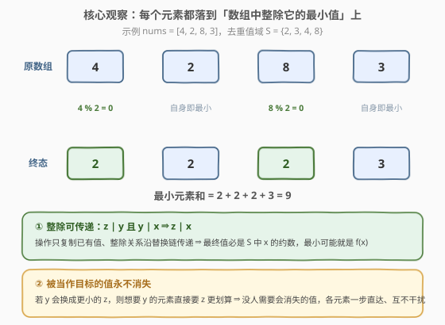
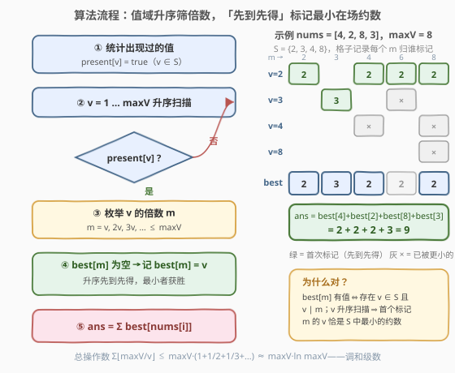

# LeetCode 可整除替换后的数组最小元素和 题解

## 1. 题目概述

- **标题 / 题号**：可整除替换后的数组最小元素和（#3927，medium）
- **链接**：https://leetcode.cn/problems/minimize-array-sum-using-divisible-replacements/
- **难度**：中等
- **标签**：贪心、数组、哈希表、数学、数论

**题意**：给你一个整数数组 `nums`。你可以执行以下操作**任意多次**：

- 选择两个下标 `a` 和 `b`，满足 $\text{nums}[a] \bmod \text{nums}[b] = 0$；
- 将 $\text{nums}[a]$ 替换为 $\text{nums}[b]$。

返回执行任意次操作后，数组可能得到的**最小元素和**。

**示例 1**：

```text
输入：nums = [3,6,2]
输出：7
解释：6 % 2 == 0，把 6 换成 2，数组变为 [3,2,2]，和为 7。
```

**示例 2**：

```text
输入：nums = [4,2,8,3]
输出：9
解释：4 → 2、8 → 2，数组变为 [2,2,2,3]，和为 9。
```

**示例 3**：

```text
输入：nums = [7,5,9]
输出：21
解释：不存在 nums[a] % nums[b] == 0 的下标对，无法操作，和保持 21。
```

**约束**：

- $1 \le \text{nums.length} \le 10^5$
- $1 \le \text{nums}[i] \le 10^5$

> 💡 **审题关键**：①操作条件依赖**当前**数组状态——`nums[b]` 之后变了，已替换的 `nums[a]` 不会跟着变，所以不能无脑按"原始整除关系"模拟；②替换只是**复制已有值**，数组的取值集合只会缩小、不会出现新值；③求和最小化 ⇒ 每个元素都想换成尽量小的值，关键是论证"各元素独立取最小"互不干扰。

## 2. 解题思路

### 2.1 暴力思路：枚举操作序列

最直接的想法是把每个数组状态看成一个节点，从初始状态出发 BFS 所有可达状态，取最小和。但每个位置每次可换成多个目标，状态数是指数级的，$n = 10^5$ 下完全不可行。

退一步想：我们其实不需要关心操作顺序，只需要回答一个问题——**每个元素最终能变成多小？** 直觉上，元素 $x$ 应该换成「数组中出现过的、能整除 $x$ 的最小值」。但要让它成为严谨结论，必须先堵住两个漏洞：

1. **多步链会不会更优？** 比如 $x$ 先换成 $u$、再换成某个"一步到不了"的更小值？
2. **目标会不会中途消失？** 操作依赖当前数组状态，如果我想换成的那个值先被别人换没了怎么办？

下面两条引理一次性解决这两个问题。

### 2.2 核心观察：每个元素落到「S 中整除它的最小值」



记 $S$ 为 `nums` 的**去重值集合**，并定义

$$f(x) = \min\{\, v \in S : v \mid x \,\}$$

（$x$ 整除自己且 $x \in S$，集合非空）。

**引理一（下界：多步链不产生新值）。** 操作只复制已有值，所以任何时刻数组里的值都来自 $S$。若元素 $x$ 经过一串替换 $x = u_0 \to u_1 \to \cdots \to u_k$，每一步都满足 $u_{i+1} \mid u_i$，由**整除的传递性**得 $u_k \mid x$，且 $u_k \in S$。所以**任何操作序列下，$x$ 的最终值都不小于 $f(x)$**——多步链能到达的值，必然是 $S$ 中 $x$ 的约数，那不如一步直达其中最小者。

**引理二（可达：目标值永不消失）。** 我们构造方案：把每个元素 $x$ 一步换成 $f(x)$（因 $f(x) \mid x$ 且 $f(x)$ 在场，单次操作合法）。唯一的顾虑是"轮到我操作时，目标值还在不在场"。关键在于：

> 若某个值 $y$ 会被换成更小的 $z$（即 $f(y) = z < y$，$z \mid y$），那么对任何满足 $f(x) = y$ 的元素，由 $z \mid y \mid x$ 知 $z \in S$ 且 $z \mid x$、$z < y$，与 $f(x) = y$ 矛盾。

所以**凡是被当作目标的 $y$，所有值为 $y$ 的元素的最小目标就是 $y$ 自己，它们在方案中从不动**——$y$ 永远在场，所有一步替换按任意顺序执行都合法。

**结论**：

$$\text{ans} = \sum_{x \in \text{nums}} f(x)$$

> 💡 **一句话总结**：最终值 $\in S$ 且整除原值 ⇒ 每个元素的下界是「$S$ 中整除它的最小值」；被需要的值永不被换走 ⇒ 所有下界可以同时取到，各元素独立贪心。

### 2.3 算法流程图：值域筛「先到先得」

怎么批量计算 $f(x)$？对每个 $x$ 试除枚举约数是 $O(n\sqrt{V})$；更优雅的是**反过来问**——不问"$x$ 的约数里有谁在场"，而问"**每个在场的 $v$ 能供给哪些元素**"：$v$ 整除的所有倍数 $m$ 都可以被 $v$ 替换。**从小到大**枚举在场的 $v$，给它的每个倍数 $m$ 打标记：`best[m]` 若为空则记为 $v$——**先到先得，最小的在场约数获胜**。



| 步骤 | 操作 | 说明 |
|------|------|------|
| ① | `present[v]` 标记出现过的值 | $O(n)$ 收集 $S$ |
| ② | $v$ 从 $1$ 到 $\text{maxV}$ 升序扫描 | 不在场的直接跳过 |
| ③ | 枚举 $v$ 的倍数 $m = v, 2v, 3v, \dots$ | $m \le \text{maxV}$ |
| ④ | `best[m]` 为空则记为 $v$ | 升序先到先得 ⇒ 最小的在场约数 |
| ⑤ | $\text{ans} = \sum \text{best}[\text{nums}[i]]$ | 64 位累加 |

### 2.4 示例演算

以 `nums = [4, 2, 8, 3]` 为例，$S = \{2, 3, 4, 8\}$，$\text{maxV} = 8$：

| 扫描到 | 尝试标记的倍数 | `best` 变化 |
|--------|----------------|-------------|
| $v=2$ | $2, 4, 6, 8$ 全部首次标记 | `best[2]=best[4]=best[6]=best[8]=2` |
| $v=3$ | $3$ 首次标记；$6$ 已被 $2$ 占据 | `best[3]=3` |
| $v=4$ | $4, 8$ 均已被占据 | 无变化 |
| $v=8$ | $8$ 已被占据 | 无变化 |

查询数组元素：`best[4]=2`、`best[2]=2`、`best[8]=2`、`best[3]=3`，故 $\text{ans} = 2+2+2+3 = 9$ ✓。

再验两例：示例 1 中 $S=\{2,3,6\}$，`best[3]=3`（$6 mid 3$）、`best[6]=2`、`best[2]=2`，和为 $7$ ✓；示例 3 中 $7,5,9$ 两两互不整除，各自保持，和为 $21$ ✓。

## 3. 参考代码

### C++

```cpp
class Solution {
  public:
    long long minArraySum(vector<int>& nums) {
        int maxV = *max_element(nums.begin(), nums.end());
        vector<char> present(maxV + 1, 0);
        for (int x : nums) present[x] = 1;

        vector<int> best(maxV + 1, 0);
        for (int v = 1; v <= maxV; v++) {
            if (!present[v]) continue;
            for (int m = v; m <= maxV; m += v) {
                if (best[m] == 0) best[m] = v;
            }
        }

        long long ans = 0;
        for (int x : nums) ans += best[x];
        return ans;
    }
};
```

> 💡 **写法要点**：
> - 返回值是 `long long`：最坏 $10^5$ 个 $10^5$ 相加达 $10^{10}$，超出 32 位；
> - `present` 用 `vector<char>` 而非 `vector<bool>` 亦可，量级 $10^5$ 不敏感；
> - 「先到先得」由**外层 $v$ 升序 + 内层只填空格**共同保证，二者缺一不可。

### Python

```python
class Solution:
    def minArraySum(self, nums: List[int]) -> int:
        max_v = max(nums)
        present = [False] * (max_v + 1)
        for x in nums:
            present[x] = True

        best = [0] * (max_v + 1)
        for v in range(1, max_v + 1):
            if not present[v]:
                continue
            for m in range(v, max_v + 1, v):
                if best[m] == 0:
                    best[m] = v

        return sum(best[x] for x in nums)
```

> 💡 **写法要点**：
> - 数组元素 $x$ 必属于 $S$，故 `best[x]` 一定非零（$v = x$ 那轮必然标记自己），无需特判；
> - 若 $1$ 在场，`best` 全为 $1$，答案即 $n$——筛法自然覆盖，无需单独剪枝。

## 4. 复杂度分析

| 维度 | 复杂度 | 说明 |
|------|--------|------|
| 时间 | $O(n + V \log V)$ | 倍数标记总量 $\sum_{v \in S} \lfloor V/v \rfloor \le V \sum_{v=1}^{V} \frac{1}{v} \approx V \ln V$（调和级数），$V = 10^5$ 时约 $1.2 \times 10^6$ 次 |
| 空间 | $O(V)$ | `present` 与 `best` 两个值域数组 |
| 数值边界 | — | 答案上界 $10^5 \times 10^5 = 10^{10}$，C++ 需 `long long`，Python 天然无溢出 |

## 5. 扩展：值域变大时怎么办

本题值域 $V \le 10^5$，筛法（$O(V \log V)$）是首选。若值域放大到 $10^9$ 而 $n$ 只有 $10^5$，开值域数组不可行，应改回**正向视角**：把 $S$ 存入哈希集合，对每个元素 $x$ 试除枚举其全部约数 $d \le \sqrt{x}$（$d$ 与 $x/d$ 成对检查是否在集合中），取在场者最小，总复杂度 $O(n\sqrt{V})$。两种视角（"问我能被谁换" vs "问我能供给谁"）是约数问题的经典对偶，值得都练。

## 6. 面试要点

**Q1：为什么每个元素可以独立贪心取「S 中整除它的最小值」？**

> 下界由引理一保证：值只能复制、整除关系沿链传递，任何操作序列下 $x$ 的终值都是 $S$ 中 $x$ 的约数，故不小于 $f(x)$。可达性由引理二保证：被当作目标的值 $y$ 满足 $f(y) = y$（否则想换走 $y$ 的更小值 $z$ 会让所有以 $y$ 为目标的元素改投 $z$），在方案中永不被换走，所有一步替换任意排序都合法。

**Q2：多步替换能否到达"一步到不了"的更小值？**

> 不能。若 $x \to u_1 \to \cdots \to u_k$，则 $u_k \mid u_{k-1} \mid \cdots \mid x$，整除的传递性保证 $u_k \mid x$ 且 $u_k \in S$——多步能到的，一步也能到。链唯一的作用是"中转"，而中转永远不会比直达更小。

**Q3：筛法的复杂度为什么是调和级数？**

> 对每个在场的 $v$ 枚举倍数，操作数为 $\lfloor V/v \rfloor$；最坏 $S$ 包含 $1..V$ 全部值，总量 $\sum_{v=1}^{V} \lfloor V/v \rfloor \approx V \ln V$。这与埃氏筛 $O(V \log \log V)$、莫比乌斯反演的 $O(V \log V)$ 同源，是"枚举倍数"类算法的通用账本。

**Q4：如果值域是 $10^9$，本题怎么改？**

> 值域数组开不下，改用哈希集合存 $S$，对每个 $x$ 在 $O(\sqrt{x})$ 内试除枚举全部约数、查集合取最小，总 $O(n\sqrt{V})$。牺牲调和级数的速度换取可行空间。

**Q5：直接模拟操作序列（比如反复扫描能换就换）为什么不行？**

> 一是低效：每轮扫描 $O(n^2)$ 对整除判定，可能要换 $n$ 轮；二是**不必要**：引理一、二已经证明任何操作序列的效果都不会优于"每个元素一步直达 $f(x)$"，模拟只是把一个已有闭式解的过程演一遍。贪心题的常见套路——先证下界，再构造达到下界的方案。

> 💡 **一句话总结**：终值 ∈ $S$ 且整除原值（传递性）⇒ 每元素下界 $f(x)$；目标值永不被换走（反证）⇒ 下界同时可达；从小到大筛倍数、先到先得，$O(V \log V)$ 收工。

## 同类练习题

| # | 题目 | 与本题的关联 |
|---|------|-------------|
| 3326 | [使数组非递减的最少除法操作次数](https://leetcode.cn/problems/minimum-division-operations-to-make-array-non-decreasing/) | 同属"整除替换"家族，用最小质因数除法替换，从右往左贪心 |
| 204 | [计数质数](https://leetcode.cn/problems/count-primes/) | 埃氏筛"枚举倍数 + 先到先得"的调和级数套路原型 |
| 1492 | [n 的第 k 个因子](https://leetcode.cn/problems/the-kth-factor-of-n/) | 试除法 $O(\sqrt{n})$ 枚举约数的基本功，本题扩展篇的正向视角 |
| 2427 | [公因子的数目](https://leetcode.cn/problems/number-of-common-factors/) | gcd 结合约数枚举，约数问题的小综合 |
| 945 | [使数组唯一的最小增量](https://leetcode.cn/problems/minimum-increment-to-make-array-unique/) | 排序 + 贪心最小化和，与本题同属"操作最小化数组和"的贪心家族 |
