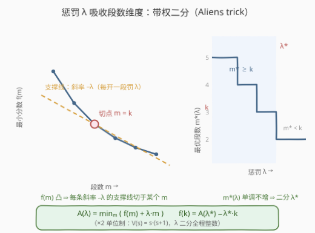
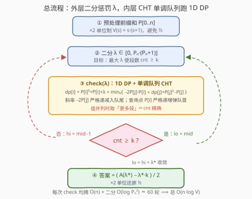

# 最小分割分数 II

- **题目名称**：最小分割分数 II
- **链接**：[3929. 最小分割分数 II](https://leetcode.cn/problems/minimum-partition-score-ii/)
- **难度**：困难
- **标签**：动态规划、二分查找、前缀和、斜率优化（Convex Hull Trick）、带权二分（Aliens trick）

## 1. 题目概述

> ⚠️ 本题为 LeetCode 付费题，题意描述根据官方示例用例与 hints 重建，可能与官方题面有出入。题意已与免费的前作 [3826. 最小分割分数](https://leetcode.cn/problems/minimum-partition-score/)逐字核对一致（三个示例完全相同），可放心阅读。

给你一个整数数组 `nums` 和一个整数 `k`。你的任务是将 `nums` 分割成**恰好** $k$ 个子数组，返回所有有效分割方案中**最小可能的分数**。

一个分割方案的**分数**是其所有子数组**值**的总和。子数组的**值**定义为 $\text{sumArr} \times (\text{sumArr} + 1) / 2$，其中 $\text{sumArr}$ 是该子数组元素的总和。子数组是数组中**连续**的非空元素序列。

**示例 1**：

```text
输入：nums = [5,1,2,1], k = 2
输出：25
解释：最优分割是 [5] 和 [1,2,1]。
      第一段 sumArr = 5，value = 5×6/2 = 15；
      第二段 sumArr = 4，value = 4×5/2 = 10；总分 15 + 10 = 25。
```

**示例 2**：

```text
输入：nums = [1,2,3,4], k = 1
输出：55
解释：只能整段 [1,2,3,4]，sumArr = 10，value = 10×11/2 = 55。
```

**示例 3**：

```text
输入：nums = [1,1,1], k = 3
输出：3
解释：唯一方案 [1],[1],[1]，每段 value = 1，总分 3。
```

**约束条件**（会员题官方不可见；按官方 hints 与 I 版约束推断为 $n$、$k$ 均放大至 $10^5$ 量级，本题解按此保守口径设计）：

- $1 \le \text{nums.length} \le 10^5$
- $1 \le \text{nums[i]} \le 10^4$
- $1 \le k \le \text{nums.length}$

> 💡 **审题关键**：① 题意与 I 版[3826](../3801-3900/3826_最小分割分数.md)完全一致，II 版只是**数据范围放大**；② 官方三条 hints 恰好铺出解题链：前缀和 $O(1)$ 算段值 → 转移 $dp[i]=\min_j\{dp[j]+\text{cost}(j+1,i)\}$ 代数展开后是「一族直线取最小」→ **不做段数维度的 DP，改给每段加惩罚再二分惩罚**；③「II」的考点：若 $k$ 仍是千级，I 版的分层斜率优化 $O(kn)$ 其实还活着——真正的杀招是 $k$ 放大到与 $n$ 同阶，$O(kn)$ 变成 $O(n^2) = 10^{10}$，必须把「段数」这一维从 DP 里**罚**出去。

---

## 2. 解题思路

### 2.1 暴力思路：I 版的两档做法在 II 版一起爆掉

沿用 I 版的划分型 DP：设 $P[0..n]$ 为前缀和（$P[0]=0$），$V(s) = s(s+1)$（即 $2 \times \text{value}$，**全程用 ×2 单位制**，杜绝 $\frac{1}{2}$），

$$dp[t][i] = \min_{j=t-1 \dots i-1} \Big\{ dp[t-1][j] + V\big(P[i]-P[j]\big) \Big\}$$

三层循环 $O(kn^2)$；I 版题解已把它优化到 $O(kn)$（每层转移展开成直线族、单调队列维护下凸壳，斜率 $-2P[j]$ 递减入队 + 查询点 $P[i]$ 递增，两把单调性白送）。但注意这些做法——包括分治优化的 $O(kn\log n)$——复杂度里都**背着段数 $k$**。II 版 $n = k = 10^5$ 时哪怕 $O(kn)$ 也是 $10^{10}$。瓶颈不在「单个转移怎么算快」，而在「**段数 $k$ 作为 DP 的一维被显式枚举**」——得把这一维整个消掉。

### 2.2 核心观察：给每段加惩罚 $\lambda$，把 $k$ 维「罚」进目标函数



**观察一（$f(m)$ 关于段数凸，且严格递减）。** 记 $f(m)$ = 恰好 $m$ 段的最小分数（×2 单位），$d(m) = f(m) - f(m+1)$ 是「再多切一刀的边际收益」。由 $V$ 超可加（$V(s)+V(t) \le V(s+t)$，差恰 $2st \ge 0$）知 $f$ **严格递减**——多切一刀永远不亏；由代价 $w(j,i) = V(P[i]-P[j])$ 满足凸四边形不等式（I 版扩展①已证）知 $d(m)$ **单调不增**，即 $f$ 关于 $m$ **凸**。这正是带权二分（Aliens trick / wqs 二分）的适用前提。

**观察二（拉格朗日松弛：惩罚 $\lambda$ 替代段数约束）。** 给每开一段加罚 $\lambda \ge 0$，定义无段数约束的一维函数

$$A(\lambda) = \min_{1 \le m \le n} \big\{ f(m) + \lambda \cdot m \big\}$$

求 $A(\lambda)$ 只需**不带 $k$ 的 1D DP**（下见观察四），$O(n)$ 一次。几何上这是用斜率 $-\lambda$ 的直线去「托」凸函数 $f$：$\lambda$ 越大，切点（最优段数 $m^*(\lambda)$）越小——**$\lambda$ 与段数一一对应地此消彼长**。

**观察三（二分 $\lambda$，再用 $A(\lambda)$ 还原 $f(k)$）。** 把「$m$ 在 $\lambda$ 处最优」翻译成边际收益的语言：$m$ 最优 $\iff d(m) \le \lambda \le d(m-1)$（约定 $d(0)=+\infty$）。于是「段数 $\ge k$」成立的最大整数惩罚恰为

$$\lambda^* = d(k-1)$$

且在 $\lambda^*$ 处 $k$ 恰好落在最优并列集内（$d(k) \le d(k-1) = \lambda^*$），从而

$$f(k) = A(\lambda^*) - \lambda^* \cdot k$$

算法：二分 $\lambda \in [0,\, P_n(P_n+1)]$，每次用 1D DP 求出 $A(\lambda)$ 及其最优解的段数 $\text{cnt}$（DP 时值并列取**更多**段，见下），找**最大的 $\lambda$ 使 $\text{cnt} \ge k$**，套上式还原即得答案（最后除以 2 回原单位）。上界 $P_n(P_n+1) = V(P_n) > d(1)$ 足以让「$\text{cnt} \ge k$」在 $\lambda = 0$（此时 $\text{cnt}=n$）为真、在 $\lambda = V(P_n)$ 为假（$k \ge 2$ 时），二分合法。

**观察四（1D DP 的内核仍是 CHT，×2 单位白送整数）。** 带惩罚的转移：

$$dp[i] = \min_{j < i} \Big\{ dp[j] + \big(P[i]-P[j]\big)^2 + \big(P[i]-P[j]\big) + \lambda \Big\} = P[i]^2 + P[i] + \lambda + \min_{j<i} \Big\{ \underbrace{-2P[j]}_{\text{斜率}} \cdot \underbrace{P[i]}_{\text{查询点}} + \underbrace{dp[j] + P[j]^2 - P[j]}_{\text{截距}} \Big\}$$

$\min$ 内是一族直线取最小——I 版的斜率优化**原封不动地搬进来**：$nums[i] \ge 1$ ⟹ 斜率 $-2P[j]$ 严格递减、查询点 $P[i]$ 严格递增，双端队列维护下凸壳均摊 $O(1)$。每次 check $O(n)$。

> ⚠️ **并列陷阱（本题最大的隐蔽 WA 点）**：二分要的是「最优解段数的精确最大值 $m^*(\lambda)$」，因此 DP 内部**值并列时必须取更多段**。若并列随手取了少段，$\text{cnt}$ 可能不是 $m^*(\lambda)$ 的真值，二分边界整体左移，最终 $\lambda < d(k)$ 时 $k$ 不在最优集内，$A(\lambda)-\lambda k < f(k)$，答案**偏小**。实测反例：`nums = [6,5,4,3,4,5,4,3,3], k = 6`，正确答案 $140$，并列取少段的版本输出 $139$。实现层面：查询遇到队首与次首**取值相等**时，比较两者携带的段数取大者，再把队首弹掉（它在此后严格更劣）。

### 2.3 算法流程图



| 步骤 | 操作 | 说明 |
|------|------|------|
| ① | 预处理前缀和 $P[0..n]$ | ×2 单位制 $V(s)=s(s+1)$，全程整数、无 $\frac{1}{2}$ |
| ② | 二分 $\lambda \in [0,\, P_n(P_n+1)]$ | 目标：最大的 $\lambda$ 使 check 返回的段数 $\ge k$ |
| ③ | check$(\lambda)$：1D DP + 单调队列 CHT | 直线族斜率 $-2P[j]$ 递减入队尾、查询点 $P[i]$ 递增弹队首；**值并列取更多段** |
| ④ | 收敛得 $\lambda^*$，输出 $(A(\lambda^*) - \lambda^* k)/2$ | $k$ 在 $\lambda^*$ 的最优并列集内 ⟹ 还原精确 |

### 2.4 示例演算

以示例 1（`nums = [5,1,2,1]`，$k=2$）演算。前缀和 $P = [0,5,6,8,9]$，×2 单位制，二分区间 $[0,\, V(9)=90]$：

| 二分步 | $\lambda$ | $A(\lambda)$ | cnt | 判定 | 区间变化 |
|--------|-----------|--------------|-----|------|----------|
| 1 | 45 | 135 | 1 | $1 < 2$ ⟹ $\lambda$ 调小 | $[0,44]$ |
| 2 | 22 | 94 | 2 | $\ge 2$ ⟹ $\lambda$ 调大 | $[22,44]$ |
| 3 | 33 | 116 | 2 | 同上 | $[33,44]$ |
| 4 | 39 | 128 | 2 | 同上 | $[39,44]$ |
| 5 | 42 | 132 | 1 | $< 2$ ⟹ $\lambda$ 调小 | $[39,41]$ |
| 6 | 40 | **130** | **2** | $\ge 2$ ⟹ 调大 | $[40,41]$ |
| 7 | 41 | 131 | 1 | $< 2$ ⟹ 调小 | $[40,40]$ 收敛 |

$\lambda^* = 40$，答案 $= (130 - 40 \times 2)/2 = 25$ ✓。

$\lambda^* = 40$ 恰好就是理论值 $d(1) = f(1) - f(2)$：$f(1) = V(9) = 90$，$f(2) = V(5)+V(4) = 50$，$d(1) = 40$。此点**1 段与 2 段并列**：$90 + 40 \times 1 = 50 + 40 \times 2 = 130$。若第 6 步并列时错误地取了少段（cnt=1），区间会滑到 $[39,41]$ 以左，虽然本例碰巧仍能算对，但在 $d$ 出现相等平台时就会翻车（见 2.2 反例）——「并列取更多段」正是为了让二分**精确落在 $d(k-1)$ 上**。

---

## 3. 参考代码

### C++

```cpp
class Solution {
  public:
    long long minPartitionScore(vector<int>& nums, int k) {
        int n = nums.size();
        vector<long long> P(n + 1);
        for (int i = 0; i < n; i++) P[i + 1] = P[i] + nums[i];

        // check(lam): dp[i] = min_j{ dp[j] + (P[i]-P[j])^2 + (P[i]-P[j]) + lam }  (x2 单位)
        // 直线 j：y = -2P[j]*x + (dp[j]+P[j]^2-P[j])；斜率严格递减、查询点严格递增
        // => 单调队列下凸壳均摊 O(1)；cnt 并列取更多段（wqs 二分必需的精确 m*(lam)）
        vector<long long> qm(n + 1), qb(n + 1), dp(n + 1);
        vector<int> qc(n + 1), cnt(n + 1);
        auto check = [&](long long lam) -> int {
            int head = 0, tail = -1;
            auto val = [&](int idx, long long x) { return (__int128)qm[idx] * x + qb[idx]; };
            auto push = [&](long long m, long long b, int c) {
                while (tail - head >= 1) {   // 队尾：B 严格无用才弹，并列(交点重合)保留
                    long long mA = qm[tail - 1], bA = qb[tail - 1];
                    long long mB = qm[tail], bB = qb[tail];
                    if ((__int128)(bB - bA) * (mB - m) > (__int128)(b - bB) * (mA - mB))
                        tail--;
                    else
                        break;
                }
                qm[++tail] = m; qb[tail] = b; qc[tail] = c;
            };
            dp[0] = 0; cnt[0] = 0;
            push(-2 * P[0], P[0] * P[0] - P[0], 0);            // 直线 j = 0
            for (int i = 1; i <= n; i++) {
                long long x = P[i];                             // 查询点严格递增
                while (tail - head >= 1 && val(head, x) > val(head + 1, x))
                    head++;                                     // 队首被严格反超，永久弹出
                __int128 mv = val(head, x);
                int mc = qc[head];
                while (tail - head >= 1 && val(head, x) == val(head + 1, x)) {
                    head++;                                     // 并列：队首此后恒劣，弹掉
                    if (qc[head] > mc) mc = qc[head];           // 值并列时取更多段
                }
                dp[i] = (long long)mv + x * x + x + lam;
                cnt[i] = mc + 1;
                push(-2 * P[i], dp[i] + P[i] * P[i] - P[i], cnt[i]);
            }
            return cnt[n];
        };

        long long lo = 0, hi = P[n] * (P[n] + 1);   // x2 单位下的上界 V(P_n)
        while (lo < hi) {                           // 最大 lambda 使段数 >= k
            long long mid = lo + (hi - lo + 1) / 2;
            if (check(mid) >= k) lo = mid;
            else hi = mid - 1;
        }
        check(lo);
        return (dp[n] - lo * k) / 2;                // 还原 1/2 回原单位
    }
};
```

> 💡 **写法要点**：
> - **交点交叉相乘必须 `__int128`**：截距差可达 $\sim 6\times10^{18}$、斜率差达 $4\times10^9$，乘积 $\sim 2\times10^{28}$；直线求值也顺手用了 `__int128`（`m*x+b` 最坏 $\sim 5\times10^{18}$，贴着 `long long` 上限走不冒险）。这是 CHT 类题的头号 WA 点；
> - **队尾只在「严格无用」时弹**（交点比较用 `>` 不用 `>=`）：三线共点的并列线保留在壳上，查询时统一比较段数，配合「并列取更多段」才能拿到精确 $m^*(\lambda)$；
> - 查询的两个 while 一个弹「严格劣」、一个处理「并列」，都满足每条线至多入队出队一次，均摊 $O(1)$ 不变。

### Python

```python
class Solution:
    def minPartitionScore(self, nums: List[int], k: int) -> int:
        n = len(nums)
        P = [0] * (n + 1)
        for i, v in enumerate(nums):
            P[i + 1] = P[i] + v

        def check(lam):                              # -> (A(lam), cnt)，值并列时取更多段
            qm, qb, qc, head = [], [], [], 0         # 队列：斜率 / 截距 / 来源 j 的段数
            def push(m, b, c):
                while len(qm) - head >= 2:           # 队尾：B 无用(严格)才弹，并列保留
                    m1, b1, m2, b2 = qm[-2], qb[-2], qm[-1], qb[-1]
                    if (b2 - b1) * (m2 - m) > (b - b2) * (m1 - m2):
                        qm.pop(); qb.pop(); qc.pop()
                    else:
                        break
                qm.append(m); qb.append(b); qc.append(c)

            push(-2 * P[0], P[0] * P[0] - P[0], 0)   # 直线 j=0：dp[0]=0
            dp, cnt = [0] * (n + 1), [0] * (n + 1)
            for i in range(1, n + 1):
                x = P[i]                             # 查询点严格递增
                while len(qm) - head >= 2 and \
                        qm[head] * x + qb[head] > qm[head + 1] * x + qb[head + 1]:
                    head += 1                        # 队首被严格反超，永久弹出
                mv, mc = qm[head] * x + qb[head], qc[head]
                while len(qm) - head >= 2 and \
                        qm[head] * x + qb[head] == qm[head + 1] * x + qb[head + 1]:
                    head += 1                        # 并列：该线此后恒劣，弹掉
                    if qc[head] > mc:
                        mc = qc[head]                # 并列时取更多段
                dp[i] = mv + x * x + x + lam
                cnt[i] = mc + 1
                push(-2 * P[i], dp[i] + P[i] * P[i] - P[i], cnt[i])
            return dp[n], cnt[n]

        lo, hi = 0, P[n] * (P[n] + 1)                # x2 单位制下的上界 V(P_n)
        while lo < hi:                               # 最大 lambda 使段数 >= k
            mid = (lo + hi + 1) // 2
            if check(mid)[1] >= k:
                lo = mid
            else:
                hi = mid - 1
        A, _ = check(lo)
        return (A - lo * k) // 2
```

> 💡 **写法要点**：
> - Python 大整数无溢出之虞，交叉相乘直接写；`qm/qb/qc` 配头指针 `head` 实现双端队列，`len(qm)-head` 即队内元素数；
> - `head` 在每次 `check` 内重新从 0 起（函数局部变量），队列每轮重建；
> - 两版代码均已与 $O(kn^2)$ 暴力 DP 对拍：小规模 3000 余组（$n \le 14$ 遍历全部 $k$）+ 大数值 100 余组全部一致，含 2.2 节并列反例（输出 140）。$n = k = 10^5$ 随机最坏用例实测：C++ 毫秒级，CPython 约 8~10s（卡时限边缘，介意常数可把 `check` 内层展开、预存局部引用）。

---

## 4. 复杂度分析

| 维度 | 复杂度 | 说明 |
|------|--------|------|
| 时间 | $O\big(n \log V\big)$，$V \approx P_n^2$ | 每次 check 均摊 $O(n)$（每条直线至多入队、出队一次），二分 $\lambda \in [0, P_n(P_n+1)]$ 约 $\log_2 10^{18} \approx 60$ 轮；$n = 10^5$ 时约 $6\times10^6$ 次队列操作 |
| 空间 | $O(n)$ | 前缀和 + 一行 dp/cnt + 队列 |
| 数值 | ×2 单位下 $dp \le 2\times10^{18}$ | 按 $n \le 10^5$、$nums[i] \le 10^4$ 计：$P_n \le 10^9$，$V(P_n) \approx 10^{18}$，$dp[j] + P[j]^2 \le 3\times10^{18}$，`long long` 安全；交点交叉相乘 $\sim 10^{28}$ **必须 `__int128`**（Python 天然免疫）；答案 $\le V(P_n)/2 \approx 5\times10^{17}$ 须 64 位返回 |
| 对比 | $O(kn^2) \to O(kn\log n) \to O(kn) \to O(n\log V)$ | 同一问题的四档演进，「II」考的是最后一跳：把段数维罚进目标函数 |

---

## 5. 扩展

**① 为什么 $\lambda$ 在整数上二分就足够。** 原 value 含 $\frac{1}{2}$，但 ×2 单位制 $V(s) = s(s+1)$ 后所有 $f(m)$ 均为整数，边际收益 $d(m) = f(m) - f(m+1)$ 也是整数，$\lambda^* = d(k-1)$ 是整数——整数二分不会跳过它。若不做 ×2 单位化，就得在半整数（或 ×2 域）上二分，容易差一个 $\frac{1}{2}$ 而答错。

**② 凸性的另一条证明路线。** 2.2 直接引用了「凸四边形不等式 ⟹ $f$ 凸」；也可以走**嵌套分割交换论证**：设 $S_m$ 是 $m$ 段最优分割、$S_{m+2}$ 是 $m+2$ 段最优分割，用 $S_{m+2}$ 的两条相邻分割线去切 $S_m$ 的段，可构造出 $m+1$ 段的方案，其分数被 $f(m)$ 与 $f(m+2)$ 线性夹住，得 $f(m+1) \le \frac{f(m)+f(m+2)}{2}$，即凸。两条路线殊途同归，面试里讲清楚其中一条即可。

**③ 若允许 $nums[i] = 0$ 或负数。** 前缀和 $P$ 不再严格递增，「斜率递减入队 + 查询点递增」双双失效：斜率优化换成**李超线段树**（每条线 $O(\log C)$ 插入、$O(\log C)$ 查询，总 $O(n\log C\log V)$）；此时凸性仍成立（$V$ 依旧凸、QI 与元素正负无关），带权二分框架不动。

**④ 带权二分的通用形态。** 本题是教科书式模板：目标「恰好 $k$ 个」+ 目标函数关于个数凸 ⟹ 加罚 $\lambda$ 二分。同构题目还包括「恰好 $k$ 条边的最短路」「恰好选 $k$ 个的最大权独立集」等；但凡用 Aliens trick，都要过三关——**证凸、整数性、并列 tie-break**，本题恰好三关全有（凸性、×2 单位、取更多段），是难得的完整教学例。

---

## 6. 面试要点

**Q1：为什么本题能用带权二分（Aliens trick）？它替你消掉了什么？**

> 两个前提：目标函数 $f(m)$（恰好 $m$ 段的最小分数）关于 $m$ **凸**（代价满足凸四边形不等式 ⟹ 边际收益 $d(m)$ 不增）；「恰好 $k$」是**个数约束**。加罚 $\lambda$ 后 $A(\lambda) = \min_m \{f(m)+\lambda m\}$ 的求解不需要段数维度——1D DP 即可，于是复杂度从 $O(kn)$（分层）降到 $O(n\log V)$（二分 $\lambda$）。它消掉的正是被显式枚举的 $k$ 维。

**Q2：最终的还原式 $f(k) = A(\lambda^*) - \lambda^* k$ 为什么成立？$\lambda^*$ 取哪个？**

> 取 $\lambda^*$ 为「段数 $\ge k$」成立的最大 $\lambda$，由 $m$ 最优 $\iff d(m) \le \lambda \le d(m-1)$ 可证 $\lambda^* = d(k-1)$，且该点处 $k$ 恰在最优并列集内（$d(k) \le d(k-1)$），故 $A(\lambda^*) = f(k) + \lambda^* k$。直观图景：斜率 $-\lambda^*$ 的支撑线正托在 $f$ 的 $k$ 这一点（可能与相邻点共线并列）。

**Q3：DP 里「值并列取更多段」为什么是必需的？不处理会怎样？**

> 二分谓词「cnt ≥ k」需要 cnt 是 $m^*(\lambda)$ 的**精确值**。若并列时随手取少段，cnt 可能小于真实的 $m^*(\lambda)$，谓词提前翻假，二分收敛到 $\lambda < d(k)$，此时 $k$ 不在最优集内，$A(\lambda)-\lambda k < f(k)$，**答案偏小**。实测 `nums=[6,5,4,3,4,5,4,3,3], k=6`：正确 140，取少段版输出 139。对应到 CHT：查询点恰为两线交点时要比较两线携带的段数；队尾弹出只在「严格无用」时执行，三线共点的并列线必须保留。

**Q4：和 I 版（3826）的斜率优化是什么关系？**

> 完全同一套 CHT：转移展开后 $\min$ 内都是「斜率 $-2P[j]$（I 版未 ×2 时为 $-P[j]$）的直线族」，两把单调性（斜率递减入队、查询点递增）都由 $nums[i] \ge 1$ 白送。区别只在**外层**：I 版对段数分层（$k$ 层、每层一个壳，$O(kn)$）；II 版把段数罚进目标函数，只剩一层壳反复重建（$O(\log V)$ 次，$O(n\log V)$）。可以说 II 版 = I 版的内核 + wqs 外壳。

**Q5：溢出怎么评估？**

> ×2 单位制下按 $n \le 10^5$、$nums[i] \le 10^4$：$P_n \le 10^9$，$V(P_n) \approx 10^{18}$，dp 与截距 $\le 3\times10^{18}$，`long long` 装；直线求值 $\le 5\times10^{18}$ 仍安全但贴边；**交点交叉相乘 $\sim 10^{28}$ 必须 `__int128`**。Python 大整数全程免疫。另外二分上界取 $V(P_n)$ 本身就是「1 段也嫌贵」的惩罚，天然合法。

**Q6：如果 $k$ 很小（比如 $k \le 100$）呢？**

> 那 I 版的分层 CHT $O(kn) = 10^7$ 完全够用，不必上带权二分——两版代码可以按 $k$ 的大小自适应切换（实践中先估 $kn$ 与 $n\log V$ 谁小）。带权二分并非万能替代，它的优势区间就是 $k$ 与 $n$ 同阶的大规模场景；代价是实现复杂度（凸性证明 + tie-break + 整数性三关）。

---

## 7. 同类练习题

- [3826. 最小分割分数](https://leetcode.cn/problems/minimum-partition-score/)（[题解](../3801-3900/3826_最小分割分数.md)）：本题 I 版，$n \le 1000$ 下的分层斜率优化 $O(kn)$，与本篇共用同一套 CHT 内核
- [410. 分割数组的最大值](https://leetcode.cn/problems/split-array-largest-sum/)（[题解](../0401-0500/410_分割数组的最大值.md)）：划分型 DP 的源头题，「DP vs 二分」两条路线的教科书对照，本题把「二分」用在了惩罚上
- [1959. K 次调整数组大小浪费的最小总空间](https://leetcode.cn/problems/minimum-total-space-wasted-with-k-resize-operations/)（[题解](../1901-2000/1959_K次调整数组大小浪费的最小总空间.md)）：同款「恰好 $k$ 段划分 DP」，练不带优化的转移建模
- [1278. 分割回文串 III](https://leetcode.cn/problems/palindrome-partitioning-iii/)（[题解](../1201-1300/1278_分割回文串III.md)）：恰好 $k$ 段的最小代价，凸代价划分家族的标准成员
- [1335. 工作计划的最低难度](https://leetcode.cn/problems/minimum-difficulty-of-a-job-schedule/)（[题解](../1301-1400/1335_工作计划的最低难度.md)）：恰好 $k$ 天划分 +「段内 max」代价，体会哪些代价凸（可 wqs）、哪些不凸
