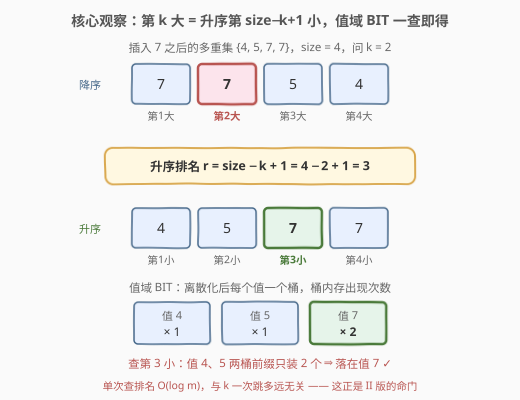
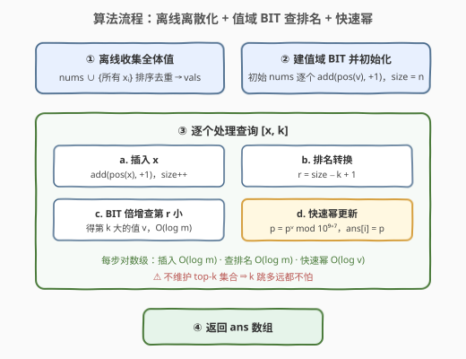

# LeetCode 插入后第 K 大更新的幂 II 题解

## 1. 题目概述

- **标题 / 题号**：插入后第 K 大更新的幂 II（#3930，hard）
- **链接**：https://leetcode.cn/problems/power-update-after-k-th-largest-insertion-ii/
- **难度**：困难
- **标签**：树状数组、线段树、数组、哈希表、数学、排序、快速幂

> ⚠️ 本题为 LeetCode 付费题，题意描述根据官方示例用例与 hints 重建，可能与官方题面有出入；示例输出与参考代码已用自洽暴力对拍验证。官方三条 hints：① 把「第 $k$ 大」换算成升序排名 $\text{size} - k + 1$；② 用离散化 + 树状数组（Fenwick tree）高效查出该排名对应的值；③ 用快速幂更新 $p$。

**题意（重建）**：给定整数数组 `nums`、整数 `p`（初始**幂值**）和查询数组 `queries`，其中 `queries[i] = [xᵢ, kᵢ]`。依次处理每个查询：

1. 把 `xᵢ` **插入** `nums`；
2. 取此时 `nums`（多重集语义，重复元素按个数计）中**第 `kᵢ` 大**的元素 $v_i$；
3. 把 `p` 更新为 $p^{v_i} \bmod (10^9+7)$，并记 `ans[i] = p`。

返回答案数组 `ans`。

**与 I 版（[3935](https://leetcode.cn/problems/power-update-after-k-th-largest-insertion-i/)）的分水岭**：I 版（中等）额外保证 $|k_i - k_{i-1}| < 10$，即 $k$ **缓变**，可以用「top-$k$ 集合 + 备用集合」均摊少量搬移来维护；II 版（困难）的 $k$ **任意跳变**，集合平衡单次可退化为 $O(n)$，必须换成「离散化 + 值域树状数组」支持 $O(\log n)$ 的任意排名查询。

**示例 1**（官方示例用例，输出为按重建题意推演所得）：

```text
输入：nums = [2], p = 4, queries = [[3,1],[1,2]]
输出：[64, 4096]
解释：查询 1：插入 3 → {2,3}，第 1 大 = 3，p = 4³ = 64；
     查询 2：插入 1 → {1,2,3}，第 2 大 = 2，p = 64² = 4096。
```

**示例 2**（官方示例用例，输出为按重建题意推演所得）：

```text
输入：nums = [7,5], p = 6, queries = [[4,3],[7,2]]
输出：[1296, 220296870]
解释：查询 1：插入 4 → {4,5,7}，第 3 大 = 4，p = 6⁴ = 1296；
     查询 2：插入 7 → {4,5,7,7}，第 2 大 = 7，p = 1296⁷ mod (10⁹+7) = 220296870。
```

**约束条件**（官方约束未公开，按 hints 与同类题推测）：

- $1 \le \text{nums.length} \le 10^5$
- $1 \le \text{queries.length} \le 10^5$
- $1 \le \text{nums}[i],\ x_i \le 10^9$（hint ② 点名离散化，值域必然不小）
- $1 \le k_i \le$ 插入 $x_i$ 之后的元素个数
- $1 \le p \le 10^9$

> 💡 **审题关键**：① `queries[i] = [xᵢ, kᵢ]`——**先插入** `xᵢ` 再问**此时**的第 `kᵢ` 大（含刚插入的元素）；② $p$ 是**跨查询持续累积**的运行幂值，每查询被更新为 $p^{v_i} \bmod (10^9+7)$，答案记录的是**更新后**的 $p$；③ 第 $k$ 大按**多重集**语义——$\{4,5,7,7\}$ 的第 2 大是 $7$ 不是 $5$；④ I/II 版的分水岭在 $k$ 的**变化幅度**而非数据规模，这直接决定数据结构选型（见 2.2）；⑤ 模数 $10^9+7$ 与「$p$ 为第二个参数」为重建口径，按官方 hints「Update p with fast modular exponentiation」推定。

## 2. 解题思路

### 2.1 暴力思路：每次插入后重排 / 线性找第 k 大

最直接的做法：每个查询插入 $x_i$ 后，把整个数组**重新降序排序**取第 $k_i$ 个（$O(n \log n)$/次），或维护有序多重集后**中序走 $k_i$ 步**（$O(n)$/次）。总计 $O(q \cdot n) \approx 10^{10}$，必然超时。

一个「半优化」是套用 I 版引擎：维护两个多重集 $L$（最大的 $k$ 个，$|L| = k$）与 $R$（其余），插入后双向平衡，第 $k$ 大恒为 $L$ 的最小值。这在 I 版是正解——$|k_i - k_{i-1}| < 10$ 使每次平衡只搬 $O(1)$ 个元素；但 II 版的 $k$ 可以从 $1$ 一步跳到 $\text{size}$，单次平衡要搬 $O(n)$ 个元素，最坏仍是 $O(q \cdot n) \approx 10^{10}$。**瓶颈不在「维护」而在「排名查询的代价与 $k$ 的跳变幅度解耦」**——这正是 hint ② 指向树状数组的原因。

### 2.2 核心观察：排名转换 + 值域树状数组



**观察一（第 $k$ 大 ⟺ 升序第 $\text{size}-k+1$ 小）。** 降序第 $k$ 个元素就是升序第 $\text{size}-k+1$ 个（$\text{size}$ 为插入 $x_i$ 之后的元素总数）。例如 $\{4,5,7,7\}$ 的第 $2$ 大 $=$ 升序第 $4-2+1=3$ 小 $= 7$。这一步把「第 $k$ 大」统一成**升序排名查询**，与 hint ① 对应。

**观察二（动态多重集的排名查询只需要值分布）。** 我们不关心元素的身份与插入顺序，只关心「每个值出现了几次」。于是把多重集落到**值域**上：离散化后每个值占一个桶，桶内存出现次数，桶的前缀和恰为「$\le$ 该值的元素个数」。**插入一个值 = 桶计数 +1**（单点修改），**查第 $r$ 小 = 找最小前缀 $\ge r$ 的桶**（排名查询）——这正是树状数组的看家本领，与 hint ② 对应。

**观察三（BIT 倍增查第 $r$ 小，$O(\log m)$ 且与 $k$ 跳多远无关）。** 从 BIT 最高位开始试探：若累计 $\text{tree}[idx + \text{step}]$ 仍 $< r$ 就跳过去。结束后 $idx+1$ 即最小前缀 $\ge r$ 的位置，对应桶里的值就是第 $r$ 小。整个过程只走 $\log m$ 层——**无论 $k$ 从哪里跳到哪里，代价恒定**。这就是 II 版必须抛弃 top-$k$ 集合、改用值域 BIT 的原因：集合版的平衡代价是 $O(|\Delta k|)$，BIT 版的查询代价是 $O(\log m)$。

**观察四（值域 $10^9$ ⟹ 离线离散化）。** 值域大到不能直接开桶，但「插入的值全部提前已知」（初始 `nums` + 所有 $x_i$），离线排序去重后建「值 → 桶下标」哈希表即可把桶数压到 $n + q$ 以内。

> 💡 **一句话总结**：第 $k$ 大 $=$ 升序第 $\text{size}-k+1$ 小；多重集的排名查询只依赖值分布 ⟹ 离散化建值域 BIT，插入是单点 +1，第 $r$ 小用倍增 $O(\log m)$ 查——查询代价与 $k$ 的跳变幅度彻底解耦。

### 2.3 算法流程图



| 步骤 | 操作 | 说明 |
|------|------|------|
| ① | 收集 `nums` ∪ {所有 $x_i$}，排序去重得 `vals`，建哈希 `pos` | 离线离散化，桶数 $m \le n+q$ |
| ② | 初始 `nums` 逐个 `add(pos(v), +1)`，`size = n` | BIT 装下初始多重集的值分布 |
| ③a | 对查询 $[x_i, k_i]$：`add(pos(x_i), +1)`，`size++` | 插入 = 桶计数 +1 |
| ③b | 排名转换 $r = \text{size} - k_i + 1$ | 第 $k$ 大 ⟺ 升序第 $r$ 小 |
| ③c | BIT 倍增查第 $r$ 小，得第 $k_i$ 大的值 $v_i$ | $O(\log m)$，与跳变幅度无关 |
| ③d | $p \leftarrow p^{v_i} \bmod (10^9+7)$，`ans[i] = p` | 快速幂 $O(\log v_i)$ |
| ④ | 返回 `ans` | 每项 $< 10^9+7$ 装 `int` |

### 2.4 示例演算

以示例 2（`nums = [7,5]`，`p = 6`，`queries = [[4,3],[7,2]]`）为例：

| 查询 | 插入后多重集 | size | $k$ | 升序排名 $r=\text{size}-k+1$ | 第 $k$ 大 $v$ | 幂更新 $p \leftarrow p^v \bmod (10^9+7)$ |
|------|-------------|------|-----|------------------------------|----------------|-------------------------------------------|
| $[4,3]$ | $\{4,5,7\}$ | 3 | 3 | $3-3+1=1$ | 升序第 1 小 $=4$ | $6^4 = 1296$ |
| $[7,2]$ | $\{4,5,7,7\}$ | 4 | 2 | $4-2+1=3$ | 升序第 3 小 $=7$（两个 7 各占一名） | $1296^7 \bmod (10^9+7) = 220296870$ |

第二查询正是「多重集语义」与「排名转换」的双重考点：降序 $[7,7,5,4]$ 的第 2 大是 $7$（重复计次），换算到升序 $[4,5,7,7]$ 恰是第 3 小。示例 1 同法：$\{2,3\}$ 第 1 大 $=3$ 得 $4^3=64$；$\{1,2,3\}$ 第 2 大 $=2$ 得 $64^2=4096$。

## 3. 参考代码

### C++

```cpp
class Solution {
  public:
    vector<int> powerUpdateAfterKthLargestInsertion(vector<int>& nums, int p,
                                                    vector<vector<int>>& queries) {
        const long long MOD = 1'000'000'007LL;

        // ① 离线离散化：初始值 + 所有待插入值
        vector<int> vals(nums);
        for (auto& q : queries) vals.push_back(q[0]);
        sort(vals.begin(), vals.end());
        vals.erase(unique(vals.begin(), vals.end()), vals.end());
        int m = vals.size();
        unordered_map<int, int> pos;
        for (int i = 0; i < m; i++) pos[vals[i]] = i + 1; // BIT 下标从 1 起

        // ② 值域 BIT：桶内存出现次数
        vector<int> tree(m + 1);
        auto add = [&](int i, int d) {
            for (; i <= m; i += i & (-i)) tree[i] += d;
        };
        int high = 1;
        while ((high << 1) <= m) high <<= 1;
        // ③c 倍增查第 r 小：最小前缀和 >= r 的桶下标
        auto kth = [&](long long r) {
            int idx = 0;
            long long s = 0;
            for (int step = high; step; step >>= 1)
                if (int nxt = idx + step; nxt <= m && s + tree[nxt] < r) {
                    idx = nxt;
                    s += tree[nxt];
                }
            return idx + 1;
        };

        for (int v : nums) add(pos[v], 1);
        long long size = nums.size();

        vector<int> ans;
        ans.reserve(queries.size());
        for (auto& q : queries) {
            add(pos[q[0]], 1);      // ③a 插入 x
            size++;
            long long r = size - q[1] + 1;             // ③b 排名转换
            int v = vals[kth(r) - 1];                  // ③c 第 k 大的值
            p = (int)modpow(p, v, MOD);                // ③d 快速幂更新
            ans.push_back(p);
        }
        return ans;
    }

  private:
    static long long modpow(long long b, long long e, long long mod) {
        long long r = 1;
        for (b %= mod; e; e >>= 1, b = b * b % mod)
            if (e & 1) r = r * b % mod;
        return r;
    }
};
```

> 💡 **写法要点**：
> - `kth` 的倍增起点 `high` 预计算为 $\le m$ 的最大 2 的幂，循环从 `high` 逐位右移——标准 BIT 二分写法，勿写成每次从头累加前缀（那是 $O(\log^2 m)$）；
> - `s + tree[nxt] < r` 用 `long long` 累计（$r \le n+q \le 2\times10^5$ 其实 `int` 也够，但累计器与排名统一 64 位省心）；
> - 指数 $v$ 可达 $10^9$，`modpow` 的 `e` 用 `long long`；$p$ 每步更新后 $< \text{MOD}$，中间乘法 $< (10^9+7)^2 \approx 10^{18}$ 在 `long long` 安全范围内；
> - 函数签名（含参数名）为重建口径，提交时以官方签名为准，主体逻辑不受影响。

### Python

```python
class Solution:
    def powerUpdateAfterKthLargestInsertion(self, nums: List[int], p: int,
                                            queries: List[List[int]]) -> List[int]:
        MOD = 10**9 + 7

        # ① 离线离散化
        vals = sorted(set(nums) | {x for x, _ in queries})
        m = len(vals)
        pos = {v: i + 1 for i, v in enumerate(vals)}

        # ② 值域 BIT
        tree = [0] * (m + 1)
        def add(i: int, d: int) -> None:
            while i <= m:
                tree[i] += d
                i += i & (-i)

        high = 1
        while (high << 1) <= m:
            high <<= 1

        # ③c 倍增查第 r 小
        def kth(r: int) -> int:
            idx, s, step = 0, 0, high
            while step:
                nxt = idx + step
                if nxt <= m and s + tree[nxt] < r:
                    idx, s = nxt, s + tree[nxt]
                step >>= 1
            return idx + 1

        for v in nums:
            add(pos[v], 1)
        size = len(nums)

        ans = []
        for x, k in queries:
            add(pos[x], 1)                       # ③a 插入
            size += 1
            v = vals[kth(size - k + 1) - 1]      # ③b + ③c 排名转换与查询
            p = pow(p, v, MOD)                   # ③d 内置三参快速幂
            ans.append(p)
        return ans
```

> 💡 **写法要点**：Python 的三参 `pow(p, v, MOD)` 即内置快速幂，注意 $p$ **不要**先取模再当底数也无妨（$p \le 10^9 < \text{MOD}$ 时等价），但若重建口径里 $p$ 可达 $10^{18}$，三参 `pow` 依然正确；`kth` 内 `step` 是局部变量，避免闭包外层查找的常数开销。

## 4. 复杂度分析

| 维度 | 复杂度 | 说明 |
|------|--------|------|
| 时间 | $O\big((n+q)\log(n+q)\big)$ | 离散化排序 $O((n+q)\log(n+q))$；每查询插入 $O(\log m)$ + 排名查询 $O(\log m)$ + 快速幂 $O(\log v_i)$，后两者合计被前者同阶吸收（$m \le n+q$，$v_i \le 10^9$） |
| 空间 | $O(n+q)$ | 离散化数组 `vals` + 哈希 `pos` + 长度 $m+1$ 的 BIT |
| 数值 | 中间乘法 $\approx 10^{18}$ | 快速幂内 $b \cdot b \bmod \text{MOD}$，$b < 10^9+7$，`long long` 安全；指数 $v_i \le 10^9$ |

## 5. 扩展：I 版引擎、在线化与幂的复合结构

**I 版双集合引擎为何在 II 版退化。** I 版（3935，中等）维护 $L$（当前最大的 $k$ 个，`multiset`）与 $R$（其余）：插入 $x$ 后按值入 $L$ 或 $R$，再把 $|L|$ 平衡到恰为 $k$（$L$ 多了把最小挪去 $R$，少了从 $R$ 取最大回来）。第 $k$ 大恒为 `*L.begin()`。由于 $|k_i - k_{i-1}| < 10$，每次平衡只搬 $O(1)$ 个元素，单查询均摊 $O(\log n)$（`multiset` 操作自带 $\log$）。II 版 $k$ 任意跳变，单次平衡要搬 $O(\text{size})$ 个元素，最坏 $O(nq) = 10^{10}$——**同一道题的 I/II 之分把「均摊」彻底打穿，逼你换与 $\Delta k$ 无关的排名结构**。这也是面试里值得点破的洞察：均摊复杂度依赖「操作序列的友好性」，对抗性输入下需退回最坏情况保证。

**在线化：不能离线离散化怎么办。** 本题能离散化是因为所有 $x_i$ 提前可见。若 queries 必须在线应答（流式到达），改用**动态开点权值线段树**（值域 $[1, 10^9]$ 按需开点，单点 +1 与「线段树上二分找第 $r$ 小」都是 $O(\log V)$）或**平衡树**（C++ PBDS 的 `tree<pair<int,int>, null_type, less<>>` 用 `find_by_order` 直接取排名；Python 可用 `sortedcontainers.SortedList` 的下标访问，单操作均摊 $O(\sqrt n \cdot \log n)$ 级但常数友好）。离散化 + BIT 是离线场景的最省代码解。

**幂的复合结构。** 逐步更新 $p \leftarrow p^{v_i}$ 有个漂亮的封闭形式：$t$ 次查询后 $p_t = p_0^{\,v_1 v_2 \cdots v_t} \bmod M$——指数在**连乘**。理论上可维护 $E = \prod v_i \bmod (M-1)$（费马小定理，要求 $\gcd(p_0, M) = 1$），把每查询的快速幂省成一次乘法；但 $p_0$ 与 $M$ 不互素时指数不能对 $M-1$ 取模（例如 $p_0 \equiv 0 \pmod M$ 时 $p_t$ 恒为 $0$，与指数无关），须对「指数阈值」分类讨论。本题逐步 `pow` 每查询仅 $O(\log v_i) \approx 30$ 次乘法，完全不值得为它冒险——**识别哪些步骤是主菜（排名查询）、哪些只是配菜（快速幂），正是 hint ③ 只用一句话带过幂运算的原因**。

## 6. 面试要点

**Q1：第 $k$ 大怎么转成升序排名？为什么这一步是全题的枢纽？**

> 降序第 $k$ 个 ⟺ 升序第 $\text{size}-k+1$ 个，其中 $\text{size}$ 是**插入后**的元素总数。它是枢纽，因为排名查询类数据结构（BIT / 线段树 / 平衡树）几乎都以**升序**为默认语义；先统一口径，后面的结构选型才能一步到位。注意 $\text{size}$ 要先 `++` 再算 $r$，顺序写反是最常见的 off-by-one。

**Q2：BIT 上怎么 $O(\log m)$ 查第 $r$ 小？倍增的正确性依据是什么？**

> BIT 的 `tree[i]` 管辖区间 $(i - \text{lowbit}(i), i]$。从最大 2 的幂开始试探：若累计 `s + tree[idx+step] < r`，说明前 `idx+step` 个桶装不下 $r$ 个元素，放心跳过去并记账；否则第 $r$ 小落在更小的桶段里。循环结束后 `idx+1` 是最小前缀 $\ge r$ 的下标。正确性来自 2 的幂分解与 BIT 区间管制的精确对应——每层二选一，共 $\log m$ 层。

**Q3：I 版的双多重集做法直接搬到 II 版，会坏在哪里？**

> 坏在**平衡代价**而非查询代价：集合版每次要把 $|L|$ 修正到恰为 $k$，搬移元素数是 $O(|k_i - k_{i-1}|)$。I 版 $|\Delta k| < 10$ 时均摊 $O(1)$；II 版 $k$ 从 $1$ 跳到 $\text{size}$ 时单次搬 $O(n)$ 个，最坏 $O(nq) \approx 10^{10}$。BIT 版查任意排名恒 $O(\log m)$，与 $\Delta k$ 无关——本质是把「按 $k$ 的绝对位置维护边界」换成「按值分布随机访问」。

**Q4：为什么可以离线离散化？如果 queries 是流式在线的呢？**

> 离散化要求值集合提前已知：本题所有 $x_i$ 与初始 `nums` 在处理前都可见，离线合并排序去重即可。在线场景下离散化失效，须改用动态开点权值线段树（$O(\log V)$ 查改、按需开点）或平衡树（PBDS `find_by_order` / `SortedList` 下标访问）。答题时先问清「在线还是离线」再选结构，是这类题的固定开场。

**Q5：快速幂这步有什么边界要注意？**

> ① 指数 $v_i$ 可达 $10^9$，循环写法用 `long long` 存指数；② 中间乘法 $< (10^9+7)^2 \approx 10^{18}$，`long long` 恰好安全，`int` 必炸；③ 若允许 $p \equiv 0 \pmod M$，注意 $0^0$ 的语言语义差异（Python `pow(0,0,M)=1`，C++ 手写版视初始化而定）——本题 $v_i \ge 1$、$p \ge 1$，重建口径下不触发；④ 幂运算是配菜，别为它引入费马小定理的指数取模优化（见第 5 节互素陷阱）。

**Q6：为什么用 BIT 而不是线段树？两者的取舍？**

> 本题只需「单点 +1」与「找第 $r$ 小」两个操作，BIT 以四行核心代码、更低常数胜出。线段树的优势在**可合并的非减信息**（区间 max/min/第 $k$ 小带附加卫星数据）与区间修改——若题目升级为「区间加值后问第 $k$ 大」或「删除元素」，BIT 需要差分技巧甚至不可行，线段树直接套。工程上两者复杂度同阶，按操作集合选结构即可。

## 同类练习题

| # | 题目 | 与本题的关联 |
|---|------|-------------|
| 703 | [数据流中的第 K 大元素](https://leetcode.cn/problems/kth-largest-element-in-a-stream/) | top-$k$ 堆维护的招牌题，正是 I 版（3935）引擎的最小原型 |
| 215 | [数组中的第K个最大元素](https://leetcode.cn/problems/kth-largest-element-in-an-array/) | 静态第 K 大的基本功（快速选择 / 堆），对照本题理解「动态 + 任意排名」强在哪 |
| 315 | [计算右侧小于当前元素的个数](https://leetcode.cn/problems/count-of-smaller-numbers-after-self/) | 离散化 + BIT 的经典入门，与本题共用「值域桶 + 前缀计数」骨架 |
| 307 | [区域和检索 - 数组可修改](https://leetcode.cn/problems/range-sum-query-mutable/) | BIT 单点修改模板题，先练熟 `add`/`pre` 再学倍增查排名 |
| 372 | [超级幂](https://leetcode.cn/problems/super-pow/) | 模意义下的快速幂招牌题，对应本题的幂更新配菜 |
