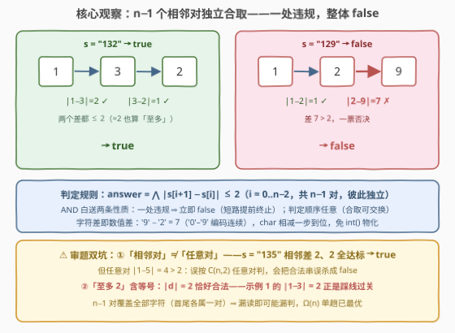
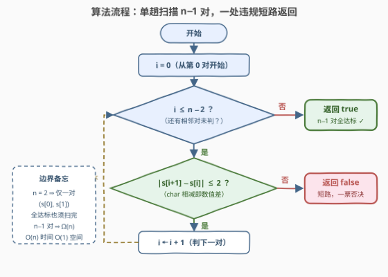

# LeetCode 检查相邻数字差 题解

## 1. 题目概述

- **标题 / 题号**：检查相邻数字差（#3931，easy）
- **链接**：https://leetcode.cn/problems/check-adjacent-digit-differences/
- **难度**：简单
- **标签**：字符串、模拟

**题意**：给你一个由**数字**组成的字符串 `s`。

如果**每一对相邻数字**之间的**绝对差**都**至多为 2**，则返回 `true`；否则返回 `false`。

`a` 和 `b` 之间的绝对差定义为 $\lvert a - b\rvert$。

**示例 1**：

```text
输入：s = "132"
输出：true
解释：|1 - 3| = 2 ≤ 2，|3 - 2| = 1 ≤ 2，两对相邻数字都达标。
```

**示例 2**：

```text
输入：s = "129"
输出：false
解释：|1 - 2| = 1 ≤ 2，但 |2 - 9| = 7 > 2，第二对违规。
```

**约束**：

- $2 \le \lvert s \rvert \le 100$
- `s` 仅由数字 `'0'`–`'9'` 组成

> 💡 **审题关键**：①判定对象是**相邻对** $(s[i], s[i+1])$，共 $n-1$ 对——不是任意两个数字的组合对；②「**至多** 2」含等号，$\lvert d \rvert = 2$ 恰好合法（示例 1 的 $|1-3|=2$ 正是踩线过关）；③只问布尔判定，不涉及修改、计数，纯模拟即可。

## 2. 解题思路

### 2.1 暴力思路：物化整数数组再逐对判

照题面直译的第一版：先把 `s` 逐字符转成整数数组 `vals`（`vals[i] = int(s[i])`），再对每个 $i$ 从 $0$ 到 $n-2$ 判 $\lvert \text{vals\rvert[i+1] - \text{vals}[i]} \le 2$。正确，$O(n)$ 时间，但多付了一份 $O(n)$ 的数组物化——而每个数字字符本身就在 `'0'`–`'9'` 这段**连续编码**里，char 相减天然就是数值差，转换纯属多余。

另一种更隐蔽的弯路是**误读题意**：把「相邻对」当成「任意对」，枚举所有 $\binom{n}{2}$ 个 $(i, j)$ 组合去判 $\lvert s[i] - s[j]\rvert \le 2$——语义直接错了（见 2.2 的反例），复杂度还平白涨到 $O(n^2)$。

### 2.2 核心观察：局部谓词独立合取 + 字符差即数值差



**观察一（判定对象是 $n-1$ 个相邻对，彼此独立）。** 第 $i$ 对的谓词 $\lvert s[i+1] - s[i]\rvert \le 2$ 只读 `s[i]`、`s[i+1]` 两个字符，与其余任何位置无关。于是全局答案就是 $n-1$ 个局部谓词的**合取**：

$$\text{answer} \;=\; \bigwedge_{i=0}^{n-2}\ \bigl[\, \lvert s[i+1] - s[i]\rvert \le 2 \,\bigr]$$

合取语义白送两条性质：**一处违规即整体 false**（短路提前终止——第一对就不达标时 $O(1)$ 出结果）；**判定顺序任意**（从左到右、从右到左、甚至并行分块判再 AND，都正确——合取满足交换律）。

**观察二（字符差 = 数值差，免转换）。** `'0'`–`'9'` 在 ASCII（及一切主流编码）中**连续排列**，于是 `'9' - '2' = 7` 直接就是数值差，`abs(s[i+1] - s[i])` 一步到位，无需 `int()` 物化。C++ 里 char 相减自动提升为 int；Python 的 `str` 不支持相减，用 `ord()` 差即可（或老老实实 `int(s[i]) - int(s[i+1])`，同样正确，只是绕了一步）。

**观察三（相邻 ≠ 任意）。** 判定对象是 $(i, i+1)$ 相邻对，**不是**任意组合对：$s = $ `"135"` 的相邻差是 $2, 2$，全达标 → `true`；但任意对 $\lvert 1 - 5 \rvert = 4 > 2$。若误按任意对判，会把合法串误杀成 `false`——这是本题唯一的审题陷阱。

### 2.3 算法流程图



| 步骤 | 操作 | 说明 |
|------|------|------|
| ① | `i = 0` | 从第 0 对 `(s[0], s[1])` 开始 |
| ② | `i ≤ n−2` ? | 否 → 所有 $n-1$ 对已判完，返回 `true` |
| ③ | 计算 `d = s[i+1] − s[i]` | char 相减即数值差（`'0'`–`'9'` 连续），免转换 |
| ④ | `abs(d) ≤ 2` ? | 否 → 短路返回 `false`（一票否决）；是 → `i++` 回到 ② |

### 2.4 示例演算

对**示例 1** `s = "132"`（$n = 3$，判 $2$ 对）：

| $i$ | 相邻对 | $d = s[i+1] - s[i]$ | $\lvert d \rvert \le 2$ ? | 动作 |
|-----|--------|--------------------|--------------------------|------|
| 0 | (1, 3) | $+2$ | ✓（踩线） | 继续 |
| 1 | (3, 2) | $-1$ | ✓ | 扫完 → **true** |

对**示例 2** `s = "129"`：

| $i$ | 相邻对 | $d = s[i+1] - s[i]$ | $\lvert d \rvert \le 2$ ? | 动作 |
|-----|--------|--------------------|--------------------------|------|
| 0 | (1, 2) | $+1$ | ✓ | 继续 |
| 1 | (2, 9) | $+7$ | ✗ | 短路 → **false** |

再验证审题反例 `"135"`：相邻差 $2, 2$ 全达标 → `true`（虽然任意对 $\lvert 1-5 \rvert = 4$，但那不是本题问的）。

## 3. 参考代码

### C++

```cpp
class Solution {
  public:
    bool isAdjacentDiffAtMostTwo(string s) {
        for (int i = 0; i + 1 < (int)s.size(); ++i) {
            if (abs(s[i + 1] - s[i]) > 2) return false;
        }
        return true;
    }
};
```

> 💡 **写法要点**：
> - `i + 1 < s.size()` 把「右端不越界」焊进循环条件，`n = 2` 时恰判一对，无特判；
> - `s[i+1] - s[i]` 是 char 相减 = 数值差，不需要 `s[i] - '0'` 二次转换；
> - 违规即 `return false` 短路，最好情形 $O(1)$、最坏 $O(n)$；
> - 差值域 $[-9, 9]$，`abs` 无溢出风险。

### Python

```python
class Solution:
    def isAdjacentDiffAtMostTwo(self, s: str) -> bool:
        return all(abs(ord(s[i + 1]) - ord(s[i])) <= 2 for i in range(len(s) - 1))
```

> 💡 **写法要点**：
> - `all()` 天生短路 + 直接吐布尔，与「谓词合取」语义一一对应；
> - `range(len(s) - 1)` 恰产生 $n-1$ 个相邻对的左端下标；
> - `ord()` 差即数值差；写 `int(s[i+1]) - int(s[i])` 同样正确，二选一即可。

## 4. 复杂度分析

| 维度 | 复杂度 | 说明 |
|------|--------|------|
| 时间 | $O(n)$ | $n-1$ 对各 $O(1)$ 判定；违规可提前终止（最好 $O(1)$），全达标须扫完 |
| 空间 | $O(1)$ | 只用下标 `i` 与临时差值，原地判定、零物化 |
| 下界 | $\Omega(n)$ | $n-1$ 对覆盖全部字符（首尾各属一对、中间各属两对），未读字符可能藏违规对 ⇒ 单趟已最优 |

## 5. 扩展：从判定到泛化

**阈值 $k$ 泛化。** 把 `2` 换成参数 $k$，框架原封不动。若题面再升级为「给 $q$ 个查询，每个查询一个阈值 $k_j$，问该阈值下是否合法」——不要每查询重扫一遍：一趟预处理 $\text{maxDiff} = \max_i \lvert s[i+1]-s[i]\rvert$，每个查询坍缩为 $O(1)$ 比较 $\text{maxDiff} \le k_j$（信息压缩思路，与 3912 的「集合比较 → 单值比较」同味）。

**循环相邻版。** 若首尾也算相邻（环形串），加判一对 $\lvert s[n-1] - s[0]\rvert$ 即可；[3423](https://leetcode.cn/problems/maximum-difference-between-adjacent-elements-in-a-circular-array/) 是它的镜像题——反过来求循环数组相邻差的**最大值**。

**任意对版。** 若要求**任意**两个数字之差 $\le 2$，条件坍缩为 $\max - \min \le 2$（全局极值差一趟打擂台即判），与相邻版是两道不同的题。

**最小修改版。** 若问「最少改几个字符使所有相邻差 $\le 2$」：改动一个字符会**同时影响左右两对**，相邻对不再独立，贪心失效，须按位 DP——$dp[i][v]$ 表示前 $i$ 位、第 $i$ 位改成数字 $v$ 的最小修改数，转移只须枚举 $d \in [-2, 2]$ 的 5 个合法前驱值，$O(n \cdot 10 \cdot 5)$。这是「局部约束」从**判定**升级到**优化**的标准路径。

## 6. 面试要点

**Q1：为什么不需要把字符转成整数再作差？**

> `'0'`–`'9'` 在 ASCII/Unicode 中连续，`s[i+1] - s[i]` 的 char 差就是数值差；先物化 int 数组是一次多余的 $O(n)$ 拷贝。Python 的 `str` 不支持相减，用 `ord()` 差（或 `int()` 差）等价实现。

**Q2：「至多 2」和「相邻」各埋了什么坑？**

> 「至多」**含等号**：$\lvert d \rvert = 2$ 恰好合法，条件写成 `< 2` 会在示例 1 的 $\lvert 1-3 \rvert = 2$ 上翻车；「相邻」指 $(i, i+1)$ 共 $n-1$ 对，**不是**任意组合对——`"135"` 相邻差 $2,2$ 是 `true`，任意对 $\lvert 1-5 \rvert = 4$ 超限，按任意对判就误杀。

**Q3：能提前返回吗？判定顺序重要吗？**

> 能。$n-1$ 个谓词合取，一处违规整体 `false`，第一处违规即可短路返回；且各对独立 ⇒ 判定顺序无关——从左到右、从右到左、并行分块再 AND 都正确（合取可交换）。

**Q4：这个 $O(n)$ 还能再优化吗？**

> 最坏情形不能：每个字符至少参与一个相邻对（首尾各一对、中间各两对），漏读任何字符都可能错过它所在的违规对，$\Omega(n)$ 是信息论下界。唯一的优化空间是短路——第一对就违规时 $O(1)$ 出结果。

**Q5：如果改为「最少修改几个字符使所有相邻差 $\le 2$」，还能一趟扫吗？**

> 不能。改一个字符同时影响左右两对 ⇒ 相邻对不再独立，贪心失效；须按位 DP：$dp[i][v]$ = 第 $i$ 位改成数字 $v$ 的最小修改数，每个目标值只须看 $d \in [-2,2]$ 的 5 个合法前驱，$O(n \cdot 50)$。

> 💡 **一句话总结**：答案 = $n-1$ 个局部谓词 $\lvert s[i+1]-s[i]\rvert \le 2$ 的合取——字符差即数值差免转换，单趟扫描、违规短路，$O(n)/O(1)$ 贴着下界收工。

## 同类练习题

| # | 题目 | 与本题的关联 |
|---|------|-------------|
| 3423 | [循环数组中相邻元素的最大差值](https://leetcode.cn/problems/maximum-difference-between-adjacent-elements-in-a-circular-array/) | 相邻差的循环版——求 $\lvert d \rvert$ 的最大值而非判定阈值，并多判一对首尾 |
| 896 | [单调数列](https://leetcode.cn/problems/monotonic-array/) | 同一「相邻对谓词合取」骨架，把 $\lvert d \rvert \le 2$ 换成 $d \ge 0$ / $d \le 0$ 两个方向谓词 |
| 1502 | [判断能否形成等差数列](https://leetcode.cn/problems/can-make-arithmetic-progression-from-sequence/) | 排序后相邻差恒等判定，相邻差约束的「全等」版 |
| 941 | [有效的山脉数组](https://leetcode.cn/problems/valid-mountain-array/) | 相邻对升降符号先增后减两段合取，谓词版的结构升级 |
| 3105 | [最长的严格递增或严格递减子数组](https://leetcode.cn/problems/longest-strictly-increasing-or-strictly-decreasing-subarray/) | 相邻差符号不再只是判定，还驱动窗口长度统计 |
