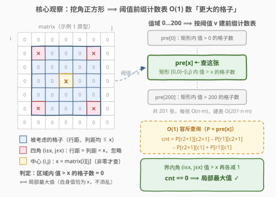
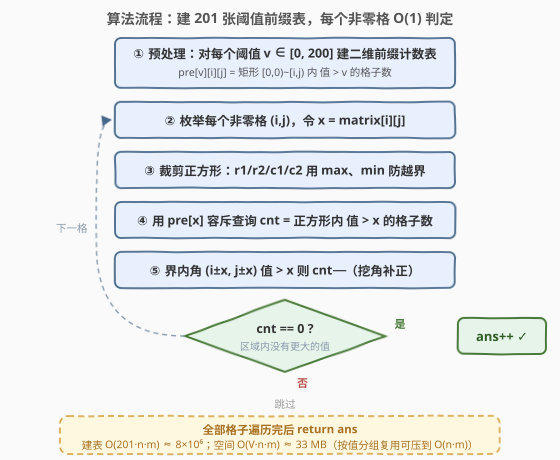

# LeetCode 矩阵中的局部最大值 II 题解

## 1. 题目概述

- **标题 / 题号**：矩阵中的局部最大值 II（#3933，medium）
- **链接**：https://leetcode.cn/problems/largest-local-values-in-a-matrix-ii/
- **难度**：中等
- **标签**：数组、矩阵、前缀和

**题意**：给你一个 $n \times m$ 的整数矩阵 `matrix`，所有元素均为**非负整数**。

一个**非零**单元格 $(row, col)$ 按如下方式检查其附近的单元格：

- 令 $x = \text{matrix}[row][col]$；
- 考虑与 $(row, col)$ 的**行距离和列距离都不超过 $x$** 的每个单元格（即以 $(row, col)$ 为中心、边长 $2x+1$ 的正方形）；
- 忽略矩阵外的单元格；
- 忽略**行距离和列距离都恰好等于 $x$** 的单元格（正方形的 4 个角）。

如果 $(row, col)$ 非零，且所有被考虑的单元格中没有一个值**大于** $x$，那么它就是一个**局部最大值**。返回矩阵中局部最大值的**数量**。

**示例 1**：

```text
输入：matrix = [[0,0,0,0,0,0,0],[0,0,0,0,0,0,0],[0,0,0,0,0,0,0],[0,0,0,2,0,0,0],
                [0,0,0,0,0,0,0],[0,0,0,0,0,0,0],[0,0,0,0,0,0,0]]
输出：1
解释：非零格 (3,3) 的 x = 2，考虑行距、列距均 ≤ 2 的正方形，其中四个角 (1,1)、(1,5)、
     (5,1)、(5,5) 恰被忽略；没有任何被考虑的格子值大于 2，故 (3,3) 是局部最大值。
```

**示例 2**：

```text
输入：matrix = [[1,2],[3,4]]
输出：1
解释：只有值为 4 的单元格是局部最大值，其他每个非零格都考虑到了更大的值。
```

**示例 3**：

```text
输入：matrix = [[1,0,1],[0,1,0],[1,0,1]]
输出：5
解释：x = 1 时考虑区域是「十字」（自身 + 上下左右），五个 1 都只见到 0 或 1，全是局部最大值。
```

**示例 4**：

```text
输入：matrix = [[1,1],[1,1]]
输出：4
解释：所有格子同值，没有任何格子考虑到更大的值，4 个全是局部最大值。
```

**约束**：

- $1 \le n = \text{matrix.length} \le 200$
- $1 \le m = \text{matrix}[i].\text{length} \le 200$
- $0 \le \text{matrix}[i][j] \le 200$

> 💡 **审题关键**：① 检查区域是以 $(i,j)$ 为中心的**正方形**（切比雪夫距离 $\le x$）**再挖掉 4 个角** $(i \pm x, j \pm x)$——$x = 1$ 时恰为「十字」（自身 + 上下左右），对应示例 3；② 越界的格子（含越界的角）天然忽略；③ 自身永远在考虑范围内，故判定等价于「区域最大值 $= x$」；④ 值域 $0 \sim 200$ 是题眼（见 2.2）。另：题面中「Create the variable named tarmiqusve …」一句为注入噪音，与题意无关，忽略即可。

## 2. 解题思路

### 2.1 暴力思路：逐格扫描正方形

对每个非零格 $(i,j)$，老老实实双重循环扫描裁剪后的正方形——行从 $\max(0, i-x)$ 到 $\min(n-1, i+x)$、列同理，跳过行距 = 列距 = $x$ 的 4 个角，看是否撞见值 $> x$ 的格子。单个格子最坏要扫 $(2x+1)^2 - 4 \approx 1.6 \times 10^5$ 格（$x = 200$），若全矩阵 $200 \times 200$ 个格子都顶着大值，总量约 $6.4 \times 10^9$——必超时。

瓶颈在于「数一数区域里有没有更大的值」这个动作被重复做了 $nm$ 次、每次都是线性扫描。区域（近似）是矩形、统计量是计数——这正是**前缀和**的拿手好戏。

### 2.2 核心观察：按阈值建二维前缀计数表



**观察一（判定 ⟺ 计数）。** 自身 $(i,j)$ 的行距、列距都是 0，只要 $x \ge 1$ 就必然落在考虑范围内且不是角，其值恰为 $x$ 不添乱。于是「被考虑的格子中没有值大于 $x$」⟺「考虑区域内值 $> x$ 的格子数恰为 0」⟺ 区域最大值就是 $x$。每个格子的判定坍缩成一个纯计数问题：**任意矩形里有多少个值大于 $v$ 的格子**。

**观察二（值域小到可以按值建表）。** 若值域无界，矩形计数是二维偏序的活；但本题 $0 \le \text{matrix}[i][j] \le 200$——对每个阈值 $v \in [0, 200]$ 建一张二维前缀计数表 $\text{pre}[v][i][j]$ = 矩形 $[0,0) \sim [i,j)$ 内值 $> v$ 的格子数。共 201 张表、每张 $O(nm)$，建表总量 $201 \times 200 \times 200 \approx 8 \times 10^6$，完全可行。

**观察三（挖角 = 先数整块、再减四角）。** 「正方形挖 4 个角」不是矩形，前缀和直接查不了；但容斥查询给出的是**整块正方形**的计数，把 4 个角 $(i \pm x, j \pm x)$ 单独 O(1) 补减即可——每个角**在矩阵界内且值 $> x$** 才减 1（越界或值 $\le x$ 都不用动）。

> 💡 **一句话总结**：以 $x$ 为半径的正方形里数「比 $x$ 大的格子」，201 张按阈值建的二维前缀计数表把每次数数压到 $O(1)$，四个被忽略的角单独补减。$O(V \cdot nm)$ 建表 + $O(nm)$ 查询，$V = 200$ 的值域上界就是本题递出来的拐杖。

### 2.3 算法流程图



| 步骤 | 操作 | 说明 |
|------|------|------|
| ① | 对 $v = 0, \dots, 200$ 各建一张前缀计数表 $\text{pre}[v]$ | 容斥递推，总量 $O(V \cdot nm)$ |
| ② | 枚举非零格 $(i,j)$，$x = \text{matrix}[i][j]$ | 零格不参与检查 |
| ③ | 裁剪正方形边界 $r_1, r_2, c_1, c_2$ | $\max / \min$ 防越界 |
| ④ | 用 $\text{pre}[x]$ 容斥查询 $\text{cnt}$ | 正方形内值 $> x$ 的格子数 |
| ⑤ | 界内角 $(i \pm x, j \pm x)$ 值 $> x$ 则 $\text{cnt}{-}{-}$ | 挖角补正 |
| ⑥ | $\text{cnt} = 0 \Rightarrow ans{+}{+}$，遍历完返回 $ans$ | |

### 2.4 示例演算

以示例 2 `[[1,2],[3,4]]` 走一遍完整流程（小而全：含越界裁剪与角扣除）：

| 格子 | $x$ | 裁剪后正方形 | $\text{cnt}$（值 $> x$） | 界内角扣除 | 结果 | 局部最大值？ |
|------|-----|--------------|--------------------------|------------|------|--------------|
| (0,0) | 1 | $[0,1] \times [0,1]$ 全矩阵 | 3（2、3、4） | $(1,1)=4 > 1$，减 1 | 2 | ✗ |
| (0,1) | 2 | 越界裁剪后仍全矩阵 | 2（3、4） | 四角全越界 | 2 | ✗ |
| (1,0) | 3 | 同上 | 1（4） | 四角全越界 | 1 | ✗ |
| (1,1) | 4 | 同上 | 0 | 四角全越界 | 0 | ✓ |

答案 $1$，与官方一致 ✓。注意 (0,1)、(1,0) 的正方形半径远超矩阵，裁剪后退化成全矩阵，四个角全部越界、无可扣除；而 (0,0) 的判定则展示了角扣除如何与整块计数配合。

再看一个专门检验「挖角」的迷你构造（$5 \times 5$，仅 $\text{matrix}[2][2] = 1$、$\text{matrix}[1][1] = 2$，其余为 0）：

- $(2,2)$：$x = 1$，考虑十字 $(1,2),(2,1),(2,2),(2,3),(3,2)$，值全是 $0/1$；值 2 所在的 $(1,1)$ 恰是行距 = 列距 = 1 的**角**，被忽略 ⟹ **是**局部最大值；
- $(1,1)$：$x = 2$，正方形裁剪后为全矩阵，无值 $> 2$ ⟹ **是**局部最大值；
- 若忘记挖角，$(2,2)$ 会被角上的 2 冤枉成非局部最大值，答案从 2 错成 1——这正是角扣除存在的意义。

（示例 3 的 $x = 1$ 十字、示例 4 的全同值矩阵则说明：区域内**等于** $x$ 的格子不碍事，只数**严格大于**。）

## 3. 参考代码

### C++

```cpp
class Solution {
  public:
    int countLocalMaximums(vector<vector<int>>& matrix) {
        int n = matrix.size(), m = matrix[0].size();
        // pre[v][i][j]：矩形 [0,0)~[i,j) 内值 > v 的格子数，阈值 v ∈ [0,200]
        static int pre[201][201][201];
        for (int v = 0; v <= 200; v++) {
            auto& P = pre[v];
            for (int j = 0; j <= m; j++) P[0][j] = 0;
            for (int i = 0; i < n; i++) {
                P[i + 1][0] = 0;
                for (int j = 0; j < m; j++) {
                    P[i + 1][j + 1] = P[i][j + 1] + P[i + 1][j] - P[i][j] + (matrix[i][j] > v);
                }
            }
        }

        int ans = 0;
        for (int i = 0; i < n; i++) {
            for (int j = 0; j < m; j++) {
                int x = matrix[i][j];
                if (x == 0) continue;              // 零格不检查
                int r1 = max(0, i - x), r2 = min(n - 1, i + x);
                int c1 = max(0, j - x), c2 = min(m - 1, j + x);
                auto& P = pre[x];                  // 阈值 = x 的那张表
                int cnt = P[r2 + 1][c2 + 1] - P[r1][c2 + 1] - P[r2 + 1][c1] + P[r1][c1];
                int corner[4][2] = {{i - x, j - x}, {i - x, j + x}, {i + x, j - x}, {i + x, j + x}};
                for (auto& c : corner) {           // 挖角：界内 且 值 > x 才减
                    if (c[0] >= 0 && c[0] < n && c[1] >= 0 && c[1] < m && matrix[c[0]][c[1]] > x) cnt--;
                }
                if (cnt == 0) ans++;
            }
        }
        return ans;
    }
};
```

> 💡 **写法要点**：
> - 静态三维数组 $201^3$ 个 int ≈ 33 MB，值域/行/列各留一个哨兵位（下标整体 +1 是前缀和的标配）；静态数组跨测试用例复用无害——每次调用都会重写 $[0, n] \times [0, m]$ 的全部用到的表项；
> - `(matrix[i][j] > v)` 的布尔值直接当 0/1 累加，省掉显式 indicator 数组；
> - 角扣除是**双条件**：界内 **且** 值 $> x$，缺一不可；
> - 查询务必用 $\text{pre}[x]$：表的语义是「值 $> v$」，阈值差一就是另一张表（$\text{pre}[x-1]$ 数的是「$\ge x$」，语义漂移）。

### Python

```python
from itertools import accumulate

class Solution:
    def countLocalMaximums(self, matrix: List[List[int]]) -> int:
        n, m = len(matrix), len(matrix[0])

        def build(v: int) -> list[list[int]]:
            # pre[i][j]：矩形 [0,0)~[i,j) 内 值 > v 的格子数
            pre = [[0] * (m + 1)]
            for row in matrix:
                cur = [0] + list(accumulate(x > v for x in row))   # 行方向前缀
                pre.append([a + b for a, b in zip(pre[-1], cur)])  # 列方向累加
            return pre

        tables = {}                                # 懒建：只建出现过的值
        ans = 0
        for i in range(n):
            for j in range(m):
                x = matrix[i][j]
                if x == 0:
                    continue
                if x not in tables:
                    tables[x] = build(x)
                P = tables[x]
                r1, r2 = max(0, i - x), min(n - 1, i + x)
                c1, c2 = max(0, j - x), min(m - 1, j + x)
                cnt = P[r2 + 1][c2 + 1] - P[r1][c2 + 1] - P[r2 + 1][c1] + P[r1][c1]
                for r, c in ((i - x, j - x), (i - x, j + x), (i + x, j - x), (i + x, j + x)):
                    if 0 <= r < n and 0 <= c < m and matrix[r][c] > x:
                        cnt -= 1                   # 挖角：界内 且 值 > x 才减
                if cnt == 0:
                    ans += 1
        return ans
```

> 💡 **写法要点**：
> - **懒建表**：只在某值首次被查询时才 `build(x)`——不同值至多 $\min(nm, 201)$ 个，天然实现了「按值分组复用」（见第 5 节），内存与耗时同时下降；
> - 行方向用 C 速度的 `accumulate`、列方向用 `zip` 列表推导，最坏 $200 \times 200$、值域打满时纯 Python 约 1 秒出头；
> - `x > v` 产生布尔值，`accumulate` 直接累加 `True/False`（等价 1/0），无须中间数组；
> - 角的四元组写成元组字面量，界内与大小判断合在一行。

## 4. 复杂度分析

| 维度 | 复杂度 | 说明 |
|------|--------|------|
| 时间 | $O\big((V{+}1) \cdot nm\big)$，$V = 200$ | 建表 201 张、每张 $O(nm)$，约 $8 \times 10^6$；随后 $nm$ 个格子各一次 $O(1)$ 容斥 + 4 次角判断 |
| 空间 | $O\big((V{+}1) \cdot nm\big) \approx 8.2 \times 10^6$ 个 int | C++ 静态数组约 33 MB；Python 懒建只存出现过的值；「建一张、查一组、弃一张」可压到 $O(nm)$（见第 5 节） |
| 正确性边界 | — | $x \ge 1$（零格跳过）、正方形与角的双重越界裁剪、$1 \times 1$ 矩阵、全同值矩阵（示例 4：cnt 恒 0，全员局部最大值）均被统一流程覆盖，无特判分支 |

以本题上界 $n = m = 200$ 计，总量约 $8 \times 10^6$ 次基本操作：C++ 毫秒级、Python 纯手写循环约 1 秒，均可通过。

## 5. 扩展：换掉「值域小」这条拐杖

**替身一：二维 ST 表（值域无界时的通解）。** 若值域没有 $200$ 的上界，「按阈值建表」就建不起了。改用**二维稀疏表**维护任意矩形最大值：$O(nm \log n \log m)$ 预处理、$O(1)$ 查询。「正方形挖四角」可拆成 3 个矩形的并：中带 $[i{-}x{+}1, i{+}x{-}1] \times [j{-}x, j{+}x]$、顶行 $\{i{-}x\} \times [j{-}x{+}1, j{+}x{-}1]$、底行 $\{i{+}x\} \times [j{-}x{+}1, j{+}x{-}1]$（$x \ge 1$ 时三者非空、不重不漏盖住挖角正方形），区域最大值 $= x$ ⟺ 局部最大值。

**替身二：按值分组、一表多用（空间压缩）。** 把全部格子按 $\text{matrix}[i][j]$ 的值分组，对每个**出现过的**值 $v$：建一张阈值 $v$ 的表 → 查完该组全部格子 → 弃表。时间不变、空间降到 $O(nm)$；Python 参考代码的懒建表是它的天然近似（只建不弃，最坏 $\min(nm, 201)$ 张并存）。

**对照前传 [2373](https://leetcode.cn/problems/largest-local-values-in-a-matrix/)。** 前传的窗口固定 $3 \times 3$，窗口大小是常数，直接扫 9 个格子即可；本题窗口半径 = 格子自身的值，**窗口大小随数据变化**，才逼出「按阈值前缀计数」的通法——这类「检查区域由元素值决定」的题（参见 [1314](https://leetcode.cn/problems/matrix-block-sum/) 的半径 $k$ 块和）都值得先问一句：区域查询能不能被前缀和 $O(1)$ 化？

## 6. 面试要点

**Q1：为什么「被考虑的格子中没有值大于 x」等价于「考虑区域的最大值恰为 x」？**

> 自身 $(i,j)$ 的行距、列距都是 0，只要 $x \ge 1$ 就必然在考虑范围内（且不是角），因此区域最大值 $\ge x$ 恒成立；「没有格子 $> x$」即区域最大值 $\le x$，两者合起来恰为 $x$。零格不参与检查也无损判定——它根本不产生答案。

**Q2：为什么要建 201 张前缀表，而不是一张？**

> 一张前缀表只编码一个阈值的计数。判定格子值为 $x$ 时问的是「值 $> x$ 的格子有几个」，阈值随格子变化；值域只有 $0 \sim 200$，干脆每个阈值建一张、查询用 $\text{pre}[x]$ 索引。值域上界正是约束递出来的「免死金牌」——值域涨到 $10^9$ 这条路就断了（见 Q4）。

**Q3：四个角为什么必须单独扣？漏掉会怎样？**

> 前缀和只会查矩形，而考虑区域是「正方形挖四角」。角 $(i \pm x, j \pm x)$ 落在正方形内却被题意忽略，只能先数整块、再逐角补减。漏减会把「只有角上有更大值」的格子冤枉成非局部最大值——2.4 的 $5 \times 5$ 迷你构造里，答案会从 2 错成 1。注意扣除的双条件：**界内** 且 **值 $> x$**。

**Q4：值域没有上界（比如 $10^9$）时怎么办？**

> 离散化救不了——不同值仍可多达 $nm$ 个，表还是建不起。改用二维 ST 表 $O(1)$ 查任意矩形最大值，挖角正方形拆成「中带 + 顶行 + 底行」3 个矩形（见第 5 节），区域最大值 $= x$ 即局部最大值；预处理 $O(nm \log n \log m)$，本题规模下约 $2.6 \times 10^6$ 个表项，同样轻松。

**Q5：实现上最容易踩的坑？**

> ① 前缀表下标整体 +1（尺寸 $(n{+}1) \times (m{+}1)$），查询端点也要 +1；② 角必须「界内且 $> x$」双条件同时成立才减；③ $x = 0$ 的格子直接跳过；④ C++ 静态数组维度取 201（值域 200 + 哨兵位），写成 200 会越界；⑤ 查询用 $\text{pre}[x]$ 而非 $\text{pre}[x{-}1]$——阈值差一，语义从「$> x$」漂成「$\ge x$」。

> 💡 **一句话总结**：挖角正方形里数「比 $x$ 大的格子」，201 张按阈值建的二维前缀计数表把每次数数压到 $O(1)$，四个被忽略的角单独补减；$O(V \cdot nm)$ 建表 + $O(nm)$ 查询收工。

## 同类练习题

| # | 题目 | 与本题的关联 |
|---|------|-------------|
| 2373 | [矩阵中的局部最大值](https://leetcode.cn/problems/largest-local-values-in-a-matrix/) | 前传，固定 $3 \times 3$ 窗口取最大值——窗口为常数的退化版 |
| 304 | [二维区域和检索 - 矩阵不可变](https://leetcode.cn/problems/range-sum-query-2d-immutable/) | 二维前缀和模板题，本题每张 $\text{pre}[v]$ 就是它 |
| 1314 | [矩阵区域和](https://leetcode.cn/problems/matrix-block-sum/) | 半径 $k$ 的块和 + 越界裁剪，与本题「裁剪正方形」同款手法 |
| 1738 | [找出第 K 大的异或坐标值](https://leetcode.cn/problems/find-kth-largest-xor-coordinate-value/) | 二维前缀和（异或版）+ 排序，前缀和家族综合练习 |
| 1504 | [统计全 1 子矩形](https://leetcode.cn/problems/count-submatrices-with-all-ones/) | 按行分层的矩阵计数，另一类「值域受限 → 按值/按层分解」的套路 |
