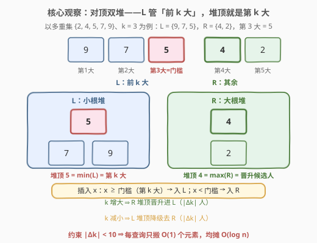
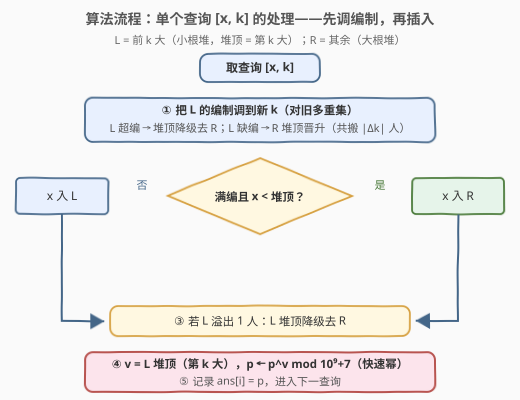

# 插入后第 K 大更新的幂 I

- **题目名称**：插入后第 K 大更新的幂 I
- **链接**：[3935. 插入后第 K 大更新的幂 I](https://leetcode.cn/problems/power-update-after-k-th-largest-insertion-i/)
- **难度**：中等
- **标签**：堆（优先队列）、有序集合、数学、排序、快速幂

## 1. 题目概述

> ⚠️ 本题为 LeetCode 付费题，题意描述根据官方示例用例与 hints 重建，可能与官方题面有出入；示例输出与参考代码已用自洽暴力对拍验证，口径与同题面的 II 版 [3930](https://leetcode.cn/problems/power-update-after-k-th-largest-insertion-ii/) 题解一致。官方三条 hints：① 把最大的 $k$ 个元素单独维护，答案（第 $k$ 大）就是其中最小者；② 插入后重新平衡两个集合/堆，使「top-$k$」一侧恰有 $k$ 个元素——由于 $|k_i - k_{i-1}| < 10$，每次只需搬移少量元素；③ 用快速幂更新 $p$。

**题意（重建）**：给定整数数组 `nums`、整数 `p`（初始**幂值**）和查询数组 `queries`，其中 `queries[i] = [xᵢ, kᵢ]`。依次处理每个查询：

1. 把 `xᵢ` **插入** `nums`；
2. 取此时 `nums`（多重集语义，重复元素按个数计）中**第 `kᵢ` 大**的元素 $v_i$；
3. 把 `p` 更新为 $p^{v_i} \bmod (10^9+7)$，并记 `ans[i] = p`。

返回答案数组 `ans`。

**与 II 版（[3930](https://leetcode.cn/problems/power-update-after-k-th-largest-insertion-ii/)）的分水岭**：I 版（本题）额外保证 $|k_i - k_{i-1}| < 10$，即 $k$ **缓变**——对顶双堆（双多重集）维护「前 $k$ 大编制」，每查询只搬 $O(1)$ 个元素；II 版（困难）的 $k$ **任意跳变**，单次平衡可退化 $O(\text{size})$，必须换「离散化 + 值域树状数组」支持 $O(\log n)$ 的任意排名查询。

**示例 1**（官方示例用例，与 II 版共用，输出为按重建题意推演所得）：

```text
输入：nums = [2], p = 4, queries = [[3,1],[1,2]]
输出：[64, 4096]
解释：查询 1：插入 3 → {2,3}，第 1 大 = 3，p = 4³ = 64；
     查询 2：插入 1 → {1,2,3}，第 2 大 = 2，p = 64² = 4096。
```

**示例 2**（官方示例用例，与 II 版共用，输出为按重建题意推演所得）：

```text
输入：nums = [7,5], p = 6, queries = [[4,3],[7,2]]
输出：[1296, 220296870]
解释：查询 1：插入 4 → {4,5,7}，第 3 大 = 4，p = 6⁴ = 1296；
     查询 2：插入 7 → {4,5,7,7}，第 2 大 = 7，p = 1296⁷ mod (10⁹+7) = 220296870。
```

**约束条件**（官方约束未公开，按 hints 与 II 版推测）：

- $1 \le \text{nums.length} \le 10^5$
- $1 \le \text{queries.length} \le 10^5$
- $1 \le \text{nums}[i],\ x_i \le 10^9$
- $1 \le k_i \le$ 插入 $x_i$ 之后的元素个数
- $|k_i - k_{i-1}| < 10$（I 版专属保证，hint ② 点名）
- $1 \le p \le 10^9$

> 💡 **审题关键**：① `queries[i] = [xᵢ, kᵢ]`——**先插入** `xᵢ` 再问**此时**的第 `kᵢ` 大（含刚插入的元素）；② $p$ 是**跨查询持续累积**的运行幂值，每查询被更新为 $p^{v_i} \bmod (10^9+7)$，答案记录的是**更新后**的 $p$；③ 第 $k$ 大按**多重集**语义——$\{4,5,7,7\}$ 的第 2 大是 $7$ 不是 $5$；④ $|k_i - k_{i-1}| < 10$ 是 I 版的「性能支点」而非「正确性支点」——正确写法在 $k$ 乱跳时照样出对答案，只是慢；这条约束只把单次平衡从最坏 $O(\text{size})$ 压成均摊 $O(1)$；⑤ 模数 $10^9+7$ 与「$p$ 为第二个参数」为重建口径，按官方 hints「Update p with fast modular exponentiation」推定。

---

## 2. 解题思路

### 2.1 暴力思路：每个查询重新排序

最直接的做法：每个查询插入 $x_i$ 后，把整个多重集**降序排序**取第 $k_i$ 个，$O(n \log n)$/次，总计 $O(q \cdot n \log n) \approx 10^{10}$，必然超时。

浪费在哪？相邻两个查询之间，多重集只**多 1 个元素**、$k$ 只挪了**不到 10 格**——上一次排序的结果几乎全部作废。但「几乎全部」不等于「全部」：真正变化的只有编制边界附近 $O(|\Delta k| + 1)$ 个元素的归属。把「每次全量重排」换成「每次增量调整」，就是正解的形状。

### 2.2 核心观察：对顶双堆维护「前 k 大编制」



**观察一（第 $k$ 大 = 前 $k$ 大集合的最小者 ⟹ 查询坍缩为边界维护）。** 维护两个集合：$L$ = 当前最大的 $\min(k, \text{size})$ 个元素（**小根堆**/有序多重集），$R$ = 其余元素（**大根堆**）。任意时刻**第 $k$ 大 ≡ $\min(L)$ ≡ $L$ 的堆顶**，$O(1)$ 可取。于是「查第 $k$ 大」这个排名问题，坍缩成「维护一条编制边界」——这正是 hint ① 的原话：*Keep the largest k elements separately. The answer is the smallest among them.*

**观察二（相邻查询间变化量极小 ⟹ 均摊 $O(1)$ 搬移）。** 每查询固定新增 1 个元素；$k$ 变化牵动边界移动 $|\Delta k| \le 9$ 格。于是晋升（$R$ 堆顶 → $L$）/ 降级（$L$ 堆顶 → $R$）的总人次是 $O(|\Delta k| + 2) = O(1)$，配合堆/多重集单次 $O(\log n)$，每查询均摊 $O(\log n)$。这就是 $|\Delta k| < 10$ 约束的全部意义：它**不改变正确性，只改变性能**——hint ② 的原话：*Since $|k_i - k_{i-1}| < 10$, only a few elements move each query.*

**观察三（⚠️ 顺序陷阱：先调编制、再插入新元素）。** 插入 $x$ 时「$x$ 与第 $k$ 大比较」的门槛，必须对**新 $k$** 有效。若 $L$ 尚未满编（$|L| < k$，意味着 $L$ 装着全体元素），$\min(L)$ **不是**第 $k$ 大——经典写法「先插入后平衡」在此时会错位。反例：`nums = [8,22,11,27,…]`，首个查询 `[9,1]`：先把 9 放进空的 $L$，平衡时 $|L| = 1 = k$ 无事发生，$L = \{9\}$，但真正的第 1 大是 $27$。正确顺序是：

1. **先调编制**（对旧多重集）：把 $|L|$ 修到 $\min(k, \text{size})$——超编则堆顶降级、缺编则从 $R$ 晋升，共搬 $|\Delta k|$ 人；
2. **再插入**：满编且 $x < L$ 堆顶（新门槛）→ $x$ 入 $R$；否则（未满编，或 $x$ 够大）→ $x$ 入 $L$；
3. **溢出善后**：$x$ 入 $L$ 后至多超编 1 人，堆顶降级去 $R$。

> 💡 **一句话总结**：多重集劈成 $L/R$ 两半，第 $k$ 大 = $L$ 堆顶；每查询先把编制调到新 $k$（搬 $|\Delta k|$ 人），再插入 $x$（至多再降级 1 人）——搬移总量 $O(1)$，单次堆操作 $O(\log n)$，配合快速幂更新 $p$ 即为全解。

### 2.3 算法流程图



| 步骤 | 操作 | 说明 |
|------|------|------|
| ① | 编制调整：$L$ 超编 → 堆顶降级去 $R$；$L$ 缺编 → $R$ 堆顶晋升 | 搬 $\lvert\Delta k\rvert$ 人，对**旧**多重集先把 $L$ 调成前 $k$ 大 |
| ② | $x$ 与 $L$ 堆顶（新门槛）比较：满编且 $x$ < 门槛 → 入 $R$，否则 → 入 $L$ | 未满编（$L$ = 全体）时任何 $x$ 都入 $L$ |
| ③ | 若 $L$ 溢出 1 人：堆顶降级去 $R$ | 仅 ② 走「入 $L$」分支时可能触发 |
| ④ | $v = L$ 堆顶（第 $k$ 大），$p \leftarrow p^{v} \bmod (10^9+7)$ | 快速幂 $O(\log v)$，hint ③ |
| ⑤ | `ans[i] = p`，进入下一查询 | $p$ 跨查询累积 |

### 2.4 示例演算

以示例 2（`nums = [7,5]`，`p = 6`，`queries = [[4,3],[7,2]]`）为例。初始时 $R = \{5,7\}$、$L = \varnothing$：

| 查询 | ① 调编制 | ② x 入列 | ③ 溢出降级 | $L$ 终态 | 第 $k$ 大 $v$ | $p$ 更新 |
|------|----------|----------|------------|----------|----------------|-----------|
| $[4,3]$ | $k=3$：晋升 7、5，$L=\{5,7\}$ | 未满编（2 < 3），4 入 $L$ | 无（恰 3 人） | $\{4,5,7\}$ | 4 | $6^4 = 1296$ |
| $[7,2]$ | $k: 3 \to 2$：降级 4，$L=\{5,7\}$ | $7 \ge$ 门槛 5，入 $L$ | 降级 5 | $\{7,7\}$ | 7 | $1296^7 \bmod (10^9{+}7) = 220296870$ |

第二个查询把三类搬移全部踩了一遍：**降级**（$k$ 缩 1 格）→ **插入入列**（7 够大直入 $L$）→ **溢出再降级**（5 出局），合计 3 人次——远小于上界 $\lvert\Delta k\rvert + 2 = 3$，恰好取满。第 2 大取到 $7$ 而非 $5$，正是**多重集语义**（两个 7 各占一名）的体现。示例 1 同法：$\{2,3\}$ 第 1 大 $=3$ 得 $4^3=64$；$\{1,2,3\}$ 第 2 大 $=2$ 得 $64^2=4096$。

---

## 3. 参考代码

### C++

```cpp
class Solution {
  public:
    vector<int> powerUpdate(vector<int>& nums, int p, vector<vector<int>>& queries) {
        const long long MOD = 1'000'000'007LL;
        multiset<int> L, R;   // L：前 k 大（*L.begin() = 第 k 大）；R：其余
        for (int x : nums) R.insert(x);
        long long cur = p % MOD;
        vector<int> ans;
        ans.reserve(queries.size());
        for (auto& q : queries) {
            int x = q[0], k = q[1];
            // ① 编制调整（对旧多重集）：超编降级、缺编晋升
            while ((int)L.size() > k) {
                R.insert(*L.begin());
                L.erase(L.begin());
            }
            while ((int)L.size() < k && !R.empty()) {
                auto it = prev(R.end());
                L.insert(*it);
                R.erase(it);
            }
            // ② x 与新门槛（L 堆顶）比较入列；未满编时 L 即全体，直接入 L
            if (!L.empty() && (int)L.size() == k && x < *L.begin())
                R.insert(x);
            else
                L.insert(x);
            // ③ 溢出恰 1 人：堆顶降级
            if ((int)L.size() > k) {
                R.insert(*L.begin());
                L.erase(L.begin());
            }
            // ④ 第 k 大 = L 堆顶，快速幂更新 p
            cur = modpow(cur, *L.begin(), MOD);
            ans.push_back((int)cur);
        }
        return ans;
    }

  private:
    static long long modpow(long long b, long long e, long long mod) {
        long long r = 1;
        for (b %= mod; e; e >>= 1, b = b * b % mod)
            if (e & 1) r = r * b % mod;
        return r;
    }
};
```

> 💡 **写法要点**：
> - **顺序是正确性的一部分**：必须「①调编制 → ②插入 → ③善后」。「先插后平衡」在 $L$ 未满编时门槛失效（见 2.2 观察三的反例）；
> - `erase` 传**迭代器**只删一个；传值会把同值元素全删（多重集语义下是灾难）；
> - 正确性**不依赖** $|\Delta k| < 10$：$k$ 乱跳时同样产出正确答案，只是单次平衡退化 $O(\text{size})$——约束只买性能；
> - 防御行为：若 $k >$ 元素总数，① 后 $L$ = 全体、$R$ 空，第 $k$ 大取全体最小者，与 hint ①「keep the largest k, answer is the smallest」口径一致；
> - 指数 $v \le 10^9$、快速幂中间乘积 $< (10^9{+}7)^2 \approx 10^{18}$，`long long` 安全；函数签名（含参数名）为重建口径，提交时以官方签名为准。

### Python

```python
import heapq

class Solution:
    def powerUpdate(self, nums: List[int], p: int, queries: List[List[int]]) -> List[int]:
        MOD = 10**9 + 7
        L, R = [], []   # L：前 k 大的小根堆（L[0] = 第 k 大）；R：其余的大根堆（存相反数）
        for x in nums:
            heapq.heappush(R, -x)
        cur = p % MOD
        ans = []
        for x, k in queries:
            # ① 编制调整（对旧多重集）
            while len(L) > k:
                heapq.heappush(R, -heapq.heappop(L))
            while len(L) < k and R:
                heapq.heappush(L, -heapq.heappop(R))
            # ② x 与新门槛比较入列
            if L and len(L) == k and x < L[0]:
                heapq.heappush(R, -x)
            else:
                heapq.heappush(L, x)
            # ③ 溢出恰 1 人：堆顶降级
            if len(L) > k:
                heapq.heappush(R, -heapq.heappop(L))
            # ④ 第 k 大 = L 堆顶，内置三参 pow 即快速幂
            cur = pow(cur, L[0], MOD)
            ans.append(cur)
        return ans
```

> 💡 **写法要点**：
> - `heapq` 只有小根堆，$R$ 侧存**相反数**伪装大根堆，晋升时再取负还原；
> - 三参 `pow(cur, v, MOD)` 是内置快速幂，指数 $v$ 可达 $10^9$ 无压力；
> - `L[0]` 即第 $k$ 大——小根堆堆顶是最小者，而 $L$ 恰装着「最大的 $k$ 个」。

---

## 4. 复杂度分析

| 维度 | 复杂度 | 说明 |
|------|--------|------|
| 时间 | $O\big((n + q \cdot C)\log(n+q)\big)$，$C \le 12$ | 初始化 $n$ 次入堆 + 首查询建编制至多 $k_1$ 次晋升（一次性）；此后每查询搬移 $\le \lvert\Delta k\rvert + 2 \le 11$ 人，每人次一次堆/多重集操作 $O(\log n)$；快速幂 $O(\log v_i) \approx 30$ 次乘法被同阶吸收 |
| 空间 | $O(n + q)$ | $L$、$R$ 两容器合计装下全部 $n + q$ 个元素 |
| 数值 | 中间乘积 $\approx 10^{18}$ | 快速幂内 $b \cdot b \bmod M$，$b < 10^9+7$，`long long` 安全；答案恒 $< 10^9+7$ 装 `int`；Python 天然大整数 |

> ⚠️ 若 $k$ 乱跳（突破 $|\Delta k| < 10$），上表时间退化到 $O(q \cdot (n+q) \log(n+q))$ 最坏——算法**仍然正确**，只是不再够快，这正是 II 版（3930）必须换引擎的场景。

---

## 5. 扩展：II 版引擎、单容器写法与幂的封闭形式

**II 版为何必须换引擎。** $k$ 任意跳变时，双集合的平衡代价是 $O(|\Delta k|)$，单次可达 $O(\text{size})$，最坏 $O(nq) \approx 10^{10}$。II 版的正解是**离散化 + 值域树状数组**：第 $k$ 大换算成升序第 $\text{size}-k+1$ 小，插入 = 桶计数 +1，第 $r$ 小 = BIT 倍增找最小前缀 $\ge r$ 的桶，$O(\log m)$ 与跳变幅度彻底解耦。详见 [3930 题解](https://leetcode.cn/problems/power-update-after-k-th-largest-insertion-ii/)。本题是「**均摊复杂度依赖操作序列友好性**」的教科书案例——面试值得主动点破：对抗性输入下，均摊保证会失效，需要退回最坏情况保证的结构。

**单容器替代写法。** 也可以只用一个有序容器：C++ 维护一个指向第 $k$ 大的 `multiset` 迭代器，$k$ 变化时 `next/prev` 挪 $|\Delta k|$ 步、插入删除后按位置修正迭代器；Python 用 `SortedList` 直接 `S[-k]` 取第 $k$ 大。复杂度同阶、代码更短，但「边界迭代器在插入/删除后的有效性维护」细节更多，对顶双堆的「编制」隐喻更稳、更不容易写错。

**幂的封闭形式（配菜，别贪快）。** 逐步更新 $p \leftarrow p^{v_i}$ 有封闭形式：$t$ 次查询后 $p_t = p_0^{\,v_1 v_2 \cdots v_t} \bmod M$——指数在连乘。看似可用费马小定理维护 $E = \prod v_i \bmod (M-1)$ 把每查询的快速幂省成一次乘法，但 $\gcd(p_0, M) \neq 1$ 时（如 $p_0 \equiv 0 \pmod M$）**禁止**对指数取模，须分类讨论。本题逐步 `pow` 每查询仅约 30 次乘法，完全不值得冒险——识别「主菜是排名查询、幂运算是配菜」，正是 hint ③ 只用一句话带过幂运算的原因。

---

## 6. 面试要点

**Q1：为什么第 $k$ 大 = $L$ 堆顶？两个堆各是什么角色？**

> $L$ 恰装着当前最大的 $\min(k, \text{size})$ 个元素，是**小根堆**——堆顶是这批精英里最小的，即第 $k$ 大；$R$ 装其余元素，是**大根堆**——堆顶是替补席上最强的，是唯一的晋升候选人。查询 $O(1)$ 取 $L$ 堆顶，全部维护成本摊在插入与平衡里。

**Q2：$|k_i - k_{i-1}| < 10$ 这条约束用在哪？没有它会怎样？**

> 用在**均摊分析**而非正确性：每查询搬移人数 = $|\Delta k|$（编制调整）+ 至多 2（插入 + 溢出善后），约束保证它 $\le 11$。没有它，算法照样给出正确答案，但 $k$ 从 1 跳到 size 时单次平衡搬 $O(n)$ 人，最坏 $O(nq) \approx 10^{10}$——II 版（3930）正是去掉这条约束的版本，必须换离散化 + 值域 BIT 让查询代价与 $\Delta k$ 解耦。

**Q3：「先插入后平衡」和「先平衡后插入」差在哪？**

> 差在**门槛的有效性**：插入决策要拿 $x$ 与「第 $k$ 大」比较，而第 $k$ 大只有在 $L$ 满编（$|L| = k$）时才等于 $\min(L)$。若 $L$ 未满编（典型如首查询，$L$ 从空起步），$\min(L)$ 是个过期门槛，「先插后平衡」会把小值错留在 $L$ 里（反例：`nums=[8,22,11,27,…]` 首查询 `[9,1]` 得 9，实际第 1 大是 27）。先把编制调到新 $k$，门槛才是真的。

**Q4：首个查询要一次性晋升 $k_1$ 人，均摊账还算得平吗？**

> 算得平。首查询建编制是一次性 $O(k_1 \log n) \le O(n \log n)$，摊进总复杂度 $O((n + q \cdot C)\log n)$ 后不变（$k_1 \le n + 1$，与初始化的 $n$ 次入堆同阶）。形式化可用势能分析：取 $\Phi = |R|$，每次晋升降 $\Phi$、每次降级升 $\Phi$，总搬移数 = 首建 + 插入数 + 总降级 $\le (n + q) + q + q$。

**Q5：快速幂这步有什么边界要注意？**

> ① 指数 $v_i$ 可达 $10^9$，C++ 循环变量用 `long long`（或 `int` 也恰好装下，但统一 64 位省心）；② 中间乘积 $< (10^9{+}7)^2 \approx 10^{18}$，`long long` 恰好安全，`int` 必炸；③ $p$ 每步更新后 $< M$，天然是下次的合法底数；④ Python 三参 `pow` 即内置快速幂；⑤ 若重建口径允许 $p \equiv 0 \pmod M$，注意 $0^0$ 的语言语义差异——本题 $v_i \ge 1$、$p \ge 1$，不触发。

---

## 7. 同类练习题

- [703. 数据流中的第 K 大元素](https://leetcode.cn/problems/kth-largest-element-in-a-stream/)：$k$ 固定的 top-$k$ 小根堆——本题引擎的最小原型（$k$ 不变 ⇒ 没有晋升通道，只剩插入与溢出降级）
- [295. 数据流的中位数](https://leetcode.cn/problems/find-median-from-data-stream/)：对顶堆招牌题——两堆各管一半、跨堆单向流动，与本题 $L/R$ 双向平衡同族
- [215. 数组中的第K个最大元素](https://leetcode.cn/problems/kth-largest-element-in-an-array/)：静态第 K 大的基本功（快速选择 / 堆），对照理解「动态 + $k$ 变化」强在哪
- [50. Pow(x, n)](https://leetcode.cn/problems/powx-n/)：快速幂模板题，本题每查询的配菜步骤
- [3930. 插入后第 K 大更新的幂 II](https://leetcode.cn/problems/power-update-after-k-th-largest-insertion-ii/)：同题面的 $k$ 任意跳变版——离散化 + 值域 BIT，看均摊被打穿后如何换引擎
