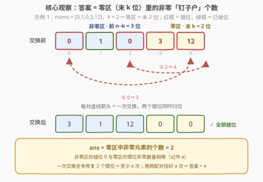
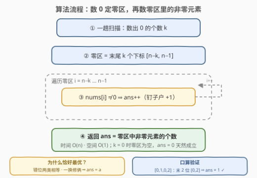

# LeetCode 将 0 移到末尾的最少交换次数 题解

## 1. 题目概述

- **标题 / 题号**：将 0 移到末尾的最少交换次数（#3936，easy）
- **链接**：https://leetcode.cn/problems/minimum-swaps-to-move-zeros-to-end/
- **难度**：简单
- **标签**：数组、计数、双指针

**题意**：给你一个整数数组 `nums`。一步操作可以选择**任意**两个**不同**的下标 `i` 和 `j`，交换 `nums[i]` 与 `nums[j]`。返回把**所有 0 移动到数组末尾**所需的**最少**操作次数。

**示例 1**：

```text
输入：nums = [0,1,0,3,12]
输出：2
解释：交换 nums[0] 和 nums[3]，得 [3,1,0,0,12]；
     再交换 nums[2] 和 nums[4]，得 [3,1,12,0,0]。
```

**示例 2**：

```text
输入：nums = [0,1,0,2]
输出：1
解释：交换 nums[0] 和 nums[3]，得 [2,1,0,0]。
```

**示例 3**：

```text
输入：nums = [1,2,0]
输出：0
解释：数组已经满足条件，无需交换。
```

**约束**：

- $1 \le \text{nums.length} \le 100$
- $0 \le \text{nums}[i] \le 100$

> 💡 **审题关键**：① 交换的是**任意两个下标**，不是相邻元素——一次交换可以让一个元素「瞬移」到任意位置；② 目标只约束 0 的位置（全在末尾），**非零元素之间允许乱序**（示例 1 的结果是 `[3,1,12,0,0]`，而非保序的 `[1,3,12,0,0]`）；③ 只问最少次数，不要求给出具体交换过程。

## 2. 解题思路

### 2.1 暴力思路：贪心模拟

最直接的做法是模拟：检查末尾「该放 0 的位置」，发现混着非零元素，就去前面找一个「该放非零却放着 0」的位置，两者交换。每轮定位 $O(n)$，至多 $O(n)$ 轮，总量 $O(n^2)$——$n \le 100$ 完全能过。至于更 brute 的状态搜索（把数组每个形态看作节点、每次交换看作边跑 BFS），状态数组合爆炸，直接不可行。

贪心模拟能出答案，但它**说不清为什么这样配对就是最少**，也没揭示问题的计数结构。下面把它提炼成一个 $O(n)$ 的纯计数公式。

### 2.2 核心观察：答案 = 零区（末 k 位）中非零元素的个数



**第一步：数值无关，坍缩成 0/1 串。** 交换规则和最终条件都只区分「是 0」与「非 0」——把所有非零元素看成 1，合法的交换序列与合法的终态集合不变，答案不变。`[0,1,0,3,12]` ⇒ `[0,1,0,1,1]`。

**第二步：终态唯一，零区位置固定。** 设 0 的总数为 $k$、数组长度为 $n$。「所有 0 在末尾」意味着 0 的下标构成一个后缀，而 0 恰有 $k$ 个 ⇒ 终态必然是**前 $n-k$ 位全 1、末 $k$ 位全 0**。于是每个位置的对错**静态可判**：

- 下标 $i < n-k$（**非零区**）：应放非 0；
- 下标 $i \ge n-k$（**零区**）：应放 0。

**第三步：两类错位元素数量相等。** 错位只有两种，且恰好一样多：

- 零区里的 **1**（记 $a$ 个）——挤占了 0 的位置；
- 非零区里的 **0**（记 $b$ 个）——该挪去末尾的。

零区共 $k$ 位、其中 $a$ 位被 1 占据 ⇒ 零区里恰有 $k-a$ 个 0；而全数组总共 $k$ 个 0 ⇒ 非零区里的 0 有 $k-(k-a)=a$ 个，即 $b=a$。**两类错位天然可以两两配对**。

**第四步：下界与构造在 $a$ 处吻合。**

- **下界**：一次交换只改变两个位置的占位元素，每个位置「对/错」状态至多翻转一次 ⇒ 一次交换至多把错位总数（$2a$）减少 2。要从 $2a$ 减到 0，**至少需要 $a$ 次**。
- **构造**：把非零区的每个错位 0 与零区的每个错位 1 直接配对交换——0 归非零区、非零归零区，**一次修复两个错位**，$a$ 次全部清零。

$$\text{ans} = a = \#\{\, i \ge n-k \ : \ \text{nums}[i] \ne 0 \,\}$$

> 💡 **一句话总结**：数一数**末尾 $k$ 个位置里混着几个非零数**，答案就是几——每个这样的「钉子户」都必须（也只需）被换出去一次。

用三个示例验证公式：

| nums | $k$ | 零区（末 $k$ 位） | 非零个数 | 期望答案 |
|------|-----|------------------|----------|----------|
| `[0,1,0,3,12]` | 2 | `[3,12]` | 2 | 2 ✓ |
| `[0,1,0,2]` | 2 | `[0,2]` | 1 | 1 ✓ |
| `[1,2,0]` | 1 | `[0]` | 0 | 0 ✓ |

边界情形也被公式天然覆盖：$k=0$（没有 0）时零区为空，答案 0；$k=n$（全是 0）时零区就是整个数组，其中非零数为 0 个，答案也是 0。

### 2.3 算法流程图



| 步骤 | 操作 | 说明 |
|------|------|------|
| ① | 一趟扫描数出 $k$（0 的个数） | 决定零区长度 |
| ② | 定位零区：下标 $[n-k,\ n-1]$ | 不真正移动任何元素 |
| ③ | 遍历零区，统计非零元素个数 $a$ | 每个「钉子户」贡献 1 |
| ④ | 返回 $a$ | 时间 $O(n)$、空间 $O(1)$ |

### 2.4 示例演算

以示例 1 `nums = [0,1,0,3,12]` 为例走一遍完整推理：

1. 0/1 化得 `[0,1,0,1,1]`，$n=5$，$k=2$ ⇒ 零区 = 下标 $\{3,4\}$，非零区 = $\{0,1,2\}$；
2. 找错位：零区里下标 3、4 都是 1（$a=2$）；非零区里下标 0、2 是 0（$b=2=a$）；
3. 两两配对：$(0 \leftrightarrow 3)$、$(2 \leftrightarrow 4)$；
4. 执行交换：
   - `swap(0,3)`：`[0,1,0,3,12]` → `[3,1,0,0,12]`，下标 0、3 **同时归位**；
   - `swap(2,4)`：`[3,1,0,0,12]` → `[3,1,12,0,0]`，下标 2、4 **同时归位**。

共 2 次交换，与示例输出一致 ✓。注意错位总数是 4，但答案不是 4——**一次任意交换能同时修复两个错位**，这正是「任意交换」与「相邻交换」的本质区别（见第 5 节）。

## 3. 参考代码

### C++

```cpp
class Solution {
  public:
    int minimumSwaps(vector<int>& nums) {
        int k = count(nums.begin(), nums.end(), 0);   // 零区长度
        int ans = 0;
        for (int i = (int)nums.size() - k; i < (int)nums.size(); i++)
            if (nums[i] != 0) ans++;                  // 零区里的"钉子户"
        return ans;
    }
};
```

> 💡 **写法要点**：
> - `k = 0` 时循环起点为 `n`，循环体一次都不执行，自然返回 0，**无需特判**；`k = n` 时起点为 0、扫全数组，全是 0 同样返回 0；
> - `(int)nums.size()` 先转换再与 `int` 比较，避免 `size_t` 与有符号数的编译告警；
> - 答案上界：$a \le \min(k,\ n-k) \le \lfloor n/2 \rfloor \le 50$，`int` 绰绰有余。

### Python

```python
class Solution:
    def minimumSwaps(self, nums: list[int]) -> int:
        k = nums.count(0)
        return sum(x != 0 for x in nums[len(nums) - k:])
```

> 💡 **写法要点**：
> - 切片必须写 `nums[len(nums) - k:]` 而不是 `nums[-k:]`——`k = 0` 时 `nums[-0:]` 等价于 `nums[0:]`（**整个数组**），是经典陷阱；
> - `sum(x != 0 for ...)` 直接对布尔值求和，省掉中间计数变量；
> - 切片会产生 $O(k)$ 临时列表；追求严格 $O(1)$ 空间可改成 `for i in range(len(nums) - k, len(nums))` 的显式循环。

## 4. 复杂度分析

| 维度 | 复杂度 | 说明 |
|------|--------|------|
| 时间 | $O(n)$ | 数 0 一趟 + 扫零区一趟，合计至多 $2n$ 次判断 |
| 空间 | $O(1)$ | 只需 $k$、$a$ 两个计数器（Python 切片写法有 $O(k)$ 临时列表，改下标循环即严格 $O(1)$） |
| 数值 | 答案 $\le \lfloor n/2 \rfloor \le 50$ | $a \le \min(k,\ n-k)$，任何整型都装得下 |

## 5. 扩展：相邻交换版与「保序」版

「最少交换次数」类问题的答案**强烈依赖允许的交换集合**，本题的两个变体正好对照出「任意交换」的威力：

**变体一：只允许交换相邻元素。** 0 不能再瞬移，只能一步步向右挪。把「0 排在非零左侧」的二元组看作逆序对，一次相邻交换只改变一对相邻元素的相对顺序，**恰好消除或引入一个逆序对**，因此

$$\text{ans}_{\text{adj}} = \sum_{\text{每个 } 0}(\text{其右侧非零元素个数}) = \#\{(i,j) : i<j,\ \text{nums}[i]=0,\ \text{nums}[j]\ne 0\}$$

例如 `[0,1,0,3,12]`：下标 0 的 0 右侧有 3 个非零，下标 2 的 0 右侧有 2 个非零，共 **5** 次——远多于任意交换版的 2 次。逆序对总数一般远大于 $a$，磨掉它们只能一次一个。

**变体二：任意交换，但要求非零元素保持相对顺序（稳定分区）。** 此时终态唯一（保序版移动零，如 `[1,3,12,0,0]`），问题变成「把数组变成指定排列的最少交换次数」，经典结论是**置换环**：最少交换次数 $= n - (\text{环的个数})$（重合元素可任取最优指派）。对 `[0,1,0,3,12] → [1,3,12,0,0]`，位置映射为 $(0\ 1\ 3)(2\ 4)$ 两个环，需 $5-2=3$ 次，比本题的 2 次多——**「允许乱序」正是本题能一次修俩错位的前提**。

> ⚠️ 三套规则三个模型：任意交换看**错位配对计数**（本题）、相邻交换看**逆序对**、到指定排列看**置换环**（$n-$环数）。面试遇到此类题，先把交换规则问清楚再选模型。

## 6. 面试要点

**Q1：为什么非零元素的具体数值无关紧要？**

> 交换规则与终态条件都只区分「是 0」与「非 0」。把所有非零值替换成 1 后，合法交换序列与合法终态的集合不变，最优解自然不变。坍缩成 0/1 串后，每个位置「对/错」立刻静态可判。

**Q2：为什么答案是 $a$（零区中非零个数），而不是错位总数 $2a$？**

> 一次交换牵动两个位置，因此**一次交换可以同时修复两个错位**。两类错位数量相等（都为 $a$），把非零区的错位 0 与零区的错位 1 配对交换即可一次清俩；而「每交换至多修 2 个」给出下界 $a$。下界与构造吻合，答案恰为 $a$。

**Q3：怎么证明两类错位数量相等？**

> 零区大小恰为 $k$（0 的总数）。设零区内有 $a$ 个非零，则零区内有 $k-a$ 个 0；全数组共 $k$ 个 0，故非零区有 $k-(k-a)=a$ 个 0。本质是「零区容量 = 0 的总量」这一守恒关系。

**Q4：$k=0$ 或 $k=n$ 需要特判吗？**

> 不需要。$k=0$ 时零区为空，计数自然为 0；$k=n$ 时零区是整个数组，其中没有非零元素，结果也是 0。公式对边界天然鲁棒——但注意 Python 切片 `nums[-k:]` 在 $k=0$ 时会取到整个数组，须用 `nums[len(nums)-k:]`（见参考代码）。

**Q5：本题与 283. 移动零 的区别是什么？**

> 283 要求**保持非零元素相对顺序**，用快慢双指针原地覆写，输出是数组本身；本题允许乱序、只数**最少交换次数**，输出是计数。若给本题也加上保序约束，答案要用置换环（$n-$环数）计算，一般会更多。

**Q6：如果只允许相邻交换呢？**

> 答案变成「0 与非零的逆序对数」$=\sum$（每个 0 右侧的非零个数）。一次相邻交换恰好改变一对相邻元素的相对顺序，只能消除一个逆序对，冒泡式地把 0 逐个右移恰好达到该下界（见第 5 节变体一）。

## 同类练习题

| # | 题目 | 与本题的关联 |
|---|------|-------------|
| 283 | [移动零](https://leetcode.cn/problems/move-zeroes/) | 同款「0 到末尾」分区，但要求保序 + 原地覆写（快慢双指针），不数交换次数 |
| 2134 | [最少交换次数来组合所有的 1 II](https://leetcode.cn/problems/minimum-swaps-to-group-all-1s-together-ii/) | 环形版「固定目标区间 + 数窗口外 1 的个数」，与本题错位计数同构 |
| 1151 | [最少交换次数来组合所有的 1](https://leetcode.cn/problems/minimum-swaps-to-group-all-1s-together/) | 线性版组合所有 1，同样的「错位配对」推理（会员题） |
| 905 | [按奇偶排序数组](https://leetcode.cn/problems/sort-array-by-parity/) | 任意交换做奇偶分区；若追问最少交换次数，同款计数——偶区里的奇数个数 |
| 2460 | [对数组执行操作](https://leetcode.cn/problems/apply-operations-to-an-array/) | 操作后把 0 挪到末尾的又一变体，练「分区 + 0 沉底」手感 |
