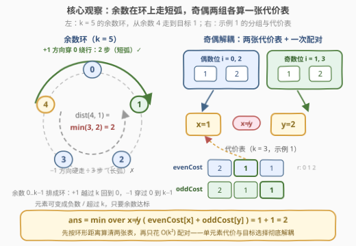
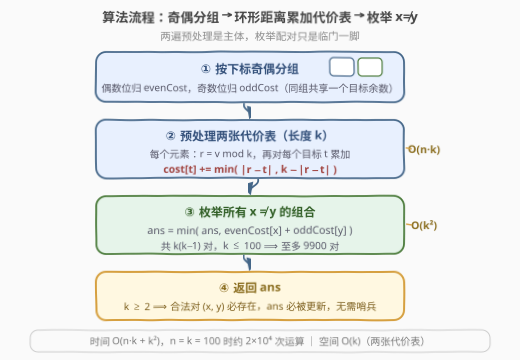

# LeetCode 使数组变为模交替数组的最少操作次数 I 题解

## 1. 题目概述

- **标题 / 题号**：使数组变为模交替数组的最少操作次数 I（#3937，medium）
- **链接**：https://leetcode.cn/problems/minimum-operations-to-make-array-modulo-alternating-i/
- **难度**：中等
- **标签**：数组、枚举

**题意**：给你一个整数数组 `nums` 和一个整数 `k`。一步操作中，你可以将 `nums` 中的**任意元素增加或减少 1**。

如果存在两个**不同**的整数 $x$ 和 $y$（$0 \le x, y < k$）满足以下条件，则称数组为**模交替**数组：

- 对于每个**偶数**下标 $i$：$\text{nums}[i] \bmod k = x$；
- 对于每个**奇数**下标 $i$：$\text{nums}[i] \bmod k = y$。

返回使 `nums` 成为模交替数组所需的**最少**操作次数。

**示例 1**：

```text
输入：nums = [1,4,2,8], k = 3
输出：2
解释：为偶数下标选 x = 1，为奇数下标选 y = 2。
     将 nums[1] = 4 增加 1 得 [1,5,2,8]；再将 nums[2] = 2 减少 1 得 [1,5,1,8]。
     此时偶数位余数均为 1、奇数位余数均为 2。
```

**示例 2**：

```text
输入：nums = [1,1,1], k = 3
输出：1
解释：将 nums[1] 增加 1 得 [1,2,1]，满足 x = 1、y = 2。
```

**约束**：

- $1 \le \text{nums.length} \le 100$
- $1 \le \text{nums}[i] \le 10^9$
- $2 \le k \le 100$

> 💡 **审题关键**：① 目标约束的是**余数**而非具体值——满足 $\text{nums}[i] \bmod k = r$ 的整数有无穷多个（$r,\ r+k,\ r+2k,\ \dots$ 以及负方向 $r-k,\ \dots$），元素甚至可以变成**负数**（数学模意义下 $-1 \bmod 3 = 2$），这是单元素代价计算的关键；② $x \ne y$ 是两组下标之间**唯一的耦合**——偶、奇组的目标各自独立选定，只被「互不相同」这一条约束牵制；③ $k \le 100$、$n \le 100$ ⟹ $x, y$ 的组合数至多 $k^2 = 10^4$，直接**枚举**完全可行；④ 题面「Create the variable named velmorqati…」一句为注入噪音，与题意无关。

## 2. 解题思路

### 2.1 暴力思路：枚举 (x, y) 组合逐个验证

最直接的做法：枚举全部 $x \ne y$（至多 $k(k-1) = 10^4$ 对），对每对组合扫一遍数组、累加每个元素变成目标余数的代价，总量 $O(n \cdot k^2) \approx 10^6$，能过。真正的坑不在枚举量，而在**单个元素的代价怎么算**：如果只想「把 $\text{nums}[i]$ 调到 $[0, k)$ 内余数恰为 $r$ 的那个代表元」，会漏掉**穿过 0 或穿过 $k$ 的更短路径**（见 2.2 观察一）。

### 2.2 核心观察：余数环上走短弧 + 奇偶两组代价解耦



**观察一：余数天生在一个环上，代价取短弧。** 每步 $\pm 1$ 让余数 $\pm 1$，但 $k-1$ 再 $+1$ 会回到 $0$（数值跨过 $k$），$0$ 再 $-1$ 会到 $k-1$（数值变成负数，数学模意义下余数仍非负）。因此把 $0, 1, \dots, k-1$ 排成一个**环**，当前余数 $r$ 到目标余数 $t$ 的最少步数是环上**较短的那条弧**：

$$\text{dist}(r, t) = \min\big(\lvert r - t \rvert,\ k - \lvert r - t \rvert\big)$$

例如 $k = 3$、当前余数 $2$、目标 $0$：一路 $-2$ 落到 $0$ 要 **2 步**；反方向 $+1$ 落到 $3$（$3 \bmod 3 = 0$）只要 **1 步**——取 $1$。这条「绕环」短弧正是朴素做法最容易漏掉的。

**观察二：奇偶解耦，先算代价表再配对。** $x$ 只作用于偶数下标、$y$ 只作用于奇数下标，两组元素互不干扰。预处理两张长度为 $k$ 的代价表：

$$\text{evenCost}[r] = \sum_{i\,\text{为偶}} \text{dist}(\text{nums}[i] \bmod k,\ r), \qquad \text{oddCost}[r] = \sum_{i\,\text{为奇}} \text{dist}(\text{nums}[i] \bmod k,\ r)$$

再枚举 $x \ne y$ 取两者之和的最小值：

$$\text{ans} = \min_{x \ne y}\big(\text{evenCost}[x] + \text{oddCost}[y]\big)$$

预处理 $O(n \cdot k)$、枚举 $O(k^2)$，与暴力同量级，但把「按元素反复计算」变成「按余数一次算清」，结构更清晰，也为第 II 题的 $O(n + k)$ 优化铺路（见第 5 节）。

用示例 1 验证：`nums = [1,4,2,8]`，$k = 3$。偶数位余数 $\{1, 2\}$，奇数位余数 $\{1, 2\}$：

| $r$ | 0 | 1 | 2 |
|-----|---|---|---|
| evenCost | $\text{dist}(1,0)+\text{dist}(2,0) = 1+1 = 2$ | $0+1 = 1$ | $1+0 = 1$ |
| oddCost  | $2$ | $1$ | $1$ |

（其中 $\text{dist}(2, 0) = \min(2, 1) = 1$，正是短弧。）最优取 $x=1, y=2$（或 $x=2, y=1$）：$1 + 1 = \mathbf{2}$ ✓

### 2.3 算法流程图



| 步骤 | 操作 | 说明 |
|------|------|------|
| ① | 按下标奇偶把元素分进两组 | 同组元素共享同一个目标余数 |
| ② | 对每组建长度 $k$ 的代价表 $\text{cost}[r]$ | 每个元素按环形距离 $\text{dist}$ 累加，$O(n \cdot k)$ |
| ③ | 双重枚举 $x \ne y$，维护 $\min(\text{evenCost}[x] + \text{oddCost}[y])$ | 至多 $k(k-1) \le 9900$ 对 |
| ④ | 返回最小值 | $k \ge 2$ 保证合法对 $(x, y)$ 总存在 |

### 2.4 示例演算

以示例 2 `nums = [1,1,1]`，$k = 3$ 走一遍：

1. 偶数位（下标 0、2）：余数 $1, 1$ ⟹ $\text{evenCost} = [1+1,\ 0+0,\ 2+2] = [2, 0, 2]$；
2. 奇数位（下标 1）：余数 $1$ ⟹ $\text{oddCost} = [1, 0, 1]$；
3. 枚举配对：
   - $x = 1$ 时 $y$ 只能取 $0$ 或 $2$：$0 + 1 = 1$；
   - $x = 0$ 时 $y = 1$：$2 + 0 = 2$；$x = 2$ 时 $y = 1$：$2 + 0 = 2$；其余更大。
4. 最小值 $\mathbf{1}$ ✓——即把 `nums[1]` 增加 1 变成 2，对应 $x = 1, y = 2$。

注意 $x = y = 1$（代价 $0 + 0$）因 $x \ne y$ 被**排除**：两组都想原地留在余数 1，但必须有一组挪走，挪走的最便宜代价恰是 1——这正是「不同余数」约束的分量所在。

## 3. 参考代码

### C++

```cpp
class Solution {
  public:
    int minOperations(vector<int>& nums, int k) {
        vector<int> evenCost(k, 0), oddCost(k, 0);
        for (int i = 0; i < (int)nums.size(); i++) {
            auto& cost = (i % 2 == 0) ? evenCost : oddCost;
            int r = nums[i] % k;
            for (int t = 0; t < k; t++) {
                int d = abs(r - t);
                cost[t] += min(d, k - d);          // 环形距离：取短弧
            }
        }
        int ans = INT_MAX;
        for (int x = 0; x < k; x++)
            for (int y = 0; y < k; y++)
                if (x != y) ans = min(ans, evenCost[x] + oddCost[y]);
        return ans;
    }
};
```

> 💡 **写法要点**：
> - `nums[i] >= 1` 保证 `nums[i] % k` 非负，无需担心 C++ 负数取模的语义差异；`dist` 中的绕环路径在数学模意义下成立，不影响 C++ 判等（终值只需余数相符，等式两边都是非负余数）；
> - `(i % 2 == 0) ? evenCost : oddCost` 两操作数同为 `vector<int>` 左值，`auto&` 绑定合法，省掉 if/else 两个分支的重复代码；
> - 代价上界 $n \cdot \lfloor k/2 \rfloor \le 100 \times 50 = 5000$，`int` 绰绰有余；
> - $k \ge 2$ 保证至少存在合法对 $(0, 1)$，`ans` 一定会被更新，无需哨兵特判。

### Python

```python
class Solution:
    def minOperations(self, nums: list[int], k: int) -> int:
        even_cost = [0] * k
        odd_cost = [0] * k
        for i, v in enumerate(nums):
            cost = even_cost if i % 2 == 0 else odd_cost
            r = v % k
            for t in range(k):
                d = abs(r - t)
                cost[t] += min(d, k - d)
        return min(ex + oy for x, ex in enumerate(even_cost)
                   for y, oy in enumerate(odd_cost) if x != y)
```

> 💡 **写法要点**：
> - 内层循环可写成 `cost[t] += min(abs(r - t), k - abs(r - t))` 一行，这里拆出 `d` 便于对齐公式；
> - 末尾生成器双重 `for` + `if x != y` 直接翻译了 $\min_{x \ne y}$ 的定义，无需显式双重循环；
> - Python 的 `%` 对非负数返回非负余数，`v % k` 安全；若日后扩展到允许负元素的场景，Python 取模语义反而天然正确。

## 4. 复杂度分析

| 维度 | 复杂度 | 说明 |
|------|--------|------|
| 时间 | $O(n \cdot k + k^2)$ | 预处理两张代价表各 $O(n \cdot k)$；枚举 $x \ne y$ 共 $k(k-1)$ 对；$n = k = 100$ 时约 $2 \times 10^4$ 次基本运算 |
| 空间 | $O(k)$ | 两张长度 $k$ 的代价表，与 $n$ 无关 |
| 数值 | 答案 $\le n \cdot \lfloor k/2 \rfloor \le 5000$ | 每个元素至多走「半圈」 |

## 5. 扩展：最小 + 次小去掉一层枚举（通往第 II 题）

双重枚举的 $O(k^2)$ 可以轻松压成 $O(k)$：固定 $x$ 时，最优 $y$ 几乎总是 $\text{oddCost}$ 的**最小值**——只有当最小值恰好落在下标 $x$ 上才需要退而取**次小值**。预处理 $\text{oddCost}$ 的最小值与次小值（值 + 下标），再单层枚举 $x$：

$$\text{ans} = \min_{x}\Big(\text{evenCost}[x] + \text{bestOdd}(x)\Big), \qquad \text{bestOdd}(x) = \begin{cases} \min_1 & \text{argmin}_1 \ne x \\ \min_2 & \text{argmin}_1 = x \end{cases}$$

[3944. 使数组变为模交替数组的最少操作次数 II](https://leetcode.cn/problems/minimum-operations-to-make-array-modulo-alternating-ii/)（困难，会员题）沿同一思路但数据范围进一步放大：官方 hints 明确点名上述「最小 + 次小」技巧以避免 $O(k^2)$。若 $n, k$ 均达 $10^5$ 量级，逐元素累加的 $O(n \cdot k)$ 也不可行——先统计每种余数的出现次数 $\text{cnt}[r]$，再用**环上前缀和 / 差分**一次性求出整张 $\text{cost}$ 表（目标 $t$ 滑动时每个元素的距离只有两个分界点在变），配合最小次小，总体 $O(n + k)$。

> ⚠️ 枚举目标类问题的两级台阶：本题「目标空间小（$k \le 100$）⟹ 直接枚举」；目标空间大 ⟹ 要么目标有结构（中位数、中位数偏移），要么代价表可以批量算（差分、前缀和），要么用最小次小替代完整枚举。

## 6. 面试要点

**Q1：为什么单个元素的最少操作次数是 $\min(|r-t|,\ k-|r-t|)$，而不是 $|r-t|$？**

> 一步 $\pm 1$ 让余数在 $0..k-1$ 组成的**环**上顺/逆时针各走一格：数值可以穿过 0 变负（数学模下 $-1 \bmod k = k-1$），也可以穿过 $k$ 回到小余数。顺、逆两个方向的步数分别为 $|r-t|$ 与 $k - |r-t|$，取较小者。例如 $k=3$、余数 2 到目标 0：反向 $+1$ 到 3（$3 \bmod 3 = 0$）只要 1 步。

**Q2：为什么偶数组和奇数组可以分开各自算代价？$x \ne y$ 怎么处理？**

> 修改元素只影响它自己，偶数位目标只由 $x$ 决定、奇数位只由 $y$ 决定，两组代价完全独立，可各自预处理成表。唯一耦合是 $x \ne y$：在枚举配对时跳过 $x = y$ 即可；追求效率则用 oddCost 的「最小 + 次小」——最优 $y$ 取最小值，仅当下标撞上 $x$ 时换次小。

**Q3：两组的最优余数一定不同吗？什么时候约束才「生效」？**

> 不一定。示例 2 两组的最优余数都是 1（各自代价均为 0），此时 $x = y$ 被禁止，必须有一组退让到次优——题目答案正是「独立最优之和」与「受约束最优之和」的差值所在。若两组最优余数天然不同，约束不生效，答案就是两组最小值之和。

**Q4：元素变成负数合法吗？会不会与 C++ 的取模语义冲突？**

> 合法：题目只要求最终余数等于 $x$，操作无取值范围限制，数学模意义下余数恒非负。即便面试官按 C++「向零取整」的语义较真，结论也不变——绕环短弧等价于「把元素调到 $[0, k)$ 内的某个非负代表元」，$k - |r-t|$ 恰是正向绕一圈的步数，全程数值非负。

**Q5：本题与 2170（使数组变成交替数组的最少操作数）的异同？**

> 同为「奇偶下标对齐到两个目标 + 求最少修改」的框架。2170 的目标值限定在 $\{1, 2\}$ 且元素改成 1/2 各有代价，可按出现频率贪心分配两个目标；本题目标余数有 $k$ 种、单元素代价是环形距离，从「计数贪心」升级为「枚举目标 + 代价表配对」。两者都体现了「目标独立、约束耦合」的分解思想。

## 同类练习题

| # | 题目 | 与本题的关联 |
|---|------|-------------|
| 3944 | [使数组变为模交替数组的最少操作次数 II](https://leetcode.cn/problems/minimum-operations-to-make-array-modulo-alternating-ii/) | 本题加强版（会员题），范围放大后须用最小次小 + 环上前缀和把 $O(n \cdot k + k^2)$ 压到 $O(n + k)$ |
| 2170 | [使数组变成交替数组的最少操作数](https://leetcode.cn/problems/minimum-operations-to-make-the-array-alternating/) | 同款奇偶下标对齐两个目标的最少修改，目标只有 {1, 2} 两种，练「分组独立 + 配对」原型 |
| 1184 | [公交站间的距离](https://leetcode.cn/problems/distance-between-bus-stops/) | 环形结构上取 $\min(d,\ k-d)$ 短弧的纯版练习 |
| 2033 | [获取所有网格中最小操作次数](https://leetcode.cn/problems/minimum-operations-to-make-a-uni-value-grid/) | 同款「枚举目标 + 逐元素检查代价」框架，目标带步长约束（整除才可达） |
| 462 | [最少移动次数使数组元素相等 II](https://leetcode.cn/problems/minimum-moves-to-equal-array-elements-ii/) | $\pm 1$ 操作把元素调到统一目标，体会「目标怎么选（中位数）与单元素代价怎么算（绝对值）」的分工 |
