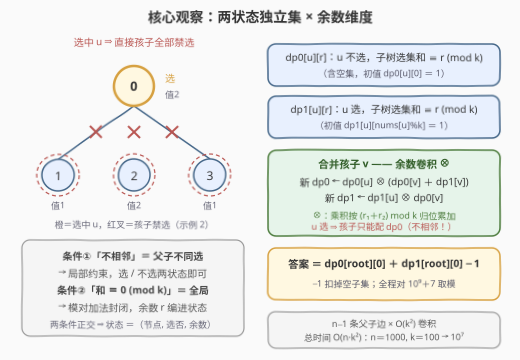
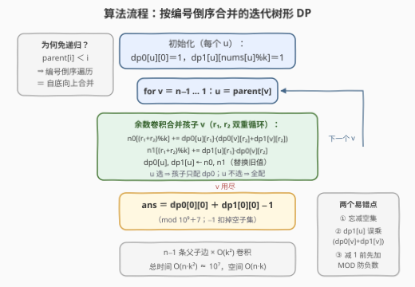

# LeetCode 统计有根树中不相邻子集的数目 题解

## 1. 题目概述

- **标题 / 题号**：统计有根树中不相邻子集的数目（#3939，hard）
- **链接**：https://leetcode.cn/problems/count-non-adjacent-subsets-in-a-rooted-tree/
- **难度**：困难
- **标签**：树、深度优先搜索、数组、动态规划

**题意**：给一棵 $n$ 个节点的**有根树**（根为节点 0），由 `parent` 数组描述（$parent[0] = -1$，且对 $1 \le i < n$ 有 $parent[i] < i$）。节点 $i$ 的值为 $\text{nums}[i]$，另给整数 $k$。节点的一个**非空子集**称为**有效子集**，当且仅当：

1. 所选节点的值之**和能被 $k$ 整除**；
2. 所选节点中**没有两个节点相邻**（即节点与其**直接父节点**不能同时入选）。

返回有效子集的数量对 $10^9 + 7$ 取模的结果。

**示例 1**：

```text
输入：parent = [-1,0,1], nums = [1,2,3], k = 3
输出：1
解释：链 0-1-2。唯一有效的子集是 {2}：值为 3，能被 3 整除；
      {1,2}、{0,2} 各含一条父子边（不相邻条件破坏），{0}、{1}、{0,1} 等和不为 3 的倍数。
```

**示例 2**：

```text
输入：parent = [-1,0,0,0], nums = [2,1,2,1], k = 3
输出：2
解释：星形树（0 为中心，孩子 1、2、3）。
      {1,2}：和 1+2=3 ✓，节点 1、2 同为 0 的孩子、互不相邻 ✓；
      {2,3}：和 2+1=3 ✓，同理不相邻 ✓。
      没有其他子集同时满足两个条件。
```

**约束**：

- $n = \text{parent.length} = \text{nums.length} \le 1000$
- $parent[0] = -1$；对 $1 \le i < n$ 有 $0 \le parent[i] < i$（**父节点编号必小于子节点**）
- $1 \le \text{nums}[i] \le 10^9$
- $1 \le k \le 100$

> 💡 **审题关键**：① 「相邻」只指**直接父子边**，不是树上任意距离——子集合法当且仅当它是树上的**独立集**；② 「和被 $k$ 整除」是一个**全局条件**，任何局部都无法判定，必须把它编入 DP 状态；③ $parent[i] < i$ 是白送的**拓扑序**——编号倒序遍历即可自底向上合并，连递归都免了；④ $n \le 1000$、$k \le 100$ 暗示状态规模 $n \cdot k = 10^5$、转移 $n \cdot k^2 = 10^7$，多项式树形 DP 刚好卡进预算。

## 2. 解题思路

### 2.1 暴力思路

按定义直译：枚举全部 $2^n - 1$ 个非空子集，对每个子集检查「任意父子边两端不同选」与「元素和 $\equiv 0 \pmod k$」。单次检查 $O(n)$，总计 $O(2^n \cdot n)$——$n = 1000$ 时是天文数字，彻底不可行。

暴力的浪费在于**无视树的局部结构**：「不相邻」约束只发生在父子边上，一个子集是否合法，可以在**子树上局部地**判断并聚合——这正是树形 DP 的用武之地。而「和被 $k$ 整除」虽然全局，但**模运算对加法封闭**（$(a \bmod k) + (b \bmod k)$ 的余数信息足以推出总和的余数），可以像背包一样把余数做成状态维度逐层携带。

### 2.2 核心观察：两状态独立集 × 余数维度



**观察一（「不相邻」→ 两状态）**：树的边全部是父子边，所以「子集内无相邻节点」等价于「每个节点与其父节点不同选」——一个**局部**约束。这正是 [337. 打家劫舍 III](https://leetcode.cn/problems/house-robber-iii/) 的经典模式：对每个节点 $u$ 设两个状态——

- $dp_0[u][r]$：$u$ **不选**，$u$ 的子树中选出的子集（**含空集**）和 $\equiv r \pmod k$ 的方案数；
- $dp_1[u][r]$：$u$ **选**，$u$ 的子树中选出的子集和 $\equiv r \pmod k$ 的方案数。

**观察二（「整除」→ 余数维度）**：单独一个节点 $u$ 贡献余数 $\text{nums}[u] \bmod k$；两棵不相交子树的选集合并时，总余数 $= (r_1 + r_2) \bmod k$。因此**合并孩子就是一次「余数卷积」**——把孩子的余数分布卷进父节点状态，$r = 0$ 那一格到最后就是答案要的「和被 $k$ 整除」。

**观察三（$parent[i] < i$ → 免递归）**：父编号恒小于子编号，则 $v$ 从 $n-1$ 倒序遍历到 $1$、每步把 $v$ 合并进 $parent[v]$，保证任意节点在被合并进父亲之前，它的所有孩子都已合并完毕——**纯迭代即可完成自底向上的树形 DP**，不必建邻接表、不必递归（也就没有爆栈顾虑）。

**转移方程**（把初始只含 $u$ 自身的状态，逐个「卷」入每个孩子 $v$；$r = (r_1 + r_2) \bmod k$）：

$$
\text{new}\,dp_0[r] \;=\; \sum_{(r_1+r_2)\bmod k = r} dp_0[u][r_1] \cdot \big(dp_0[v][r_2] + dp_1[v][r_2]\big)
$$

$$
\text{new}\,dp_1[r] \;=\; \sum_{(r_1+r_2)\bmod k = r} dp_1[u][r_1] \cdot dp_0[v][r_2]
$$

两式差别只在「孩子侧可用什么」：$u$ **不选**时孩子 $v$ 选不选都行（配 $dp_0[v] + dp_1[v]$）；$u$ **选**时孩子必须不选（**只能配 $dp_0[v]$**）——「不相邻」约束整个就浓缩在这一个不对称里。

**初始与答案**：$dp_0[u][0] = 1$（空集，和为 0）、$dp_1[u][\text{nums}[u] \bmod k] = 1$（只选 $u$）。全部合并到根后：

$$
\text{ans} = \big(dp_0[\text{root}][0] + dp_1[\text{root}][0] - 1\big) \bmod (10^9+7)
$$

**减 1** 扣掉的是 $dp_0[\text{root}][0]$ 里恒有的那个空子集（题目要求非空）。

> ⚠️ **常见翻车**：① 忘记减空集，或减 1 时没先加 MOD——取模后 $dp_0[\text{root}][0]$ 可能已经绕回一个较小值，直接减会出负数；② $u$ 选时孩子侧误乘 $(dp_0[v] + dp_1[v])$，把「父选子也选」的非法方案计入；③ 初值写成 $dp_1[u][\text{nums}[u]]$ 忘记模 $k$（$\text{nums}[i]$ 可达 $10^9$，直接当下标越界）；④ 合并孩子时在原数组上原地累加——必须先算好新数组再整体替换，否则同一次合并里会重复卷入孩子。

### 2.3 算法流程图



| 步骤 | 操作 | 说明 |
|------|------|------|
| ① 初始化 | 每个节点 $u$：$dp_0[u][0]=1$，$dp_1[u][\text{nums}[u]\%k]=1$ | 只含空集 / 只含 $u$ 自身两个「原子」状态 |
| ② 倒序遍历 | `for v = n−1 … 1`，取 $u = parent[v]$ | $parent[i] < i$ 保证此时 $v$ 的孩子已全部并入 $v$ |
| ③ 余数卷积 | 双重循环 $r_1, r_2 \in [0,k)$，按上节两条转移式累加到新数组 $n_0, n_1$ | 单次 $O(k^2)$；外层可跳过 $dp_0[u][r_1], dp_1[u][r_1]$ 同为零的余数 |
| ④ 替换 | $dp_0[u] \leftarrow n_0$，$dp_1[u] \leftarrow n_1$ | $v$ 的历史使命完成，其数组不再使用 |
| ⑤ 汇总 | $\text{ans} = (dp_0[0][0] + dp_1[0][0] - 1 + \text{MOD}) \bmod \text{MOD}$ | 减 1 扣空集；加 MOD 防负数 |

### 2.4 示例演算：parent = [-1,0,0,0], nums = [2,1,2,1], k = 3

星形树：根 0（值 2），孩子 1（值 1）、2（值 2）、3（值 1）。下表跟踪根节点 0 的两个 DP 数组（三元组按 $r = 0,1,2$ 展开）：

| 步骤 | $dp_0[0]$ | $dp_1[0]$ | 说明 |
|------|-----------|-----------|------|
| 初始 | $[1, 0, 0]$ | $[0, 0, 1]$ | $dp_1$ 初值落在 $\text{nums}[0] \bmod 3 = 2$；$dp_0$ 即空集 |
| 并入 $v{=}3$（值 1） | $[1, 1, 0]$ | $[0, 0, 1]$ | 孩子侧全量 $dp_0[3]{+}dp_1[3] = [1,1,0]$ 卷进 $dp_0$；$dp_1$ 只配 $dp_0[3]=[1,0,0]$，仍是 $\{0\}$ |
| 并入 $v{=}2$（值 2） | $[2, 1, 1]$ | $[0, 0, 1]$ | 孩子侧全量 $[1,0,1]$：$dp_0$ 收进 $\{2\}$（$r{=}0$）与 $\{3,2\}$（$r{=}0$）等 |
| 并入 $v{=}1$（值 1） | $[3, 3, 2]$ | $[0, 0, 1]$ | $dp_0$ 最终 $= 2^3 = 8$ 项全量分布：$\{1,2\},\{2,3\}$ 落在 $r{=}0$，另有空集也在 $r{=}0$ |
| **答案** | $3 + 0 - 1 = \mathbf{2}$ | | $dp_0[0][0] = 3$ 对应 $\{\varnothing,\{1,2\},\{2,3\}\}$，减去空集即 2 ✓ |

$dp_1[0]$ 始终只有 $\{0\}$（和为 2，$r=2$）——因为 0 一旦入选，三个孩子全被「不相邻」封禁，这正是转移式中 $dp_1$ 只配 $dp_0[v]$ 的直观体现。**示例 1**（链 0-1-2）同理：$dp_0[0][0]$ 最终为 2（空集与 $\{2\}$），$dp_1[0][0] = 0$，答案 $2 + 0 - 1 = 1$ ✓。

## 3. 参考代码

### C++

```cpp
class Solution {
public:
    int countValidSubsets(vector<int>& parent, vector<int>& nums, int k) {
        const int MOD = 1'000'000'007;
        int n = parent.size();
        // dp0[u][r]：u 不选（含空集）；dp1[u][r]：u 选。均为子树内和 ≡ r (mod k) 的方案数
        vector<vector<long long>> dp0(n, vector<long long>(k)), dp1(n, vector<long long>(k));
        for (int u = 0; u < n; u++) {
            dp0[u][0] = 1;
            dp1[u][nums[u] % k] = 1;
        }
        for (int v = n - 1; v >= 1; v--) {          // parent[v] < v ⇒ 倒序即自底向上
            int u = parent[v];
            vector<long long> n0(k), n1(k);
            for (int r1 = 0; r1 < k; r1++) {
                if (!dp0[u][r1] && !dp1[u][r1]) continue;   // 跳过双零余数，省常数
                for (int r2 = 0; r2 < k; r2++) {
                    int r = (r1 + r2) % k;
                    long long all = dp0[v][r2] + dp1[v][r2]; // u 不选：v 选不选都行
                    if (all) n0[r] = (n0[r] + dp0[u][r1] * all) % MOD;
                    if (dp1[u][r1] && dp0[v][r2])            // u 选：v 只能不选
                        n1[r] = (n1[r] + dp1[u][r1] * dp0[v][r2]) % MOD;
                }
            }
            dp0[u] = move(n0);
            dp1[u] = move(n1);
        }
        return (dp0[0][0] + dp1[0][0] - 1 + MOD) % MOD;      // 减去空子集（先加 MOD 防负）
    }
};
```

### Python

```python
class Solution:
    def countValidSubsets(self, parent: List[int], nums: List[int], k: int) -> int:
        MOD = 10**9 + 7
        n = len(parent)
        dp0 = [[0] * k for _ in range(n)]   # u 不选（含空集）
        dp1 = [[0] * k for _ in range(n)]   # u 选
        for u in range(n):
            dp0[u][0] = 1
            dp1[u][nums[u] % k] = 1
        for v in range(n - 1, 0, -1):       # parent[v] < v ⇒ 倒序即自底向上
            u = parent[v]
            n0 = [0] * k
            n1 = [0] * k
            for r1 in range(k):
                a, b = dp0[u][r1], dp1[u][r1]
                if a == 0 and b == 0:       # 跳过双零余数，省常数
                    continue
                for r2 in range(k):
                    r = (r1 + r2) % k
                    if a:                    # u 不选：v 选不选都行
                        n0[r] = (n0[r] + a * (dp0[v][r2] + dp1[v][r2])) % MOD
                    if b and dp0[v][r2]:     # u 选：v 只能不选
                        n1[r] = (n1[r] + b * dp0[v][r2]) % MOD
            dp0[u], dp1[u] = n0, n1
        return (dp0[0][0] + dp1[0][0] - 1) % MOD   # 减去空子集（Python 负数取模天然安全）
```

> 💡 **写法要点**：① 合并必须「新数组算完再整体替换」，切不可原地累加——同一条父子边会被卷多次；② 内层循环前的双零跳过不是摆设：初始 $dp_1[u]$ 只有一个非零格、$dp_0[u]$ 也只有一个，树越浅稀疏度越高，实测能省不少常数；③ C++ 中 $dp_0[u][r_1] \le 10^9$、`all` $\le 2 \times 10^9$，乘积约 $2\times10^{18}$，仍在 `long long` 安全范围内；④ Python 的 `%` 对负数结果非负，`(a + b - 1) % MOD` 直接安全；C++ 必须手动 `+ MOD`。

## 4. 复杂度分析

| 维度 | 复杂度 | 说明 |
|------|--------|------|
| **时间** | $O(n \cdot k^2)$ | $n-1$ 条父子边各做一次 $O(k^2)$ 余数卷积；$n=1000,\ k=100$ 时约 $10^7$ 次乘加，轻松通过 |
| **空间** | $O(n \cdot k)$ | 两张 $n \times k$ 的 DP 表（约 $2\times10^5$ 个数）；已并入父节点的行可顺手置空提前释放 |
| **对比暴力** | $O(2^n \cdot n) \to O(nk^2)$ | 「不相邻」是父子边上的局部约束，树形 DP 把全局枚举压缩成逐边合并；「整除」借模加法封闭性搭上余数维度的顺风车 |

## 5. 扩展：变体与优化

**$k = 1$ 的退化**：余数维度塌缩成一格，「被 1 整除」恒真，问题退化为**统计树上独立集个数**——即打家劫舍 III 的「计数版」。此时若树退化成链，转移是斐波那契式的线性递推，可用矩阵快速幂做到 $O(\log n)$（同打家劫舍 II 的处理思路）。

**换根版本**：若题目改为「对每个可能的根分别统计」，单次树形 DP 不够，需上 **rerooting（换根 DP）」：先一次自底向上求出以 0 为根的答案，再自顶向下把「父亲侧的贡献」折算进每个节点——余数卷积在这里会遇到「除法还原」问题，需要记录前缀/后缀卷积结果绕开逆元不存在的情况。

**生成函数视角**：$dp_0[u]$、$dp_1[u]$ 本质是多项式 $\sum_r c_r x^r$ 在 $x^k = 1$（即模 $x^k - 1$）意义下的**循环卷积**系数表。$k$ 增大时（本题 $k \le 100$ 无所谓），单次合并可用 NTT 把 $O(k^2)$ 降到 $O(k \log k)$；这也是「树上背包类 DP + 卷积优化」的通用加速套路。

## 6. 面试要点

**Q1：为什么「不相邻」只需要检查父子边，而不用考虑树上距离更远的点对？**

> 树的边集就是全部父子边。「子集中存在相邻点对」$\iff$「某条边的两个端点同时入选」$\iff$「某个节点和它的直接父节点同时入选」。距离 $\ge 2$ 的点对（如兄弟、爷孙）在树上本来就没有边，天然不冲突——示例 2 的 $\{1,2\}$（兄弟对）正是利用了这一点。

**Q2：为什么「和被 $k$ 整除」必须进状态，而不能先合并子树和、最后统一判定？**

> 两个原因：其一，「$\equiv 0 \pmod k$」是全局条件，子树局部判定不了，若不在合并时携带余数信息，合并完成后就无法拆开重判；其二，直接存子树和不可行（和可达 $1000 \times 10^9 = 10^{12}$，无法做数组下标），而模运算对加法封闭——$(a+b) \bmod k$ 只依赖 $a \bmod k$ 与 $b \bmod k$——余数 $k$ 个取值就是完整且最小的充分信息。

**Q3：转移式中 $dp_1$ 合并时为什么只能乘 $dp_0[v]$？漏乘 $dp_1[v]$ 会怎样？**

> $u$ 入选则其直接孩子 $v$ 必须不选，孩子侧只允许「$v$ 不选」的方案（$dp_0[v]$，含 $v$ 子树里其余节点的合法选取）。若误乘 $(dp_0[v]+dp_1[v])$，等于允许「父选子也选」，会把违反不相邻约束的方案计入——这是本题最典型的 WA 点。反向不对称：$u$ 不选时 $v$ 选不选都合法，所以 $dp_0$ 侧配全量。

**Q4：最终答案为什么要减 1？减的时候有什么坑？**

> $dp_0[\text{root}][0]$ 的初值就是空集（和为 0，余数 0），题目只要非空子集，所以减 1。坑在取模：计数值可达 $2^{1000}$ 量级，中间早已绕模若干圈，$dp_0[\text{root}][0] + dp_1[\text{root}][0]$ 的**模后值**完全可能是 0，直接减 1 得 $-1$。C++ 要写 `(a + b - 1 + MOD) % MOD`；Python 的 `%` 结果非负，`(a + b - 1) % MOD` 即可。

**Q5：`parent[i] < i` 这个条件在解法里起了什么作用？没有它怎么办？**

> 它保证父编号小于子编号，于是 `v` 从 $n-1$ 倒序扫到 $1$、逐个并入 `parent[v]` 时，任何节点在被并入父亲前必已收齐全部孩子——纯迭代的自底向上合并，无需建邻接表、无需递归（链长 1000 时递归也行，但迭代天然免疫爆栈）。若没有该条件，就得先从根 DFS 求出遍历序（或拓扑序），再按序合并，复杂度不变，多一遍建图。

## 同类练习题

| # | 题目 | 与本题的关联 |
|---|------|-------------|
| 337 | [打家劫舍 III](https://leetcode.cn/problems/house-robber-iii/)（[题解](../0301-0400/337_打家劫舍III.md)） | 树上独立集 DP 的祖师爷——去掉本题的余数维度，剩下的 $dp_0/dp_1$ 两状态就是它 |
| 198 | [打家劫舍](https://leetcode.cn/problems/house-robber/) | 链上（数组版）不相邻选数的状态机原型，先懂它再看树上版 |
| 968 | [监控二叉树](https://leetcode.cn/problems/binary-tree-cameras/)（[题解](../0901-1000/968_监控二叉树.md)） | 父子覆盖约束下的三状态树形 DP，体会「约束越复杂、状态越多」的设计规律 |
| 1519 | [带给定标签的二叉树中的节点数](https://leetcode.cn/problems/number-of-nodes-in-the-sub-tree-with-the-same-label/)（[题解](../1501-1600/1519_带给定标签的二叉树中的节点数.md)） | 子树计数桶（26 维）自底向上合并，与本题的余数桶同款「维度计数进树形 DP」 |
| 2538 | [最大价值和与最小价值和的差值](https://leetcode.cn/problems/difference-between-maximum-and-minimum-price-sum/)（[题解](../2501-2600/2538_最大价值和与最小价值和的差值.md)） | 树形 DP 中聚合子树贡献、处理父子依赖的另一变体 |
