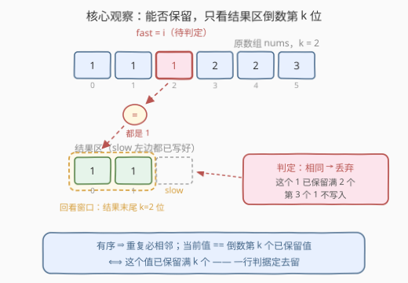
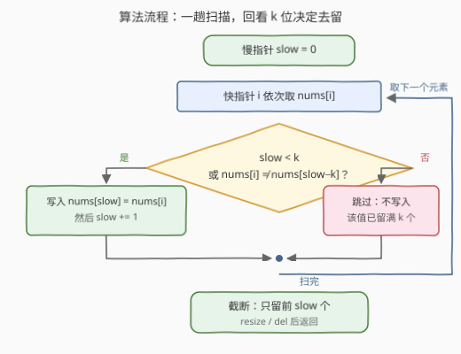

# LeetCode 限制有序数组中的元素出现次数 题解

## 1. 题目概述

- **标题 / 题号**：限制有序数组中的元素出现次数（#3940，easy）
- **链接**：https://leetcode.cn/problems/limit-occurrences-in-sorted-array/
- **难度**：简单
- **标签**：数组、双指针

**题意**：给你一个**按升序排序**的整数数组 `nums` 和一个整数 `k`。返回一个数组，使得每个**不同**元素最多出现 `k` 次，同时保持 `nums` 中元素的相对顺序不变。

**示例 1**：

```text
输入：nums = [1,1,1,2,2,3], k = 2
输出：[1,1,2,2,3]
解释：元素 1 出现 3 次，只保留其中 2 次；元素 2 出现 2 次，全部保留；元素 3 出现 1 次，保留。
```

**示例 2**：

```text
输入：nums = [1,2,3], k = 1
输出：[1,2,3]
解释：所有元素互不相同，已最多出现一次，数组保持不变。
```

**约束**：

- $1 \le \text{nums.length} \le 100$
- $1 \le \text{nums}[i] \le 100$
- `nums` 按**非递减**顺序排序
- $1 \le k \le \text{nums.length}$

**进阶**：你能使用原地算法，并仅使用 $O(1)$ 额外空间解决该问题吗？（返回结果所占空间不计入）

> 💡 **审题关键**：① 「升序」是最大的礼物——**相同元素必然相邻**，限流对象是一段段连续游程，无须哈希表全局找重；② 「保持相对顺序」⇒ 输出是 `nums` 的子序列；同一值保留哪 $k$ 个副本无所谓（值全相同，输出一致），答案唯一；③ 输出以**返回值**给出，但进阶要求原地 $O(1)$ 额外空间——这指向快慢指针原地覆写。

## 2. 解题思路

### 2.1 暴力思路：哈希计数配额

最直白的做法分两趟：第一趟用哈希表（或值域数组）统计每个值的出现次数；第二趟从头扫描，为每个值维护「已输出个数」配额，没发满 $\min(\text{cnt}, k)$ 个就继续追加：

```python
quota = {}
res = []
for x in nums:
    if quota.get(x, 0) < k:
        res.append(x)
        quota[x] = quota.get(x, 0) + 1
return res
```

正确性一目了然，$n \le 100$ 稳过。但它有两趟扫描、一张 $O(D)$ 的哈希表（$D$ 为不同值个数），且**完全无视了「有序」这个条件**——无序数组这么做是必须的，有序数组这么做就浪费了。

一个轻量改进是**游程计数**（官方 hint 的思路）：一趟扫描，维护「当前游程值 `cur` 及其已保留个数 `cnt`」，值一变就重置，`cnt` 到 $k$ 就丢弃。已经是 $O(n)$ / $O(1)$ 了，但 `cur`、`cnt` 两个状态变量加上游程切换的分支，边界一多就容易写错。

那能不能把「已保留几个」这个状态**彻底省掉**？可以——回看 $k$ 位。

### 2.2 核心观察：快慢双指针——回看 k 位



设慢指针 `slow` 标记**已写好的结果长度**（`nums[0..slow-1]` 是保序去超额后的前缀），快指针 `i` 顺序扫描原数组。判定 `nums[i]` 去留只需一行：

$$\text{slow} < k \ \ \text{或} \ \ \text{nums}[i] \ne \text{nums}[\text{slow}-k] \quad\Longrightarrow\quad \text{写入 } \text{nums}[\text{slow}]，\ \text{slow}{+}{+}$$

**为什么「回看结果区倒数第 $k$ 个」就够？**

- **有序 ⇒ 重复必相邻**。结果区末尾 $k$ 个元素 `nums[slow-k..slow-1]` 来自原数组中一段连续区间，其值被夹在 $\text{nums}[\text{slow}-k]$ 与 $\text{nums}[i]$ 之间（非递减性，来源下标都落在两者之间）。
- 若 $\text{nums}[i] = \text{nums}[\text{slow}-k]$：两头一夹，这 $k$ 个已保留元素**全等于** $\text{nums}[i]$——当前元素是该值的第 $k+1$ 个副本，必须丢。
- 若不等（必然更大，因为有序）：说明当前游程保留数还没满 $k$（或刚开新游程），放心写入。

**写入安全吗？** 安全。不变式 $\text{slow} \le i$ 恒成立（每跳过一个元素，$i$ 比 $\text{slow}$ 多领先 1）：写入位置要么就是当前读取位（写同值），要么落在已读过的区域——覆写永远不会破坏尚未读取的元素。

**`slow < k` 的短路**：结果不足 $k$ 个时，任何值都不可能已保留满 $k$ 个，直接写入；同时也保证了 `slow-k` 不为负下标。

> 💡 **一句话总结**：不用记计数器，判断当前元素能不能留，只需回头看结果区**倒数第 $k$ 个**——和它相同就该丢，不同就能留。这正是 26 题（$k=1$）与 80 题（$k=2$）经典模板的参数化推广。

### 2.3 算法流程图



| 步骤 | 操作 | 说明 |
|------|------|------|
| ① | 初始化 `slow = 0` | 结果区为空 |
| ② | 快指针 `i` 从左到右遍历 `nums` | 每个元素恰好被判定一次 |
| ③ | 判定：`slow < k` 或 `nums[i] != nums[slow-k]`？ | 是 → 覆写 `nums[slow]`，`slow++`；否 → 跳过 |
| ④ | 扫描结束，截断并返回前 `slow` 个元素 | C++ `resize(slow)` / Python `del nums[slow:]`，均原地 |

### 2.4 示例演算

以示例 1 `nums = [1,1,1,2,2,3]`，`k = 2` 为例（「回看位」即 `nums[slow-2]`）：

| $i$ | nums[i] | slow | 回看位 nums[slow−2] | 判定 | 动作 | 结果区 |
|-----|---------|------|--------------------|------|------|--------|
| 0 | 1 | 0 | —（slow < k） | 写 | nums[0]=1，slow=1 | [1] |
| 1 | 1 | 1 | —（slow < k） | 写 | nums[1]=1，slow=2 | [1,1] |
| 2 | 1 | 2 | nums[0]=1 | 相同 → 丢 | 跳过 | [1,1] |
| 3 | 2 | 2 | nums[0]=1 | 不同 → 写 | nums[2]=2，slow=3 | [1,1,2] |
| 4 | 2 | 3 | nums[1]=1 | 不同 → 写 | nums[3]=2，slow=4 | [1,1,2,2] |
| 5 | 3 | 4 | nums[2]=2 | 不同 → 写 | nums[4]=3，slow=5 | [1,1,2,2,3] |

返回前 `slow=5` 个元素：`[1,1,2,2,3]` ✓。

> ⚠️ 注意 $i=4$ 这一步的陷阱：正确判据看 `nums[slow-2] = nums[1] = 1`（还是原始值）。若误写成 `nums[i-2] = nums[2]`，该位置在第 3 步已被**覆写成 2**，`2 == 2` 会错误地丢掉第二个 2——反例 `[1,1,1,2,2], k=2` 将输出 `[1,1,2]`（正确为 `[1,1,2,2]`）。回看的必须是**结果区**的倒数第 $k$ 个，不是原数组的 $i-k$ 位（详见第 6 节 Q1）。

## 3. 参考代码

### C++

```cpp
class Solution {
  public:
    vector<int> limitOccurrences(vector<int>& nums, int k) {
        int slow = 0, n = nums.size();
        for (int i = 0; i < n; i++) {
            if (slow < k || nums[i] != nums[slow - k])
                nums[slow++] = nums[i];   // 写入结果区，slow 右移
        }
        nums.resize(slow);                // 原地截断，仅 O(1) 额外空间
        return nums;
    }
};
```

> 💡 **写法要点**：
> - `slow < k` 的短路**必须**写在 `nums[slow - k]` 之前——结果不足 $k$ 个时 `slow-k` 为负，短路求值保证不会越界访问；
> - `nums.resize(slow)` 只截断不重分配，天然满足进阶的 $O(1)$ 额外空间；
> - 不变式 `slow <= i` 使得覆写永远安全，无须额外缓冲区。

### Python

```python
class Solution:
    def limitOccurrences(self, nums: list[int], k: int) -> list[int]:
        slow = 0
        for i, x in enumerate(nums):
            if slow < k or x != nums[slow - k]:
                nums[slow] = x
                slow += 1
        del nums[slow:]          # 原地删除尾部，不新建列表
        return nums
```

> 💡 **写法要点**：
> - `enumerate` 中先取出 `x` 再执行 `nums[slow] = x`（`slow <= i`），读永远先于写，边遍历边覆写是安全的；
> - `del nums[slow:]` 是原地截断；若不想改动入参，可改 `return nums[:slow]`，代价是 $O(n)$ 额外空间；
> - 判据写成一行 `slow < k or x != nums[slow - k]`，`or` 的短路顺序同样是正确性的组成部分。

## 4. 复杂度分析

| 维度 | 复杂度 | 说明 |
|------|--------|------|
| 时间 | $O(n)$ | 快指针一趟扫完，每个元素一次比较、至多一次覆写 |
| 空间 | $O(1)$ | 仅 `slow`、`i` 两个下标；截断为原地操作（返回数组不计入，题目已说明） |
| 对比暴力 | 免哈希表、免第二趟 | 哈希配额版同为 $O(n)$ 时间但需 $O(D)$ 空间且未利用有序性；本解法把「已保留几个」的状态压进下标算术里 |

## 5. 扩展：一套模板统一三道题

本题判据 `slow < k || nums[i] != nums[slow-k]` 把经典去重双题**参数化**成了一条式子：

| 题目 | 限留个数 | 判据 |
|------|----------|------|
| [26. 删除有序数组中的重复项](https://leetcode.cn/problems/remove-duplicates-from-sorted-array/) | $k=1$ | `slow < 1 \|\| nums[i] != nums[slow-1]` |
| [80. 删除有序数组中的重复项 II](https://leetcode.cn/problems/remove-duplicates-from-sorted-array-ii/) | $k=2$ | `slow < 2 \|\| nums[i] != nums[slow-2]` |
| 本题 3940 | 任意 $k$ | `slow < k \|\| nums[i] != nums[slow-k]` |

面试中主动指出「把 $k$ 参数化后一条判据通吃三题」，是展示模板抽象能力的加分点。

**两个一步变形**：

- **数组无序**？先排序 $O(n \log n)$ 后同法；或退回 2.1 的哈希计数（$O(n)$ + $O(D)$ 空间）。
- **要求保留每个值的「最后 $k$ 个」**（而非前 $k$ 个）？从右往左扫，判据改成回看**已写结果的开头**方向即可，套路完全对称。

## 6. 面试要点

**Q1：回看的为什么是 `nums[slow-k]`（结果区倒数第 k 个），而不是 `nums[i-k]`？**

> 反例：`nums = [1,1,1,2,2], k = 2`。走到 $i=4$ 时 `slow=3`，正确判据看 `nums[slow-2] = nums[1] = 1 ≠ 2` → 保留；若误看 `nums[i-2] = nums[2]`，该位置在 $i=3$ 时已被**覆写成 2**，`2 == 2` → 错误丢弃，输出 `[1,1,2]`。根因：跳过元素会使 `i` 领先 `slow`，`i-k` 可能落进**已被覆写的区域**读到旧值的新含义；而 `slow-k` 永远指向结果区，语义恒定。

**Q2：「有序」这个前提用在了哪里？缺了它行不行？**

> 判据只回看一个位置就能推断「是否已保留满 $k$ 个」，依赖的是有序性夹逼：结果区倒数第 $k$ 个与当前元素之间的所有元素值都被夹在两者之间，两端相等则中间全等。无序数组上该结论不成立，必须退回哈希计数配额。

**Q3：`slow < k` 的短路为什么必须放在前面？**

> 两层原因：**语义上**，结果总数不足 $k$ 时任何值都不可能已保留满 $k$ 个，直接写入；**工程上**，此时 `slow-k` 为负下标，短路求值保证不会访问，否则 C++ 越界 / Python 取到**尾部元素**（负索引）——后者更隐蔽，负索引不报错但语义完全错误。

**Q4：边遍历边覆写，会不会破坏还没读到的元素？**

> 不会。不变式 `slow <= i` 恒成立：写入要么发生在当前位置（`slow == i`，写同值），要么发生在已读过的左侧区域。这是 26/27/80/283 等所有「原地覆写」类题目的共同骨架，值得作为条件反射说出。

**Q5：每个值保留的是前 $k$ 个还是后 $k$ 个？有区别吗？**

> 算法天然保留每段游程的**前** $k$ 个。但保留同一值的哪 $k$ 个副本，输出数组完全一致（副本值全相同），所以答案唯一、无须纠结。若题目变形为「保留最后 $k$ 个」，倒序扫描对称处理即可（见第 5 节）。

## 同类练习题

| # | 题目 | 与本题的关联 |
|---|------|-------------|
| 26 | [删除有序数组中的重复项](https://leetcode.cn/problems/remove-duplicates-from-sorted-array/) | 本题 $k=1$ 特例，同一套快慢指针模板 |
| 80 | [删除有序数组中的重复项 II](https://leetcode.cn/problems/remove-duplicates-from-sorted-array-ii/) | 本题 $k=2$ 特例，「回看两位」判定的出处 |
| 27 | [移除元素](https://leetcode.cn/problems/remove-element/) | 同款快慢指针原地覆写入门题，判据从「回看 $k$ 位」换成「不等于 val」 |
| 283 | [移动零](https://leetcode.cn/problems/move-zeroes/) | 快慢指针保序分区覆写的又一变体 |
| 1089 | [复写零](https://leetcode.cn/problems/duplicate-zeros/) | 反向教材——写入会**影响**后续读取，正向一趟不再可行，须从右往左扫，体会 `slow <= i` 不变式的另一面 |
