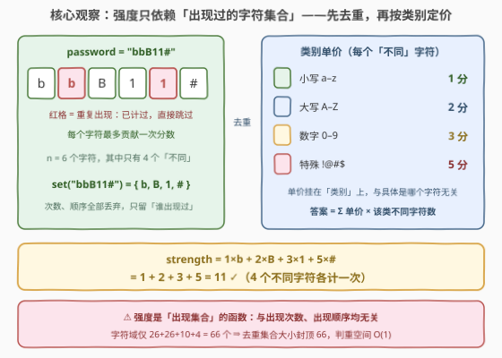
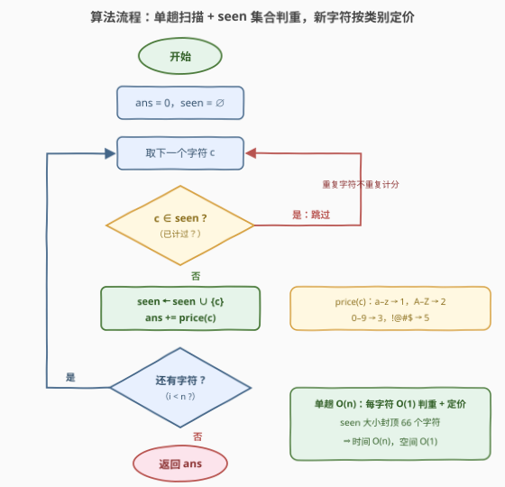

# LeetCode 密码强度 题解

## 1. 题目概述

- **标题 / 题号**：密码强度（#3941，medium）
- **链接**：https://leetcode.cn/problems/password-strength/
- **难度**：中等
- **标签**：哈希表、字符串

**题意**：给你一个字符串 `password`，密码的**强度**按以下规则计算：

- 每个不同的**小写字母**（`'a'` 到 `'z'`）计 $1$ 分；
- 每个不同的**大写字母**（`'A'` 到 `'Z'`）计 $2$ 分；
- 每个不同的**数字**（`'0'` 到 `'9'`）计 $3$ 分；
- 每个来自集合 `"!@#$"` 的不同**特殊字符**计 $5$ 分。

每个字符**最多只贡献一次**分数，即使它出现多次也是如此。返回一个整数表示密码的强度。

**示例 1**：

```text
输入：password = "aA1!"
输出：11
解释：不同的字符为 'a'、'A'、'1' 和 '!'，strength = 1 + 2 + 3 + 5 = 11。
```

**示例 2**：

```text
输入：password = "bbB11#"
输出：11
解释：不同的字符为 'b'、'B'、'1' 和 '#'，strength = 1 + 2 + 3 + 5 = 11。
```

**约束**：

- $1 \le \text{password.length} \le 10^5$
- `password` 由大小写英文字母、数字以及来自 `"!@#$"` 的特殊字符组成

> 💡 **审题关键**：①**「不同」是题眼**——分数挂在 *distinct* 字符上，`"bbB11#"` 有 6 个字符但只有 4 个不同字符，重复的 `b`、`1` 不重复计分；②单价挂在**类别**上：小写 1、大写 2、数字 3、特殊 5，与具体是哪个字符无关；③字符域固定为 $26+26+10+4=66$ 个——去重集合的大小**封顶 66**，这决定了判重结构的空间是 $O(1)$。

## 2. 解题思路

### 2.1 暴力思路：逐候选字符全串搜索

照题面直译的第一版：字符域只有 66 个，那就**枚举候选**——对 26 个小写字母逐个 `if c in password: ans += 1`，再对大写、数字、特殊字符如法炮制。正确，但每次 `in` 都是 $O(n)$ 的子串扫描，总计 $O(66\,n)$；$n = 10^5$ 时约 $6.6\times10^6$ 次字符比较，常数不小。

另一条弯路是**排序去重**：把字符串排序后跳过相邻重复再计分——$O(n \log n)$，为了去重把整个字符串重排一遍，而判重本来一趟哈希就能做到。还有一种朴素写法是对每个字符回头检查「它之前是否出现过」，$O(n^2)$，$n = 10^5$ 直接超时。

### 2.2 核心观察：强度 = f(出现集合)——先去重，再按类别定价



**观察一（强度是「出现集合」的函数）。** 题面只关心每个字符**是否出现过**，出现几次、出现在哪、什么顺序——全部无关紧要。于是可以把整个长度为 $n$ 的字符串**坍缩**成一个集合：

$$\text{strength}(\text{password}) \;=\; \text{strength}\bigl(\text{set}(\text{password})\bigr)$$

这是典型的**信息压缩**：$n$ 个字符里只有「谁出现过」这一位信息进入答案，$|{\rm set}| \le 66$，与 $n$ 无关。

**观察二（单价挂类别，答案 = Σ 单价 × 该类 distinct 数）。** 同一类别内每个不同字符同价，于是另一条等价的计算路径是按类别统计**不同字符个数**再乘单价：

$$\text{strength} = 1\cdot|S_{\text{lower}}| + 2\cdot|S_{\text{upper}}| + 3\cdot|S_{\text{digit}}| + 5\cdot|S_{\text{special}}|$$

其中 $S_\ast$ 是各类别的出现字符集——这正是官方 hints 的两步走：「先去重，再逐字符累加对应分值」。

**观察三（判重表大小 $O(1)$）。** 字符域只有 66 个，散布在 ASCII 前 128 个码位内。一张 `bool seen[128]` 的直接寻址表就能 $O(1)$ 判重，连哈希函数都不用算；集合元素最多 66 个，**空间是与 $n$ 无关的常数**。

### 2.3 算法流程图



| 步骤 | 操作 | 说明 |
|------|------|------|
| ① | `ans = 0`，`seen = ∅` | 总分清零，判重集合置空 |
| ② | 取下一个字符 `c` | 单趟扫描，`i` 从 0 到 $n-1$ |
| ③ | `c ∈ seen` ? | 是 → 跳过（重复字符不重复计分）；否 → ④ |
| ④ | `seen ← seen ∪ {c}`，`ans += price(c)` | 首次出现的字符按类别定价：小写 1 / 大写 2 / 数字 3 / 特殊 5 |
| ⑤ | 还有字符 ? | 是 → 回到 ②；否 → 返回 `ans` |

### 2.4 示例演算

对**示例 2** `password = "bbB11#"`（$n = 6$）：

| $i$ | $c$ | `c ∈ seen` ? | 动作 | `seen` | `ans` |
|-----|-----|--------------|------|--------|-------|
| 0 | `b` | 否（首次） | 加入，小写 +1 | `{b}` | $1$ |
| 1 | `b` | **是** | **跳过** | `{b}` | $1$ |
| 2 | `B` | 否（首次） | 加入，大写 +2 | `{b,B}` | $3$ |
| 3 | `1` | 否（首次） | 加入，数字 +3 | `{b,B,1}` | $6$ |
| 4 | `1` | **是** | **跳过** | `{b,B,1}` | $6$ |
| 5 | `#` | 否（首次） | 加入，特殊 +5 | `{b,B,1,#}` | $11$ |

扫完返回 $11$，与示例一致。**示例 1** `"aA1!"` 四个字符互不相同，$1+2+3+5=11$，同样吻合。

## 3. 参考代码

### C++

```cpp
class Solution {
  public:
    int passwordStrength(string password) {
        array<bool, 128> seen{};
        int ans = 0;
        for (char c : password) {
            if (seen[(unsigned char)c]) continue;
            seen[(unsigned char)c] = true;
            if (c >= 'a' && c <= 'z') ans += 1;
            else if (c >= 'A' && c <= 'Z') ans += 2;
            else if (c >= '0' && c <= '9') ans += 3;
            else ans += 5;
        }
        return ans;
    }
};
```

> 💡 **写法要点**：
> - `array<bool, 128>` 直接寻址代替 `unordered_set`：字符域就在 ASCII 前 128 个码位内，判重免哈希、免冲突，实测快一截；
> - `(unsigned char)c` 下标是防御性写法——本题字符域恒为正，可省，但养成习惯可避开 `char` 为负时的越界 UB；
> - 范围比较（`c >= 'a' && c <= 'z'`）等价于 `islower(c)`，语义自包含、无 locale 依赖；
> - 首次出现即计分，重复字符一个 `continue` 拦下，单趟收工。

### Python

```python
class Solution:
    def passwordStrength(self, password: str) -> int:
        seen = set()
        ans = 0
        for c in password:
            if c in seen:
                continue
            seen.add(c)
            if c.islower():
                ans += 1
            elif c.isupper():
                ans += 2
            elif c.isdigit():
                ans += 3
            else:
                ans += 5
        return ans
```

> 💡 **写法要点**：
> - `set` 判重 + 累加是最直白的译法；也可以先整体去重再定价的「两步走」一行版：
>   ```python
>   return sum(1 if c.islower() else 2 if c.isupper() else 3 if c.isdigit() else 5
>              for c in set(password))
>   ```
>   两个版本都是 $O(n)$，前者一趟常量更小，后者更贴观察二的公式形态；
> - `str.islower()/isdigit()` 在题目的字符域内与范围比较完全等价，无需担心 Unicode 边角。

## 4. 复杂度分析

| 维度 | 复杂度 | 说明 |
|------|--------|------|
| 时间 | $O(n)$ | 单趟扫描，每字符 $O(1)$ 判重（直接寻址/哈希均摊）+ $O(1)$ 定价累加 |
| 空间 | $O(1)$ | 判重集合最多容纳 66 个字符（`bool[128]` 或等价的 set），与 $n$ 无关 |
| 下界 | $\Omega(n)$ | 最后一个字符也可能是唯一未计分的新字符，漏读任何一个都可能改答案 ⇒ 单趟已最优 |

## 5. 扩展：从单串判定到批量查询

**子串强度查询。** 若题面升级为「给 $q$ 个查询，每次问子串 `password[l..r]` 的强度」——不要每个查询重扫一遍子串（$O(qn)$）。利用字符域只有 66 个这一点，对**每个字符 $c$ 建前缀计数** $\text{pre}_c[i]$ = 前 $i$ 个位置中 $c$ 的出现次数，则「$c$ 在 $[l, r]$ 内出现过」$\Leftrightarrow \text{pre}_c[r+1] > \text{pre}_c[l]$，每个查询枚举 66 个候选字符即可 $O(66)$ 出答案，总复杂度 $O(66(n+q))$。这是「distinct 计数不吃前缀和」的经典反直觉点——**出现与否可以前缀判定，distinct 个数不能直接前缀相减**。

**位掩码压缩。** 66 个候选字符略超一个 `uint64_t` 的 64 位，可拆成两个掩码（52 个字母一个、14 个数字/特殊一个），或 C++ 直接上 `__int128`；判重、并集、去重统计全部变成 $O(1)$ 位运算。字符域再大（如全 Unicode）就退回哈希集合，空间 $O(\min(n, |\Sigma|))$。

**按类别计数版。** 观察二的公式给出另一实现：用 4 个计数器分别累计各类 distinct 数再乘单价——与 set 版完全等价，只是把「按字符记账」换成了「按类别记账」，在需要分类报表的场景（如「哪类字符拖了强度后腿」）更顺手。

## 6. 面试要点

**Q1：为什么不用排序去重？**

> 排序 $O(n\log n)$ 只为去重，而一趟哈希/布尔表判重就是 $O(n)$——为去重付出 `log` 因子纯属浪费。去重的本质是「记录谁出现过」，不是「把重复的排到一起」，前者一张 $O(1)$ 大小的表就够。

**Q2：`unordered_set` 和 `bool[128]` 怎么选？**

> 字符域已知且落在 ASCII 前 128 个码位内时，直接寻址的布尔数组完胜：无哈希计算、无冲突处理、缓存友好。`unordered_set` 的价值在字符域大或未知（如全 Unicode）时才体现，此时空间是 $O(\min(n, |\Sigma|))$ 而非 $O(1)$。

**Q3：`"bbB11#"` 为什么要输出 11 而不是 13？**

> 题眼是「**不同**的字符」：6 个字符里 `b`、`1` 各出现两次，每个字符最多计一次，实际只有 $\{b, B, 1, \#\}$ 四个计分单位，$1+2+3+5=11$。漏看「不同」二字、按出现次数累加就会算成 $2\times1 + 2 + 2\times3 + 5 = 15$ 之类的错答案。

**Q4：这个 $O(n)$ 还能再快吗？**

> 不能。最后一个字符完全可能是全串唯一未计分的新字符（如 `"aaa...ab"`），不读完整个字符串就无法确定答案，$\Omega(n)$ 是信息论下界。能优化的只有常数：布尔表判重、避免哈希开销。

**Q5：如果字符域不止 66 个（比如任意可打印字符），算法要改哪里？**

> 主体框架不动：仍然「一趟扫描 + seen 判重 + 查价」。变化只在判重结构与价目表——seen 从定长布尔数组换成哈希集合，价格从 4 类 `if-else` 换成 128 长度的价目数组（或哈希表）查表，时间仍 $O(n)$，空间变为 $O(\min(n, |\Sigma|))$。

> 💡 **一句话总结**：强度只依赖「出现过的字符集合」——一趟扫描、seen 判重、新字符按类别定价（1/2/3/5），$O(n)$ 时间 + $O(1)$ 空间贴着下界收工。

## 同类练习题

| # | 题目 | 与本题的关联 |
|---|------|-------------|
| 771 | [宝石与石头](https://leetcode.cn/problems/jewels-and-stones/) | 把「宝石」装进 set 后逐字符查存在——同一「集合判存在」骨架，只数个数不分类定价 |
| 2351 | [第一个出现两次的字母](https://leetcode.cn/problems/first-letter-to-appear-twice/) | seen 集合判重提前返回，是本题「重复字符跳过」的镜像小练习 |
| 2299 | [强密码检查器 II](https://leetcode.cn/problems/strong-password-checker-ii/) | 同题材密码强度——从「按类别累加分数」换成「每类至少出现一次」的合取判定 |
| 1684 | [统计一致字符串的数目](https://leetcode.cn/problems/count-the-number-of-consistent-strings/) | 允许字符集合判存在，把「字符 ∈ 集合」谓词套到整串上 |
| 387 | [字符串中的第一个唯一字符](https://leetcode.cn/problems/first-unique-character-in-a-string/) | 同样一趟计数数组打底，从「谁出现过」升级到「谁恰好出现一次」 |
