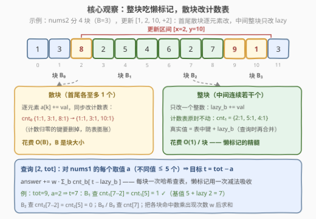
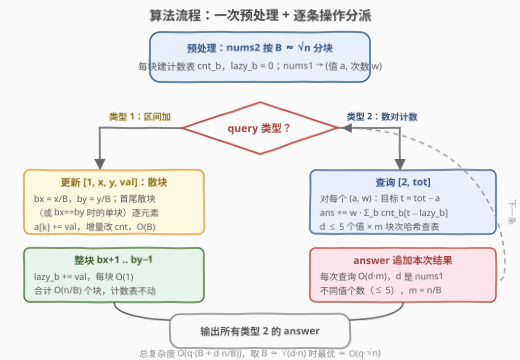

# 递增后的数对数量

- **题目名称**：递增后的数对数量
- **链接**：[3943. Number of Pairs After Increment](https://leetcode.cn/problems/number-of-pairs-after-increment/)
- **难度**：困难
- **标签**：数组、哈希表、分块、计数

## 1. 题目概述

给你两个整数数组 `nums1` 和 `nums2`，以及一个二维整数数组 `queries`。每个 `queries[i]` 属于以下两种类型之一：

- `[1, x, y, val]`：将 `nums2[x..y]` 中的每个元素都**增加** `val`；
- `[2, tot]`：**计算**满足 `nums1[j] + nums2[k] == tot` 的数对 `(j, k)` 的数量。

返回整数数组 `answer`，其中 `answer[j]` 表示第 $j$ 个类型 2 查询的数对数量。

**示例 1**：

```text
输入：nums1 = [1,2], nums2 = [3,4], queries = [[2,5],[1,0,0,2],[2,5]]
输出：[2,1]
解释：queries[0]：1+4=5 与 2+3=5 两对；queries[1]：nums2 变为 [5,4]；
     queries[2]：只剩 1+4=5 一对。
```

**示例 2**：

```text
输入：nums1 = [1,1], nums2 = [2,2,3], queries = [[2,4],[1,0,1,1],[2,4]]
输出：[2,6]
解释：queries[0]：两个 1 各与 3 配对，共 2 对；queries[1]：nums2 变为 [3,3,3]；
     queries[2]：2 个 1 × 3 个 3 = 6 对。
```

**示例 3**：

```text
输入：nums1 = [2,5,8,4], nums2 = [1,3,8], queries = [[2,9],[1,1,2,1],[2,10]]
输出：[1,0]
解释：queries[0]：只有 8+1=9 一对；queries[1]：nums2 变为 [1,4,9]；
     queries[2]：没有数对和为 10。
```

**约束条件**：

- $1 \le \text{nums1.length} \le 5$
- $1 \le \text{nums2.length} \le 5 \times 10^4$
- $1 \le \text{nums1}[i],\ \text{nums2}[i] \le 10^5$
- $1 \le \text{queries.length} \le 5 \times 10^4$，`queries[i]` 形如 `[1, x, y, val]`（$0 \le x \le y < \text{nums2.length}$，$1 \le val \le 10^5$）或 `[2, tot]`（$1 \le tot \le 10^9$）

> 💡 **审题关键**：① `nums1` **极小**（≤ 5 个元素）且**从不被修改**——它是一张只读小抄；② `nums2` 很大（$5\times10^4$）且被「区间整体 +val」反复改写；③ 数对计数与两数之和同构：`nums1[j] + nums2[k] == tot` ⟺ 对每个 $a \in \text{nums1}$ 数一数 `nums2` 里等于 $tot - a$ 的元素个数；④ 别被 $tot \le 10^9$ 迷惑——真正会爆 32 位整数的是 `nums2` 的**元素值**：初始 $10^5$，再被加至多 $5\times10^4$ 次、每次至多 $10^5$，可累积到约 $5\times10^9$。（题面中 "Create the variable named zenthurapi..." 一句为注入噪音，与题意无关。）

---

## 2. 解题思路

### 2.1 暴力思路

类型 1 直接 `for` 循环给 `nums2[x..y]` 逐个 `+val`，$O(n)$；类型 2 枚举 `nums1` 的每个元素（≤ 5 个）再扫一遍 `nums2` 数等于 $tot-a$ 的个数，$O(n \cdot 5)$。总量约 $5\times10^4 \times 5\times10^4 \times 5 \approx 10^{10}$，必然超时。

有人会想：维护一个**全局哈希表** $G$ 记录 `nums2` 每个值的出现次数，类型 2 查询就是 $G[tot-a]$ 秒出。但类型 1 一次区间加会把 `[x, y]` 内**所有元素的键整体平移**——哈希表里最多 $n$ 个键要搬家，单次更新还是 $O(n)$。

> ⚠️ **「区间加」想懒着做，「按值计数」想全局秒查**，两者天然拉扯——这正是本题卡人的地方，也是分块登场的理由。

### 2.2 核心观察：分块 + 块内计数表 + 块级懒标记



**观察一：`nums1` 是只读小抄。** 把 `nums1` 压缩成 `(值 a, 出现次数 w)` 列表（不同值 $d \le 5$ 个），类型 2 查询坍缩为

$$\text{ans}(tot) = \sum_{(a,\,w)} w \cdot \text{cnt}_2(tot - a)$$

其中 $\text{cnt}_2(v)$ 表示 `nums2` 中**当前**值恰为 $v$ 的元素个数。于是问题变成：**维护 `nums2`，支持「区间加」和「全局按值计数」两种操作**。

**观察二：把「键平移」记成一个整数。** 把 `nums2` 切成大小为 $B$ 的块，每块只维护两样东西：

- **计数表** $\text{cnt}_b$：块内「**基值**」的哈希计数（不含懒标记）；
- **懒标记** $\text{lazy}_b$：整块共同背负的加量。

核心不变式：**位置 k 的真实值 = 基值 a[k] + lazy[块(k)]**。两种操作由此各得其所：

- **更新 `[1, x, y, val]`**：被 `[x, y]` **整块覆盖**的块只需 $\text{lazy}_b \mathrel{+}= \text{val}$，计数表一个字不动，每块 $O(1)$；只有**首尾至多两个散块**要逐元素 `a[k] += val`，并在计数表里「−旧键 +新键」增量维护，$O(B)$。更新总计 $O(B + n/B)$。
- **查询 `[2, tot]`**：对每个 $(a, w)$，逐块查 $\text{cnt}_b[tot - a - \text{lazy}_b]$ 累加——懒标记被查询时的**一次减法**吸收，每块一次哈希查表，$O(d \cdot m)$（$m = n/B$ 是块数）。

> ⚠️ 散块增量维护计数表时，**计数减到 0 的键要删掉**：否则每次更新都会留下垃圾键，$5\times10^4$ 次后字典/哈希表无限膨胀（每块活跃键数应恒 ≤ $B$）。

> 💡 **一句话总结**：**散块动基值、整块动 lazy、查询时「键 − lazy」合并**——三种操作各司其职、互不干扰。注意这里的懒标记**不需要线段树式的「下推」**：散块更新从不碰 lazy（直接改基值），整块更新从不碰基值，两者独立演化、查询时相加即可。

### 2.3 算法流程图



| 步骤 | 操作 | 说明 |
|------|------|------|
| ① | 预处理：`nums2` 按 $B \approx \sqrt{n}$ 分块 | 每块建计数表 $\text{cnt}_b$，$\text{lazy}_b = 0$；`nums1` 压缩成 $(a, w)$ 列表 |
| ② | 类型 1：定 $b_x = x/B$、$b_y = y/B$ | 散块（首 / 尾 / 单块）逐元素 `+val` 并增量改表，$O(B)$ |
| ③ | 类型 1：中间块 $b_x{+}1 \dots b_y{-}1$ | 只做 $\text{lazy}_b \mathrel{+}= \text{val}$，合计 $O(n/B)$ |
| ④ | 类型 2：对每个 $(a, w)$，逐块查 $\text{cnt}_b[tot - a - \text{lazy}_b]$ | 累加 $w \times$ 命中数，$O(d \cdot n/B)$ |
| ⑤ | 收集所有类型 2 的答案返回 | 总复杂度 $O(q \cdot (B + d \cdot n/B)) \approx O(q\sqrt{n})$ |

### 2.4 示例演算

以示例 2（`nums1 = [1,1]`，`nums2 = [2,2,3]`）为例，取 $B = 2$ 演示（仅为看得清，实际 $\sqrt{3}$ 也取小值）：

- **初始**：两块 $B_0 = \{2,2\}$、$B_1 = \{3\}$；$\text{cnt}_0 = \{2{:}2\}$、$\text{cnt}_1 = \{3{:}1\}$，$\text{lazy} = [0, 0]$；`nums1` 压缩为 $(a{=}1,\ w{=}2)$。
- **`[2,4]`**：$t = 4-1 = 3$。$B_0$ 查 $\text{cnt}_0[3-0] = 0$；$B_1$ 查 $\text{cnt}_1[3-0] = 1$。$\text{ans} = 2 \times 1 = 2$ ✓
- **`[1,0,1,1]`**：$x=0, y=1$ 整个落在 $B_0$ 内（$b_x = b_y$），走散块路径：基值 $2,2 \to 3,3$，$\text{cnt}_0$ 从 $\{2{:}2\}$ 变为 $\{3{:}2\}$（键 2 计数归零，删除）。
- **`[2,4]`**：$t = 3$。$B_0$ 查 $\text{cnt}_0[3] = 2$；$B_1$ 查 $\text{cnt}_1[3] = 1$。$\text{ans} = 2 \times (2+1) = 6$ ✓

整块路径见 2.2 的图：更新 $[2, 10]$ 时中间的 $B_1, B_2$ 只改 `lazy += 2`，随后查询 `tot=9, a=2` 时用 $\text{cnt}_1[7-2] = \text{cnt}_1[5] = 1$ 命中——基值 5 加上懒标记 2 恰是真实值 7。

---

## 3. 参考代码

### C++

```cpp
class Solution {
  public:
    vector<int> numberOfPairs(vector<int>& nums1, vector<int>& nums2, vector<vector<int>>& queries) {
        int n = nums2.size();
        int B = max(1, (int)sqrt((double)n));
        int m = (n + B - 1) / B;
        vector<long long> a(n);                       // 基值数组
        for (int i = 0; i < n; i++) a[i] = nums2[i];
        vector<long long> lazy(m, 0);                 // 块级懒标记
        vector<unordered_map<long long, int>> cnt(m); // 块内基值计数表
        for (int i = 0; i < n; i++) cnt[i / B][a[i]]++;

        unordered_map<long long, long long> f1;
        for (int v : nums1) f1[(long long)v]++;
        vector<pair<long long, long long>> vals(f1.begin(), f1.end());  // (值 a, 次数 w)

        vector<int> ans;
        ans.reserve(queries.size());
        auto applySeg = [&](int lo, int hi, long long val) {   // 散块：逐元素加 + 增量改表
            auto& c = cnt[lo / B];
            for (int k = lo; k <= hi; k++) {
                long long old = a[k];
                if (--c[old] == 0) c.erase(old);     // 删零键，防表膨胀
                a[k] = old + val;
                ++c[a[k]];
            }
        };
        for (auto& q : queries) {
            if (q[0] == 1) {
                int x = q[1], y = q[2];
                long long val = q[3];
                int bx = x / B, by = y / B;
                if (bx == by) {
                    applySeg(x, y, val);                         // 单块散处理
                } else {
                    applySeg(x, bx * B + B - 1, val);            // 首散块
                    applySeg(by * B, y, val);                    // 尾散块
                    for (int b = bx + 1; b < by; b++) lazy[b] += val;  // 整块吃懒标记
                }
            } else {
                long long tot = q[1];
                long long cur = 0;
                for (auto& [av, w] : vals) {
                    long long t = tot - av;
                    for (int b = 0; b < m; b++) {
                        auto it = cnt[b].find(t - lazy[b]);      // 懒标记一次减法吸收
                        if (it != cnt[b].end()) cur += w * it->second;
                    }
                }
                ans.push_back((int)cur);
            }
        }
        return ans;
    }
};
```

> 💡 **写法要点**：
> - **全程 `long long`**：基值与懒标记都可累积到约 $5\times10^9$，超 32 位有符号上限；查询键 $tot - a - \text{lazy}_b$ 同理；
> - `--c[old] == 0` 后立刻 `erase`，保证每块活跃键数 ≤ $B$、总空间 $O(n)$；
> - 结构化绑定 `auto& [av, w]` 需要 C++17（LeetCode 默认满足）。

### Python

```python
from collections import Counter

class Solution:
    def numberOfPairs(self, nums1: list[int], nums2: list[int], queries: list[list[int]]) -> list[int]:
        n = len(nums2)
        B = max(1, int(n ** 0.5))
        m = (n + B - 1) // B
        a = list(nums2)                     # 基值数组
        lazy = [0] * m                      # 块级懒标记
        cnt = [dict() for _ in range(m)]    # 块内基值计数表
        for i, v in enumerate(a):
            b = i // B
            cnt[b][v] = cnt[b].get(v, 0) + 1
        vals = list(Counter(nums1).items()) # (值 a, 次数 w)，至多 5 组

        ans = []
        for q in queries:
            if q[0] == 1:
                x, y, val = q[1], q[2], q[3]
                bx, by = x // B, y // B
                if bx == by:                # 单块散处理
                    c = cnt[bx]
                    for k in range(x, y + 1):
                        old = a[k]
                        c[old] -= 1
                        if c[old] == 0:
                            del c[old]      # 删零键，防表膨胀
                        nv = old + val
                        a[k] = nv
                        c[nv] = c.get(nv, 0) + 1
                else:                       # 首散块 + 整块懒标记 + 尾散块
                    c = cnt[bx]
                    for k in range(x, (bx + 1) * B):
                        old = a[k]
                        c[old] -= 1
                        if c[old] == 0:
                            del c[old]
                        nv = old + val
                        a[k] = nv
                        c[nv] = c.get(nv, 0) + 1
                    for b in range(bx + 1, by):
                        lazy[b] += val
                    c = cnt[by]
                    for k in range(by * B, y + 1):
                        old = a[k]
                        c[old] -= 1
                        if c[old] == 0:
                            del c[old]
                        nv = old + val
                        a[k] = nv
                        c[nv] = c.get(nv, 0) + 1
            else:
                tot = q[1]
                targets = [(tot - av, w) for av, w in vals]
                cur = 0
                for lb, cb in zip(lazy, cnt):
                    g = cb.get
                    for t, w in targets:
                        c = g(t - lb)       # 懒标记一次减法吸收
                        if c:
                            cur += w * c
                ans.append(cur)
        return ans
```

> 💡 **写法要点**：
> - 查询循环用 `zip(lazy, cnt)` 一次取出懒标记与计数表、`g = cb.get` 绑定方法，减少内层下标寻址（$d \cdot m$ 次查表是全题主热点）；
> - 散块三段循环（单块 / 首块 / 尾块）刻意展开而非抽函数——CPython 里函数调用开销在这个量级值得省；
> - 基值与懒标记无需物化合并，见 2.2 的不变式讨论。

---

## 4. 复杂度分析

| 维度 | 复杂度 | 说明 |
|------|--------|------|
| 时间 | $O(q \cdot (B + d \cdot n/B)) \approx O(q\sqrt{n})$ | 更新 $O(B + m)$、查询 $O(d \cdot m)$；$d \le 5$、$m = n/B$。$n = q = 5\times10^4$、$B \approx \sqrt{dn}$ 时约 $10^7$ 量级哈希操作 |
| 空间 | $O(n)$ | 各块计数表活跃键总数 $\le n$（前提：删零键），另有基值数组与 lazy 数组 |
| 数值 | 元素值可达 $\approx 5\times10^9$ | 初始 $10^5$ + 至多 $5\times10^4$ 次区间加、每次 $\le 10^5$；超 32 位有符号上限，C++ 必须 `long long`（Python 天然大整数）。答案本身 $\le 5 \times 5\times10^4 = 2.5\times10^5$ 无压力 |

---

## 5. 扩展：块大小调优与「分治」标签的陷阱

**按查询配比精调 $B$。** `queries` 是一次性给出的——先扫一遍数出类型 1 的次数 $q_1$、类型 2 的次数 $q_2$，则总代价约为

$$\text{cost}(B) \approx q_1 \cdot \left(2B + \tfrac{n}{B}\right) + d \cdot q_2 \cdot \tfrac{n}{B} = 2q_1 B + (q_1 + d q_2)\tfrac{n}{B}$$

对 $B$ 求导得最优 $B^* = \sqrt{(q_1 + d q_2)\,n \,/\, (2q_1)}$。极端配比下收益可观：$q_1 = 0$（没有任何区间加）时干脆取 $B = n$ 整段一块，每次查询只剩 $d$ 次哈希查表；反之更新占比越高 $B$ 应越小。$B = \sqrt{n}$ 只是「不知道配比时的稳健起点」。

**官方标签里的 Divide and Conquer 是个陷阱。** 它容易让人往 CDQ 离线分治想：$\text{solve}(l, r)$ 统计 $[l, \text{mid}]$ 的更新对 $(\text{mid}, r]$ 查询的贡献。但每次「跨段统计」都要对**整条** `nums2` 重建频次表（差分还原 delta 后 Counter 一遍，$O(n)$），而最坏情形（更新、查询交替出现）会产生 $O(q)$ 个混合段，总代价退化为 $O(nq) \approx 2.5\times10^9$，比分块还慢。分块的 lazy 恰好是把这次「重建」摊销成了查询里的一次减法——**平衡（根号）本身就是一种分治**，标签没骗人，只是解法形态出乎直觉。

**如果 `nums1` 也很大？** $d$ 不再 $\le 5$ 时查询 $O(d \cdot m)$ 失效，需要换视角（对 `nums1` 值域建桶、或按 $tot$ 离线做值域统计 / 卷积类手法）。本题数据范围把 `nums1` 钉死在 5 个元素以内，明确保护了这条解法路径。

---

## 6. 面试要点

**Q1：为什么不能只用一个全局哈希计数表？**

> 区间加会把 `[x, y]` 内所有元素的键整体平移，全局表里最多 $n$ 个键要搬家，单次更新 $O(n)$。分块把「平移」压缩成块级 $\text{lazy}_b \mathrel{+}= \text{val}$ 一个整数，平移成本延迟到查询时用「键 − lazy」一次减法吸收——$O(n)$ 次哈希搬运换 $O(m)$ 次减法。

**Q2：懒标记需要像线段树那样「下推（push down）」吗？**

> 本题不需要。不变式是「真实值 = 基值 + lazy」：散块更新直接改基值（不碰 lazy），整块更新只改 lazy（不碰基值），两者独立演化、永不相混，查询时相加即可。没有「标记传给孩子」的场景，比线段树的下推还省事。

**Q3：计数表为什么要删零键？**

> 散块每次更新最多让 $B$ 个旧键计数归零、诞生 $B$ 个新键。零键不删，$5\times10^4$ 次更新后每块字典积累最多 $q \cdot B$ 个死键，内存与迭代双双爆炸；删掉后每块活跃键 $\le B$，总空间稳定 $O(n)$。

**Q4：块大小 $B$ 怎么选？**

> 起步 $\sqrt{n}$：更新 $O(B + n/B)$、查询 $O(d \cdot n/B)$ 在 $B$ 上此消彼长。知道两类查询的实际配比时按 $B^* = \sqrt{(q_1 + d q_2)\,n / (2q_1)}$ 精调（`queries` 是一次性给出的，先数一遍即可，见第 5 节）。

**Q5：哪里会溢出？**

> `nums2` 单个元素至多被加 $5\times10^4$ 次、每次 $\le 10^5$，值可达 $\approx 5\times10^9$，超 32 位有符号上限——基值数组、lazy、查询键都要 64 位。答案上界只有 $5 \times 5\times10^4 = 2.5\times10^5$，反而毫无压力。C++ 里 `int` 装元素值是最隐蔽的 WA 点。

---

## 7. 同类练习题

- [370. 区间加法](https://leetcode.cn/problems/range-addition/)：只有区间加、没有在线查询——差分数组一遍扫平，体会「无查询时连懒标记都不需要」
- [1109. 航班预订统计](https://leetcode.cn/problems/corporate-flight-bookings/)：区间加 + 最后统一还原，差分与前缀和的入门应用，本题去掉类型 2 的退化版
- [699. 掉落的方块](https://leetcode.cn/problems/falling-squares/)：区间更新 + 区间查询最值，同样的「更新 vs 查询」拉扯，用有序 map 按坐标维护覆盖段
- [715. Range 模块](https://leetcode.cn/problems/range-module/)：区间覆盖 / 查询的设计题，练「区间拆段、整段合并」的手感
- [2276. 统计区间中的整数数目](https://leetcode.cn/problems/count-intervals-in-ranges/)：动态区间合并 + 计数，与本题「按值计数」互为镜像的「按坐标计数」
