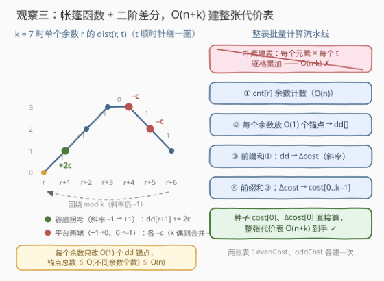
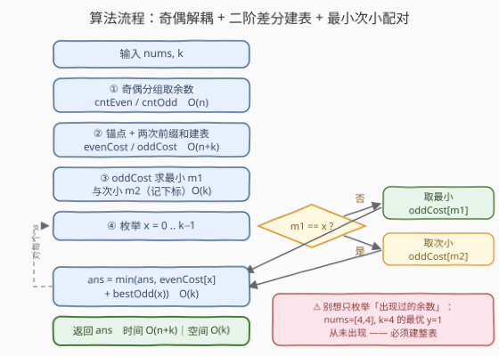

# 使数组变为模交替数组的最少操作次数 II

- **题目名称**：使数组变为模交替数组的最少操作次数 II
- **链接**：[3944. 使数组变为模交替数组的最少操作次数 II](https://leetcode.cn/problems/minimum-operations-to-make-array-modulo-alternating-ii/)
- **难度**：困难
- **标签**：数组、枚举

## 1. 题目概述

> ⚠️ 本题为 LeetCode 付费题，题意描述根据官方示例用例与 hints 重建，可能与官方题面有出入。题意已与免费的前作 [3937. 使数组变为模交替数组的最少操作次数 I](https://leetcode.cn/problems/minimum-operations-to-make-array-modulo-alternating-i/) 逐字核对一致（示例 1、2 相同，II 版新增示例 3），可放心阅读。

给你一个整数数组 `nums` 和一个整数 `k`。一步操作中，你可以将 `nums` 中的**任意元素增加或减少 1**。

如果存在两个**不同**的整数 $x$ 和 $y$（$0 \le x, y < k$）满足以下条件，则称数组为**模交替**数组：

- 对于每个**偶数**下标 $i$：$\text{nums}[i] \bmod k = x$；
- 对于每个**奇数**下标 $i$：$\text{nums}[i] \bmod k = y$。

返回使 `nums` 成为模交替数组所需的**最少**操作次数。

**示例 1**：

```text
输入：nums = [1,4,2,8], k = 3
输出：2
解释：为偶数下标选 x = 1，为奇数下标选 y = 2。
     将 nums[1] = 4 增加 1 得 [1,5,2,8]；再将 nums[2] = 2 减少 1 得 [1,5,1,8]。
     此时偶数位余数均为 1、奇数位余数均为 2。
```

**示例 2**：

```text
输入：nums = [1,1,1], k = 3
输出：1
解释：将 nums[1] 增加 1 得 [1,2,1]，满足 x = 1、y = 2。
```

**示例 3**（II 版新增）：

```text
输入：nums = [6,7,8], k = 2
输出：0
解释：余数依次为 [0,1,0]，天然满足 x = 0、y = 1，无需任何操作。
```

**约束条件**（会员题官方不可见；按官方 hints 与 I 版约束推断为 $n, k$ 放大至 $10^5$ 量级，本题解按此保守口径设计）：

- $1 \le \text{nums.length} \le 10^5$
- $1 \le \text{nums}[i] \le 10^9$
- $2 \le k \le 10^5$

> 💡 **审题关键**：① 题意与 I 版完全一致，II 版只是**数据范围放大**；② 官方四条 hints 恰好铺出解题链：单元素代价 $\min(|r-t|,\ k-|r-t|)$ → 奇偶两组各建代价表 → $\min_{x \ne y}$ 配对 → 「最小 + 次小」避免 $O(k^2)$；③「II」的考点 = 给 I 版的**两个复杂度瓶颈各补一刀**：建表 $O(n \cdot k) \to O(n+k)$（二阶差分）、配对 $O(k^2) \to O(k)$（最小次小）。若只放大 $n$ 而 $k \le 100$，I 版做法其实还活着——真正的杀招在 $k$ 的放大。

---

## 2. 解题思路

### 2.1 暴力思路：沿用 I 版做法在 II 版双双爆掉

I 版正解是「逐元素累加建两张长度 $k$ 的代价表 + 双重枚举 $x \ne y$ 配对」：建表 $O(n \cdot k)$、配对 $O(k^2)$。$n, k$ 放大到 $10^5$ 量级后两者都是 $\approx 10^{10}$，双双爆炸。

另一个诱人但**错误**的捷径是：「最优 $x, y$ 一定取数组里出现过的余数，把候选集缩到 $O(n)$ 个」——反例见 2.2 末尾，这条路走不通，必须老老实实建**整张**表。

### 2.2 核心观察：二阶差分整表建代价 + 最小次小配对



**观察一（回顾）：余数环短弧。** 把 $0, 1, \dots, k-1$ 排成环，一步 $\pm 1$ 让余数在环上走一格（数值可穿 $0$ 变负、也可穿 $k$ 回绕），单元素代价是环上短弧：

$$\text{dist}(r, t) = \min\big(\lvert r - t \rvert,\ k - \lvert r - t \rvert\big)$$

**观察二（回顾）：奇偶解耦。** $x$ 只作用于偶数下标、$y$ 只作用于奇数下标，预处理两张代价表后 $\text{ans} = \min_{x \ne y}\big(\text{evenCost}[x] + \text{oddCost}[y]\big)$，两组唯一的耦合就是 $x \ne y$。

**观察三（新）：代价表可以「批量」算——二阶差分。** 逐元素累加慢在「每个元素向 $k$ 个目标各加一次」。换个视角：$\text{dist}(r, t)$ 关于 $t$ 是一个**帐篷函数**——从谷底 $r$ 出发斜率 $+1$ 爬升，越过对径点后斜率 $-1$ 下降（$k$ 奇数时峰顶是占两个点的**平台**）。整张代价表是许多帐篷的叠加，仍是分段线性函数；而分段线性函数由「初值 + 各处斜率」完全决定，**每个帐篷只贡献 $O(1)$ 处斜率跳变**。先统计每种余数的出现次数 $\text{cnt}[r]$（把同余数的元素打包成一个权重 $c$ 的帐篷），再定义

$$\Delta\text{cost}[t] = \text{cost}[t] - \text{cost}[t-1] \quad(\text{斜率}), \qquad \text{dd}[t] = \Delta\text{cost}[t] - \Delta\text{cost}[t-1] \quad(\text{斜率的跳变})$$

每个余数 $r$（计数 $c$，记 $h = \lfloor k/2 \rfloor$）只在三处投放锚点：

- **谷底拐弯**（斜率 $-1 \to +1$）：$\text{dd}[(r+1) \bmod k]$ 累计 $+2c$；
- $k$ **偶**·对径点（斜率 $+1 \to -1$，一步跳变）：$\text{dd}[(r+h+1) \bmod k]$ 累计 $-2c$；
- $k$ **奇**·对径平台（斜率 $+1 \to 0 \to -1$，两步跳变）：$\text{dd}[(r+h+1) \bmod k]$ 与 $\text{dd}[(r+h+2) \bmod k]$ 各累计 $-c$。

锚点总数 $\le 3 \times$（不同余数个数）$\le O(n)$。种子直接按定义算：

$$\text{cost}[0] = \sum_r \text{cnt}[r] \cdot \min(r,\ k-r), \qquad \Delta\text{cost}[0] = \text{cost}[0] - \text{cost}[k-1]$$

（其中 $\text{cost}[k-1] = \sum_r \text{cnt}[r] \cdot \min(k-1-r,\ r+1)$。）最后**两次前缀和**还原整张表：

$$\Delta\text{cost}[t] = \Delta\text{cost}[t-1] + \text{dd}[t], \qquad \text{cost}[t] = \text{cost}[t-1] + \Delta\text{cost}[t] \qquad (t = 1, \dots, k-1)$$

整表 $O(n + k)$ 到手，取代逐元素累加的 $O(n \cdot k)$。

**观察四（新）：配对用「最小 + 次小」。** 固定 $x$ 后最优 $y$ 几乎总是 $\text{oddCost}$ 的**最小值**——只有当最小值下标 $m_1$ 恰好等于 $x$ 时才退而取**次小值** $m_2$：

$$\text{bestOdd}(x) = \begin{cases} \text{oddCost}[m_1] & m_1 \ne x \\ \text{oddCost}[m_2] & m_1 = x \end{cases}$$

预处理最小与次小（值 + 下标，$k \ge 2$ 保证次小存在），再单层枚举 $x$，$O(k^2) \to O(k)$。并列最小时次小值 $=$ 最小值，结论不变。

> ⚠️ **为什么必须建整张表，而不能只枚举「出现过的余数」？** 直觉来自环上中位数性质：$\sum_r \text{cnt}[r] \cdot \text{dist}(r, t)$ 的**无约束**最小值确实总在某个出现过的余数处取到。但 $x \ne y$ 的耦合会迫使其中一组取**次优**，而次优位置可能落在从未出现的余数上：取 `nums = [4, 4]`、$k = 4$，两组余数都只有 $\{0\}$，代价表均为 $[0, 1, 2, 1]$——最优解是 $x = 0, y = 1$（代价 1），而余数 1 从未出现。这正是官方 hints 坚持「整表 + 最小次小」的原因。

### 2.3 算法流程图



| 步骤 | 操作 | 说明 |
|------|------|------|
| ① | 奇偶分组取余数，计数得 cntEven / cntOdd | 值域坍缩到 $[0, k)$，$O(n)$ |
| ② | 二阶差分建表：投放锚点 + 两次前缀和 | 得 evenCost、oddCost 两张整表，$O(n+k)$ |
| ③ | oddCost 求最小 $m_1$、次小 $m_2$（记下标） | 一趟 $O(k)$ |
| ④ | 枚举 $x$，配 $\text{bestOdd}(x)$ 维护最小 | $m_1$ 不撞 $x$ 用最小、撞车用次小，$O(k)$ |
| ⑤ | 返回最小值 | $k \ge 2$ 保证合法对 $(x, y)$ 总存在 |

### 2.4 示例演算

以示例 1 `nums = [1,4,2,8]`，$k = 3$ 走一遍（$h = 1$，$k$ 为奇数）。偶组（下标 0、2）余数为 $\{1, 2\}$，计数各 1：

1. **投放锚点**：
   - $r=1$：$\text{dd}[2] \mathrel{+}= 2$；$\text{dd}[(1+2) \bmod 3] = \text{dd}[0] \mathrel{-}= 1$；$\text{dd}[(1+3) \bmod 3] = \text{dd}[1] \mathrel{-}= 1$；
   - $r=2$：$\text{dd}[0] \mathrel{+}= 2$；$\text{dd}[1] \mathrel{-}= 1$；$\text{dd}[2] \mathrel{-}= 1$；
   - 合计 $\text{dd} = [1,\ -2,\ 1]$。
2. **算种子**：$\text{cost}[0] = \min(1,2) + \min(2,1) = 2$；$\text{cost}[2] = \text{dist}(1,2) + \text{dist}(2,2) = 1 + 0 = 1$，故 $\Delta\text{cost}[0] = 2 - 1 = 1$。
3. **两次前缀和**：$\Delta\text{cost}[1] = 1 + (-2) = -1 \Rightarrow \text{cost}[1] = 2 - 1 = 1$；$\Delta\text{cost}[2] = -1 + 1 = 0 \Rightarrow \text{cost}[2] = 1$。得 $\text{evenCost} = [2, 1, 1]$ ✓（与 I 版手算一致）。奇组（下标 1、3）余数同为 $\{1, 2\}$，故 $\text{oddCost} = [2, 1, 1]$。
4. **最小次小配对**：$m_1 = 1$（值 1）、$m_2 = 2$（值 1）。
   - $x = 0$：$2 + \text{oddCost}[1] = 3$；
   - $x = 1$：撞车 $m_1 = x$，用次小 $1 + \text{oddCost}[2] = 2$；
   - $x = 2$：$1 + \text{oddCost}[1] = 2$。
5. 最小值 $\mathbf{2}$ ✓——恰好把「撞车退次小」的分支也演到了。

示例 3 `nums = [6,7,8]`，$k = 2$：余数 $[0, 1, 0]$ 天然满足 $x = 0, y = 1$，两张表在 $x=0, y=1$ 处均为 0，答案 $0$ ✓。

---

## 3. 参考代码

### C++

```cpp
class Solution {
  public:
    long long minOperations(vector<int>& nums, int k) {
        int h = k / 2;
        auto build = [&](const vector<int>& vals) {      // 一组元素 -> 整张代价表
            vector<long long> cnt(k, 0);
            for (int v : vals) cnt[v % k]++;
            vector<long long> dd(k, 0), delta(k, 0), cost(k, 0);
            for (int r = 0; r < k; r++) {
                long long c = cnt[r];
                if (!c) continue;
                dd[(r + 1) % k] += 2 * c;                 // 谷底拐弯：斜率 -1 -> +1
                if (k % 2 == 0) dd[(r + h + 1) % k] -= 2 * c;   // 对径点一步跳变
                else {                                          // 奇数 k：平台两步跳变
                    dd[(r + h + 1) % k] -= c;
                    dd[(r + h + 2) % k] -= c;
                }
            }
            for (int r = 0; r < k; r++) {                 // 种子：cost[0] 与 Δcost[0]
                cost[0] += cnt[r] * min(r, k - r);
                delta[0] += cnt[r] * (min(r, k - r) - min(k - 1 - r, r + 1));
            }
            for (int t = 1; t < k; t++) {                 // 两次前缀和还原整表
                delta[t] = delta[t - 1] + dd[t];
                cost[t] = cost[t - 1] + delta[t];
            }
            return cost;
        };
        vector<int> evens, odds;
        for (int i = 0; i < (int)nums.size(); i++)
            (i % 2 == 0 ? evens : odds).push_back(nums[i]);
        vector<long long> evenCost = build(evens), oddCost = build(odds);
        int m1 = 0, m2 = -1;                              // oddCost 最小 + 次小（记下标）
        for (int y = 1; y < k; y++) {
            if (oddCost[y] < oddCost[m1]) { m2 = m1; m1 = y; }
            else if (m2 == -1 || oddCost[y] < oddCost[m2]) m2 = y;
        }
        long long ans = LLONG_MAX;
        for (int x = 0; x < k; x++)
            ans = min(ans, evenCost[x] + (m1 != x ? oddCost[m1] : oddCost[m2]));
        return ans;
    }
};
```

> 💡 **写法要点**：
> - 代价上界 $n \cdot \lfloor k/2 \rfloor$ 在 $n, k \sim 10^5$ 时达 $5 \times 10^9$，**必须 `long long`**（返回值与三张表全程 64 位）；锚点值 $\le 2n$、种子可先 `int` 累加再 widening，但统一 `long long` 省心；
> - `build` 用 lambda 接收一组元素值，奇偶两组各调一次；`cnt` 先把同余数元素打包成权重 $c$，锚点从「每元素 $O(1)$ 个」降到「每**余数** $O(1)$ 个」；
> - 最小次小的更新顺序：严格小于当前最小时旧最小降级为次小；**等于**时走 `else if` 落进次小——并列最小时次小值 $=$ 最小值，逻辑天然正确；$k \ge 2$ 保证循环至少跑一次、`m2 != -1`；
> - `(i % 2 == 0 ? evens : odds).push_back(nums[i])` 两操作数同为 `vector<int>` 左值，三元表达式返回左值合法，省掉 if/else 两个分支。

### Python

```python
class Solution:
    def minOperations(self, nums: list[int], k: int) -> int:
        h = k // 2

        def build(group):                       # 一组元素 -> 整张代价表
            cnt = [0] * k
            for v in group:
                cnt[v % k] += 1
            dd = [0] * k
            for r, c in enumerate(cnt):
                if c:
                    dd[(r + 1) % k] += 2 * c    # 谷底拐弯：斜率 -1 -> +1
                    if k % 2 == 0:
                        dd[(r + h + 1) % k] -= 2 * c    # 对径点一步跳变
                    else:                               # 奇数 k：平台两步跳变
                        dd[(r + h + 1) % k] -= c
                        dd[(r + h + 2) % k] -= c
            cost = [0] * k
            delta = [0] * k
            cost[0] = sum(c * min(r, k - r) for r, c in enumerate(cnt))
            last = sum(c * min(k - 1 - r, r + 1) for r, c in enumerate(cnt))
            delta[0] = cost[0] - last           # 种子：cost[0] 与 Δcost[0]
            for t in range(1, k):               # 两次前缀和还原整表
                delta[t] = delta[t - 1] + dd[t]
                cost[t] = cost[t - 1] + delta[t]
            return cost

        even_cost = build(nums[0::2])
        odd_cost = build(nums[1::2])
        m1 = min(range(k), key=lambda y: odd_cost[y])
        m2 = min((y for y in range(k) if y != m1), key=lambda y: odd_cost[y])
        return min(even_cost[x] + (odd_cost[m1] if m1 != x else odd_cost[m2])
                   for x in range(k))
```

> 💡 **写法要点**：
> - `nums[0::2]` / `nums[1::2]` 切片分组比 `enumerate` 判奇偶更直接；$n = 1$ 时奇组为空切片，`oddCost` 全 0 天然正确；
> - `min(range(k), key=...)` 取**首个**最小值下标；次小用生成器排除 $m_1$ 的下标再取一次 min，$k \ge 2$ 保证不空；
> - 两个种子用生成器 `sum` 直接按定义算，与锚点投放互不纠缠，好读好改；
> - Python 大整数无溢出之忧；`%` 对正数返回非负余数，`v % k` 安全。

---

## 4. 复杂度分析

| 维度 | 复杂度 | 说明 |
|------|--------|------|
| 时间 | $O(n + k)$ | 计数 $O(n)$；锚点 $\le 3 \times$ 不同余数个数 $\le O(n)$；两次前缀和 $O(k)$；最小次小与枚举配对各 $O(k)$ |
| 空间 | $O(k)$ | `cnt / dd / delta / cost` 四张表，奇偶两组先后调用可复用 |
| 数值 | 答案 $\le n \cdot \lfloor k/2 \rfloor$ | $n, k \sim 10^5$ 时可达 $5 \times 10^9$，C++ 必须 64 位 |

---

## 5. 扩展：优化阶梯与「k 大到建不了表」怎么办

四个版本的复杂度阶梯，每一级各砍掉一个瓶颈：

| 方案 | 建表 | 配对 | 适用范围 |
|------|------|------|----------|
| I 版暴力 | ——（每对 $(x,y)$ 扫一遍数组） | $O(n \cdot k^2)$ | $n, k \le 100$ 勉强 |
| I 版正解 | 逐元素累加 $O(n \cdot k)$ | 双重枚举 $O(k^2)$ | $n, k \le 100$ |
| 最小次小版 | 逐元素累加 $O(n \cdot k)$ | 最小 + 次小 $O(k)$ | $n$ 小、$k$ 大（如 $n \le 100,\ k \le 10^5$） |
| 本题 | 二阶差分 $O(n + k)$ | 最小 + 次小 $O(k)$ | $n, k \sim 10^5$ |

> 💡 阶梯的启示：**放大哪一个维度，就优化对哪个维度的依赖**。II 版 $k$ 放大后，$O(k)$ 因子出现在两处（建表内层、配对外层），恰好各需要一次「批量」化——差分把「逐格累加」变「锚点 + 前缀和」，最小次小把「逐对比较」变「一趟预处理 + $O(1)$ 查询」。

若 $k$ 进一步大到 $10^9$（连 $O(k)$ 的表都开不下）：候选集收缩已被 2.2 的反例堵死，正路是把全部**断点**（出现过的余数 + 各自的对径点）排序做环形扫描，在相邻断点之间斜率恒定、代价是线性函数，再配合分段维护 $\text{oddCost}$ 的最小次小——思想同源但工程量大增，留作进阶思考。

---

## 6. 面试要点

**Q1：II 版相对 I 版的两个复杂度瓶颈分别是什么？各自怎么优化？**

> 建表 $O(n \cdot k)$ 与配对 $O(k^2)$。建表用**二阶差分**：$\text{dist}(r, t)$ 是帐篷函数，每个余数只贡献 $O(1)$ 处斜率跳变，锚点 + 两次前缀和把整表降到 $O(n + k)$；配对用**最小 + 次小**：固定 $x$ 后最优 $y$ 取 $\text{oddCost}$ 最小值、下标撞车时取次小，$O(k^2)$ 降 $O(k)$。

**Q2：二阶差分的锚点是怎么定出来的？为什么每个余数只有 $O(1)$ 个？**

> 帐篷函数分段线性：斜率只在谷底（$-1 \to +1$，跳变 $+2$）与对径点（$+1 \to -1$，跳变 $-2$）两处变化。$k$ 奇数时峰顶是占两点的平台，$-2$ 拆成两个 $-1$ 分两步跳。同余数元素先打包成权重 $c$，于是「每元素 $O(1)$ 锚点」进一步坍缩为「每**余数** $O(1)$ 锚点」，总量 $\le O(n)$；再补两个种子（$\text{cost}[0]$ 与 $\Delta\text{cost}[0] = \text{cost}[0] - \text{cost}[k-1]$）即可两次前缀和还原整表。

**Q3：能不能只枚举数组里出现过的余数当候选 $x, y$？为什么？**

> 不能。无约束时 $\sum \text{cnt}[r] \cdot \text{dist}(r, t)$ 的最小值确在出现过的余数处取到（环上中位数性质），但 $x \ne y$ 迫使一组取**次优**，次优位置可能在未出现过的余数上：`nums = [4,4]`、$k=4$ 时两组余数只有 $\{0\}$、代价表 $[0,1,2,1]$，最优 $y = 1$ 从未出现。「约束让数据点性质失效」是本题最值得记住的陷阱。

**Q4：最小 + 次小的实现有哪些坑？**

> ① 最小、次小都要**记下标**——判断的是「下标是否等于 $x$」而非值；② 并列最小时次小值 $=$ 最小值，用「严格小于才降级、等于落次小」的更新序天然处理；③ $k \ge 2$ 保证次小必存在；④ 奇组为空（$n=1$）时 $\text{oddCost}$ 全 0，最小次小照常工作，答案 $= \min \text{evenCost}$。

**Q5：数值范围上有什么要注意的？**

> 答案上界 $n \cdot \lfloor k/2 \rfloor$，$n, k \sim 10^5$ 时达 $5 \times 10^9$，超 32 位 int，C++ 返回 `long long`、表全程 64 位；锚点值 $\le 2n$、斜率绝对值 $\le n$，中间量都安全。若 $k$ 为偶数，单个元素最大代价恰为 $k/2$（两条弧等长，任取其一）。

---

## 7. 同类练习题

- [3937. 使数组变为模交替数组的最少操作次数 I](https://leetcode.cn/problems/minimum-operations-to-make-array-modulo-alternating-i/)：小范围版，掌握 $O(n \cdot k + k^2)$ 的代价表 + 双重枚举配对，再回看本题的两个优化各砍哪个因子
- [2170. 使数组变成交替数组的最少操作数](https://leetcode.cn/problems/minimum-operations-to-make-the-array-alternating/)：奇偶下标对齐到两个目标的原型（目标只有 $\{1, 2\}$），按频率贪心分配目标，练「分组独立 + 配对」骨架
- [2602. 使数组元素全部相等的最少操作数](https://leetcode.cn/problems/minimum-operations-to-make-all-array-elements-equal/)：排序 + 前缀和**批量回答每个候选目标的代价和**，与二阶差分建表同款「整表批量计算」思想
- [1685. 有序数组中差绝对值之和](https://leetcode.cn/problems/sum-of-absolute-differences-in-a-sorted-array/)：前缀和一次算出所有位置的 $\sum \lvert x - \text{nums}[i] \rvert$，增量递推正是差分思想在线性情形的近亲
- [1184. 公交站间的距离](https://leetcode.cn/problems/distance-between-bus-stops/)：环形结构上取 $\min(d,\ k-d)$ 短弧的纯版练习，单元素代价公式的来源
