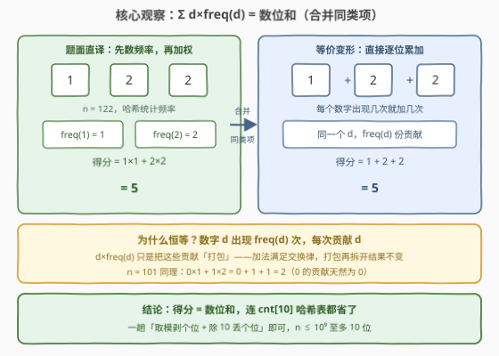
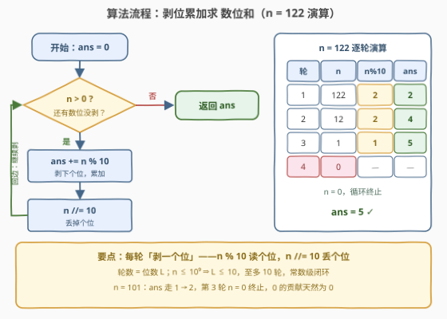

# LeetCode 计算数字频率得分 题解

## 1. 题目概述

- **标题 / 题号**：计算数字频率得分（#3945，easy）
- **链接**：https://leetcode.cn/problems/digit-frequency-score/
- **难度**：简单
- **标签**：哈希表、数学

**题意**：给你一个整数 `n`。

`n` 的**得分**定义为：对所有**不同**数字 $d$，计算 $d \times \text{freq}(d)$ 的总和，其中 $\text{freq}(d)$ 表示数字 $d$ 在 `n` 中出现的次数。

返回一个整数，表示 `n` 的得分。

**示例 1**：

```text
输入：n = 122
输出：5
解释：数字 1 出现 1 次，贡献 1 × 1 = 1；数字 2 出现 2 次，贡献 2 × 2 = 4；得分 = 1 + 4 = 5。
```

**示例 2**：

```text
输入：n = 101
输出：2
解释：数字 0 出现 1 次，贡献 0 × 1 = 0；数字 1 出现 2 次，贡献 1 × 2 = 2；得分 = 0 + 2 = 2。
```

**约束**：

- $1 \le n \le 10^9$

> 💡 **审题关键**：①得分是**按数字分组加权**再求和，不是把 `n` 的数值直接做什么运算——数字在 `n` 中的**位置**无关紧要，只有「哪个数字、出现几次」有用；②「不同数字」指 $0$–$9$ 中出现过的那几个，没出现的数字贡献为 $0$（不用显式枚举）；③$10^9$ 以内的正整数至多 10 位，数据规模是常数级。

## 2. 解题思路

### 2.1 暴力思路：按题面直译，哈希统计频率再加权

照题面直译的第一版：先把 `n` 逐位拆开，用长度为 10 的计数数组（或哈希表）统计每个数字 $d$ 的出现次数 $\text{freq}(d)$，再遍历 $d \in 0..9$，累加 $d \times \text{freq}(d)$。

正确，$O(L)$ 时间（$L$ 为位数），但走了**两趟**、还背了一张计数表——而这张表里藏着一个可以直接坍缩掉的恒等式（见 2.2）。

另一种更笨的直译是**转字符串**再 `Counter` 统计，本质相同，只是把整数物化成字符串多绕了一步；对 $n \le 10^9$ 的规模这些都毫无压力，但这题真正想考的是看穿表面定义。

### 2.2 核心观察：得分恒等于数位和



**观察（合并同类项）。** 数字 $d$ 在 `n` 中出现 $\text{freq}(d)$ 次，每一次出现都贡献一份 $d$。于是：

$$\sum_{\text{不同 } d} d \times \text{freq}(d) \;=\; \sum_{\text{每一位数位}} d$$

**左边**是「按数字分组打包」的和——同一个 $d$ 的 $\text{freq}(d)$ 份贡献合并成一项 $d \times \text{freq}(d)$；**右边**是「逐位摊开」的和。加法满足**交换律与结合律**，先打包再求和、还是逐份累加，结果恒等。示例 1 即 $1\times1 + 2\times2 = 1 + 2 + 2 = 5$；示例 2 即 $0\times1 + 1\times2 = 0 + 1 + 1 = 2$（数字 $0$ 的贡献天然为 $0$）。

于是题面绕了一圈，答案就是**数位和**（digit sum）：连 `cnt[10]` 计数表都不需要，一趟「取模剥个位 + 整除丢个位」直接累加即可。

### 2.3 算法流程图



| 步骤 | 操作 | 说明 |
|------|------|------|
| ① | `ans = 0` | 初始化累加器 |
| ② | `n > 0` ? | 否 → 所有数位已剥完，返回 `ans` |
| ③ | `ans += n % 10` | 剥下当前个位，累加进得分 |
| ④ | `n //= 10` | 整除 10 丢掉个位，回到 ② |

循环轮数恰好等于位数 $L$；$n \le 10^9 \Rightarrow L \le 10$，至多 10 轮。

### 2.4 示例演算

对**示例 1** `n = 122`：

| 轮次 | `n` | `n % 10` | `ans` |
|-----|-----|----------|-------|
| 1 | 122 | 2 | 2 |
| 2 | 12 | 2 | 4 |
| 3 | 1 | 1 | 5 |
| 4 | 0 | —（终止） | **5** ✓ |

对**示例 2** `n = 101`：`ans` 依次为 $1 \to 2$，第 3 轮 `n = 0` 终止，返回 **2** ✓（中间的 $0$ 贡献 $0$，剥掉即可）。

## 3. 参考代码

### C++

```cpp
class Solution {
  public:
    int digitFrequencyScore(int n) {
        int ans = 0;
        while (n > 0) {
            ans += n % 10;
            n /= 10;
        }
        return ans;
    }
};
```

> 💡 **写法要点**：
> - `n % 10` 读个位、`n /= 10` 丢个位，一对搭档正好剥掉一位，无字符串物化；
> - 循环条件 `n > 0`：约束保证 $n \ge 1$，首轮必进循环；若题目放宽到 $n = 0$，返回 $0$ 也恰好正确（空和为 0）；
> - 位数 $L \le 10$、每位值 $\le 9$，`ans` 最大 $90$，`int` 毫无溢出风险。

### Python

```python
class Solution:
    def digitFrequencyScore(self, n: int) -> int:
        ans = 0
        while n:
            ans += n % 10
            n //= 10
        return ans
```

> 💡 **写法要点**：
> - `while n` 即「还有数位未剥」，$n = 0$ 时自然终止；
> - 一行流写法 `return sum(map(int, str(n)))` 同样正确——转字符串逐位累加，与剥位法等价，仅多一次字符串物化；
> - 注意用 `//=` 整除，`/=` 会把 `n` 变浮点。

## 4. 复杂度分析

| 维度 | 复杂度 | 说明 |
|------|--------|------|
| 时间 | $O(L)$ | $L$ 为 `n` 的位数，循环 $L$ 轮、每轮 $O(1)$；$n \le 10^9 \Rightarrow L \le 10$，常数级 |
| 空间 | $O(1)$ | 只用 `ans` 与 `n` 两个变量，无计数表、无字符串物化 |
| 下界 | $\Omega(L)$ | 每一位都可能贡献非零得分，未读的位无法跳过 ⇒ 单趟剥位已最优 |

## 5. 扩展：从数位和到数字根

**反复求和与数字根。** 若把本题升级为「反复求得分直到结果为一位数」，就是经典的**数字根**（digital root）：$n \ge 1$ 时答案为 $1 + (n - 1) \bmod 9$，可 $O(1)$ 闭式求解——[258. 各位相加](https://leetcode.cn/problems/add-digits/) 正是此题。核心仍是本题的恒等式：数位和只是数的另一种表示，而模 9 意义下 $10 \equiv 1$，故数位和 $\equiv n \pmod 9$。

**数位分离的两种实现。** 剥位法（`%10` / `//10`）与字符串法（`str(n)` 逐字符）完全等价：前者纯算术、零物化，后者直观、便于配合字符级处理；数据规模大（高精度大数）时字符串法更自然，如 [1945. 字符串转化后的各位数字之和](https://leetcode.cn/problems/sum-of-digits-of-string-after-convert/)。

**位置开始有意义的变体。** 本题数字**位置无关**，一旦变体让位置参与（如「数位排序后重新组合」「相邻数位做差」），恒等式即失效，须老实物化数位序列再处理，如 [2160. 拆分数位后四位数字的最小和](https://leetcode.cn/problems/minimum-sum-of-four-digit-number-after-splitting-digits/)。

## 6. 面试要点

**Q1：为什么 $\sum_d d \times \text{freq}(d)$ 就是数位和？**

> 数字 $d$ 出现 $\text{freq}(d)$ 次、每次贡献一份 $d$；$d \times \text{freq}(d)$ 只是把这些贡献**合并同类项**打包成一项。加法满足交换律，按数字打包求和与逐位累加结果恒等——$122$ 的 $1\times1 + 2\times2$ 与 $1+2+2$ 是同一个和的两种记账方式。

**Q2：还需要哈希表 / 计数数组吗？**

> 不需要。看穿恒等式后「分组统计再加权」整条流水线都可跳过，直接一趟剥位累加；即便没看穿，$O(L)$ 的两趟计数法也完全正确——本题考的是能否把题面定义**化简到最简形式**。

**Q3：`while (n > 0)` 和 `while (n)` 有区别吗？`n = 0` 会怎样？**

> 对本题（$n \ge 1$）无区别。若放宽到 $n = 0$：循环一次都不进，返回 `ans = 0`，恰好是空和的正确值——两种写法都天然处理，无需特判。负数则需先取绝对值（或按题意另行定义），否则 `%` 行为因语言而异。

**Q4：循环最多转几轮？`ans` 会溢出吗？**

> 轮数 = 位数 $L$，$n \le 10^9 \Rightarrow L \le 10$，至多 10 轮；`ans` 上界 $10 \times 9 = 90$，任何整型都绰绰有余。若约束升到 $10^{18}$，$L \le 19$、`ans ≤ 171`，依然安全。

**Q5：剥位法和转字符串法（`sum(map(int, str(n)))`）怎么选？**

> 两者时间同为 $O(L)$、都正确。剥位法纯算术、$O(1)$ 空间、不产生中间对象；字符串法一行写完、易读性高，且天然适配「按字符处理数位」的变体（如字母转数字后求和）。常规规模随意选，高精度/字符流场景选字符串法。

> 💡 **一句话总结**：得分 $\sum_d d\times\text{freq}(d)$ 合并同类项后就是数位和——一趟 `%10` 剥位、`//10` 丢位累加，$O(L)/O(1)$ 收工。

## 同类练习题

| # | 题目 | 与本题的关联 |
|---|------|-------------|
| 258 | [各位相加](https://leetcode.cn/problems/add-digits/) | 数位和的反复应用版（数字根），可进一步坍缩为 $1 + (n-1) \bmod 9$ 的 $O(1)$ 闭式 |
| 1945 | [字符串转化后的各位数字之和](https://leetcode.cn/problems/sum-of-digits-of-string-after-convert/) | 数位和 + 滚动 $k$ 次，字符串法剥位的直接练习 |
| 2160 | [拆分数位后四位数字的最小和](https://leetcode.cn/problems/minimum-sum-of-four-digit-number-after-splitting-digits/) | 物化全部数位后排序贪心重组——位置开始有意义的对照题 |
| 2269 | [找到一个数字的 K 美丽值](https://leetcode.cn/problems/find-the-k-beauty-of-a-number/) | 数位按**位置**滑窗取子数，剥位/字符串两种实现的进阶用法 |
| 728 | [自除数](https://leetcode.cn/problems/self-dividing-numbers/) | 逐位判定「每位都能整除原数」，数位遍历的基础练习 |
