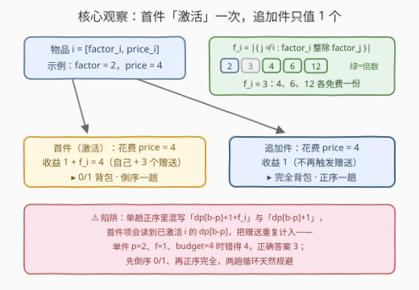
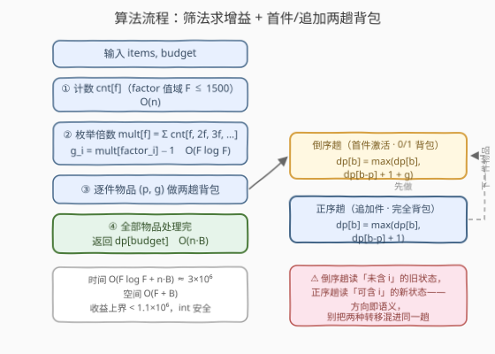

# 购买最多物品数目 I

- **题目名称**：购买最多物品数目 I
- **链接**：[3946. 购买最多物品数目 I](https://leetcode.cn/problems/maximum-number-of-items-from-sale-i/)
- **难度**：中等
- **标签**：数组、动态规划、贪心

## 1. 题目概述

给你一个二维整数数组 `items`，其中 `items[i] = [factor_i, price_i]` 表示下标为 $i$ 的物品；同时给你一个整数 `budget`。每种物品都有**无限份**可供购买，购买的总花费最多为 `budget`。

购买之后，你还能按以下规则获得**免费**物品：

1. 若你购买了物品 $i$（至少一份），则所有满足 $j \ne i$ 且 $factor_i$ **整除** $factor_j$ 的物品 $j$，你都免费获得一份；
2. **重复**购买物品 $i$ 不会触发额外的免费物品（赠送只随首件发生一次）；
3. 同一物品 $j$ 若被**不同种类**的购买分别激活，免费份数可以**叠加**。

返回总花费不超过 `budget` 的前提下，能获得的最大物品总数（购买的 + 免费的）。

**示例 1**：

```text
输入：items = [[6,2],[2,6],[3,4]], budget = 9
输出：4
解释：购买 2 份物品 0 和 1 份物品 2，花费 2*2 + 4 = 8 ≤ 9。
     购买物品 2（factor=3 整除 factor=6）免费获得 1 份物品 0，
     合计 3 份购买 + 1 份免费 = 4。
```

**示例 2**：

```text
输入：items = [[2,4],[3,2],[4,1],[6,4],[12,4]], budget = 8
输出：10
解释：购买 1 份物品 0、1 份物品 1、2 份物品 2，花费 4 + 2 + 2*1 = 8。
     购买物品 0（factor=2）送物品 2、3、4 各一份；
     购买物品 1（factor=3）送物品 3、4 各一份；
     购买物品 2（factor=4）送物品 4 一份——共 6 份免费，
     合计 4 份购买 + 6 份免费 = 10。
```

**约束条件**：

- $1 \le \text{items.length} \le 1000$
- $\text{items}[i] = [factor_i,\ price_i]$
- $1 \le factor_i,\ price_i \le 1500$
- $1 \le budget \le 1500$

> 💡 **审题关键**：三条免费规则可以压缩成一句「收益函数」——**激活**物品 $i$（至少买一份）一次性带来 $f_i$ 个免费品，其中 $f_i = \lvert\{\, j \ne i : factor_i \mid factor_j \,\}\rvert$；此后每追加一份只多 1 个。规则 ② 说明赠送随「种类」而非「份数」触发，规则 ③ 说明不同种类的赠送直接相加。把这句话写出来，本题就规约成一个带「首件增益」的背包。

---

## 2. 解题思路

### 2.1 暴力思路：指数枚举与一个隐蔽的单趟背包陷阱

最朴素的做法是枚举「激活集合」$S \subseteq \text{items}$（每种物品要么至少买一份、要么不买），剩余预算全部买追加件——$2^n$ 种组合，在 $n = 1000$ 下直接爆炸。

更危险的是一个**很像正解**的错误写法：注意到每份追加件价值恒为 1，于是把「买一份物品 $i$ 得 $1 + f_i$」直接塞进完全背包的单趟正序循环：

```text
# ❌ 错误写法（示意）
for b in range(p, budget + 1):
    dp[b] = max(dp[b], dp[b - p] + 1 + f, dp[b - p] + 1)
```

问题在于：正序循环里 `dp[b - p]` 可能**已经包含物品 $i$ 的激活**，再走 `+1 + f` 分支等于把赠送**重复计入**。取单独一件 $p = 2,\ f = 1$、$budget = 4$：正确答案是买两份得 $2 + 1 = 3$，而错误写法在 $b = 4$ 时读到 `dp[2] = 2` 再加 $1 + f$，得到 $4$——赠送只该发生一次，这一趟循环里却发生了两次。

### 2.2 核心观察：把每件物品拆成「首件 + 追加件」两种虚拟商品



**观察一（收益函数）：总收益只由「激活集合 + 总份数」决定。** 设物品 $i$ 买了 $k_i$ 份（$k_i \ge 1$ 即激活），则

$$\text{总收益} = \underbrace{\sum_i k_i}_{\text{购买份数}} + \underbrace{\sum_{i:\, k_i \ge 1} f_i}_{\text{免费份数}}, \qquad \text{约束} \quad \sum_i k_i \cdot price_i \le budget$$

赠送与份数解耦、只看激活与否——这正是规则 ② ③ 的直接推论，也是全部建模的起点。

**观察二（$f_i$ 可筛法预计算，官方 hint 1）：** $factor$ 值域只有 $1500$。先计数 $cnt[v]$（$factor$ 恰为 $v$ 的物品数），再对每个出现过的 $f$ 枚举倍数 $m = f, 2f, 3f, \dots$ 求和，得 $mult[f] = \sum_{f \mid m} cnt[m]$；于是 $f_i = mult[factor_i] - 1$（扣除自己）。调和级数 $\sum_{f \le F} F/f \approx F \ln F \approx 10^4$，优于 $O(n^2)$ 的朴素双重循环（虽然 $n \le 1000$ 时后者也能过）。

**观察三（拆成两种虚拟商品，官方 hints 2–4）：** 每件物品拆成两件虚拟商品：

| 虚拟商品 | 花费 | 收益 | 背包形态 | 遍历方向 |
|----------|------|------|----------|----------|
| 首件（激活） | $price_i$ | $1 + f_i$ | 0/1 背包（至多一件） | **倒序** |
| 追加件 | $price_i$ | $1$ | 完全背包（任意多件） | **正序** |

先倒序一趟做首件、再正序一趟做追加，正好规避开 2.1 的陷阱：**倒序**保证首件从「尚未包含 $i$」的旧状态转移（赠送恰好计入一次）；**正序**允许 `dp[b - p]` 取到「已含 $i$」的新状态（追加件链式叠加）。两趟一气呵成，转移就是标准背包：

$$dp[b] = \max\begin{cases} dp[b] & \text{（不买）} \\ dp[b - p] + 1 + f_i & \text{（首件，倒序趟）} \\ dp[b - p] + 1 & \text{（追加，正序趟）} \end{cases}$$

归纳可证：处理完物品 $i$ 后，$dp[b] = \max_{k \ge 0}\{\, \text{olddp}[b - k \cdot p] + (k \ge 1?\ k + f_i : 0) \,\}$，恰好覆盖「买 $k$ 份」的全部取值且赠送至多计入一次。

> ⚠️ 也有更省的写法：只给「全局最便宜的物品」开追加件、其余物品纯 0/1 背包——这是对的（交换论证见第 5 节），但两趟写法无需额外论证、对每件物品一视同仁，是更稳的主线。

### 2.3 算法流程图



| 步骤 | 操作 | 说明 |
|------|------|------|
| ① | 计数 $cnt[v]$（$factor$ 值域 $F \le 1500$） | 值域桶计数，$O(n)$ |
| ② | 枚举倍数求 $mult[f]$，得 $g_i = mult[factor_i] - 1$ | 调和级数，$O(F \log F)$ |
| ③ | 逐件物品 $(p, g)$：**倒序**一趟 0/1（首件 $+1+g$），再**正序**一趟完全背包（追加 $+1$） | 两趟合计 $O(n \cdot B)$ |
| ④ | 返回 $dp[budget]$ | 答案上界 $< 1.1 \times 10^6$，`int` 足够 |

### 2.4 示例演算

以示例 2 `items = [[2,4],[3,2],[4,1],[6,4],[12,4]]`、`budget = 8` 走一遍。

**先算增益**：$cnt = \{2{:}1,\ 3{:}1,\ 4{:}1,\ 6{:}1,\ 12{:}1\}$；枚举倍数得 $mult[2] = 4$（$\{2,4,6,12\}$）、$mult[3] = 3$（$\{3,6,12\}$）、$mult[4] = 2$（$\{4,12\}$）、$mult[6] = 2$、$mult[12] = 1$；各物品的 $g = mult[factor] - 1$ 依次为 $3,\ 2,\ 1,\ 1,\ 0$。

**再跑两趟背包**（下表为每件物品处理完后的 `dp[0..8]`）：

| 处理的物品 $(p, g)$ | dp[0..8] | 关键转移 |
|---|---|---|
| 初始 | `0 0 0 0 0 0 0 0 0` | —— |
| $(4, 3)$ | `0 0 0 0 4 4 4 4 5` | $b{=}4$ 首件得 $1{+}3=4$；正序趟 $b{=}8$ 追加一份得 5 |
| $(2, 2)$ | `0 0 3 3 4 4 7 7 8` | $b{=}6$：旧 $dp[4]{+}1{+}2 = 7$（两种激活）；$b{=}8$ 追加一份得 8 |
| $(1, 1)$ | `0 2 3 5 6 7 8 9 10` | $b{=}7$ 三种激活 $4{+}3{+}2 = 9$；正序趟再追加一份 $p{=}1$ 得 10 |
| $(4, 1)$ | 不变 | 预算已花满，无更优 |
| $(4, 0)$ | 不变 | 同上 |

答案 $dp[8] = \mathbf{10}$ ✓——正对应官方解释「4 份购买 + 6 份免费」。

示例 1 同理：$g = 0,\ 1,\ 1$，最优为 2 份物品 0（$2 + 0$）+ 1 份物品 2（$1 + 1$），花费 $8 \le 9$，共 $4$ ✓。

---

## 3. 参考代码

### C++

```cpp
class Solution {
  public:
    int maximumSaleItems(vector<vector<int>>& items, int budget) {
        const int F = 1500;
        vector<int> cnt(F + 1, 0);
        for (auto& it : items) cnt[it[0]]++;              // factor 值域桶计数
        vector<int> mult(F + 1, 0);                       // mult[f] = factor 是 f 的倍数的物品数
        for (int f = 1; f <= F; f++)
            if (cnt[f])
                for (int m = f; m <= F; m += f) mult[f] += cnt[m];
        vector<int> dp(budget + 1, 0);
        for (auto& it : items) {
            int p = it[1], g = mult[it[0]] - 1;           // 首件激活额外送 g 个（扣除自己）
            for (int b = budget; b >= p; b--)             // 首件：0/1 背包，倒序只读旧状态
                dp[b] = max(dp[b], dp[b - p] + 1 + g);
            for (int b = p; b <= budget; b++)             // 追加：完全背包，正序允许链式叠加
                dp[b] = max(dp[b], dp[b - p] + 1);
        }
        return dp[budget];
    }
};
```

> 💡 **写法要点**：
> - 两趟循环的方向是本题灵魂：**倒序趟**读到的 `dp[b - p]` 必是「未含物品 $i$」的旧值，赠送恰好计入一次；**正序趟**读到的可能是「已含 $i$」的新值，追加件才能无限叠加；
> - `mult` 只对 `cnt[f] > 0` 的 $f$ 枚举倍数，空桶跳过，常数更小；
> - 答案上界：购买份数 $\le budget \le 1500$、免费份数 $\le n(n-1) < 10^6$，`int` 稳妥；
> - 若改用「只给最便宜物品开追加件」的 0/1 写法（见第 5 节），注意并列最低价时任取其一即可。

### Python

```python
class Solution:
    def maximumSaleItems(self, items: List[List[int]], budget: int) -> int:
        F = max(f for f, _ in items)
        cnt = [0] * (F + 1)
        for f, _ in items:
            cnt[f] += 1
        mult = [0] * (F + 1)                              # mult[f] = factor 是 f 的倍数的物品数
        for f in range(1, F + 1):
            if cnt[f]:
                for m in range(f, F + 1, f):
                    mult[f] += cnt[m]
        dp = [0] * (budget + 1)
        for f, p in items:
            g = mult[f] - 1                               # 首件激活额外送 g 个（扣除自己）
            for b in range(budget, p - 1, -1):            # 首件：0/1 背包，倒序
                if dp[b - p] + 1 + g > dp[b]:
                    dp[b] = dp[b - p] + 1 + g
            for b in range(p, budget + 1):                # 追加：完全背包，正序
                if dp[b - p] + 1 > dp[b]:
                    dp[b] = dp[b - p] + 1
        return dp[budget]
```

> 💡 **写法要点**：
> - 值域直接取 `max(factor)`，不必写死 1500，桶更紧凑；
> - 倒序趟是 `range(budget, p - 1, -1)`——终点是 `p - 1` 而非 `p`，$b = p$ 这格也要覆盖；
> - `if ... > dp[b]` 的写法比 `dp[b] = max(...)` 少一次函数调用，$n \cdot B \approx 1.5 \times 10^6$ 规模下差别不大，按习惯选择即可。

---

## 4. 复杂度分析

| 维度 | 复杂度 | 说明 |
|------|--------|------|
| 时间 | $O(F \log F + n \cdot B)$ | 筛法调和级数 $\approx 1.5 \times 10^3 \ln 1500 \approx 10^4$；背包两趟 $\approx 2 \times 1000 \times 1500 = 3 \times 10^6$ |
| 空间 | $O(F + B)$ | `cnt / mult` 两张值域表 + 一维 `dp` 滚动数组 |
| 数值 | 答案 $< 1.1 \times 10^6$ | 购买 $\le B \le 1500$ 份 + 免费 $\le n(n-1) < 10^6$ 份，32 位 `int` 安全 |

---

## 5. 扩展：追加件只需要「全局最便宜」+ II 版预告

**交换论证：存在最优解，所有追加件都买全局最低价的物品。** 若某方案里物品 $j$ 买了 $\ge 2$ 份，而全局最便宜物品 $c$（价 $q \le price_j$）至多买了一份：把 $j$ 的一份追加件换成一份 $c$——花费不增、购买份数不变；若恰好激活了 $c$ 还白赚 $f_c \ge 0$。反复交换即得结论。于是代码可简化为「全部物品按 0/1 背包（值 $1 + f_i$）+ 仅最便宜物品开完全背包（值 1）」，复杂度不变，但省去了对其余物品的正序趟——面试可作为加分讨论点。

**II 版（3947）规则升级。** [3947. 购买最多物品数目 II](https://leetcode.cn/problems/maximum-number-of-items-from-sale-ii/) 中赠送规则变为「**每买一份**物品 $i$ 都能配对送一份不同的 $j$（$factor_i \mid factor_j$），但同一种 $j$ 至多被同一种 $i$ 送一次」——买 $c$ 份 $i$ 的贡献是 $c + \min(c, f_i)$，即前 $f_i$ 份每份值 2、之后每份值 1；配合 $n \le 10^5$、$price, budget \le 10^9$ 的大范围，背包彻底失效，正解按价格排序后对「价值 2 的边际件」批量贪心。I 版的两趟背包正是理解 II 版「边际价值」阶梯的脚手架。

---

## 6. 面试要点

**Q1：为什么不能把「买一份送 $f_i$」直接塞进完全背包的单趟正序循环？**

> 正序循环中 `dp[b - p]` 可能已包含物品 $i$ 的激活，再走 `+1 + f_i` 分支会把赠送重复计入。反例：单件物品 $p=2,\ f=1,\ budget=4$，正确答案 $2 + 1 = 3$，单趟混写得到 4。根本原因是赠送语义「按种类一次性」与完全背包的转移语义「按份叠加」冲突，两种语义必须在不同的趟里表达。

**Q2：为什么先倒序、再正序两趟就正确？**

> 倒序趟是标准 0/1 背包：读到的 `dp[b - p]` 全是「未含 $i$」的旧状态，首件的 $1 + f_i$ 恰好计入一次；正序趟是完全背包：`dp[b - p]` 允许是「已含 $i$」的新状态，追加件每份 $+1$ 无限链式。归纳可得处理完 $i$ 后 $dp[b] = \max_{k \ge 0}\ \text{olddp}[b - kp] + (k \ge 1 ?\ k + f_i : 0)$，与「买 $k$ 份」的真实收益一一对应。

**Q3：$f_i$ 怎么求？复杂度多少？**

> 值域筛：$cnt[v]$ 计数后，对每个出现过的 $f$ 枚举倍数累加得 $mult[f]$，$f_i = mult[factor_i] - 1$。注意「其他物品」按**下标**理解——同 $factor$ 的物品也互送，只扣自己一个。调和级数 $O(F \log F) \approx 10^4$；$n \le 1000$ 时 $O(n^2)$ 双重循环同样可过，但筛法在 $n$ 放大时依然稳健。

**Q4：本题与「预算内买最多件」的排序贪心（如 1833 雪糕）差在哪？**

> 没有首件增益时每件价值恒为 1，「单位价格买最多份数」的排序贪心即可；一旦引入 $1 + f_i$ 的激活增益，物品价值不再齐一，简单贪心的交换性质被破坏，只能上背包。识别「贪心失效的临界条件」比背模板更重要。

**Q5：一维 `dp` 的滚动方向为什么在本题里用到两次、且方向相反？**

> 同一个一维数组，倒序遍历 = 每件物品至多用一次（0/1），正序遍历 = 允许无限次（完全）。本题把一件真实物品拆成两种虚拟商品，正好两种方向各用一遍——**方向即语义**，这是本题最值得带走的技巧。

---

## 7. 同类练习题

- [1833. 雪糕的最大数量](https://leetcode.cn/problems/maximum-ice-cream-bars/)：无激活增益的「预算内买最多件」，排序贪心就够，对比理解本题为何必须背包
- [322. 零钱兑换](https://leetcode.cn/problems/coin-change/)：完全背包原型，本题正序趟的镜像练习，巩固「正序 = 无限件」
- [416. 分割等和子集](https://leetcode.cn/problems/partition-equal-subset-sum/)：0/1 背包一维滚动数组原型，本题倒序趟的来源
- [518. 零钱兑换 II](https://leetcode.cn/problems/coin-change-ii/)：完全背包计数，正序/倒序方向辨析的最佳练习
- [3947. 购买最多物品数目 II](https://leetcode.cn/problems/maximum-number-of-items-from-sale-ii/)：本题续作，赠送按份触发、范围放大到 $10^9$，考察「边际价值」贪心对背包的替代
