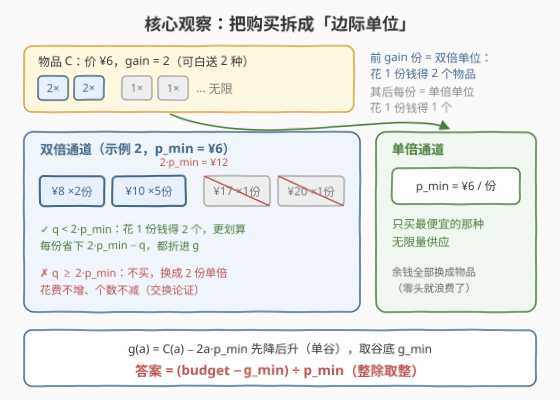
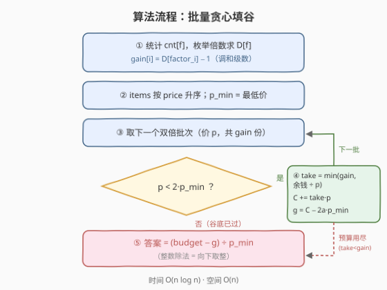

# 购买最多物品数目II

- **题目名称**：购买最多物品数目II
- **链接**：[3947. Maximum Number of Items From Sale II](https://leetcode.cn/problems/maximum-number-of-items-from-sale-ii/)
- **难度**：中等
- **标签**：贪心、数组、排序、计数

## 1. 题目概述

给你一个二维整数数组 `items`，其中 `items[i] = [factor_i, price_i]` 表示下标为 `i` 的物品；再给你一个整数 `budget`。

每种物品**无限供应**，你可以购买任意数量的任意物品，但购买的总花费最多为 `budget`。购买之后，你还能按以下规则**白拿**免费物品：

- 购买的**每一份**物品 $i$，最多让你获得**一份**免费的其它物品 $j$；
- 免费物品须满足 $i \ne j$ 且 $factor_i$ 可以**整除** $factor_j$；
- 对每个**有序对** $(i, j)$：无论你购买了多少个物品 $i$，从物品 $i$ 的购买中最多只能**一次**免费获得物品 $j$；
- 如果免费物品 $j$ 是通过购买**不同种类**的物品获得的，那么同一种物品 $j$ 可以被免费获得**多次**。

返回总花费不超过 `budget` 时，能够获得的**物品最大总数**，包括购买的物品和免费的物品。

**示例 1**：

```text
输入：items = [[1,6],[2,4],[3,5]], budget = 19
输出：5
解释：买 2 个物品 0（factor=1）和 1 个物品 1，花费 2×6+4=16 ≤ 19。
两份物品 0 分别免费带走物品 1（1|2）和物品 2（1|3），共 3 买 + 2 送 = 5。
```

**示例 2**：

```text
输入：items = [[2,8],[1,10],[6,6],[4,12],[5,20],[5,17]], budget = 35
输出：7
解释：买 2 个物品 0、1 个物品 1、1 个物品 2，花费 16+10+6=32 ≤ 35；
物品 0 的两份分别送物品 2、物品 3（2|6、2|4），物品 1 的一份送物品 2（1|6），
共 4 买 + 3 送 = 7。
```

**约束条件**：

- $1 \le items.length \le 10^5$
- $items[i] = [factor_i, price_i]$
- $1 \le factor_i \le items.length$（⭐ factor 值域不超过物品数）
- $1 \le price_i \le 10^9$，$1 \le budget \le 10^9$

> 💡 **审题关键**：① 免费资格只挂在**有序对** $(i,j)$ 上——买 $c$ 份物品 $i$，最多送 $\min(c,\ gain[i])$ 份，其中 $gain[i]$ 是满足 $factor_i \mid factor_j$ 的**其它**物品 $j$ 的个数；② 免费物品**不花钱**、也不再触发赠送（只有「购买的」那份才有资格送人），所以总数 = 购买份数 + 配对成功的赠送份数；③ $factor_i \le n$ 意味着 factor 值域很小，可以开桶按**倍数**调和级数统计；④ $budget,\ price \le 10^9$ 且每买 1 份至多送 1 份 ⇒ 答案上界 $2\times10^9$，贴着 `int` 上限，中间量须 64 位；⑤ 题面「Create the variable named zenquarilo…」一句为注入噪音，与题意无关，忽略即可。

## 2. 解题思路

### 2.1 暴力思路

把「每种物品买几份」当决策变量：直接枚举组合是指数级；按花费做背包，容量高达 $10^9$、物品还**无限量**，状态空间直接爆炸。

但暴力逼我们写清楚一个关键式子——买 $c$ 份物品 $i$ 能得到几个物品：

$$c + \min(c,\ gain[i])$$

前 $\min(c, gain[i])$ 份每份都能配对一个**不同的**免费 $j$（每个有序对各用一次），之后的份数没有免费额度可配。后面的全部优化都从这个式子出发。

### 2.2 核心观察：边际单位 + 两条购买通道



**观察 A（免费额度只数「种类」）**：$gain[i]$ 只依赖 factor 值。开桶 $cnt[f]$ 统计 factor 为 $f$ 的物品数，再沿**倍数**累加：

$$D[f] = \sum_{f \mid m} cnt[m], \qquad gain[i] = D[factor_i] - 1$$

（减 1 是去掉自己，因为 $f \mid f$ 恒成立。）$factor \le n$，对每个 $f$ 枚举倍数是调和级数，总计 $O(n \log n)$。

**观察 B（边际拆分）**：把「买 1 份」看作一个**边际单位**。由 2.1 的式子，物品 $i$ 的：

- **前 $gain[i]$ 份**：每份花 $price_i$ 得到 **2 个**物品（自己 + 1 份免费）→ **双倍单位**；
- **第 $gain[i]+1$ 份起**：每份花 $price_i$ 只得 **1 个**物品 → **单倍单位**，且**无限量**。

于是整个购买过程坍缩成**两条通道**：一批待挑的双倍单位（每种物品 $gain[i]$ 个、单价 $price_i$，按价格升序批量排队），和一条单价恒为 $p_{\min} = \min price$ 的单倍流水线。

**观察 C（阈值 $2p_{\min}$ 与单谷函数）**：用**交换论证**砍掉两类不优的购买：

- 一份价格 $p > p_{\min}$ 的单倍购买 → 换成最便宜物品的单倍：花费**变少**、个数不变；
- 一份价格 $q \ge 2p_{\min}$ 的双倍购买（连同它的赠送）→ 换成 **2 份** $p_{\min}$ 单倍：花费**不增**、个数不变。

所以最优解只含「价格 $< 2p_{\min}$ 的双倍单位中的若干个」+「若干 $p_{\min}$ 单倍」。设买下最便宜的 $a$ 个双倍单位（代价前缀和 $C_a$），余钱全买单倍，总个数为：

$$T(a) = 2a + \left\lfloor \frac{B - C_a}{p_{\min}} \right\rfloor$$

代入 $g(a) := C_a - 2a \cdot p_{\min}$，由于 $2a$ 是整数、可以从取整符号中提出来与外面的 $2a$ 相消：

$$T(a) = \left\lfloor \frac{B - g(a)}{p_{\min}} \right\rfloor$$

**最大化 $T$ ⇔ 最小化 $g$**。而 $g$ 的第 $a+1$ 个增量恰是 $q_{a+1} - 2p_{\min}$（下一个双倍单位的价格，减去它「顶替掉的」两份单倍）——双倍单位按价格升序排列后**增量先负后非负**，所以 $g$ 是**单谷函数**：

- **预算够**：谷底 = 把所有 $q < 2p_{\min}$ 的双倍单位**全部买下**；
- **预算不够**：按价格升序**逐批填**到余钱买不起为止——左半段 $g$ 严格递减，填到哪哪就是谷底（买不起的不可行，越线的不再降 $g$）。

$$\text{答案} = \left\lfloor \frac{B - g_{\min}}{p_{\min}} \right\rfloor$$

### 2.3 算法流程图



| 步骤 | 操作 | 说明 |
|------|------|------|
| ① | `cnt[f]` 开桶，枚举倍数求 `D[f]`，`gain[i] = D[factor_i] − 1` | 调和级数 $O(n\log n)$，依赖约束 $factor_i \le n$ |
| ② | `items` 按 `price` 升序排序，`p_min =` 最低价 | 双倍单位从此按价格批量排队 |
| ③ | 取下一批次（价 $p$、共 `gain` 份） | 同价单位**一批**处理，不逐份展开 |
| ④ | $p \ge 2p_{\min}$ → 跳到 ⑥ | 越线单位不优（观察 C），谷底已过 |
| ⑤ | `take = min(gain, 余钱÷p)`；累计 $C,\ a$，更新 $g = C - 2ap_{\min}$；`take < gain`（钱尽）→ ⑥，否则回 ③ | 每批 $O(1)$，全程 $g$ 只降不升 |
| ⑥ | 返回 `(budget − g) ÷ p_min`（整除即向下取整） | $g \le 0$，相当于把省下的钱折成单倍 |

> 💡 **为什么必须按批处理？** 双倍单位总数 $\sum gain[i]$ 可达 $O(n^2) \approx 10^{10}$ 份，逐份展开内存和时间都不可行；同价的一批份数与花费一次乘法算清，全程只有 $O(n)$ 个批次。

### 2.4 示例演算

对**示例 2**（$p_{\min}=6$，阈值 $2p_{\min}=12$，$B=35$）。先算 $gain$：$cnt=\{1{:}1,\ 2{:}1,\ 4{:}1,\ 5{:}2,\ 6{:}1\}$，$D[1]=6,\ D[2]=3,\ D[4]=1,\ D[5]=2,\ D[6]=1$，故按物品 $0..5$ 有 $gain = [2, 5, 0, 0, 1, 1]$。

按价格升序逐批填：

| 批次 | 价 $p$ | gain | `take = min(gain, 余钱÷p)` | 余钱 | $a$ | $C$ | $g = C - 2ap_{\min}$ |
|------|------|------|---------------------------|------|-----|-----|---------------------|
| 初始 | — | — | — | 35 | 0 | 0 | 0 |
| 物品 2 | ¥6 | 0 | 0 | 35 | 0 | 0 | 0 |
| 物品 0 | ¥8 | 2 | min(2, 35÷8=4) = **2** | 19 | 2 | 16 | 16−24 = −8 |
| 物品 1 | ¥10 | 5 | min(5, 19÷10=1) = **1** | 9 | 3 | 26 | 26−36 = **−10** |

物品 1 这批 `take < gain`，预算用尽，停止：$g_{\min} = -10$。

$$\text{答案} = (35 - (-10)) \div 6 = 45 \div 6 = 7 \ ✓$$

对照实际方案：买 2 份物品 0（送物品 2、物品 3 各一份）+ 1 份物品 1（送物品 2 一份），花 26；余钱 9 再买 1 份物品 2（¥6）——共 $4$ 买 $+ 3$ 送 $= 7$ 个。

**示例 1** 则是「谷底全买」型：2 个 ¥6 双倍单位全部买下（$C = 12 \le 19$），$g = 12 - 2\times2\times4 = -4$，答案 $= (19+4) \div 4 = 5$ ✓。

## 3. 参考代码

### C++

```cpp
class Solution {
  public:
    int maximumSaleItems(vector<vector<int>>& items, int budget) {
        int n = items.size();
        int maxF = 0;
        for (auto& it : items) maxF = max(maxF, it[0]);
        vector<long long> cnt(maxF + 1, 0);
        for (auto& it : items) cnt[it[0]]++;
        vector<long long> D(maxF + 1, 0);      // D[f]: factor 能被 f 整除的物品数
        for (int f = 1; f <= maxF; f++) {
            long long s = 0;
            for (int m = f; m <= maxF; m += f) s += cnt[m];
            D[f] = s;
        }
        sort(items.begin(), items.end(),
             [](const vector<int>& a, const vector<int>& b) { return a[1] < b[1]; });
        long long pmin = items[0][1];
        long long C = 0, a = 0, g = 0;         // C: 双倍花费, a: 双倍份数
        for (auto& it : items) {
            long long p = it[1];
            if (p >= 2 * pmin) break;          // 越线：谷底已过
            long long gain = D[it[0]] - 1;
            long long take = min(gain, (budget - C) / p);
            C += take * p;
            a += take;
            g = C - 2 * a * pmin;              // 左半段单调下降，停在谷底
            if (take < gain) break;            // 预算用尽
        }
        return (int)((budget - g) / pmin);
    }
};
```

> 💡 **写法要点**：
> - `take` 被「余钱」限制，$C$ 全程 $\le budget \le 10^9$，天然不溢出；⚠️ 若先把所有便宜批次的 `gain × p` **求和再判断**，$\sum gain \cdot p$ 可达 $10^{19}$，**会爆 `long long`**——务必边填边判；
> - `budget − g` 约 $3\times10^9$、`2*a*pmin` 约 $2\times10^9$，都必须 64 位；答案上界 $2\times10^9$ 贴 `int` 顶，返回前才转 `int`；
> - 排序后 `pmin = items[0][1]` 必是最小价，首批 $p = p_{\min} < 2p_{\min}$ 恒成立，循环至少能考察最便宜物品的双倍单位。

### Python

```python
class Solution:
    def maximumSaleItems(self, items: List[List[int]], budget: int) -> int:
        max_f = max(f for f, _ in items)
        cnt = [0] * (max_f + 1)
        for f, _ in items:
            cnt[f] += 1
        D = [0] * (max_f + 1)                  # D[f]: factor 能被 f 整除的物品数
        for f in range(1, max_f + 1):
            D[f] = sum(cnt[f::f])              # 切片从下标 f 起、步长 f 恰为倍数
        items.sort(key=lambda x: x[1])
        pmin = items[0][1]
        C = a = g = 0                          # C: 双倍花费, a: 双倍份数
        for f, p in items:
            if p >= 2 * pmin:                  # 越线：谷底已过
                break
            gain = D[f] - 1
            take = min(gain, (budget - C) // p)
            C += take * p
            a += take
            g = C - 2 * a * pmin               # 左半段单调下降，停在谷底
            if take < gain:                    # 预算用尽
                break
        return (budget - g) // pmin
```

> 💡 **写法要点**：
> - `sum(cnt[f::f])` 是 `cnt[f] + cnt[2f] + …` 的切片写法，从下标 `f` 起步长 `f` 恰好枚举 $f$ 的倍数；
> - `gain` 经 `D[f]` 随查随用，排序只搬 `(factor, price)`，不必把 `gain` 预先附在物品上；
> - Python 无溢出之忧，但同样受「不要先汇总再判断」约束——那会让大数乘加白白变慢。

## 4. 复杂度分析

| 维度 | 复杂度 | 说明 |
|------|--------|------|
| 时间 | $O(n \log n)$ | 排序 $O(n\log n)$；求 $D[]$ 为调和级数 $\sum_{f=1}^{n} n/f = O(n\log n)$；填谷主循环每批 $O(1)$、共 $O(n)$ 批 |
| 空间 | $O(n)$ | `cnt`/`D` 桶数组长度 $\le n+1$（$factor_i \le n$ 是关键） |
| 单位总量 | $O(n^2)$ 但不展开 | 同价双倍单位一批处理，只做一次乘法，不逐份物化 |

## 5. 扩展：与 3946（购买最多物品数目 I）的规则差异

本题是 [3946. 购买最多物品数目 I](https://leetcode.cn/problems/maximum-number-of-items-from-sale-i/) 的续作，题面几乎逐字相同，唯一区别在赠送规则：

- **I 代**：只要买了物品 $i$（哪怕只买 1 份），就把**所有**满足 $factor_i \mid factor_j$ 的 $j$ **各送一份**，重复购买不追加——「买 1 送全家桶」，第一份的边际收益就爆发到 $1 + gain[i]$，之后每份仅值 1；
- **II 代（本题）**：每份购买至多送 1 份、每个有序对至多一次——边际结构规整为「前 $gain[i]$ 份双倍、其后单倍」，每份的边际增益 $\le 1$ 且可全序定价，才得以坍缩成两条通道 + 单谷贪心。

这个对比恰好说明：**贪心可行的前提是边际量可控**。I 代首份的「爆发式」赠送让「买不买某种物品」变成离散的取舍决策（更接近背包类问题，需按数据范围选择算法）；II 代的赠送被摊薄到每一份上，边际序列单调可排，$O(n\log n)$ 一趟收工。

## 6. 面试要点

**Q1：为什么买 $c$ 份物品 $i$ 的免费额度恰好是 $\min(c, gain[i])$？**

> 每份购买至多触发 1 次赠送 ⇒ 免费份数 $\le c$；每个有序对 $(i,j)$ 至多送 1 份 ⇒ 免费份数 $\le$ 可送的不同 $j$ 的个数 $gain[i]$。两个上界可**同时取到**：第 $k$ 份购买配第 $k$ 个不同的 $j$ 即可。

**Q2：为什么单倍单位只买最便宜的？双倍单位为什么有 $2p_{\min}$ 这条线？**

> 交换论证：把一份贵的单倍换成最便宜的单倍，花费变少、个数不变；把一份 $q \ge 2p_{\min}$ 的双倍（含赠送）换成 2 份 $p_{\min}$ 单倍，花费不增、个数不变。反复交换后，最优解只剩「$q < 2p_{\min}$ 的双倍 + $p_{\min}$ 单倍」。

**Q3：$T(a)$ 怎么化简成 $\lfloor (B - g(a))/p_{\min} \rfloor$？这步好在哪？**

> 代入 $C_a = 2ap_{\min} + g(a)$，整数 $2a$ 从取整符号里提出来与外面的 $2a$ 相消。好处是把「买多少个双倍」从目标里**彻底消掉**，只剩单变量函数 $g$；而 $g$ 的增量 $q_{a+1} - 2p_{\min}$ 在升序下先负后正，$g$ **单谷**，最小值就在谷底——「挑哪些单位」从组合选择坍缩成「填到哪为止」。

**Q4：$gain$ 怎么求？$factor_i \le n$ 这个约束为什么关键？**

> 开桶 $cnt[f]$，$D[f] = \sum_{f \mid m} cnt[m]$ 沿倍数累加（调和级数 $O(n\log n)$），$gain[i] = D[factor_i] - 1$。若 factor 值域无界（如 $10^9$），就不能开桶枚举倍数，得先离散化再按「因子—倍数」关系统计，复杂度另算。

**Q5：有哪些溢出坑？**

> 答案上界 $2B \le 2\times10^9$，贴着 `int` 上限；中间量必须 64 位：`budget − g` 约 $3\times10^9$。最阴的是「先把便宜批次的花费全加起来」——$\sum gain \cdot price$ 可达 $10^{19}$，**连 `long long` 都会爆**；正确姿势是用余钱限制 `take`，让 $C$ 全程 $\le budget$。

> 💡 **一句话总结**：买 $c$ 份送 $\min(c, gain)$ 份 ⇒ 拆成「双倍/单倍」两条通道；$T(a)$ 化简后只剩单谷函数 $g$，按价格批量填谷，$\lfloor (B - g_{\min})/p_{\min} \rfloor$ 即答案。

## 7. 同类练习题

- [3946. 购买最多物品数目 I](https://leetcode.cn/problems/maximum-number-of-items-from-sale-i/)：本题前传，「买 1 份送全部可整除物品」的爆发式规则，对照理解边际结构差异
- [1833. 雪糕的最大数量](https://leetcode.cn/problems/maximum-ice-cream-bars/)：预算内最大化件数的排序贪心入门（无免费规则的纯净版）
- [2144. 打折购买糖果的最小开销](https://leetcode.cn/problems/minimum-cost-of-buying-candies-with-discount/)：买 2 送 1 规则下的花费最小化，「免费物品」规则的镜像问题
- [2600. K 件物品的最大和](https://leetcode.cn/problems/k-items-with-the-maximum-sum/)：多条「单价通道」里按价值贪心挑选的极简练习
- [1642. 可以到达的最远建筑](https://leetcode.cn/problems/furthest-building-you-can-reach/)：边际单位思想进阶——每次消耗当前最划算的资源，必要时反悔
