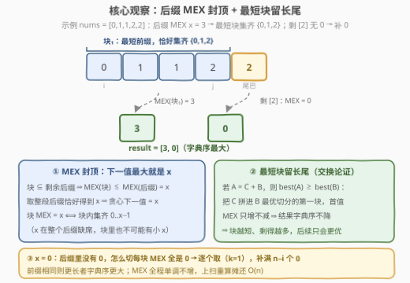
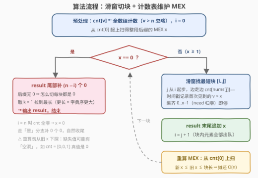

# 字典序最大的MEX数组

- **题目名称**：字典序最大的 MEX 数组
- **链接**：[3948. 字典序最大的 MEX 数组](https://leetcode.cn/problems/lexicographically-maximum-mex-array/)
- **难度**：困难
- **标签**：贪心、数组、哈希表、队列

## 1. 题目概述

给你一个整数数组 `nums`。你需要构造一个数组 `result`，做法是**重复执行以下操作直到 `nums` 变为空**：

1. 选择一个整数 $k$，满足 $1 \le k \le \text{len}(\text{nums})$；
2. 计算 `nums` **前 $k$ 个元素**的 **MEX**（数组中未包含的最小非负整数）；
3. 将这个 MEX 附加到 `result`；
4. 从 `nums` 中**移除前 $k$ 个元素**。

返回执行这些操作后能得到的**字典序最大**的数组 `result`。字典序比较规则：在第一个不同的下标处元素更大者胜；若前 $\min(|a|, |b|)$ 个元素都相同，则**较长**的数组字典序更大。

**示例 1**：

```text
输入：nums = [0,1,0]
输出：[2,1]
解释：取前 k=2 个元素 [0,1]，MEX = 2，result = [2]；剩余 [0] 的 MEX = 1，result = [2,1]。
```

**示例 2**：

```text
输入：nums = [1,0,2]
输出：[3]
解释：取 k=3，整段 [1,0,2] 的 MEX = 3，nums 清空，result = [3]。
```

**示例 3**：

```text
输入：nums = [3,1]
输出：[0,0]
解释：数组里没有 0，怎么切每块 MEX 都是 0；逐个取（k=1）得最长的 [0,0]。
```

**约束条件**：

- $1 \le \text{nums.length} \le 10^5$
- $0 \le \text{nums}[i] \le 10^5$

> 💡 **审题关键**：① 每一步只能切**前缀**、切完即删，所以整个决策过程是**从左到右把数组切成若干连续块**，第 $t$ 块贡献 $\text{MEX}(\text{第 } t \text{ 块})$；② 字典序比较「第一位定胜负」+「前缀相同则更长者胜」，这两条分别决定了每一步该取的**值**与 $x=0$ 时的**长度**策略。

---

## 2. 解题思路

### 2.1 暴力思路：枚举所有切法

每一步 $k$ 有 $1 \dots \text{len}$ 种选择，递归枚举所有切法、取字典序最大的 `result`，是指数级的。即便按「当前剩余后缀的起点 $i$」做记忆化，每个状态的最优解是一个**数组**：转移时要逐个比较 $k = 1 \dots n-i$ 的后继数组（每次比较 $O(n)$），整体 $O(n^2) \sim O(n^3)$ 量级，$n = 10^5$ 无法承受。必须找到**逐块决策**的贪心性质。

### 2.2 核心观察：后缀 MEX 封顶 + 最短块留长尾



**观察一（封顶）：下一元素的最大可能值就是整个剩余后缀的 MEX $x$。** 块是后缀的子集，而**子集的 MEX 不超过超集的 MEX**（超集只会多包含值，最小缺失只会更靠后），所以 $\text{MEX}(\text{块}) \le \text{MEX}(\text{后缀}) = x$；而把 $k$ 取满（整段后缀作一块）恰好达到 $x$。字典序比较第一位定胜负，于是**贪心的下一值必须是 $x$**——任何 $< x$ 的选择当场出局。

**观察二（达标条件）：$\text{MEX}(\text{块}) = x \iff$ 块内集齐 $0, 1, \dots, x-1$ 的每一个。** 因为 $x$ 在整个后缀中缺席，块里不可能出现 $x$；块的 MEX 等于 $x$ 当且仅当更小的值全部在场。

**观察三（最短留长尾，交换论证）：在所有能取到 $x$ 的块中，选最短的。** 关键引理：

> 若 $A = C + B$（$C$ 非空），则从 $A$ 出发能得到的最优 result 字典序 **≥** 从 $B$ 出发能得到的最优 result。
>
> 证明：把 $B$ 的最优切分 $B_1, B_2, \dots, B_m$（贡献 $v_1, v_2, \dots, v_m$）搬到 $A$ 上——第一块取 $C + B_1$，由观察一 $\text{MEX}(C + B_1) = w \ge v_1$，后续块照抄 $B_2 \dots B_m$，得 $[w, v_2, \dots, v_m] \ge [v_1, v_2, \dots, v_m]$。∎

于是在取到 $x$ 的前提下，**块越短、剩余后缀越长，后续选择空间只会更大**——最短块（恰好集齐 $0..x-1$ 的最短前缀）严格占优。注意 $x$ 之后**可能原地踏步**（如 `[0,1,1,0]` 切成 `[0,1] | [1,0]`，两块 MEX 都是 2），所以「每块 MEX 严格递减」是错觉，但 MEX **单调不增**恒成立（计数只减不增），这正是复杂度的抓手。

**观察四（$x = 0$ 特判）：逐个取，补满 $n - i$ 个 0。** 后缀里没有 0，则无论怎么切，每一块都没有 0、MEX 全为 0；所有候选 result 全是 0 数组，**越长字典序越大**，取 $k = 1$ 走到底即可。

**观察五（MEX 重算与摊还）：每块结束后从 $0$ 上扫重算 MEX。** 切掉一块后可能有**多个值同时耗尽**，且缺失值可能出现在 $[0, x-1]$ 的**任何位置**而非顶端，所以不能从旧 $x$ 往下探，必须从 $\text{cnt}[0]$ 向上扫。代价是新 MEX $+ 1 \le$ 旧 MEX $+ 1 \le$ **块长** $+ 1$（块要装下 $0..x-1$ 共 $x$ 个值，块长 $\ge x$），而各块互不重叠，摊还总和 $O(n)$。

> ⚠️ **空洞陷阱（实测踩坑）**：`nums = [0,1,1,2,2]` 取最短块 `[0,1,1,2]` 后剩 `[2]`，计数呈 $\text{cnt} = [0, 0, 1]$ 的形态——若从旧 $x = 3$ 往下探，会被 $\text{cnt}[2] = 1$ 挡住停在 3，而真 MEX 是 0。正确姿势永远是**从 0 上扫**。

### 2.3 算法流程图



| 步骤 | 操作 | 说明 |
|------|------|------|
| ① | 统计 $\text{cnt}[v]$（$v \le n$，更大值不影响 MEX），上扫得整段 MEX $x$ | $O(n)$；MEX $\le n$ 恒成立 |
| ② | $x = 0$？是 → `result` 补 $n - i$ 个 0 并结束 | 观察四；$i = n$ 时 $\text{cnt}$ 全零自然走此分支收尾 |
| ③ | 否 → $j$ 从 $i$ 滑动：边走边 $\text{cnt}[\text{nums}[j]]{-}{-}$，时间戳记录首次见到的 $v < x$ | 集齐 $0..x-1$ 即停，得最短块 $[i..j]$ |
| ④ | `result` 追加 $x$，$i \leftarrow j + 1$ | 各块互不重叠，滑窗合计 $O(n)$ |
| ⑤ | 从 $\text{cnt}[0]$ 上扫重算 $x$，回到 ② | 新 $x \le$ 旧 $x \le$ 块长，摊还 $O(n)$ |

### 2.4 示例演算

**示例 1** `nums = [0,1,0]`：整段 MEX $x = 2$；从 $i=0$ 滑窗，$j=0$ 收到 0、$j=1$ 收到 1 集齐 → 块 `[0,1]`，`result = [2]`，$i = 2$。剩余 `[0]` 的 MEX $= 1$；再切块 `[0]`，`result = [2,1]` ✓。

**演算一个更立体的例子** `nums = [0,1,1,2,2]`（同时踩中「空洞」与「补零」两个分支）：

1. 计数 $\text{cnt} = [1, 2, 2]$，上扫得 $x = 3$；
2. $i = 0$ 滑窗：$j=0$ 收 0，$j=1$ 收 1，$j=2$ 值 1 已见过，$j=3$ 收 2 集齐 → 最短块 `[0,1,1,2]`，`result = [3]`，$i = 4$；
3. 重算：$\text{cnt} = [0, 0, 1]$，从 0 上扫——$\text{cnt}[0] = 0$，新 $x = 0$（值 0 和 1 同时耗尽，空洞出现）；
4. $x = 0$：补 $n - i = 1$ 个 0 → `result = [3,0]`。

对照暴力：$k=4$ 得 `[3,0]`；$k=5$ 得 `[3]`（`[3,0]` 更长故更大）；$k \le 3$ 首值 $\le 2$ 直接出局 → `[3,0]` ✓。

**示例 3** `nums = [3,1]`：整段 MEX $= 0$（没有 0）→ 直接补 2 个 0，`result = [0,0]` ✓。

---

## 3. 参考代码

### C++

```cpp
class Solution {
  public:
    vector<int> maximumMEX(vector<int>& nums) {
        int n = nums.size();
        vector<int> cnt(n + 1, 0);              // 剩余出现次数；v > n 不影响 MEX，忽略
        for (int v : nums)
            if (v <= n) cnt[v]++;
        int mex = 0;
        while (cnt[mex] > 0) mex++;             // 整个数组的 MEX（≤ n）
        vector<int> res;
        vector<int> mark(n + 1, -1);            // mark[v] = v 首次被哪个块收集（时间戳免清空）
        int i = 0;
        while (i < n) {
            if (mex == 0) {                     // 后缀无 0：怎么切都是 0，逐个取拉到最长
                res.resize(res.size() + n - i, 0);
                break;
            }
            int id = res.size(), need = mex, j = i;
            while (true) {                      // 最短块：从 i 滑到集齐 0..mex-1
                int v = nums[j];
                if (v <= n) cnt[v]--;
                if (v < mex && mark[v] != id) {
                    mark[v] = id;
                    if (--need == 0) break;
                }
                j++;
            }
            res.push_back(mex);
            i = j + 1;
            mex = 0;
            while (cnt[mex] > 0) mex++;         // 从 0 上扫：新 MEX ≤ 旧 MEX ≤ 块长，摊还 O(n)
        }
        return res;
    }
};
```

> 💡 **写法要点**：
> - `mark[v]` 记「值 $v$ 首次被第几块收集」，以块编号作**时间戳**，窗口跨块无需清空（各块窗口在数组上不重叠，但同一值可在多块出现）；
> - $\text{MEX} \le n$ 恒成立（$n$ 个元素至多贡献 $n$ 个不同值），所以 $v > n$ 的元素直接跳过，计数表开 $n+1$ 即可；
> - 重算 MEX **从 0 上扫**而非从旧值下探——空洞反例见 2.4；上扫最远停在新 MEX 处，代价被「新 MEX ≤ 旧 MEX ≤ 块长」摊还；
> - `res.resize(res.size() + n - i, 0)` 一行完成补零收尾。

### Python

```python
class Solution:
    def maximumMEX(self, nums: List[int]) -> List[int]:
        n = len(nums)
        cnt = [0] * (n + 1)                 # 剩余出现次数；v > n 不影响 MEX，忽略
        for v in nums:
            if v <= n:
                cnt[v] += 1
        mex = 0
        while cnt[mex] > 0:                 # 整个数组的 MEX（≤ n）
            mex += 1
        res = []
        i = 0
        while i < n:
            if mex == 0:                    # 后缀无 0：怎么切都是 0，逐个取拉到最长
                res.extend([0] * (n - i))
                break
            need, seen, j = mex, set(), i
            while True:                     # 最短块：从 i 滑到集齐 0..mex-1
                v = nums[j]
                if v <= n:
                    cnt[v] -= 1
                if v < mex and v not in seen:
                    seen.add(v)
                    need -= 1
                    if need == 0:
                        break
                j += 1
            res.append(mex)
            i = j + 1
            mex = 0
            while cnt[mex] > 0:             # 从 0 上扫：新 MEX ≤ 旧 MEX ≤ 块长，摊还 O(n)
                mex += 1
        return res
```

> 💡 **写法要点**：
> - 每块的 `seen` 是局部 `set`，天然免去跨块清空，与 C++ 的时间戳等价；
> - 滑窗与重扫共用一个 `cnt`：滑窗「路过即扣减」一次性完成块内元素的出队，不需要显式删除前缀；
> - 内层 `while True` 不会越界：后缀含全部 $0..x-1$（$x$ 是后缀 MEX），必然在结尾前集齐。

---

## 4. 复杂度分析

| 维度 | 复杂度 | 说明 |
|------|--------|------|
| 时间 | $O(n)$ | 初始化计数与首扫 $O(n)$；各块滑窗区间互不重叠，合计 $O(n)$；每块后 MEX 上扫代价 $\le$ 新 MEX $+ 1 \le$ 旧 MEX $+ 1 \le$ 块长 $+ 1$，摊还 $\le 2n$ |
| 空间 | $O(n)$ | 计数表 `cnt` 与时间戳 `mark`（或 `set`），不计返回值 |
| 结果规模 | $\text{len(result)} \le n$ | 每块至少消耗 1 个元素、至多追加 1 个值 |

---

## 5. 扩展：「队列」视角的等价实现

官方标签中的 **Queue** 指另一种等价写法：为每个值 $v$ 维护一个**位置队列**（$v$ 在剩余后缀中的出现位置，升序存放）。当前块尾可以直接算出：

$$j = \max_{0 \le v < x} \text{队首}(v)$$

即「每个待收集值的首个出现位置」的最大值——省去逐格滑窗；块取完后把消耗掉的位置弹出、同时维护剩余计数以更新 $x$。两种写法都是 $O(n)$：滑窗版一趟顺扫、常数更小；队列版「跳着看」、更贴近官方 hint 的表述。另可一问：若把目标改成**字典序最小**或 **result 最长**，贪心分别退化为「每块取 $k=1$，MEX 恰为 $\text{nums}[i]$ 是否为 0 的逐位模拟」与「$x \ge 1$ 时整段取」——同一套「子集 MEX ≤ 超集 MEX」分析即可覆盖。

---

## 6. 面试要点

**Q1：为什么每一步追加的最优值恰是整个剩余后缀的 MEX $x$？**

> 块是后缀的子集，子集的 MEX ≤ 超集的 MEX，所以任何切法本步都取不到超过 $x$ 的值；而 $k$ 取满（整段后缀）恰能达到 $x$。字典序第一位定胜负，首值必须顶格取 $x$。

**Q2：为什么取到 $x$ 的块中要选最短的？给出证明。**

> 交换论证：设 $A = C + B$（$C$ 非空），把 $B$ 的最优切分搬到 $A$ 上——首块取 $C + B_1$，超集性质保证 $\text{MEX}(C+B_1) \ge v_1$，后续照抄，得 $[w, v_2, \dots] \ge [v_1, v_2, \dots]$，故 $\text{best}(A) \ge \text{best}(B)$。块越短剩余后缀越长，后续只会更好或不变。最短块 = 恰好集齐 $0..x-1$ 的最短前缀。

**Q3：$x = 0$ 时为什么逐个取？**

> 后缀没有 0，则任何块都没有 0，所有切法的 result 全为 0 数组；按「前缀相同则更长者字典序更大」，$k = 1$ 逐个取得到最长（$n - i$ 个 0）。这也是全数组无 0 时的整体答案。

**Q4：块切完后如何更新 MEX？这里有什么陷阱？**

> 可能有多个值同时耗尽，且缺失值可能出现在 $[0, x-1]$ 中部形成「空洞」，所以不能从旧 $x$ 向下探；正确做法是从 $\text{cnt}[0]$ 向上扫。反例：`[0,1,1,2,2]` 切掉 `[0,1,1,2]` 后 $\text{cnt} = [0,0,1]$，下探会停在 3，真 MEX 是 0。

**Q5：整体复杂度为什么是 $O(n)$？**

> 滑窗区间是互不重叠的块，合计 $O(n)$；MEX 上扫每块代价 $\le$ 新 MEX $+1 \le$ 旧 MEX $+1 \le$ 块长 $+1$（块需容纳 $x$ 个不同值），对块长求和 $\le 2n$。另注意 MEX 只是**单调不增**、并非严格递减（`[0,1,1,0]` 两块 MEX 同为 2），块数最坏 $O(n)$（如全 0 数组每块得 1），不能按 $\sqrt n$ 块估计复杂度。

---

## 7. 同类练习题

- [2598. 执行操作后的最大MEX](https://leetcode.cn/problems/smallest-missing-non-negative-integer-after-operations/)：MEX 概念热身，换成「操作使数组 MEX 最大」，练值域计数与 MEX 的双向理解
- [321. 拼接最大数](https://leetcode.cn/problems/create-maximum-number/)：同款「字典序最大」逐位决策 + 单调栈保序选子序列，对比本题的「封顶 + 最短前缀」
- [402. 移掉K位数字](https://leetcode.cn/problems/remove-k-digits/)：字典序最优贪心的原型（单调栈），体会「第一位定胜负」如何驱动逐位交换论证
- [316. 去除重复字母](https://leetcode.cn/problems/remove-duplicate-letters/)：字典序最小方向的贪心栈，与本题互为镜像，练交换论证的正反两面
- [1673. 找出最具竞争力的子序列](https://leetcode.cn/problems/find-the-most-competitive-subsequence/)：保持相对顺序取 $k$ 个使字典序最小，同样是「前缀决策 + 后续不受损」的分析骨架
