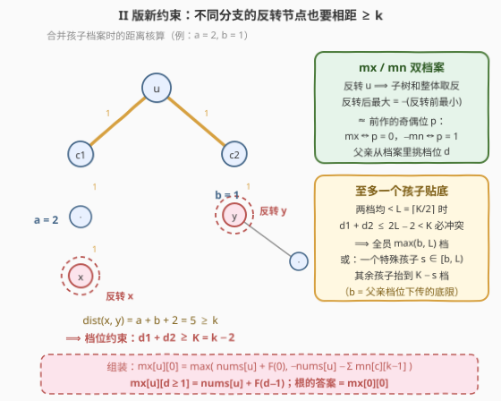
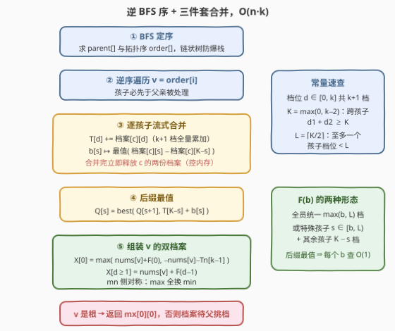

# 子树反转和 II

- **题目名称**：子树反转和 II
- **链接**：[3949. 子树反转和 II](https://leetcode.cn/problems/subtree-inversion-sum-ii/)
- **难度**：困难
- **标签**：树、深度优先搜索、数组、动态规划

## 1. 题目概述

> ⚠️ 本题为 LeetCode 付费题，题意描述根据官方示例用例与 hints 重建，可能与官方题面有出入。题意以免费前作 [3544. 子树反转和](https://leetcode.cn/problems/subtree-inversion-sum/) 为底本：操作定义完全一致，唯一区别在距离限制的适用范围（下文加粗标出），官方 hint「constraint is between any two inverted nodes, including nodes in different child subtrees」明确指向该读法；四个示例的输出为按重建题意推得（已与 $2^n$ 暴力枚举对拍）。

给你一棵以节点 $0$ 为根、包含 $n$ 个节点的无向树，由边数组 `edges` 表示。同时给定整数 $k$ 和长度为 $n$ 的整数数组 `nums`，其中 $\text{nums}[i]$ 是节点 $i$ 的值。

你可以对部分节点执行**反转操作**，需满足：

- **子树反转**：反转一个节点时，以它为根的**整棵子树**中所有节点的值都乘以 $-1$；
- **距离限制**：**任意两个**被反转的节点 $a$、$b$（无论是否互为祖先-后代），它们之间路径上的**边数都必须至少为 $k$**。

返回执行若干次（可以为 0 次）反转后，树上节点值的**最大**可能总和。

**示例 1**：

```text
输入：edges = [[0,1],[0,2],[0,3],[1,4],[1,5]], nums = [1,0,-10,3,4,5], k = 2
输出：23
解释：只反转节点 2（子树内仅它自己，-10 → 10），
     最终 nums = [1,0,10,3,4,5]，总和 23。
```

**示例 2**：

```text
输入：edges = [[0,1],[1,2]], nums = [5,-10,-10], k = 1
输出：25
解释：k = 1 时任意两个不同节点距离都 ≥ 1，约束形同虚设。
     反转节点 1，整棵子树 {1,2} 变号，最终 nums = [5,10,10]，总和 25。
```

**示例 3**：

```text
输入：edges = [[0,1],[0,2]], nums = [1,-5,-6], k = 2
输出：12
解释：节点 1、2 互为兄弟，距离恰为 2 ≥ k，可同时反转，
     最终 nums = [1,5,6]，总和 12。
```

**示例 4**：

```text
输入：edges = [[0,1],[0,2]], nums = [1,-5,-6], k = 3
输出：10
解释：兄弟距离 2 < 3，节点 1、2 不能同时反转；反转单个孩子最多得 2。
     反转根节点 0，整树变号：[-1,5,6]，总和 10。
```

**约束条件**（付费题，未取到官方原文，按官方 hints 的算法结构与前作推断）：

- $2 \le n \le 5 \times 10^4$ 量级，`edges` 构成一棵合法的树；
- $1 \le k \le 50$ 量级（官方 hints 的 DP 以「距离封顶 $k$」为状态维度，$k$ 必为小常数）；
- $-5 \times 10^4 \le \text{nums}[i] \le 5 \times 10^4$，总和可达 $2.5 \times 10^9$，必须用 64 位整数。

> 💡 **读题关键**：与前作逐字比对，唯一改动是距离限制从「祖先 ↔ 后代对」换成「**任意两个**反转节点」。别被字面上的"扩展适用范围"迷惑——这其实是**收紧**了合法解空间：原来兄弟分支之间毫无约束（前作示例 3 里 $k=3$ 仍能同时反转两个距离为 2 的兄弟），现在任何两处反转都要隔 $k$ 条边。前作依赖「兄弟子树独立求解」的 $(奇偶\ p,\ 距离\ d)$ 上下文 DP 在此处**直接失效**：两个孩子内部的反转决策会经由父亲的分叉口互相牵制，这是本题全部难度的来源。

---

## 2. 解题思路

### 2.1 暴力思路：枚举反转集合

沿用前作的出发点：枚举反转集合 $S \subseteq V$ 的所有 $2^n$ 种选择，对每对 $(a,b) \in S$ 验证树上距离 $\ge k$，再自顶向下把 $-1$ 因子推到每个节点求和，$O(2^n \cdot n^2)$。

贪心同样不可行，且比前作**更不可行**：除了「反转会误伤子树里的正值」「祖先的反转改变又封锁后代的选择权」这两条老问题，新约束还追加了第三重耦合——**兄弟分支之间也要互相让位**。看到负值节点想反转时，还得检查它的兄弟分支里是否已经有人"占了位置"。三重耦合叠加，除了 DP 无路可走。

### 2.2 核心观察：$\mathrm{mx}/\mathrm{mn}$ 双档案 + 「至多一个孩子贴底」



前作的 DP 之所以成立，是因为「祖先的影响」可以坍缩成 $(p, d)$ 两个维度传下去，兄弟之间老死不相往来。本题约束跨兄弟后，孩子**不能再独立取各自的最优**——但这不意味着放弃子树分解，而是要换一种「向上汇报」的方式：

**观察一（状态 = 对内的距离下界）**。定义

$$
\mathrm{mx}[u][d] = \text{「子树 } u \text{ 内所有反转节点到 } u \text{ 的距离都} \ge d \text{ 的前提下，子树总和的最大值」}
$$

$\mathrm{mn}[u][d]$ 同理取最小值，$d \in [0, k]$ 封顶。父亲拿到孩子的**档案**（整个 $d \mapsto$ 值 的函数）后自行挑选档位 $d_c$：挑得越低孩子越自由、值越好，但档位之间要满足两组约束（见观察三）。

**观察二（为什么必须同时存 min）**。反转 $u$ 会把 $u$ 子树的**总和整体取反**：

$$
\text{反转后最优} = \max(-S) = -\min(S) = -\Big(\text{nums}[u] + \sum_c \mathrm{mn}[c][\text{档位}]\Big)
$$

所以「想要反转后最大」必须知道「反转前最小」。这正是前作奇偶位 $p$ 的化身：$\mathrm{mx}[u][d]$ 对应 $p=0$ 档的最大值，$-\mathrm{mn}[u][d]$ 对应 $p=1$ 档的最大值——把 $p$ 压进 $(\max, \min)$ 档案对，两种设计等价，但档案版在孩子档位需要被父亲**显式挑选**的本题里写起来更顺。

**观察三（跨孩子约束的代数化）**。孩子 $c_1$ 子树里的反转节点到 $c_1$ 距离 $\ge d_1$、孩子 $c_2$ 里的到 $c_2$ 距离 $\ge d_2$，则两节点间的路径必经 $u$：

$$
\mathrm{dist} \ge d_1 + 1 + 1 + d_2 = d_1 + d_2 + 2 \ge k \iff d_1 + d_2 \ge K,\quad K = \max(0,\, k-2)
$$

于是合并 $u$ 的孩子档案时，约束变成纯粹的**档位之和下限**。而 $u$ 自己反转时（仅允许出现在 $d=0$ 档，因为 $u$ 到自己距离为 0），所有孩子一律被压到 $k-1$ 档（$\mathrm{dist}(u, x) = \text{孩子距离} + 1 \ge k$），此时跨孩子对自动满足 $(k{-}1)+(k{-}1)+2 = 2k \ge k$。

**观察四（至多一个孩子贴底）**。设 $L = \lceil K/2 \rceil$。若两个孩子的档位都低于 $L$，则 $d_1 + d_2 \le 2L - 2 < K$，必然冲突。因此最优分配只有两种形态：

- **全员统一档**：所有孩子取 $\max(b, L)$（$b = \max(0, d-1)$ 是父亲档位 $d$ 下传的最低要求）；
- **一个特殊孩子贴底**：特殊孩子取 $s \in [b, L)$，其余孩子被迫抬到 $K - s$（自动 $\ge L \ge b$）。

特殊孩子换来的好处是 $s < L$ 的低档位，代价是其余孩子整体抬档——两者此消彼长，$s$ 无法凭单调性直接锁定，必须**逐档枚举**。好在可以预处理：设 $T[d] = \sum_c \mathrm{mx}[c][d]$，则

$$
Q(s) = T[K - s] + \max_c \big(\mathrm{mx}[c][s] - \mathrm{mx}[c][K-s]\big)
$$

（哪个孩子当特殊孩子，用「逐孩子维护差值最值」吸收掉），再对 $Q$ 取**后缀最大值**即可 $O(1)$ 回答所有 $b$：

$$
F(b) = \max\Big\{\, T[\max(b, L)],\ \max_{s \in [b,\, L)} Q(s) \,\Big\}
$$

最后组装 $u$ 的档案（$\mathrm{mn}$ 侧全部对称：$T$ 换 $\mathrm{mn}$、$\max$ 换 $\min$、后缀最大换后缀最小）：

$$
\mathrm{mx}[u][0] = \max\Big\{ \text{nums}[u] + F(0),\ -\text{nums}[u] - \sum_c \mathrm{mn}[c][k-1] \Big\}, \qquad
\mathrm{mx}[u][d \ge 1] = \text{nums}[u] + F(d-1)
$$

答案为 $\mathrm{mx}[0][0]$：根没有祖先，无任何距离要求。

### 2.3 算法流程图



实现上的三个工程要点：

- **BFS 序代替递归**：与前作相同，$n = 5 \times 10^4$ 的链会击穿 Python 递归深度。BFS 一次得到 `parent[]` 与拓扑序，**逆序遍历**即为自底向上后序；
- **逐孩子流式合并**：$T$、差值最值 $b[s]$ 都是可增量累加的量，每合并完一个孩子**立即释放**它的两份档案，峰值内存集中在「处理前沿」而非全树；
- **后缀最值一次算好**：$Q(s)$ 的后缀最大/最小值在组装档案前 $O(L)$ 预处理，随后每个 $b \in [0, k-1]$ 都能 $O(1)$ 查询 $F(b)$。

每条边恰好合并一次、每次合并 $O(k + L) = O(k)$，总时间 $O(n \cdot k)$。

### 2.4 示例演算

用**示例 3 与示例 4**（同一棵树、不同 $k$）看新约束如何咬人。树为 `0(1)` 带两个孩子 `1(-5)`、`2(-6)`，两孩子是叶子：

| 项目 | $k = 2$（示例 3） | $k = 3$（示例 4） |
|---|---|---|
| $K = \max(0, k-2)$ | $0$（跨孩子无约束） | $1$ |
| $L = \lceil K/2 \rceil$ | $0$ | $1$ |
| 叶子档案 | $\mathrm{mx}[1][0]=5$（自身可反转） | 同左 |
| 合并 $\{1,2\}$ | 全员 $0$ 档：$5 + 6 = 11$ | 全员 $1$ 档：$-5 + (-6) = -11$；或特殊孩子 $s=0$ 档 + 另一个 $K{-}s=1$ 档：$\max(5 + (-6),\ (-5) + 6) = 1$ |
| 根 $0$ 不反转 | $1 + 11 = \mathbf{12}$ | $1 + 1 = 2$ |
| 根 $0$ 反转 | $-(1 + (-5) + (-6)) = 10$ | $-(1 + (-5) + (-6)) = 10$ |
| 答案 $\mathrm{mx}[0][0]$ | $\max(12, 10) = \mathbf{12}$ ✓ | $\max(2, 10) = \mathbf{10}$ ✓ |

$k=2$ 时兄弟距离 2 恰好达标，双反转吃到 $12$；$k=3$ 时兄弟档位之和 $\le 0 + 0 < K = 1$ 被后缀检查拦下，只能改吃「反转整树」的 $10$。同一棵树、同一个算法，仅因 $K$ 从 0 变 1 而走上完全不同的分支——这正是 II 版约束的杀伤力所在。

---

## 3. 参考代码

### C++

```cpp
class Solution {
  public:
    long long subtreeInversionSum(vector<vector<int>>& edges, vector<int>& nums, int k) {
        int n = nums.size();
        vector<vector<int>> g(n);
        for (auto& e : edges) {
            g[e[0]].push_back(e[1]);
            g[e[1]].push_back(e[0]);
        }
        vector<int> par(n, -1), order;            // BFS：父指针 + 拓扑序
        order.reserve(n);
        par[0] = 0;                               // 防 0 被孩子“重新发现”
        order.push_back(0);
        for (int i = 0; i < n; i++) {
            int v = order[i];
            for (int c : g[v])
                if (par[c] == -1) { par[c] = v; order.push_back(c); }
        }

        const int W = k + 1;                      // 档位 d ∈ [0, k]
        const int K = max(0, k - 2);              // 跨孩子：d1 + d2 ≥ K
        const int L = (K + 1) / 2;                // 至多一个孩子档位 < L
        const long long NEG = LLONG_MIN / 4, POS = LLONG_MAX / 4;
        vector<vector<long long>> mx(n), mn(n);

        for (int i = n - 1; i >= 0; i--) {        // 逆 BFS 序：孩子先于父亲
            int v = order[i];
            vector<long long> Tx(W, 0), Tn(W, 0); // Σ mx[c][d] / Σ mn[c][d]
            vector<long long> bx(L, NEG), bn(L, POS); // 特殊孩子差值最值
            for (int c : g[v]) {
                if (c == par[v]) continue;
                auto &C = mx[c], &D = mn[c];
                for (int d = 0; d < W; d++) { Tx[d] += C[d]; Tn[d] += D[d]; }
                for (int s = 0; s < L; s++) {
                    bx[s] = max(bx[s], C[s] - C[K - s]);
                    bn[s] = min(bn[s], D[s] - D[K - s]);
                }
                vector<long long>().swap(C);      // 合并完立即释放
                vector<long long>().swap(D);
            }
            vector<long long> Qx(L + 1, NEG), Qn(L + 1, POS); // 后缀最值
            for (int s = L - 1; s >= 0; s--) {
                Qx[s] = max(Qx[s + 1], Tx[K - s] + bx[s]);
                Qn[s] = min(Qn[s + 1], Tn[K - s] + bn[s]);
            }
            vector<long long> X(W), N(W);
            long long invx = -((long long)nums[v] + Tn[k - 1]); // 反转 v：
            long long invn = -((long long)nums[v] + Tx[k - 1]); // 孩子一律 k-1 档
            X[0] = max((long long)nums[v] + max(Tx[L], Qx[0]), invx);
            N[0] = min((long long)nums[v] + min(Tn[L], Qn[0]), invn);
            for (int b = 0; b < k; b++) {         // d = b+1：不反转 v
                long long r = Tx[max(b, L)];
                if (b < L) r = max(r, Qx[b]);     // 特殊孩子 s ∈ [b, L)
                X[b + 1] = (long long)nums[v] + r;
                r = Tn[max(b, L)];
                if (b < L) r = min(r, Qn[b]);
                N[b + 1] = (long long)nums[v] + r;
            }
            mx[v] = move(X);
            mn[v] = move(N);
        }
        return mx[0][0];                          // 根：无祖先，无距离要求
    }
};
```

### Python

```python
class Solution:
    def subtreeInversionSum(self, edges: List[List[int]], nums: List[int], k: int) -> int:
        n = len(nums)
        g = [[] for _ in range(n)]
        for u, v in edges:
            g[u].append(v)
            g[v].append(u)

        parent = [-1] * n
        parent[0] = 0                       # 防 0 被孩子“重新发现”
        order = [0]
        for v in order:                     # BFS：父指针 + 拓扑序
            for c in g[v]:
                if parent[c] == -1:
                    parent[c] = v
                    order.append(c)

        W = k + 1                           # 档位 d ∈ [0, k]
        K = max(0, k - 2)                   # 跨孩子：d1 + d2 ≥ K
        L = (K + 1) // 2                    # 至多一个孩子档位 < L
        NEG, POS = float('-inf'), float('inf')

        mx = [None] * n
        mn = [None] * n
        for i in range(n - 1, -1, -1):      # 逆 BFS 序：孩子先于父亲
            v = order[i]
            val = nums[v]
            Tx = [0] * W                    # Σ mx[c][d]
            Tn = [0] * W
            bx = [NEG] * L                  # max_c(mx[c][s] - mx[c][K-s])
            bn = [POS] * L
            for c in g[v]:
                if c == parent[v]:
                    continue
                C, D = mx[c], mn[c]
                mx[c] = mn[c] = None        # 合并完立即释放
                Tx = [a + b for a, b in zip(Tx, C)]
                Tn = [a + b for a, b in zip(Tn, D)]
                if L:
                    diff = [C[s] - C[K - s] for s in range(L)]
                    bx = [x if x > d else d for x, d in zip(bx, diff)]
                    diff = [D[s] - D[K - s] for s in range(L)]
                    bn = [x if x < d else d for x, d in zip(bn, diff)]

            Qx = [NEG] * (L + 1)            # Q 的后缀最大值
            Qn = [POS] * (L + 1)            # Q 的后缀最小值
            for s in range(L - 1, -1, -1):
                qx = Tx[K - s] + bx[s]
                qn = Tn[K - s] + bn[s]
                Qx[s] = qx if qx > Qx[s + 1] else Qx[s + 1]
                Qn[s] = qn if qn < Qn[s + 1] else Qn[s + 1]

            invx = -(val + Tn[k - 1])       # 反转 v：孩子一律 k-1 档
            invn = -(val + Tx[k - 1])
            X = [max(val + max(Tx[L], Qx[0]), invx)]
            N = [min(val + min(Tn[L], Qn[0]), invn)]
            for b in range(k):              # d = b+1：不反转 v
                r = Tx[b if b > L else L]
                if b < L and Qx[b] > r:
                    r = Qx[b]               # 特殊孩子 s ∈ [b, L)
                X.append(val + r)
                r = Tn[b if b > L else L]
                if b < L and Qn[b] < r:
                    r = Qn[b]
                N.append(val + r)
            mx[v], mn[v] = X, N
        return mx[0][0]                     # 根：无祖先，无距离要求
```

> ⚠️ 三个实现细节：① `parent[0] = 0` 而非 $-1$，否则 BFS 会「重新发现」根（与前作同款陷阱）；② `NEG = LLONG_MIN / 4` 而非 `LLONG_MIN`，因为叶子无孩子时 $Q(s)$ 里会出现 `NEG + 0` 的叠加，留出余量防溢出；③ 总和上界 $5 \times 10^4 \times 5 \times 10^4 = 2.5 \times 10^9$，C++ 必须 `long long`。两版代码均与 $n \le 12$ 的 $2^n$ 暴力枚举对拍 3000+ 组随机用例一致；$n = 5 \times 10^4$、$k = 50$ 时 C++ 约 0.07s、Python 约 1.7s（含星形树）。

---

## 4. 复杂度分析

| 维度 | 复杂度 | 说明 |
|------|--------|------|
| 时间 | $O(n \cdot k)$ | 每条边恰合并一次，每次合并遍历 $k + 1$ 档累加 $T$ 与 $L \le (k+1)/2$ 档维护差值最值；后缀最值与组装各 $O(k)$。$n = 5\times10^4$、$k = 50$ 时约 $5 \times 10^6$ 次基本操作 |
| 空间 | $O(n \cdot k)$ 最坏 | 每个存活节点两份 $(k+1)$ 档档案；合并完立即释放，峰值集中在 BFS 逆序的「处理前沿」（星形树达到最坏），实测远小于全量 $2 n k$ |

---

## 5. 扩展：与前作状态设计的对照

把两题的状态摆在一起看，「约束范围」如何决定「状态维度」一目了然：

| | 3544（I） | 3949（II） |
|---|---|---|
| 距离约束范围 | 仅祖先 ↔ 后代对 | 任意两个反转节点 |
| 子树独立性 | 兄弟子树完全独立 | 兄弟档位经父亲耦合 |
| 状态 | $(奇偶\ p,\ 距离\ d)$ 上下文 | $(\max, \min)$ × 距离档位 $d$ 档案 |
| 孩子的用法 | 父亲把上下文 $(p, d)$ **推给**孩子 | 父亲从孩子档案里**挑选**档位 $d_c$ |
| 合并代价 | 直接相加 | 跨孩子档位和 $\ge K$ 的联合优化 |

两处可以再深挖：

- **上下文 vs 档案**是树形 DP 的两大范式：前者把「上方影响」参数化下传（孩子免挑档），后者把「内部承诺」总结上传（父亲来挑档）。约束一旦跨兄弟，「上方影响」无法覆盖兄弟间的相互作用，只能换档案式——这与换根 DP（如 834 题）中「子树答案 + 祖先侧修正」的分解思想同源；
- **「至多一个例外」是距离类约束的通用结构性剪枝**：只要约束形如「两量之和 $\ge$ 阈值」，至多一个分量能低于阈值一半，联合优化就能坍缩成「枚举例外 + 其余统一档位」的线性扫描。同样的套路见于「树上选点两两距离 $\ge k$」等模型的 $O(n \cdot k)$ 解法。

---

## 6. 面试要点

- **Q1：II 与 I 的本质区别是什么？为什么前作的 $(p, d)$ DP 直接搬过来不对？**
  答：距离约束从「祖先 ↔ 后代对」扩到「任意两个反转节点」。前作依赖兄弟子树独立：给定上下文 $(p,d)$ 各孩子独立取最优直接相加。本题两个孩子里的反转节点经父亲分叉口互相牵制（距离 $= d_1 + d_2 + 2$ 必须 $\ge k$），子树答案不能只看上方上下文独立求，必须改为「孩子上报档案、父亲挑档位」的联合优化。
- **Q2：为什么状态要同时存最大值和最小值？**
  答：反转 $u$ 把子树总和整体取反，反转后的最大值 $=$ 反转前最小值的相反数。等价于把前作的奇偶位 $p$ 压进 $(\max, \min)$ 档案对：$\mathrm{mx}$ 是 $p=0$ 档、$-\mathrm{mn}$ 是 $p=1$ 档的最大值。
- **Q3：距离档位 $d$ 为什么可以封顶在 $k$？实际会用到的最高档是多少？**
  答：一切「$\ge k$」的要求在转移中行为一致（是否允许反转、下传后仍 $\ge k$），合并成一档不损失信息。本题实际用到的档位：下传 $\max(0, d-1) \le k-1$、反转时孩子 $k-1$ 档、跨孩子抬档 $K - s \le k-2$——全部 $\le k-1$，开 $k+1$ 档绰绰有余。
- **Q4：多孩子合并为什么要「枚举特殊孩子 + 逐档枚举 $s$」？复杂度如何保证？**
  答：跨孩子约束是档位之和 $\ge K$，两个孩子档位都低于 $L = \lceil K/2 \rceil$ 时和 $\le 2L-2 < K$ 必冲突，故至多一个孩子贴底。特殊孩子的档位 $s$ 与其余孩子的抬档代价此消彼长，不能凭单调性锁定，需逐档枚举；用 $T[d] = \sum_c \mathrm{mx}[c][d]$ 把「哪个孩子特殊」吸收成 $\max_c(\mathrm{mx}[c][s] - \mathrm{mx}[c][K-s])$，再做 $Q(s)$ 的后缀最值，所有 $b$ 的查询降为 $O(1)$，单次合并 $O(k)$。
- **Q5：反转 $u$ 时为什么所有孩子统一取 $k-1$ 档，而不需要再考虑跨孩子约束？**
  答：反转节点 $x$ 在孩子 $c$ 子树内深 $a$ 处，$\mathrm{dist}(u, x) = a + 1 \ge k$ 强制 $a \ge k-1$，即孩子一律 $k-1$ 档（必要条件，无优化损失）。此时任意两个孩子里的反转节点距离 $\ge (k{-}1) + (k{-}1) + 2 = 2k \ge k$，跨孩子约束自动满足，各孩子独立取最小值再整体取反即可。
- **Q6：$n = 5 \times 10^4$ 的链状树和总和溢出怎么处理？**
  答：BFS 显式求拓扑序与父指针，逆序遍历等价于自底向上后序，天然防爆栈；总和可达 $2.5 \times 10^9$，C++ 用 `long long`；合并完的孩子档案立即释放，峰值内存只与处理前沿相关。

---

## 7. 同类练习题

- [3544. 子树反转和](https://leetcode.cn/problems/subtree-inversion-sum/)：本题前作——距离约束只在祖先↔后代对，$(奇偶\ p,\ 距离\ d)$ 上下文 DP 即可，对照理解「约束范围」如何决定「状态范式」
- [337. 打家劫舍 III](https://leetcode.cn/problems/house-robber-iii/)：树形 DP「选/不选」入门，本题 $\mathrm{mx}/\mathrm{mn}$ 双档案的雏形
- [968. 监控二叉树](https://leetcode.cn/problems/binary-tree-cameras/)：多状态树形 DP——孩子的状态组合决定父亲转移，与本题「孩子档位耦合」遥相呼应
- [834. 树中距离之和](https://leetcode.cn/problems/sum-of-distances-in-tree/)：换根 DP——「子树答案 + 祖先侧修正」的分解思想，与档案式上报同源
- [2646. 最小化旅行的价格总和](https://leetcode.cn/problems/minimize-the-total-price-of-the-trips/)：树上带「相邻不能同时选」的决策 DP，距离限制类约束的另一变体
