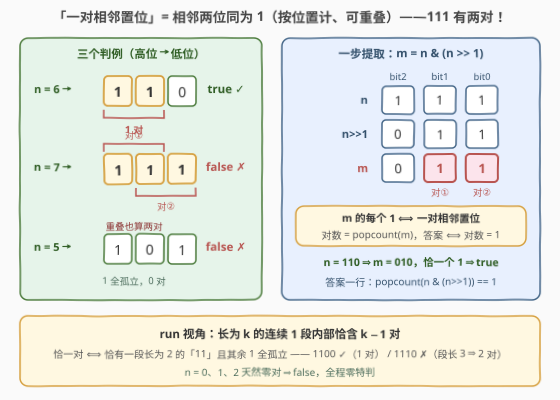
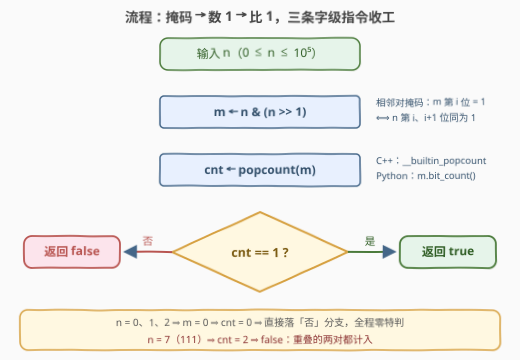

# LeetCode 恰好一对连续置位 题解

## 1. 题目概述

- **标题 / 题号**：恰好一对连续置位（#3950，easy）
- **链接**：https://leetcode.cn/problems/exactly-one-consecutive-set-bits-pair/
- **难度**：简单
- **标签**：位运算

**题意**：给你一个整数 `n`。

如果其二进制表示中**恰好**仅包含**一对相邻的置位**，则返回 `true`；否则返回 `false`。

整数中的**置位**是指其二进制表示中的 `1`。**一对相邻的置位**指某一位与其相邻高位同时为 `1`，即二进制串中出现的子串 `"11"`（按位置计数、**可重叠**）。

**示例 1**：

```text
输入：n = 6
输出：true
解释：6 的二进制表示为 110，恰好存在一对相邻的置位（"11"）。
```

**示例 2**：

```text
输入：n = 5
输出：false
解释：5 的二进制表示为 101，不存在相邻的置位。
```

**约束**：

- $0 \le n \le 10^5$

> 💡 **审题关键**：①「一对」= 一个**位置对** $(i,\,i+1)$，两位同时为 1，按位置计、**可重叠**——$111$ 同时含 $(b_0,b_1)$ 与 $(b_1,b_2)$ **两对**，答案是 `false`，这是本题最大的陷阱；②「恰好」是精确等于 1：零对（$101$）、两对及以上（$111$、$11011$）都判 `false`；③ $n = 0, 1, 2$ 天然零对。

## 2. 解题思路

### 2.1 暴力思路：转二进制串数 "11"

照题面直译：把 $n$ 转成二进制字符串 $b$，一趟扫描统计相邻两位 $b[i], b[i+1]$ 均为 `'1'` 的位置数 `cnt`，返回 `cnt == 1`。正确，$O(\log n)$ 时间。

两个隐蔽弯路：

- **`s.count("11")` 陷阱**：字符串 `count` 是**非重叠**匹配——`"111".count("11")` 只得 1，但 $111$ 实际含 **2 对**（重叠也计入）；`"1111"` 得 2、实际 3 对。重叠计数必须逐位判断；
- **run 误读**：把「一对」理解成「一段连续 1」，认为 $111$ 只有「一段」→ `true`。但题面数的是**位对**不是**段**：长为 $k$ 的连续 1 段内部含 $k-1$ 对，$111$ 是 2 对 → `false`。

### 2.2 核心观察：n & (n >> 1) 一步提取全部相邻对



**观察一（右移对齐 + 按位与 = 相邻对掩码）。** $n \gg 1$ 的第 $i$ 位恰是 $n$ 的第 $i+1$ 位，于是

$$m \;=\; n \,\&\, (n \gg 1)$$

的第 $i$ 位为 1，**当且仅当** $n$ 的第 $i$ 位与第 $i+1$ 位同时为 1——即位置 $i$ 处存在一对相邻置位。每个相邻对恰好对应 $m$ 的一个置位（以较低位编号），**不重不漏**。

**观察二（答案坍缩为一行）。** 相邻对的个数就是 $m$ 的置位个数，于是

$$\text{answer} \;\Longleftrightarrow\; \operatorname{popcount}\bigl(n \,\&\, (n \gg 1)\bigr) \;=\; 1$$

**观察三（run 视角看清「恰好」）。** 把 $n$ 的二进制划分成极大连续 1 段（run），长为 $k$ 的段内部恰含 $k-1$ 对。于是「恰一对」$\Longleftrightarrow$ **恰有一段长为 2 的 `"11"`，且其余 1 全部孤立**：$1100$（12）一段长 2 → 1 对 → `true`；$1110$（14）一段长 3 → 2 对 → `false`；$11011$（27）两段各长 2 → 2 对 → `false`。

### 2.3 算法流程图



| 步骤 | 操作 | 说明 |
|------|------|------|
| ① | `m ← n & (n >> 1)` | 相邻对掩码：`m` 的每个 1 = 一对相邻置位 |
| ② | `cnt ← popcount(m)` | 数出相邻对总数 |
| ③ | `cnt == 1 ?` | 是 → `true`；否（零对或 ≥ 2 对）→ `false` |

### 2.4 示例演算

| $n$ | 二进制 | $m = n \,\&\, (n \gg 1)$ | $\operatorname{popcount}(m)$ | 答案 | 备注 |
|-----|--------|--------------------------|------------------------------|------|------|
| 6 | `110` | `010` | 1 | **true** | 示例 1：恰一段长 2 |
| 5 | `101` | `000` | 0 | **false** | 示例 2：1 全孤立 |
| 7 | `111` | `011` | 2 | **false** | 陷阱：重叠两对 |
| 12 | `1100` | `0100` | 1 | **true** | 段靠高位同样成立 |
| 100000 | `11000011010100000` | `01000001000000000` | 2 | **false** | 两段长 2 ⇒ 2 对，孤立 1 不贡献 |

## 3. 参考代码

### C++

```cpp
class Solution {
  public:
    bool consecutiveSetBits(int n) {
        return __builtin_popcount(n & (n >> 1)) == 1;
    }
};
```

> 💡 **写法要点**：
> - `n >> 1` 右移对齐后按位与，一行得到相邻对掩码；
> - `__builtin_popcount` 在开启 POPCNT 指令集时编译为单条硬件指令，未开启时退化为查表/位折叠，仍是字级 $O(1)$；
> - $n \le 10^5 < 2^{17}$ 落在单个 32 位字内，无溢出、无循环、无特判——$n = 0$ 时 $m = 0$、`popcount = 0`，自然返回 `false`。

### Python

```python
class Solution:
    def consecutiveSetBits(self, n: int) -> bool:
        return (n & (n >> 1)).bit_count() == 1
```

> 💡 **写法要点**：
> - `int.bit_count()` 需 Python 3.10+；更早版本写 `bin(n & (n >> 1)).count('1')`；
> - 想更「模拟」一些可逐位判：`while n >= 3: cnt += (n & 3) == 3; n >>= 1`——`n & 3 == 3` 即低两位同为 1（一对），右移直到不足两位，同样 $O(\log n)$。

## 4. 复杂度分析

| 维度 | 复杂度 | 说明 |
|------|--------|------|
| 时间 | $O(\log n)$（字级 $O(1)$） | 按位严格计需处理 $\lfloor \log_2 n \rfloor + 1 \le 17$ 位；$n < 2^{17}$ 落在单机器字内，移位 + 与 + popcount 共三条字级指令 |
| 空间 | $O(1)$ | 仅常数个中间变量 |
| 下界 | $\Omega(\log n)$（读取位） | 相邻对可能藏在任意相邻两位（含最高两位）之间，未读的位可能翻转答案 ⇒ 单词级操作已最优 |

## 5. 扩展：从判定到家族套路

**恰好 $k$ 对泛化。** 把 `== 1` 换成 `== k` 即可。若再升级为「$[l, r]$ 内恰一对相邻置位的数有几个」：预处理前缀计数 $f(x) = \sum_{v \le x} [\operatorname{popcount}(v \,\&\, (v \gg 1)) = 1]$，查询坍缩为 $f(r) - f(l-1)$，$O(V)$ 预处理 $O(1)$ 单查。

**「无相邻 1」判定与计数。** 同款掩码取等零：$n \,\&\, (n \gg 1) = 0$ ⟺ 无任何相邻置位。[693](https://leetcode.cn/problems/binary-number-with-alternating-bits/) 判「相邻位交替」（无 `11` 也无 `00`：$x = n \oplus (n \gg 1)$ 在有效位内全 1 ⟺ $x \,\&\, (x+1) = 0$）；[600](https://leetcode.cn/problems/non-negative-integers-without-consecutive-ones/) 把「无连续 1」升级成数位 DP 计数，是本题判定版的加强亲戚。

**最长连续 1 段。** 反复执行 $m \,\&= m \gg 1$：每轮每个 run 缩短 1，直到 $m = 0$，轮数即最长 run 长度——$O(\text{最长段长})$ 次字操作，本题域内 ≤ 17 次。

**popcount 的实现谱系。** 无内建函数时：① 循环 `n &= n - 1` 每次消去最低置位，$O(\text{置位数})$；② SWAR 位折叠：`x -= (x >> 1) & 0x5555...` 再逐级 `+` 归并，$O(\log w)$；③ 分字节查 256 表。$n \le 10^5$ 时三者都瞬时完成。

## 6. 面试要点

**Q1：为什么 `n & (n >> 1)` 恰好统计出相邻对总数？**

> `n >> 1` 的第 $i$ 位 = $n$ 的第 $i+1$ 位，按位与后 $m$ 的第 $i$ 位为 1 ⟺ $n$ 的第 $i$、$i+1$ 位同为 1。每个相邻对以较低位编号映射到 $m$ 的恰一个置位，不重不漏，故 $\operatorname{popcount}(m)$ = 相邻对总数。

**Q2：$n = 7$（`111`）应该返回什么？哪里容易翻车？**

> `false`。$111$ 含 $(b_0,b_1)$、$(b_1,b_2)$ 两对**重叠**的相邻对。两个翻车点：`s.count("11")` 非重叠匹配只数出 1 对；按「连续 1 段」数只有一段误判 `true`——长为 $k$ 的段内部有 $k-1$ 对，$k=3$ 时已是 2 对。

**Q3：$n = 0$ 需要特判吗？**

> 不需要。$0 \,\&\, (0 \gg 1) = 0$，`popcount = 0 ≠ 1`，自然返回 `false`；$n = 1, 2$ 同理零对。掩码 + 计数的写法天然覆盖全值域，这是「算出来再比较」优于「找反例」框架的好处。

**Q4：`popcount` 底层怎么实现？没有内建函数怎么办？**

> 现代 CPU 有 POPCNT 单指令，GCC/Clang 的 `__builtin_popcount` 开 `-mpopcnt` 后直接映射；Python 3.10+ 的 `int.bit_count()` 同样高效。手写路线：`n &= n-1` 循环消最低位（$O(\text{置位数})$）、SWAR 位折叠（掩码加减逐级归并，$O(\log w)$）、分字节查表。

**Q5：这题和 191（位 1 的个数）、231（2 的幂）是同一个家族吗？**

> 是，都是「**按位与自掩码 + 与 0/1 比较**」家族：191/231 用 $n \,\&\, (n-1)$ 消最低置位（探「恰一个 1」），本题用 $n \,\&\, (n \gg 1)$ 探「相邻 1 对」，693 用同款掩码判「无相邻 1」——把关心的位模式编进掩码表达式，是位运算判定题的通用套路。

> 💡 **一句话总结**：右移对齐再按位与，把「数重叠的 `"11"` 对」坍缩成「数 1」——`popcount(n & (n >> 1)) == 1`，三条字级指令收工。

## 同类练习题

| # | 题目 | 与本题的关联 |
|---|------|-------------|
| 693 | [交替位二进制数](https://leetcode.cn/problems/binary-number-with-alternating-bits/) | 同款 $n \oplus (n \gg 1)$ 掩码家族——判相邻位是否两两交替（无 `11` 也无 `00`） |
| 600 | [不含连续 1 的非负整数](https://leetcode.cn/problems/non-negative-integers-without-consecutive-ones/) | 把「无相邻 1」判定（$n \,\&\, n \gg 1 = 0$）升级为数位 DP 计数 |
| 2220 | [转换数字的最少位翻转次数](https://leetcode.cn/problems/minimum-bit-flips-to-convert-number/) | $\operatorname{popcount}(n \oplus k)$ 把「数不同位」坍缩成一次异或 + 一次数 1 |
| 191 | [位 1 的个数](https://leetcode.cn/problems/number-of-1-bits/) | popcount 基础原型，$n \,\&\, (n-1)$ 消最低置位 |
| 231 | [2 的幂](https://leetcode.cn/problems/power-of-two/) | $n \,\&\, (n-1) = 0$ 判恰单置位，与本题同款「自掩码 + 计数比较」骨架 |
