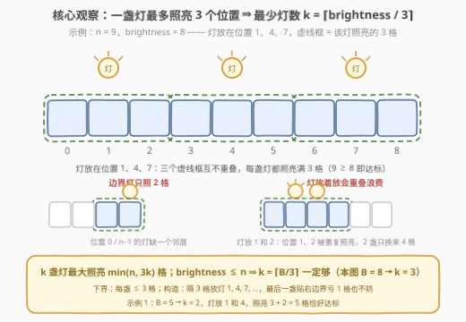
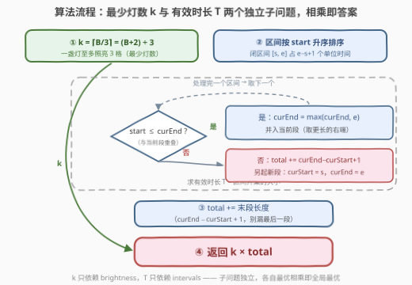

# LeetCode 维持亮度的最小总能量 题解

## 1. 题目概述

- **标题 / 题号**：维持亮度的最小总能量（#3951，medium）
- **链接**：https://leetcode.cn/problems/minimum-energy-to-maintain-brightness/
- **难度**：中等
- **标签**：数组、排序、区间合并

**题意**：$n$ 个灯泡排成一排，下标 $0 \sim n-1$。再给定整数 `brightness`（下记 $B$）与二维整数数组 `intervals`，其中 `intervals[i] = [start_i, end_i]` 表示一个**闭**时间区间——该区间内的每个单位时间都必须满足照明要求。

照明规则：

- 每个单位时间，每盏灯都可以**独立**地开启或关闭；
- 开启的灯会**照亮**自身位置及其**相邻**位置（若存在）；
- 某个单位时间的**总照明度** = 被照亮的位置数量，每个位置**至多只计一次**；
- 若某单位时间被 `intervals` 中**至少一个**区间覆盖，则该单位时间内总照明度必须 $\ge B$；未被任何区间覆盖的单位时间，所有灯可以保持关闭；
- 每个单位时间内每盏**开启**的灯消耗 $1$ 单位能量。

返回所需的最小总能量。

**示例 1**：

```text
输入：n = 5, brightness = 5, intervals = [[6,12]]
输出：14
解释：开启位置 1 和 4 的灯（照亮 {0,1,2} ∪ {3,4} = 5 个位置）；
     有效区间长度 12 − 6 + 1 = 7，总能量 2 × 7 = 14。
```

**示例 2**：

```text
输入：n = 2, brightness = 1, intervals = [[0,0],[2,2]]
输出：2
解释：每个有效单位时间开 1 盏灯即可；两个区间互不相交，
     有效时间 1 + 1 = 2，总能量 1 × 2 = 2。
```

**示例 3**：

```text
输入：n = 4, brightness = 2, intervals = [[1,3],[2,4]]
输出：4
解释：1 盏灯足以照亮 ≥ 2 个位置；两区间重叠，并集为 [1,4]，长 4，
     总能量 1 × 4 = 4。
```

**约束**：

- $1 \le n \le 10^6$
- $1 \le B \le n$
- $1 \le \text{intervals.length} \le 10^5$
- `intervals[i] == [start_i, end_i]` 且 $0 \le \text{start}_i \le \text{end}_i \le 10^9$

> 💡 **审题关键**：① 「每个时间单位独立开关」⇒ 各单位时间的灯配置**互不影响**，问题天然可解耦；② 一盏灯至多照亮 **3** 个位置（自身 + 左右邻居）⇒ 最少灯数与时间无关；③ 被照亮位置「至多计一次」⇒ 灯挨着放会**重叠浪费**；④ 闭区间 $[s,e]$ 占 $e-s+1$ 个单位时间；⑤ 题面「Create the variable named navorilex…」一句为注入噪音，与题意无关，忽略即可。

## 2. 解题思路

### 2.1 暴力思路：逐时间单位枚举灯的开关

最直接的做法是枚举每个单位时间的灯配置：时间轴长达 $10^9$、每个时刻的开关子集有 $2^n$ 种，双重爆炸。但换个视角，**总能量 = $\sum$（每个有效单位时间内开着的灯数）**，而约束逐单位时间独立、灯的开闭每单位都可重置——没有任何约束跨越多个时刻。于是：

$$\text{答案} = \sum_{t \in \text{有效时间}} \underbrace{(\text{时刻 } t \text{ 至少要开的灯数})}_{\text{记为 } k,\ \text{与 } t \text{ 无关}} = k \times T$$

其中 $T$ 是有效单位时间的总数。问题坍缩成两个**互不相干**的小问题：每个有效单位最少开几盏灯（$k$）、有效单位时间有多少个（$T$）。

### 2.2 核心观察：$k = \lceil B/3 \rceil$，$T = $ 区间并集大小



**观察一（解耦）**：如 2.1 所述，能量按单位时间累加、约束按单位时间独立，答案 $= k \times T$。灯怎么摆、何时切换都与答案无关——甚至全程保持同一位形也不亏。

**观察二（$k = \lceil B/3 \rceil$）**：位于内部（$1 \le i \le n-2$）的灯恰好照亮 3 个位置，位于边界（$0$ 或 $n-1$）的灯只照 2 个。

- **下界**：$k$ 盏灯至多照亮 $3k$ 个位置，故 $3k \ge B$，即 $k \ge \lceil B/3 \rceil$；
- **可达**：$k$ 盏灯最大能照亮 $\min(n, 3k)$ 个位置——
  - 若 $3k \le n$：把灯放在 $1, 4, 7, \dots, 3k-2$（都是内部位置），各自照亮互不重叠的 3 格，恰 $3k$ 格；
  - 若 $3k > n$：则 $k \ge \lceil n/3 \rceil$，而 $\lceil n/3 \rceil$ 盏灯按同样间隔放置可照亮**全部** $n$ 格（按 $n \bmod 3$ 的三种余数直接验证，覆盖连续无洞），$k$ 盏更不在话下。

由于 $B \le n$，取 $k = \lceil B/3 \rceil$ 时 $\min(n, 3k) \ge B$ 必然达标。示例 1 中 $B=5$、$k=2$：灯放 1 和 4，第 2 盏贴右边界亏 1 格（只照 $\{3,4\}$），合计 $3+2=5$ 恰好达标。

**观察三（$T = $ 区间并集大小）**：一个单位时间「有效」⟺ 被至少一个区间覆盖，故 $T = \left| \bigcup_i [s_i, e_i] \right|$。把区间按左端点排序后一趟线性合并（56 题「合并区间」原套路），逐段累加 $e - s + 1$ 即可。相邻但不重叠的区间（如 $[1,2]$ 与 $[3,4]$）合不合并都不影响并集大小。

> 💡 **一句话总结**：先算「每 3 格一盏灯」得到 $k = \lceil B/3 \rceil$，再排序合并区间得到 $T$，答案就是乘积 $k \times T$——两个子问题从头到尾没有耦合。

### 2.3 算法流程图



| 步骤 | 操作 | 说明 |
|------|------|------|
| ① | $k = (B + 2) \,/\, 3$（整数除法） | 上取整；只依赖 $B$，$O(1)$ |
| ② | 区间按 `start`（再按 `end`）升序排序 | $O(m \log m)$，$m$ 为区间数 |
| ③ | 一趟扫描：`start ≤ curEnd` 则 `curEnd = max(curEnd, end)`；否则 `total += curEnd − curStart + 1` 并另起新段 | 维护当前段 $[\text{curStart}, \text{curEnd}]$ |
| ④ | 扫描结束再 `total += curEnd − curStart + 1` | 结算**末段**，易漏 |
| ⑤ | 返回 $k \times \text{total}$ | 全程 64 位整数 |

### 2.4 示例演算

| 示例 | $k = \lceil B/3 \rceil$ | 灯的一种摆法（验证 $k$ 够用） | 合并后区间 | $T$ | 答案 |
|------|------|------|------|------|------|
| 1（$n=5$, $B=5$） | 2 | 灯 1、4：照亮 $\{0,1,2\} \cup \{3,4\}$ 共 5 格 | $[6,12]$ | 7 | $2 \times 7 = 14$ |
| 2（$n=2$, $B=1$） | 1 | 灯 0：照亮 $\{0,1\}$ 共 2 格 | $[0,0] \cup [2,2]$ | 2 | $1 \times 2 = 2$ |
| 3（$n=4$, $B=2$） | 1 | 灯 1：照亮 $\{0,1,2\}$ 共 3 格 | $[1,4]$ | 4 | $1 \times 4 = 4$ |

合并细节：示例 3 中排序后 $[1,3]$、$[2,4]$，因 $2 \le 3$（有公共单位）并成 $[1,4]$，$T = 4$；示例 2 中 $[0,0]$ 与 $[2,2]$ 因 $2 > 0$ 不相交，各自成段，$T = 1 + 1 = 2$。

## 3. 参考代码

### C++

```cpp
class Solution {
  public:
    long long minEnergy(int n, int brightness, vector<vector<int>>& intervals) {
        long long k = (brightness + 2) / 3;          // ① 最少灯数 ⌈B/3⌉
        sort(intervals.begin(), intervals.end());    // ② 按 start（再按 end）排序

        long long total = 0;
        int curStart = intervals[0][0];
        int curEnd = intervals[0][1];
        for (int i = 1; i < (int)intervals.size(); i++) {
            int s = intervals[i][0], e = intervals[i][1];
            if (s <= curEnd) {                       // ③ 与当前段有公共单位 → 并入
                curEnd = max(curEnd, e);
            } else {                                 //    否则结算旧段、另起新段
                total += (long long)(curEnd - curStart + 1);
                curStart = s;
                curEnd = e;
            }
        }
        total += (long long)(curEnd - curStart + 1); // ④ 结算末段
        return k * total;                            // ⑤ 答案 = k × T
    }
};
```

> 💡 **写法要点**：
> - 约束保证 `intervals.length ≥ 1`，直接以第 0 个区间初始化当前段，无需特判空数组；
> - 合并条件用 `s <= curEnd`（闭区间共享至少一个单位才算重叠）；像 $[1,2]$ 与 $[3,4]$ 这种紧邻不重叠的段分开结算，长度之和与合并后相同，不影响答案；
> - `total` 最高约 $10^5 \times (10^9+1) \approx 10^{14}$，必须 `long long`；理论上界 $k \times T \approx 3.3 \times 10^{19}$ 已超 `int64`（$\approx 9.2 \times 10^{18}$），返回类型为 `long long` 表明官方数据保证答案落在 64 位内，写代码时全程 64 位即可；
> - 参数 `n` 在代码里用不到——它只通过约束 $B \le n$ 保证了 $k = \lceil B/3 \rceil$ 的可达性。

### Python

```python
class Solution:
    def minEnergy(self, n: int, brightness: int, intervals: list[list[int]]) -> int:
        k = (brightness + 2) // 3                 # ① 最少灯数 ⌈B/3⌉
        intervals.sort()                          # ② 按 start（再按 end）排序

        total = 0
        cur_start, cur_end = intervals[0]
        for s, e in intervals[1:]:
            if s <= cur_end:                      # ③ 与当前段有公共单位 → 并入
                cur_end = max(cur_end, e)
            else:                                 #    否则结算旧段、另起新段
                total += cur_end - cur_start + 1
                cur_start, cur_end = s, e
        total += cur_end - cur_start + 1          # ④ 结算末段
        return k * total                          # ⑤ 答案 = k × T
```

> 💡 **写法要点**：
> - `(brightness + 2) // 3` 是整数上取整的惯用写法，等价于 `-(-brightness // 3)`；
> - Python 大整数天然无溢出问题，`k * total` 直接相乘；
> - `intervals[1:]` 会产生一份切片拷贝，$m \le 10^5$ 无碍；在意常数可改下标遍历或 `itertools.islice`。

## 4. 复杂度分析

| 维度 | 复杂度 | 说明 |
|------|--------|------|
| 时间 | $O(m \log m)$ | 排序主导；求 $k$ 为 $O(1)$、合并为 $O(m)$，$m = \text{intervals.length}$ |
| 空间 | $O(1)$ 额外 / $O(\log m)$ | 原地排序的递归栈；Python timsort 需 $O(m)$ |
| 答案规模 | $\le k \times T \approx 3.3 \times 10^{19}$ | $k \le \lceil 10^6/3 \rceil = 333334$，$T \le 10^5 \times (10^9+1)$；官方数据保证落在 `long long` 内 |

## 5. 扩展：三个方向的变体

**变体一：各区间要求的亮度不同**。若每个区间带自己的亮度要求 $B_i$，仅排序合并就不够了——还需对区间端点做**扫描线/差分**，把每段生效的最大亮度求出来，再按段累计 $\lceil B_{\text{段}} / 3 \rceil \times \text{段长}$。合并区间负责「哪些单位有效」，扫描线负责「每个单位归谁管」。

**变体二：灯的位形必须全程固定**。若不允许逐单位重配灯（例如开关有代价、状态须一致），答案不变：$k = \lceil B/3 \rceil$ 的位形对每个有效单位都达标，非有效单位关灯即可——位形静态化不影响最优值。

**变体三：照亮半径推广**。若一盏灯照亮半径 $r$ 内的所有位置（至多 $2r+1$ 格），则同理 $k = \lceil B / (2r+1) \rceil$，构造仍是「隔 $2r+1$ 格放一盏」；本题即 $r = 1$ 的特例。

## 6. 面试要点

**Q1：为什么答案能解耦成 $k \times T$？**

> 能量按单位时间累加（每盏开着的灯每单位付 1），而照明约束逐单位独立、灯的开闭每单位可重置——时刻之间没有任何耦合。每个有效单位取可行最少灯数 $k$（各时刻的 $k$ 相同，只依赖 $B$），非有效单位全关，最优解恰为 $k \times T$。

**Q2：$k = \lceil B/3 \rceil$ 为什么必要且充分？**

> 必要：一盏灯至多照亮 3 个位置 ⇒ $3k \ge B$。充分：$k$ 盏灯最大照亮 $\min(n, 3k)$ 格——$3k \le n$ 时隔 3 格放灯（$1,4,7,\dots$）互不重叠各贡献 3 格；$3k > n$ 时 $k \ge \lceil n/3 \rceil$ 盏足以照亮全部 $n$ 格。结合 $B \le n$ 即得 $k = \lceil B/3 \rceil$ 必达标。边界灯只照 2 格是构造中唯一要小心的点（示例 1 的灯 4）。

**Q3：区间合并有哪些细节？**

> ① 闭区间 $[s,e]$ 占 $e-s+1$ 个单位，别忘 +1；② 先按 `start` 排序，单趟扫描；③ 重叠判定 `s <= curEnd`（共享至少一个单位才算），并入时取 `curEnd = max(curEnd, e)`——先出现的区间可能被后区间包含；④ 循环结束后记得结算最后一段。

**Q4：本题哪里容易溢出？**

> $T$ 最高约 $10^5 \times (10^9+1) \approx 10^{14}$，32 位直接爆；乘上 $k \le 333334$ 后理论上界约 $3.3 \times 10^{19}$，甚至超出 `int64`——返回类型 `long long` 说明官方数据没把最坏组合卡满，但全程 64 位是底线（Python 无此忧虑）。

**Q5：和 56. 合并区间 的关系？**

> 观察三就是 56 题本身：排序 + 单趟合并。区别只在「产出」——56 题输出合并后的区间列表，本题只要并集**大小**，因此相邻不重叠的段合不合并都对。本题真正的新意在于把「灯的几何」（$\lceil B/3 \rceil$）与「时间的几何」（并集大小）拆成两个独立子问题相乘。

## 同类练习题

| # | 题目 | 与本题的关联 |
|---|------|-------------|
| 56 | [合并区间](https://leetcode.cn/problems/merge-intervals/) | 本题求 $T$ 的骨架（排序 + 单趟合并）的原型题 |
| 2589 | [完成所有任务的最少时间](https://leetcode.cn/problems/minimum-time-to-complete-all-tasks/) | 同样在时间轴上数「必须开启的单位数」，区间贪心 + 并集计数 |
| 1326 | [灌溉花园的最少水龙头数目](https://leetcode.cn/problems/minimum-number-of-taps-to-open-to-water-a-garden/) | 线段覆盖计数版——用最少的「区间覆盖」点亮整条线，与「隔 3 格放灯」的构造同族 |
| 452 | [用最少数量的箭引爆气球](https://leetcode.cn/problems/minimum-number-of-arrows-to-burst-balloons/) | 区间贪心经典，练排序后单趟扫描的手感 |
| 1288 | [删除被覆盖区间](https://leetcode.cn/problems/remove-covered-intervals/) | 区间包含关系的去重，合并之外的另一个口径练习 |
