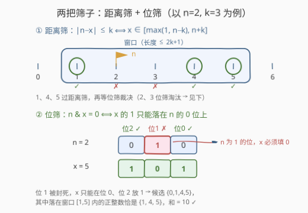
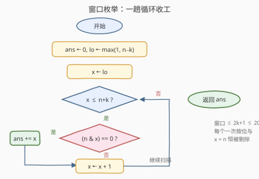

# 区间内的兼容数字之和 I

- **题目名称**：区间内的兼容数字之和 I
- **链接**：[3954. Sum of Compatible Numbers in Range I](https://leetcode.cn/problems/sum-of-compatible-numbers-in-range-i/)
- **难度**：简单
- **标签**：位运算、枚举

## 1. 题目概述

给你两个整数 `n` 和 `k`。

如果一个**正**整数 `x` 同时满足以下两个条件，则称其为**兼容**整数：

- $\operatorname{abs}(n - x) \le k$
- $(n \,\&\, x) = 0$

返回所有**兼容**整数 `x` 的总和。

**注意**：`&` 表示**按位与**运算符；整数 $i, j$ 之间的绝对差定义为 $\operatorname{abs}(i - j)$。

**示例 1**：

```text
输入：n = 2, k = 3
输出：10
解释：兼容整数为 x = 1（|2-1|=1 且 2&1=0）、x = 4（|2-4|=2 且 2&4=0）、x = 5（|2-5|=3 且 2&5=0），
和为 1 + 4 + 5 = 10。
```

**示例 2**：

```text
输入：n = 5, k = 1
输出：0
解释：区间 [4, 6] 中没有兼容整数，答案为 0。
```

**约束条件**：

- $1 \le n \le 100$
- $1 \le k \le 100$

> 💡 **审题关键**：① 两个条件**独立串联**——距离条件把候选压进一条短窗口，位条件再逐个筛；② `x` 必须是**正整数**，窗口下界要取 $\max(1,\, n-k)$（$n=1,k=3$ 时 $n-k=-2$）；③ $x = n$ 永不兼容：$n \,\&\, n = n \ne 0$。

---

## 2. 解题思路

### 2.1 暴力思路：全值域扫描

照题面直译：从 $x = 1$ 起逐个正整数检查两个条件，直到距离条件必然失败为止，$O(n+k)$。正确但浪费——距离条件 $\operatorname{abs}(n-x) \le k$ 本身就是一张**精确地图**：满足它的 $x$ 恰好构成窗口

$$n - k \;\le\; x \;\le\; n + k$$

再叠加「正整数」修正下界，候选仅剩 $[\max(1, n-k),\, n+k]$ 内的 $\le 2k+1 \le 201$ 个数，每个用一次 `&` 判定即可——一趟窗口枚举就是本题的最优解形态。

### 2.2 核心观察：两把筛子——短窗口 + 位互补



**观察一（距离筛 = 长度 $2k+1$ 的窗口）。** $\operatorname{abs}(n - x) \le k$ 等价于 $x \in [\max(1,\, n-k),\, n+k]$。本题域内窗口至多 $201$ 个候选，且 $n \le 100,\ k \le 100 \Rightarrow x \le 200 < 2^8$，位宽极小。

**观察二（位筛 = $x$ 的每个 1 都须落在 $n$ 的 0 位上）。** $n \,\&\, x = 0$ 意味着**任何一位上两者不能同时为 1**：$n$ 为 1 的位，$x$ 必须填 0；$x$ 的 1 只能安放在 $n$ 的 0 位里。以 $n = 2 = (010)_2$ 为例：位 1 被封死，$x$ 只能在位 0、位 2 放 1——候选 ${000, 001, 100, 101} = {0, 1, 4, 5}$，其中正整数且落在窗口 $[1,5]$ 内的恰是 $1, 4, 5$，与示例 1 吻合。换种说法：**$x$ 是 $\sim n$（限制在 $n+k$ 的位宽内）的子集**。

**观察三（两把筛子独立、次序可换）。** 距离筛给**连续短区间**（$2k+1$ 个），位筛给**稀疏子集族**（$\sim n$ 的子集，$2^z$ 个，$z$ 为 $n$ 的零位数）。本题域窗口更短，先窗口后位筛是自然写法；值域放大后哪边稀疏走哪边（见第 5 节）。

### 2.3 算法流程图



| 步骤 | 操作 | 说明 |
|------|------|------|
| ① | `lo ← max(1, n - k)` | 窗口下界：正整数修正 |
| ② | `x` 从 `lo` 遍历到 `n + k` | 距离筛：$\le 2k+1$ 个候选 |
| ③ | `n & x == 0 ?` | 位筛：一次按位与判零 |
| ④ | 兼容则 `ans += x` | 累加所有兼容整数 |

### 2.4 示例演算

**示例 1（$n = 2 = (010)_2,\ k = 3$）**：窗口 $[\max(1,-1),\, 5] = [1, 5]$。

| $x$ | 二进制 | $n \,\&\, x$ | 位筛 | 贡献 |
|-----|--------|--------------|------|------|
| 1 | `001` | `000` | ✓ | +1 |
| 2 | `010` | `010` | ✗（$x=n$ 恒败） | — |
| 3 | `011` | `010` | ✗ | — |
| 4 | `100` | `000` | ✓ | +4 |
| 5 | `101` | `000` | ✓ | +5 |

答案 $1 + 4 + 5 = 10$。

**示例 2（$n = 5 = (101)_2,\ k = 1$）**：窗口 $[4, 6]$。$4=(100)$：位 2 撞 $n$ 的 1 → 败；$5=(101)$：$x=n$ → 败；$6=(110)$：位 2 撞 1 → 败。答案 $0$——窗口非空也可能全灭。

---

## 3. 参考代码

### C++

```cpp
class Solution {
  public:
    int sumOfGoodIntegers(int n, int k) {
        int ans = 0;
        for (int x = max(1, n - k); x <= n + k; ++x)
            if ((n & x) == 0) ans += x;
        return ans;
    }
};
```

> 💡 **写法要点**：
> - `max(1, n - k)` 一步完成「窗口 + 正整数」双下界，上界 $n+k$ 天然为正；
> - 最坏 $n = k = 100$：窗口 $[1, 200]$，兼容和 $\le 1 + 2 + \cdots + 200 = 20100$，`int` 毫无溢出风险；
> - 判定 `(n & x) == 0` 注意运算符优先级——`&` 低于 `==`，**必须加括号**。

### Python

```python
class Solution:
    def sumOfGoodIntegers(self, n: int, k: int) -> int:
        return sum(x for x in range(max(1, n - k), n + k + 1) if n & x == 0)
```

> 💡 **写法要点**：
> - `range` 右端点开区间，记得 `n + k + 1`；
> - 生成器一行完成「枚举 + 筛选 + 求和」，语义与题面逐条对应。

---

## 4. 复杂度分析

| 维度 | 复杂度 | 说明 |
|------|--------|------|
| 时间 | $O(k)$ | 枚举窗口内 $\le 2k+1 \le 201$ 个候选，每个一次按位与 + 比较 |
| 空间 | $O(1)$ | 仅常数个中间变量 |
| 值域备注 | $x \le 200 < 2^8$ | 单字节位宽内完成判定，无大数、无移位循环 |

---

## 5. 扩展：换稀疏的一边枚举——子集视角与数位 DP

**子集枚举（Gosper 技巧）。** 由观察二，兼容 $x$ 恰是 $u = \sim n \,\&\, \bigl(2^{w} - 1\bigr)$ 的子集（$w$ 取 $n+k$ 的位宽）。枚举一个掩码的全部非空子集只需：

```cpp
for (int s = u; s; s = (s - 1) & u) {
    // s 满足 n & s == 0，再判 s ∈ [max(1, n-k), n+k] 即可
}
```

子集数 $2^z - 1$（$z$ 为 $u$ 的置位数）。当窗口极长而 $n$ 的 1 很密集时（如 $n = 2^{30} - 1$），子集路线远快于窗口路线——**两把筛子谁稀疏走谁**。

**全部子集和的封闭公式。** $u$ 的每个 1 位在恰好 $2^{z-1}$ 个子集中出现，故全体子集之和 $= 2^{z-1} \cdot u$（$u \ne 0$）。本题还需窗口过滤，用不上；但它提示了进阶方向。

**大值域版本（II 方向：$n, k \to 10^{18}$）。** 窗口枚举与子集枚举双双爆炸，官方标签中的**数位 DP** 登场：从高位到低位逐位决策「该位填 0 还是 1（只能填在 $n$ 的 0 位上）」，同时维护与窗口上/下界的贴边（tight）状态，按位贡献 $\text{位值} \times \text{方案数}$ 求和——把「子集族 ∩ 区间」的计数与求和压到 $O(\log(n+k) \times \text{状态数})$。

---

## 6. 面试要点

**Q1：为什么 $x = n$ 永远不兼容？**

> $n \,\&\, n = n$，而 $n \ge 1 \ne 0$，位条件必败。推论：答案集合永远不含 $n$ 本身，窗口中点必被剔除。

**Q2：窗口下界为什么是 $\max(1, n-k)$ 而不是 $n-k$？**

> $x$ 必须是**正整数**。$n - k$ 可能为 0 或负（如 $n=1, k=3$ 时为 $-2$），直接从它枚举会引入非正数甚至死循环风险（若用 `unsigned` 更会绕成极大值）。

**Q3：`(n & x) == 0` 不加括号会怎样？**

> C/C++/Java 中 `==` 优先级高于 `&`，`n & x == 0` 被解析为 `n & (x == 0)`，类型/语义全错且**编译器只给 warning 不报错**，是位运算代码的经典暗坑；Python 中 `&` 又高于 `==`，两边规则还不同——一律显式加括号。

**Q4：本题需要担心溢出吗？换更大参数呢？**

> 不需要：最坏 $n = k = 100$ 时和 $\le 20100$，`int` 充裕。若 $k$ 放大到 $10^9$（和需 `long long`）、$10^{18}$（枚举本身不可行），依次升级为 `long long` 累加与第 5 节的子集枚举 / 数位 DP。

**Q5：两个筛选条件的检验次序重要吗？**

> 正确性上不重要（逻辑与可交换），性能上**先廉价且淘汰力强的**：距离筛只是整数比较、还能直接收缩枚举范围，故把窗口作为外层循环骨架；位筛放循环体内做单点判定。值域放大后若 $\sim n$ 的子集更稀疏，则反转次序走子集枚举。

> 💡 **一句话总结**：距离条件划定 $[\max(1, n-k),\, n+k]$ 的短窗口，位条件 `n & x == 0` 逐个判零——至多 201 次按位与，一趟循环收工。

---

## 7. 同类练习题

- [201. 数字范围按位与](https://leetcode.cn/problems/bitwise-and-of-numbers-range/)：同样「区间 × 位运算」，用公共前缀技巧把区间 AND 压成两次对齐移位
- [982. 按位与为零的三元组](https://leetcode.cn/problems/triples-with-bitwise-and-equal-to-zero/)：AND 为 0 即子集关系，子集和（SOS）DP 计数，是本题位筛的规模化亲戚
- [600. 不含连续 1 的非负整数](https://leetcode.cn/problems/non-negative-integers-without-consecutive-ones/)：区间内满足位条件的计数，数位 DP 入门——II 版本的进阶方向
- [693. 交替位二进制数](https://leetcode.cn/problems/binary-number-with-alternating-bits/)：单值位条件判定，$n \oplus (n \gg 1)$ 掩码家族
