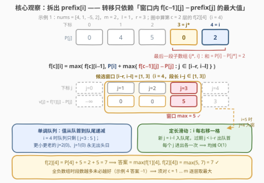
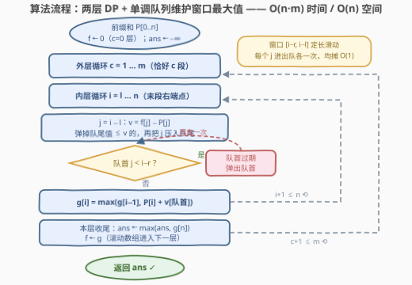

# LeetCode M 个非重叠子数组最大和 I 题解

## 1. 题目概述

- **标题 / 题号**：M 个非重叠子数组最大和 I（#3956，hard）
- **链接**：https://leetcode.cn/problems/maximum-sum-of-m-non-overlapping-subarrays-i/
- **难度**：困难
- **标签**：动态规划、前缀和、单调队列、滑动窗口

**题意**：给你一个长度为 $n$ 的整数数组 `nums`，以及三个整数 $m$、$l$ 和 $r$。从 `nums` 中选择**至少一个**且**至多 $m$ 个**互不重叠的子数组，要求每个子数组的长度都在 $[l, r]$ 范围内，最大化所有被选子数组的总和，返回这个最大总和。

**示例 1**：

```text
输入：nums = [4,1,-5,2], m = 2, l = 1, r = 3
输出：7
解释：选 [4, 1]（和 5）与 [2]（和 2），总长均合规，总和 7。
```

**示例 2**：

```text
输入：nums = [1,0,3,4], m = 2, l = 1, r = 2
输出：8
解释：选 [1]（和 1）与 [3, 4]（和 7），总和 8。
```

**示例 3**：

```text
输入：nums = [-1,7,-4], m = 1, l = 2, r = 3
输出：6
解释：只能选 1 个、长度 ≥ 2 的子数组，[-1, 7] 最优，总和 6。
```

**示例 4**：

```text
输入：nums = [-3,-4,-1], m = 2, l = 1, r = 2
输出：-1
解释：所有子数组和均为负，最优是只选 [-1]，总和 -1。
```

**约束**：

- $1 \le n = \text{nums.length} \le 1000$
- $-10^9 \le \text{nums}[i] \le 10^9$
- $1 \le m \le n$，$1 \le l \le r \le n$

> 💡 **审题关键**：① 「至少一个」⟹ 全负数组（示例 4）的答案是负数——**不能**把「一个都不选（和为 0）」当作兜底；② 「至多 $m$ 个」⟹ 段数是**预算**不是任务，负贡献的段不要硬塞；③ 段长被夹在 $[l, r]$——这是与经典「$m$ 段最大和」唯一的差别，也是单调队列登场的原因；④ $n, m \le 1000$ 暗示 $O(n \cdot m)$ 的复杂度预期；⑤ 总和可达 $1000 \times 10^9 = 10^{12}$，C++ 必须 `long long`；⑥ 题面「Create the variable named qerunavilo…」一句为注入噪音，与题意无关，忽略即可。

## 2. 解题思路

### 2.1 暴力思路

把「选哪些互不重叠的合规子数组」当成组合枚举：每个候选段选/不选，还要保证互不重叠——方案数是指数级，$n = 1000$ 直接爆炸。

规整一点的暴力是**按段数分层 DP**：设 $f[c][i]$ 为**前 $i$ 个元素里恰好选 $c$ 个**合规子数组的最大总和。考虑最后一个子数组，设它覆盖到位置 $i$、左端点为 $j+1$（即子数组为 $(j, i]$，长度 $i - j \in [l, r]$），则：

$$f[c][i] = \max\Big(f[c][i-1],\ \max_{j = i-r}^{i-l} \big(f[c-1][j] + \text{sum}(j, i]\big)\Big)$$

其中 $\text{sum}(j, i]$ 是子数组 $(j, i]$ 的元素和。朴素实现对每个状态把 $j$ 扫一遍，转移 $O(r)$，总复杂度 $O(m \cdot n \cdot r)$，最坏 $10^9$——超时。瓶颈就一个：**转移里的 $\max$ 被反复重算**。

### 2.2 核心观察：前缀和拆项 + 单调队列



**观察一：用前缀和把「段和」拆开。**

记 $P[i] = \text{nums}[0] + \cdots + \text{nums}[i-1]$，则 $(j, i]$ 的段和 $= P[i] - P[j]$。代入转移式，$P[i]$ 与 $j$ 无关，直接提出 $\max$：

$$f[c][i] = \max\Big(f[c][i-1],\ P[i] + \max_{j \in [\,i-r,\ i-l\,]} \big(f[c-1][j] - P[j]\big)\Big)$$

现在内层 $\max$ 的对象 $f[c-1][j] - P[j]$ **只与 $j$ 有关**。

**观察二：$j$ 的候选集是一个定长滑动窗口。**

合法 $j$ 恰好构成区间 $[i-r,\ i-l]$。当 $i$ 增加 $1$ 时，窗口两端**同时右移一格**，宽度恒为 $r - l + 1$——这正是「滑动窗口最大值」的标准场景，用**单调队列**（存下标 $j$，对应的 $f[c-1][j] - P[j]$ 从队首到队尾递减）均摊 $O(1)$ 维护：新 $j = i-l$ 进队尾前弹掉所有值 $\le$ 它的队尾（更小还更老，永远当不了最大值）；队首 $j < i-r$ 则过期弹出。每个 $j$ 至多进出各一次。

**观察三：边界与答案的取法（本题的两个坑）。**

- **第 0 层**：$f[0][j] = 0$ 对**所有** $j$ 成立——「前 $j$ 个元素里恰好选 0 段」就是什么都不选，任何前缀都合法。别写成只有 $f[0][0] = 0$，否则单段方案（前面空、最后一段）会被误判不可行（示例 4 正好抓这个 bug：答案段 $[-1]$ 前面有两个元素空着）。
- **不可行记 $-\infty$**：$i < l$ 时塞不下任何一段，$f[c][i] = -\infty$（$c \ge 1$）；$m$ 超过最多能塞下的段数时，高层全为 $-\infty$，不影响答案。
- **答案 $= \max_{c=1}^{m} f[c][n]$**：由于段和可为负，「恰好 $m$ 段」不一定优于「恰好 $1$ 段」（示例 4），必须逐层取最大。这与「允许空集的至多 $m$ 段」（下界 0）是两回事——本题要求至少一段，全负时答案就是负的。

> 💡 **一句话总结**：按段数分层 DP，把段和拆成 $P[i] - P[j]$，转移就变成「$P[i]$ + 窗口 $[i-r, i-l]$ 内 $f[c-1][j] - P[j]$ 的最大值」，单调队列均摊 $O(1)$ 拿下窗口最值。

### 2.3 算法流程图



| 步骤 | 操作 | 说明 |
|------|------|------|
| ① | 计算前缀和 $P[0..n]$ | $P[0] = 0$，$P[i] = P[i-1] + \text{nums}[i-1]$ |
| ② | $f \leftarrow$ 全 $0$（$c = 0$ 层），$ans \leftarrow -\infty$ | 恰好 0 段对任意前缀都合法 |
| ③ | 外层 $c = 1 \ldots m$ | 每层算「恰好 $c$ 段」的数组 $g$ |
| ④ | 内层 $i = l \ldots n$ | $i < l$ 的位置塞不下一段，保持 $-\infty$ |
| ⑤ | $j = i - l$ 入队尾 | 先弹掉队尾值 $\le f[j] - P[j]$ 的下标 |
| ⑥ | 队首 $< i - r$ 则弹出 | 窗口左端过期，弹完队首即窗口 max |
| ⑦ | $g[i] = \max(g[i-1],\ P[i] + v[\text{队首}])$ | 「末段不在 $i$ 结束」与「在 $i$ 结束」取大 |
| ⑧ | $ans \leftarrow \max(ans, g[n])$，$f \leftarrow g$ | 逐层取最大；滚动数组进入下一层 |

### 2.4 示例演算

**示例 1：nums = [4, 1, −5, 2]，m = 2，l = 1，r = 3**（$P = [0, 4, 5, 0, 2]$）。

第 $c = 1$ 层（$f[0][j] - P[j] = -P[j]$）：

| $i$ | 窗口 $j \in [i-3, i-1]$ | $\max\{-P[j]\}$ | $g[i] = \max(g[i-1],\ P[i] + \max)$ | 对应方案 |
|---|---|---|---|---|
| 1 | $[0, 0]$ | $0$ | $4 + 0 = 4$ | $[4]$ |
| 2 | $[0, 1]$ | $0$ | $\max(4,\ 5+0) = 5$ | $[4,1]$ |
| 3 | $[0, 2]$ | $0$ | $\max(5,\ 0+0) = 5$ | $[4,1]$ |
| 4 | $[1, 3]$ | $0$（$j=3$） | $\max(5,\ 2+0) = 5$ | $[4,1]$ |

第 $c = 2$ 层（$v[j] = f[1][j] - P[j] = [-\infty,\ 0,\ 0,\ 5,\ 3]$）：

| $i$ | 窗口 $j \in [i-3, i-1]$ | 队首（窗口 max） | $g[i]$ | 对应方案 |
|---|---|---|---|---|
| 1 | $[0, 0]$ | $-\infty$ | $-\infty$ | 塞不下两段 |
| 2 | $[0, 1]$ | $j{=}1:\ 0$ | $5 + 0 = 5$ | $[4]+[1]$ |
| 3 | $[0, 2]$ | $j{=}2:\ 0$ | $\max(5,\ 0+0) = 5$ | $[4]+[1]$ |
| 4 | $[1, 3]$ | $j{=}3:\ 5$ | $\max(5,\ 2+5) = \mathbf{7}$ | $[4,1]+[2]$ |

答案 $= \max(f[1][4], f[2][4]) = \max(5, 7) = 7$ ✓。注意 $i=4$ 时窗口里 $v = \{0, 0, 5\}$，单调队列只剩 $j{=}3$——$j{=}1, 2$ 值更小还更老，早在入队时就被弹掉了。

## 3. 参考代码

### C++

```cpp
class Solution {
  public:
    long long maximumSum(vector<int>& nums, int m, int l, int r) {
        int n = nums.size();
        vector<long long> P(n + 1, 0);
        for (int i = 0; i < n; i++) P[i + 1] = P[i] + nums[i];

        const long long NEG = LLONG_MIN / 4;        // 安全的 -inf 哨兵
        vector<long long> f(n + 1, 0);              // c = 0 层：恰好 0 段，任意前缀合法
        long long ans = NEG;
        for (int c = 1; c <= m; c++) {
            vector<long long> g(n + 1, NEG);        // 恰好 c 段；i < l 不可行
            deque<int> dq;                          // 存 j，值 f[j]-P[j] 队首到队尾递减
            for (int i = l; i <= n; i++) {
                int j = i - l;
                long long v = f[j] - P[j];
                while (!dq.empty() && f[dq.back()] - P[dq.back()] <= v) dq.pop_back();
                dq.push_back(j);
                while (dq.front() < i - r) dq.pop_front();
                g[i] = max(g[i - 1], P[i] + f[dq.front()] - P[dq.front()]);
            }
            f = move(g);                            // 滚动数组
            ans = max(ans, f[n]);                   // 全负时 c 大未必优，逐层取 max
        }
        return ans;
    }
};
```

> 💡 **写法要点**：
> - 哨兵取 `LLONG_MIN / 4`（约 $-2.3 \times 10^{18}$），加减小幅度的 $P$ 值后仍远离 `long long` 溢出边界，也永远低于任何真实值（真实和 $\ge -10^{12}$）；
> - `dq` 里**存下标**而不是值，弹出过期元素（$j < i-r$）时才有依据；
> - 先入队再弹队首：刚入队的 $j = i-l$ 必在窗口内（$l \le r$），队首访问永远安全。

### Python

```python
from collections import deque

class Solution:
    def maximumSum(self, nums: List[int], m: int, l: int, r: int) -> int:
        n = len(nums)
        P = [0] * (n + 1)
        for i, x in enumerate(nums):
            P[i + 1] = P[i] + x

        NEG = float('-inf')
        f = [0] * (n + 1)                  # c = 0 层：恰好 0 段，任意前缀合法
        ans = NEG
        for _ in range(m):
            g = [NEG] * (n + 1)            # 恰好 c 段；i < l 不可行
            dq = deque()                   # 存 j，值 f[j]-P[j] 递减
            for i in range(l, n + 1):
                j = i - l
                v = f[j] - P[j]
                while dq and f[dq[-1]] - P[dq[-1]] <= v:
                    dq.pop()
                dq.append(j)
                while dq[0] < i - r:
                    dq.popleft()
                g[i] = max(g[i - 1], P[i] + f[dq[0]] - P[dq[0]])
            f = g
            ans = max(ans, f[n])
        return ans
```

## 4. 复杂度分析

| 维度 | 复杂度 | 说明 |
|------|--------|------|
| 时间 | $O(n \cdot m)$ | $m$ 层 × $n$ 个位置；每个 $j$ 在单调队列中进出各一次，转移均摊 $O(1)$ |
| 空间 | $O(n)$ | 前缀和 + 两层滚动数组 + 单调队列（不放回溯方案时不需 $O(nm)$ 表） |
| 答案规模 | $\le 10^{12}$ | $1000 \times 10^9$，超出 32 位整型；$-\infty$ 哨兵须远离溢出边界 |

## 5. 扩展

**去掉段数维度（WQS 二分）**：本题 $n, m \le 1000$，$O(nm) = 10^6$ 很宽裕；但系列加强版 [3957. M 个非重叠子数组最大和 II](https://leetcode.cn/problems/maximum-sum-of-m-non-overlapping-subarrays-ii/) 把 $n, m$ 放大到 $10^5$，两层 DP 不再可行。经典出路是**带权二分（WQS / Aliens trick）**：二分每段的额外罚金 $\lambda$，让「段数」从状态中消失（每层只剩 $O(n)$ 的无段数 DP，转移同理用单调队列），再用最优解的段数调节 $\lambda$——它依赖「最大和关于段数上凸」的性质。另一个特例也值得一看：当 $l = 1, r = n$ 时段长不受限，窗口约束消失，转移退化为对 $j$ 的前缀最大值，就是经典的「最多 $m$ 段的最大子段和」。

**方案还原**：若还要输出具体选了哪些子数组，在 $g[i]$ 取到 max 时记录来源（来自 $g[i-1]$ 还是某个 $j$），从 $ans$ 对应层 $(c^*, n)$ 逐段回溯即可，额外 $O(nm)$ 或 $O(n + m)$ 记录空间。

## 6. 面试要点

**Q1：为什么答案是 $\max_{c=1}^{m} f[c][n]$，而不是直接取 $f[m][n]$？**

> 数组全负时「恰好 $m$ 段」被迫多背几段负贡献，可能远差于只选一段（示例 4：恰好 2 段得 $-4$，恰好 1 段得 $-1$）。同理不能把「至多 $m$ 段且允许空集」（下界 0）当答案定义——本题要求至少一段。

**Q2：$f[0][j] = 0$ 为什么对所有 $j$ 成立，而不是只有 $j = 0$？**

> 「前 $j$ 个元素里恰好选 0 段」= 什么都不选，对任何 $j$ 都合法且和为 0。若误写 $f[0][j>0] = -\infty$，就等于强制「选的段必须从下标 0 铺起」，单段方案 $[-1]$（前面空两格）会被错杀。

**Q3：单调队列在这里维护什么？为什么均摊 $O(1)$？**

> 维护 $v[j] = f[c-1][j] - P[j]$ 在定长窗口 $[i-r, i-l]$ 内的最大值：队尾弹「值更小还更老」的（永远翻不了身），队首弹过期下标。每个 $j$ 恰好入队一次、出队至多一次，$n$ 个元素总代价 $O(n)$。

**Q4：窗口 $[i-r, i-l]$ 是怎么来的？**

> 末段为 $(j, i]$，长度 $i - j$ 必须落在 $[l, r]$，解不等式即得 $j \in [i-r, i-l]$。$i$ 右移一格时窗口定长右移——这是能用单调队列的前提。

**Q5：溢出和不可行状态怎么处理？**

> 总和上界 $10^{12}$，C++ 全程 `long long`；$-\infty$ 用 `LLONG_MIN / 4` 这类安全哨兵而非 `LLONG_MIN`，避免后续 $\pm P[i]$（幅度 $\le 10^{12}$）溢出。不可行层全为哨兵值，`max` 自然把它们比下去。

## 同类练习题

| # | 题目 | 与本题的关联 |
|---|------|-------------|
| 689 | [三个无重叠子数组的最大和](https://leetcode.cn/problems/maximum-sum-of-3-non-overlapping-subarrays/) | 固定长度、恰好 3 段的特例，无单调队列也行 |
| 1031 | [两个非重叠子数组的最大和](https://leetcode.cn/problems/maximum-sum-of-two-non-overlapping-subarrays/) | 两段固定长度，前缀/后缀分解的经典做法 |
| 1477 | [找两个和为目标值且不重叠的子数组](https://leetcode.cn/problems/find-two-non-overlapping-sub-arrays-each-with-target-sum/) | 前缀和 + 「不重叠分段」约束的另一形态 |
| 862 | [和至少为 K 的最短子数组](https://leetcode.cn/problems/shortest-subarray-with-sum-at-least-k/) | 前缀和 + 单调队列联用的最经典题 |
| 3957 | [M 个非重叠子数组最大和 II](https://leetcode.cn/problems/maximum-sum-of-m-non-overlapping-subarrays-ii/) | 本题加强版，$n, m$ 达 $10^5$，需去掉段数维度 |
