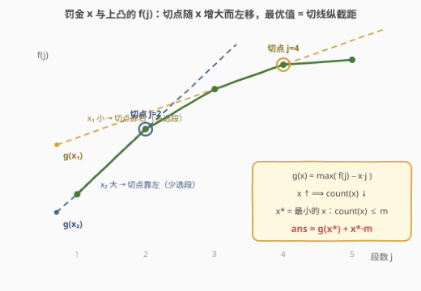
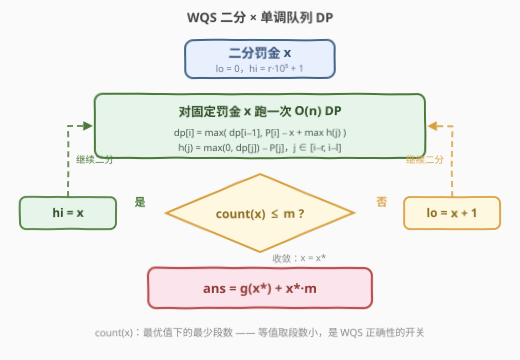

# LeetCode M 个非重叠子数组最大和 II 题解

## 1. 题目概述

- **标题 / 题号**：M 个非重叠子数组最大和 II（#3957，hard）
- **链接**：https://leetcode.cn/problems/maximum-sum-of-m-non-overlapping-subarrays-ii/
- **难度**：困难
- **标签**：动态规划、WQS 二分（带权二分）、前缀和、单调队列、滑动窗口、二分查找

**题意**：给你一个长度为 $n$ 的整数数组 `nums`，以及三个整数 $m$、$l$ 和 $r$。从 `nums` 中选择**至少一个**且**至多 $m$ 个**互不重叠的子数组，要求每个子数组的长度都在 $[l, r]$ 范围内，最大化所有被选子数组的总和，返回这个最大总和。

**示例 1**：

```text
输入：nums = [4,1,-5,2], m = 2, l = 1, r = 3
输出：7
解释：选 [4, 1]（和 5）与 [2]（和 2），总长均合规，总和 7。
```

**示例 2**：

```text
输入：nums = [1,0,3,4], m = 2, l = 1, r = 2
输出：8
解释：选 [1]（和 1）与 [3, 4]（和 7），总和 8。
```

**示例 3**：

```text
输入：nums = [-1,7,-4], m = 1, l = 2, r = 3
输出：6
解释：只能选 1 个、长度 ≥ 2 的子数组，[-1, 7] 最优，总和 6。
```

**示例 4**：

```text
输入：nums = [-3,-4,-1], m = 2, l = 1, r = 2
输出：-1
解释：所有子数组和均为负，最优是只选 [-1]，总和 -1。
```

**约束**：

- $1 \le n = \text{nums.length} \le 10^5$
- $-10^5 \le \text{nums}[i] \le 10^5$
- $1 \le m \le n$，$1 \le l \le r \le n$

> 💡 **审题关键**：题意与 [3956. M 个非重叠子数组最大和 I](https://leetcode.cn/problems/maximum-sum-of-m-non-overlapping-subarrays-i/) 完全同构，变化只在数据范围——$n, m$ 从 $10^3$ 放大到 $10^5$（$|\text{nums}[i]|$ 反而从 $10^9$ 缩到 $10^5$）。① 前作 $O(n \cdot m)$ 的分层 DP 在这里是 $10^{10}$，**「段数」这一维必须从 DP 状态中消掉**；② 值域虽小，罚金 × 段数等中间量会冲到 $10^{15}$，C++ 依旧全程 `long long`；③ 「至少一个 / 至多 $m$ 个 / 段长 $[l,r]$」三个约束原样保留——全负数组答案为负（示例 4）、负贡献的段不要硬塞，这些坑 II 代一个不少。

## 2. 解题思路

### 2.1 暴力思路：前作的分层 DP，撞上数据范围之墙

前作的标准解法是**按段数分层 DP**：$f[c][i]$ 表示前 $i$ 个元素里**恰好**选 $c$ 个合规子数组的最大总和，配合前缀和与单调队列把每层做到 $O(n)$，总复杂度 $O(n \cdot m)$。

放到本题 $n, m \le 10^5$：$10^{10}$ 次转移，直接爆炸。瓶颈非常明确——**状态里背着「已选段数」这一维**，而 $m$ 本身大到不允许枚举。

暴力枚举所有互不重叠的合规子数组组合更是指数级，不值一提。出路只有一条：让「段数」从状态里消失，转而用某种**可调节的代价**间接控制它——这正是 **WQS 二分**（带权二分 / Aliens trick）的用武之地。

### 2.2 核心观察：WQS 二分——把「段数上限」换成「每段罚金」



**第一步：看清 $f(j)$ 的形状。** 设 $f(j)$ = 恰好选 $j$ 个合规子数组的最大总和（不可行为 $-\infty$）。关键性质：**$f$ 是上凸的**，即增量 $d(j) = f(j+1) - f(j)$ 递减。

> 💡 **凸性的交换论证（sketch）**：取 $j$ 段方案 $X$ 与 $j+2$ 段方案 $Z$。若两组线段互不重叠，把 $Z$ 的任意一段划给 $X$，两边都变成 $j+1$ 段，总和不变；若有重叠，在最早冲突处把 $X$ 的一段与 $Z$ 覆盖它的相邻两段「互换地盘」，同样得到两个 $j+1$ 段方案且总和不减。这正是 $2f(j+1) \ge f(j) + f(j+2)$。直觉版本：**段是按边际收益从高到低被挑走的，第 $j+1$ 段永远不会比第 $j$ 段更赚**。

**第二步：罚金化。** 不限制段数，改为**每选一段缴纳罚金 $x$**，最大化「总和 $-\,x \times$ 段数」：

$$g(x) = \max_{j \ge 1}\big(f(j) - x \cdot j\big), \qquad count(x) = \text{达到 } g(x) \text{ 的最少段数}$$

几何上，$-x$ 是凸包的切线斜率，$g(x)$ 是切线的纵截距；$x$ 越大，切点越靠左——**$count(x)$ 随 $x$ 非递增**（凸包上的切点单调左移）。于是「找合适的段数」变成「二分罚金」。

**第三步：还原答案。** 令 $x^* = \min\{x \ge 0 : count(x) \le m\}$（注意本题是「**至多** $m$ 段」而非「恰好 $m$ 段」），则：

$$ans = g(x^*) + x^* \cdot m$$

为什么「至多」也成立？分两种情形：

- **$x^* = 0$**：无罚金时最优段数本来就不超过 $m$，峰值落在预算内，$ans = g(0) = \max_{j \ge 1} f(j)$；
- **$x^* > 0$**：说明 $count(0) > m$，凸函数的峰值在 $m$ 右侧，于是 $f$ 在 $[1, m]$ 上单调递增，$ans = f(m)$。而此时恰好 $x^* = d(m)$（整数增量 + 二分的极小性），$j = m$ 正是斜率 $-x^*$ 切线的切点，$g(x^*) = f(m) - x^* \cdot m$，代回仍是 $ans = g(x^*) + x^* \cdot m$。

两种情形被同一个公式覆盖——这就是 WQS 处理「至多 $k$」的姿势：**答案取 $g(x^*) + x^* \cdot m$，让罚金把多算的 $x^* \cdot count$ 按每段 $x^*$ 补偿回 $x^* \cdot m$**。

**第四步：三个实现级细节（每个都是正确性开关）。**

- **强制「至少一段」**：$g(x)$ 的定义域是 $j \ge 1$。DP 中令 $dp[0] = -\infty$，且末段左侧区域允许「整个空着」（值 0、段数 0）：$h(j) = \max(0, dp[j]) - P[j]$。这样示例 4 的全负数组不会被「一个都不选 = 0」污染，$count(x) \ge 1$ 恒成立。
- **等值时取段数小的**：$count(x)$ 的语义必须是「**最小** argmax」。凸性推理中 $count(x) \le m \iff d(m) \le x$ 依赖这一点；若等值时随手保留段数大的方案，$count(x)$ 可能不再单调，二分直接失准。DP 的所有比较都采用字典序：**值优先大，值同段数小**。
- **整数二分 + 上界**：$f$ 全为整数 $\Rightarrow$ 增量 $d(j)$ 为整数 $\Rightarrow$ $x^* = \max(0, d(m))$ 是整数，二分整数罚金即可。上界取 $r \cdot 10^5 + 1$：罚金一旦超过任何单段可能的最大和（$\le r \cdot 10^5$），每段净贡献严格为负，最优方案退化为恰好 $1$ 段，$count \le m$ 必然成立，二分区间合法封闭。

> 💡 **一句话总结**：$f(j)$ 上凸 ⟹ 给每段加罚金 $x$ 后最优段数 $count(x)$ 单调不增 ⟹ 整数二分出最小的 $x^*$ 使 $count(x^*) \le m$ ⟹ $ans = g(x^*) + x^* \cdot m$；$g(x)$ 的求解是一次无段数维的 $O(n)$ 单调队列 DP。

### 2.3 算法流程：固定罚金的 O(n) 单调队列 DP + 整数二分



对固定罚金 $x$，设 $dp[i]$ = 前 $i$ 个元素中**已选至少一段**的最大「总和 $-\,x\times$段数」（及等值下最少段数），$P$ 为前缀和。末段 $(j, i]$ 的长度 $i - j \in [l, r]$，与前作一样拆出 $P[i]$：

$$dp[i] = \max\Big(dp[i-1],\ P[i] - x + \max_{j \in [i-r,\ i-l],\ j \ge 0} h(j)\Big), \qquad h(j) = \max(0, dp[j]) - P[j]$$

$j$ 的候选集仍是**定长滑动窗口** $[i-r, i-l]$，随 $i$ 右移一格——单调队列均摊 $O(1)$ 维护窗口内最优的 $h(j)$（值优先大、等值段数小），与前作的单层转移完全同构，只是不再按段数分层。$g(x) = dp[n]$，$count(x)$ = 其段数。

| 步骤 | 操作 | 说明 |
|------|------|------|
| ① | 计算前缀和 $P[0..n]$ | 段和拆项 $P[i] - P[j]$ 的基础 |
| ② | $dp[0] \leftarrow -\infty$ | 强制至少一段；$j = 0$ 时 $h(0) = -P[0] = 0$（左侧全空） |
| ③ | $i = 1 \ldots n$：$j = i - l \ge 0$ 则算 $h(j)$ 入队尾 | 弹掉队尾「值更小，或等值但段数不小」的——它们永无出头之日 |
| ④ | 队首 $< i - r$ 则弹出 | 窗口 $[i-r, i-l]$ 左端过期，队首即窗口最优 |
| ⑤ | $dp[i] = \max(dp[i-1],\ h(\text{队首}) + P[i] - x)$，等值取段数小 | 字典序比较，维持「最小 argmax」不变量 |
| ⑥ | 外层二分 $x$：$count(x) \le m$ 则 $hi = x$，否则 $lo = x + 1$ | 先试 $x = 0$：$count(0) \le m$ 直接返回 $g(0)$ |
| ⑦ | 收敛后 $ans = g(x^*) + x^* \cdot m$ | 罚金按 $m$ 段补回 |

### 2.4 示例演算

**示例 1：nums = [4, 1, −5, 2]，m = 2，l = 1，r = 3。**

先列 $f$ 表：$f(1) = 5$（[4,1]），$f(2) = 7$（[4,1]+[2]），$f(3) = 7$（[4]+[1]+[2]），$f(4) = 2$。增量 $d = [2, 0, -5]$ 递减，凸性可见。

罚金 $x = 0$ 时 $g(0) = 7$，等值方案 [4,1]+[2]（2 段）与 [4]+[1]+[2]（3 段）取段数小者，$count(0) = 2 \le m = 2$——无需罚金，直接 $ans = g(0) = 7$ ✓。

**构造例：nums = [5, 5, 5, 5]，m = 2，l = 1，r = 1**（每段恰 1 个元素，$f(j) = 5j$，增量恒为 5，峰值在预算外）。

| 罚金 $x$ | 每段净贡献 | $g(x)$ | $count(x)$ | 判定（$\le m = 2$？） |
|---|---|---|---|---|
| $0$ | $+5$ | $20$（4 段全选） | $4$ | 否，$lo \to 1$ |
| $4$ | $+1$ | $4$（4 段全选） | $4$ | 否，$lo \to 5$ |
| $5$ | $0$ | $0$（值全为 0，取最少段数） | $1$ | 是，$hi \to 5$ |

二分收敛 $x^* = 5$（恰为增量 $d(2) = 5$，与理论 $x^* = \max(0, d(m))$ 吻合），$ans = g(5) + 5 \times 2 = 0 + 10 = 10 = f(2)$ ✓。

> 💡 这个例子浓缩了 WQS 的全部动作：$x$ 从 0 涨到 5，最优段数从 4 压到 1；$x^* = 5$ 处各种段数等值，靠「取段数小」的 tie-break 才能让 $count(x^*) \le m$ 成立；最后按 $m = 2$ 段把罚金加回，精确还原 $f(2)$。

## 3. 参考代码

### C++

```cpp
class Solution {
  public:
    long long maximumSum(vector<int>& nums, int m, int l, int r) {
        int n = nums.size();
        vector<long long> P(n + 1, 0);
        for (int i = 0; i < n; i++) P[i + 1] = P[i] + nums[i];

        const long long NEG = LLONG_MIN / 4;      // 安全的 -inf 哨兵（只比较，不参与运算）
        vector<long long> dp(n + 1), hv(n + 1);   // hv[j] = max(0, dp[j]) - P[j]
        vector<int> hc(n + 1), cnt(n + 1);        // 与之配套的（最小）段数
        deque<int> dq;

        // 固定罚金 x：求 (g(x), count(x))，count 为最优值下的最少段数
        auto solve = [&](long long x) -> pair<long long, int> {
            dp[0] = NEG;                          // 前 0 个元素放不下任何一段 ⟹ 强制至少一段
            dq.clear();
            for (int i = 1; i <= n; i++) {
                int j = i - l;
                if (j >= 0) {
                    if (dp[j] > 0) { hv[j] = dp[j] - P[j]; hc[j] = cnt[j]; }
                    else           { hv[j] = -P[j];        hc[j] = 0; }   // 左侧全空：值 0 段数 0
                    while (!dq.empty() && (hv[dq.back()] < hv[j] ||
                           (hv[dq.back()] == hv[j] && hc[dq.back()] >= hc[j])))
                        dq.pop_back();            // 值更小 / 等值段数不少的队尾永无出头之日
                    dq.push_back(j);
                }
                while (!dq.empty() && dq.front() < i - r) dq.pop_front();
                long long bv = dp[i - 1];         // 候选一：末段不在 i 结束，继承 dp[i-1]
                int bc = cnt[i - 1];
                if (!dq.empty()) {                // 候选二：末段 (队首, i]
                    int k = dq.front();
                    long long v = hv[k] + P[i] - x;
                    int c = hc[k] + 1;
                    if (v > bv || (v == bv && c < bc)) { bv = v; bc = c; }
                }
                dp[i] = bv; cnt[i] = bc;
            }
            return {dp[n], cnt[n]};
        };

        auto [g0, c0] = solve(0);
        if (c0 <= m) return g0;                   // 无限制最优段数本来就在预算内
        long long lo = 1, hi = 1LL * r * 100000 + 1;   // 罚金 > 任何单段和 ⟹ count = 1 ≤ m
        while (lo < hi) {
            long long mid = (lo + hi) / 2;
            auto [g, c] = solve(mid);
            if (c <= m) hi = mid; else lo = mid + 1;
        }
        auto [g, c] = solve(lo);
        return g + lo * (long long)m;             // 罚金按 m 段加回
    }
};
```

> 💡 **写法要点**：
> - `hv[j]` 在 $j = i - l$ 首次被需要时计算（此时 `dp[j]` 已就绪），队列里存下标、按 `hv/hc` 字典序保持队首最优；
> - 等值取段数小的 tie-break 出现在**两处**：队尾弹出（`==` 且 `hc >=` 时弹）与两候选合并（`== bv && c < bc` 时替换）；
> - `NEG` 只做比较从不参与加减，`LLONG_MIN / 4` 的量级远离溢出边界。

### Python

```python
class Solution:
    def maximumSum(self, nums: List[int], m: int, l: int, r: int) -> int:
        n = len(nums)
        P = [0] * (n + 1)
        for i, v in enumerate(nums):
            P[i + 1] = P[i] + v

        B = 1 << 17            # 打包基数：段数 < 2^17
        M = B - 1
        NEG = -(1 << 70)       # 只参与比较的安全 -inf

        def solve(x):
            # dp[i] 打包成单个整数：值 * B + (M - 段数)
            # 整数大小比较天然实现「值优先大、等值段数小」的字典序
            dp = [0] * (n + 1)
            dp[0] = NEG        # 前 0 个元素放不下任何一段 ⟹ 强制至少一段
            H = [0] * (n + 1)  # H[j] = h(j) 打包 = (max(0, dp[j]) - P[j]) * B + (M - 段数)
            q = [0] * (n + 1)  # 手写单调队列（存下标）
            head = tail = 0
            for i in range(1, n + 1):
                j = i - l
                if j >= 0:
                    kj = dp[j]
                    # dp[j] > 0（等价 kj > M）时复用其 (值, 段数)，否则左侧全空 (0, 0)
                    hj = kj - P[j] * B if kj > M else M - P[j] * B
                    H[j] = hj
                    while tail > head and H[q[tail - 1]] <= hj:
                        tail -= 1
                    q[tail] = j
                    tail += 1
                while tail > head and q[head] < i - r:
                    head += 1
                best = dp[i - 1]
                if tail > head:
                    # 末段 (队首, i]：h(队首) + P[i] - x，段数 +1（键值上恰为 -1）
                    cand = H[q[head]] + (P[i] - x) * B - 1
                    if cand > best:
                        best = cand
                dp[i] = best
            k = dp[n]
            return k >> 17, M - (k & M)     # 拆包：(g(x), count(x))

        g, c = solve(0)
        if c <= m:
            return g
        lo, hi = 1, r * 100000 + 1
        while lo < hi:
            mid = (lo + hi) // 2
            g, c = solve(mid)
            if c <= m:
                hi = mid
            else:
                lo = mid + 1
        g, c = solve(lo)
        return g + lo * m
```

> 💡 **Python 提速要点**：「值优先、段数小优先」的字典序被编码成**单个整数** `值·2¹⁷ + (2¹⁷−1−段数)`（段数 $< 10^5 < 2^{17}$，值域 $\pm 10^{15} < 2^{63}$ 不越界），所有比较退化为一次整数比较，内层循环只剩加减、比较和数组访问，实测 $n = 10^5$ 全量二分约 1~2 秒。拆包用 `k >> 17` 与 `k & (2¹⁷−1)`（Python 负数的位移/按位与恰为数学上的 floor 与非负余数，负值同样成立）。

## 4. 复杂度分析

| 维度 | 复杂度 | 说明 |
|------|--------|------|
| 时间 | $O\big(n \log(r \cdot 10^5)\big)$ | 每次二分跑一趟 $O(n)$ 单调队列 DP；$r \le 10^5$ 时约 34 轮 |
| 空间 | $O(n)$ | 前缀和 + dp/段数数组 + 单调队列，全程滚动复用 |
| 中间量规模 | $\le 10^{15}$ | 罚金 $x^* \le r\cdot 10^5$，乘上段数 $m \le 10^5$；答案本身 $\le 10^{10}$，均超 32 位 |

## 5. 扩展

**方案还原**：若要输出具体选了哪些子数组，在每个 $dp[i]$ 取到最优时记录来源（继承自 $dp[i-1]$，还是来自队首 $j$ 的末段转移），从 $(n)$ 回溯即可；WQS 版本只需 $O(n)$ 记录空间，比前作 $O(nm)$ 的整表回溯省得多。

**退化为经典模型**：当 $l = 1, r = n$ 时段长不受限，窗口约束消失，转移退化为对 $j$ 的前缀最大值——这就是经典的「最多 $m$ 段的最大子段和」，WQS 二分同样是标准解法，可视为本题的特例校验器。

**WQS 二分的适用清单**：目标函数关于「限制个数 $k$」上凸（交换论证可证）+ 单个 $k$ 下的最值可 $O(\text{poly})$ 求出 + 能同步维护最优解的个数。同类经典还有「恰好 $k$ 条边的最小生成树」「恰好 $k$ 个上升元素的最长 LIS」等。**两大陷阱**：等值时 tie-break 必须与「最小 argmax」约定一致；实数域需要判断凸性是否严格（本题整数域二分天然规避）。

## 6. 面试要点

**Q1：前作的 $O(nm)$ 分层 DP 为什么在本题直接出局？**

> $n, m \le 10^5$，状态数 $n \cdot m = 10^{10}$，连枚举段数这一维本身都不可行。必须让「段数」从状态中消失——WQS 用「每段罚金 $x$」把段数约束转化为目标函数的一部分，DP 状态只剩位置 $i$，二分 $x$ 间接控制段数。

**Q2：本题是「至多 $m$ 段」而非「恰好 $m$ 段」，WQS 还适用吗？**

> 适用，但还原公式要重推。设 $x^*$ 为最小的 $x \ge 0$ 使 $count(x) \le m$：若 $x^* = 0$，无限制最优段数本就 $\le m$，$ans = g(0)$；若 $x^* > 0$，凸函数峰值在 $m$ 右侧，$f$ 在 $[1,m]$ 上递增，$ans = f(m)$，且 $j = m$ 恰为斜率 $-x^*$ 的切点，$g(x^*) = f(m) - x^* m$。两种情形统一为 $ans = g(x^*) + x^* \cdot m$，**不能**写成 $g(x^*) + x^* \cdot count(x^*)$。

**Q3：「至少一段」在 DP 里怎么保证？**

> 两处配合：$dp[0] = -\infty$（空前缀不可行），且转移里左侧区域用 $h(j) = \max(0, dp[j]) - P[j]$——「0」代表前缀 $j$ 完全空着的合法方案（值 0、段数 0）。若漏掉前者，全负数组（示例 4）会错误地返回 0 而非 $-1$。

**Q4：等值时为什么必须取「段数小」的方案？**

> $count(x)$ 的正确语义是「达到 $g(x)$ 的**最少**段数」（最小 argmax）。凸性推理的核心等价式 $count(x) \le m \iff d(m) \le x$、以及 $count$ 关于 $x$ 的单调性都依赖这一约定；等值时若保留段数大的方案，二分的判定条件会被破坏。这也是 WQS 最常见的 WA 来源。

**Q5：二分的上下界怎么定？为什么整数二分就够？**

> 下界 0（罚金非负，先试 $x=0$ 可整体跳过二分）。上界 $r \cdot 10^5 + 1$：超过任何单段最大可能和后每段净贡献为负，最优方案退化为 1 段，$count \le m$ 必然成立，区间封闭。整数性：$f$ 取整数值 ⟹ 增量 $d(j)$ 是整数 ⟹ $x^* = \max(0, d(m))$ 是整数，实数二分没有必要且会引入精度问题。

## 同类练习题

| # | 题目 | 与本题的关联 |
|---|------|-------------|
| 3956 | [M 个非重叠子数组最大和 I](https://leetcode.cn/problems/maximum-sum-of-m-non-overlapping-subarrays-i/) | 本题前作，$n, m \le 10^3$，按段数分层的 $O(nm)$ 单调队列 DP |
| 689 | [三个无重叠子数组的最大和](https://leetcode.cn/problems/maximum-sum-of-3-non-overlapping-subarrays/) | 固定 3 段、定长的特例，无 WQS 也无单调队列 |
| 1031 | [两个非重叠子数组的最大和](https://leetcode.cn/problems/maximum-sum-of-two-non-overlapping-subarrays/) | 两段固定长度，前缀/后缀分解的经典做法 |
| 862 | [和至少为 K 的最短子数组](https://leetcode.cn/problems/shortest-subarray-with-sum-at-least-k/) | 前缀和 + 单调队列联用的最经典题 |
| 3414 | [非重叠区间的最大分数](https://leetcode.cn/problems/maximum-score-of-non-overlapping-intervals/) | 区间选择 + DP 的另一形态，先排序再转移 |
