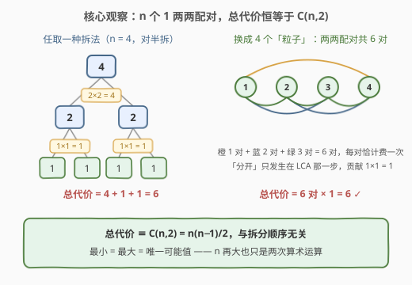
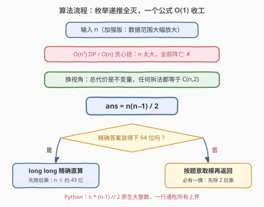

# LeetCode 拆分到 1 的最小总代价 II 题解

## 1. 题目概述

- **标题 / 题号**：拆分到 1 的最小总代价 II（#3958，medium）
- **链接**：https://leetcode.cn/problems/minimum-cost-to-split-into-ones-ii/
- **难度**：中等
- **标签**：数学

> ⚠️ 本题为 LeetCode 付费题，题意描述根据官方示例用例与 hints 重建，可能与官方题面有出入。它是 [3857. 拆分到 1 的最小总代价](../3801-3900/3857_拆分到1的最小总代价.md) 的加强版：**题意完全相同，数据范围大幅放大**（官方三条 hints 给出的正是「$f(x)$ 定义 → 递推式 → 不变量」的完整解题链，与本题解结构一一对应）。

**题意**：给你一个整数 $n$。

在一次操作中，你可以将整数 $x$ **拆分**为两个正整数 $a$ 和 $b$，使得 $a + b = x$。此操作的**代价**是 $a \times b$。

返回将整数 $n$ 拆分为 $n$ 个 $1$ 所需的**最小总代价**。

**示例 1**：

```text
输入：n = 3
输出：3
解释：3 = 1 + 2（代价 1×2 = 2），再把 2 = 1 + 1（代价 1×1 = 1），合计 2 + 1 = 3。
```

**示例 2**：

```text
输入：n = 4
输出：6
解释：4 = 2 + 2（代价 4），两个 2 各拆成 1 + 1（代价 1 + 1），合计 4 + 1 + 1 = 6。
```

**约束**：

- I 代（3857）为 $1 \le n \le 500$；II 代为加强版，**付费题约束原文不可见**。按官方 hints（只挂 Math 标签、强调不变量而非 DP）与 I/II 惯例推断 $n$ 放大到 $10^9 \sim 10^{18}$ 量级——任何依赖枚举或递推的做法都不可行，必须推出 $O(1)$ 公式。第 3 节代码对「精确返回」与「取模返回」两种口径都给出写法。

> 💡 **审题关键**：题意与 I 代逐字相同——拆的是「一个整数」而非数组、代价是两部分的**乘积**、要拆到全部变 1；唯一变化是 $n$ 的上界。I 代还能靠 $O(n^2)$ DP 兜底，II 代直接把这条路堵死，逼你直面不变量本身。

## 2. 解题思路

### 2.1 暴力思路：DP 与贪心链在 II 代全部阵亡

I 代的标准做法是记忆化搜索 / DP。设 $f(x)$ 为把 $x$ 拆成全 1 的最小总代价（官方 hint ①②）：

$$
f(1) = 0, \qquad f(x) = \min_{1 \le a < x} \big[\, a(x-a) + f(a) + f(x-a) \,\big]
$$

状态 $O(n)$ 个、每个转移 $O(n)$，总计 $O(n^2)$；即使发现「每次拆出 1」的贪心，也得累加 $n - 1$ 项，仍是 $O(n)$。

II 代把 $n$ 放大十来个数量级后，$O(n)$ 本身就是死刑——**答案必须与 $n$ 只有 $O(1)$ 次运算的关系**。好在小样例打表极快：$f(x) = 0, 1, 3, 6, 10, 15, \ldots$，正是三角形数 $\binom{x}{2}$。

### 2.2 核心观察：代价不变量——总代价恒等于 C(n,2)



官方 hint ③ 点破天机：**总代价只取决于最终碎片的集合，与拆分顺序无关**——而最终碎片恒为 $n$ 个 1，于是答案是定值。给三个互相印证的视角（完整展开见 I 代题解）：

**视角一（成对计数，最直观）**：把 $n$ 看成 $n$ 个单位「粒子」。一次拆分 $x = a + b$ 的代价

$$
a \times b = \Bigl(\textstyle\sum_{u \in A} u\Bigr)\Bigl(\textstyle\sum_{v \in B} v\Bigr) = \sum_{u \in A}\sum_{v \in B} u \cdot v
$$

恰好是「跨过这条切缝的点对」各自的乘积和。任意两个粒子只在同时包含它们的块**第一次被拆开**（即拆分树上的最近公共祖先）那一步被分开一次、贡献 $1 \times 1 = 1$，此后永不再计费。于是：

$$
\text{总代价} \equiv \binom{n}{2} = \frac{n(n-1)}{2}
$$

**视角二（归纳法）**：设 $g(x) = x(x-1)/2$，则对任意 $a + b = x$：

$$
g(a) + g(b) + ab = \frac{a^2 - a + b^2 - b + 2ab}{2} = \frac{(a+b)^2 - (a+b)}{2} = g(x)
$$

由归纳法，**任何**拆分方案的总代价都恰好等于 $g(n)$——不依赖「最优」假设，一步到位。

**视角三（望远镜求和）**：$ab = \binom{a+b}{2} - \binom{a}{2} - \binom{b}{2}$，拆分树上每个节点的 $\binom{\cdot}{2}$ 先加后减逐层抵消，只剩根的贡献 $\binom{n}{2}$。

> 💡 **一句话**：最小 = 最大 = 唯一可能值 $\dfrac{n(n-1)}{2}$。II 代真正的考点已不在推导（I 代铺好了路），而在**下一步：$n$ 巨大时怎么把这个公式安全地算出来**。

### 2.3 算法流程图



主轴一条线：**套公式 $\binom{n}{2}$ → 判断精确值是否装得下 64 位 → 分支处理**。注意 $n = 1$ 时公式自然给出 0，无需特判。

### 2.4 示例演算

$n = 4$ 时两种形状截然不同的拆法：

| 拆法 | 操作序列 | 逐步代价 | 合计 |
|------|----------|----------|------|
| 逐个剥 1（链式） | $4{=}1{+}3 \to 3{=}1{+}2 \to 2{=}1{+}1$ | $3,\ 2,\ 1$ | $6$ |
| 对半拆（平衡） | $4{=}2{+}2 \to 2{=}1{+}1,\ 2{=}1{+}1$ | $4,\ 1,\ 1$ | $6$ |

殊途同归，都等于 $\binom{4}{2} = 6$ ✓。再看 II 代的真正风味：$n = 10^{18}$ 时答案 $\approx 5 \times 10^{35}$——**连 long long 都装不下**，这正是 2.3 流程图里那个分支判断存在的原因。

## 3. 参考代码

### C++

```cpp
class Solution {
public:
    long long minCost(long long n) {
        // n 与 n-1 必有一偶：先除后乘，中间量减半，精确口径安全上界更高
        return n % 2 == 0 ? n / 2 * (n - 1) : n * ((n - 1) / 2);
    }
};
```

### Python

```python
class Solution:
    def minCost(self, n: int) -> int:
        return n * (n - 1) // 2
```

> 💡 **写法要点**：
> - **签名按 I 代惯例推断**（I 代为 `int minCost(int n)`，II 代随范围放大为 `long long`）；付费题签名不可见，按实际题目微调即可，公式不变；
> - C++ 里 `n * (n - 1)` 两个 `long long` 相乘在 $n \gtrsim 3 \times 10^9$ 时**静默溢出**——「先除后乘」可把精确口径的安全上界抬到约 $4.3 \times 10^9$，再大就必须取模或上大整数（第 5 节）；
> - Python 原生大整数天然免疫溢出，是付费题口径不明时**最稳的一行答案**；
> - 不要写循环累加——$O(n)$ 在 $10^{18}$ 下同样是超时。

## 4. 复杂度分析

| 维度 | 复杂度 | 说明 |
|------|--------|------|
| 时间 | $O(1)$ | 一次乘法、一次除法 |
| 空间 | $O(1)$ | 无额外存储 |
| 对比：I 代 DP | $O(n^2)$ / $O(n)$ | $n \le 500$ 可用；II 代 $n$ 高达 $10^{18}$ 量级，连 $O(n)$ 都超时 |
| 量级判断 | $n = 10^{18} \Rightarrow \binom{n}{2} \approx 5 \times 10^{35}$ | 超 64 位：精确值需大整数，或按题意取模 |

## 5. 扩展：n 高达 10^18 时的三种写法

**① Python / Java（大整数）**：`n * (n - 1) // 2` 直接返回精确值，任何上界通吃，推荐口径。

**② C++ 取模版**：若题目要求对 $10^9 + 7$ 取模，注意**除以 2 不能整体取模**（$2^{-1}$ 需要模逆元）——更省事的办法是利用 **$n$ 与 $n-1$ 必有一偶**，先除后乘、逐项取模：

```cpp
using ll = long long;
const ll MOD = 1'000'000'007;

ll minCost(ll n) {
    ll a = (n % 2 == 0) ? (n / 2) % MOD : n % MOD;
    ll b = (n % 2 == 0) ? (n - 1) % MOD : ((n - 1) / 2) % MOD;
    return a * b % MOD;
}
```

**③ C++ 精确大数**：若必须返回精确值而 $n > 4.3 \times 10^9$，乘积达 $10^{36}$ 量级，可用 `unsigned __int128` 中转（上限 $\approx 3.4 \times 10^{38}$，恰好覆盖 $n \le 10^{18}$），再按题目要求的返回方式输出；更稳妥则是直接上大数运算或改用 Python 提交。

> ⚠️ 与 I 代对照：I 代的坑是「没想到公式、写 $O(n^2)$」；II 代的坑换成「公式对了、**乘法溢出**」——溢出是静默的未定义行为，小样例对拍都未必立刻暴露，写 C++ 时务必先估上界再选写法。

## 6. 面试要点

**Q1：II 代和 I 代的考点差在哪？**

> 数学内核完全一样（不变量 $\Rightarrow \binom{n}{2}$）；差别在工程：I 代 $O(n^2)$ DP 是合法兜底，II 代 $n$ 高达 $10^{18}$ 量级把所有非 $O(1)$ 做法清场，同时把「溢出处理」顶上前台——精确值装不下 64 位时，取模要会用「必有一偶、先除后乘」。

**Q2：为什么任何拆分顺序的总代价都相同？**

> 成对计数：拆分 $x = a + b$ 的代价 $a \times b$ 恰为跨切缝点对的乘积和；每对粒子只在最近公共祖先处被分开一次、贡献 $1 \times 1 = 1$。总代价 $=$ 点对数 $= \binom{n}{2}$，与顺序无关——最小、最大、任意值三者合一。

**Q3：怎么在 30 秒内向面试官证明公式？**

> 归纳法一句话：设 $g(x) = x(x-1)/2$，则 $g(a) + g(b) + ab = \frac{(a+b)^2 - (a+b)}{2} = g(a+b)$，补上基例 $g(1) = 0$——任何拆法都精确等于 $g(n)$，收工。

**Q4：`return n * (n - 1) / 2` 在 II 代哪里会翻车？**

> $n \gtrsim 3 \times 10^9$ 后乘积溢出 `long long`（静默 UB）。修正分口径：先除后乘把精确上界抬到约 $4.3 \times 10^9$；再大就按题意取模（奇偶分支先除 2）或上大整数。Python 无此虞。

**Q5：如果追问「改成把 n 拆成恰好 k 个正整数就停手，最小代价是多少」呢？**

> 不变量立刻失效——最终碎片集合不再固定为全 1。由 $\text{总代价} = \sum_{i<j} p_i p_j = \frac{n^2 - \sum p_i^2}{2}$，最小化等价于**最大化 $\sum p_i^2$**：剥出 $k-1$ 个 1、留一个大块 $n-k+1$ 即最优，答案 $\frac{n^2 - (n-k+1)^2 - (k-1)}{2}$。「先检验不变量是否存在，失效再退回优化」是这类操作题的通用流程。

> 💡 **一句话总结**：3958 =「3857 的不变量 + 溢出工程学」。带走三点：总代价恒为 $\binom{n}{2}$、与顺序无关；$n$ 巨大时先问「装不装得下 64 位」；取模除 2 靠「必有一偶」。

## 同类练习题

| # | 题目 | 与本题的关联 |
|---|------|-------------|
| 3857 | [拆分到 1 的最小总代价](https://leetcode.cn/problems/minimum-cost-to-split-into-ones/)（[题解](../3801-3900/3857_拆分到1的最小总代价.md)） | 本题 I 代，$n \le 500$，可 DP 可贪心，不变量的完整三重证明在那里 |
| 1130 | [叶值的最小代价生成树](https://leetcode.cn/problems/minimum-cost-tree-from-leaf-values/)（[题解](../1101-1200/1130_叶值的最小代价生成树.md)） | 对偶问题——合并两数代价 $a \cdot b$，顺序影响结果需区间 DP，对照本题「拆分顺序无关」 |
| 1000 | [合并石头的最低成本](https://leetcode.cn/problems/minimum-cost-to-merge-stones/)（[题解](../0901-1000/1000_合并石头的最低成本.md)） | 合并代价为区间和的区间 DP 经典，体会「代价函数决定要不要 DP」 |
| 1547 | [切棍子的最小成本](https://leetcode.cn/problems/minimum-cost-to-cut-a-stick/)（[题解](../1501-1600/1547_切棍子的最小成本.md)） | 同样的拆分树结构但代价是段长而非乘积，顺序不再无关、必须 DP——反面印证不变量的珍贵 |
| 343 | [整数拆分](https://leetcode.cn/problems/integer-break/)（[题解](../0301-0400/343_整数拆分.md)） | 同为「拆整数」求乘积最大（DP / 三分法），与本题求代价最小互补 |
