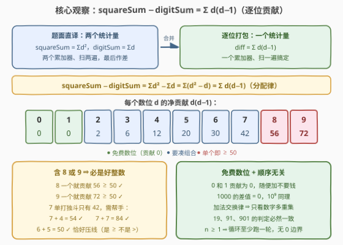
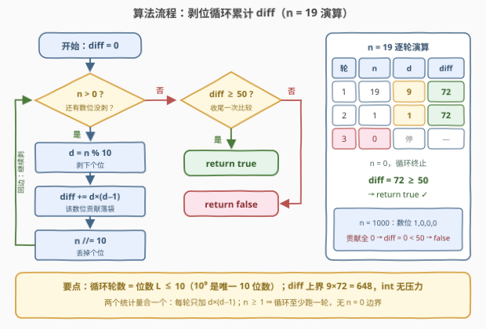

# 判定好整数

- **题目名称**：判定好整数
- **链接**：[3959. 判定好整数](https://leetcode.cn/problems/check-good-integer/)
- **难度**：简单
- **标签**：数学、模拟

## 1. 题目概述

给你一个正整数 `n`。令 `digitSum` 表示 `n` 的**各位数字之和**，令 `squareSum` 表示 `n` 的**各位数字平方之和**。

如果一个整数满足 $\text{squareSum} - \text{digitSum} \ge 50$，则称它是**好整数**。如果 `n` 是好整数，返回 `true`；否则返回 `false`。

**示例 1**：

```text
输入：n = 1000
输出：false
解释：数位为 1、0、0、0。
     digitSum = 1 + 0 + 0 + 0 = 1
     squareSum = 1² + 0² + 0² + 0² = 1
     差值 1 − 1 = 0 < 50，不是好整数。
```

**示例 2**：

```text
输入：n = 19
输出：true
解释：数位为 1、9。
     digitSum = 1 + 9 = 10
     squareSum = 1² + 9² = 1 + 81 = 82
     差值 82 − 10 = 72 ≥ 50，是好整数。
```

**约束条件**：

- $1 \le n \le 10^9$

> 💡 **审题关键**：两个统计量作用在**同一组数位**上，「平方和 − 数位和」可以按分配律**逐位合并**——每个数字 $d$ 一次性贡献 $d^2 - d$，一趟循环只需一个累加器。另外 $n \le 10^9$ 中 $10^9$ 本身是唯一的 10 位数（1 后面九个 0），差值恰为 0；$n \ge 1$ 保证数位枚举循环至少执行一次，没有 $n = 0$ 边界。

---

## 2. 解题思路

### 2.1 暴力思路：按题面直译

最直接的写法是把题面的两个定义各自实现：转字符串（或剥位循环）先算一遍 `digitSum`，再算一遍 `squareSum`，最后作差比较。两趟循环 $O(L)$（$L$ 为位数，至多 10），复杂度毫无压力——本题官方 hint 直接写着 "Pure simulation problem"，是纯模拟签到题。考点不在复杂度，而在**能否看出两个统计量可以合并成一个**：把两趟循环、两个累加器压成一趟、一个，顺手还能打开「逐位贡献」的视角，得到一堆判定捷径。

### 2.2 核心观察：差值按数位分解，$d$ 贡献 $d(d-1)$



**观察一（分配律合并）**。两个和式的求和指标相同——都是 $n$ 的全体数位，减法经分配律逐项作用：

$$\text{squareSum} - \text{digitSum} \;=\; \sum_i d_i^2 - \sum_i d_i \;=\; \sum_i \left(d_i^2 - d_i\right) \;=\; \sum_i d_i \left(d_i - 1\right)$$

于是剥位循环里只需一个累加器 `diff`，每个数位 $d$ 落袋 $d(d-1)$。

**观察二（贡献表）**。$d(d-1)$ 对 $d = 0 \sim 9$ 的取值：

| $d$ | 0 | 1 | 2 | 3 | 4 | 5 | 6 | 7 | 8 | 9 |
|------|---|---|---|---|---|---|---|---|---|---|
| $d(d-1)$ | 0 | 0 | 2 | 6 | 12 | 20 | 30 | 42 | **56** | **72** |

两个直接推论：

- **0 和 1 是「免费」数位**：贡献为 0，出现多少次都不影响判定——示例 1 的 `1000` 与 $10^9$ 差值均为 0，全是免费数位的锅；
- **含 8 或 9 必是好整数**：单个 8 贡献 56、单个 9 贡献 72，单枪匹马就 ≥ 50。反之 7 单打独斗只有 42，需要帮手：$7+4 \to 54$、$7+7 \to 84$、$6+5 \to 50$（恰好压线）。

**观察三（顺序无关）**。加法交换律 ⇒ 判定只看数字的**多重集**，与数位排列无关：`19`、`91`、`901` 的判定结果必然一致。

> 💡 **一句话总结**：一趟「取模剥个位 + 除 10 丢个位」循环，累加 $d(d-1)$，收尾一次 `diff ≥ 50` 比较。

### 2.3 算法流程图



| 步骤 | 操作 | 说明 |
|------|------|------|
| ① | `diff = 0` | 单累加器起步 |
| ② | `n > 0` ? | 还有数位没剥就继续 |
| ③ | `d = n % 10`，`diff += d * (d − 1)` | 剥个位、该数位贡献落袋 |
| ④ | `n //= 10` | 丢个位，回到 ② |
| ⑤ | 返回 `diff ≥ 50` | 收尾一次比较（注意是 ≥） |

### 2.4 示例演算

| $n$ | 数位 | 各位贡献 $d(d-1)$ | diff | 结论 |
|-----|------|-------------------|------|------|
| 19 | 1, 9 | $0 + 72$ | 72 | `true`（示例 2） |
| 1000 | 1, 0, 0, 0 | $0 + 0 + 0 + 0$ | 0 | `false`（示例 1） |
| 8 | 8 | $56$ | 56 | `true`（最小的好整数） |
| 55 | 5, 5 | $20 + 20$ | 40 | `false` |
| 65 | 6, 5 | $30 + 20$ | 50 | `true`（恰好压线） |

最后一行最有意思：$30 + 20 = 50$ 恰好达到阈值，提醒我们比较是 **≥** 而不是 >；第三行说明 8 一位数本身就好，好整数不必是多位数。

---

## 3. 参考代码

### C++

```cpp
class Solution {
public:
    bool checkGoodInteger(int n) {
        int diff = 0;
        while (n > 0) {
            int d = n % 10;          // 剥个位
            diff += d * (d - 1);     // 该数位的净贡献
            n /= 10;                 // 丢个位
        }
        return diff >= 50;
    }
};
```

> 💡 **写法要点**：
> - $n \ge 1$ 保证循环至少执行一次，无 $n = 0$ 边界；
> - `diff` 上界出现在 999999999（9 个 9）：$9 \times 72 = 648$，`int` 绰绰有余；
> - 若不合并统计量，写两个累加器分别累加 `d` 与 `d * d` 再作差同样正确，只是多跑一遍、多一个变量——面试时先口述「分配律可合并」再落码是加分项。

### Python

```python
class Solution:
    def checkGoodInteger(self, n: int) -> bool:
        diff = 0
        while n:
            d = n % 10
            diff += d * (d - 1)
            n //= 10
        return diff >= 50
```

> 💡 **写法要点**：
> - `while n:` 等价于 `while n > 0:`，$n \ge 1$ 时必然进循环；
> - 一行流版本 `return sum(int(c) * (int(c) - 1) for c in str(n)) >= 50` 也对，字符串版更短、算术版 $O(1)$ 空间，见仁见智。

---

## 4. 复杂度分析

| 维度 | 复杂度 | 说明 |
|------|--------|------|
| 时间 | $O(L)$，$L \le 10$ | 剥位循环轮数 = 位数 $= \lfloor \log_{10} n \rfloor + 1$；$10^9$ 是唯一 10 位数 |
| 空间 | $O(1)$ | 单累加器；算术版不产生字符串临时对象 |

---

## 5. 扩展：从判定到计数与构造

**变体一：统计 $[1, N]$ 中好整数的个数**。判定版是签到，套上区间计数就是标准的**数位 DP**：逐位填数字，状态只需 (位置, diff)，而 diff 对 50 **封顶**（saturating add，超过 50 记 50）——我们只关心「是否 ≥ 50」，状态数 $11 \times 51$ 极小；前缀相减 $\text{cnt}(N) - \text{cnt}(L-1)$ 即区间答案。

**变体二：阈值 $K$ 推广**。阈值从 50 换成任意 $K$，贡献表不变，仍是累加比较；$K > 72$ 时单个数位不够，必须组合（如 $K = 100$ 须两个大数位：$9 + 8 \to 128$）。

**变体三：构造最小的好整数**。含 8/9 必好 ⇒ 最小好整数就是 **8**。反过来，非好整数的数字多重集必须只含 $0 \sim 7$ 且 $\sum d(d-1) < 50$——「多重集视角」把构造问题变成「挑组合 + 按字典序排最小」。

---

## 6. 面试要点

**Q1：为什么 squareSum − digitSum 可以逐位合并？**

> 两个和式作用在**同一组数位**上，减法经分配律逐项作用：$\sum d^2 - \sum d = \sum (d^2 - d)$。凡「两个数位统计量作差/作积」的题都先问一句能否逐位合并——1281（积和之差）的积同理可逐位乘，一趟循环同时收两个量。

**Q2：循环轮数与 n 的规模、溢出风险？**

> 轮数 = 位数 $L = \lfloor \log_{10} n \rfloor + 1$，$n \le 10^9$ 时 $L \le 10$，且只有 $10^9$ 本身是 10 位（贡献全 0）。diff 上界出现在 999999999：$9 \times 72 = 648$，`int` 毫无压力；Python 更是无忧。

**Q3：字符串写法与算术写法怎么选？**

> `str(n)` 逐字符更短、不易写错；`n % 10` / `n //= 10` 是 $O(1)$ 空间、无字符编码转换，渐近都是 $O(L)$。本题 $n \ge 1$ 两种都不踩坑；若 $n$ 可为 0，算术版 `while n > 0` 一次都不进循环，是否要枚举「0 这一位」得看题意（见 258 / 3908 的讨论）。

**Q4：有没有 O(1) 判定捷径？**

> 谈资级捷径：含 8 或 9 必好（56 / 72 单数位即达标），扫描碰到 8/9 可提前 `return true`。但最坏仍要扫完全部数位（全 0~7 的输入），渐近不变，多一条分支反而可能更慢——面试口述能加分，落码没必要。

**Q5：本题与 202 快乐数的关系？**

> 同一副「数位平方和」骨架：202 要**反复迭代**数位平方和并用 Floyd 龟兔判环，本题把平方和与数位和**作差**、一趟终止。对照写一遍能体会「数位统计量」家族的共性与分岔：终止条件决定是纯模拟还是隐式图判环。

> 💡 **一句话总结**：一趟剥位循环累加 $d(d-1)$，收尾比较 $\ge 50$；含 8/9 必好、0/1 免费、判定只看多重集——三句话把题聊透。

---

## 7. 同类练习题

- [202. 快乐数](https://leetcode.cn/problems/happy-number/)：同一数位平方和骨架 + Floyd 判环，本题的迭代版近亲
- [1281. 整数的各位积和之差](https://leetcode.cn/problems/subtract-the-product-and-sum-of-digits-of-an-integer/)：同样「两个数位统计量作差」，积对应逐位乘，合并思想同型
- [258. 各位相加](https://leetcode.cn/problems/add-digits/)：数位和的反复坍缩（digital root），数位枚举基本功
- [1945. 字符串转化后的各位数字之和](https://leetcode.cn/problems/sum-of-digits-of-string-after-convert/)：先字母转数字再数位求和，数位统计量的组合版
- [728. 自除数](https://leetcode.cn/problems/self-dividing-numbers/)：逐位取模条件判定，数位枚举 + 单数判定套上区间枚举
