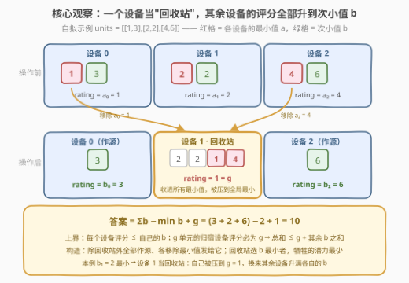
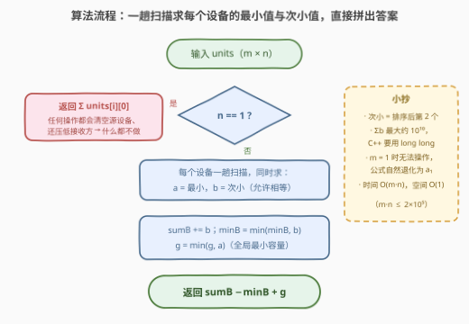

# LeetCode 设备评分的最大和 题解

## 1. 题目概述

- **标题 / 题号**：设备评分的最大和（#3961，medium）
- **链接**：https://leetcode.cn/problems/maximize-sum-of-device-ratings/
- **难度**：中等
- **标签**：数组、贪心

**题意**：给定大小为 $m \times n$ 的二维整数数组 `units`，`units[i][j]` 表示第 $i$ 个设备中第 $j$ 个单元的**容量**。每个设备恰好包含 $n$ 个单元。

设备的**评分**定义为其所有单元中的**最小**容量。

你可以执行以下操作**任意次（包括零次）**：

- 选择一个以前**从未被用作源**的设备 $i$；
- 从设备 $i$ 中**恰好移除一个单元**，并将其添加到**任意其他**设备中；
- 然后将设备 $i$ 标记为已使用，此后它不能再被选作源。

返回经过任意次操作后，所有设备评分之和的**最大**可能值。

注意：

- 设备可以接收来自多个设备的单元（无论对方是否已被选过）；
- 空设备的评分为 $0$。

**示例 1**：

```text
输入：units = [[1,3],[2,2]]
输出：4
解释：选设备 0 作源，把 units[0][0] = 1 转移给设备 1。
     设备 0 = [3] → rating = 3；设备 1 = [2,2,1] → rating = 1。
     评分之和 = 3 + 1 = 4。
```

**示例 2**：

```text
输入：units = [[1,2,3],[4,5,6]]
输出：6
解释：选设备 1 作源，把 4 转移给设备 0。
     设备 0 = [1,2,3,4] → rating = 1；设备 1 = [5,6] → rating = 5。
     评分之和 = 1 + 5 = 6。
```

**示例 3**：

```text
输入：units = [[5,5,5],[1,1,1]]
输出：6
解释：任何转移都无法增加评分之和，保持 5 + 1 = 6。
```

**约束**：

- $1 \le m = \text{units.length} \le 10^5$
- $1 \le n = \text{units[i].length} \le 10^5$
- $m \cdot n \le 2 \times 10^5$
- $1 \le \text{units[i][j]} \le 10^5$

> 💡 **审题关键**：① 每个设备**至多作一次源**、作源时**恰好移除一个**单元——想升高评分就只能"摘掉最小值"，且只有一次机会；② 移除的单元必须送给**别的**设备，而**接收只会拉低**对方的评分——收益与代价必须放在一起算；③「空设备评分为 0」是给 $n = 1$ 准备的：作源即清空；④ 题面中「Create the variable named qoravelin…」一句为注入噪音，与题意无关，忽略即可。

## 2. 解题思路

### 2.1 暴力思路：枚举操作序列

每一步操作有 $m$（选源）$\times\, n$（移除哪个单元）$\times\,(m-1)$（送给谁）种分支，操作次数最多 $m$ 次，状态空间是指数级的；即使改成"枚举源集合 + 每个源移除哪个单元 + 每个被移除单元的去向"的组合枚举，规模同样是 $\binom{m}{|S|} \cdot n^{|S|} \cdot (m-1)^{|S|}$，$m \cdot n \le 2\times 10^5$ 下直接爆炸。

冷静下来想：设备 $i$ 的评分只由它**剩下的单元**决定，能改变它的只有两件事——自己作不作源（至多摘掉一个单元）、收到了什么。于是每个设备真正起作用的量只有两个：**最小值** $a_i$ 和**次小值** $b_i$。

### 2.2 核心观察：回收站贪心——答案 = $\sum b_i - \min b_i + g$



记设备 $i$ 排序后的最小值为 $a_i$、次小值为 $b_i$（**相等也算**，如 $[2,2]$ 的 $b_i = 2$），全局最小容量 $g = \min_i a_i$。以下讨论均设 $n \ge 2$。

**观察一（每个设备的评分上限是 $b_i$）**：设备至多作一次源、恰好移除一个单元。

- 不作源：评分 $\le a_i$（之后收到的单元只会更低）；
- 作源：无论摘掉哪个单元，剩余单元的最小值 $\le b_i$——摘掉最小值恰好剩下 $b_i$，摘掉别的则仍是 $a_i \le b_i$；收到东西只会更低。

所以**任何**方案中，设备 $i$ 的最终评分 $\le b_i$。

**观察二（总有一个设备的评分恰好是 $g$）**：容量为 $g$ 的那个单元不会消失；而 $n \ge 2$ 时每个设备至多被移走一个单元，**不可能被清空**。该单元最终所在设备的评分 $= \min(\text{其一堆容量}) = g$（一切容量 $\ge g$，且它自己就在里面）。躲不掉——把 $g$ 单元扔给谁，谁就被压到 $g$。

**观察三（上界可以取到）**：由观察一、二，任何方案的评分总和

$$\text{总和} \le g + \sum_{i \ne v} b_i$$

其中 $v$ 是那个评分为 $g$ 的"受害者"。而这个界**可以构造出来**：选 $b$ 最小的设备 $v$ 当"回收站"，其余设备**全部作源**、各自摘掉自己的最小值、统统发给 $v$：

- 每个作源的设备没收到任何东西、又恰好摘掉了最小值，评分**恰好为 $b_i$**；
- 回收站 $v$ 收到所有 $a_i$，评分 $= \min(a_v, \min_{i} a_i) = g$。

于是（$n \ge 2$ 时）：

$$\boxed{\text{答案} = \sum_i b_i - \min_i b_i + g}$$

直觉：所有设备的"潜力上限"之和是 $\sum b_i$，但注定要有一个设备被 $g$ 单元压扁、贡献只剩 $g$——那就让**潜力最小的那个**（$b$ 最小者）去当回收站，损失最少。

**$n = 1$ 特判**：作源的设备会被**清空**（评分归 0），接收方被压到 $\min(a_{\text{收}}, a_{\text{源}}) < a_{\text{收}} + a_{\text{源}}$——任何操作都严格变差，什么都不做，答案 $= \sum_i \text{units}[i][0]$。

> 💡 **一句话总结**：每个设备评分封顶 $b_i$；$g$ 单元注定把某个设备压到 $g$；让 $b$ 最小的设备当回收站吃下所有最小值，其余设备全部升满 $b_i$。

### 2.3 算法流程图



| 步骤 | 操作 | 说明 |
|------|------|------|
| ① | 特判 $n = 1$ → 返回 $\sum \text{units}[i][0]$ | 任何操作都会清空源设备并压低接收方，严格变差 |
| ② | 每个设备一趟扫描求 $a_i$（最小）与 $b_i$（次小） | 经典双最小维护：`x < a` 则 `b=a, a=x`；否则 `x < b` 则 `b=x` |
| ③ | 边扫边聚合：`sumB += b`、`minB = min(minB, b)`、`g = min(g, a)` | 三个聚合量一趟完成，无需额外数组 |
| ④ | 返回 `sumB − minB + g` | 全程 64 位整数 |

### 2.4 示例演算

| 示例 | $a_i$ | $b_i$ | $g$ | $\sum b_i - \min b_i + g$ | 答案 |
|------|-------|-------|-----|--------------------------|------|
| 1 `[[1,3],[2,2]]` | $[1,2]$ | $[3,2]$ | $1$ | $5 - 2 + 1 = 4$ | 4 |
| 2 `[[1,2,3],[4,5,6]]` | $[1,4]$ | $[2,5]$ | $1$ | $7 - 2 + 1 = 6$ | 6 |
| 3 `[[5,5,5],[1,1,1]]` | $[5,1]$ | $[5,1]$ | $1$ | $6 - 1 + 1 = 6$ | 6 |

- 示例 1：设备 1 的 $b_1 = 2$ 最小 → 当回收站；设备 0 作源摘掉 $1$ 发过去，自己升到 $b_0 = 3$，设备 1 被压到 $g = 1$，合计 $3 + 1 = 4$；
- 示例 2：设备 0 的 $b_0 = 2$ 最小 → 当回收站；设备 1 作源摘掉 $4$，自己升到 $b_1 = 5$，设备 0 被压到 $g = 1$，合计 $1 + 5 = 6$；
- 示例 3：设备 1 的 $b_1 = 1$ 最小 → 当回收站；设备 0 作源摘掉 $5$ 后评分仍是 $b_0 = 5$（重复最小值），设备 1 收到 $5$ 但自己有 $g=1$，评分仍为 $1$，合计 $6$——与不动完全等价。

## 3. 参考代码

### C++

```cpp
class Solution {
  public:
    long long maxRatings(vector<vector<int>>& units) {
        int n = units[0].size();
        if (n == 1) {                          // ① 作源即清空 → 什么都不做
            long long sum = 0;
            for (auto& d : units) sum += d[0];
            return sum;
        }
        long long g = LLONG_MAX;               // 全局最小容量
        long long sumB = 0, minB = LLONG_MAX;  // ③ 次小值之和 / 最小次小值
        for (auto& d : units) {
            long long a = LLONG_MAX, b = LLONG_MAX;   // ② 本设备最小 / 次小
            for (int x : d) {
                if (x < a) { b = a; a = x; }
                else if (x < b) b = x;
            }
            g = min(g, a);
            sumB += b;
            minB = min(minB, b);
        }
        return sumB - minB + g;                // ④ 回收站 = b 最小的设备
    }
};
```

> 💡 **写法要点**：
> - 双最小维护是严格一趟扫描：`x < a` 时旧的 `a` 顺位降为次小；`else if` 保证等于 `a` 的值也能落到 `b`（处理 $[2,2]$、$[5,5,5]$ 这类重复最小值）；
> - $m \le 10^5$、$b_i \le 10^5$ ⇒ $\sum b_i$ 最高约 $10^{10}$，超 32 位，全程 `long long`；
> - $m = 1$ 无需特判：没有"其他设备"可送、无法操作，公式自然退化为 $b_1 - b_1 + a_1 = a_1$。

### Python

```python
class Solution:
    def maxRatings(self, units: List[List[int]]) -> int:
        n = len(units[0])
        if n == 1:                                   # ① 作源即清空 → 什么都不做
            return sum(d[0] for d in units)

        g = float('inf')                             # 全局最小容量
        sum_b = 0
        min_b = float('inf')
        for d in units:
            a = b = float('inf')                     # ② 本设备最小 / 次小
            for x in d:
                if x < a:
                    a, b = x, a
                elif x < b:
                    b = x
            g = min(g, a)
            sum_b += b
            min_b = min(min_b, b)
        return sum_b - min_b + g                     # ④ 回收站 = b 最小的设备
```

> 💡 **写法要点**：
> - `a, b = x, a` 一句完成"新最小入位、旧最小降级"；
> - 循环结束后 `a`、`b`、`g`、`min_b` 均已被整数覆盖（$m \ge 1$ 保证），返回值为 `int`；
> - Python 大整数无溢出之忧，C++ 则必须 `long long`。

## 4. 复杂度分析

| 维度 | 复杂度 | 说明 |
|------|--------|------|
| 时间 | $O(m \cdot n)$ | 每个单元恰好被看一次；$m \cdot n \le 2\times 10^5$，瞬间跑完 |
| 空间 | $O(1)$ 额外 | 只维护 $a, b, g, \text{sumB}, \text{minB}$ 五个量，无需排序或额外数组 |
| 答案规模 | $\le 10^{10} + 10^5$ | $m \le 10^5$ 个设备、每个 $b_i \le 10^5$；超 32 位，C++ 用 `long long` |

## 5. 扩展：两个同骨架变体

**变体一：每个设备可作源多次**（每次仍移除一个单元发给别的设备）。那么除回收站外，每个设备都可以把比自己最大值小的单元全部摘光，评分上限从 $b_i$ 提升为**最大值** $\text{mx}_i$；"总有一个设备评分 $= g$"依然成立（$g$ 单元不会消失）。答案相应变为 $g + \sum_i \text{mx}_i - \min_i \text{mx}_i$——上界论证与构造方式与本题逐字相同。

**变体二：作源一次可移除恰好 $k$ 个单元**。设备 $i$ 的评分上限变为第 $k+1$ 小的容量 $c_i$（不足 $k+1$ 个则为 0，即被摘空），答案是 $g + \sum_i c_i - \min_i c_i$。可见本题是 $k = 1$ 的特例：**评分上限取决于"还能剩下什么"，其余论证全部照搬**。

## 6. 面试要点

**Q1：为什么每个设备的评分上限是次小值 $b_i$？**

> 每个设备至多作一次源、恰好移除一个单元。不作源，评分 $\le a_i$；作源，剩下的单元里至少含有排序后前两名中的一个——摘掉最小值剩 $b_i$，摘掉别的仍是 $a_i$。加上接收只会拉低评分，故评分恒 $\le b_i$。注意 $b_i$ 是**排序后的第 2 个（允许相等）**，`[2,2]` 的 $b_i$ 是 2 而不是"比 2 大的下一个数"。

**Q2：为什么无论如何总有一个设备的评分恰好等于 $g$？这条结论为什么关键？**

> 容量为 $g$ 的单元永远不会消失，$n \ge 2$ 时也没有设备能被清空，它最终所在设备的评分 $= \min(\text{那一堆容量}) = g$。这是整个上界证明的"锚"：总和 $\le g + \sum_{i \ne v} b_i$ 中的 $g$ 就来自它——损失躲不掉，只能选择由谁承担。

**Q3：为什么把所有移除的最小值集中发给一个设备，而不是分散发？**

> 接收只会拉低评分，分散发送会同时压低多个设备；集中发给一个回收站只压低一个。而且回收站反正要被 $g$ 单元压到 $g$，再多收一堆 $\ge g$ 的最小值也不会更糟（$\min$ 不变）。所以选 $b$ 最小的设备当回收站：它反正只能贡献 $g$，潜力损失 $\min b_i$ 最少。

**Q4：$n = 1$ 和 $m = 1$ 这两个边界怎么处理？**

> $n = 1$：作源即清空（评分 0），接收方也被压低，任何操作严格变差，答案 $= \sum \text{units}[i][0]$，需要显式特判。$m = 1$：没有"其他设备"可送，操作根本无法进行；公式 $\sum b_i - \min b_i + g = b_1 - b_1 + a_1 = a_1$ 自然退化正确，无需特判。

**Q5：复杂度和溢出要注意什么？**

> 时间 $O(m \cdot n)$（一趟扫描求双最小，无需排序）、空间 $O(1)$。$m \le 10^5$、$b_i \le 10^5$ ⇒ $\sum b_i$ 最高约 $10^{10}$，超 32 位整型，C++ 全程 `long long`；$n \ge 2$ 分支里 $m \le 10^5$ 是由 $m \cdot n \le 2\times10^5$ 保证的。

## 同类练习题

| # | 题目 | 与本题的关联 |
|---|------|-------------|
| 561 | [数组拆分](https://leetcode.cn/problems/array-partition/) | 两两配对取最小、求和最大化——"牺牲较小一方"的排序贪心原型 |
| 2144 | [打折购买糖果的最小开销](https://leetcode.cn/problems/minimum-cost-of-buying-candies-with-discount/) | 买二送一、免费拿最便宜的——同样是"把损失集中到最小者"的贪心 |
| 1005 | [K 次取反后最大化的数组和](https://leetcode.cn/problems/maximize-sum-of-array-after-k-negations/) | 有限次操作下最大化总和，重点是想清楚每次操作到底改变了什么 |
| 455 | [分发饼干](https://leetcode.cn/problems/assign-cookies/) | 入门贪心——用次优资源满足需求、保住最优资源，与"让 $b$ 最小的设备当回收站"同思想 |
