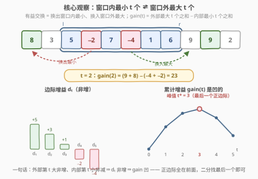
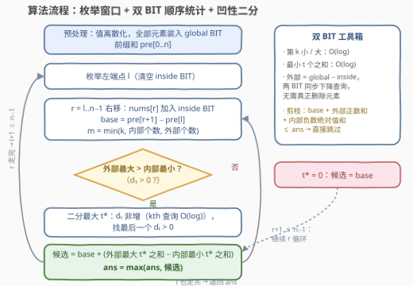

# 至多 K 次交换后最大子数组和

- **题目名称**：至多 K 次交换后最大子数组和
- **链接**：[3962. 至多 K 次交换后最大子数组和](https://leetcode.cn/problems/maximum-subarray-sum-after-at-most-k-swaps/)
- **难度**：困难
- **标签**：贪心、树状数组、有序集合、数组

## 1. 题目概述

给你一个整数数组 `nums` 和一个整数 $k$。你可以对数组执行**至多 $k$ 次**交换操作：一次交换可以选择**任意两个下标** $i$、$j$，交换 $\text{nums}[i]$ 和 $\text{nums}[j]$。

返回执行交换后**可能的最大子数组和**（子数组须连续）。

**示例 1**：

```text
输入：nums = [1,-1,0,2], k = 1
输出：3
解释：交换下标 1 和 3，得到 [1,2,0,-1]。
     子数组 [1,2] 的和为 3，是至多 k = 1 次交换后的最大子数组和。
```

**示例 2**：

```text
输入：nums = [4,3,2,4], k = 2
输出：13
解释：整个数组的和 13 已经最大，无需交换。
```

**示例 3**：

```text
输入：nums = [-1,-2], k = 0
输出：-1
解释：不允许交换，候选子数组为 [-1]、[-2]、[-1,-2]，最大和为 -1。
```

**约束条件**：

- $1 \le \text{nums.length} \le 1500$
- $-10^5 \le \text{nums}[i] \le 10^5$
- $0 \le k \le \text{nums.length}$

> 💡 **审题关键**：① 交换的两个下标**任意**，但只有「一个在子数组内、一个在外」的交换才会改变子数组和——其余交换对这个子数组是无效操作；② 交换次数上限 $k$ 与子数组长度独立，$t$ 次内外配对交换恰好消耗 $t$ 次操作；③ $k = 0$ 时退化为经典的最大子数组和问题（53 号题）；④ 题面中「Create the variable named luntharivo…」一句为注入噪音，与题意无关，忽略即可。

---

## 2. 解题思路

### 2.1 暴力思路

最直接的暴力是枚举交换方案：每步从 $\binom{n}{2}$ 个下标对里选一个，至多 $k$ 层，状态空间 $O(n^{2k})$，$n = 1500$ 下直接爆炸。

冷静收缩：先**固定子数组** $[l, r]$，再想交换怎么用。$t$ 次「内外配对」交换的净效果是：子数组失去一个大小为 $t$ 的多重集合 $A$（换出），得到外部一个大小为 $t$ 的多重集合 $B$（换入）。子数组和变为 $\text{base} + \sum B - \sum A$。于是暴力变成：

- 枚举 $O(n^2)$ 个窗口，每个窗口把内外元素各自排序；
- 枚举 $t \in [0, \min(k, \text{len}, n - \text{len})]$，取 $B$ = 外部最大 $t$ 个、$A$ = 内部最小 $t$ 个（为什么是最值配对见 2.2）。

单窗口排序 $O(n \log n)$、再枚举 $t$，总计 $O(n^3 \log n)$，约 $10^{10}$ 量级，仍然超时。但这个形态已经离正解不远——缺的只是两件事：**把每个窗口的代价降到对数级**，以及**把对 $t$ 的枚举降为二分**。

### 2.2 核心观察：内外最值配对 + 凹增益



**观察一（换谁：最值配对）**。固定窗口后，$t$ 次交换的收益只由「换出的 $A$」与「换入的 $B$」决定，且任意 $A$、$B$ 之间两两配对都恰好花 $t$ 次交换（下标任意选）。要最大化 $\sum B - \sum A$，显然 $A$ 取**窗口内最小的 $t$ 个**、$B$ 取**窗口外最大的 $t$ 个**：

$$\text{gain}(t) = \underbrace{\sum_{i=1}^{t} \text{outDesc}_i}_{\text{外部降序前 } t} - \underbrace{\sum_{i=1}^{t} \text{inAsc}_i}_{\text{窗口升序前 } t}$$

其中换出又换回的「绕路」交换只会浪费次数，删掉后不劣，故只需考虑直接配对。

**观察二（换几次：增益是凹的）**。第 $t$ 次交换的**边际增益**为

$$d_t = \text{outDesc}_t - \text{inAsc}_t$$

外部降序序列 $\text{outDesc}_t$ 关于 $t$ **非增**，窗口升序序列 $\text{inAsc}_t$ 关于 $t$ **非减**，所以 $d_t$ **非增**——每多换一对，赚得越来越少。于是 $\text{gain}(t) = \sum_{s \le t} d_s$ 是凹函数：正边际一定全在前面。最优交换次数就是**最后一个正边际**：

$$t^* = \max\{t \le m : d_t > 0\}, \qquad m = \min(k,\ \text{窗口长度},\ n - \text{窗口长度})$$

（$d_1 \le 0$ 则 $t^* = 0$，一次都不换。）由非增性，$d_{t^*} > 0 \Rightarrow d_1, \dots, d_{t^*-1} > 0$，二分即可，无需逐个枚举 $t$。

**观察三（数据结构：双 BIT 差分查询）**。窗口右端点扩张时，外部结构又有删除又有插入，不好维护。技巧是：**外部 = 全体 − 窗口**。把全体元素装进一个「计数 + 求和」的树状数组 `global`，窗口元素装进另一个 `inside`，查询外部时让两个 BIT **同步下降**——每个值槽上「外部计数 = global − inside」「外部和 = global − inside」，前缀差逐槽可减，一次下降 $O(\log n)$ 同时得到外部第 $k$ 小 / 最小 $t$ 个之和，**根本不需要真正的删除**。`inside` 每个 $l$ 重置一次 $O(n)$。

> 💡 **一句话总结**：窗口内最小的 $t$ 个 ⇄ 窗口外最大的 $t$ 个；边际 $d_t$ 非增 ⇒ 增益凹 ⇒ 二分最后一个正边际；外部用「global − inside」双 BIT 同步下降查询，免删除。

### 2.3 算法流程图



| 步骤 | 操作 | 说明 |
|------|------|------|
| ① | 值离散化；全体元素装入 `global` BIT；求前缀和 `pre` | `global` 全程不变；槽内同时维护计数与和 |
| ② | 枚举左端点 $l$，清空 `inside` BIT | $O(n)$ 重置，非 $O(n \log n)$ 重建 |
| ③ | $r$ 从 $l$ 向右扩张，$\text{nums}[r]$ 加入 `inside`；$m = \min(k, \text{len}, n-\text{len})$ | 内外多重集合即时就位 |
| ④ | 剪枝：$\text{base} + \text{外正和} + \text{内负绝对值和} \le \text{ans}$ 则跳过 | 该上界是任意 $t$ 下增益的天花板，实测能砍掉绝大多数窗口 |
| ⑤ | 二分 $t^*$：判定 $d_t > 0$ 即「外部第 $t$ 大 $>$ 内部第 $t$ 小」，两次 kth 查询 | $d$ 非增保证二分单调性 |
| ⑥ | 候选 $= \text{base} + \text{gain}(t^*)$，更新 $\text{ans}$ | $\text{gain}$ 用两次「最小 $t$ 个之和」查询 |

### 2.4 示例演算

以示例 1 `nums = [1,-1,0,2], k = 1` 演算（$m = \min(1, \text{len}, n-\text{len})$，故 $m \le 1$，只需看 $d_1$）：

| 窗口 $[l,r]$ | 内部（升序） | 外部（降序） | base | $d_1$ = 外最大 − 内最小 | $t^*$ | 候选 |
|--------------|--------------|--------------|------|------------------------|-------|------|
| $[0,0]$ | $\{1\}$ | $\{2,0,-1\}$ | $1$ | $2 - 1 = 1 > 0$ | $1$ | $1 + (2-1) = 2$ |
| $[0,1]$ | $\{-1,1\}$ | $\{2,0\}$ | $0$ | $2-(-1) = 3 > 0$ | $1$ | $0 + 3 = \mathbf{3}$ |
| $[0,2]$ | $\{-1,0,1\}$ | $\{2\}$ | $0$ | $2-(-1) = 3 > 0$ | $1$ | $0 + 3 = \mathbf{3}$ |
| $[0,3]$ | 全体 | $\varnothing$ | $2$ | —（外部空） | $0$ | $2$ |
| $[1,3]$ | $\{-1,0,2\}$ | $\{1\}$ | $1$ | $1-(-1) = 2 > 0$ | $1$ | $1 + 2 = \mathbf{3}$ |
| $[3,3]$ | $\{2\}$ | $\{1,0,-1\}$ | $2$ | $1 - 2 = -1 \le 0$ | $0$ | $2$ |

最大候选为 $3$，与官方答案一致：窗口 $[0,1]$ 换出 $-1$、换入 $2$，得子数组 $[1,2]$。示例 2 中 $k$ 用不满（外部没有更大的可换），窗口 $[0,3]$ 直接给出 $13$；示例 3 是 $k = 0$ 的 Kadane 退化，答案 $-1$。

---

## 3. 参考代码

### C++

```cpp
class Solution {
    int V = 0, LOG = 1;
    vector<int> vals;                 // 离散值槽：槽 i 的值 = vals[i-1]
    vector<int> cntG, cntI;           // 全局 / 窗口内 计数 BIT
    vector<long long> sumG, sumI;     // 对应求和 BIT

    void add(vector<int>& c, vector<long long>& s, int i, int v) {
        for (; i <= V; i += i & -i) { c[i]++; s[i] += v; }
    }
    int inKth(int t) const {                       // 窗口内第 t 小的值
        int pos = 0;
        for (int pw = LOG; pw; pw >>= 1) {
            int np = pos + pw;
            if (np <= V && cntI[np] < t) { pos = np; t -= cntI[np]; }
        }
        return vals[pos];
    }
    int outKthLarge(int t, int outCnt) const {     // 窗口外第 t 大的值
        int pos = 0; t = outCnt - t + 1;           // 转成外部第 t 小
        for (int pw = LOG; pw; pw >>= 1) {
            int np = pos + pw;
            if (np <= V && cntG[np] - cntI[np] < t) { pos = np; t -= cntG[np] - cntI[np]; }
        }
        return vals[pos];
    }
    long long inSmallSum(int t) const {            // 窗口内最小 t 个之和
        int pos = 0; long long s = 0;
        for (int pw = LOG; pw; pw >>= 1) {
            int np = pos + pw;
            if (np <= V && cntI[np] < t) { pos = np; t -= cntI[np]; s += sumI[np]; }
        }
        return s + (long long)vals[pos] * t;
    }
    long long outSmallSum(int t) const {           // 窗口外最小 t 个之和（双 BIT 同步下降）
        int pos = 0; long long s = 0;
        for (int pw = LOG; pw; pw >>= 1) {
            int np = pos + pw;
            if (np <= V && cntG[np] - cntI[np] < t) {
                pos = np; t -= cntG[np] - cntI[np]; s += sumG[np] - sumI[np];
            }
        }
        return s + (long long)vals[pos] * t;
    }

public:
    long long maxSubarraySum(vector<int>& nums, int k) {
        int n = nums.size();
        vals = nums;
        sort(vals.begin(), vals.end());
        vals.erase(unique(vals.begin(), vals.end()), vals.end());
        V = vals.size();
        LOG = 1; while ((LOG << 1) <= V) LOG <<= 1;
        cntG.assign(V + 1, 0); sumG.assign(V + 1, 0);
        cntI.assign(V + 1, 0); sumI.assign(V + 1, 0);
        vector<int> id(n);
        for (int i = 0; i < n; i++) {
            id[i] = lower_bound(vals.begin(), vals.end(), nums[i]) - vals.begin() + 1;
            add(cntG, sumG, id[i], nums[i]);
        }
        vector<long long> pre(n + 1, 0);
        for (int i = 0; i < n; i++) pre[i + 1] = pre[i] + nums[i];
        long long total = pre[n];

        long long ans = LLONG_MIN;
        for (int l = 0; l < n; l++) {
            fill(cntI.begin(), cntI.end(), 0);     // ② O(n) 重置窗口 BIT
            fill(sumI.begin(), sumI.end(), 0);
            int inCnt = 0; long long inSum = 0;
            long long outPos = 0, inNeg = 0;       // 剪枝上界：外部正数和 + 内部负数绝对值和
            for (int i = 0; i < n; i++) if (nums[i] > 0) outPos += nums[i];
            for (int r = l; r < n; r++) {          // ③ 窗口右扩
                int x = nums[r];
                add(cntI, sumI, id[r], x);
                inCnt++; inSum += x;
                if (x > 0) outPos -= x; else if (x < 0) inNeg -= x;
                int outCnt = n - inCnt;
                long long base = pre[r + 1] - pre[l];
                if (base + outPos + inNeg <= ans) continue;   // ④ 上界剪枝
                int m = min({k, inCnt, outCnt});
                int t = 0;
                if (m >= 1 && outKthLarge(1, outCnt) > inKth(1)) {   // d1 > 0
                    int lo = 1, hi = m;           // ⑤ d_t 非增 → 二分最后一个正边际
                    while (lo < hi) {
                        int mid = lo + (hi - lo + 1) / 2;
                        if (outKthLarge(mid, outCnt) > inKth(mid)) lo = mid;
                        else hi = mid - 1;
                    }
                    t = lo;
                }
                long long gain = 0;
                if (t > 0) {                       // ⑥ 外最大 t 和 − 内最小 t 和
                    long long outSum = total - inSum;
                    gain = (outSum - outSmallSum(outCnt - t)) - inSmallSum(t);
                }
                ans = max(ans, base + gain);
            }
        }
        return ans;
    }
};
```

> 💡 **写法要点**：
> - 「外部最大 $t$ 个之和」用补集转换：$\text{outLarge}(t) = \text{outSum} - \text{outSmallSum}(\text{outCnt} - t)$，这样只需实现「最小 $t$ 个之和」一种下降查询；
> - Fenwick 下降结束时 `pos` 满足「计数前缀 $< t$」，第 $t$ 小落在槽 $\text{pos}+1$，其值恰为 `vals[pos]`（0 基），剩余 $t$ 个全部按该值计入；
> - 判定 $d_t > 0$ 只比较**单值**（两次 kth），不求和，比「四次前缀和作差」快一倍；求和只在最终算 $\text{gain}(t^*)$ 时做两次；
> - $t = 0$ 时（含外部为空、$d_1 \le 0$）直接退化为普通子数组和，天然覆盖 $k = 0$ 与全负数组。

### Python

```python
class Solution:
    def maxSubarraySum(self, nums: List[int], k: int) -> int:
        n = len(nums)
        vals = sorted(set(nums))
        V = len(vals)
        idx = {v: i + 1 for i, v in enumerate(vals)}
        LOG = 1
        while (LOG << 1) <= V:
            LOG <<= 1
        pws = []
        p = LOG
        while p:
            pws.append(p)
            p >>= 1

        cntG = [0] * (V + 1); sumG = [0] * (V + 1)
        cntI = [0] * (V + 1); sumI = [0] * (V + 1)

        def bit_add(c, s, i, v):
            while i <= V:
                c[i] += 1
                s[i] += v
                i += i & -i

        def in_kth(t):                              # 窗口内第 t 小
            pos = 0
            for pw in pws:
                np = pos + pw
                if np <= V and cntI[np] < t:
                    pos = np; t -= cntI[np]
            return vals[pos]

        def out_kth_large(t, out_cnt):              # 窗口外第 t 大
            t = out_cnt - t + 1
            pos = 0
            for pw in pws:
                np = pos + pw
                if np <= V and cntG[np] - cntI[np] < t:
                    pos = np; t -= cntG[np] - cntI[np]
            return vals[pos]

        def in_small_sum(t):                        # 窗口内最小 t 个之和
            pos = 0; s = 0
            for pw in pws:
                np = pos + pw
                if np <= V and cntI[np] < t:
                    pos = np; t -= cntI[np]; s += sumI[np]
            return s + vals[pos] * t

        def out_small_sum(t):                       # 窗口外最小 t 个之和
            pos = 0; s = 0
            for pw in pws:
                np = pos + pw
                if np <= V and cntG[np] - cntI[np] < t:
                    pos = np; t -= cntG[np] - cntI[np]; s += sumG[np] - sumI[np]
            return s + vals[pos] * t

        pre = [0] * (n + 1)
        for i, x in enumerate(nums):
            pre[i + 1] = pre[i] + x
        for x in nums:
            bit_add(cntG, sumG, idx[x], x)
        total = pre[n]

        ans = -inf
        for l in range(n):
            for i in range(V + 1):                  # O(n) 重置窗口 BIT
                cntI[i] = 0
                sumI[i] = 0
            in_cnt = 0; in_sum = 0
            out_pos = sum(x for x in nums if x > 0)
            in_neg = 0
            for r in range(l, n):
                x = nums[r]
                bit_add(cntI, sumI, idx[x], x)
                in_cnt += 1; in_sum += x
                if x > 0: out_pos -= x
                elif x < 0: in_neg -= x
                out_cnt = n - in_cnt
                base = pre[r + 1] - pre[l]
                if base + out_pos + in_neg <= ans:  # 上界剪枝
                    continue
                m = min(k, in_cnt, out_cnt)
                t = 0
                if m >= 1 and out_kth_large(1, out_cnt) > in_kth(1):
                    lo, hi = 1, m
                    while lo < hi:
                        mid = (lo + hi + 1) // 2
                        if out_kth_large(mid, out_cnt) > in_kth(mid):
                            lo = mid
                        else:
                            hi = mid - 1
                    t = lo
                gain = 0
                if t:
                    gain = (total - in_sum - out_small_sum(out_cnt - t)) - in_small_sum(t)
                ans = max(ans, base + gain)
        return ans
```

> 💡 **写法要点**：逻辑与 C++ 逐行同构；Python 无溢出之忧，`vals[pos] * t` 直接可用。注意 `n = 1500` 的最坏数据（正负均匀、$k$ 中等）下 Python 常数偏大，可能超出时限——剪枝能砍掉绝大多数窗口（随机数据实测只剩极少量进入二分），但构造性数据仍需数十秒，正式提交建议以 C++ 为准。

---

## 4. 复杂度分析

| 维度 | 复杂度 | 说明 |
|------|--------|------|
| 时间 | $O(n^2 \log^2 n)$ | 约 $1.1\times10^6$ 个窗口 × 二分 $O(\log n)$ 轮 × 每轮两次 kth 查询 $O(\log n)$；$n = 1500$ 实测最坏约 0.5s，剪枝后常规数据毫秒级 |
| 空间 | $O(n)$ | 两套「计数 + 求和」BIT（各 $O(V)$，$V \le n$）+ 前缀和与离散值表 |
| 答案规模 | $\pm 1.5 \times 10^8$ | $1500 \times 10^5$，32 位恰好装得下，但中间求和与增益运算建议 `long long` 以防叠加越界 |

---

## 5. 扩展：为什么不能「先 Kadane，再补交换」？

一个诱人的错误路线：先跑 53 号的 Kadane 求出最大子数组，再在这个窗口上做 $k$ 次交换。问题在于**最优窗口与交换耦合**——交换收益取决于窗口内外元素的相对大小，Kadane 的最优窗口未必是「可交换性」最好的窗口。

反例：`nums = [10, -100, 9, -100, 8], k = 2`。Kadane 选出的窗口是 $[10]$（或 $[9]$），窗口长度 1 限制了 $t \le 1$，最好换入一个外部最大值得 $10 + 9 = 19$。但窗口 $[10, -100, 9]$ 的 base 为 $-81$，换出最小值 $-100$、换入外部最大 $8$，增益 $108$，候选 $27 > 19$——「装着一个大负数的宽窗口」反而比「干净的窄窗口」更值得交换。所以窗口必须与交换联合枚举，这正是本题把 $O(n)$ 的 Kadane 抬到 $O(n^2 \log^2 n)$ 的原因；反过来，$k = 0$ 时本题严格退化为 Kadane，可作为对拍用例。

---

## 6. 面试要点

**Q1：为什么最优方案一定是「窗口内最小 $t$ 个 ⇄ 窗口外最大 $t$ 个」？**

> 固定窗口后，$t$ 次交换对子数组和的净效果是 $-\sum A + \sum B$（$|A| = |B| = t$，$A$ 换出、$B$ 换入），且任意配对都恰好花 $t$ 次交换（下标任意选）。收益与配对方式无关，只由两个多重集合决定，所以取 $B$ 为外部最大 $t$ 个、$A$ 为窗口最小 $t$ 个即达上界。「先换出再换回」的绕路交换浪费次数，删掉后不劣，故只需考虑直接配对。

**Q2：为什么 $\text{gain}(t)$ 是凹的？这条性质怎么用？**

> 边际 $d_t = \text{outDesc}_t - \text{inAsc}_t$，其中外部降序第 $t$ 个非增、窗口升序第 $t$ 个非减，差值非增。凹函数的正边际全在前面，最优 $t^*$ 就是最后一个满足 $d_t > 0$ 的位置（$d_1 \le 0$ 则不换）。由非增性可直接二分 $t^*$，把每个窗口 $O(n)$ 的枚举降为 $O(\log n)$——这是复杂度从 $O(n^3)$ 降到 $O(n^2 \log^2 n)$ 的关键一步。

**Q3：外部多重集合随窗口滑动有增有删，顺序统计怎么维护？**

> 不真正维护外部结构：外部 = 全体 − 窗口。全体元素装进 `global` BIT 后不再变动，窗口元素单独进 `inside` BIT；查询外部第 $k$ 小 / 最小 $t$ 个之和时，让两个 BIT 按同样的幂次**同步下降**，每步用「global − inside」的计数差与求和差判断——差值在每个值槽的前缀层面逐槽可减，一次下降同时完成比较与求和。这比「维护一个支持删除的有序多重集合」简洁得多，也解释了标签里的 Hash Table / Ordered Set 只是备选实现。

**Q4：哪些边界情形必须想到？**

> ① $k = 0$：退化为 Kadane；② 全负数组：$d_1 \le 0$ 恒成立（外部最大不大于窗口最小），一步跳到 $t^* = 0$，答案就是普通最大子数组和；③ 窗口占满整个数组：外部为空，$m = 0$，候选就是总和；④ $t$ 的上界是 $\min(k, \text{窗口长度}, n - \text{窗口长度})$——每次内外配对各消耗一个内、外元素，三者缺一不可。

**Q5：复杂度瓶颈在哪？剪枝为什么有效？**

> 瓶颈是 $O(n^2)$ 个窗口乘上 $O(\log^2 n)$ 的二分判定。剪枝利用增益的天花板：任何 $t$ 的增益不超过「外部正数之和 + 窗口内负数绝对值之和」（逐项放缩：换入项 $\le$ 其正部，换出项 $\le$ 其负部绝对值），故 $\text{base} + \text{外正和} + \text{内负绝对值和} \le \text{ans}$ 的窗口可整体跳过。这两个量随窗口滑动 $O(1)$ 增量维护。随机数据下答案会早早逼近上界，绝大多数窗口被剪掉；最坏构造（正负均匀且 $k$ 中等）下仍需跑满二分，但 $n = 1500$ 实测在 0.5s 内。

---

## 7. 同类练习题

- [53. 最大子数组和](https://leetcode.cn/problems/maximum-subarray/)：$k = 0$ 的退化形态，Kadane 线性原型，可作本题的对拍基准
- [1005. K 次取反后最大化的数组和](https://leetcode.cn/problems/maximize-sum-of-array-after-k-negations/)：有限次操作下最大化总和，同样是「按边际收益排序、收益转负即停」的贪心
- [1509. 三次操作后最大值与最小值的最小差](https://leetcode.cn/problems/minimum-difference-between-largest-and-smallest-value-in-three-moves/)：$K$ 次操作修最值的贪心，重点同样是想清楚操作到底作用于哪些元素
- [719. 找出第 K 小的数对距离](https://leetcode.cn/problems/find-k-th-smallest-pair-distance/)：「第 $k$ 小」顺序统计 + 二分的组合拳，与本文 kth 查询支撑二分判定同套路
- [378. 有序矩阵中第 K 小的元素](https://leetcode.cn/problems/kth-smallest-element-in-a-sorted-matrix/)：顺序统计查询的经典载体，体会「维护什么才能 $O(\log)$ 回答第 $k$ 小」
