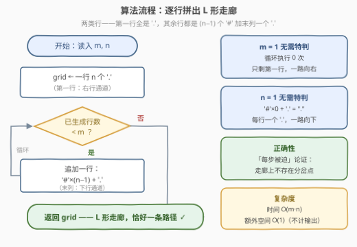

# LeetCode 构造恰好一条路径的网格 题解

## 1. 题目概述

- **标题 / 题号**：构造恰好一条路径的网格（#3963，easy）
- **链接**：https://leetcode.cn/problems/create-grid-with-exactly-one-path/
- **难度**：简单
- **标签**：构造、矩阵

**题意**：给你两个整数 `m` 和 `n`，分别表示网格的行数和列数。

请你构造**任意一个**只包含字符 `'.'` 和 `'#'` 的 $m \times n$ 网格，其中：

- `'.'` 表示空单元格；
- `'#'` 表示障碍物单元格。

**有效路径**是满足以下条件的空单元格序列：

- 从左上角单元格 $( (0, 0) )$ 开始；
- 在右下角单元格 $((m-1, n-1))$ 结束；
- 每一步只能**向右**（从 $(i, j)$ 到 $(i, j+1)$）或**向下**（从 $(i, j)$ 到 $(i+1, j)$）。

返回任意一个从左上角到右下角**恰好只有一条**有效路径的网格。

**示例 1**：

```text
输入：m = 2, n = 3
输出：["..#", "#.."]
解释：唯一的有效路径是 (0,0) → (0,1) → (1,1) → (1,2)。
```

**示例 2**：

```text
输入：m = 3, n = 3
输出：["..#", "#..", "##."]
解释：唯一的有效路径是 (0,0) → (0,1) → (1,1) → (1,2) → (2,2)。
```

**示例 3**：

```text
输入：m = 1, n = 4
输出：["...."]
解释：唯一的有效路径是 (0,0) → (0,1) → (0,2) → (0,3)。
```

**约束**：

- $1 \le m, n \le 25$

> 💡 **审题关键**：① 答案**不唯一**——判定器只检查「路径数是否恰好为 1」，示例输出只是众多合法解之一，任何正确构造均可；② 移动方向只有右、下，路径天然**单调**，因此路径数完全由自由格子的连通形状决定，与格子顺序无关；③ $m, n \le 25$ 规模极小，任何构造性做法的复杂度都绰绰有余——本题考察的是「能否想出一个容易证明唯一性的构造」。

## 2. 解题思路

### 2.1 暴力思路

枚举所有 $2^{mn}$ 种 `'.'`/`'#'` 组合，对每个网格用 DP 数一遍路径数再筛选——天文数字，完全不可行；随机撒障碍再验证，则是在碰运气。

构造题的正确姿势不是「枚举再筛选」，而是**直接设计一个充分条件足够强、正确性足够好证的构造**。

### 2.2 核心观察：保留一条「无分叉走廊」


路径数 = 自由格子中 $(0,0) \to (m-1, n-1)$ 的单调路径条数。全 `'.'` 网格有 $\binom{m+n-2}{m-1}$ 条；要让条数**恰好为 1**，最直接的办法是**把自由格削成一条没有任何岔路的走廊**。

最简单的走廊是 **L 形**：

- **第 0 行**全部放 `'.'` —— 从起点一路向右的通道；
- **其余 $m-1$ 行**：前 $n-1$ 列放 `'#'`，最后一列放 `'.'` —— 沿最右列一路向下的通道。

以 $m=4, n=5$ 为例：

```text
.....
####.
####.
####.
```

**唯一性证明（每一步都被逼着走）**：

- 在 $(0, j)$（$j < n-1$）：向下踩到 `'#'`（$m \ge 2$ 时），只能向右；$m = 1$ 时根本没有向下这个选项，同样只能向右；
- 在 $(0, n-1)$（$m \ge 2$ 时）：向右出界，只能向下，且 $(1, n-1)$ 恰好是 `'.'`；
- 在 $(i, n-1)$（$1 \le i < m-1$）：向右出界，只能向下。

路径上每个格子的下一步都**唯一确定**，不存在任何分岔点，因此从 $(0,0)$ 出发的可行路径至多一条；又因为这条被迫的路线全程踩在 `'.'` 上并最终到达 $(m-1, n-1)$，路径**存在**。存在性 + 唯一性齐备，构造合法。

> 💡 **边界自然覆盖**：$m = 1$ 时循环体不执行，网格只剩第一行，被迫一路向右；$n = 1$ 时每行退化为 `'#'`×0 + `'.'` = `"."`，被迫一路向下——两种退化情形被同一公式覆盖，无需特判。

### 2.3 算法流程图



| 步骤 | 操作 | 说明 |
|------|------|------|
| ① | 生成第 0 行 | $n$ 个 `'.'`，即右行通道 |
| ② | 循环 $m-1$ 次 | 每次追加一行 `'#'`×$(n-1)$ + `'.'`，即下行通道 |
| ③ | 返回 grid | L 形走廊，恰好一条路径 |

### 2.4 示例演算

**示例 2：m = 3, n = 3**，套用 L 形构造：

```text
...
##.
##.
```

被迫的路线：$(0,0) \to (0,1) \to (0,2) \to (1,2) \to (2,2)$，共 $m+n-1 = 5$ 个格子。

与官方输出的 `["..#", "#..", "##."]`（一条「右-下-右-下」阶梯）不同，但同为合法解——题目只要求**任意一个**。

## 3. 参考代码

### C++

```cpp
class Solution {
  public:
    vector<string> createGrid(int m, int n) {
        vector<string> grid;
        grid.push_back(string(n, '.'));                 // 第一行：一路向右
        for (int i = 1; i < m; i++)
            grid.push_back(string(n - 1, '#') + ".");   // 其余行：封死 + 末列向下
        return grid;
    }
};
```

### Python

```python
class Solution:
    def createGrid(self, m: int, n: int) -> list[str]:
        grid = ["." * n]                       # 第一行：一路向右
        for _ in range(m - 1):
            grid.append("#" * (n - 1) + ".")   # 其余行：封死 + 末列向下
        return grid
```

> 💡 **写法要点**：`string(n-1, '#') + "."` 在 $n=1$ 时自然退化为单个 `"."`，$m=1$ 时循环体不执行——**所有边界都被表达式本身消化**，代码里没有任何 `if`。

## 4. 复杂度分析

| 维度 | 复杂度 | 说明 |
|------|--------|------|
| 时间 | $O(m \cdot n)$ | 生成 $m$ 行、每行 $n$ 个字符，每格 $O(1)$ |
| 空间 | $O(m \cdot n)$ | 输出网格本身；不计输出为 $O(n)$（逐行构造后加入答案） |
| 数据规模 | $m, n \le 25$ | 至多 $625$ 格，一次构造即过，无任何性能压力 |

## 5. 扩展：其他构造与「更少的障碍」

**构造不唯一**。任何一条从 $(0,0)$ 到 $(m-1,n-1)$ 的**单调通路**（先下后右的对称 L、之字形、任意阶梯）保留自由、其余封死，都合法——官方示例给的就是阶梯形。L 形只是其中**最好写、最好证**的一种。

**如何验证任意构造**？用 63 题「不同路径 II」的计数 DP：$f[i][j] = f[i-1][j] + f[i][j-1]$（障碍处为 0），检查 $f[m-1][n-1] = 1$ 即可。本地对 $m, n \in [1, 25]$ 全量验证过本文构造，路径数恒为 1。

**障碍数可以更少吗**？L 形用了 $mn - (m+n-1)$ 个 `'#'`，但未必最少：

- $2 \times n$ 只需 **1 个**：封住 $(0,1)$，得 `[".#...", "....."]`——路径被迫立刻下移，再一路向右；
- $3 \times 3$ 只需 **2 个**：`[".#.", "...", ".#."]`——上下两个障碍把路径逼成中间横穿的 S 形。

一般情形的最少障碍数等价于「保留最多自由格仍恰好一条路径」，是个有趣的组合思考题；而本题只要求任意合法解，**不必追求最优**——这正是构造题与优化题的分野。

## 6. 面试要点

**Q1：为什么 L 形构造恰好只有一条路径？**

> 「每步被迫」论证：在走廊的水平段 $(0, j)$（$j<n-1$）向下是 `'#'`，只能右；在拐角 $(0, n-1)$ 向右出界，只能下；在竖直段 $(i, n-1)$ 向右出界，只能下。路径上不存在任何分岔点，可行路径至多一条；被迫的路线又全程踩 `'.'` 到达终点，路径存在——存在性与唯一性齐备。

**Q2：构造题的通用心法是什么？**

> 先找一个**充分条件足够强、正确性足够好证**的构造，而不是先想最优解。本题「保留一条无分叉走廊 → 路径数必为 1」就是这样一个强充分条件；答案不唯一时，优先选择边界情形（如 $m=1$、$n=1$）能被公式自然覆盖的构造，从根源上消灭特判。

**Q3：如何验证自己返回的网格一定正确？**

> 用障碍网格路径计数 DP：$f[i][j] = f[i-1][j] + f[i][j-1]$，障碍与越界处为 0，$f[0][0]=1$，最终检查 $f[m-1][n-1] = 1$。这是 63 题「不同路径 II」的原样复用，也常被在线判定器用作标答逻辑。

**Q4：$m=1$ 或 $n=1$ 的边界怎么办？**

> 无需特判：$m=1$ 时追加行的循环执行 0 次，网格只剩全 `'.'` 的第一行（被迫一路向右）；$n=1$ 时 `'#'×(n-1)+'.'` 退化为单个 `"."`（被迫一路向下）。把边界写进表达式而不是写进 `if`，是消灭边界 bug 的关键手法。

**Q5：如果要求恰好 $k$ 条路径呢？**

> 难度陡增：需要反推「自由格集合的路径计数恰为 $k$」，一般没有简单闭式构造。可行方向是先写出全空网格的计数 DP，再逐格放障碍观察计数变化（每个 `'#'` 会减掉经过它的那些路径），本质上变成了一个带约束的逆问题，远超本题范围。

## 同类练习题

| # | 题目 | 与本题的关联 |
|---|------|-------------|
| 62 | [不同路径](https://leetcode.cn/problems/unique-paths/) | 全空网格的路径计数 $\binom{m+n-2}{m-1}$，是本题「为什么全放 `'.'` 不行」的定量对照 |
| 63 | [不同路径 II](https://leetcode.cn/problems/unique-paths-ii/) | 带障碍的路径计数 DP，可直接用作本题任意构造的正确性验证器 |
| 1605 | [给定行和列的和求可行矩阵](https://leetcode.cn/problems/find-valid-matrix-given-row-and-column-sums/) | 同款构造心法——答案不唯一，找一个充分条件强、好验证的构造即可 |
| 767 | [重构字符串](https://leetcode.cn/problems/reorganize-string/) | 构造题经典——先确立可行性判据，再显式构造任意一个合法解 |
| 984 | [不含 AAA 或 BBB 的字符串](https://leetcode.cn/problems/string-without-aaa-or-bbb/) | 贪心逐位构造，同样「只需给出任意一个合法解」 |
