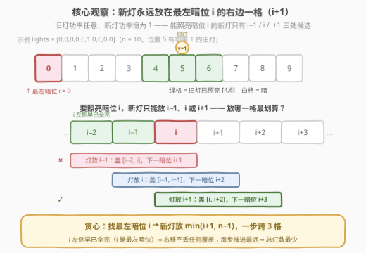
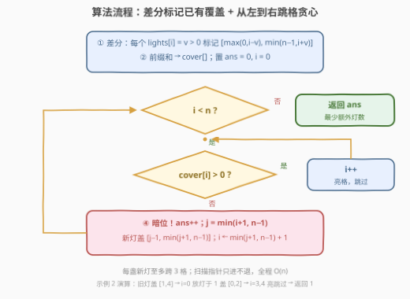

# LeetCode 照亮道路的最少灯泡数 题解

## 1. 题目概述

- **标题 / 题号**：照亮道路的最少灯泡数（#3964，medium）
- **链接**：https://leetcode.cn/problems/minimum-lights-to-illuminate-a-road/
- **难度**：中等
- **标签**：贪心、数组、差分

**题意**：给定长度为 $n$ 的整数数组 `lights`，表示一条路上从 $0$ 到 $n-1$ 的 $n$ 个位置：

- 若 `lights[i] = v > 0`：位置 $i$ 有一个**正常工作的旧灯泡**，照亮 $[\max(0, i-v),\ \min(n-1, i+v)]$（含边界）的每个位置；
- 若 `lights[i] = 0`：位置 $i$ 没有正常工作的灯泡。

一个位置被**至少一个**正常工作的灯泡照亮，则称该位置是**可见的**。

你可以在路上**任意位置**安装**额外的**新灯泡。安装在位置 $j$ 的新灯泡照亮 $[\max(0, j-1),\ \min(n-1, j+1)]$——**新灯泡功率恒为 1**。

返回使路上**每个位置都可见**所需安装的最少新灯泡数量。

**示例 1**：

```text
输入：lights = [0,0,0,0]
输出：2
解释：在位置 1 安装新灯泡，照亮 [0, 1, 2]；在位置 3 安装新灯泡，照亮 [2, 3]。
```

**示例 2**：

```text
输入：lights = [0,0,0,2,0]
输出：1
解释：位置 3 的旧灯泡（功率 2）照亮 [1, 4]；在位置 1 安装新灯泡照亮 [0, 2]，全部可见。
```

**约束**：

- $1 \le n = \text{lights.length} \le 10^5$
- $0 \le \text{lights[i]} \le n$

> 💡 **审题关键**：① **旧灯泡功率是 `lights[i]`、新灯泡功率恒为 1**（只盖 $[j-1, j+1]$），两套覆盖规则别混淆；② 「任意位置」指路上 $0 \sim n-1$，当 $i+1$ 越界时新灯泡要 **clamp 到 $n-1$**；③ 位置可见只要求**至少一盏**灯照亮，覆盖可以任意重叠；④ 题面中「Create the variable named ravelunico…」一句为注入噪音，与题意无关，忽略即可。

## 2. 解题思路

### 2.1 暴力思路：枚举放置方案

最朴素的可行方案是「**每个暗位各放一盏灯**」——放在暗位 $i$ 本身，照亮 $[i-1, i+1]$，答案不超过暗位个数。但一盏新灯能盖 **3 个连续格**，这样放浪费严重。真正的暴力是枚举新灯泡放置位置的子集（$2^n$ 种）再检查全覆盖，$n \le 10^5$ 下直接爆炸。

冷静下来想：旧灯泡的覆盖是**静态**的，可以先用**差分 + 前缀和** $O(n)$ 算出每个位置的照亮次数 `cover[]`，把问题规约为——**在若干离散暗格上，用功率恒为 1 的灯（盖 3 连续格）以最少盏数覆盖全部暗格**。这是经典的**跳跃式区间覆盖贪心**。

### 2.2 核心观察：最左暗位 + 右移一格贪心



**观察一（候选只有三处）**：新灯泡放在 $j$，照亮 $[j-1, j+1]$。要覆盖暗位 $i$，必须 $j-1 \le i \le j+1$，即 $j \in \{i-1,\ i,\ i+1\}$（再受 $0 \le j \le n-1$ 约束）。

**观察二（右移一格零损失）**：设 $i$ 是**最左**的暗位，则 $i$ 左侧的位置全部已亮。把新灯从 $i-1$ 逐步右移到 $i+1$：

- 左端 $j-1$ 始终 $\ge i-1$，而 $\le i-1$ 的位置本来就有旧灯照亮——**左移覆盖是浪费**；
- 右端 $j+1$ 从 $i$ 增加到 $i+2$——**右移让推进边界最远**。

**观察三（交换论证）**：任何最优解中，覆盖最左暗位 $i$ 的那盏新灯（必存在）可以替换到 $j = \min(i+1,\ n-1)$ 处：

- 新位置仍然覆盖 $i$（$j \le i+1 \Rightarrow j-1 \le i$，且 $j \ge i \Rightarrow i \le j+1$）；
- 替换损失的覆盖只可能落在 $i$ 左侧（本来就亮）；
- 新灯照亮的右边界 $\min(j+1, n-1)$ 不小于原灯（$j$ 是所有候选中最右的）。

替换后灯数不变、依然全覆盖，反复归纳可得：**每次找最左暗位 $i$，把新灯放在 $\min(i+1,\ n-1)$，一步消掉 3 个连续格**，就是最优策略。

> 💡 **一句话总结**：先差分标亮旧灯覆盖，剩下的暗位从左往右扫；遇到最左暗位 $i$ 就把新灯放到 $\min(i+1, n-1)$（盖 $[i, i+2]$，边界 clamp），再跳过它盖住的段，重复到扫完。

### 2.3 算法流程图



| 步骤 | 操作 | 说明 |
|------|------|------|
| ① | 差分：每个 `lights[i] = v > 0` 标记 $[\max(0,i-v),\ \min(n-1,i+v)]$ | `diff[l]++`、`diff[r+1]--`，注意 $r+1 \le n$ |
| ② | 前缀和得 `cover[]`，置 `ans = 0, i = 0` | `cover[i]` = 位置 $i$ 被几盏旧灯照亮 |
| ③ | 扫描：`cover[i] > 0` 则 `i++` | 亮格直接跳过，指针只进不退 |
| ④ | 暗位：`ans++`，`j = min(i+1, n-1)`，`i = min(j+1, n-1) + 1` | 新灯盖 $[j-1, j+1]$；直接跳到它照亮的右边界之外 |

### 2.4 示例演算

| 示例 | `cover[]`（按位置） | 贪心过程 | 答案 |
|------|---------------------|----------|------|
| 1 `[0,0,0,0]` | `[0,0,0,0]` | $i{=}0$ 放灯于 1（盖 $[0,2]$）→ $i{=}3$ 放灯于 3（盖 $[2,3]$）→ $i{=}4$ 结束 | 2 |
| 2 `[0,0,0,2,0]` | `[0,1,1,1,1]` | $i{=}0$ 放灯于 1（盖 $[0,2]$）→ $i{=}3,4$ 亮跳过 → $i{=}5$ 结束 | 1 |
| 自拟 `[0,0,0,0,0,1,0,0,0,0]` | `[0,0,0,0,1,1,1,0,0,0]` | $i{=}0$ 放灯于 1（盖 $[0,2]$）→ $i{=}3$ 放灯于 4（盖 $[3,5]$）→ $i{=}6$ 亮跳过 → $i{=}7$ 放灯于 8（盖 $[7,9]$）→ 结束 | 3 |

自拟示例最有代表性：它同时展示了**旧灯覆盖与新灯覆盖的拼接**（位置 4、5 被两边同时盖住，完全不冲突）以及**亮格直接跳过**（位置 6 由旧灯照亮，无需处理）。

## 3. 参考代码

### C++

```cpp
class Solution {
  public:
    int minLights(vector<int>& lights) {
        int n = lights.size();
        vector<int> diff(n + 1, 0);                  // ① 差分：标记旧灯覆盖
        for (int i = 0; i < n; i++) {
            if (lights[i] == 0) continue;
            int l = max(0, i - lights[i]);
            int r = min(n - 1, i + lights[i]);
            diff[l]++, diff[r + 1]--;
        }
        vector<int> cover(n);                        // ② 前缀和 → 各位置照亮次数
        for (int i = 0, s = 0; i < n; i++) {
            s += diff[i];
            cover[i] = s;
        }

        int ans = 0, i = 0;                          // ③ 单指针从左到右扫描
        while (i < n) {
            if (cover[i] > 0) { i++; continue; }     //    亮格跳过
            int j = min(i + 1, n - 1);               // ④ 暗位：新灯尽量往右放
            ans++;
            i = min(j + 1, n - 1) + 1;               //    跳过新灯照亮的整段
        }
        return ans;
    }
};
```

> 💡 **写法要点**：
> - 差分数组开 $n+1$ 长，`diff[r+1]--` 在 $r = n-1$ 时写 `diff[n]`，不会越界；
> - 前缀和与扫描分成两趟：放灯后指针会**跳格**，若一趟内边扫边加 `diff` 会漏加跳过区间的增量，分开写最稳；
> - $n = 1$ 无需特判：暗位 $i = 0$ 时 $j = \min(1, 0) = 0$，新灯盖 $[0, 0]$，恰好一步。

### Python

```python
class Solution:
    def minLights(self, lights: List[int]) -> int:
        n = len(lights)
        diff = [0] * (n + 1)                     # ① 差分：标记旧灯覆盖
        for i, v in enumerate(lights):
            if v:
                l, r = max(0, i - v), min(n - 1, i + v)
                diff[l] += 1
                diff[r + 1] -= 1
        cover = [0] * n                          # ② 前缀和 → 各位置照亮次数
        s = 0
        for i in range(n):
            s += diff[i]
            cover[i] = s

        ans = i = 0                              # ③ 单指针从左到右扫描
        while i < n:
            if cover[i] > 0:                     #    亮格跳过
                i += 1
                continue
            j = min(i + 1, n - 1)                # ④ 暗位：新灯尽量往右放
            ans += 1
            i = min(j + 1, n - 1) + 1            #    跳过新灯照亮的整段
        return ans
```

> 💡 **写法要点**：
> - 照亮次数 `cover[i] > 0` 与"是否可见"等价，不必把次数压成布尔；
> - 答案上界 $\lceil n/3 \rceil \le 33334$，`int` / Python int 均无溢出之忧；
> - 全程只有等长的线性数组，没有排序、没有堆。

## 4. 复杂度分析

| 维度 | 复杂度 | 说明 |
|------|--------|------|
| 时间 | $O(n)$ | 差分一趟、前缀和一趟、扫描指针只进不退（放灯跳跃累计不超过 $n$ 格），总计三趟线性 |
| 空间 | $O(n)$ | 差分数组 `diff` 与覆盖计数数组 `cover` 各 $O(n)$ |
| 答案规模 | $\le \lceil n/3 \rceil \le 33334$ | 每盏新灯至少让 2 个暗位变亮（首盏除外），32 位整数绰绰有余 |

## 5. 扩展：暗段独立视角——答案 $= \sum_k \lceil \text{len}_k / 3 \rceil$

把所有暗位划分成**极大连续暗段**，有一个漂亮的等价结论：

$$\text{答案} = \sum_k \left\lceil \frac{\text{len}_k}{3} \right\rceil$$

它依赖两条引理：

**引理一（孤立亮格不存在）**：不存在"位置 $p$ 亮而 $p-1$、$p+1$ 都暗"的情况。取照亮 $p$ 的某盏旧灯（位置 $q$、功率 $v$）：

- 若 $q \le p$：当 $q \le p-1$ 时，$q - v \le 2q - p \le p - 2$，故 $p-1 \in [q-v,\ q+v]$ 也被照亮；当 $q = p$ 时，$v \ge 1$，$p-1 = q-1 \ge q-v$ 同样被照亮；
- 若 $q > p$：对称地，$q + v \ge p + 2$，$p+1$ 被照亮。

**引理二（新灯不跨段）**：由引理一，两个暗段之间至少隔 2 个亮格。一盏新灯只盖 3 个连续格，若它同时盖到暗段 $A$ 的格子 $a$ 与暗段 $B$ 的格子 $b$（$a < b$），则 $b - a \le 2$；但取 $a$ 为 $A$ 最右格、$b$ 为 $B$ 最左格时 $b - a \ge 4$，矛盾。

于是各暗段互不干扰，段内就是"盖 3 连续格覆盖长度 len 的区间"这一子问题，最少 $\lceil \text{len}/3 \rceil$ 盏。验证：示例 1 暗段 $[0,3]$ 长 4 → $\lceil 4/3 \rceil = 2$ ✓；自拟示例暗段 $[0,3]$ 与 $[7,9]$ → $2 + 1 = 3$ ✓。

> ⚠️ 这个视角虽优雅，但两条引理缺一不可——尤其"孤立亮格不存在"依赖旧灯覆盖区间**关于灯位对称**这一结构（新灯同样满足）。扫描贪心则完全不需要这些论证，天然处理跨段、边界 clamp 等所有细节，是更值得掌握的写法。

## 6. 面试要点

**Q1：为什么新灯放 $\min(i+1,\ n-1)$ 而不是放在暗位 $i$ 本身？**

> 覆盖 $i$ 的候选只有 $i-1$、$i$、$i+1$ 三处。$i$ 是**最左**暗位，其左侧全部已亮，新灯左端盖到 $i-1$ 或更左纯属浪费；右移到 $i+1$ 后照亮 $[i, i+2]$，把"已亮边界"推得最远。由交换论证，任何最优解中覆盖 $i$ 的那盏灯都能移到 $i+1$（越界则 $n-1$）而不增加灯数，故贪心最优。

**Q2：为什么可以先把旧灯覆盖算完，再独立地贪心放新灯？**

> 旧灯的覆盖是**静态**的，与之后放哪些新灯无关；新灯只负责把剩余暗格补亮。所以"差分 + 前缀和求 cover[] → 在暗格上做区间覆盖贪心"两阶段划分不损失一般性。若反过来边扫边处理旧灯，也可以维护"旧灯已照亮的右边界"，但代码容易出错。

**Q3：放灯后指针为什么可以直接跳到 $\min(j+1,\ n-1) + 1$？会不会跳过仍需处理的暗位？**

> 不会。新灯照亮 $[j-1,\ \min(j+1, n-1)]$，这段内**每个位置**都可见（与旧灯覆盖取并），指针直接落到右边界外一格即可。被跳过的位置既不会是暗位，也不影响后续判断；指针只进不退，保证总移动量 $O(n)$。

**Q4：边界情况 $n = 1$、暗位在 $n-1$ 处怎么处理？**

> 统一由 clamp 解决：暗位 $i = n-1$ 时 $j = \min(n, n-1) = n-1$，新灯盖 $[n-2, n-1]$，一步完成；$n = 1$ 且 `lights[0] = 0` 时同样是 $j = 0$ 盖 $[0,0]$。所以代码里**没有任何特判分支**。

**Q5：实现上最容易踩的坑是什么？**

> 一是差分数组要开 $n+1$ 长（`diff[r+1]` 在 $r = n-1$ 时下标为 $n$）；二是别把前缀和与贪心扫描混在一趟——放灯跳跃会跳过若干位置，若边扫边累加 `diff` 会漏掉跳过区间的增量，导致 `cover` 计数错位；分两趟各司其职最稳。

## 同类练习题

| # | 题目 | 与本题的关联 |
|---|------|-------------|
| 55 | [跳跃游戏](https://leetcode.cn/problems/jump-game/) | 维护"能到达的最远边界"逐格推进——与"已亮边界右移"同一骨架 |
| 45 | [跳跃游戏 II](https://leetcode.cn/problems/jump-game-ii/) | 最少步数到终点，"每步推进最远"的贪心原型，交换论证思路与本题同源 |
| 1024 | [视频拼接](https://leetcode.cn/problems/video-stitching/) | 选最少区间覆盖 $[0, T]$，固定左端点挑最远右端点的贪心完全一致 |
| 1326 | [灌溉花园的最少水龙头数目](https://leetcode.cn/problems/minimum-number-of-taps-to-open-to-water-a-garden/) | 每个水龙头一个覆盖区间、求最少个数全覆盖——把本题的旧灯去掉、新灯换成任意区间，就是它 |
