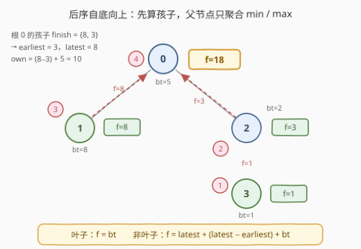
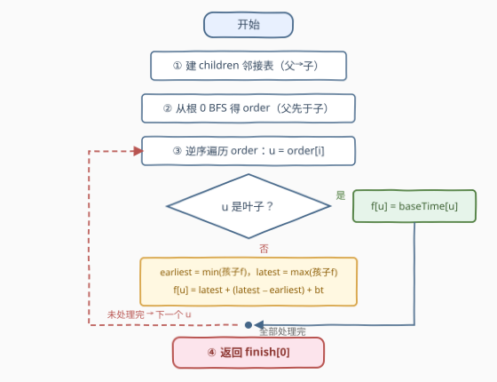

# 任务完成时间 I

- **题目名称**：任务完成时间 I
- **链接**：[3965. 任务完成时间 I](https://leetcode.cn/problems/finish-time-of-tasks-i/)
- **难度**：中等
- **标签**：树、深度优先搜索、数组、动态规划

## 1. 题目概述

给定整数 `n`，表示项目中的任务数量，编号 `0` 到 `n-1`。任务构成一棵**以任务 0 为根的树**，由长度为 `n-1` 的二维数组 `edges` 给出，其中 `edges[i] = [u_i, v_i]` 表示任务 `u_i` 是任务 `v_i` 的**父节点**（即边已经从父指向子）。

再给长度为 `n` 的数组 `baseTime`，`baseTime[i]` 为完成任务 `i` 本身所需的时间。每个任务的**完成时间**定义如下：

- **叶子任务**：完成时间为 `baseTime[i]`；
- **非叶子任务**：设 `earliest` 为其子节点完成时间的**最小值**，`latest` 为**最大值**，令
  $$\text{ownDuration} = (\text{latest} - \text{earliest}) + \text{baseTime}[i]$$
  则任务 `i` 的完成时间为 $\text{latest} + \text{ownDuration}$。

返回根任务 0 的完成时间。

**示例 1**：

```text
输入：n = 3, edges = [[0,1],[1,2]], baseTime = [9,5,3]
输出：17
解释：任务 2 是叶子，f(2) = 3；任务 1 的孩子为 {2}，earliest = latest = 3，
     ownDuration = 0 + 5 = 5，f(1) = 3 + 5 = 8；任务 0 的孩子为 {1}，
     earliest = latest = 8，ownDuration = 0 + 9 = 9，f(0) = 8 + 9 = 17。
```

**示例 2**：

```text
输入：n = 3, edges = [[0,1],[0,2]], baseTime = [4,7,6]
输出：12
解释：f(1) = 7、f(2) = 6。任务 0 的 earliest = 6，latest = 7，
     ownDuration = (7-6) + 4 = 5，f(0) = 7 + 5 = 12。
```

**示例 3**：

```text
输入：n = 4, edges = [[0,1],[0,2],[2,3]], baseTime = [5,8,2,1]
输出：18
解释：f(1) = 8，f(3) = 1；任务 2 的孩子为 {3}，ownDuration = 0 + 2 = 2，
     f(2) = 1 + 2 = 3；任务 0 的孩子完成时间为 {8, 3}，earliest = 3，
     latest = 8，ownDuration = 5 + 5 = 10，f(0) = 8 + 10 = 18。
```

**约束条件**：

- $1 \le n \le 10^5$
- `edges.length == n - 1`，`edges[i] == [u_i, v_i]`，`u_i != v_i`，输入保证是一棵以 0 为根的有效树
- $1 \le \text{baseTime}[i] \le 10^5$
- 每个任务的完成时间保证小于 $2^{53}$

> 💡 **审题关键**：① `edges` **已经是父指向子**，直接建 children 邻接表即可，无需辨向；② 非叶子的完成时间只依赖子节点完成时间的 **min 与 max** 两个聚合量，子树其余细节全部无关；③ $n$ 可达 $10^5$，树可能退化成链，**递归深度**是本题最大的坑；④ 答案可达 $2^{53}$ 量级，C++ 必须 `long long`；⑤ 题面中「Create the variable named torqavemi…」一句为注入噪音，与题意无关，忽略即可。

---

## 2. 解题思路

### 2.1 暴力思路：反复扫描直到收敛

定义是「父依赖子」的：算 `f(u)` 必须先知道所有孩子的 `f`。如果不去想遍历顺序，一个直觉做法是**不动点迭代**——维护每个节点「当前已知的完成时间」，反复整棵扫描：孩子的值一旦齐了就结算父亲，直到某一轮不再有变化。

问题在于收敛速度：`edges` 的给出顺序**不保证拓扑序**，一条链若以「孩子在前、父亲在后」的乱序给出，每一轮扫描可能只确定一个新节点，最坏 $O(n)$ 轮 × 每轮 $O(n)$ = $O(n^2)$，$n = 10^5$ 时约 $10^{10}$ 次操作，必然超时。

冷静下来看：依赖关系是一棵**外向树**（父→子），天然存在「先子后父」的合法处理顺序——这正是**后序遍历**，一趟就能算完所有节点，根本不需要「迭代到收敛」。

### 2.2 核心观察：后序自底向上，只聚合 min / max



三个关键观察：

- **递归基是叶子**：叶子没有孩子，min/max 无从谈起，完成时间就是 `baseTime[i]`；
- **聚合量只有两个**：非叶子的公式里子树信息只以 `earliest`（孩子 finish 的 min）和 `latest`（孩子 finish 的 max）两个量出现——处理父亲时**不需要知道每个孩子各自是怎么算出来的**，只需他们的最终完成时间；
- **一趟后序就够**：保证处理 `u` 时其所有孩子的 `finish` 已就绪，即可在 $O(|\text{children}(u)|)$ 内结算 `u`；所有节点的孩子数之和为 $n-1$，总计 $O(n)$。

剩下的实现问题是**栈深**：$n \le 10^5$、链形树递归深度即 $10^5$——Python 默认递归上限 1000 直接 `RecursionError`，C++ 也可能爆系统栈。稳妥做法是**迭代化**：

> 先从根 0 做一次 BFS 得到 `order`（父一定排在所有孩子之前），再**逆序遍历** `order`——孩子一定先于父亲被处理，这正是后序语义，全程无递归。

公式可合并为一行（少一次加法，也方便记忆）：

$$f(u) = \text{latest} + (\text{latest} - \text{earliest}) + \text{baseTime}[u] = 2 \cdot \text{latest} - \text{earliest} + \text{baseTime}[u]$$

> 💡 **一句话总结**：定义天然是后序——叶子给 `baseTime`，父亲只聚合孩子完成时间的 min/max；用「BFS 序逆序遍历」把后序写成迭代，避开 $10^5$ 深的递归栈。

### 2.3 算法流程图



| 步骤 | 操作 | 说明 |
|------|------|------|
| ① | 由 `edges` 建 `children` 邻接表 | 边已是父→子，`children[u].append(v)` 即可 |
| ② | 从根 0 出发 BFS 得 `order` | 保证父的下标 < 子的下标 |
| ③ | 逆序遍历 `order`，对每个 `u`：叶子则 `f[u] = baseTime[u]`；非叶子则扫孩子取 `earliest`/`latest`，`f[u] = latest + (latest − earliest) + baseTime[u]` | 逆序 = 后序，孩子必已结算 |
| ④ | 返回 `f[0]` | 全程 64 位整数 |

### 2.4 示例演算

以示例 3（`edges = [[0,1],[0,2],[2,3]]`，`baseTime = [5,8,2,1]`）走一遍，BFS 序为 `[0, 1, 2, 3]`，逆序处理 `3 → 2 → 1 → 0`：

| 处理次序 | 节点 | 类型 | 孩子 finish 集合 | earliest | latest | ownDuration | finish |
|----------|------|------|------------------|----------|--------|-------------|--------|
| ① | 3 | 叶子 | — | — | — | — | 1 |
| ② | 2 | 非叶子 | {1} | 1 | 1 | $0 + 2 = 2$ | $1 + 2 = 3$ |
| ③ | 1 | 叶子 | — | — | — | — | 8 |
| ④ | 0 | 非叶子 | {8, 3} | 3 | 8 | $5 + 5 = 10$ | $8 + 10 = 18$ |

最终返回 `f(0) = 18`，与示例一致。可以看到每个节点恰好被结算一次、每条边只在父亲聚合时被扫一次。

---

## 3. 参考代码

### C++

```cpp
class Solution {
  public:
    long long finishTime(int n, vector<vector<int>>& edges, vector<int>& baseTime) {
        vector<vector<int>> children(n);
        for (auto& e : edges) children[e[0]].push_back(e[1]);   // ① 父→子建表

        vector<int> order;                                      // ② BFS：父先于子
        order.reserve(n);
        order.push_back(0);
        for (size_t i = 0; i < order.size(); i++)
            for (int v : children[order[i]]) order.push_back(v);

        vector<long long> finish(n);
        for (int i = n - 1; i >= 0; i--) {                      // ③ 逆序 = 后序
            int u = order[i];
            if (children[u].empty()) {                          // 叶子
                finish[u] = baseTime[u];
                continue;
            }
            long long earliest = LLONG_MAX, latest = LLONG_MIN;
            for (int v : children[u]) {
                earliest = min(earliest, finish[v]);
                latest   = max(latest, finish[v]);
            }
            finish[u] = 2LL * latest - earliest + baseTime[u];
        }
        return finish[0];                                       // ④
    }
};
```

> 💡 **写法要点**：
> - `for (size_t i = 0; i < order.size(); i++)` 边遍历边追加，正是队列式 BFS 的数组版写法；
> - 逆序遍历 `order` 时，`u` 的所有孩子下标必大于 `u`，即已被结算，可直接聚合；
> - 完成时间可达 $2^{53}$ 量级，`finish` 用 `long long`；$2 \cdot \text{latest} < 2^{54}$ 仍在 `long long` 范围内；
> - $n = 1$（根即叶子）天然正确：`order = {0}`，走叶子分支返回 `baseTime[0]`。

### Python

```python
class Solution:
    def finishTime(self, n: int, edges: List[List[int]], baseTime: List[int]) -> int:
        children = [[] for _ in range(n)]
        for u, v in edges:                       # ① 父→子建表
            children[u].append(v)

        order = [0]                              # ② BFS：父先于子
        i = 0
        while i < len(order):
            order.extend(children[order[i]])
            i += 1

        finish = [0] * n
        for u in reversed(order):                # ③ 逆序 = 后序
            kids = children[u]
            if not kids:                         # 叶子
                finish[u] = baseTime[u]
            else:
                earliest = min(finish[v] for v in kids)
                latest = max(finish[v] for v in kids)
                finish[u] = latest + (latest - earliest) + baseTime[u]
        return finish[0]                         # ④
```

> 💡 **写法要点**：
> - 全程迭代，无递归——链形树深度 $10^5$ 下递归版会 `RecursionError`，这才是选 BFS 序逆序的原因；
> - Python 整数任意精度，无需担心 $2^{53}$；C++ 对应位置必须 `long long`；
> - `min/max` 生成器各扫一遍孩子，总代价仍是 $O(n)$（所有孩子数之和为 $n-1$）。

---

## 4. 复杂度分析

| 维度 | 复杂度 | 说明 |
|------|--------|------|
| 时间 | $O(n)$ | 建表 $O(n)$ + BFS $O(n)$ + 每个节点的孩子合计被扫一遍（总边数 $n-1$） |
| 空间 | $O(n)$ | `children` 邻接表 + `order` + `finish` 三个 $O(n)$ 结构 |
| 答案规模 | $< 2^{53}$ | 完成时间按题意封顶 $2^{53}$，超 32 位整型，C++ 用 `long long`（$2^{53} < 2^{63}$，安全） |

---

## 5. 扩展：递归版与「不辨向」的变体

**递归版**逻辑更贴近定义（C++ 链深 $10^5$ 通常可过，但依赖编译器/平台栈配置；Python 需 `sys.setrecursionlimit` 且仍有 C 栈溢出风险，生产代码建议一律迭代）：

```cpp
long long dfs(int u, vector<vector<int>>& ch, vector<int>& bt) {
    if (ch[u].empty()) return bt[u];
    long long lo = LLONG_MAX, hi = LLONG_MIN;
    for (int v : ch[u]) {
        long long f = dfs(v, ch, bt);
        lo = min(lo, f); hi = max(hi, f);
    }
    return 2 * hi - lo + bt[u];
}
```

**变体：`edges` 不保证父→子方向**（无向给出，如 [310. 最小高度树](https://leetcode.cn/problems/minimum-height-trees/)）。此时需先建无向表，从 0 出发 BFS/DFS 顺带记录 `parent`，只把「非父邻居」当孩子；此后 BFS 序逆序结算的流程与本题逐字相同。核心口诀：**树形问题先定根辨向，再后序聚合**。

---

## 6. 面试要点

**Q1：为什么必须「先子后父」（后序），而不能自顶向下算？**

> 完成时间的定义是父依赖子：`f(u)` 需要孩子 finish 的 min/max，而孩子的 finish 又依赖更深的子孙。自顶向下时孩子的值尚未确定，无从计算；而叶子有明确的递归基（`baseTime`），所以信息只能**自底向上**流动，处理顺序就是后序。

**Q2：BFS 序的逆序为什么等价于后序？**

> BFS 序保证任何父节点的下标严格小于其所有孩子的下标；逆序遍历时，孩子一定先于父亲被结算——即「所有孩子处理完才轮到自己」，这正是后序的语义。它不要求同层内部有序，因此不必真做 DFS 后序栈。

**Q3：为什么不直接递归？迭代化解决了什么问题？**

> $n \le 10^5$ 且树可能是链，递归深度达 $10^5$：Python 默认上限 1000 会 `RecursionError`，C++ 也可能爆系统栈。「BFS 定序 + 逆序遍历」用两个 $O(n)$ 数组把递归完全消掉，是链深敏感题目的通用兜底写法。

**Q4：溢出方面要注意什么？**

> 题目保证每个任务完成时间 $< 2^{53} \approx 9 \times 10^{15}$，远超 `int32` 上限（约 $2.1 \times 10^9$），C++ 必须全程 `long long`；中间量 $2 \cdot \text{latest} < 2^{54}$ 仍远小于 `long long` 上限 $2^{63}-1$，安全。Python 原生大整数则无此顾虑。

**Q5：每个节点要保存子树的全部信息吗？**

> 不用。非叶子的公式只消费两个聚合量 `earliest = min(孩子 f)` 与 `latest = max(孩子 f)`——这是树形 DP 的常见形态：**父节点只看子节点「上报」的摘要**。整棵树每个节点 $O(1)$ 摘要、每条边 $O(1)$ 传递，总复杂度 $O(n)$。

---

## 7. 同类练习题

- [104. 二叉树的最大深度](https://leetcode.cn/problems/maximum-depth-of-binary-tree/)：最经典的后序自底向上——左右子树深度算完才轮到根
- [543. 二叉树的直径](https://leetcode.cn/problems/diameter-of-binary-tree/)：后序时聚合子节点信息向上汇报，与「父只看孩子摘要」同构
- [124. 二叉树中的最大路径和](https://leetcode.cn/problems/binary-tree-maximum-path-sum/)：后序合并左右子树贡献，需想清楚「聚合什么、上报什么」
- [310. 最小高度树](https://leetcode.cn/problems/minimum-height-trees/)：无向树上的自底向上信息传播，练习「边不辨向时先定根」
- [1372. 二叉树中的最长交错路径](https://leetcode.cn/problems/longest-zigzag-path-in-a-binary-tree/)：树形 DP，每个节点由子节点状态 $O(1)$ 转移完成
