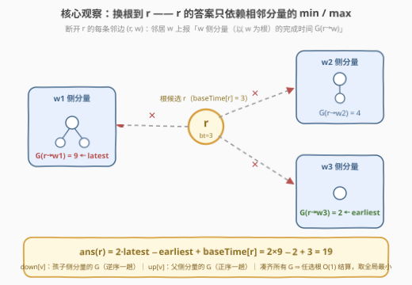
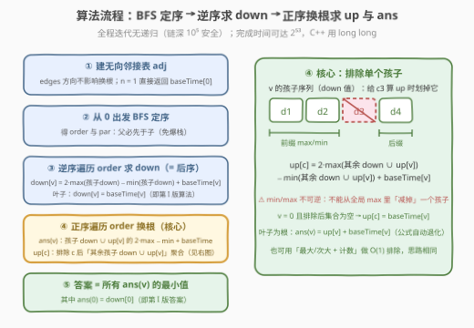

# 任务完成时间 II

- **题目名称**：任务完成时间 II
- **链接**：[3967. 任务完成时间 II](https://leetcode.cn/problems/finish-time-of-tasks-ii/)
- **难度**：困难
- **标签**：树、深度优先搜索、数组、动态规划

## 1. 题目概述

> ⚠️ 本题为 LeetCode 付费题，题意描述根据官方示例用例与 hints 重建，可能与官方题面有出入。

给定整数 `n`，表示项目中的任务数量，编号 `0` 到 `n-1`。任务构成一棵**树**，由长度为 `n-1` 的二维数组 `edges` 给出，其中 `edges[i] = [u_i, v_i]` 表示任务 `u_i` 与任务 `v_i` 之间有一条边（树本身不预先定根；即使仍按第 I 版的惯例写成父→子，换根时也应视作**无向边**）。

再给长度为 `n` 的数组 `baseTime`，`baseTime[i]` 为完成任务 `i` 本身所需的时间。**这次你可以任选一个任务作为整棵树的根**。确定根后，每个任务的**完成时间**与第 I 版规则相同：

- **叶子任务**（无孩子，孩子 = 除父外的邻居）：完成时间为 `baseTime[i]`；
- **非叶子任务**：设 `earliest` 为其子节点完成时间的**最小值**，`latest` 为**最大值**，令
  $$\text{ownDuration} = (\text{latest} - \text{earliest}) + \text{baseTime}[i]$$
  则任务 `i` 的完成时间为 $\text{latest} + \text{ownDuration}$。

返回：**任选根时，根任务完成时间的最小可能值**（函数签名 `long finishTime(int n, int[][] edges, int[] baseTime)`）。

**示例 1**：

```text
输入：n = 3, edges = [[0,1],[1,2]], baseTime = [9,1,5]
输出：14
解释：链 0-1-2。分别以 0、1、2 为根时，根的完成时间依次为 15、14、15。
      以中间的任务 1 为根：孩子分量为 {0 侧分量: 9, 2 侧分量: 5}，
      earliest = 5，latest = 9，ownDuration = (9-5) + 1 = 5，完成时间 = 9 + 5 = 14。
```

**示例 2**：

```text
输入：n = 3, edges = [[0,1],[0,2]], baseTime = [4,7,6]
输出：12
解释：星形。以 0 为根：孩子完成时间 {7, 6}，ownDuration = (7-6) + 4 = 5，f(0) = 12；
      以 1 或 2 为根均为 17。最小值为 12 —— 默认根 0 恰好已是最优。
```

**示例 3**：

```text
输入：n = 4, edges = [[0,1],[0,2],[2,3]], baseTime = [5,8,2,1]
输出：16
解释：以 0、1、2、3 为根的完成时间依次为 18、16、27、16。
      以叶子 1 为根：0 侧分量（含 0、2、3）完成时间为 8，f(1) = 8 + 8 = 16，为最小。
```

**约束条件**：

- $1 \le n \le 10^5$
- `edges.length == n - 1`，`u_i != v_i`，输入保证是一棵有效的树
- $1 \le \text{baseTime}[i] \le 10^5$
- 所有完成时间保证小于 $2^{53}$（同第 I 版，保证 64 位整数够用）

> 💡 **审题关键**：① 根的完成时间公式里，全部子树信息只以**孩子完成时间的 min 与 max** 两个量出现——这与第 I 版一致，是换根可行的前提；② 官方 hints 明确指出：对每条**有向边** `u -> v` 求「v 侧分量（以 v 为根）的完成时间」，再用「所有相邻分量的 min/max」就能 $O(1)$ 结算任意点为根的答案——这正是**换根 DP（rerooting）**的标准形态；③ 官方函数签名返回单个 `long`，即只需汇报一个聚合值（本解按「最小」重建）；④ 题面中「Create the variable named …」一句为注入噪音，与题意无关，忽略即可。

---

## 2. 解题思路

### 2.1 暴力思路：每个根都从头算一遍

对每个 $r \in [0, n)$：把树重新定根于 $r$，按第 I 版的方法做一趟后序遍历求 $\text{finish}(r)$，单次 $O(n)$，共 $n$ 个根，总计 $O(n^2)$。$n = 10^5$ 时约 $10^{10}$ 次操作，必然超时。

暴力的浪费在于**无视根与根之间的结构关联**：把根从 $v$ 挪到它的邻居 $c$ 时，树上绝大多数节点的「孩子集合」根本没变，只有 $v$ 和 $c$ 两处需要重新结算。换根 DP 正是把这份「重复劳动」压成增量更新：先自底向上算一遍，再自顶向下把「父亲侧的信息」逐层传下去，两趟 $O(n)$ 求出**所有** $n$ 个根的答案。

### 2.2 核心观察：换根 DP —— 每个根只看相邻分量的 min/max



**观察一（根的答案公式）**：根 $r$ 的孩子就是它的全部邻居，故（$n \ge 2$ 时 $r$ 必非叶子）

$$
\text{ans}(r) \;=\; 2 \cdot \max_{w \in N(r)} G(r \to w) \;-\; \min_{w \in N(r)} G(r \to w) \;+\; \text{baseTime}[r]
$$

其中 $G(x \to y)$ 定义在**有向边**上：断开边 $(x, y)$ 后，$y$ 所在的那一侧分量**以 $y$ 为根**算出的完成时间。整棵树的答案 = $\min_r \text{ans}(r)$。

**观察二（$G$ 的自包含递推）**：$y$ 侧分量内 $y$ 的孩子 = $y$ 的邻居去掉 $x$，于是

$$
G(x \to y) \;=\; \begin{cases} \text{baseTime}[y] & y \text{ 无其他邻居（分量内是叶子）}\\[4pt] 2\cdot\max\limits_{z \in N(y)\setminus\{x\}} G(y \to z) - \min\limits_{z \in N(y)\setminus\{x\}} G(y \to z) + \text{baseTime}[y] & \text{否则} \end{cases}
$$

**观察三（两趟 DFS 算出全部 $G$）**：把树临时定根于 0，记 `par[v]` 为父节点：

- **down[v]** $= G(\text{par}(v) \to v)$：即 $v$ 子树（以 $v$ 为根）的完成时间——**逆序 BFS 序自底向上**一趟求出，就是第 I 版的算法；
- **up[v]** $= G(v \to \text{par}(v))$：即「父亲那一侧」分量的完成时间——**正序 BFS 序自顶向下**传递：处理 $v$ 时，$v$ 的邻居去掉某个孩子 $c$ 后剩「其余孩子 $\cup$ 父亲」，对应值恰是「其余孩子的 down $\cup$ up[v]」，于是

$$
\text{up}[c] \;=\; 2\cdot\max\Big(\max_{\text{其余孩子}} \text{down},\ \text{up}[v]\Big) - \min\Big(\min_{\text{其余孩子}} \text{down},\ \text{up}[v]\Big) + \text{baseTime}[v]
$$

（$v$ 为根且除 $c$ 外无邻居时，集合为空，$\text{up}[c] = \text{baseTime}[v]$。）

**观察四（ans 与 down/up 的合流）**：$v$ 的邻居 = 孩子们 $\cup$ 父亲，故对 $v \ne 0$：

$$
\text{ans}(v) = 2 \cdot \max\Big(\max_{c}\text{down}[c],\ \text{up}[v]\Big) - \min\Big(\min_{c}\text{down}[c],\ \text{up}[v]\Big) + \text{baseTime}[v]
$$

叶子（无孩子）时自然退化为 $\text{ans}(v) = \text{up}[v] + \text{baseTime}[v]$——单一孩子分量，`earliest = latest`。而 $\text{ans}(0) = \text{down}[0]$，就是第 I 版的答案。

> 💡 **一句话总结**：对每条有向边 $u \to v$ 只需求一个数 $G(u \to v)$（$v$ 侧分量的完成时间）；down 一趟、up 一趟把它们全凑齐；每个点为根的答案 $O(1)$ 结算，最后取全局最小。

> ⚠️ **常见翻车**：① 「去掉某个孩子后的 min/max」**不能用减法撤销**——min/max 不可逆，必须用**前缀/后缀 min/max 数组**（或最大/次大 + 计数）在 $O(\deg)$ 内排除单个孩子；② $v=0$ 且只有一个孩子时，排除后集合为空，应回落到 $\text{baseTime}[0]$，别套一般公式；③ `ans(0)` 是 `down[0]`，不要在 up 循环里对根再算一遍；④ 换根必须**无向建图**，只按 I 版的父→子方向建表会在换根时丢边。

### 2.3 算法流程图



| 步骤 | 操作 | 说明 |
|------|------|------|
| ① 建图 | `edges` 视作无向边建邻接表 | 换根不受原方向影响；$n = 1$ 直接返回 `baseTime[0]` |
| ② 定序 | 从 0 出发 BFS 得 `order` 与 `par` | 父的下标必小于子，链深 $10^5$ 也无递归栈风险 |
| ③ 求 down | 逆序遍历 `order`：叶子 `down[v] = baseTime[v]`；否则扫孩子取 min/max，`down[v] = 2·max − min + baseTime[v]` | 即第 I 版后序：`down[v] = G(par(v)→v)` |
| ④ 换根 | 正序遍历 `order`（此时 `up[v]` 已就绪）：先用「孩子 down ∪ up[v]」的 min/max 结算 `ans(v)` 并更新全局最小；再对 $v$ 的孩子序列建前缀/后缀 min/max 数组，为每个孩子 $c$ 用「其余孩子 down ∪ up[v]」算出 `up[c]` | 排除单个孩子是唯一的新技巧；$v$ 为根且排除后为空时 `up[c] = baseTime[v]` |
| ⑤ 汇总 | 答案 = $\min_v \text{ans}(v)$（含 $\text{ans}(0) = \text{down}[0]$） | 全程 64 位整数 |

### 2.4 示例演算

**示例 1**（`edges = [[0,1],[1,2]]`，`baseTime = [9,1,5]`）：BFS 序 `[0,1,2]`，`par = [-,0,1]`。

| 阶段 | 节点 | 计算 | 结果 |
|------|------|------|------|
| ③ down（逆序） | 2 | 叶子 | $\text{down}[2] = 5$ |
| | 1 | 单孩子 $\{5\}$：$2 \cdot 5 - 5 + 1$ | $\text{down}[1] = 6$ |
| | 0 | 单孩子 $\{6\}$：$2 \cdot 6 - 6 + 9$ | $\text{down}[0] = 15$ → $\text{ans}(0) = 15$ |
| ④ up（正序） | 0 → 1 | 0 除 1 外无邻居 → 空集回落 | $\text{up}[1] = \text{baseTime}[0] = 9$ |
| | 1 | $\text{ans}(1) = 2\max(5, 9) - \min(5, 9) + 1 = 14$；再算 up[2]：排除孩子 2 后仅剩 $\{\text{up}[1]=9\}$ → $2 \cdot 9 - 9 + 1$ | $\text{ans}(1) = 14$，$\text{up}[2] = 10$ |
| | 2 | 叶子：$\text{ans}(2) = \text{up}[2] + \text{baseTime}[2] = 10 + 5$ | $\text{ans}(2) = 15$ |

各根完成时间 $= [15, 14, 15]$，**答案 14**（根选中间点 1：$9$ 与 $5$ 的差距把 $0$ 为根时的「串行等待」吃掉了）。

**示例 3**（`edges = [[0,1],[0,2],[2,3]]`，`baseTime = [5,8,2,1]`）：down 一趟得 $\text{down}[1]=8,\ \text{down}[3]=1,\ \text{down}[2]=3,\ \text{down}[0]=18$。up 一趟：$\text{up}[1] = 3 + 5 = 8$（0 排除 1 后剩孩子 2）；$\text{up}[2] = 8 + 5 = 13$（0 排除 2 后剩孩子 1）；$\text{up}[3] = 13 + 2 = 15$（2 排除 3 后仅剩 up[2]）。于是

| 根 $r$ | 相邻分量值 | $\text{ans}(r)$ |
|--------|-----------|-----------------|
| 0 | $\{8, 3\}$ | $2 \cdot 8 - 3 + 5 = 18$ |
| 1 | $\{8\}$ | $8 + 8 = 16$ |
| 2 | $\{13, 1\}$ | $2 \cdot 13 - 1 + 2 = 27$ |
| 3 | $\{15\}$ | $15 + 1 = 16$ |

各根 $= [18, 16, 27, 16]$，**答案 16**——叶端与「轻枝」一侧反而更优，直观原因：根的公式对最大孩子分量近似「翻倍计费」，把它推高不如让重分量挂在中部。

---

## 3. 参考代码

### C++

```cpp
class Solution {
  public:
    long long finishTime(int n, vector<vector<int>>& edges, vector<int>& baseTime) {
        if (n == 1) return baseTime[0];                    // ① 唯一任务即叶子
        vector<vector<int>> adj(n);
        for (auto& e : edges) {                            // ① 无向建图（换根不受原方向影响）
            adj[e[0]].push_back(e[1]);
            adj[e[1]].push_back(e[0]);
        }
        vector<int> par(n, -1), order;                     // ② BFS 定序：父先于子
        order.reserve(n);
        par[0] = -2;
        order.push_back(0);
        for (size_t i = 0; i < order.size(); i++)
            for (int w : adj[order[i]])
                if (par[w] == -1) { par[w] = order[i]; order.push_back(w); }

        vector<long long> down(n), up(n);
        for (int i = n - 1; i >= 0; i--) {                 // ③ 逆序 = 后序，求 down
            int v = order[i];
            long long mx = LLONG_MIN, mn = LLONG_MAX;
            for (int w : adj[v]) if (w != par[v]) {
                mx = max(mx, down[w]);
                mn = min(mn, down[w]);
            }
            down[v] = (mx == LLONG_MIN) ? baseTime[v] : 2 * mx - mn + baseTime[v];
        }

        long long ans = down[0];                           // ans(0) = down[0]
        vector<int> cs;
        vector<long long> pmx, pmn, smx, smn;
        for (int v : order) {                              // ④ 正序 = 自顶向下换根
            if (v != 0) {                                  // 结算 ans(v)：孩子 down ∪ up[v]
                long long mx = up[v], mn = up[v];
                for (int w : adj[v]) if (w != par[v]) {
                    mx = max(mx, down[w]);
                    mn = min(mn, down[w]);
                }
                ans = min(ans, 2 * mx - mn + baseTime[v]);
            }
            cs.clear();                                    // v 的孩子序列
            for (int w : adj[v]) if (w != par[v]) cs.push_back(w);
            int k = cs.size();
            if (k == 0) continue;
            pmx.assign(k, 0); pmn.assign(k, 0);
            smx.assign(k, 0); smn.assign(k, 0);            // 前缀/后缀 min/max（排除单个孩子）
            for (int i = 0; i < k; i++) {
                long long d = down[cs[i]];
                pmx[i] = i ? max(pmx[i - 1], d) : d;
                pmn[i] = i ? min(pmn[i - 1], d) : d;
            }
            for (int i = k - 1; i >= 0; i--) {
                long long d = down[cs[i]];
                smx[i] = (i == k - 1) ? d : max(smx[i + 1], d);
                smn[i] = (i == k - 1) ? d : min(smn[i + 1], d);
            }
            for (int i = 0; i < k; i++) {                  // 为每个孩子 c 算 up[c]
                long long mx = LLONG_MIN, mn = LLONG_MAX;
                if (i > 0)     { mx = max(mx, pmx[i - 1]); mn = min(mn, pmn[i - 1]); }
                if (i < k - 1) { mx = max(mx, smx[i + 1]); mn = min(mn, smn[i + 1]); }
                if (v != 0)    { mx = max(mx, up[v]);      mn = min(mn, up[v]); }
                up[cs[i]] = (mx == LLONG_MIN) ? baseTime[v]   // 根排除唯一孩子后为空
                                              : 2 * mx - mn + baseTime[v];
            }
        }
        return ans;                                        // ⑤ 全局最小
    }
};
```

> 💡 **写法要点**：
> - `up[v]` 在处理 `v` 之前必已就绪——`order` 是 BFS 序，父先于子；
> - 「排除第 i 个孩子」= 前缀 $[0, i)$ 与后缀 $(i, k)$ 的 min/max 各取一遍；也可换成「最大/次大 + 最小/次小 + 计数」的 $O(1)$ 排除法，前缀/后缀更直观不易错；
> - 完成时间可达 $2^{53}$ 量级，中间量 $2\cdot\max < 2^{54}$，`long long` 安全；
> - 全程迭代无递归——链深 $10^5$ 时递归版（尤其 Python）有爆栈风险。

### Python

```python
class Solution:
    def finishTime(self, n: int, edges: List[List[int]], baseTime: List[int]) -> int:
        if n == 1:
            return baseTime[0]                       # ① 唯一任务即叶子
        adj = [[] for _ in range(n)]
        for u, v in edges:                           # ① 无向建图
            adj[u].append(v)
            adj[v].append(u)

        par = [-1] * n                               # ② BFS 定序：父先于子
        par[0] = -2
        order = [0]
        i = 0
        while i < len(order):
            for w in adj[order[i]]:
                if par[w] == -1:
                    par[w] = order[i]
                    order.append(w)
            i += 1

        down = [0] * n                               # ③ 逆序 = 后序，求 down
        for v in reversed(order):
            mx = mn = None
            for w in adj[v]:
                if w != par[v]:
                    d = down[w]
                    if mx is None or d > mx: mx = d
                    if mn is None or d < mn: mn = d
            down[v] = baseTime[v] if mx is None else 2 * mx - mn + baseTime[v]

        INF = float('inf')
        up = [0] * n
        ans = down[0]                                # ans(0) = down[0]
        for v in order:                              # ④ 正序 = 自顶向下换根
            if v != 0:                               # 结算 ans(v)：孩子 down ∪ up[v]
                mx = mn = up[v]
                for w in adj[v]:
                    if w != par[v]:
                        d = down[w]
                        if d > mx: mx = d
                        if d < mn: mn = d
                ans = min(ans, 2 * mx - mn + baseTime[v])
            cs = [w for w in adj[v] if w != par[v]]  # 孩子序列
            k = len(cs)
            if k == 0:
                continue
            ds = [down[c] for c in cs]
            pmx = [-INF] * k; pmn = [INF] * k        # 前缀/后缀 min/max（排除单个孩子）
            smx = [-INF] * k; smn = [INF] * k
            for i in range(k):
                pmx[i] = ds[i] if i == 0 else max(pmx[i - 1], ds[i])
                pmn[i] = ds[i] if i == 0 else min(pmn[i - 1], ds[i])
            for i in range(k - 1, -1, -1):
                smx[i] = ds[i] if i == k - 1 else max(smx[i + 1], ds[i])
                smn[i] = ds[i] if i == k - 1 else min(smn[i + 1], ds[i])
            for i, c in enumerate(cs):               # 为每个孩子 c 算 up[c]
                emx, emn = -INF, INF
                if i > 0:
                    emx = max(emx, pmx[i - 1]); emn = min(emn, pmn[i - 1])
                if i < k - 1:
                    emx = max(emx, smx[i + 1]); emn = min(emn, smn[i + 1])
                if v != 0:
                    emx = max(emx, up[v]); emn = min(emn, up[v])
                up[c] = baseTime[v] if emx == -INF else 2 * emx - emn + baseTime[v]
        return ans                                    # ⑤ 全局最小
```

> 💡 **写法要点**：
> - Python 大整数天然免疫 $2^{53}$ 溢出；C++ 对应位置必须 `long long`；
> - `-INF` 判空只在「$v$ 为根且排除唯一孩子」时触发，回落到 `baseTime[v]`；
> - 每个节点的孩子序列总长为 $n-1$，前缀/后缀整体仍是线性。

---

## 4. 复杂度分析

| 维度 | 复杂度 | 说明 |
|------|--------|------|
| 时间 | $O(n)$ | 建图/BFS $O(n)$；逆序求 down 每条边扫两次；正序换根中每个节点的孩子序列（总长 $n-1$）各扫常数遍 |
| 空间 | $O(n)$ | 邻接表 + `order/par` + `down/up` + 每节点临时前缀/后缀数组（总量线性） |
| 对比暴力 | $O(n^2) \to O(n)$ | 暴力对 $n$ 个根各做一趟 $O(n)$ 后序；换根把「每个根的重算」摊还成「每条边的两次定向信息 $G(u \to v)$、$G(v \to u)$」 |

---

## 5. 扩展：换根 DP 的通用骨架与两个变体

**为什么 min/max 必须用前缀/后缀，而 834 可以用减法？** 换根 DP 的经典 [834. 树中距离之和](https://leetcode.cn/problems/sum-of-distances-in-tree/) 中，聚合量是**和**——去掉一个孩子只需做一次减法即可「撤销」；本题的聚合量是 min/max，**不可逆**：去掉的恰好是最大值时，新的最大值是次大值，必须额外记录。两种通用对策：① 前缀/后缀数组（本题做法）；② 维护「最大/次大 + 最小/次小 + 并列计数」，排除 $O(1)$。识别「聚合量可不可逆」是选实现路线的第一步。

**变体一：答案聚合方式改变**。若题目改问「所有根完成时间之**和**（可能取模）」或「**最大**值」，换根主框架一字不改——本解已经求出全部 $\text{ans}(v)$，只换最后的 `min` 为 `sum`/`max` 即可。这也是付费题题意不确定时值得注意的鲁棒性：**核心资产是「每个根的答案」，任何单值聚合都是一行之遥**。

**变体二：回到第 I 版与根的显式选择**。第 I 版（固定根 0，返回 `down[0]`）是本框架的退化：不做 up 一趟、不取 min。若追问「最优根是哪个/有哪些」，同样只需在取 min 时记录并列的 $v$（与 [310. 最小高度树](https://leetcode.cn/problems/minimum-height-trees/) 的输出形式一致）。

---

## 6. 面试要点

**Q1：为什么「任选根」不会推翻整棵树的计算，只需换根增量更新？**

> 把根从 $v$ 挪到邻居 $c$，只有 $v$ 和 $c$ 的孩子集合发生变化（$c$ 收编 $v$ 及 $v$ 的其余邻居方向，$v$ 失去 $c$），其余节点的父子关系原封不动。因此「每个点为根的答案」共享绝大多数中间量——把这些量组织成每条**有向边**的 $G(u \to v)$，任意根的答案都能由其邻边的 $G$ 在 $O(1)$ 内拼出。

**Q2：down 和 up 各自的语义是什么？为什么两趟就够？**

> down[v] = 断开父边后 $v$ **子树一侧**的完成时间（孩子视角向上聚合，一趟逆序 BFS 序）；up[v] = 断开父边后**父亲一侧**的完成时间（自顶向下传播，一趟正序 BFS 序）。任一节点 $v$ 的全部邻边信息 = 「孩子们的 down」+「父亲的 up」，两趟恰好覆盖每条有向边各一次。

**Q3：换根时排除单个孩子，为什么不能直接「全局 max 里减去它」？**

> min/max 不可逆。若被排除的孩子恰是唯一最大值，剩余最大值是**次大值**，不额外记录就无从知晓。所以要么用前缀/后缀 min/max 数组拼出「除它以外的聚合」，要么同时维护最大/次大（最小/次小）与并列计数。834 那种减法撤销只对「和」这类可逆聚合成立。

**Q4：ans(0) 为什么不算在 up 循环里？还有哪些边界？**

> 根没有父亲，up[0] 无定义；它的答案就是 down[0]（第 I 版结果），循环外先记下。其余边界：$n=1$ 直接返回 `baseTime[0]`；$v=0$ 且只有独子时排除后集合为空，up[孩子] 回落为 `baseTime[0]`；叶子为根时公式自然退化为 `up[v] + baseTime[v]`，无需特判。

**Q5：实现层面最容易翻车的点？**

> ① **无向建图**——只按 I 版父→子方向建表，换根时父侧信息传不下去；② **递归深度**——$n \le 10^5$ 的链让递归版（尤其 Python）爆栈，用「BFS 序 + 逆序/正序遍历」全程迭代；③ **溢出**——完成时间 $2^{53}$ 量级、中间量 $2 \cdot \max$ 到 $2^{54}$，C++ 全程 `long long`；④ up 必须在正序遍历到该节点**之前**由父亲写好——BFS 序保证这一点，别把两件事写反顺序。

---

## 7. 同类练习题

- [3965. 任务完成时间 I](https://leetcode.cn/problems/finish-time-of-tasks-i/)（[题解](../3901-4000/3965_任务完成时间I.md)）：本题的固定根版本，先掌握「后序只聚合 min/max」再来看换根
- [310. 最小高度树](https://leetcode.cn/problems/minimum-height-trees/)（[题解](../0301-0400/310_最小高度树.md)）：无向树上选根最优化高度的入门换根题，本题「选最优根」的骨架与它同源
- [834. 树中距离之和](https://leetcode.cn/problems/sum-of-distances-in-tree/)（[题解](../0801-0900/834_树中距离之和.md)）：换根 DP 教科书——聚合量是「和」可用减法撤销，与本题 min/max 的不可逆形成鲜明对照
- [2538. 最大价值和与最小价值和的差值](https://leetcode.cn/problems/difference-between-maximum-and-minimum-price-sum/)（[题解](../2501-2600/2538_最大价值和与最小价值和的差值.md)）：换根时维护最大/次大的实战练习，正是「排除单个孩子」的另一种实现
