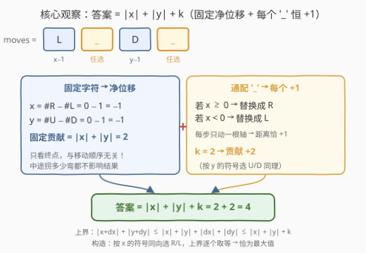
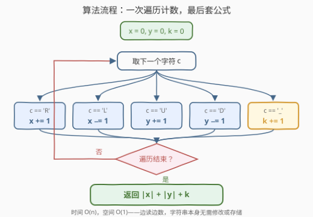

# LeetCode 移动后的最大曼哈顿距离 题解

## 1. 题目概述

- **标题 / 题号**：移动后的最大曼哈顿距离（#3968，medium）
- **链接**：https://leetcode.cn/problems/maximum-manhattan-distance-after-all-moves/
- **难度**：中等
- **标签**：数学、字符串、计数、贪心

**题意**：给你一个由字符 `'U'`、`'D'`、`'L'`、`'R'` 和 `'_'` 组成的字符串 `moves`。

从原点 $(0, 0)$ 出发，每个字符表示二维平面上的一次移动：

- `'U'`：向上移动 1 个单位；
- `'D'`：向下移动 1 个单位；
- `'L'`：向左移动 1 个单位；
- `'R'`：向右移动 1 个单位；
- `'_'`：可以**独立地**替换为 `'U'`、`'D'`、`'L'`、`'R'` 中的任意一个字符。

返回执行完所有移动后，能够达到的距离原点的**最大曼哈顿距离**。

两点 $(x_1, y_1)$ 和 $(x_2, y_2)$ 之间的曼哈顿距离为 $|x_1 - x_2| + |y_1 - y_2|$。

**示例 1**：

```text
输入：moves = "L_D_"
输出：4
解释：一种最优选择：L → (−1, 0)；第一个 '_' 视为 D → (−1, −1)；
D → (−1, −2)；第二个 '_' 视为 L → (−2, −2)。
最终距离 |0−(−2)| + |0−(−2)| = 4。
```

**示例 2**：

```text
输入：moves = "U_R"
输出：3
解释：'U' → (0, 1)；'_' 视为 U → (0, 2)；'R' → (1, 2)。
最终距离 |0−1| + |0−2| = 3。
```

**约束**：

- $1 \le \text{moves.length} \le 10^5$
- `moves` 仅由 `'U'`、`'D'`、`'L'`、`'R'` 和 `'_'` 组成。

> 💡 **审题关键**：① 曼哈顿距离**只由终点坐标决定**，而终点只取决于四个方向的**计数**，与移动顺序完全无关——这是能把问题从"模拟"降维成"计数"的支点；② 每个 `'_'` **独立**选择方向，互不牵连；③ $n \le 10^5$ 要求至少 $O(n)$ 或 $O(n \log n)$ 的做法。

## 2. 解题思路

### 2.1 暴力思路

枚举每个 `'_'` 的 4 种替换，$k$ 个下划线共 $4^k$ 种组合；对每种组合模拟一遍求终点、算曼哈顿距离，取最大值。当 $k$ 接近 $n = 10^5$ 时组合数是天文数字，显然不可行。

问题出在把 `'_'` 当成了彼此相关的决策——实际上**终点只看计数**，每个 `'_'` 对坐标的影响可以独立分析。

### 2.2 核心观察：净位移分解——固定部分 + 通配部分



把坐标拆成两部分的和：

- **固定字符**：设净位移为 $(x, y)$，其中 $x = \#R - \#L$（水平净移动），$y = \#U - \#D$（垂直净移动）。加法交换律保证**顺序无关**——不管 `moves` 里字符如何排列，固定部分对终点的贡献恒为 $(x, y)$。
- **通配字符**：设 $k$ 个 `'_'` 的净贡献为 $(dx, dy)$。每个 `'_'` 只动一根轴一步，故 $|dx| + |dy| \le k$。

于是得到**上界**（三角不等式逐项放缩）：

$$|x + dx| + |y + dy| \le |x| + |dx| + |y| + |dy| \le |x| + |y| + k$$

而这个上界**恰好可以取到**：按 $x$ 的符号选方向——若 $x \ge 0$ 就把所有 `'_'` 替换成 `'R'`（每替换一个，$|x|$ 恰好增加 1）；若 $x < 0$ 就全替换成 `'L'`（按 $y$ 的符号选 `'U'`/`'D'` 同理）。每个 `'_'` 让 $|x| + |y|$ 恰好 $+1$，一个不多、一个不少。

> 💡 **为什么每个 `'_'` 恰好 +1，而不是有时 +1 有时 0？** 一次移动只改变一根轴的坐标 1 个单位，所以 $|x| + |y|$ 每步至多变化 1（上界侧）；而"顺着当前该轴净位移的符号走"必然让该轴绝对值 +1（下界侧）。两侧夹逼，贡献被钉死在恰好 1。

**结论**：

$$\text{答案} = |x| + |y| + k = |\#R - \#L| + |\#U - \#D| + \#\_$$

**示例验证**（`"L_D_"`）：$x = 0 - 1 = -1$，$y = 0 - 1 = -1$，$k = 2$，答案 $= 1 + 1 + 2 = 4$ ✓；`"U_R"`：$x = 1$，$y = 1$，$k = 1$，答案 $= 1 + 1 + 1 = 3$ ✓。

### 2.3 算法流程图



| 步骤 | 操作 | 说明 |
|------|------|------|
| ① | 初始化 $x = y = k = 0$ | 三个计数器 |
| ② | 遍历每个字符 $c$ | $O(1)$ 分派，不修改字符串 |
| ③ | 按字符更新计数 | `R/L` 改 $x$，`U/D` 改 $y$，`_` 改 $k$ |
| ④ | 返回 $|x| + |y| + k$ | 三次 `abs` + 一次加法 |

### 2.4 示例演算

**示例 1：moves = "L_D_"**

| 字符 | $x$ | $y$ | $k$ | 说明 |
|---|---|---|---|---|
| 初始 | 0 | 0 | 0 | 原点出发 |
| `L` | $-1$ | 0 | 0 | 向左 |
| `_` | $-1$ | 0 | 1 | 先只计数，方向最后统一选 |
| `D` | $-1$ | $-1$ | 0 | 向下 |
| `_` | $-1$ | $-1$ | 2 | — |

答案 $= |-1| + |-1| + 2 = 4$。两个 `'_'` 都替换成 `'L'`（因为 $x = -1 < 0$），终点 $(-3, -1)$，距离仍为 $3 + 1 = 4$——**替换成什么不影响公式成立**。

**示例 2：moves = "U_R"**：$x = 1$，$y = 1$，$k = 1$，答案 $= 1 + 1 + 1 = 3$ ✓。

## 3. 参考代码

### C++

```cpp
class Solution {
  public:
    int maxDistance(string moves) {
        int x = 0, y = 0, k = 0;
        for (char c : moves) {
            if (c == 'R') x++;
            else if (c == 'L') x--;
            else if (c == 'U') y++;
            else if (c == 'D') y--;
            else k++;
        }
        return abs(x) + abs(y) + k;
    }
};
```

> 💡 **写法要点**：
> - 单次遍历、三个计数器，无需修改字符串、无需存储中间位置；
> - `abs` 要用整数版本（`<cstdlib>` 的 `int abs(int)`），防止误用浮点重载；
> - 若追求极致常数，可用查表把五分支压成数组自增（见下）。

```cpp
class Solution {
  public:
    int maxDistance(string moves) {
        int x = 0, y = 0, k = 0;
        for (char c : moves) {
            x += (c == 'R') - (c == 'L');
            y += (c == 'U') - (c == 'D');
            k += (c == '_');
        }
        return abs(x) + abs(y) + k;
    }
};
```

### Python

```python
class Solution:
    def maxDistance(self, moves: str) -> int:
        x = moves.count('R') - moves.count('L')
        y = moves.count('U') - moves.count('D')
        k = moves.count('_')
        return abs(x) + abs(y) + k
```

> 💡 Python 直接用 `str.count` 四次扫描，实现最短且底层是 C 级遍历，实测比手写循环更快。

## 4. 复杂度分析

| 维度 | 复杂度 | 说明 |
|------|--------|------|
| 时间 | $O(n)$ | 一次遍历（Python 版为常数次遍历）计数，$n \le 10^5$ 轻松通过 |
| 空间 | $O(1)$ | 仅三个整数计数器，与输入规模无关 |
| 数据规模 | $n \le 10^5$ | $10^5$ 次字符分派，任何语言都是毫秒级 |

## 5. 扩展：同一框架下的三个变体

**变体一：最小化曼哈顿距离**。`'_'` 还能反向走抵消固定位移：把 $|x|$ 个 `_` 用于水平抵消、$|y|$ 个用于垂直抵消即可回到原点附近，故

$$\text{最小距离} = \max(0,\ |x| + |y| - k)$$

最大化与最小化共用同一套计数，只是公式的放缩方向不同。

**变体二：`'_'` 必须全部替换成同一方向**。答案是 $\max$ over 四个方向的 $|x \pm k| + |y|$ 或 $|x| + |y \pm k|$——但注意若 $x \ge 0$，取 `'R'` 得 $|x| + k + |y|$，与独立替换的答案**完全相同**（按符号同向选即可），约束并不损失最优值。

**变体三：最大化欧氏距离** $\sqrt{(x+dx)^2 + (y+dy)^2}$。设把 $j$ 个增量给水平轴、$k - j$ 个给垂直轴（都取增大绝对值的方向），目标为 $f(j) = (|x|+j)^2 + (|y|+k-j)^2$，这是 $j$ 的**凸函数**，最大值必在端点 $j = 0$ 或 $j = k$ 取得——所有 `'_'` 全押在同一根轴上：

$$\text{答案} = \max\left(\sqrt{(|x|+k)^2 + y^2},\ \sqrt{x^2 + (|y|+k)^2}\right)$$

与曼哈顿情形"每个 `'_'` 独立贡献 1"的平凡贪心对照：**度量变了，可分性就变了**，但"终点只看计数"的大前提始终成立。

## 6. 面试要点

**Q1：如何严格证明答案是 $|x| + |y| + k$？**

> 双向夹逼。上界：设 `'_'` 的净贡献为 $(dx, dy)$，由 $|x+dx| \le |x| + |dx|$ 与 $|dx| + |dy| \le k$ 得距离 $\le |x| + |y| + k$；下界（构造）：按 $x$ 的符号把所有 `'_'` 同向替换成 `'R'` 或 `'L'`，每个 `'_'` 使该轴绝对值恰 +1，距离恰为 $|x| + |y| + k$。两側相等，即最优值。

**Q2：为什么移动顺序完全不重要？**

> 终点坐标是各方向计数的线性组合：$x = \#R - \#L$、$y = \#U - \#D$。整数加法满足交换律，任何排列得到同一终点；而曼哈顿距离只由终点决定。识别出这一点，"模拟 $4^k$ 种替换"的暴力就直接坍缩成"数一遍字符"。

**Q3：如果改求欧氏距离最大值，还能每个 `'_'` 独立贪心吗？**

> 不能简单独立贪心（两轴增量在平方和下相互耦合），但顺序无关性仍在：把 $j$ 个增量分配给水平轴后目标 $f(j)$ 是凸函数，最大值在 $j=0$ 或 $j=k$ 取得，即全部 `'_'` 押同一根轴，取两个候选的较大者。见第 5 节变体三。

**Q4：如果所有 `'_'` 必须替换成同一个方向，答案会变小吗？**

> 不会，仍为 $|x| + |y| + k$。按 $x$ 的符号选 `'R'`/`'L'` 这一个方向，$k$ 个增量全部落在 $|x|$ 上，恰好取到与独立替换相同的上界。这是"约束看似加强、实则不binding"的典型例子，值得在面试中主动指出。

**Q5：实现上有什么易错点？**

> ① 不要试图真的枚举/替换 `'_'` 再模拟——计数即可；② 贪心方向应看**最终**净位移的符号，而不是中途坐标（中途坐标顺序相关，是伪信息）；③ C++ 注意 `abs` 用整数重载、避免 `char` 与有符号比较的坑；④ Python 用 `str.count` 四次扫描通常比单循环 `if/elif` 更快。

## 同类练习题

| # | 题目 | 与本题的关联 |
|---|------|-------------|
| 1266 | [访问所有点的最小时间](https://leetcode.cn/problems/minimum-time-visiting-all-points/) | 曼哈顿距离的入门应用，对角线一步等价两轴各走一步的换算 |
| 1131 | [绝对值表达式的最大值](https://leetcode.cn/problems/maximum-of-absolute-value-expression/) | 把曼哈顿型 $\|\cdot\| + \|\cdot\|$ 的最大化拆成符号组合的最大值，同属"拆绝对值"技巧族 |
| 874 | [模拟行走机器人](https://leetcode.cn/problems/walking-robot-simulation/) | 方向指令 + 障碍哈希的真实模拟，对照体会本题"终点只看计数"的简化有多奢侈 |
| 1041 | [困于环中的机器人](https://leetcode.cn/problems/robot-bounded-in-circle/) | 同样只关心净位移与朝向、与指令顺序无关的机器人计数题 |
