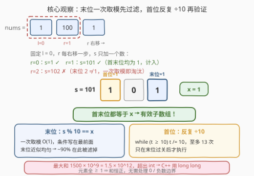
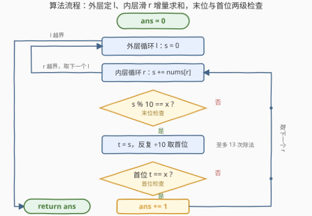

# 求和后首尾数字相同的有效子数组 I

- **题目名称**：求和后首尾数字相同的有效子数组 I
- **链接**：[3969. 求和后首尾数字相同的有效子数组 I](https://leetcode.cn/problems/valid-subarrays-with-matching-sum-digits-i/)
- **难度**：中等
- **标签**：数组、枚举、前缀和、滑动窗口

## 1. 题目概述

给你一个整数数组 `nums` 和一个整数 `x`。

如果一个**子数组** `nums[l..r]` 的元素和同时满足以下两个条件，则认为该子数组是**有效子数组**：

- 该和的**首位数字**等于 `x`；
- 该和的**末位数字**等于 `x`。

返回有效子数组的数量。

**子数组**是数组中一个连续、非空的元素序列。

**示例 1**：

```text
输入：nums = [1,100,1], x = 1
输出：4
解释：有效子数组为：
nums[0..0]：sum = 1
nums[0..1]：sum = 1 + 100 = 101
nums[1..2]：sum = 100 + 1 = 101
nums[2..2]：sum = 1
因此，答案为 4。
```

**示例 2**：

```text
输入：nums = [1], x = 2
输出：0
解释：唯一的子数组是 nums[0..0]，其和为 1，不满足条件。
```

**约束条件**：

- $1 \le \text{nums.length} \le 1500$
- $1 \le \text{nums[i]} \le 10^9$
- $1 \le x \le 9$

> 💡 **审题关键**：① 两个条件作用于**子数组和的十进制表示**——首位与末位都要等于 $x$，而不是数组元素本身；② $n \le 1500$ 说明 $O(n^2)$（约 $10^6$ 量级的子数组逐一检查）是预期解法；③ 和的上界 $1500 \times 10^9 = 1.5 \times 10^{12}$，**超出 32 位 int 范围**，C++/Java 必须用 64 位整数。

---

## 2. 解题思路

### 2.1 暴力思路

最直接的写法是三重循环：枚举左端点 $l$、右端点 $r$，再花 $O(r - l + 1)$ 把 `nums[l..r]` 重新求和，然后检查首末位。总复杂度 $O(n^3)$，在 $n = 1500$ 时约 $10^9$ 次加法，必然超时。

瓶颈在于**每个子数组都从头求和**——相邻子数组的和其实只差一个元素。

### 2.2 核心观察：增量和 + 两级数字检查



**观察一：固定 $l$ 滑动 $r$，$O(1)$ 增量更新和。**

$$\text{sum}(l..r) = \text{sum}(l..r-1) + \text{nums}[r]$$

固定左端点 $l$、让右端点 $r$ 从 $l$ 递增到 $n-1$，用一个变量 $s$ 边扫边加，每个子数组的和都由上一个 $O(1)$ 得到，加法总量从 $O(n^3)$ 降到 $O(n^2)$。

**观察二：末位检查便宜，放前面短路。**

- **末位数字** $= s \bmod 10$，一次取模 $O(1)$；
- **首位数字**需要反复整除 10（$t$ 不断 `÷= 10` 直到小于 10），至多 $\lfloor \log_{10} s \rfloor \le 13$ 次。

把 `s % 10 == x` 写在条件最前面：末位数字近似均匀时，约 $9/10$ 的子数组**一次取模就被淘汰**，昂贵的首位提取只在约 $10\%$ 的场景执行，常数大幅下降。

**观察三：和恒正，但会溢出。**

- 元素全为正（$\text{nums}[i] \ge 1$）⇒ 任意子数组和 $\ge 1$，**不存在 0 / 负数**的边界情况，首位提取逻辑最简；
- 但和的上界 $1500 \times 10^9 = 1.5 \times 10^{12}$，超出 `int`（约 $2.1 \times 10^9$）——累加器必须用 `long long`。而答案计数 $\le n(n+1)/2 \approx 1.13 \times 10^6$，返回 `int` 足够。

### 2.3 算法流程图



| 步骤 | 操作 | 说明 |
|------|------|------|
| ① | `ans = 0` | 计数器 |
| ② | 外层 `for l`，重置 `s = 0` | 每个左端点独立 |
| ③ | 内层 `for r`，`s += nums[r]` | 增量和，$O(1)$ |
| ④ | 检查 `s % 10 == x`？ | 一次取模，不通过直接取下一个 $r$ |
| ⑤ | `t = s`，反复 `t /= 10` 取首位 | 至多 13 次除法 |
| ⑥ | 首位 `t == x` 则 `ans++` | 两个条件同时成立才计入 |

### 2.4 示例演算

**示例 1：nums = [1,100,1]，x = 1**

| $l$ | $r$ | $s$ | 末位 $s \bmod 10$ | 首位 | 计入？ |
|---|---|---|---|---|---|
| 0 | 0 | 1 | 1 ✓ | 1 ✓ | ✓ |
| 0 | 1 | 101 | 1 ✓ | 1 ✓ | ✓ |
| 0 | 2 | 102 | 2 ✗ | —（短路） | ✗ |
| 1 | 1 | 100 | 0 ✗ | —（短路） | ✗ |
| 1 | 2 | 101 | 1 ✓ | 1 ✓ | ✓ |
| 2 | 2 | 1 | 1 ✓ | 1 ✓ | ✓ |

共 $4$ 个有效子数组，与示例输出一致。注意 $l$ 固定时 $s$ 逐步累加（$1 \to 101 \to 102$），没有一次重新求和。

---

## 3. 参考代码

### C++

```cpp
class Solution {
  public:
    int countValidSubarrays(vector<int>& nums, int x) {
        int n = nums.size();
        int ans = 0;
        for (int l = 0; l < n; l++) {
            long long s = 0;
            for (int r = l; r < n; r++) {
                s += nums[r];
                if (s % 10 != x) continue;
                long long t = s;
                while (t >= 10) t /= 10;
                if (t == x) ans++;
            }
        }
        return ans;
    }
};
```

> 💡 **写法要点**：
> - `s` 与 `t` 必须 `long long`（和可达 $1.5 \times 10^{12}$），`ans` 用 `int` 即可（$\le 1.13 \times 10^6$）；
> - 末位检查前置并 `continue` 短路，是最重要的常数优化；
> - 首位也可用 `to_string(s)[0] - '0'`，但除法循环免去字符串构造，更轻量。

### Python

```python
class Solution:
    def countValidSubarrays(self, nums: list[int], x: int) -> int:
        n = len(nums)
        ans = 0
        for l in range(n):
            s = 0
            for r in range(l, n):
                s += nums[r]
                if s % 10 != x:
                    continue
                t = s
                while t >= 10:
                    t //= 10
                if t == x:
                    ans += 1
        return ans
```

> 💡 Python 整数无溢出问题，逻辑可照搬；注意整除用 `//=`，用 `/` 会变成浮点、大数丢精度。

---

## 4. 复杂度分析

| 维度 | 复杂度 | 说明 |
|------|--------|------|
| 时间 | $O(n^2 \cdot D)$ | $n \le 1500$ → 约 $1.13 \times 10^6$ 个子数组；$D \le 13$ 为首位提取的除法次数，末位短路后绝大多数子数组只花 1 次取模 |
| 空间 | $O(1)$ | 只用常数个变量，无前缀和数组、无哈希表 |
| 数据规模 | $n \le 1500$，$\text{nums[i]} \le 10^9$ | $O(n^2)$ 检查 + 64 位累加器是本题的全部要求 |

---

## 5. 扩展：当 n 变大——II 版的去向

本题的续作 [3972. 求和后首尾数字相同的有效子数组 II](https://leetcode.cn/problems/valid-subarrays-with-matching-sum-digits-ii/)（困难，付费）把数据规模放大，$O(n^2)$ 枚举不再可行，思路必须转向**前缀和 + 分组计数**：

- **末位条件** $s \equiv x \pmod{10}$ 用前缀和表示为 $P_{r+1} - P_l \equiv x \pmod{10}$，即对历史前缀和 $P_l$ 的一个**模 10 约束**——与 [974. 和可被 K 整除的子数组](https://leetcode.cn/problems/subarray-sums-divisible-by-k/) 同构；
- **首位条件**等价于 $s$ 落在 $\bigcup_k [x \cdot 10^k,\ (x+1) \cdot 10^k)$（$k \le 14$，因为 $s \le 1.5 \times 10^{12}$），即对 $P_l$ 的约 **15 个数值区间**约束。

于是固定右端点后，问题变成「统计满足模约束且落在若干区间内的历史前缀和个数」，可用有序容器 / 树状数组（离散化前缀和）在 $O(n \cdot K \cdot \log n)$（$K \approx 15$）内完成。两个条件一个走**模分组**、一个走**区间计数**，正是本题的数字检查在更大规模下的正确打开方式。

---

## 6. 面试要点

**Q1：如何从 $O(n^3)$ 降到 $O(n^2)$？还能再降吗？**

> 固定左端点 $l$、右移 $r$ 时维护增量和 $s \mathrel{+}= \text{nums}[r]$，免去重复求和。本题 $n \le 1500$，$O(n^2)$ 已达预期；再降需要前缀和 + 模分组 / 区间计数（见第 5 节），属于 II 版的要求。

**Q2：首位和末位分别怎么取？为什么检查顺序有讲究？**

> 末位 $= s \bmod 10$，$O(1)$；首位需反复整除 10，至多 13 次。把便宜的条件放前面短路：约 $90\%$ 的子数组一次取模即被淘汰，首位提取只在少数场景执行。这是「**过滤条件按成本排序**」的通用常数优化。

**Q3：这题有什么溢出 / 边界陷阱？**

> 和上界 $1500 \times 10^9 = 1.5 \times 10^{12}$，超出 32 位——C++ 累加器用 `long long`（Python 天然大数无此问题）；返回的计数 $\le n(n+1)/2 \approx 1.13 \times 10^6$，`int` 足够。另外元素 $\ge 1$ 保证和恒正，若允许 $0$ / 负数，「0 的首位是什么、负号算不算」需要先和面试官澄清。

**Q4：为什么本题标签里有前缀和 / 滑动窗口？都用上了吗？**

> 「固定 $l$ 滑 $r$ + 增量累加」本质就是**定左端点的滑动窗口**；若先预处理前缀和数组，任意区间和 $O(1)$ 可得，是等价写法。真正的分组计数版前缀和留给 II。

**Q5：`to_string(s)[0]` 和除法循环取首位，哪个好？**

> 语义等价（$s > 0$ 时首位即最高位字符）。`to_string` 涉及字符串构造与格式化，除法循环只有寄存器整数运算且便于编译器优化，实测通常更快；两者复杂度同为 $O(\text{位数})$，面试说出取舍即可。

---

## 7. 同类练习题

- [3972. 求和后首尾数字相同的有效子数组 II](https://leetcode.cn/problems/valid-subarrays-with-matching-sum-digits-ii/)：本题 Hard 放大版（付费），逼你从 $O(n^2)$ 转向前缀和 + 区间计数
- [974. 和可被 K 整除的子数组](https://leetcode.cn/problems/subarray-sums-divisible-by-k/)：前缀和按模数分组计数，与「末位 = x」条件（mod 10）同构
- [560. 和为 K 的子数组](https://leetcode.cn/problems/subarray-sum-equals-k/)：前缀和 + 哈希统计子数组和出现次数的模板题
- [1524. 和为奇数的子数组数目](https://leetcode.cn/problems/number-of-sub-arrays-with-odd-sum/)：前缀和按奇偶（mod 2）分组，974 的最小特例
- [303. 区域和检索 - 数组不可变](https://leetcode.cn/problems/range-sum-query-immutable/)：前缀和求区间和的基础工具题
