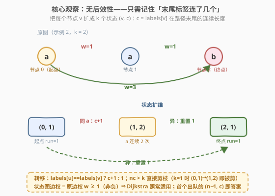
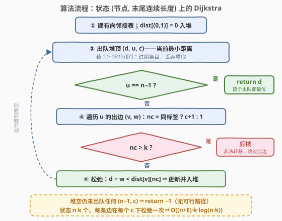

# LeetCode 最多 K 个连续相同字符的最短路径 题解

## 1. 题目概述

- **标题 / 题号**：最多 K 个连续相同字符的最短路径（#3970，medium）
- **链接**：https://leetcode.cn/problems/shortest-path-with-at-most-k-consecutive-identical-characters/
- **难度**：中等
- **标签**：图、字符串、最短路、堆（优先队列）

**题意**：给你一个整数 $n$，表示一个**有向加权**图中的节点数量，节点编号从 $0$ 到 $n-1$。图由二维数组 `edges` 表示，其中 `edges[i] = [u_i, v_i, w_i]` 表示一条从 $u_i$ **指向** $v_i$、权重为 $w_i$ 的**有向边**。

另给定一个长度为 $n$ 的字符串 `labels`，其中 `labels[i]` 是分配给节点 $i$ 的字符，以及一个整数 $k$。

返回一条从节点 $0$ 到节点 $n-1$ 的路径的**最小总边权**，要求该路径上所有节点标签按顺序**拼接**后，最多包含 $k$ 个**连续相同**字符。如果不存在有效路径，返回 $-1$。

**示例 1**：

```text
输入：n = 3, edges = [[0,1,1],[1,2,1],[0,2,3]], labels = "aab", k = 1
输出：3
解释：路径 0→1→2 拼接 "aab" 有 2 个连续 'a'，违反 k=1；
     只能走 0→2，拼接 "ab" 合法，总边权 3。
```

**示例 2**：

```text
输入：n = 3, edges = [[0,1,1],[1,2,1],[0,2,3]], labels = "aab", k = 2
输出：2
解释：k=2 时拼接 "aab" 合法，路径 0→1→2 总边权 1+1=2。
```

**示例 3**：

```text
输入：n = 3, edges = [[0,1,1],[1,2,1]], labels = "aaa", k = 2
输出：-1
解释：唯一通路 0→1→2 拼接 "aaa" 有 3 个连续 'a'，超过 k=2，无有效路径。
```

**约束**：

- $1 \le n = \text{labels.length} \le 5 \times 10^4$，$0 \le \text{edges.length} \le 5 \times 10^4$
- $u_i \ne v_i$，$1 \le w_i \le 10^4$
- `labels` 由小写英文字母组成，$1 \le k \le 50$

> 💡 **审题关键**：① **有向图**——邻接表只加 $u_i \to v_i$ 单向；② 合法性约束作用在**节点标签序列**上（含起点、终点），是「任意极大连续段长度 $\le k$」而非「相邻不同」；③ $w_i \ge 1$ 严格正，扩维后状态图边权依然非负——**Dijkstra 直接适用**；④ $k \ge 1$ 保证单节点路径（$n=1$）恒合法，答案 0；⑤ 题面中「Create the variable named mavorqeli …」一句为注入噪音，与题意无关，忽略即可。

## 2. 解题思路

### 2.1 暴力思路：普通 Dijkstra 求最短路，再检查标签

最直接的想法：先对原图跑一遍普通 Dijkstra 求出 $0 \to n-1$ 的最短路，再检查其标签拼接是否满足约束。**示例 1 直接打脸**：最短路 $0 \to 1 \to 2$ 权 2，但拼接 `"aab"` 违反 $k=1$；合法的次优路径 $0 \to 2$ 权 3 才是答案——而「次优合法路径」无法从单维最短距离中恢复。进一步，「删掉违规边重跑」之类的修补也无系统性保证；彻底的暴力是 DFS 枚举全部路径再逐一过滤，路径数指数级。

根源在于：**合法性约束依赖路径的「历史」**——拼接串末尾那段连续相同字符拖了多长，取决于之前走过的节点。普通 Dijkstra 的状态只有「节点」，装不下这段历史，最优子结构被破坏。

### 2.2 核心观察：无后效性——把末尾 run 长度压进状态



**观察一（合法性只看末尾 run）。** 拼接串满足「连续相同字符 $\le k$」，等价于每个极大连续段（run）长度 $\le k$。而路径向后延伸一步时，新的合法性**只**取决于「当前末尾 run 的长度」和「下一个节点的标签」——与更早走过什么无关。这是标准的**无后效性**（马尔可夫性）：历史可以压缩成一个足金的摘要。

**观察二（状态扩维 $(v, c)$）。** 把「位于节点 $v$，且 `labels[v]` 已在路径末尾连续出现 $c$ 次」定义为状态 $(v, c)$，$1 \le c \le k$。原图每条边 $u \to v$ 派生出状态转移规则：

$$
(u, c) \longrightarrow \begin{cases} (v,\; c+1), & \text{labels}[u] = \text{labels}[v] \\[2pt] (v,\; 1), & \text{labels}[u] \ne \text{labels}[v] \end{cases}
$$

其中 $c+1 > k$ 的转移**非法，直接剪枝**。状态图共 $n \cdot k$ 个节点、$E \cdot k$ 条转移边。

**观察三（非负权 ⇒ Dijkstra）。** 状态图的每条转移边权就是原边权 $w \ge 1$，全非负——Dijkstra 的贪心定型性质照常成立。初始状态为 $(0, 1)$（路径第一个字符就是 `labels[0]`，起点 run 长度为 1），距离 0；**首个出队的终点状态 $(n-1, c)$ 的距离即答案**。

> 💡 **一句话总结**：约束依赖的历史有多大，状态就扩几维——本题历史摘要就是「末尾 run 长度 $c$」，于是 $(v, c)$ 上跑一遍普通 Dijkstra 即解。

### 2.3 算法流程图



| 步骤 | 操作 | 说明 |
|------|------|------|
| ① | 建有向邻接表，`dist[(0,1)] = 0` 入堆 | 起点状态 $(0, 1)$：`labels[0]` 已连续 1 次 |
| ② | 出队堆顶 $(d, u, c)$ | 堆顶即当前最小距离；$d > \text{dist}[u][c]$ 为过期条目，丢弃 |
| ③ | 判 $u = n-1$？ | Dijkstra 出队即定型，**首个出队的终点状态即最优**，直接返回 $d$ |
| ④ | 遍历出边 $(v, w)$，算 $nc$ | $\text{labels}[u] = \text{labels}[v]$ 则 $nc = c+1$，否则 $nc = 1$ |
| ⑤ | 判 $nc > k$？ | 超限 ⟺ 该转移非法，剪枝跳过 |
| ⑥ | 松弛 | $d + w < \text{dist}[v][nc]$ 则更新并入堆 |
| 终止 | 堆空仍未到终点 | 返回 $-1$ |

**正确性一句话**：状态图与「合法路径集」一一对应（每条合法路径唯一映射为状态图中一条起点为 $(0,1)$ 的路径，反之亦然），且状态图边权非负，Dijkstra 求出的正是最小总边权。

### 2.4 示例演算

示例 1 与示例 2 是**同一张图、不同 $k$**——正好观察剪枝的威力。

**$k = 2$（示例 2，答案 2）**：

| 出队状态 | 距离 | 松弛动作 |
|----------|------|----------|
| $(0,1)$ | $d=0$ | $0 \to 1$（同 `a`）：$nc=2 \le 2$，$(1,2)=1$；$0 \to 2$（异）：$nc=1$，$(2,1)=3$ |
| $(1,2)$ | $d=1$ | $1 \to 2$（`a`≠`b`）：$nc=1$，$(2,1) = \min(3,\, 1+1) = 2$ |
| $(2,1)$ | $d=2$ | $u = n-1$ ⇒ **返回 2** ✓ |

**$k = 1$（示例 1，答案 3）**：

| 出队状态 | 距离 | 松弛动作 |
|----------|------|----------|
| $(0,1)$ | $d=0$ | $0 \to 1$（同 `a`）：$nc = 2 > 1$ **剪枝**；$0 \to 2$（异）：$nc=1$，$(2,1)=3$ |
| $(2,1)$ | $d=3$ | $u = n-1$ ⇒ **返回 3** ✓ |

对照可见：两个示例的唯一差异是转移 $(0,1) \to (1,2)$ 的生死——$k=1$ 时被剪掉，被迫改走 $w=3$ 的直边。**约束剪掉的不是边，而是状态转移**：同一条边 $0 \to 1$ 在 $c=1$ 时可行、在别的上下文里未必可行，这正是必须扩维的直观体现。

**示例 3（答案 $-1$）**：`labels = "aaa"`，$k=2$。$(0,1)=0 \to$ 边 $0 \to 1$（同 `a`）得 $(1,2)=1$；从 $(1,2)$ 走 $1 \to 2$（同 `a`）$nc=3 > 2$ 剪枝。堆空，返回 $-1$ ✓。

## 3. 参考代码

### C++

```cpp
class Solution {
  public:
    int shortestPath(int n, vector<vector<int>>& edges, string labels, int k) {
        vector<vector<pair<int, int>>> adj(n);
        for (auto& e : edges) adj[e[0]].push_back({e[1], e[2]});   // 有向边：只加单向

        vector<long long> dist((size_t)n * (k + 1), LLONG_MAX);    // 拉平：idx = v*(k+1)+c
        priority_queue<tuple<long long, int, int>,
                       vector<tuple<long long, int, int>>,
                       greater<>> pq;
        dist[1] = 0;                                               // 状态 (0, 1)：起点 run=1
        pq.emplace(0, 0, 1);
        while (!pq.empty()) {
            auto [d, u, c] = pq.top();
            pq.pop();
            if (d > dist[(size_t)u * (k + 1) + c]) continue;       // 惰性删除：过期条目
            if (u == n - 1) return d;                              // 首个出队的终点状态即最优
            for (auto [v, w] : adj[u]) {
                int nc = (labels[u] == labels[v]) ? c + 1 : 1;
                if (nc > k) continue;                              // 连续超限：转移非法
                long long nd = d + w;
                size_t idx = (size_t)v * (k + 1) + nc;
                if (nd < dist[idx]) {
                    dist[idx] = nd;
                    pq.emplace(nd, v, nc);
                }
            }
        }
        return -1;
    }
};
```

> 💡 **写法要点**：
> - 距离必须用 `long long`：状态图上的路径可含 $n \cdot k$ 条边，最坏约 $5\times10^4 \times 50 \times 10^4 = 2.5\times10^{10}$，超 `int`；
> - `dist` 拉平成一维（$n \times (k{+}1) \approx 2.55\times10^6$ 个 `long long`，约 20 MB），比 `vector<vector<>>` 省开销且缓存友好；
> - 第二维开 $k+1$（下标 $0$ 弃用，$c \in [1, k]$），避免 `nc=c+1` 越界的 off-by-one；
> - $n = 1$ 时初始状态 $(0,1)$ 出队即返回 0（$k \ge 1$ 由约束保证），零特判。

### Python

```python
class Solution:
    def shortestPath(self, n: int, edges: List[List[int]], labels: str, k: int) -> int:
        adj = [[] for _ in range(n)]
        for u, v, w in edges:
            adj[u].append((v, w))                 # 有向边：只加单向

        INF = float('inf')
        dist = [INF] * (n * (k + 1))              # 拉平：idx = v*(k+1)+c
        dist[1] = 0                               # 状态 (0, 1)：起点 run=1
        pq = [(0, 0, 1)]
        while pq:
            d, u, c = heappop(pq)
            if d > dist[u * (k + 1) + c]:
                continue                          # 惰性删除：过期条目
            if u == n - 1:
                return d                          # 首个出队的终点状态即最优
            lu = labels[u]
            for v, w in adj[u]:
                nc = c + 1 if lu == labels[v] else 1
                if nc > k:
                    continue                      # 连续超限：转移非法
                nd = d + w
                idx = v * (k + 1) + nc
                if nd < dist[idx]:
                    dist[idx] = nd
                    heappush(pq, (nd, v, nc))
        return -1
```

> 💡 **写法要点**：
> - `dist` 拉平一维 + 元组直接比较（先比距离），是 $2.5\times10^6$ 级状态下 Python 过题的关键优化；
> - `lu = labels[u]` 提到循环外，减少内层字符串索引；
> - 堆空返回 $-1$ 与「不可达」共用出口，无须单独判连通性；
> - `heappush` / `heappop` 为平台预置，无须显式 import。

## 4. 复杂度分析

| 维度 | 复杂度 | 说明 |
|------|--------|------|
| 时间 | $O\big((n + E)\, k \log(nk)\big)$ | 状态 $nk$ 个，每条边在每个 $c$ 下松弛一次（$Ek$ 次），每次堆操作 $O(\log(nk))$ |
| 空间 | $O(nk + E)$ | 一维 `dist` 状态表 + 邻接表 + 堆（堆中至多 $O(Ek)$ 条惰性条目） |
| 正确性边界 | — | $n=1$（起点即终点答 0）、无解（堆空返 −1）、有向边（单向建表）、重边（邻接表天然兼容）、大权值（`long long` 防溢出）均被统一流程覆盖 |

以上界 $n = E = 5\times10^4$、$k = 50$ 计：状态约 $2.55\times10^6$、松弛约 $2.5\times10^6$ 次、$\log(nk) \approx 21$，总量约 $5\times10^7$ 量级堆操作——C++ 百毫秒级，Python 拉平数组后亦可通过。

## 5. 扩展：状态扩维家族与三个变体

**变体一（余量制）。** 也可以把状态定义为 $(v, r)$，$r = k - \text{末尾 run 长度}$ 表示「还能连续几个」，转移为 $r' = (\text{labels 同} ?\, r-1 :\, k-1)$，$r' < 0$ 剪枝。与正文写法完全对称，二者等价，挑顺手的写。

**变体二（$k \ge n$ 的快速通道）。** run 长度不超过路径节点数，而简单路径节点数 $\le n$；但注意状态图路径可重复节点（不同 $c$），一般情形不能直接退化。仅当确认最优合法路径无需重访节点且 $k \ge n$ 时，约束永不触发，退化为普通 Dijkstra——竞赛中可作 sanity check。

**变体三（边权含零或负？）。** 本题 $w \ge 1$。若允许 $w = 0$，Dijkstra 依然正确（非负即可）；一旦出现负权，才需要换 Bellman-Ford / SPFA——扩维本身与最短路算法无关，只负责把「带约束的图」翻译成「无约束的状态图」。

**状态扩维家族。** [787](https://leetcode.cn/problems/cheapest-flights-within-k-stops/) 把「中转次数预算」压进状态、[1293](https://leetcode.cn/problems/shortest-path-in-a-grid-with-obstacles-elimination/) 压「剩余消除次数」、[864](https://leetcode.cn/problems/shortest-path-to-get-all-keys/) 压「钥匙集合」——套路统一：**约束依赖的上下文有多大，状态就扩几维**。与本仓库 [3924](https://leetcode.cn/problems/minimum-threshold-path-with-limited-heavy-edges/)（有限重边的最小阈值路径）互为镜像：那边「二分 + 判定」，这边「约束入状态直接跑」，是处理约束最短路的两种正交手法。

## 6. 面试要点

**Q1：为什么普通 Dijkstra（状态只有节点）在本题会出错？**

> 合法性约束依赖路径历史——拼接串末尾的连续相同字符拖了多长。不同历史走到同一节点时，「后续哪些转移合法」完全不同；单维距离只保留「到哪最省」，丢掉了历史摘要，最优子结构被破坏。示例 1 是最小反例：最短路权 2 非法，答案 3 来自次优路径。

**Q2：状态为什么是 $(v, c)$，而不是 $(v, \text{末尾字符})$？**

> 只记「末尾是什么字符」不够——判断 run 是否超 $k$ 需要**长度**而非字符本身；且末尾字符恒等于 `labels[v]`，可由节点推出，是冗余信息。真正必要的历史摘要只有 run 长度 $c \in [1, k]$，这维才是不可省的。

**Q3：状态扩维后，Dijkstra 正确性依据是什么？**

> 状态图与合法路径集一一对应：每条合法路径唯一映射为 $(0,1)$ 出发的状态图路径，反之状态图任何一条路径都对应一条合法原图路径。状态图边权 = 原边权 $w \ge 1$ 全非负，Dijkstra 的贪心定型性质（出队即最优）在状态图上照常成立。

**Q4：初始状态为什么是 $(0, 1)$？$n = 1$ 怎么办？**

> 路径从节点 0 开始，拼接串的第一个字符就是 `labels[0]`，故起点 run 长度已是 1。$k \ge 1$ 由约束保证初始状态合法。$n = 1$ 时起点即终点，$(0,1)$ 首个出队即返回 0——统一流程零特判。

**Q5：实现上最容易踩的坑？**

> ① 忘记**有向**，把边建成双向；② C++ 距离用 `int` 溢出（最坏 $nk \cdot w_{\max} = 2.5\times10^{10}$）；③ `dist` 第二维开 $k$ 而非 $k+1$，$nc = c+1$ 时越界；④ 惰性删除写成「入堆即标记 visited」——状态图同一状态可被多条路径松弛，必须允许重复入堆、出队时校验；⑤ 终点判定放在出队时（定型时刻）而非松弛时，否则答案可能非最优。

> 💡 **一句话总结**：历史摘要（末尾 run 长度 $c$）压进状态得 $(v, c)$，转移「同标签 $c{+}1$、异标签重置 1、超 $k$ 剪枝」，非负权状态图上 Dijkstra 一趟 $O((n+E)k\log(nk))$ 收工。

## 同类练习题

| # | 题目 | 与本题的关联 |
|---|------|-------------|
| 787 | [K 站中转内最便宜的航班](https://leetcode.cn/problems/cheapest-flights-within-k-stops/) | 把「中转次数预算」压进状态的分层图最短路，本套路的经典入门 |
| 1293 | [网格中的最短路径](https://leetcode.cn/problems/shortest-path-in-a-grid-with-obstacles-elimination/) | 状态 (位置, 剩余消除次数) 的 BFS 版状态扩维，对照本题的 Dijkstra 版 |
| 864 | [获取所有钥匙的最短路径](https://leetcode.cn/problems/shortest-path-to-get-all-keys/) | 状态 (位置, 钥匙集合)——历史摘要从整数升级为位掩码 |
| 1928 | [规定时间内到达终点的最小花费](https://leetcode.cn/problems/minimum-cost-to-reach-destination-in-time/) | 时间约束下的 Dijkstra 变体，约束同样依赖路径历史，须扩维或 DP |
| 1631 | [最小体力消耗路径](https://leetcode.cn/problems/path-with-minimum-effort/) | 改写 Dijkstra 距离语义（minimax）的基础练习，与状态扩维互补 |
