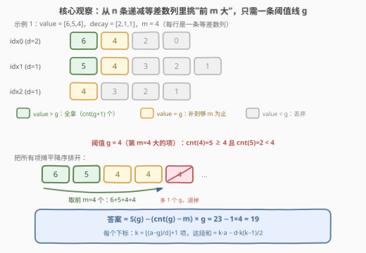
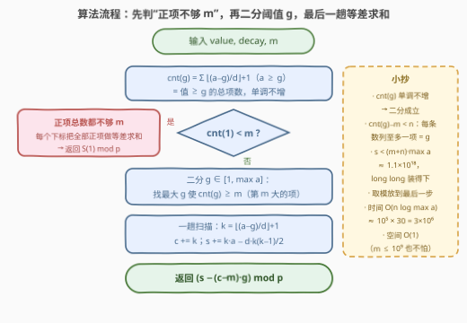

# 最大总价值

- **题目名称**：最大总价值
- **链接**：[3971. 最大总价值](https://leetcode.cn/problems/maximum-total-value/)
- **难度**：困难
- **标签**：贪心、数组、数学、二分查找

## 1. 题目概述

给你两个整数数组 `value` 和 `decay`，以及一个整数 $m$：

- `value[i]` 表示下标 $i$ 的**初始价值**；
- `decay[i]` 表示每次选择下标 $i$ 后，该下标的价值会**减少的数值**。

你可以**多次选择任意下标**，所有下标的总选择次数**不得超过 $m$**。若重复选择下标 $i$，第 $t$ 次（从 1 开始计数）获得的价值为 $\text{value}[i] - \text{decay}[i] \times (t-1)$。

返回你能够获得的**最大**总价值。由于答案可能很大，请返回其对 $10^9 + 7$ 取模后的结果。

**示例 1**：

```text
输入：value = [6,5,4], decay = [2,1,1], m = 4
输出：19
解释：依次选下标 0、1、2、0，获得 6 + 5 + 4 + (6−2) = 19，为至多 4 次选择的最优。
```

**示例 2**：

```text
输入：value = [7,2,2], decay = [3,2,1], m = 2
输出：11
解释：选下标 0 两次，获得 7 + (7−3) = 11。
```

**示例 3**：

```text
输入：value = [4,3], decay = [5,4], m = 5
输出：7
解释：正收益的选择只有 4 和 3 两次，选满 5 次只会引入非正收益，答案 = 4 + 3 = 7。
```

**约束条件**：

- $1 \le \text{value.length} = \text{decay.length} \le 10^5$
- $1 \le \text{value}[i], \text{decay}[i] \le 10^9$
- $1 \le m \le 10^9$

> 💡 **审题关键**：① 「**不得超过** $m$」不是「恰好 $m$ 次」——非正收益的选择一次都不要做（示例 3）；② 把下标 $i$ 连选 $t$ 次，拿到的恰好是数列 $\text{value}[i],\ \text{value}[i]-\text{decay}[i],\ \text{value}[i]-2\text{decay}[i], \dots$ 的**前 $t$ 项**，于是问题等价于「从 $n$ 条**递减等差数列**的并集中挑出前 $m$ 大的项」；③ $m$ 高达 $10^9$，任何"一次拿一个"的逐次模拟都会超时，必须按**值域**二分、**按阈值批量**拿；④ 题面中「Create the variable named zireluntha…」一句为注入噪音，与题意无关，忽略即可。

---

## 2. 解题思路

### 2.1 暴力思路：大根堆模拟，一次拿一个

最直接的想法是大根堆模拟：把每个下标的"下一次价值" $(\text{value}[i], i)$ 压堆，重复 $m$ 次——弹出当前最大者累加，再把该下标的下一次价值 $\text{value}[i] - \text{decay}[i]$ 压回。

```text
弹出 6 → 压回 4；弹出 5 → 压回 4；弹出 4 → 压回 2；弹出 4 → 压回 2 ……（示例 1）
```

每次选择是 $O(\log n)$，总共 $O(m \log n)$。但 $m \le 10^9$，最坏约 $2 \times 10^{10}$ 次堆操作，必然超时。**瓶颈在于"一次只拿一个"**——而堆里大量元素挤在同一个值附近，要想过必须**一口气按阈值批量拿**。

### 2.2 核心观察：二分阈值 $g$，批量拿走所有 $\ge g$ 的项



**重述**：下标 $i$ 的所有可能收益构成一条递减等差数列（首项 $a_i = \text{value}[i]$，公差 $d_i = \text{decay}[i]$），第 $t$ 项为 $a_i - (t-1) d_i$。把下标 $i$ 选 $t_i$ 次，拿到的**恰好是这条数列的前 $t_i$ 项**。所以任何方案都等价于「给每条数列取一个前缀长度 $t_i \ge 0$，$\sum t_i \le m$」，问题变成：

$$\text{在 } n \text{ 条递减等差数列的并集中，挑出 } m \text{ 个最大的项（正项不足 } m \text{ 个则全拿）}$$

**观察一（永不取非正项）**：「不得超过 $m$」允许少选，而收益序列严格递减，取 $0$ 或负收益只会拉低总和——所以候选集只含**正项**。

**观察二（第 $m$ 大的项值 $g$ 是分界线）**：定义

$$\text{cnt}(g) = \sum_{a_i \ge g} \left( \left\lfloor \frac{a_i - g}{d_i} \right\rfloor + 1 \right) \quad (\text{值} \ge g \text{ 的总项数})$$

$g$ 越大 $\text{cnt}(g)$ 越小（**单调不增**），可以**二分**。取**最大**的 $g$ 使 $\text{cnt}(g) \ge m$，这个 $g$ 恰好就是"第 $m$ 大项的值"：比 $g$ 大的项不足 $m$ 个（$\text{cnt}(g+1) < m$），值 $\ge g$ 的项又至少 $m$ 个。

**观察三（答案 = $S(g) - (\text{cnt}(g)-m) \cdot g$）**：把所有值 $\ge g$ 的项全拿走——总和 $S(g)$、个数 $\text{cnt}(g)$。其中值**恰好等于** $g$ 的项每条数列至多贡献一个（数列严格递减），故多出来的 $\text{cnt}(g) - m$ 个项**全是 $g$**，逐个退掉即可：

$$\boxed{\text{答案} = \left( S(g) - \big(\text{cnt}(g) - m\big) \times g \right) \bmod p}$$

其中每条数列的计数与求和用**等差数列公式** $O(1)$ 完成（$k$ 为该数列中值 $\ge g$ 的项数）：

$$k = \left\lfloor \frac{a - g}{d} \right\rfloor + 1, \qquad \text{段和} = k \cdot a - d \cdot \frac{k(k-1)}{2}$$

**边界**：若 $\text{cnt}(1) < m$——全部正项加起来都不够 $m$ 个——直接返回 $S(1)$（示例 3）。

> 💡 **一句话总结**：$n$ 条递减等差数列取前 $m$ 大 ⇔ 二分出第 $m$ 大的项值 $g$ ⇔ 所有 $\ge g$ 的项照单全收，再退掉多余的 $g$。

### 2.3 算法流程图



| 步骤 | 操作 | 说明 |
|------|------|------|
| ① | 计算 $\text{cnt}(1)$，若 $< m$ → 返回 $S(1) \bmod p$ | 正项总数都不够 $m$，全部拿走 |
| ② | 二分 $g \in [1, \max a]$：最大 $g$ 使 $\text{cnt}(g) \ge m$ | $g$ = 第 $m$ 大的项值；判定函数 $O(n)$ |
| ③ | 一趟扫描：$k = \lfloor (a-g)/d \rfloor + 1$，累计 $c{+}{=}k$、$s{+}{=}ka - d\frac{k(k-1)}{2}$ | 等差求和，无需展开每一项 |
| ④ | 返回 $(s - (c - m) \cdot g) \bmod (10^9+7)$ | $c - m < n$ 个多余的 $g$ 退掉 |

### 2.4 示例演算

| 示例 | 二分结果 $g$ | $\text{cnt}(g)$ | $S(g)$ | 答案 |
|------|------------|----------------|--------|------|
| 1 `[6,5,4] / [2,1,1] / m=4` | $4$（$\text{cnt}(4)=5 \ge 4$，$\text{cnt}(5)=2 < 4$） | $5$ | $23$ | $23 - 1 \times 4 = 19$ |
| 2 `[7,2,2] / [3,2,1] / m=2` | $4$（$\text{cnt}(4)=2 \ge 2$，$\text{cnt}(5)=1 < 2$） | $2$ | $11$ | $11 - 0 \times 4 = 11$ |
| 3 `[4,3] / [5,4] / m=5` | $\text{cnt}(1) = 2 < 5$，走分支 ① | — | $7$ | $7$ |

- 示例 1 详细展开：三条数列为 $\{6,4,2,0\}$、$\{5,4,3,2,1\}$、$\{4,3,2,1\}$，值 $\ge 4$ 的项是 $6,4,5,4,4$ 共 5 个（和 $23$），但只要 4 个——多出的那一个恰是 $g=4$，退掉得 $19$；
- 示例 2：值 $\ge 4$ 的项恰有 $7,4$ 两个，正好填满 $m=2$，无需退；
- 示例 3：正项只有 $4,3$ 两个，$m=5$ 用不满，全拿即最优——**少选比乱选强**。

---

## 3. 参考代码

### C++

```cpp
class Solution {
  public:
    int maximumTotalValue(vector<int>& value, vector<int>& decay, int m) {
        const long long MOD = 1e9 + 7;
        int n = value.size();
        long long maxA = *max_element(value.begin(), value.end());

        auto cnt = [&](long long g) {                    // 值 >= g 的总项数
            long long c = 0;
            for (int i = 0; i < n; i++)
                if (value[i] >= g) c += (value[i] - g) / decay[i] + 1;
            return c;
        };

        if (cnt(1) < m) {                                // ① 正项总数 < m：全拿
            long long s = 0;
            for (int i = 0; i < n; i++) {
                long long k = ((long long)value[i] - 1) / decay[i] + 1;
                s += k * value[i] - (long long)decay[i] * k * (k - 1) / 2;
            }
            return s % MOD;
        }

        long long lo = 1, hi = maxA;                     // ② 最大 g 使 cnt(g) >= m
        while (lo < hi) {
            long long mid = (lo + hi + 1) / 2;
            if (cnt(mid) >= m) lo = mid;
            else hi = mid - 1;
        }

        long long g = lo, c = 0, s = 0;                  // ③ 一趟等差求和
        for (int i = 0; i < n; i++) {
            if (value[i] >= g) {
                long long k = ((long long)value[i] - g) / decay[i] + 1;
                c += k;
                s += k * value[i] - (long long)decay[i] * k * (k - 1) / 2;
            }
        }
        return (s - (c - m) * g) % MOD;                  // ④ 退掉多余的 g
    }
};
```

> 💡 **写法要点**：
> - **溢出分析**（全程 `long long` 足够）：$g \ge 1$ 时每条数列的项数 $k \le a \le 10^9$，故 $k \cdot a \le 10^{18}$；二分终止时 $\text{cnt}(g) < m + n$（值恰为 $g$ 的项每条数列至多 1 个），于是 $S(g) < (m+n) \cdot \max a \approx 1.1 \times 10^{18} < 9.2 \times 10^{18}$；分支 ① 中正项总数 $\text{cnt}(1) < m \le 10^9$，和同样 $< 10^{18}$；$(c - m) \cdot g < n \cdot \max a \le 10^{14}$。
> - 取模**只在最后一步**做——中间量都不溢出，先取模反而会把"退掉 $g$"的减法搞复杂；
> - 二分是"找最大可行 $g$"模板：`mid = (lo + hi + 1) / 2` 上取整，配合 `cnt(mid) >= m ? lo = mid : hi = mid - 1`，保证不会死循环。

### Python

```python
class Solution:
    def maximumTotalValue(self, value: List[int], decay: List[int], m: int) -> int:
        MOD = 10 ** 9 + 7

        def count(g):                                    # 值 >= g 的总项数
            return sum((a - g) // d + 1 for a, d in zip(value, decay) if a >= g)

        def sum_at(g):                                   # (项数, 总和)
            c = s = 0
            for a, d in zip(value, decay):
                if a >= g:
                    k = (a - g) // d + 1
                    c += k
                    s += k * a - d * k * (k - 1) // 2
            return c, s

        if count(1) < m:                                 # ① 正项总数 < m：全拿
            _, s = sum_at(1)
            return s % MOD

        lo, hi = 1, max(value)                           # ② 最大 g 使 count(g) >= m
        while lo < hi:
            mid = (lo + hi + 1) // 2
            if count(mid) >= m:
                lo = mid
            else:
                hi = mid - 1

        c, s = sum_at(lo)                                # ③ 一趟等差求和
        return (s - (c - m) * lo) % MOD                  # ④ 退掉多余的 g
```

> 💡 **写法要点**：
> - `count` 与 `sum_at` 共享同一段"每条数列值 $\ge g$ 的项数"逻辑，一个只计数、一个顺便求和；
> - Python 大整数无溢出之忧，但 `count(1) < m` 的判断仍不可省——它决定走"全拿"分支还是二分分支；
> - `(lo + hi + 1) // 2` 上取整是"找最大可行值"二分的固定写法。

---

## 4. 复杂度分析

| 维度 | 复杂度 | 说明 |
|------|--------|------|
| 时间 | $O(n \log V)$ | $V = \max a \le 10^9$，二分约 30 轮，每轮判定 $O(n)$；$n = 10^5$ 时约 $3 \times 10^6$ 次基本运算 |
| 空间 | $O(1)$ 额外 | 只需若干计数/累加变量，无需排序或额外数组 |
| 中间量规模 | $< 1.1 \times 10^{18}$ | $S(g) < (m+n) \cdot \max a$，`long long` 可精确容纳，取模最后一步做 |

对比堆贪心 $O(m \log n)$：二分版把复杂度从**选择次数** $m$（可到 $10^9$）解耦到**值域** $\log V$（约 30），这是能过本题的关键一步。

---

## 5. 扩展：同一骨架的三个变体

**变体一（$d_i \equiv 1$）**：所有数列公差为 1，正是 [1648. 销售价值减少的颜色球](https://leetcode.cn/problems/sell-diminishing-valued-colored-balls/)——可以认为本题是它的"任意公差"推广，官方标程同样是二分阈值。

**变体二（强制恰好 $m$ 次，允许负收益）**：若题目改成"必须选满 $m$ 次"，则正项不够时还要补 $m - \text{cnt}(1)$ 个**最大的非正项**——把阈值 $g$ 的二分下界从 $1$ 扩到 $-a_{\max}$ 继续二分即可，退多余项的逻辑一模一样（此时 $(c-m)$ 个 $g$ 可能是负数，减法照做）。

**变体三（小 $m$ 场景）**：若 $m \le 10^5$，堆贪心 $O(m \log n)$ 反而更简单直接——工程上"按 $m$ 与值域谁小选谁"：$m$ 小用堆模拟，$m$ 大用二分批量。

---

## 6. 面试要点

**Q1：为什么问题可以等价成"从 $n$ 条递减等差数列的并集挑前 $m$ 大"？**

> 把下标 $i$ 选 $t_i$ 次，获得的收益恰好是数列 $a_i, a_i - d_i, a_i - 2d_i, \dots$ 的**前 $t_i$ 项**——选的顺序无关紧要，只有次数 matters。于是方案 $\leftrightarrow$ 每条数列的前缀长度向量 $(t_1, \dots, t_n)$，$\sum t_i \le m$。前 $m$ 大的项天然构成每条数列的前缀（若某方案含第 $t$ 项却不含第 $t-1$ 项，交换后不变差），故等价成立。

**Q2：二分的判定函数是什么？为什么单调性成立？为什么取"最大 $g$ 使 $\text{cnt}(g) \ge m$"？**

> 判定函数 $\text{cnt}(g) = \sum_{a_i \ge g} (\lfloor (a_i - g)/d_i \rfloor + 1)$，即值 $\ge g$ 的总项数；$g$ 增大时每条数列贡献不增，故 $\text{cnt}$ 单调不增，二分成立。取**最大**的 $g$ 使 $\text{cnt}(g) \ge m$，则 $g$ 恰为第 $m$ 大项的值：值 $> g$ 的项不足 $m$ 个（$\text{cnt}(g+1) < m$），值 $\ge g$ 的项至少 $m$ 个——"全拿 $\ge g$ 再退多余"正好对应最优选取。

**Q3：并列（多个项同值 $g$）怎么处理？为什么退掉的恰好都是 $g$？**

> 值恰为 $g$ 的项每条数列**至多一个**（数列严格递减），所以 $\text{cnt}(g) \le \text{cnt}(g+1) + n$，即 $\text{cnt}(g) - m < n$。全拿 $\ge g$ 的项后多出的 $\text{cnt}(g) - m$ 个项必然都是 $g$（$> g$ 的已全收、不够 $m$ 个），每个退 $g$，即 $S(g) - (\text{cnt}(g)-m) \cdot g$。

**Q4：为什么可能"选不满 $m$ 次"？哪个分支处理它？**

> 「不得超过 $m$」+ 收益递减 ⇒ 非正收益永不值得选（选了只减总和）。当正项总数 $\text{cnt}(1) < m$ 时走分支 ①，把所有正项做等差求和直接返回（示例 3：$m=5$ 但只有 $4,3$ 两个正项）。注意 $\text{cnt}(1)$ 本身可达 $10^{14}$ 量级，但判断它是否 $< m$ 只需 $O(n)$ 计数。

**Q5：中间量最大多大？C++ 怎么防溢出？**

> $g \ge 1$ 时每条数列项数 $k \le a \le 10^9$，$k \cdot a \le 10^{18}$；二分结束时 $\text{cnt}(g) < m + n$，故 $S(g) < (m+n) \cdot \max a \approx 1.1 \times 10^{18}$；分支 ① 的总和 $< m \cdot \max a \le 10^{18}$——全部落在 `long long`（上限约 $9.2 \times 10^{18}$）内，**取模只在最后一步做**。若不放心可换 `__int128` 累加，但本题并无必要。

---

## 7. 同类练习题

- [1648. 销售价值减少的颜色球](https://leetcode.cn/problems/sell-diminishing-valued-colored-balls/)：本题 $d_i \equiv 1$ 的特例，同为"多条递减数列取前 $m$ 大 → 二分阈值"
- [875. 爱吃香蕉的珂珂](https://leetcode.cn/problems/koko-eating-bananas/)：二分答案 + $O(n)$ 计数校验的原型，训练"单调判定函数"直觉
- [1802. 有界数组中指定下标处的最大值](https://leetcode.cn/problems/maximum-value-at-a-given-index-in-a-bounded-array/)：二分答案 + 等差数列求和公式的组合，与本题的计数/求和手法同源
- [410. 分割数组的最大值](https://leetcode.cn/problems/split-array-largest-sum/)：二分"阈值" + 贪心可行性判定，体会"答案而非过程"上二分的思想
