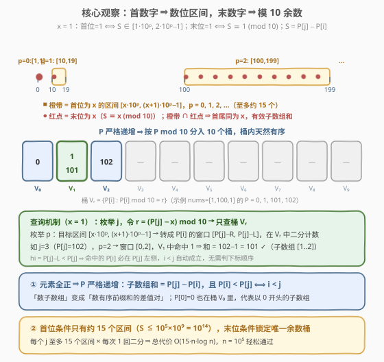
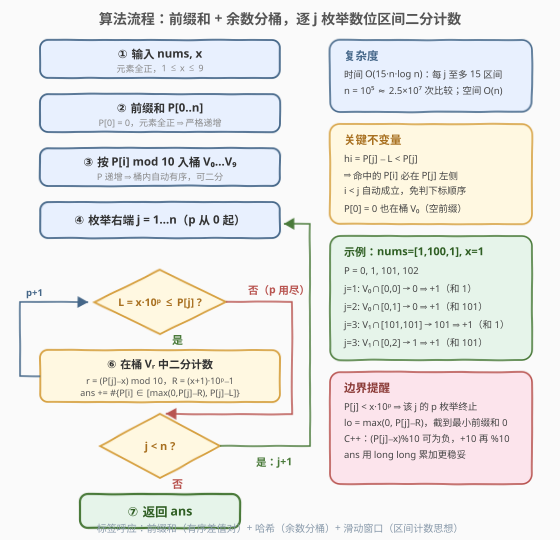

# 求和后首尾数字相同的有效子数组 II

- **题目名称**：求和后首尾数字相同的有效子数组 II
- **链接**：[3972. Valid Subarrays With Matching Sum Digits II](https://leetcode.cn/problems/valid-subarrays-with-matching-sum-digits-ii/)
- **难度**：困难
- **标签**：数组、哈希表、前缀和、滑动窗口

## 1. 题目概述

> ⚠️ 本题为 LeetCode 付费题，题意描述根据官方示例用例、官方 hints 与免费前作 [3969. 求和后首尾数字相同的有效子数组 I](https://leetcode.cn/problems/valid-subarrays-with-matching-sum-digits-i/) 重建，可能与官方题面有出入。函数签名（`countValidSubarrays(nums, x)`）取自官方 `metaData`，可信度较高。

给你一个整数数组 `nums` 和一个整数数字 `x`。如果一个**子数组** `nums[l..r]` 的元素和同时满足以下两个条件，则认为该子数组是**有效子数组**：

- 该和的**首位数字**等于 `x`；
- 该和的**末位数字**等于 `x`。

返回有效子数组的数量。子数组是数组中一个**连续、非空**的元素序列。

它是 3969 的加强版：**题意完全相同，数据范围大幅放大**——I 版 $n \le 1500$ 时 $O(n^2)$ 双循环即可通过，II 版必须借助前缀和单调性做 $O(n \log n)$ 级计数。官方三条 hints 给出的正是完整解题链：

1. 元素全为正 ⇒ 前缀和**严格递增**；
2. 和的首位数字为 $x$ ⟺ 它落在某个区间 $[x \cdot 10^p,\ (x+1) \cdot 10^p - 1]$ 内；
3. 再要求和 $\equiv x \pmod{10}$，然后统计**差值落在每个合法区间且余数匹配的前缀和对**。

**示例 1**：

```text
输入：nums = [1,100,1], x = 1
输出：4
解释：有效子数组：
  nums[0..0]：sum = 1（首 1 尾 1）
  nums[0..1]：sum = 101（首 1 尾 1）
  nums[1..2]：sum = 101（首 1 尾 1）
  nums[2..2]：sum = 1（首 1 尾 1）
```

**示例 2**：

```text
输入：nums = [1], x = 2
输出：0
解释：唯一的子数组 nums[0..0] 和为 1，首尾都不是 2。
```

**约束条件**（付费题，II 版精确数值不可见，按官方 hints 的算法结构与 I/II 惯例推断，以官方为准）：

- I 版：$1 \le nums.length \le 1500$，$1 \le nums[i] \le 10^9$，$1 \le x \le 9$；
- II 版推断：$nums.length$ 放大到 $10^5$ 量级（hints 只讲前缀和与区间/余数计数，未提 DP 或数据结构维护，指向 $O(15 \cdot n \log n)$ 解法），$nums[i]$、$x$ 范围不变，最大子数组和约 $10^{14}$。

> 💡 **审题关键**：① 「首位数字」不是最高位的**数位和**，就是十进制表示的第一个字符；② 元素全正 ⇒ 任何子数组和 $\ge 1$，不存在「和为 0 无首位」的边界；③ $x \in [1, 9]$，而首位为 $x$ 的正整数天然 $\ge x$，末位为 $x$ 的数 $\equiv x \pmod{10}$——两个条件一个是「区间」一个是「余数」，这正是不必逐位判数的突破口。

---

## 2. 解题思路

### 2.1 暴力思路：枚举所有子数组（I 版的做法）

枚举起点 $l$，向右扩展终点 $r$ 同时维护区间和 $S$；对每个 $S$，取末位 `S % 10`，再反复除 10 得到首位，判断两者是否都等于 $x$。单次判定 $O(\log_{10} S) \approx 15$，总计 $O(n^2 \cdot 15)$。

$n = 1500$ 时约 $3 \times 10^7$，I 版可过；$n = 10^5$ 时约 $10^{11}$，必然超时。瓶颈在于**逐个子数组、逐个数字地判断**——同一个前缀和参与了成千上万次减法，每次都在重复「取首位」的劳动。改进方向：把「首位 = $x$」「末位 = $x$」翻译成**关于差值的区间与余数条件**，让计数成批完成。

### 2.2 核心观察：前缀和有序 + 数位区间 + 余数分桶



**观察一（正元素 ⇒ 前缀和严格递增）。** 设 $P[0] = 0$，$P[j] = nums[0] + \dots + nums[j-1]$。元素全正 ⇒ $P$ **严格递增**，于是子数组和 $S(l..r) = P[r+1] - P[l]$，且

$$P[i] < P[j] \iff i < j$$

——「数有效子数组」变成「数有序数组 $P$ 中差值满足条件的数对 $(i, j)$」，且**下标顺序条件免费赠送**：只要差值窗口的上界小于 $P[j]$，命中的 $P[i]$ 必然在 $P[j]$ 左侧。

**观察二（首位为 $x$ ⟺ 差值落进至多约 15 个区间）。** 正整数 $S$ 的首位数字为 $x$，当且仅当存在 $p \ge 0$ 使

$$S \in [x \cdot 10^p,\ (x+1) \cdot 10^p - 1]$$

子数组和最大约 $10^5 \times 10^9 = 10^{14}$，故 $p$ 至多取到 14——**首位条件只有约 15 个候选区间**，可以逐个枚举，无需对每个 $S$ 反复除 10。

**观察三（末位为 $x$ ⟺ 模 10 余数锁定唯一桶）。** $S \equiv x \pmod{10}$ 即 $P[j] - P[i] \equiv x \pmod{10}$，即

$$P[i] \equiv P[j] - x \pmod{10}$$

把全部 $n+1$ 个前缀和**按 $\bmod\ 10$ 的余数分入 10 个桶** $V_0, \dots, V_9$。由于 $P$ 递增，每个桶内**天然有序**——对固定 $j$ 与 $p$，「$P[i]$ 落在 $[P[j]-R,\ P[j]-L]$ 且余数为 $r$」就是在桶 $V_r$ 上做一次**二分区间计数**。

于是每个 $j$ 的代价：至多 15 个 $p$ × 每个 1 次二分 = $O(15 \log n)$，总计 $O(15 \cdot n \log n)$，$n = 10^5$ 时约 $2.5 \times 10^7$ 次比较，轻松通过。

> ⚠️ **别忘了 $P[0] = 0$ 也要入桶**：它代表「空前缀」，$P[j] - P[0]$ 对应子数组 $nums[0..j-1]$。$P[0] = 0$ 落在桶 $V_0$ 中。

### 2.3 算法流程图



| 步骤 | 操作 | 说明 |
|------|------|------|
| ① | 读入 `nums, x` | 元素全正，$1 \le x \le 9$ |
| ② | 前缀和 `P[0..n]` | `P[0]=0`；元素全正 ⇒ 严格递增 |
| ③ | 按 `P[i] % 10` 入桶 `V₀…V₉` | P 递增 ⇒ 桶内自动有序 |
| ④ | 枚举右端 `j = 1…n`，`p` 从 0 起 | `r = (P[j] − x) mod 10` 定桶 |
| ⑤ | `L = x·10ᵖ ≤ P[j]` ? | 否 ⇒ 该 `j` 的 `p` 枚举终止，转 `j+1` |
| ⑥ | 桶 `Vᵣ` 中二分 `[max(0, P[j]−R), P[j]−L]` | `R = (x+1)·10ᵖ−1`；`ans +=` 命中个数 |
| ⑦ | 返回 `ans` | 内部用 64 位累加 |

### 2.4 示例演算

取官方示例 1（`nums = [1,100,1], x = 1`）：$P = [0, 1, 101, 102]$，分桶后 $V_0 = \{0\}$，$V_1 = \{1, 101\}$，$V_2 = \{102\}$。

| $j$ | $P[j]$ | $p$ | 目标区间 $[L, R]$ | $P[i]$ 窗口 $[\max(0, P_j - R),\ P_j - L]$ | 查桶 $r=(P_j-x)\%10$ | 命中 | 对应子数组（和） |
|-----|--------|-----|-------------------|---------------------------------------------|----------------------|------|------------------|
| 1 | 1   | 0 | $[1, 1]$       | $[0, 0]$         | $V_0$ | $0$        | $[0..0]$（1）✓ |
| 2 | 101 | 2 | $[100, 199]$   | $[0, 1]$         | $V_0$ | $0$        | $[0..1]$（101）✓ |
| 3 | 102 | 0 | $[1, 1]$       | $[101, 101]$     | $V_1$ | $101$      | $[2..2]$（1）✓ |
| 3 | 102 | 2 | $[100, 199]$   | $[0, 2]$         | $V_1$ | $1$        | $[1..2]$（101）✓ |

（$j=1$ 的 $p=1,2$ 与 $j=2$ 的 $p=0,1$ 因 $L > P[j]$ 或窗口无命中而贡献 0，略。）

合计 $ans = 1 + 1 + 1 + 1 = 4$ ✓。注意 $j=3$ 的 $p=0$ 档：窗口 $[101, 101]$ 恰好套住 $V_1$ 中的 $101$，对应**长度为 1** 的子数组 $[2..2]$——$hi = 101 < P[3] = 102$，下标顺序自动成立；而 $P[3]$ 自身的值 $102$ 永远不会被任何窗口命中（$hi \le P[j] - x < P[j]$），无需担心「自己减自己」。

再验示例 2（`nums = [1], x = 2`）：$P = [0, 1]$；$j = 1$ 时最小目标区间 $L = 2 > P[1] = 1$，p 枚举直接终止，$ans = 0$ ✓。

---

## 3. 参考代码

### C++

```cpp
class Solution {
  public:
    int countValidSubarrays(vector<int>& nums, int x) {
        int n = nums.size();
        vector<long long> P(n + 1);
        for (int i = 0; i < n; ++i) P[i + 1] = P[i] + nums[i];

        // 按 mod 10 分桶；P 严格递增 ⇒ 桶内自动有序
        vector<vector<long long>> bucket(10);
        for (long long v : P) bucket[v % 10].push_back(v);

        long long ans = 0;
        for (int j = 1; j <= n; ++j) {
            long long pj = P[j];
            int r = (int)(((pj - x) % 10 + 10) % 10);   // pj < x 时 C++ 取模为负，修正
            auto& b = bucket[r];
            long long pw = 1, L = x;                     // L = x·10^p
            while (L <= pj) {                            // 否则 hi = pj−L < 0，该 j 收工
                long long R = (x + 1) * pw - 1;
                long long lo = max(0LL, pj - R), hi = pj - L;
                ans += upper_bound(b.begin(), b.end(), hi)
                     - lower_bound(b.begin(), b.end(), lo);
                pw *= 10;
                L = x * pw;
            }
        }
        return (int)ans;
    }
};
```

> 💡 **写法要点**：
> - `(pj - x) % 10` 在 `pj < x` 时（如 `pj=1, x=9`）C++ 结果为负，必须 `+10 再 %10` 修正，否则数组越界；Python 的 `%` 天然非负，无此坑；
> - `while (L <= pj)` 同时承担两职：保证 `hi = pj - L ≥ 0`，且天然是 p 的终止条件——不需要预先算死上界，约束再放大（前缀和到 $10^{16}$）也不漏档；
> - 桶里存的是 `long long` 前缀和（最大约 $10^{14}$），二分比较无溢出风险；
> - 答案按官方 `metaData` 返回 `integer`（首位/末位条件联合密度约 $1/90$，$n=10^5$ 时答案约 $10^8$ 量级），内部仍用 `long long` 累加更稳。

### Python

```python
from bisect import bisect_left, bisect_right
from typing import List

class Solution:
    def countValidSubarrays(self, nums: List[int], x: int) -> int:
        n = len(nums)
        P = [0] * (n + 1)
        for i, v in enumerate(nums):
            P[i + 1] = P[i] + v

        buckets = [[] for _ in range(10)]
        for v in P:                       # P 严格递增 ⇒ 每个桶天然有序
            buckets[v % 10].append(v)

        ans = 0
        for j in range(1, n + 1):
            pj = P[j]
            b = buckets[(pj - x) % 10]    # Python % 天然非负
            pw, L = 1, x
            while L <= pj:
                R = (x + 1) * pw - 1
                lo = max(0, pj - R)
                hi = pj - L
                ans += bisect_right(b, hi) - bisect_left(b, lo)
                pw *= 10
                L = x * pw
        return ans
```

> 💡 **写法要点**：
> - `bisect_right(b, hi) - bisect_left(b, lo)` 即「桶内值 ∈ [lo, hi] 的个数」——`bisect_left` 找第一个 $\ge lo$，`bisect_right` 找第一个 $> hi$；
> - 两版代码均已在本地与 $O(n^2)$ 逐位判定暴力对拍 3000 组随机用例（含 $x$ 取遍 1–9、末位不匹配、单元素等边界），并跑通官方两个示例。

---

## 4. 复杂度分析

| 维度 | 复杂度 | 说明 |
|------|--------|------|
| 时间 | $O(15 \cdot n \log n)$ | 每个 $j$ 至多 $\lceil \log_{10}(\max P / x) \rceil \approx 15$ 个区间，每档一次 $O(\log n)$ 二分；$n = 10^5$ 时约 $2.5 \times 10^7$ 次比较 |
| 空间 | $O(n)$ | 10 个桶合计存 $n+1$ 个前缀和 |
| 正确性边界 | — | $P[j] < x$（p 枚举空转，`while` 自然挡掉）；`lo` 截到 0（最小前缀和）；$P[0]=0$ 入桶（空前缀）；C++ 负数取模须 `+10 再 %10` |

---

## 5. 扩展：均摊 O(1) 的双指针与「滑动窗口」标签

**为什么官方标签里有「滑动窗口」？** 固定余数配对 $a \to b = (a + x) \bmod 10$ 与档位 $p$ 后，让 $j$ 沿桶 $V_b$ 的顺序前进：窗口 $[P[j]-R,\ P[j]-L]$ 的**两端随 $P[j]$ 单调右移**。于是可以用两个指针 $loPtr/hiPtr$ 在桶 $V_a$ 上均摊 $O(1)$ 地滑动维护命中个数，整体降为

$$O(10 \times 15 \times n) = O(150 \cdot n)$$

无需二分。原理与「P 递增 ⇒ 桶内有序」同源：**单调性让窗口端点只进不退**。本题 $n \le 10^5$ 时二分版已绰绰有余，双指针版是常数优化；若数据范围再放大到 $10^6$+（窗口判定要求 $O(n)$ 级），双指针才是正解。

**若允许 $nums[i] = 0$ 会怎样？** $P$ 变成非严格递增，桶内出现相等值。由于窗口上界 $hi < P[j]$，值等于 $P[j]$ 的元素永不出现在窗口里，「$P[i] \le hi \Rightarrow i < j$」依然成立；而和为 0 的子数组不落进任何 $[x \cdot 10^p, \dots)$（$x \ge 1$），被区间条件自然排除——本算法无需修改即可兼容零元素。

**「首位数字」类条件的通用翻译。** 「首位为 $x$」⟺ 值域区间族 $[x \cdot 10^p, (x+1) \cdot 10^p - 1]$；「末位为 $x$」⟺ 模 $10^x$ 余数类（推广：末 $k$ 位 ⟺ 模 $10^k$）。凡涉及**数位的计数**，先尝试把数位条件翻译成「区间 ∩ 余数类」，就能从逐位判定（$O(\log S)$ 每次且不可合并）转为批量计数（有序结构上二分/双指针），这是本题最值得带走的一招。

---

## 6. 面试要点

**Q1：为什么全程不用显式保证 $i < j$？**

> 窗口上界 $hi = P[j] - L \le P[j] - x < P[j]$，而 $P$ 严格递增，故任何被命中的 $P[i] \le hi < P[j]$ 必然来自下标更小的位置；值等于 $P[j]$ 的元素（包括 $P[j]$ 自己）永远进不了窗口，「自己减自己」「反序对」天然不存在。

**Q2：首位数字条件为什么翻译成区间而不是循环除 10？**

> 循环除 10 是**逐值判定**，$O(\log S)$ 每次且无法合并；翻译成 $[x \cdot 10^p, (x+1) \cdot 10^p - 1]$ 后，「差值 ∈ 区间」可以与「差值 ≡ x (mod 10)」正交组合，在有序桶上用二分/双指针**成批计数**。数位条件的「区间化 / 余数化」是数位计数的通用起手式。

**Q3：为什么按 mod 10 预分 10 个桶，而不是查询时在全局有序的 P 上二分？**

> 全局二分只能数出「$P[i] \in [lo, hi]$」的个数，余数条件 $\equiv P[j] - x \pmod{10}$ 无法带上；按余数预分成 10 个有序桶后，一次二分同时吃下区间与余数两个条件。本质是把「区间 ∩ 余数类」的二维约束，用 10 个桶做**散列分维**（哈希表标签的由来）。

**Q4：C++ 实现有哪些坑？**

> ① `(P[j] - x) % 10` 在 `P[j] < x` 时为负，需 `((v % 10) + 10) % 10`；② 前缀和最大约 $10^{14}$，桶与中间量必须 `long long`；③ p 的终止用 `while (L <= P[j])` 动态判断，别写死 15——约束未知时（付费题）写死上界可能漏档。

**Q5：与 974「和可被 K 整除的子数组」有何异同？**

> 同：都以「前缀和 + 模意义下分组」把子数组和的条件转成数对条件。异：974 只需**同余计数**（哈希表记每个余数出现次数即可，$O(n)$）；本题余数条件之外还有**值域区间**条件，哈希计数不够用，必须借助 $P$ 的单调性在有序桶上做区间计数（$O(15 n \log n)$）。条件越「值域化」，越需要有序结构。

> 💡 **一句话总结**：正元素 ⇒ 前缀和严格递增 ⇒ 子数组成「有序差值对」；首位 = $x$ 翻译成约 15 个 $10^p$ 区间，末位 = $x$ 翻译成模 10 余数桶；每个 $j$ 拿着区间去对应余数桶里二分计数，$O(15 \cdot n \log n)$ 收工。

---

## 7. 同类练习题

- [3969. 求和后首尾数字相同的有效子数组 I](https://leetcode.cn/problems/valid-subarrays-with-matching-sum-digits-i/)：本题免费版，$n \le 1500$，双暴力循环即可，适合先写它再升级
- [974. 和可被 K 整除的子数组](https://leetcode.cn/problems/subarray-sums-divisible-by-k/)：前缀和 + 模余数计数（纯哈希版），对照理解「只有余数条件」时为何不需要有序桶
- [560. 和为 K 的子数组](https://leetcode.cn/problems/subarray-sum-equals-k/)：前缀和 + 哈希计数数对的母题，$P[j] - P[i] = k$ 的特例
- [327. 统计区间和的个数](https://leetcode.cn/problems/count-of-range-sum/)：统计「差值落在 [lo, hi]」的前缀和对——本题去掉余数条件的近亲套路（归并/树状数组）
- [862. 和至少为 K 的最短子数组](https://leetcode.cn/problems/shortest-subarray-with-sum-at-least-k/)：同样利用前缀和单调性，但维护的是双端队列而非分桶二分
