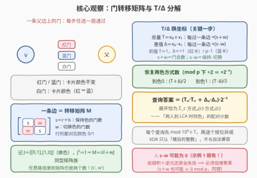
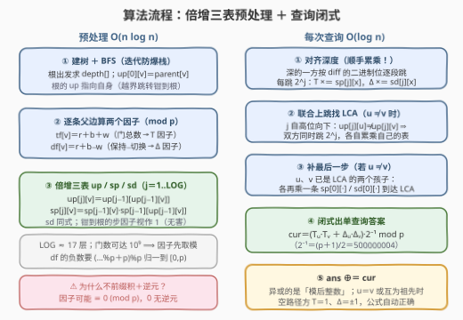

# 通往最近公共祖先的不同门径

- **题目名称**：通往最近公共祖先的不同门径
- **链接**：[3973. 通往最近公共祖先的不同门径](https://leetcode.cn/problems/distinct-gate-paths-to-lca/)
- **难度**：困难
- **标签**：树、最近公共祖先、倍增、动态规划、数学、位运算

## 1. 题目概述

> ⚠️ 本题为 LeetCode **付费题**（`isPaidOnly`）。下方题意描述、示例与约束依据官方示例用例（`jsonExampleTestcases`）与三条 hints 重建，可能与官方题面有出入；示例输出由自洽的矩阵暴力实现与最优解对拍验证。

给定一棵以节点 $0$ 为根、共 $n$ 个节点的**有根树**，由 `parent` 数组描述（$parent[0] = -1$）。节点 $i$（$i \ge 1$）与它的父节点之间设有若干扇**门**，颜色分三类：$gates[i] = [r_i, b_i, w_i]$ 表示这条父边上有 $r_i$ 扇**红门**、$b_i$ 扇**蓝门**、$w_i$ 扇**白门**。

每位游客随身携带一张**卡片**，颜色为红或蓝（下记 $0/1$）。穿过一扇门的规则：

- **红门、蓝门**：卡片颜色**保持不变**；
- **白门**：卡片颜色**翻转**（红 $\leftrightarrow$ 蓝）。

另有 `queries` 个查询，每个查询为 $[u, c_u, v, c_v]$：Alice 位于节点 $u$、手持颜色 $c_u$ 的卡片；Bob 位于节点 $v$、手持颜色 $c_v$ 的卡片。两人各自沿树**向上**走向 $u, v$ 的**最近公共祖先（LCA）**；每向上经过一条父边，需从该边上的门中**任选一扇穿过**——不同的门选择构成不同的**门径**。

统计有多少个有序对（Alice 的门径，Bob 的门径），使得两人**到达 LCA 时卡片颜色相同**。单个查询的答案对 $10^9 + 7$ 取模；返回**所有查询答案的按位异或（XOR）**。

**示例 1**：

```text
输入：parent = [-1,0,0]
      gates = [[1,0,1],[0,1,1],[1,1,0]]
      queries = [[1,0,2,0],[1,1,2,0],[1,0,2,1]]
输出：2
解释：根 0 带两个孩子 1、2。节点 1 的父边有 1 蓝 1 白两扇门，
      节点 2 的父边有 1 红 1 蓝两扇门（LCA(1,2) = 0）。
      · 查询 [1,0,2,0]：Alice 从 1 出发持红卡，走蓝门到 0 仍红、走白门变蓝，
        方式数 [1,1]；Bob 从 2 出发持红卡，两扇门都保持红色，方式数 [2,0]；
        同色配对 1×2 + 1×0 = 2。
      · 查询 [1,1,2,0]：Alice [1,1]、Bob [2,0] ⇒ 2。
      · 查询 [1,0,2,1]：Alice [1,1]、Bob [0,2] ⇒ 2。
      2 ⊕ 2 ⊕ 2 = 2。
```

**示例 2**：

```text
输入：parent = [-1,0,1]
      gates = [[0,1,2],[1,0,1],[0,0,3]]
      queries = [[2,0,1,0],[2,1,0,0],[1,1,2,1]]
输出：3
解释：链 0−1−2。节点 1 的父边有 1 红 1 白两扇门，节点 2 的父边有 3 白门。
      · 查询 [2,0,1,0]：LCA=1。Alice 走任一白门都红→蓝，方式 [0,3]；
        Bob 已在 LCA，方式 [1,0]；0×1 + 3×0 = 0。
      · 查询 [2,1,0,0]：LCA=0。Alice 过 3 白门蓝→红、再过 1 红 1 白门，
        方式 [3,3]；Bob 在 LCA，方式 [1,0]；3×1 + 3×0 = 3。
      · 查询 [1,1,2,1]：LCA=1。Alice [0,1]、Bob [3,0]；0×3 + 1×0 = 0。
      0 ⊕ 3 ⊕ 0 = 3。
```

**约束条件**（按题意与 Hard 数据规模惯例推断）：

- $2 \le n \le 10^5$，$1 \le \text{queries.length} \le 10^5$
- $parent[0] = -1$，$0 \le parent[i] < n$（$i \ge 1$）
- $0 \le r_i, b_i, w_i \le 10^9$（门数极大 ⟹ 方式数必须取模）
- $c_u, c_v \in \{0, 1\}$

> 💡 **审题关键**：① 三种门对卡片的作用只有**「保持 / 切换」**二分——红门蓝门完全同效，真正参与运算的只有 $s = r+b$ 与 $w$ 两个数；② 每条父边的转移是 $2\times2$ **矩阵**（hint 1 原话），且所有边的矩阵**同型**——这是全题可约化成标量连乘的根源；③ 答案是「两人到 LCA 时**同色**」的配对计数（hint 3：对两个结束颜色分别相乘再求和），且**逐查询取模后再 XOR**；④ $s - w$ 可能为 $0$（示例 1 节点 1 的边就是 $1+0-1=0$），甚至 $s+w$ 也可能 $\equiv 0 \pmod p$——这决定了「前缀积 + 逆元」路线死刑、必须倍增。

## 2. 解题思路

### 2.1 暴力思路

按定义直译：每个查询，从 $u$、$v$ 各自沿 `parent` 一步步向上走到 LCA，用二元组 $(x_0, x_1)$（「以颜色 0 / 1 到达当前节点的方式数」）逐边更新：

$$x'_0 = s \cdot x_0 + w \cdot x_1, \qquad x'_1 = w \cdot x_0 + s \cdot x_1$$

最后取 $x^A_0 x^B_0 + x^A_1 x^B_1$。单查询 $O(\text{depth})$，最坏 $O(n)$，总计 $O(nq) \approx 10^{10}$，必然超时。

暴力的浪费在于：**同一个节点到祖先的路径积被反复重算**。树上「任意点到祖先的 $2^k$ 步路径积」只有 $O(n \log n)$ 段，把它们预处理成表，查询时用 $O(\log n)$ 段拼接——这正是 hint 2 指定的**倍增**。

### 2.2 核心观察：门转移矩阵的 T/Δ 分解



**观察一（一条边 = 一个同型矩阵）**：设某父边有 $r$ 红、$b$ 蓝、$w$ 白门。以颜色 $c$ 出发，保持有 $r+b$ 种门、切换有 $w$ 种门，故转移矩阵为

$$M = \begin{pmatrix} s & w \\ w & s \end{pmatrix}, \qquad s = r + b$$

**观察二（矩阵族封闭且可交换）**：记 $J = \begin{pmatrix} 0 & 1 \\ 1 & 0 \end{pmatrix}$（换色矩阵），则 $J^2 = I$、$M = sI + wJ$。任意两个同型矩阵满足

$$(sI + wJ)(s'I + w'J) = (ss' + ww')I + (sw' + ws')J$$

乘积仍是同型矩阵，且**可交换**。于是任意路径的累积矩阵还是 $\begin{pmatrix} a & b \\ b & a \end{pmatrix}$——**每段路径只需两个数**，且两段拼接就是一次小小的「乘法」：

$$(a, b) \circ (a', b') = (aa' + bb',\ ab' + ba')$$

**观察三（T/Δ 换坐标：连乘彻底独立）**：把方式数向量换到「总量 / 差值」坐标：$T = x_0 + x_1$，$\Delta = x_0 - x_1$。过一条边后

$$T \leftarrow (s + w) \cdot T \qquad \Delta \leftarrow (s - w) \cdot \Delta$$

- $s + w = r + b + w$ 恰是**门的总数**——总量当然每次乘上「这步有多少扇门」；
- $s - w = (r + b) - w$ 是**保持门数 − 切换门数**——差值按不对称程度缩放。

初值：$T = 1$，$\Delta = +1$（红卡出发）或 $-1$（蓝卡出发）。两个标量**各自独立连乘、与顺序无关**——天然适合倍增：$2^k$ 步的积 = 两个 $2^{k-1}$ 步的积直接相乘。

**观察四（查询答案的闭式）**：由 $x_0 = \frac{T + \Delta}{2}$、$x_1 = \frac{T - \Delta}{2}$（模 $p$ 下除以 2 即乘 $2^{-1} = \frac{p+1}{2}$）：

$$\text{ans} = \sum_{c \in \{0,1\}} A_c B_c = \frac{(T_u{+}\Delta_u)(T_v{+}\Delta_v) + (T_u{-}\Delta_u)(T_v{-}\Delta_v)}{4} = \frac{T_u T_v + \Delta_u \Delta_v}{2}$$

交叉项 $T_u\Delta_v + \Delta_u T_v$ 恰好相消——**同色配对计数一步坍缩成两个内积之和**，连两色的方式数都不必显式还原。

> ⚠️ **为什么必须倍增、不能「根到节点前缀积 + 逆元还原路径段」**：前缀积路线要求路径积 $= P[u] \cdot P[\text{lca}]^{-1}$，但因子 $s - w$ **可以为 $0$**（示例 1 节点 1 的边：$1 + 0 - 1 = 0$；门数取值任意时 $s + w$ 也可能 $\equiv 0 \pmod p$），$0$ 没有逆元，路线整体死刑。倍增是「纯乘法拼段」，对零因子无感——这正是 hint 2 点名倍增的原因。

### 2.3 算法流程图



| 步骤 | 操作 | 说明 |
|------|------|------|
| ① 建树定深 | 由 `parent` 建孩子表，根出发 BFS 求 `depth`（迭代防爆栈） | 同时得 $up[0][v] = parent[v]$；根的 $up$ 指向自身，越界跳转「钳到根」 |
| ② 逐边取因子 | $tf[v] = (r+b+w) \bmod p$，$df[v] = (r+b-w) \bmod p$ | 根的因子视作 $1$（单位元）；$df$ 可为负，注意 `(x%p+p)%p` |
| ③ 倍增三表 | $up[j][v] = up[j{-}1][up[j{-}1][v]]$，$sp[j][v] = sp[j{-}1][v] \cdot sp[j{-}1][up[j{-}1][v]]$，$sd$ 同式 | 钳到根的「多余步」因子为 $1$，天然无害——查询时这些跳根本不会被触发 |
| ④ 对齐深度 | 深的一方按 $\text{diff}$ 的二进制位逐段跳，每跳累乘自己的 $sp/sd$ | $T \leftarrow T \cdot sp[j][x]$，$\Delta \leftarrow \Delta \cdot sd[j][x]$ |
| ⑤ 联合上跳 | $u \ne v$ 时 $j$ 自高位向下，$up[j][u] \ne up[j][v]$ 则**双方**同时跳 $2^j$ 并各自累乘 | 标准倍增 LCA；两侧累加器互不干扰 |
| ⑥ 补最后一步 | 此时 $u, v$ 是 LCA 的两个孩子，各再乘一条 $sp[0]/sd[0]$ | 若对齐深度后 $u = v$（互为祖先），此步与⑤整体跳过——空路径方保持 $T=1, \Delta=\pm1$ |
| ⑦ 闭式汇总 | $\text{cur} = (T_u T_v + \Delta_u \Delta_v) \cdot 2^{-1} \bmod p$，$\text{ans} \oplus= \text{cur}$ | $2^{-1} = 500000004$；异或的是「模后整数」 |

### 2.4 示例演算

**示例 1**（根 0，孩子 1、2；查询的 LCA 均为 0）：

| 边 | $(r, b, w)$ | $T$ 因子 $s+w$ | $\Delta$ 因子 $s-w$ |
|----|-------------|----------------|---------------------|
| $1 \to 0$ | $(0, 1, 1)$ | $2$ | $0$ |
| $2 \to 0$ | $(1, 1, 0)$ | $2$ | $2$ |

| 查询 | Alice：$T_u, \Delta_u$ | Bob：$T_v, \Delta_v$ | $(T_uT_v + \Delta_u\Delta_v)/2$ |
|------|------------------------|----------------------|--------------------------------|
| $[1,0,2,0]$ | $2,\ +1 \times 0 = 0$ | $2,\ +1 \times 2 = 2$ | $(4 + 0)/2 = 2$ |
| $[1,1,2,0]$ | $2,\ -1 \times 0 = 0$ | $2,\ +1 \times 2 = 2$ | $(4 + 0)/2 = 2$ |
| $[1,0,2,1]$ | $2,\ 0$ | $2,\ -1 \times 2 = -2$ | $(4 + 0)/2 = 2$ |

注意查询 1 与直接 DP 的对照：Alice 方式数 $[\frac{2+0}{2}, \frac{2-0}{2}] = [1,1]$ ✓、Bob $[\frac{2+2}{2}, \frac{2-2}{2}] = [2,0]$ ✓，配对 $1 \times 2 + 1 \times 0 = 2$。边 $1\to0$ 的 $\Delta$ 因子为 $0$——蓝白各一扇，「保持」与「切换」势均力敌，红蓝差值被瞬间抹平。答案 $2 \oplus 2 \oplus 2 = \mathbf{2}$。

**示例 2**（链 $0-1-2$）：

| 边 | $(r, b, w)$ | $s+w$ | $s-w$ |
|----|-------------|-------|-------|
| $1 \to 0$ | $(1, 0, 1)$ | $2$ | $0$ |
| $2 \to 1$ | $(0, 0, 3)$ | $3$ | $-3$ |

| 查询 | LCA | Alice：$T_u, \Delta_u$ | Bob：$T_v, \Delta_v$ | 答案 |
|------|-----|------------------------|----------------------|------|
| $[2,0,1,0]$ | $1$ | $3,\ +1 \times (-3)$ | $1,\ +1$（空路径） | $(3 - 3)/2 = 0$ |
| $[2,1,0,0]$ | $0$ | $3 \times 2 = 6,\ -1 \times (-3) \times 0 = 0$ | $1,\ +1$ | $(6 + 0)/2 = 3$ |
| $[1,1,2,1]$ | $1$ | $1,\ -1$（空路径） | $3,\ -1 \times (-3) = 3$ | $(3 - 3)/2 = 0$ |

查询 $[2,0,1,0]$ 的 $0$ 很有味道：Alice 的三条白门径**全部**把红卡翻成蓝卡，而 Bob 原地持红卡——同色到达的方式数为零，「总量再多也配不上对」。答案 $0 \oplus 3 \oplus 0 = \mathbf{3}$。

## 3. 参考代码

> 函数名与签名按题意重建（官方未提供 code Snippets）；两份实现均与逐边矩阵暴力对拍一致。

### C++

```cpp
class Solution {
public:
    int distinctGatePaths(vector<int>& parent, vector<vector<int>>& gates,
                          vector<vector<int>>& queries) {
        const long long MOD = 1'000'000'007;
        const long long INV2 = (MOD + 1) / 2;              // 2 的模逆元
        int n = parent.size();

        // 建孩子表 + BFS 求深度（迭代防爆栈；不依赖 parent[v] < v）
        vector<vector<int>> children(n);
        int root = 0;
        for (int v = 0; v < n; v++) {
            if (parent[v] < 0) root = v;
            else children[parent[v]].push_back(v);
        }
        vector<int> depth(n, 0);
        vector<int> order;
        order.reserve(n);
        order.push_back(root);
        for (size_t i = 0; i < order.size(); i++) {
            int u = order[i];
            for (int v : children[u]) { depth[v] = depth[u] + 1; order.push_back(v); }
        }

        // 逐边两因子：tf = r+b+w（门总数，T 因子）；df = r+b-w（保持−切换，Δ 因子）
        vector<long long> tf(n, 1), df(n, 1);              // 根为 1（单位元）
        for (int v = 0; v < n; v++) {
            if (parent[v] < 0) continue;
            long long r = gates[v][0], b = gates[v][1], w = gates[v][2];
            tf[v] = (r + b + w) % MOD;
            df[v] = ((r + b - w) % MOD + MOD) % MOD;       // 可为负，先归正
        }

        // 倍增三表：up 祖先、sp/sd 路径上 tf/df 的连乘积
        int LOG = 1;
        while ((1 << LOG) < n) LOG++;
        vector<vector<int>> up(LOG + 1, vector<int>(n));
        vector<vector<long long>> sp(LOG + 1, vector<long long>(n, 1)),
                                  sd(LOG + 1, vector<long long>(n, 1));
        for (int v = 0; v < n; v++) {
            up[0][v] = (parent[v] < 0 ? v : parent[v]);    // 根指向自身
            sp[0][v] = tf[v];
            sd[0][v] = df[v];
        }
        for (int j = 1; j <= LOG; j++) {
            for (int v = 0; v < n; v++) {
                int m = up[j - 1][v];
                up[j][v] = up[j - 1][m];
                sp[j][v] = sp[j - 1][v] * sp[j - 1][m] % MOD;
                sd[j][v] = sd[j - 1][v] * sd[j - 1][m] % MOD;
            }
        }

        long long ans = 0;
        for (auto& q : queries) {
            int u = q[0], v = q[2];
            long long tu = 1, tv = 1;                      // T 累积
            long long du = (q[1] == 0 ? 1 : MOD - 1);      // Δ 初值 ±1
            long long dv = (q[3] == 0 ? 1 : MOD - 1);
            if (depth[u] < depth[v]) {                     // 让 u 为深者
                swap(u, v); swap(tu, tv); swap(du, dv);
            }
            int diff = depth[u] - depth[v];
            for (int j = 0; diff; j++, diff >>= 1) {       // 对齐深度并累乘
                if (diff & 1) {
                    tu = tu * sp[j][u] % MOD;
                    du = du * sd[j][u] % MOD;
                    u = up[j][u];
                }
            }
            if (u != v) {                                  // 联合上跳找 LCA
                for (int j = LOG; j >= 0; j--) {
                    if (up[j][u] != up[j][v]) {
                        tu = tu * sp[j][u] % MOD; du = du * sd[j][u] % MOD;
                        tv = tv * sp[j][v] % MOD; dv = dv * sd[j][v] % MOD;
                        u = up[j][u]; v = up[j][v];
                    }
                }
                // 补最后一条边到达 LCA
                tu = tu * sp[0][u] % MOD; du = du * sd[0][u] % MOD;
                tv = tv * sp[0][v] % MOD; dv = dv * sd[0][v] % MOD;
            }
            long long cur = (tu * tv + du * dv) % MOD * INV2 % MOD;
            ans ^= cur;                                    // 逐查询异或
        }
        return (int)ans;
    }
};
```

### Python

```python
class Solution:
    def distinctGatePaths(self, parent: List[int], gates: List[List[int]],
                          queries: List[List[int]]) -> int:
        MOD = 10**9 + 7
        INV2 = (MOD + 1) // 2
        n = len(parent)

        children = [[] for _ in range(n)]
        root = 0
        for v in range(n):
            if parent[v] < 0:
                root = v
            else:
                children[parent[v]].append(v)
        depth = [0] * n
        order = [root]
        for u in order:                        # BFS：order 边遍历边增长
            for v in children[u]:
                depth[v] = depth[u] + 1
                order.append(v)

        tf = [1] * n                           # 门总数（T 因子），根为 1
        df = [1] * n                           # 保持−切换（Δ 因子）
        for v in range(n):
            if parent[v] >= 0:
                r, b, w = gates[v]
                tf[v] = (r + b + w) % MOD
                df[v] = (r + b - w) % MOD      # Python 负数取模结果非负

        LOG = max(1, (n - 1).bit_length())
        up = [[0] * n for _ in range(LOG + 1)]
        sp = [[1] * n for _ in range(LOG + 1)]
        sd = [[1] * n for _ in range(LOG + 1)]
        for v in range(n):
            up[0][v] = v if parent[v] < 0 else parent[v]
            sp[0][v] = tf[v]
            sd[0][v] = df[v]
        for j in range(1, LOG + 1):
            upj, upj1, spj, spj1, sdj, sdj1 = up[j], up[j-1], sp[j], sp[j-1], sd[j], sd[j-1]
            for v in range(n):
                m = upj1[v]
                upj[v] = upj1[m]
                spj[v] = spj1[v] * spj1[m] % MOD
                sdj[v] = sdj1[v] * sdj1[m] % MOD

        ans = 0
        for u, cu, v, cv in queries:
            tu, tv = 1, 1
            du = 1 if cu == 0 else MOD - 1     # Δ 初值 ±1
            dv = 1 if cv == 0 else MOD - 1
            if depth[u] < depth[v]:
                u, v = v, u
                tu, tv = tv, tu
                du, dv = dv, du
            diff = depth[u] - depth[v]
            j = 0
            while diff:                        # 对齐深度并累乘
                if diff & 1:
                    tu = tu * sp[j][u] % MOD
                    du = du * sd[j][u] % MOD
                    u = up[j][u]
                diff >>= 1
                j += 1
            if u != v:                         # 联合上跳找 LCA
                for j in range(LOG, -1, -1):
                    if up[j][u] != up[j][v]:
                        tu = tu * sp[j][u] % MOD; du = du * sd[j][u] % MOD
                        tv = tv * sp[j][v] % MOD; dv = dv * sd[j][v] % MOD
                        u = up[j][u]; v = up[j][v]
                tu = tu * sp[0][u] % MOD; du = du * sd[0][u] % MOD
                tv = tv * sp[0][v] % MOD; dv = dv * sd[0][v] % MOD
            cur = (tu * tv + du * dv) % MOD * INV2 % MOD
            ans ^= cur
        return ans
```

> 💡 **写法要点**：① 根的 `up[0][root] = root` 且因子为 $1$——越界跳被「钳到根」，但这些跳在查询逻辑里**根本不会触发**（对齐深度按 diff 精确跳；联合上跳时双方同钳同跳、`up[j][u] == up[j][v]` 自动跳过），建表时的「多余乘 1」无副作用；② $\Delta$ 的 $-1$ 初值在模世界里写成 `MOD - 1`，全程无负数；③ XOR 的是**模后整数**，每个查询先 `% MOD` 再异或，顺序不可颠倒；④ C++ 中 $r+b+w$ 与 $r+b-w$ 落在 $[-10^9, 3\times10^9]$，用 `long long` 承接后再取模。

## 4. 复杂度分析

| 维度 | 复杂度 | 说明 |
|------|--------|------|
| **预处理时间** | $O(n \log n)$ | BFS 一遍 + 三张倍增表各 $\text{LOG} \approx 17$ 层，每层 $O(n)$ 次乘法取模 |
| **查询时间** | $O(\log n)$ / 查询 | 对齐深度 + 联合上跳都不超过 LOG 段，总计 $O((n + q)\log n)$ |
| **空间** | $O(n \log n)$ | `up / sp / sd` 三表（$n = 10^5$ 时约 $3 \times 17 \times 10^5$ 个数） |
| **对比暴力** | $O(nq) \to O((n+q)\log n)$ | 暴力重复计算「点到祖先」的路径积；倍增把路径积打散成 $O(\log n)$ 个 $2^j$ 段复用；T/Δ 分解再把每段的「矩阵积」压成两个标量积，常数约降为矩阵版的 $1/4$ |

## 5. 扩展：双曲数视角与通用矩阵倍增

**双曲数（split-complex number）视角**：把方式数向量编码为 $z = x_0 + x_1 \varepsilon$，$\varepsilon^2 = 1$，则过门就是乘上 $s + w\varepsilon$；$T = x_0 + x_1$、$\Delta = x_0 - x_1$ 正是双曲数在「射线基」下的两个分量，各自独立缩放。这与「复数乘法 = 旋转（模长与辐角分离）」是精确对偶：复数处理**旋转不变量**，双曲数处理**交换对称性**。识别出 $J^2 = I$，是本题从「矩阵题」塌缩成「标量连乘题」的全部秘密。

**通用矩阵倍增**：若门的规则更一般——比如三色卡片、或红门把红变蓝而蓝变红这类**非对称**规则——转移矩阵不再同型，$2\times2$（或更大）矩阵乘法不可交换。此时倍增表仍可建，但拼接必须注意顺序：设 $mat[j][v]$ 是从 $v$ 向上 $2^j$ 步的矩阵积，则 $mat[j][v] = mat[j{-}1][\uparrow] \cdot mat[j{-}1][v]$（**上段在左**），因为先走靠下的边（作用在向量右侧）。本题矩阵可交换，顺序无所谓——这是可交换性送的红利，不具一般性。

**$O(n + q)$ 的零因子旁路**：坚持前缀积路线也有救——对 $tf$、$df$ 各维护「$\equiv 0 \pmod p$ 的因子个数」前缀和 + 「非零因子乘积」前缀积：查询时若路径上零因子个数 $> 0$ 则该侧积为 $0$，否则用非零前缀积与逆元 $O(1)$ 还原。理论复杂度更优，但四套前缀量 + 两侧判定，实现琐碎；官方 hint 钦定倍增，属于「考什么练什么」。

## 6. 面试要点

**Q1：红门和蓝门为什么要合并成一个数 $s = r+b$？分开统计不行吗？**

> 卡片的演化只由「保持 / 切换」决定：红门蓝门都保持颜色，对方式数的贡献完全同权——颜色语义根本不进入转移。分开存只会多一维冗余状态。这是「先找不变量、再设计状态」的典型例子：观察哪些输入 distinctions 对输出无影响，直接砍掉。

**Q2：为什么每段路径的累积信息只需两个数，而不是完整的 $2\times2$ 矩阵？**

> 所有边的转移矩阵都是 $sI + wJ$ 型（$J$ 为换色矩阵，$J^2 = I$），这个族对乘法**封闭**：$(sI+wJ)(s'I+w'J) = (ss'+ww')I + (sw'+ws')J$；而且**可交换**。封闭 ⟹ 任意路径积仍是同型矩阵（两个数足够）；可交换 ⟹ 倍增拼接无需关心左右顺序。若题目泛化成非对称规则，这两条红利同时消失，就得老老实实存矩阵。

**Q3：T/Δ 分解的直觉是什么？查询答案为什么能一步闭式？**

> $T = x_0 + x_1$ 是「这步一共有多少种走法」——每条边自然乘上门总数 $s + w$；$\Delta = x_0 - x_1$ 是红蓝的不对称度——被「保持 − 切换」即 $s - w$ 缩放。两个坐标下转移都是纯标量乘法，路径积就是连乘，倍增表退化为「乘法表」。闭式来自坐标反演 $x_{0/1} = \frac{T \pm \Delta}{2}$：同色配对 $\sum_c A_cB_c$ 展开后交叉项相消，只剩 $\frac{T_uT_v + \Delta_u\Delta_v}{2}$——连两色方式数都不必显式恢复。

**Q4：明明前缀积 + 逆元能做到 $O(1)$ 查询，为什么这里必须倍增？**

> 路径积 $= P[u] \cdot P[\text{lca}]^{-1}$ 的前提是路径因子全可逆，但 $s - w$ 完全可以为 $0$（示例 1 节点 1 的边就是 $0$），门数大时 $s+w$ 还可能 $\equiv 0 \pmod p$——$0$ 无逆元，前缀积路线直接死刑。倍增是纯乘法拼接，对零因子无感。这道题的「防抖」设计（专门构造 $\Delta$ 因子为 $0$ 的示例）就是在筛掉背模板不看数据的人。

**Q5：XOR 汇总有什么坑？**

> 三连坑：① 顺序——必须**每个查询先 mod 再 XOR**，XOR 与模加法不相容，「先异或再取模」是错的；② 负数——$\Delta$ 的 $-1$ 初值、$s - w$ 的负值都要转成 `MOD - 1` / `(x%p+p)%p`，C++ 里 `%` 对负数返回负值；③ 溢出——单查询答案 $< 10^9 + 7 < 2^{30}$，任意多个这样的数异或仍在 $2^{30}$ 内，`int` 装得下，但中间乘积必须 `long long`。

## 7. 同类练习题

- [1483. 树节点的第 K 个祖先](https://leetcode.cn/problems/kth-ancestor-of-a-tree-node/)（[题解](../1401-1500/1483_树节点的第K个祖先.md)）：倍增祖先表的本体模板，本题只是在其上多挂了两张「路径积」表
- [2846. 边权重均等查询](https://leetcode.cn/problems/minimum-edge-weight-equilibrium-queries-in-a-tree/)（[题解](../2801-2900/2846_边权重均等查询.md)）：倍增表携带路径边权计数、LCA 处合并两侧信息的同款套路
- [3585. 树中找到带权中位节点](https://leetcode.cn/problems/find-weighted-median-node-in-tree/)（[题解](../3501-3600/3585_树中找到带权中位节点.md)）：`up` 与路径聚合量表双表共用、上跳时顺手累积的最近变体
- [236. 二叉树的最近公共祖先](https://leetcode.cn/problems/lowest-common-ancestor-of-a-binary-tree/)（[题解](../0201-0300/236_二叉树的最近公共祖先.md)）：LCA 的后序 DFS 基础写法，先懂它再看倍增版
- [2096. 从二叉树一个节点到另一个节点每一步的方向](https://leetcode.cn/problems/step-by-step-directions-from-a-binary-tree-node-to-another/)（[题解](../2001-2100/2096_从二叉树一个节点到另一个节点每一步的方向.md)）：LCA 把两点查询拆成「两段向上路径」的直观练习，正是本题查询结构的骨架
