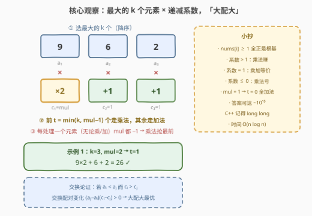
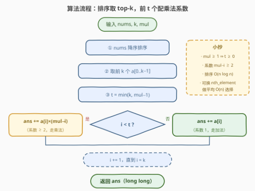

# K 个元素的最大总和

- **题目名称**：K 个元素的最大总和
- **链接**：[3974. K 个元素的最大总和](https://leetcode.cn/problems/maximum-total-sum-of-k-selected-elements/)
- **难度**：中等
- **标签**：贪心、数组、排序

## 1. 题目概述

给你一个整数数组 `nums`，以及两个整数 `k` 和 `mul`。

从 `nums` 中选出**恰好** $k$ 个元素，你可以按照**任意顺序**逐个处理这些元素。对于每个被选择的元素，都可以**独立地**选择以下两种操作之一：

- 将该元素的值**加**到总和中；或
- 将该元素乘以 `mul` 的**当前**值，并将结果**加**到总和中。

每处理一个被选择的元素后，**无论选择哪种操作**，`mul` 都会**减少 1**（`mul` 的当前值可能变为 0 或负数）。

返回一个整数，表示可能得到的**最大**总和。

**示例 1**：

```text
输入：nums = [6,1,2,9], k = 3, mul = 2
输出：26
解释：选 9、6、2。先处理 9：乘法，贡献 9×2 = 18（mul 变 1）；
     再处理 6：乘法，贡献 6×1 = 6（mul 变 0）；最后处理 2：加法，贡献 2。
     总和 = 18 + 6 + 2 = 26。
```

**示例 2**：

```text
输入：nums = [3,7,5,2], k = 2, mul = 4
输出：43
解释：选 7、5。先处理 7：乘法，贡献 7×4 = 28（mul 变 3）；
     再处理 5：乘法，贡献 5×3 = 15。总和 = 28 + 15 = 43。
```

**示例 3**：

```text
输入：nums = [4,4], k = 1, mul = 1
输出：4
解释：选 4，乘以 1（或直接加）都是 4。
```

**约束条件**：

- $1 \le \text{nums.length} \le 10^5$
- $1 \le \text{nums[i]} \le 10^5$
- $1 \le k \le \text{nums.length}$
- $1 \le \text{mul} \le 10^5$

> 💡 **审题关键**：① `mul` 是一只**只走不回的时钟**——每处理一个元素（无论乘还是加）都减 1，因此乘法系数取的是「处理时刻」的 `mul` 值；② **加法的贡献与处理时刻无关**（恒为元素本身），乘法的贡献取决于时刻；③ $\text{nums[i]} \ge 1$ **全正**是后续所有贪心论证的根基。

---

## 2. 解题思路

### 2.1 暴力思路：枚举选择、顺序与操作

一个方案由三部分构成：选哪 $k$ 个元素（$\binom{n}{k}$ 种）、处理顺序（$k!$ 种）、每个元素选乘法还是加法（$2^k$ 种）。三者乘起来是天文数字，$n \le 10^5$ 下完全不可行。必须想清楚**谁该被乘、按什么顺序乘、选哪些元素**这三个独立的问题。

### 2.2 核心观察：乘法前置 + top-k「大配大」



**观察一（乘法必须抢在最前面）**：`mul` 每处理一个元素就减 1，与该元素做的是乘法还是加法**无关**。加法贡献与时刻无关；而乘法系数只会越等越小。把任何一个加法元素排到乘法元素前面，只会白白消耗系数、让后面的乘法更亏。因此最优方案中，**所有乘法元素排在最前**，依次吃系数 $\text{mul}, \text{mul}-1, \text{mul}-2, \dots$，加法元素全部垫后（贡献恒为元素值）。

**观察二（乘法次数 $t = \min(k, \text{mul}-1)$）**：第 $i$ 个乘法的系数是 $\text{mul}-i+1$，拿它与加法系数 $1$ 比较（注意 $\text{nums[i]} \ge 1 > 0$）：

- 系数 $\ge 2$（$i \le \text{mul}-1$）：贡献 $\text{nums[i]} \cdot (\text{mul}-i+1) \ge 2\,\text{nums[i]} > \text{nums[i]}$，**严格赚**；
- 系数 $= 1$（$i = \text{mul}$）：与加法**等价**；
- 系数 $\le 0$（$i \ge \text{mul}+1$）：把正数乘成非正数，**严格亏**。

所以有效乘法次数为 $t = \min\bigl(k, \max(\text{mul}-1, 0)\bigr)$。当 $\text{mul} = 1$ 时 $t = 0$，全走加法（乘 $1$ 与加法等价，答案不受影响）。于是系数序列为：

$$c = \bigl[\underbrace{\text{mul},\ \text{mul}-1,\ \dots,\ \text{mul}-t+1}_{\ge 2},\ \underbrace{1,\ 1,\ \dots,\ 1}_{k-t}\bigr]$$

**全部系数 $\ge 1 > 0$**。

**观察三（选最大的 $k$ 个，大配大）**：系数全正带来两个直接推论——

- **选 top-k**：固定系数分配，把任何已选元素换成更大的未选元素，总和不减。故选 `nums` 中最大的 $k$ 个，记降序排列为 $a_1 \ge a_2 \ge \dots \ge a_k$；
- **大配大（重排不等式）**：固定元素集合，若 $a_i < a_j$ 而 $c_i > c_j$（小元素占了 大系数），交换两者的系数，变化量为

$$\bigl(a_j c_i + a_i c_j\bigr) - \bigl(a_i c_i + a_j c_j\bigr) = (a_j - a_i)(c_i - c_j) > 0,$$

即**最大的元素配最大的系数**最优。

三条观察合起来，答案一步到位：

$$\boxed{\ \text{答案} = \sum_{i=1}^{t} a_i \cdot (\text{mul}-i+1) \; + \sum_{i=t+1}^{k} a_i\,,\qquad t = \min\bigl(k, \max(\text{mul}-1, 0)\bigr)\ }$$

> 💡 **一句话总结**：`mul` 是只减不增的时钟 → 乘法前置抢系数；系数跌到 1 就与加法等价、跌破 1 就亏 → 只乘前 $\min(k, \text{mul}-1)$ 个；系数全正 → 选 top-k 且大元素配大系数。

### 2.3 算法流程图



| 步骤 | 操作 | 说明 |
|------|------|------|
| ① | `nums` 降序排序 | $O(n \log n)$，全程复杂度主导 |
| ② | 取前 $k$ 个 $a[0..k-1]$ | top-k 选取 |
| ③ | $t = \min(k, \text{mul}-1)$ | 有效乘法次数；$\text{mul} \ge 1$ 保证 $t \ge 0$ |
| ④ | $i < t$：`ans += a[i]×(mul−i)`；否则 `ans += a[i]` | 系数从 `mul` 递减、最小为 $2$；其余按原值累加 |
| ⑤ | 返回 `ans` | 全程 64 位整数 |

### 2.4 示例演算

| 示例 | top-k 降序 | mul | $t$ | 配对过程 | 答案 |
|------|-----------|-----|-----|----------|------|
| 1 `[6,1,2,9]`, $k=3$ | $9, 6, 2$ | 2 | $\min(3,1)=1$ | $9\times2 + 6 + 2$ | 26 |
| 2 `[3,7,5,2]`, $k=2$ | $7, 5$ | 4 | $\min(2,3)=2$ | $7\times4 + 5\times3$ | 43 |
| 3 `[4,4]`, $k=1$ | $4$ | 1 | $\min(1,0)=0$ | $4$（乘 1 等价加法） | 4 |

- 示例 1：$t=1$，只有 $9$ 有资格吃系数 $2$；此时 `mul` 已跌到 $1$，$6$ 乘 $1$ 与直接加等价，$2$ 同理——加法垫后不吃亏；
- 示例 2：$t=2$，两个乘法系数 $4, 3$ 都 $\ge 2$，大的 $7$ 配大的 $4$；
- 示例 3：$\text{mul}=1$，系数一无所有（乘 $1$ 与加法等价），退化为「top-k 求和」。

---

## 3. 参考代码

### C++

```cpp
class Solution {
  public:
    long long maxSum(vector<int>& nums, int k, int mul) {
        sort(nums.rbegin(), nums.rend());            // ① 降序排序
        long long t = min(k, mul - 1);               // ③ 有效乘法次数（mul ≥ 1 ⇒ t ≥ 0）
        long long ans = 0;
        for (int i = 0; i < k; ++i)                  // ②④ 前 k 个逐个配系数
            if (i < t) ans += 1LL * nums[i] * (mul - i);  // 系数 mul−i ≥ 2，走乘法
            else       ans += nums[i];                    // 系数 1，走加法
        return ans;                                  // ⑤
    }
};
```

> 💡 **写法要点**：
> - `t = min(k, mul - 1)`：约束保证 $\text{mul} \ge 1$，故 $t \ge 0$ 无需防御；$\text{mul} = 1$ 时 $t = 0$，循环里全走加法分支，自然退化；
> - $i < t$ 时系数 $\text{mul}-i \ge \text{mul}-t+1 \ge 2$ 恒正，不会把元素乘成非正数；
> - 溢出：乘法单项最高 $10^5 \times 10^5 = 10^{10}$，乘法部分总计约 $5\times10^{14}$ 量级，超 32 位——累加必须 `1LL *` 起手，返回类型已是 `long long`。

### Python

```python
class Solution:
    def maxSum(self, nums: List[int], k: int, mul: int) -> int:
        nums.sort(reverse=True)                  # ① 降序排序
        t = min(k, mul - 1)                      # ③ 有效乘法次数（mul ≥ 1 ⇒ t ≥ 0）
        ans = 0
        for i in range(k):                       # ②④ 前 k 个逐个配系数
            if i < t:
                ans += nums[i] * (mul - i)       # 系数 mul−i ≥ 2，走乘法
            else:
                ans += nums[i]                   # 系数 1，走加法
        return ans                               # ⑤
```

> 💡 **写法要点**：
> - Python 大整数无溢出之忧；若追求省内存可 `heapq.nlargest(k, nums)` 免全量排序（$O(n \log k)$）；
> - 也可写成一行推导：`sum(x * (mul - i) if i < t else x for i, x in enumerate(a))`，展开写更直观。

---

## 4. 复杂度分析

| 维度 | 复杂度 | 说明 |
|------|--------|------|
| 时间 | $O(n \log n)$ | 降序排序主导；取前 $k$ 个与累加共 $O(k) \le O(n)$ |
| 空间 | $O(\log n)$ | C++ 内省排序的栈空间（Python Timsort 为 $O(n)$）；未申请额外数组 |
| 答案规模 | $\le 5\times10^{14}$ 量级 | 乘法部分 $\le \max \times \sum_{j=2}^{\text{mul}} j \approx 10^5 \times 5\times10^9$，加法部分 $\le 10^{10}$；超 32 位，C++ 全程 `long long` |

---

## 5. 扩展：平均 $O(n)$ 选择与「负数元素」变体

**平均 $O(n)$ 做法**：我们只需要 top-k 而非全序。C++ 用 `nth_element` 平均 $O(n)$ 划出前 $k$ 大，再对这 $k$ 个排序 $O(k \log k)$，总计 $O(n + k\log k)$；也可用大小为 $k$ 的小顶堆一遍扫描，$O(n \log k)$。当 $k \ll n$ 时收益明显；$k = n$ 时退化为全量排序。

**负数元素变体**：若 $\text{nums[i]}$ 允许为负，观察二当场崩塌——系数 $\le 0$ 时「负 × 负 = 正」，**最负的元素配上负系数反而可能最优**；连"选 top-k"也失效（可能要专门选很小的负元素去吃负系数）。此时需要按系数符号分段讨论（正系数段配最大的若干元素、负系数段配最小的若干元素，再决定交界处怎么切），甚至 DP。本题 $\text{nums[i]} \ge 1$ 的全正约束，正是整套贪心的安全垫。

---

## 6. 面试要点

**Q1：为什么乘法元素必须放在最前面处理？**

> `mul` 是全局时钟：每处理一个元素（无论乘/加）都减 1。加法贡献与时刻无关，而乘法系数取的是处理时刻的 `mul` 值、只减不增。把任何加法元素排到乘法前面，只会白白消耗系数。所以最优方案中乘法全在前，依次吃 $\text{mul}, \text{mul}-1, \dots$，加法垫后。

**Q2：乘法次数为什么恰好是 $\min(k, \text{mul}-1)$？$\text{mul}=1$ 时怎么办？**

> 第 $i$ 次乘法系数为 $\text{mul}-i+1$。系数 $\ge 2$ 时对正元素严格赚；$=1$（$i=\text{mul}$）时与加法等价；$\le 0$（$i>\text{mul}$）时把正数乘成非正数、严格亏。故 $t=\min(k,\text{mul}-1)$。$\text{mul}=1 \Rightarrow t=0$，全加法；即便乘 $1$ 也答案不变。

**Q3：为什么选最大的 $k$ 个，且大元素配大系数？**

> 系数序列全 $\ge 1 > 0$。固定系数分配，小元素换大元素任何位置不亏 → 选 top-k；固定集合，若 $a_i<a_j$ 而 $c_i>c_j$，交换系数的变化量 $(a_j-a_i)(c_i-c_j)>0$ → 大配大。这就是重排不等式的交换论证。

**Q4：溢出怎么估算？**

> 乘法单项 $\le \max(\text{nums})\cdot\text{mul} = 10^5\times10^5 = 10^{10}$；乘法部分 $\le 10^5 \times \sum_{j=2}^{10^5} j \approx 5\times10^{14}$，加法部分 $\le 10^{10}$，总远小于 $2^{63}-1 \approx 9.2\times10^{18}$。C++ 累加写 `1LL * nums[i] * (mul - i)` 防止中间 `int` 溢出。

**Q5：能否比 $O(n\log n)$ 更快？**

> 只需 top-k：`nth_element`（快选）平均 $O(n)$ 划出前 $k$ 大、再 $O(k\log k)$ 局部排序；或大小为 $k$ 的小顶堆 $O(n\log k)$。注意 $k$ 可达 $n$，最坏仍是 $O(n\log n)$ 量级。

---

## 7. 同类练习题

- [561. 数组拆分](https://leetcode.cn/problems/array-partition/)：排序后两两配对取最小——重排不等式的入门原型
- [870. 优势洗牌](https://leetcode.cn/problems/advantage-shuffle/)：田忌赛马式「错位配对」，与本题「同序配对」互为镜像，体会配对方向何时同向、何时反向
- [1005. K 次取反后最大化的数组和](https://leetcode.cn/problems/maximize-sum-of-array-after-k-negations/)：排序贪心分配有限次操作配额，「每次操作用到刀刃上」同本题乘法配额
- [2542. 最大子序列得分](https://leetcode.cn/problems/maximum-subsequence-score/)：选 $k$ 个元素最大化聚合值——top-k 选取的另一变体
- [2144. 打折购买糖果的最小开销](https://leetcode.cn/problems/minimum-cost-of-buying-candies-with-discount/)：排序后「买贵的送便宜的」，同样是排序定序、再分配收益的贪心
