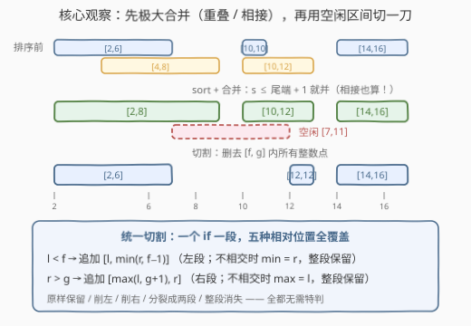
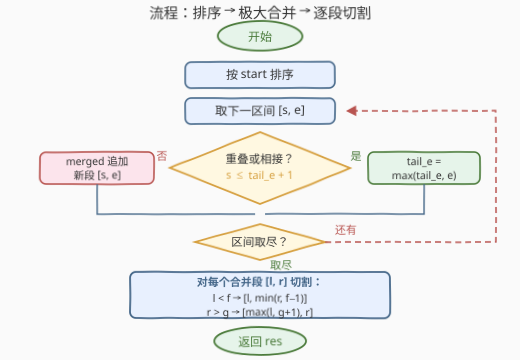

# 筛选忙碌区间

- **题目名称**：筛选忙碌区间
- **链接**：[3975. 筛选忙碌区间](https://leetcode.cn/problems/filter-occupied-intervals/)
- **难度**：中等
- **标签**：数组、排序

## 1. 题目概述

给你一个二维整数数组 `occupiedIntervals`，其中 `occupiedIntervals[i] = [start_i, end_i]` 表示你处于**忙碌**状态的一个时间区间（**闭区间**，包含两端点）。这些区间可能**重叠**。

另给你两个整数 `freeStart` 和 `freeEnd`，定义一个你**空闲**的闭区间。

你的任务是：

1. 先将所有**重叠或相接**的忙碌区间**合并**（相接：第二个区间恰好从第一个区间结束后的下一个位置开始，如 `[1,1]` 和 `[2,2]` 相接，合并为 `[1,2]`）；
2. 再从合并后的忙碌区间中**移除**空闲区间内的**所有**整数点。

返回按**升序**排列的剩余忙碌区间，要求互不重叠且**数量尽可能最少**；若没有剩余忙碌点，返回空列表。

**示例 1**：

```text
输入：occupiedIntervals = [[2,6],[4,8],[10,10],[10,12],[14,16]], freeStart = 7, freeEnd = 11
输出：[[2,6],[12,12],[14,16]]
解释：合并后为 [2,8]、[10,12]、[14,16]；排除 [7,11] 后得到 [2,6]、[12,12]、[14,16]。
```

**示例 2**：

```text
输入：occupiedIntervals = [[1,5],[2,3]], freeStart = 3, freeEnd = 8
输出：[[1,2]]
解释：合并后为 [1,5]；排除 [3,8] 后得到 [1,2]。
```

**约束条件**：

- $1 \le \text{occupiedIntervals.length} \le 5 \times 10^4$
- $1 \le \text{start}_i \le \text{end}_i \le 10^9$
- $1 \le \text{freeStart} \le \text{freeEnd} \le 10^9$

> 💡 **审题关键**：① 区间是**整数闭区间**，"相接"（首尾差 1）也要合并——这比常规合并区间的条件多一个 $+1$；② 必须先合并、后移除，顺序不能反；③ 返回区间要**数量最少**，这暗示剩余部分应恰好是剩余点集的**极大连续段**；④ 值域高达 $10^9$，不能开桶逐点标记，必须基于**比较**处理区间整体。

---

## 2. 解题思路

### 2.1 暴力思路

最直观的想法有两条，都不行：

- **逐点标记**：用布尔数组标记每个忙碌整数点再删点、分段——值域 $10^9$，空间直接爆炸；
- **反复合并**：不排序，反复两两扫描找可合并（重叠或相接）的区间对，直到一轮下来无变化。每轮 $O(n)$，最坏要 $O(n)$ 轮，总计 $O(n^2) \approx 2.5 \times 10^9$（$n = 5 \times 10^4$），超时。

病根在于区间**顺序乱**：一个新区间可能与任意已有区间重叠。一旦**按 start 排序**，新区间的 start 只会越来越大，它**只可能与"最后一段"重叠或相接**——合并就从"反复全局找"退化成"只和尾段比一次"，线性完成。

### 2.2 核心观察：极大合并 + 一刀切割



整个问题拆成两个互相独立的经典子问题：

**第一阶段：极大合并**。排序后线性扫描，维护结果数组 `merged` 的尾段 $[\,l,\ \text{tail\_e}\,]$，对每个新区间 $[s, e]$：

$$s \le \text{tail\_e} + 1 \implies \text{并入尾段，且 } \text{tail\_e} \leftarrow \max(\text{tail\_e},\ e)$$

> 💡 **为什么是 `+1`（相接也算）？** 题目要求返回区间**数量最少**：`[1,1]` 与 `[2,2]` 表示的点集和 `[1,2]` 完全相同，但少了一段。漏掉 `+1` 就会输出两个本可拼接的区间，违反最少性。另外 `max` 不可省——后段可能被尾段完全**包含**（如 `[1,5]` 后跟 `[2,3]`），直接覆盖会把尾端改小。

**第二阶段：一刀切割**。对每个合并段 $[l, r]$ 独立移除空闲区间 $[f, g]$（$f = \text{freeStart}$，$g = \text{freeEnd}$）。段与空闲区间只有五种相对位置——整段在左、削去右端、被完全吞没、从中分裂、整段在右——看似要分类讨论，实则**两条 if 全覆盖**：

- $l < f$：追加左段 $[\,l,\ \min(r,\ f-1)\,]$（不相交时 $\min(r, f-1) = r$，自动退化为整段保留）；
- $r > g$：追加右段 $[\,\max(l,\ g+1),\ r\,]$（不相交时 $\max(l, g+1) = l$，同样自动退化）。

完全吞没时两个条件同时为假，段自然消失。本质就是集合差 $[l, r] \setminus [f, g] = [l, \min(r, f-1)] \cup [\max(l, g+1), r]$，空段自动丢弃。

**切割后不需要再合并一轮**。设合并后的相邻极大段 $A = [l_1, r_1]$、$B = [l_2, r_2]$，极大性保证 $l_2 \ge r_1 + 2$（否则早并成一段了）。切割只**删点不加点**：$A$ 的剩余部分 $\subseteq [l_1, r_1]$，$B$ 的剩余部分 $\subseteq [l_2, r_2]$，两者的间隔只增不减，仍然互不相接。因此输出天然满足"互不重叠且数量最少"——它恰好是剩余点集的所有极大连续段。

### 2.3 算法流程图



| 步骤 | 操作 | 说明 |
|------|------|------|
| ① | 按 start 排序 | $O(n \log n)$，消除顺序不确定性 |
| ② | 线性扫描合并 | 新区间只与尾段比较：$s \le \text{tail\_e} + 1$ 则并，否则开新段 |
| ③ | 逐段切割 | 两条 if 产出左、右子段，空段自动跳过 |
| ④ | 返回 `res` | `merged` 有序且每段最多产出"左段在前、右段在后"，结果天然升序 |

### 2.4 示例演算

**示例 1**：`occupiedIntervals = [[2,6],[4,8],[10,10],[10,12],[14,16]]`，$[f, g] = [7, 11]$。

排序后顺序不变，合并过程：

| 当前区间 | 判断 | 动作 | merged |
|---|---|---|---|
| $[2,6]$ | — | 开新段 | `[[2,6]]` |
| $[4,8]$ | $4 \le 6+1$ ✓ | 并入，尾端 $\max(6,8)=8$ | `[[2,8]]` |
| $[10,10]$ | $10 \le 8+1=9$？✗（中间隔着空闲点 9） | 开新段 | `[[2,8],[10,10]]` |
| $[10,12]$ | $10 \le 10+1$ ✓ | 并入 | `[[2,8],[10,12]]` |
| $[14,16]$ | $14 \le 12+1=13$？✗ | 开新段 | `[[2,8],[10,12],[14,16]]` |

切割过程（$f = 7$，$g = 11$）：

| 合并段 | $l < f$（左段） | $r > g$（右段） | 输出 |
|---|---|---|---|
| $[2,8]$ | $2<7$ ✓ → $[2, \min(8,6)] = [2,6]$ | $8>11$ ✗ | `[2,6]` |
| $[10,12]$ | $10<7$ ✗ | $12>11$ ✓ → $[\max(10,12), 12] = [12,12]$ | `[12,12]` |
| $[14,16]$ | $14<7$ ✗ | $16>11$ ✓ → $[\max(14,12), 16] = [14,16]$ | `[14,16]` |

最终 `[[2,6],[12,12],[14,16]]` ✓。

**示例 2**：`[[1,5],[2,3]]`，$[f,g] = [3,8]$。合并时 $[2,3]$ 整段被 $[1,5]$ 包含，尾端取 $\max$ 保持 5，得 `[[1,5]]`；切割：$1<3$ ✓ → $[1, \min(5,2)] = [1,2]$，$5>8$ ✗，输出 `[[1,2]]` ✓。

---

## 3. 参考代码

### C++

```cpp
class Solution {
  public:
    vector<vector<int>> filterOccupiedIntervals(vector<vector<int>>& occupiedIntervals,
                                                int freeStart, int freeEnd) {
        sort(occupiedIntervals.begin(), occupiedIntervals.end());

        // 阶段一：极大合并（重叠或相接：s <= tail_e + 1）
        vector<vector<int>> merged;
        for (auto& in : occupiedIntervals) {
            if (!merged.empty() && in[0] <= merged.back()[1] + 1) {
                merged.back()[1] = max(merged.back()[1], in[1]);
            } else {
                merged.push_back(in);
            }
        }

        // 阶段二：用空闲区间 [freeStart, freeEnd] 切割每个合并段
        vector<vector<int>> res;
        for (auto& in : merged) {
            int l = in[0], r = in[1];
            if (l < freeStart) res.push_back({l, min(r, freeStart - 1)});
            if (r > freeEnd)   res.push_back({max(l, freeEnd + 1), r});
        }
        return res;
    }
};
```

> 💡 **写法要点**：
> - 合并时右端必须 `max`，防止后段被尾段包含时把尾端改小；
> - $\text{end} \le 10^9 < 2^{31} - 1$，`+1` 不会溢出 `int`；
> - `sort` 对 `vector<vector<int>>` 默认按字典序，即先比 start 再比 end，正合需要。

### Python

```python
class Solution:
    def filterOccupiedIntervals(self, occupiedIntervals: List[List[int]],
                                freeStart: int, freeEnd: int) -> List[List[int]]:
        occupiedIntervals.sort()

        merged = []
        for s, e in occupiedIntervals:
            if merged and s <= merged[-1][1] + 1:
                merged[-1][1] = max(merged[-1][1], e)
            else:
                merged.append([s, e])

        res = []
        for l, r in merged:
            if l < freeStart:
                res.append([l, min(r, freeStart - 1)])
            if r > freeEnd:
                res.append([max(l, freeEnd + 1), r])
        return res
```

> 💡 `sort()` 按 $[s, e]$ 字典序排序，与 C++ 行为一致；两阶段合起来不到 20 行，无任何特判分支。

---

## 4. 复杂度分析

| 维度 | 复杂度 | 说明 |
|------|--------|------|
| 时间 | $O(n \log n)$ | 排序主导；合并与切割均为单次线性扫描，$n \le 5\times10^4$ 轻松通过 |
| 空间 | $O(n)$ | `merged` 与结果数组；排序本身原地（快排栈 $O(\log n)$） |
| 数据规模 | $n \le 5\times10^4$，值域 $\le 10^9$ | 值域大排除计数法；$n$ 小保证 $O(n^2)$ 只差一个数量级，仍不可取 |

---

## 5. 扩展：空闲区间有多个怎么办

若把单个 `freeStart/freeEnd` 换成一组**空闲区间列表** `freeIntervals`（同样闭区间、可能重叠），框架完全不变，只需再加一层"归并"：

1. 对空闲区间做**同样的极大合并**（重叠或相接都并），得到有序、互不相接的段列表 $F$；
2. 双指针同时扫忙碌段 $[l, r]$ 与空闲段：从第一个可能与 $[l, r]$ 相交的空闲段开始，**连续地**用两条 if 的技巧从 $[l, r]$ 上削掉每一段，每削一次右端左移；
3. 空闲段指针只前进不回退（两组段都有序），总复杂度 $O(n \log n + m \log m)$。

这与 [986. 区间列表的交集](https://leetcode.cn/problems/interval-list-intersections/) 的双指针同构——**两组有序区间之间的任何布尔运算（交、差）都能用这套"双指针 + 只前进"框架线性完成**。

---

## 6. 面试要点

**Q1：合并条件为什么是 $s \le \text{tail\_e} + 1$，比常规合并区间多一个 $+1$？**

> 因为区间是整数闭区间且题目要求输出区间**数量最少**：`[1,1]` 与 `[2,2]` 覆盖的点集和 `[1,2]` 完全相同，但后者只有一段。常规 56 题只要求合并不要求最少段数，重叠（$s \le \text{tail\_e}$）就够了；本题"相接也合并"是被"数量最少"逼出来的。漏写 `+1` 在空闲区间不相关时（如忙碌 `[1,1],[2,2]`、空闲 `[5,6]`）会输出两段而非 `[1,2]`，答案即错。

**Q2：切割之后为什么不用再合并一轮？会不会出现两段切割后变得相接？**

> 不会。极大合并后的相邻段满足 $l_2 \ge r_1 + 2$（相隔至少一个非忙碌点）。切割只删空闲点、不新增点，$A$ 的剩余部分仍落在 $[l_1, r_1]$ 内、$B$ 的剩余部分仍落在 $[l_2, r_2]$ 内，间距只增不减。极端情况：$A$ 只剩左段结尾 $f-1$，$B$ 只剩右段开头 $g+1$，两者仍隔 $g - f + 2 \ge 3$ 个位置。

**Q3：统一切割写法为什么能覆盖"保留/削边/分裂/消失"所有情况？**

> 它就是集合差的直接翻译：$[l,r] \setminus [f,g] = [l, \min(r, f-1)] \cup [\max(l, g+1), r]$。左段公式在"整段在空闲左侧"时 $\min(r, f-1) = r$ 自动退化为整段保留，右段公式在"整段在右侧"时同理；被完全吞没时 $l \ge f$ 且 $r \le g$ 两个条件同时为假，段消失。`min/max` 吸收了所有分支，无需 if-else 树。

**Q4：实现上有哪些易错点？**

> ① 合并右端要取 $\max$（后段可能被尾段完全包含，如 `[1,5]` 后跟 `[2,3]`）；② 切割边界是 $f-1$ 和 $g+1$（闭区间删点），写成 $f$、$g$ 会把边界点多留一天；③ 结果天然升序——`merged` 有序，且每段先产左段后产右段，无需最后再排序；④ C++ 中 $\text{end} + 1 \le 10^9 + 1 < \text{INT\_MAX}$，不溢出，但如果约束改成 $10^{18}$ 就得换 `long long`。

**Q5：本题和 56/57/1272 的关系？**

> 本题 = [56. 合并区间](https://leetcode.cn/problems/merge-intervals/)（外加相接合并的 $+1$ 条件）拼接 [1272. 删除区间](https://leetcode.cn/problems/remove-interval/)（单区间减法）。区间题的通用套路在这三题里一脉相承：**排序消除顺序不确定性 → 线性扫描 → 只与"最后一段"比较**。57 的"插入一个新区间"可以看成"先合并再切割"的退化特例。

---

## 7. 同类练习题

- [56. 合并区间](https://leetcode.cn/problems/merge-intervals/)：本题第一阶段（极大合并）的裸版本，对照体会"相接也合并"的 $+1$ 条件差别
- [1272. 删除区间](https://leetcode.cn/problems/remove-interval/)：本题第二阶段（区间减法）的裸版本，同样可用 min/max 统一写法消灭分支
- [57. 插入区间](https://leetcode.cn/problems/insert-interval/)：一个新区间插入有序区间表后的合并，"排序 + 只看尾段"思路同源
- [986. 区间列表的交集](https://leetcode.cn/problems/interval-list-intersections/)：双指针求两组有序区间的交，是"区间减法"的对偶操作，扩展到多空闲区间时正好复用
- [435. 无重叠区间](https://leetcode.cn/problems/non-overlapping-intervals/)：另一道按 start 排序后线性扫描的区间经典题，体会排序带来的"只与上一段比较"的简化
