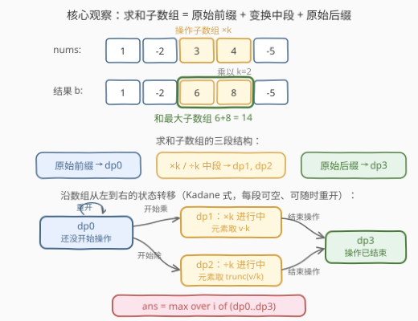
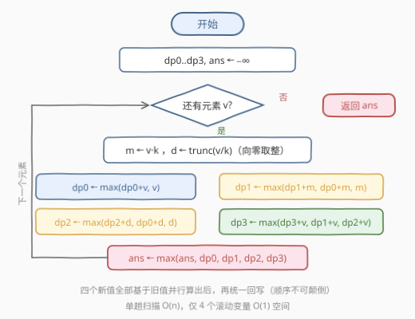

# LeetCode 乘以系数后最大子数组和 题解

## 1. 题目概述

- **标题 / 题号**：乘以系数后最大子数组和（#3976，medium）
- **链接**：https://leetcode.cn/problems/maximum-subarray-sum-after-multiplier/
- **难度**：中等
- **标签**：数组、动态规划、Kadane

**题意**：给你一个整数数组 `nums` 和一个正整数 `k`。

你**必须**选择 `nums` 的一个子数组，并执行以下操作**之一**：

- 将所选子数组中的每个数字**乘以** $k$；
- 将所选子数组中的每个数字**除以** $k$。除法向零取整：**正数向下取整，负数向上取整**。

返回结果数组中**非空子数组**的最大可能和。

注意：**用于执行操作的子数组与用于求和的子数组可以不同**。

**示例 1**：

```text
输入：nums = [1,-2,3,4,-5], k = 2
输出：14
解释：将子数组 [3, 4] 中的每个数字乘以 2，结果为 [1, -2, 6, 8, -5]。
      和最大的子数组是 [6, 8]，输出 6 + 8 = 14。
```

**示例 2**：

```text
输入：nums = [-5,-4,-3], k = 2
输出：-1
解释：将子数组 [-3] 中的每个数字除以 2（-3÷2 = -1.5，向上取整为 -1），
      结果为 [-5, -4, -1]，和最大的子数组是 [-1]，输出 -1。
```

**约束**：

- $1 \le \text{nums.length} \le 10^5$
- $-10^5 \le \text{nums[i]} \le 10^5$
- $1 \le k \le 10^5$

> 💡 **审题关键**：① 操作**必须执行恰好一次**（选一段子数组，乘或除二选一）；② 操作段与求和段**可以不同**，甚至可以完全不相交；③ 除法**向零取整**（不是 Python 的向下取整！）；④ $|\text{nums[i]} \cdot k|$ 可达 $10^{10}$，C++ 必须用 64 位整数。

## 2. 解题思路

### 2.1 暴力思路：枚举操作区间 + Kadane

一个方案由三部分构成：操作子数组 $[l, r]$（$O(n^2)$ 种）、操作类型（乘 / 除，2 种）、以及在新数组上求最大子数组和（Kadane，$O(n)$）。总计 $O(n^3)$，$n = 10^5$ 下完全不可行。

瓶颈在于**操作区间的两个端点**与**求和区间的两个端点**被当成四个独立自由度。事实上，沿数组从左到右扫描时，一个求和子数组相对操作区间的位置关系只有寥寥几种——这正是 Kadane「以 $i$ 结尾」思想可以吸收的信息。

### 2.2 核心观察：三段结构 + 4 状态 Kadane



**观察一（求和子数组的三段结构）**：设操作区间为 $[l, r]$，求和区间为 $[L, R]$。两者要么**不相交**——此时求和区间内的元素全是原始值，其和就是原始数组的一个子数组和；要么**相交**——此时求和子数组必然呈现如下形态：

$$\underbrace{\text{原始前缀}}_{[L,\ \max(l,L)-1]} \;+\; \underbrace{\text{变换中段}}_{[\max(l,L),\ \min(r,R)]} \;+\; \underbrace{\text{原始后缀}}_{[\min(r,R)+1,\ R]}$$

三段中前后缀可为空，中段非空（相交时至少一个元素被变换）。求和子数组也可以完全落在操作区间内（前后缀皆空），或从操作区间中间开始 / 在操作区间中间结束（某一段为空）——都被这个结构覆盖。

**观察二（把「操作进度」编码进 Kadane 状态）**：Kadane 的本质是 $\text{dp}[i] = \max(\text{dp}[i-1] + a_i,\ a_i)$——「以 $i$ 结尾的最优」由「以 $i-1$ 结尾的最优」延伸或重开得到。现在每个元素有两种可能的取值（原始 $v$ 或变换值），我们额外记录**当前求和子数组走到了三段结构的哪一段**，定义四个状态：

| 状态 | 含义 | 当前元素取值 |
|------|------|------------|
| $\text{dp}_0$ | 还没进入操作区间 | $v$ |
| $\text{dp}_1$ | 正处于**乘法**区间内 | $v \cdot k$ |
| $\text{dp}_2$ | 正处于**除法**区间内 | $\operatorname{trunc}(v/k)$ |
| $\text{dp}_3$ | 操作区间已经结束 | $v$ |

其中 $\operatorname{trunc}(v/k)$ 表示**向零取整**：正数向下取整、负数向上取整（$-3 \div 2 = -1.5 \to -1$）。转移方程（全部用**旧值**算**新值**）：

$$
\begin{aligned}
\text{dp}_0' &= \max(\text{dp}_0 + v,\;\; v)\\[2pt]
\text{dp}_1' &= \max(\text{dp}_1 + kv,\;\; \text{dp}_0 + kv,\;\; kv)\\[2pt]
\text{dp}_2' &= \max(\text{dp}_2 + d,\;\; \text{dp}_0 + d,\;\; d)\qquad d = \operatorname{trunc}(v/k)\\[2pt]
\text{dp}_3' &= \max(\text{dp}_3 + v,\;\; \text{dp}_1 + v,\;\; \text{dp}_2 + v)
\end{aligned}
$$

- $\text{dp}_1'$：要么延续乘法段（$\text{dp}_1 + kv$），要么**现在才开始乘**——从原始前缀延伸过来（$\text{dp}_0 + kv$）或直接重开（$kv$）；
- $\text{dp}_2'$ 同理，只是换成除法；
- $\text{dp}_3'$：要么延续「操作已结束」的后缀，要么**操作区间恰好在上一格结束**（从 $\text{dp}_1$ 或 $\text{dp}_2$ 切换回原始值）。注意 $\text{dp}_3$ **不能凭空重开**——它要求操作区间在求和子数组内部，单元素子数组不满足；「操作在别处」的情形由 $\text{dp}_0$ 代表。

**观察三（强制操作不会带来「不可达」的答案）**：操作必须执行，那 $\text{dp}_0$（全程不操作）参与取 max 是否合法？合法——若最优原始子数组是**真**子数组，可在其外部任选一个下标单点操作，求和区间不受影响；若它恰好占满整个数组，则：存在非负元素时任取一个乘 $k$（$kx \ge x$），否则任取一个负元素除以 $k$（向零取整后 $\ge$ 原值），数组总和均不减。因此「不操作」的 Kadane 值总能被某个合法方案达到或超越，$\text{dp}_0$ 可放心参与取 max。

**答案**：$\ \max\limits_{i}\ \max(\text{dp}_0, \text{dp}_1, \text{dp}_2, \text{dp}_3)$——任意状态、任意位置结尾都可以作为求和子数组的右端点。

> 💡 **一句话总结**：相交时求和子数组必为「原始前缀 + 变换中段 + 原始后缀」三段式；把这个进度编码成 4 个 Kadane 状态，单趟扫描即得答案，不相交与强制操作的边界情形均可安全并入 $\text{dp}_0$。

### 2.3 算法流程图



| 步骤 | 操作 | 说明 |
|------|------|------|
| ① | 初始化 $\text{dp}_0 \dots \text{dp}_3, \text{ans} \leftarrow -\infty$ | 用 `LLONG_MIN/4` 而非 `LLONG_MIN`，防止 $-\infty + v$ 溢出 |
| ② | 读入 $v$，计算 $m = v \cdot k$ 与 $d = \operatorname{trunc}(v/k)$ | 乘法值可达 $10^{10}$，必须 64 位 |
| ③ | 四个新值**全部用旧值**并行算出，再统一回写 | 顺序颠倒会让 $\text{dp}_3$ 误吃本格才开始的 $\text{dp}_1$ |
| ④ | $\text{ans} \leftarrow \max(\text{ans},\ \text{dp}_0 \dots \text{dp}_3)$ | 任意状态、任意位置结尾均可停 |
| ⑤ | 扫描结束返回 `ans` | 全程无数组，仅 5 个滚动变量 |

### 2.4 示例演算

以示例 1 `nums = [1,-2,3,4,-5], k = 2` 走一遍 DP（$-\infty$ 记为 $-\infty$）：

| $i$ | $v$ | $m = v{\cdot}k$ | $d = \operatorname{trunc}(v/k)$ | $\text{dp}_0$ | $\text{dp}_1$ | $\text{dp}_2$ | $\text{dp}_3$ | $\text{ans}$ |
|-----|-----|--------|--------|------|------|------|------|------|
| 0 | 1 | 2 | 0 | 1 | 2 | 0 | $-\infty$ | 2 |
| 1 | −2 | −4 | −1 | −1 | −2 | 0 | 0 | 2 |
| 2 | 3 | 6 | 1 | 3 | 6 | 1 | 3 | 6 |
| 3 | 4 | 8 | 2 | 7 | **14** | 3 | 10 | **14** |
| 4 | −5 | −10 | −2 | 2 | 4 | 5 | 9 | **14** |

- $i=3$ 处 $\text{dp}_1 = \max(6+8,\ 3+8,\ 8) = 14$：最优取的是「延续」分支——子数组 $[6, 8]$（原 $[3,4]$ 整段乘 $2$），和为 $14$，正是答案；
- $i=1$ 处 $\text{dp}_3 = \max(-\infty,\ 2-2,\ 0-2) = 0$：$[1_{\text{原}}, -1_{\text{除}}]$，操作区间恰好在上一格结束；
- $i=4$ 处 $\text{dp}_3 = \max(10-5,\ 14-5,\ 3-5) = 9$：$[6, 8, -5]$，体现了「乘法段结束、原始后缀接上」。

示例 2 `nums = [-5,-4,-3], k = 2`：全程最优出现在 $i=2$ 的 $\text{dp}_2 = \max(-2-1,\ -4-1,\ \mathbf{-1}) = -1$——单元素子数组 $[-3 \div 2] = [-1]$，与官方解释一致。

## 3. 参考代码

### C++

```cpp
class Solution {
  public:
    long long maxSubarraySum(vector<int>& nums, int k) {
        const long long NEG = LLONG_MIN / 4;                    // ① 防 -∞ + v 溢出
        long long dp0 = NEG, dp1 = NEG, dp2 = NEG, dp3 = NEG;
        long long ans = NEG;
        for (int v : nums) {
            long long m = 1LL * v * k;                          // ② 乘法值，|m| ≤ 1e10
            long long d = v >= 0 ? v / k : -((-v) / k);         // ③ C++ 的 / 天然向零取整
            long long ndp0 = max(dp0 + v, (long long)v);        // 原始段：延伸或重开
            long long ndp1 = max({dp1 + m, dp0 + m, m});        // ×k 段：延续 / 从 dp0 进入 / 重开
            long long ndp2 = max({dp2 + d, dp0 + d, d});        // ÷k 段：延续 / 从 dp0 进入 / 重开
            long long ndp3 = max({dp3 + v, dp1 + v, dp2 + v});  // 后缀：延续 / 操作刚结束
            dp0 = ndp0; dp1 = ndp1; dp2 = ndp2; dp3 = ndp3;     // ④ 全用旧值算完再回写
            ans = max({ans, dp0, dp1, dp2, dp3});               // ⑤ 任意状态结尾都可停
        }
        return ans;
    }
};
```

> 💡 **写法要点**：
> - C++ 整数除法 `/` **本身就是向零取整**（C++11 起），`d` 直接写 `v / k` 亦可，展开写 `v >= 0 ? v / k : -((-v) / k)` 是为了和题意「正 floor、负 ceil」逐字对应、方便移植到其他语言；
> - `1LL * v * k` 起手防 32 位中间溢出；$-\infty$ 取 `LLONG_MIN / 4`，保证加上 $|v| \le 10^5$ 后仍在 `long long` 范围内；
> - 四个 `ndp*` 必须先算完再回写：`ndp3` 只能引用**上一格**的 `dp1/dp2`，若就地更新会误把「本格才开始乘」的段当作「已结束」。

### Python

```python
class Solution:
    def maxSubarraySum(self, nums: List[int], k: int) -> int:
        NEG = float('-inf')
        dp0 = dp1 = dp2 = dp3 = NEG
        ans = NEG
        for v in nums:
            m = v * k
            d = v // k if v >= 0 else -((-v) // k)   # 向零取整：Python 的 // 是向下取整，负数要修正
            ndp0 = max(dp0 + v, v)
            ndp1 = max(dp1 + m, dp0 + m, m)
            ndp2 = max(dp2 + d, dp0 + d, d)
            ndp3 = max(dp3 + v, dp1 + v, dp2 + v)
            dp0, dp1, dp2, dp3 = ndp0, ndp1, ndp2, ndp3
            ans = max(ans, dp0, dp1, dp2, dp3)
        return ans
```

> 💡 **写法要点**：
> - **取整陷阱**：Python 的 `//` 是向下取整（floor），`-3 // 2 == -2`，而题目要求向零取整（$-1$）。必须写成 `v // k if v >= 0 else -((-v) // k)`，或用 `int(v / k)`（本题值域下浮点安全，但整数写法更稳）；
> - Python 元组解包一行完成「先算后写」，天然规避回写顺序问题；
> - 大整数无溢出之忧，`float('-inf')` 参与加法与 `max` 均安全。

## 4. 复杂度分析

| 维度 | 复杂度 | 说明 |
|------|--------|------|
| 时间 | $O(n)$ | 单趟扫描，每个元素常数次比较与算术运算 |
| 空间 | $O(1)$ | 仅 5 个滚动变量（$\text{dp}_0 \dots \text{dp}_3$ 与 `ans`） |
| 值域 | 单值 $\le 10^{10}$，答案 $\le 10^{15}$ | $\|\text{nums[i]}{\cdot}k\| \le 10^5 \times 10^5$，总和 $\le n \cdot 10^{10} = 10^{15} < 2^{63}-1 \approx 9.2 \times 10^{18}$；超 32 位，C++ 全程 `long long` |

## 5. 扩展：同一套「带操作的 Kadane 状态扩展」

把「区间操作」的进度编码进 Kadane 状态，是一整类题目的通用解法，状态数取决于操作的阶段结构：

- **[1746. 经过一次操作后的最大子数组和](https://leetcode.cn/problems/maximum-subarray-sum-after-one-operation/)**：操作变成「选一个元素平方」，只有单点、无区间端点，两状态（未平方 / 已平方）即可；
- **[1186. 删除一次得到子数组最大和](https://leetcode.cn/problems/maximum-subarray-sum-with-one-deletion/)**：操作变成「至多删一个元素」，同样是 dp0（未删）/ dp1（已删）两状态，结构几乎同款；
- **[1191. K 次拼接后子数组和的最大和](https://leetcode.cn/problems/k-concatenation-maximum-sum/)**：数组首尾相接后跑 Kadane，考的是「取模拼接几段」的分析而非状态扩展。

反之，若操作可执行**多次**（如乘任意多次），状态就要带上「已用次数」，退化为 $\text{dp}[i][j]$ 的二维形式（$j$ 为已用操作数）——本题恰好一次，才保得住 $O(1)$ 空间。

## 6. 面试要点

**Q1：为什么求和子数组一定能写成「原始前缀 + 变换中段 + 原始后缀」？**

> 操作区间 $[l,r]$ 与求和区间 $[L,R]$ 相交时，重叠部分 $[\max(l,L), \min(r,R)]$ 内的元素被变换、其余保持原值，按位置切出来恰好就是三段。求和子数组落在操作区间内、从中间开始或在中间结束，都只是某段为空的特例。不相交时全部为原始值，即状态 $\text{dp}_0$。

**Q2：四个状态的转移里，哪些「重开」是合法的、哪些不合法？为什么？**

> $\text{dp}_0$ 可重开（普通 Kadane）；$\text{dp}_1 / \text{dp}_2$ 可重开（求和子数组恰好从操作区间第一个元素开始，前后缀为空）；$\text{dp}_3$ **不能**重开——它要求操作区间完整落在求和子数组内部，单元素 $[v]$ 无法满足。若单元素子数组想「操作在别处」，那是 $\text{dp}_0$ 的职责（观察三保证其安全性）。

**Q3：操作是强制的，「不操作」的 dp0 为什么还能参与取 max？**

> 若最优原始子数组是真子数组，在它外部单点操作即可，其和不变；若它占满全数组，存在非负元素就乘一个（$kx \ge x$）、否则取负元素除以 $k$（向零取整后 $\ge$ 原值），数组总和不减、最大子数组和只会更大。因此 dp0 的值总能被合法方案达到或超越，不会高估答案。

**Q4：向零取整在各语言里怎么写才不出错？**

> C++/Java 的整数除法天然向零取整，直接 `v / k`；Python 的 `//` 是向下取整，`-3 // 2 == -2`（错），必须 `v // k if v >= 0 else -((-v) // k)`。这是本题最典型的实现坑，示例 2 的 $-3 \div 2 = -1$（而非 $-2$）专门考察这一点。

**Q5：溢出边界在哪里？**

> 单个乘法元素 $|v \cdot k| \le 10^5 \times 10^5 = 10^{10}$，超 32 位（$\approx 2.1 \times 10^9$）；答案上界约 $n \cdot 10^{10} = 10^{15}$，`long long` 安全。另一个隐蔽坑：`LLONG_MIN` 直接加 `v` 会溢出（UB），负无穷应初始化为 `LLONG_MIN / 4`。

## 同类练习题

| # | 题目 | 与本题的关联 |
|---|------|-------------|
| 53 | [最大子数组和](https://leetcode.cn/problems/maximum-subarray/) | Kadane 原型，本题去掉全部状态机后的零状态版本 |
| 152 | [乘积最大子数组](https://leetcode.cn/problems/maximum-product-subarray/) | 状态扩展的另一方向——维护最大/最小两个并列状态应对负数翻转 |
| 1186 | [删除一次得到子数组最大和](https://leetcode.cn/problems/maximum-subarray-sum-with-one-deletion/) | 「至多删一个」的两状态 Kadane，与本题「恰好一次区间操作」结构同源 |
| 1746 | [经过一次操作后的最大子数组和](https://leetcode.cn/problems/maximum-subarray-sum-after-one-operation/) | 单点平方替代区间乘除，状态更少，适合作为本题的热身 |
| 1191 | [K 次拼接后子数组和的最大和](https://leetcode.cn/problems/k-concatenation-maximum-sum/) | 拼接结构下的 Kadane，练习「数组变形后再求最大子数组」的分析框架 |
