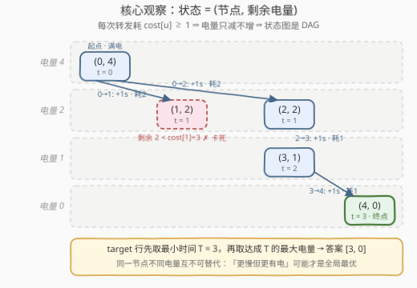
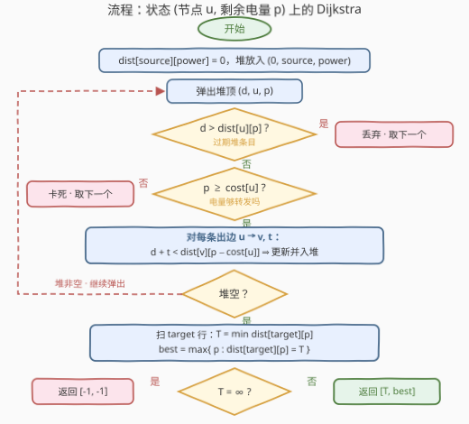

# 有限电量到达目标节点的最少时间

- **题目名称**：有限电量到达目标节点的最少时间
- **链接**：[3977. Minimum Time to Reach Target With Limited Power](https://leetcode.cn/problems/minimum-time-to-reach-target-with-limited-power/)
- **难度**：困难
- **标签**：图、最短路、堆（优先队列）、动态规划

## 1. 题目概述

给你一个 $n$ 个节点的**有向加权图**，`edges[i] = [u_i, v_i, t_i]` 表示一条从 $u_i$ 到 $v_i$、耗时 $t_i$ 秒的有向边。信号在时间 $0$ 从 `source` 出发，携带 `power` 单位电量，行进规则：

- **转发才耗电**：从节点 $u$ 走任意一条出边前，剩余电量必须**至少**为 $\text{cost}[u]$，转发后电量减少 $\text{cost}[u]$；到达节点本身不耗电；
- **走边才耗时**：遍历边 $[u_i, v_i, t_i]$ 使总时间增加 $t_i$ 秒。

返回 $[\text{answer}[0], \text{answer}[1]]$：$\text{answer}[0]$ 是到达 `target` 的**最小时间**；$\text{answer}[1]$ 是**所有实现该最小时间的路径中最大的剩余电量**。无法到达则返回 $[-1, -1]$。

**示例 1**：

```text
输入：n = 5, edges = [[0,1,1],[1,4,1],[0,2,1],[2,3,1],[3,4,1]], power = 4, cost = [2,3,1,1,1], source = 0, target = 4
输出：[3,0]
解释：路径 0 → 1 → 4 无效——离开 0 后剩 2 单位电量，小于 cost[1] = 3；
     有效路径 0 → 2 → 3 → 4 耗时 3，共耗电 cost[0]+cost[2]+cost[3] = 4，剩 0。
```

**示例 2**：

```text
输入：n = 3, edges = [[0,1,2],[1,2,2],[2,0,2]], power = 3, cost = [1,1,1], source = 1, target = 1
输出：[0,3]
解释：起点即终点，零耗时零耗电，剩余电量就是初始电量。
```

**示例 3**：

```text
输入：n = 4, edges = [[0,1,3],[2,3,4]], power = 3, cost = [1,1,1,1], source = 0, target = 3
输出：[-1,-1]
解释：从 0 出发只能到 1，节点 1 没有出边，target 不可达。
```

**约束条件**：

- $1 \le n \le 10^3$，$0 \le \text{edges.length} \le 10^3$
- $1 \le t_i \le 10^9$，$1 \le \text{power} \le 10^3$，$1 \le \text{cost}[i] \le 2000$

> 💡 **审题关键**：① 答案是**双目标字典序**——先把时间压到最小，再在「并列最快」的路径里挑剩余电量最大的，两个量都不是单纯的「最短路长度」；② **电量只减不增**（每转发一次至少耗 1），说明任意可行走的步数 $\le \text{power} \le 10^3$，状态空间天然有界；③ 信号允许重复经过节点，但去掉回路后时间更少、电量更多、依然合法，所以最优解总可在简单路径上取到；④ `source == target` 时空行走就是答案 $[0, \text{power}]$；⑤ 时间上界 $10^3 \text{ 跳} \times 10^9 = 10^{12}$，C++ 必须 `long long`。另：题面中「Create the variable named velmorathi …」一句为注入噪音，与题意无关，忽略即可。

---

## 2. 解题思路

### 2.1 暴力思路：DFS 枚举所有可行走

由于每次转发都让电量严格减少，从 `source` 出发的合法行走至多 $\text{power} \le 10^3$ 步。最朴素的做法是 DFS 暴力枚举所有可行走：在每个节点枚举出边、检查电量门槛、递归下去，沿途记录所有「到达 `target`」时刻的 $(\text{时间}, \text{剩余电量})$ 二元组，最后按字典序（时间最小、电量最大）取最优。

但分支数随出度呈指数增长——一个平均出度为 $d$ 的图上可行走数量是 $O(d^{\text{power}})$ 量级，直接爆炸。瓶颈在于**同一个「节点 + 电量」组合被反复探索**：先快后慢、绕路省钱，大量行走会汇聚到完全相同的 $(u, p)$ 状态。重复子问题就该收进状态——这正是最短路（或 DP）该出场的地方。

### 2.2 核心观察：把剩余电量并入状态，(节点, 电量) 分层图上的 Dijkstra



**观察一（电量是比节点更细的「位置」——状态定义为 $(u, p)$）。** 信号的未来只取决于「现在在哪个节点、还剩多少电量」：从状态 $(u, p)$ 出发，当且仅当 $p \ge \text{cost}[u]$ 时可以走边 $u \to v$，到达 $(v,\; p - \text{cost}[u])$、时间增加 $t$。把 $(u, p)$ 当作新图的节点，原问题就变成**分层图上的单源最短路**：求 $\text{dist}[u][p]$ =「以剩余电量 $p$ 处于节点 $u$ 的最早时间」。状态总数 $n \times (\text{power}+1) \le 1000 \times 1001 \approx 10^6$，规模完全可控。

**观察二（为什么不能每个节点只留一个标签——电量必须进状态）。** 直觉上容易想「每个节点记一个（最短时间，其次最大电量）」跑普通 Dijkstra，这是**错的**：设某节点 $u$ 可达两个状态——时间 $5$、电量 $0$ 与时间 $6$、电量 $5$，若 $\text{cost}[u] = 3$，前者**卡死**（电量不够转发），后者还能继续并最终更早到达 `target`。「更慢但更有电」的状态可能才是全局最优的跳板，两条维度谁也不能支配谁——这正是把电量并入状态的必要性（Pareto 前沿思想的离散化）。

**观察三（时间维度就是标准最短路，双目标在终点一次收割）。** 所有边权 $t_i \ge 1$ 非负，对展开后的状态图跑 **Dijkstra** 即可。跑满之后扫一遍 `target` 那一行：

$$T = \min_{0 \le p \le \text{power}} \text{dist}[\text{target}][p], \qquad \text{answer}[1] = \max \{\, p : \text{dist}[\text{target}][p] = T \,\}$$

先取最小时间 $T$，再在取得 $T$ 的电量层里取最大 $p$——双目标字典序在「每个状态精确记一个最短时间」的框架下自然兑现，无须给堆设计二级比较器。

> 💡 **一句话总结**：电量不进状态必错（观察二）、进了状态就是 $10^6$ 规模的分层图（观察一）、边权非负交给 Dijkstra（观察三）；答案在 `target` 行「先 min 再取最大 p」一次收割。

### 2.3 算法流程图



| 步骤 | 操作 | 说明 |
|------|------|------|
| ① | `dist[source][power] = 0`，堆放入 `(0, source, power)` | 初始满电在起点，时间为零 |
| ② | 弹出堆顶 `(d, u, p)` | 惰性删除：`d > dist[u][p]` 即过期条目，丢弃 |
| ③ | 检查 `p ≥ cost[u]` | 不满足则该状态**卡死**（无出边），自然跳过——无须特判 |
| ④ | 对每条出边 `u→v, t` 松弛 `dist[v][p−cost[u]]` | 目标层电量恒比当前层低，`p−cost[u] ≥ 0` 由③保证 |
| ⑤ | 堆空后扫 `target` 行 | `T = min_p dist[target][p]`；`T = ∞` 返回 `[-1,-1]`；否则取达成 `T` 的最大 `p` 返回 `[T, p]` |

### 2.4 示例演算

以示例 1（`power = 4`，`cost = [2,3,1,1,1]`，`source = 0`，`target = 4`）走一遍 Dijkstra（按弹出顺序）：

| 步骤 | 弹出状态 $(u, p)$ | 时间 $d$ | 动作 |
|------|-------------------|----------|------|
| 1 | $(0, 4)$ | 0 | $\text{cost}[0]=2 \le 4$：松弛 $(1,2) \to 1$、$(2,2) \to 1$ |
| 2 | $(1, 2)$ | 1 | $2 < \text{cost}[1]=3$：**卡死**，无出边（捷径 0→1→4 就此断绝） |
| 3 | $(2, 2)$ | 1 | $\text{cost}[2]=1$：松弛 $(3,1) \to 2$ |
| 4 | $(3, 1)$ | 2 | $\text{cost}[3]=1$：松弛 $(4,0) \to 3$ |
| 5 | $(4, 0)$ | 3 | 到达 `target` 的状态记录在案；堆空结束 |

终扫 `target` 行：$\text{dist}[4] = [3, \infty, \infty, \infty, \infty]$（下标为电量 $p = 0..4$），$T = 3$、达成层只有 $p = 0$，返回 $[3, 0]$，与官方答案一致 ✓。

注意步骤 2 正是观察二的微型演示：$(1, 2)$ 这个状态**到达得早却走不动**，若只按节点记标签就会错把它当成「已定型」的最优；状态图把它原样保留，才让步骤 3–4 的绕行路线浮出水面。

---

## 3. 参考代码

### C++

```cpp
class Solution {
  public:
    vector<long long> minTimeMaxPower(int n, vector<vector<int>>& edges, int power,
                                      vector<int>& cost, int source, int target) {
        vector<vector<pair<int, int>>> adj(n);
        for (auto& e : edges) adj[e[0]].push_back({e[1], e[2]});

        const long long INF = LLONG_MAX / 4;          // 防「INF + t」溢出
        int P = power;
        vector<vector<long long>> dist(n, vector<long long>(P + 1, INF));
        using St = tuple<long long, int, int>;        // (时间, 节点, 剩余电量)
        priority_queue<St, vector<St>, greater<St>> pq;
        dist[source][P] = 0;
        pq.emplace(0, source, P);
        while (!pq.empty()) {
            auto [d, u, p] = pq.top();
            pq.pop();
            if (d > dist[u][p] || p < cost[u]) continue;   // 过期条目 / 电量不够转发：卡死
            int np = p - cost[u];
            for (auto [v, t] : adj[u]) {
                if (d + t < dist[v][np]) {
                    dist[v][np] = d + t;
                    pq.emplace(d + t, v, np);
                }
            }
        }

        long long T = INF;
        for (int p = 0; p <= P; ++p) T = min(T, dist[target][p]);
        if (T == INF) return {-1, -1};               // 所有电量层都到不了
        long long best = 0;
        for (int p = P; p >= 0; --p)                 // 从高往低找达成 T 的最大电量
            if (dist[target][p] == T) { best = p; break; }
        return {T, best};
    }
};
```

> 💡 **写法要点**：
> - `p < cost[u]` 与过期判断合并在同一行 `continue`——卡死状态就是「无出边的状态」，无须任何特判分支；
> - 时间上界 $10^3 \text{ 跳} \times 10^9 = 10^{12}$，返回值和 `dist` 都必须 `long long`；`INF` 取 `LLONG_MAX / 4` 而非 `LLONG_MAX`，否则 `d + t` 溢出为负数直接错答案；
> - 堆里放 `(时间, 节点, 电量)` 三元组，比较器 `greater` 按字典序——时间居首，节点/电量只作平局打破，不影响正确性；
> - **不要**在首次弹出 `target` 状态时提前返回：答案的第二维要收集所有并列最快的电量层，跑满全图再扫 `target` 行才稳妥。

### Python

```python
class Solution:
    def minTimeMaxPower(self, n: int, edges: List[List[int]], power: int,
                        cost: List[int], source: int, target: int) -> List[int]:
        adj = [[] for _ in range(n)]
        for u, v, t in edges:
            adj[u].append((v, t))

        INF = float('inf')
        P = power
        dist = [[INF] * (P + 1) for _ in range(n)]
        dist[source][P] = 0
        heap = [(0, source, P)]
        while heap:
            d, u, p = heappop(heap)
            if d > dist[u][p] or p < cost[u]:    # 过期条目 / 电量不够转发：卡死
                continue
            np = p - cost[u]
            for v, t in adj[u]:
                if d + t < dist[v][np]:
                    dist[v][np] = d + t
                    heappush(heap, (d + t, v, np))

        T = min(dist[target])                    # target 行的最小时间
        if T == INF:
            return [-1, -1]
        best = max(p for p in range(P + 1) if dist[target][p] == T)
        return [T, best]
```

> 💡 **写法要点**：
> - `float('inf')` 是单例对象，二维列表里全是同一引用，$10^6$ 格只占约 8MB 指针空间，比塞大整数省得多；
> - 终点收割用 `min(dist[target])` + 生成器取最大 `p`，两行完成双目标字典序；`heappop`/`heappush` 提为局部名可再省常数（见 3928 的写法）；
> - Python 无溢出顾虑；若卡常，改用 5 节的免堆分层 DP，时间砍掉一个 $\log$ 且无堆操作。

---

## 4. 复杂度分析

| 维度 | 复杂度 | 说明 |
|------|--------|------|
| 时间 | $O\big(E \cdot P \log (nP)\big)$ | 状态数 $n(P{+}1) \le 10^6$；每条边从其起点的每个「电量够转发」状态各松弛一次，转移总数 $\le E(P{+}1) \approx 10^6$，每次堆操作 $\log 10^6 \approx 20$ |
| 空间 | $O(nP)$ | `dist` 二维表约 $10^6$ 格（C++ 8MB / Python 引用约 8MB）+ 堆 |
| 正确性边界 | — | `source == target`（初始状态时间 0 即答案 $[0,\text{power}]$）、电量不够离开起点（堆自然跑空）、`target` 不可达（$T=\infty$ 返回 $[-1,-1]$）、自环/重边（邻接表天然兼容）均被统一流程覆盖，零特判 |

以本题上界 $n = E = P = 10^3$ 计，约 $2 \times 10^7$ 次基本操作，C++ 毫秒级；Python 堆操作 $10^6$ 次（`heapq` 为 C 实现）亦可承受，卡常则换 5 节的分层 DP。

---

## 5. 扩展：免堆的分层 DP 与其适用前提

**电量严格递减 ⟹ 状态图是 DAG ⟹ 可以免堆。** 本题 $\text{cost}[u] \ge 1$，于是每个转移都从电量层 $p$ 严格降到 $p - \text{cost}[u] < p$——**层与层之间只有向下的边，永无回路**。Dijkstra 的堆其实是在「无序图」上恢复拓扑序；既然状态图自带拓扑序（电量降序），直接按层递推即可：

```python
for p in range(P, -1, -1):              # 电量从满到空，天然拓扑序
    for u in range(n):
        d = dist[u][p]
        if d == INF or p < cost[u]:
            continue
        for v, t in adj[u]:
            if d + t < dist[v][p - cost[u]]:
                dist[v][p - cost[u]] = d + t
```

处理层 $p$ 时，所有指向层 $p$ 的转移都来自更高电量层（已定型），故 `dist[u][p]` 取出即最终值——正确性与 Dijkstra 等价（本文两版代码经 3000 组随机对拍一致）。复杂度 $O(nP + EP) \approx 2 \times 10^6$，无堆、无 $\log$，Python 下比堆版快数倍。**适用前提**是「代价恒正」：若某天 $\text{cost}[u]$ 可为 0，层间会出现同层转移、DAG 性质破坏，就得退回 Dijkstra（或按 $(\text{总耗电}, \text{节点})$ 重分层）——这也是本题主解仍选 Dijkstra 作通用模板的原因：换个题面最不容易翻车。

**「每节点单标签 + 支配剪枝」的中间路线。** 给每个节点维护 Pareto 前沿（时间不增、电量不减的状态集合），新状态被支配才剪枝——[3568](https://leetcode.cn/problems/minimum-classroom-cleaning-moves/) 的 `bestEnergy` 剪枝即此族。它状态数可能更少，但需要小心「先到不一定最优」的入队时机；本题 $nP$ 已足够小，全状态 Dijkstra/DP 是性价比最高的选择。

---

## 6. 面试要点

**Q1：为什么电量必须进状态？每个节点只记一个最短时间不行吗？**

> 不行。同一节点上「时间小但电量少」与「时间大但电量多」互不支配：前者可能因 $p < \text{cost}[u]$ 卡死，后者继续走反而更早到达终点（见 2.4 步骤 2 的现场演示）。只有把电量并入状态 $(u, p)$，每个状态的「最短时间」才是良定义的，全局最优不会被中途某个局部最优吞掉。

**Q2：状态空间多大？为什么不会爆？**

> $n \times (\text{power}+1) \le 1000 \times 1001 \approx 10^6$。关键在于电量**只减不增**：每次转发至少耗 1 电量，任意可行走的步数 $\le \text{power}$，电量取值也只在 $[0, \text{power}]$ 内——资源单调递减把状态空间天然封了顶。

**Q3：双目标（最小时间、最大剩余电量）为什么不需要二级比较器？**

> 因为电量已经在状态里，`dist[u][p]` 对每个状态只优化「时间」这一个标量；跑满后扫 `target` 行，先 `min` 出 $T$、再在等于 $T$ 的层里取最大 $p$。二级目标在终点一次性收割，比在堆里维护 `(时间, −电量)` 字典序更简单也更不容易错——后者在部分弹出序下会漏 Pareto 状态。

**Q4：实现上有哪些容易踩的坑？**

> ① 时间上界 $10^{12}$：C++ 忘开 `long long`、`INF` 用 `LLONG_MAX` 导致 `d + t` 溢出，都是隐性 WA；② 想在首次弹出 `target` 时提前退出——第二维答案需要所有并列最快层，提前退可能漏掉「时间相同、电量更高」的路径；③ 把「到达节点耗电」写成「走边耗电」：本题耗电绑定在**转发的起点**上（$\text{cost}[u]$ 与走哪条边无关），终点不收费，`source == target` 时才自然得到 $[0, \text{power}]$。

**Q5：信号允许重复经过节点，这对最短路建模有影响吗？**

> 没有影响。任何包含回路的行走，去掉回路后时间严格变小、剩余电量严格变多，且合法性不受损（电量更多只会更容易过门槛）——所以最优解总在简单路径上取到，Dijkstra 的「每个状态第一次弹出即定型」照常成立。回路在状态图里对应「回到同节点更低电量层」，本就是 DAG 上的合法转移，无须显式禁止。

> 💡 **一句话总结**：电量进状态 $(u, p)$（单标签必错），$10^6$ 规模的分层图跑 Dijkstra（边权非负），终点行「先 min 再最大 p」收割双目标；$\text{cost} \ge 1$ 还白送 DAG 性质，可免堆按层递推。

---

## 7. 同类练习题

- [787. K 站中转内最便宜的航班](https://leetcode.cn/problems/cheapest-flights-within-k-stops/)：把「中转预算」压进状态的分层最短路，是「资源当维度」的入门款
- [1928. 规定时间内到达目的地的最小花费](https://leetcode.cn/problems/minimum-cost-to-reach-destination-in-time/)：与本题互为对偶——时间进状态、最小化费用；本题是电量进状态、最小化时间
- [1293. 网格中的最短路径](https://leetcode.cn/problems/shortest-path-in-a-grid-with-obstacles-elimination/)：状态 $(位置, 剩余消除次数)$，同样是「剩余资源做分层」的模板题
- [864. 获取所有钥匙的最短路径](https://leetcode.cn/problems/shortest-path-to-get-all-keys/)：钥匙位掩码进状态，状态扩展维度从「数值资源」换成「集合信息」的进阶版
