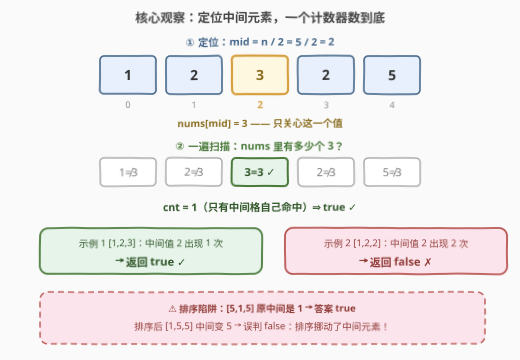
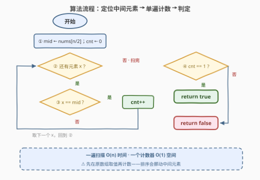

# LeetCode 唯一中间元素 题解

## 1. 题目概述

- **标题 / 题号**：唯一中间元素（#3978，easy）
- **链接**：https://leetcode.cn/problems/unique-middle-element/
- **难度**：简单
- **标签**：数组、计数

**题意**：给你一个长度为奇数 $n$ 的整数数组 `nums`。

如果 `nums` 的**下标中间元素**在数组中**恰好出现一次**，返回 `true`；否则返回 `false`。

**示例 1**：

```text
输入：nums = [1,2,3]
输出：true
解释：nums 的中间元素是 2，它恰好出现一次。因此，答案为 true。
```

**示例 2**：

```text
输入：nums = [1,2,2]
输出：false
解释：nums 的中间元素是 2，它出现了两次。因此，答案为 false。
```

**约束**：

- $1 \le n = \text{nums.length} \le 100$
- $n$ 是奇数
- $1 \le \text{nums[i]} \le 100$

> 💡 **审题关键**：①「下标中间元素」指**原始数组**下标 $\lfloor n/2 \rfloor$ 处的**值**，问的是这个**值**在全数组中出现几次——与位置无关，只看值的频率；② $n$ 为奇数保证中间下标唯一（$n=1$ 时中间元素就是唯一元素，必为 `true`）；③ 任何会**重排数组**的做法（如排序）都会改变「谁是中间元素」，是本题最大的陷阱。

## 2. 解题思路

### 2.1 直觉思路：全量频率表

最直觉的写法：用哈希表（或值域计数数组）统计**所有**元素的出现次数，再查 `nums[mid]` 的次数是否为 1。正确性没问题，但做了「超额功」——我们**只关心一个值**的频率，却把每个值都数了一遍，还额外开了 $O(n)$（或 $O(C)$）的空间。

### 2.2 核心观察：一个计数器就够



**观察一（中间下标即 $n/2$）**：$n$ 为奇数时，$\lfloor n/2 \rfloor$ 恰好落在正中——左右各 $\frac{n-1}{2}$ 个元素。$n=1$ 时 $n/2=0$，中间元素就是数组唯一元素，它必然「恰好出现一次」——边界无需特判，代码自然覆盖。

**观察二（一个值 × 一遍扫描）**：令 $m = \text{nums}[\lfloor n/2 \rfloor]$，答案只取决于 $m$ 在数组中的出现次数 $\mathrm{cnt}(m)$：

$$\text{答案} = \begin{cases} \text{true} & \mathrm{cnt}(m) = 1 \\ \text{false} & \mathrm{cnt}(m) \ge 2 \end{cases}$$

从头到尾扫一遍，遇到等于 $m$ 的元素就把计数器加一即可——**不需要哈希表**，一个 `int` 计数器足矣，空间 $O(1)$。注意下标 $n/2$ 处必然命中一次（自己等于自己），所以 $\mathrm{cnt}(m) \ge 1$ 恒成立，`cnt == 1` 实际等价于「除中间格外再无出现」。

**观察三（排序是陷阱，不是优化）**：排序会**挪动中间元素**。例如 $[5,1,5]$：原数组中间是 $1$（出现一次，答案 `true`）；排序后 $[1,5,5]$ 中间变成 $5$（出现两次，据此判断会误判 `false`）。「排序后查中位数左右邻居」回答的是另一个问题（中位数的值是否唯一），与本题不等价。

> 💡 **一句话总结**：先取 $m = \text{nums}[n/2]$，再数 $m$ 出现几次——定位 $O(1)$ + 扫描 $O(n)$、空间 $O(1)$；千万别排序。

### 2.3 算法流程图



| 步骤 | 操作 | 说明 |
|------|------|------|
| ① | `mid = nums[n/2]` | 整数除法；$n$ 为奇数时恰为正中，$n=1$ 时为 0 |
| ② | `cnt = 0`，从左到右扫描 | 只关心一个值，无需哈希表 |
| ③ | `nums[i] == mid` 则 `cnt++` | 与「值的相等」比较，与下标无关 |
| ④ | 返回 `cnt == 1` | 恰好一次 → `true`；$\ge 2$ → `false` |

### 2.4 示例演算

| 示例 | nums | mid 下标 | $m=\text{nums[mid]}$ | 扫描命中情况 | cnt | 答案 |
|------|------|---------|---------------------|-------------|-----|------|
| 1 | `[1,2,3]` | 1 | 2 | $1 \ne 2$，$2 = m$ ✓，$3 \ne 2$ | 1 | `true` |
| 2 | `[1,2,2]` | 1 | 2 | $1 \ne 2$，$2 = m$ ✓，$2 = m$ ✓ | 2 | `false` |
| 3 | `[7]` | 0 | 7 | $7 = m$ ✓ | 1 | `true` |

- 示例 1 / 3：中间元素的值只被命中一次，返回 `true`；
- 示例 2：值 $2$ 被命中两次（下标 1、2），返回 `false`——注意其中一次命中**就是中间格本身**，中间元素自己永远贡献一次计数；
- 示例 3 是 $n=1$ 的边界：$n/2=0$，唯一元素必唯一，自然返回 `true`。

## 3. 参考代码

### C++

```cpp
class Solution {
  public:
    bool isMiddleElementUnique(vector<int>& nums) {
        int mid = nums[nums.size() / 2];   // ① 定位中间元素（n 为奇数，n/2 即正中）
        int cnt = 0;
        for (int x : nums)                 // ② 一遍扫描
            if (x == mid) ++cnt;           // ③ 只数 mid 这一个值
        return cnt == 1;                   // ④ 恰好一次才为 true
    }
};
```

> 💡 **写法要点**：
> - `nums.size() / 2` 是整数除法，$n$ 为奇数时即 $\lfloor n/2 \rfloor$；`size()` 是无符号类型，$n \ge 1$ 保证除法安全；
> - `mid` 取的是**值**而非下标，后续比较「值相等」即可；
> - 值域 $[1,100]$、$n \le 100$，`int` 计数毫无溢出风险。

### Python

```python
class Solution:
    def isMiddleElementUnique(self, nums: list[int]) -> bool:
        mid = nums[len(nums) // 2]        # ① 定位中间元素
        return nums.count(mid) == 1       # ②③④ count 一行完成计数与判定
```

> 💡 **写法要点**：
> - `list.count(x)` 是 C 实现的一遍扫描，一行同时完成计数与判定；
> - 若想显式模拟流程：`cnt = sum(x == mid for x in nums)` 再 `return cnt == 1`，完全等价。

## 4. 复杂度分析

| 维度 | 复杂度 | 说明 |
|------|--------|------|
| 时间 | $O(n)$ | 定位 $O(1)$ + 单遍扫描 $O(n)$；$n \le 100$ 实际常数极小 |
| 空间 | $O(1)$ | 只用 `mid`、`cnt` 两个变量，无哈希表/计数数组 |
| 正确性边界 | $n=1$ | $n/2 = 0$，唯一元素必「恰好出现一次」，代码自然覆盖 |

## 5. 扩展：值域计数数组与「排序陷阱」的辨析

**值域计数数组**：$1 \le \text{nums[i]} \le 100$ 提示了桶计数写法——先 $O(n)$ 统计 `cnt[1..100]`，再查 `cnt[nums[mid]] == 1`：

```cpp
bool isMiddleElementUnique(vector<int>& nums) {
    int cnt[101] = {0};
    for (int x : nums) ++cnt[x];                  // 预处理全量频率
    return cnt[nums[nums.size() / 2]] == 1;       // O(1) 查询
}
```

单次调用下它并不比单计数器优（两者都是 $O(n)$ 时间），但当**同一数组要反复查询不同下标**时，预处理一次计数数组、每次查询 $O(1)$，整体更优——这正是「离线预处理」思想的微型体现。

**排序为什么救不了反而会错**：排序改变中间位置上**是谁**。$[5,1,5]$ 原数组中间是 $1$（唯一，`true`），排序后 $[1,5,5]$ 中间是 $5$（两次，被误判 `false`）。想清楚「本题问的是原始数组某个**固定下标**上的值的频率」，就能识破这类偷换——凡是会移动元素的做法都从根上走偏了。

## 6. 面试要点

**Q1：中间下标为什么是 $n/2$？$n=1$ 时会不会出问题？**

> $n$ 为奇数，$\lfloor n/2 \rfloor$ 左右各有 $\frac{n-1}{2}$ 个元素，恰为正中。$n=1$ 时 $n/2=0$，中间元素即唯一元素，出现次数必为 1，返回 `true`——代码无需任何特判。

**Q2：为什么不用哈希表？**

> 哈希表统计**所有**值的频率，但本题只查**一个**值。单计数器 + 一遍扫描即可，省掉 $O(n)$ 空间与哈希开销。这是「按需统计」的最小实现原则——查询需求决定数据结构规模。

**Q3：排序后检查 `nums[mid]` 的左右邻居，这个写法对吗？**

> 不对。排序会移动元素：$[5,1,5]$ 原中间是 $1$（答案 `true`），排序后中间变 $5$（误判 `false`）。该写法回答的是「中位数的值是否唯一」，与本题「原始下标中间元素的值是否唯一」是两个问题。

**Q4：中间元素自己的那次出现算不算？**

> 算。扫描必然在下标 $n/2$ 处命中一次（自己等于自己），所以 `cnt ≥ 1` 恒成立；判定条件 `cnt == 1` 实际等价于「除中间格外没有再出现」。示例 2 中下标 1、2 两处命中，cnt=2 → `false`。

**Q5：若题目改成「中间元素出现奇数次才返回 true」或「恰好 k 次」呢？**

> 框架完全不变：仍是「取 $m$ → 数 $m$」，只改最后判定的比较条件（`cnt % 2 == 1` 或 `cnt == k`）。本题的骨架是「定点取值 + 全量计数」，判定条件是可替换的插件。

## 同类练习题

| # | 题目 | 与本题的关联 |
|---|------|-------------|
| 136 | [只出现一次的数字](https://leetcode.cn/problems/single-number/) | 全员成双、独缺一个——「唯一出现」的另一经典形态（位运算解法） |
| 387 | [字符串中的第一个唯一字符](https://leetcode.cn/problems/first-unique-character-in-a-string/) | 先全量计数再按需查询，对比本题「只数一个值」的取舍 |
| 697 | [数组的度](https://leetcode.cn/problems/degree-of-an-array/) | 频率统计求最短同频子数组，计数思想的进阶应用 |
| 1512 | [好数对的数目](https://leetcode.cn/problems/number-of-good-pairs/) | 从计数视角看「相同值成对出现」，与「恰好出现一次」互为镜像 |
| 2404 | [出现最频繁的偶数元素](https://leetcode.cn/problems/most-frequent-even-element/) | 计数 + 并列裁决，练习哈希/桶统计的完整套路 |
