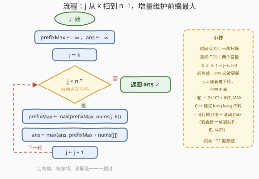

# 最大有效数对和

- **题目名称**：最大有效数对和
- **链接**：[3979. 最大有效数对和](https://leetcode.cn/problems/maximum-valid-pair-sum/)
- **难度**：中等
- **标签**：数组、枚举

## 1. 题目概述

给你一个长度为 $n$ 的整数数组 `nums` 和一个整数 $k$。

如果满足以下条件，则下标对 $(i, j)$ 被称为**有效**的：

- $0 \le i < j < n$
- $j - i \ge k$

返回所有有效对中的 $\text{nums}[i] + \text{nums}[j]$ 的**最大**值。

**示例 1**：

```text
输入：nums = [1,3,5,2,8], k = 2
输出：13
解释：有效对为：
     (0,2): nums[0]+nums[2] = 6    (0,3): nums[0]+nums[3] = 3
     (0,4): nums[0]+nums[4] = 9    (1,3): nums[1]+nums[3] = 5
     (1,4): nums[1]+nums[4] = 11   (2,4): nums[2]+nums[4] = 13
     因此，答案为 13。
```

**示例 2**：

```text
输入：nums = [5,1,9], k = 1
输出：14
解释：因为 k = 1，每一对都是有效的。最大值由对 (0,2) 取得，
     为 nums[0]+nums[2] = 5+9 = 14。
```

**约束条件**：

- $2 \le n = \text{nums.length} \le 10^5$
- $1 \le \text{nums[i]} \le 10^9$
- $1 \le k \le n-1$

> 💡 **审题关键**：① 约束 $k \le n-1$ 意味着 $j = k$、$i = 0$ 这一对**必然有效**，即**有效对一定存在**，无需处理无解；② $\text{nums[i]} \ge 1$ 全正，但这一点对本题解法并非必需（前缀最大法对负数同样成立）；③ 两元素之和最大 $2 \times 10^9$，恰好未超 32 位 `int` 上限 $2147483647$——但已是贴边飞行，见第 4 节。

---

## 2. 解题思路

### 2.1 暴力思路：枚举所有下标对

二重循环枚举所有 $i < j$，检查 $j - i \ge k$ 后用 $\text{nums}[i] + \text{nums}[j]$ 更新答案。总对数约 $\frac{n(n-1)}{2}$，$n = 10^5$ 时约 $5 \times 10^9$ 对——必然超时。

一个稍好的等价写法是**固定 $j$、内层枚举 $i \in [0,\, j-k]$ 取最大**：

$$\text{ans} = \max_{j=k}^{n-1}\ \Bigl(\text{nums}[j] + \max_{0 \le i \le j-k} \text{nums}[i]\Bigr)$$

这仍然是对每个 $j$ 重新扫描前缀的 $O(n^2)$，但它揭示了问题的关键结构——瓶颈只在**「$\max_{i \le j-k} \text{nums}[i]$」这一项被反复重算**。

### 2.2 核心观察：枚举右端点 + 前缀最大值

![核心观察：固定 j，i 的可行域是 [0, j−k]，只需前缀最大](../images/p3979_pair_sum_prefix_max.svg)

**观察一（固定 $j$，第一个元素只需关心最大值）**：对固定的 $j$，满足 $j - i \ge k$ 的下标 $i$ 组成一段**连续前缀区间** $[0,\, j-k]$。要让 $\text{nums}[i] + \text{nums}[j]$ 最大，第二个元素 $\text{nums}[j]$ 已定，第一个元素**取区间里的最大值即可**——与 $i$ 具体是谁无关。

**观察二（可行域随 $j$ 右移单调扩张）**：$j$ 从 $k$ 走到 $n-1$ 时，区间右端点 $j - k$ 恰好依次取 $0, 1, 2, \dots, n-1-k$——**每次只新进来一个元素，只出不进永远不会发生**。因此 $\max(\text{nums}[0..j-k])$ 可以**增量维护**：$j$ 右移一步，拿新元素 $\text{nums}[j-k]$ 与当前最大值取 $\max$ 即可，无需重扫。

$$\text{prefixMax}_j = \max\bigl(\text{prefixMax}_{j-1},\ \text{nums}[j-k]\bigr)$$

**观察三（完备性）**：每个有效对 $(i, j)$ 都在「枚举到 $j$」时被「前缀最大」覆盖——因为 $i \le j-k$ 保证 $\text{nums}[i] \le \text{prefixMax}_j$，而 $\text{prefixMax}_j$ 对应的某个下标 $i^\ast \le j-k$ 也确实构成有效对 $(i^\ast, j)$。所以一次遍历不重不漏地考虑了所有有效对。

> 💡 **一句话总结**：距离约束 $j - i \ge k$ 把 $i$ 限制成 $j$ 的**连续前缀**，前缀只增不减 → 用一个滚动变量维护前缀最大，一次遍历 $O(n)$ 完事。这与「121. 买卖股票的最佳时机」完全同构：那里枚举卖出日维护左侧**最小**买入价，这里枚举右端点维护左侧**最大**左元素。

### 2.3 算法流程图



| 步骤 | 操作 | 说明 |
|------|------|------|
| ① | `prefixMax ← −∞`，`ans ← −∞` | 滚动变量各一个，$O(1)$ 空间 |
| ② | 循环 $j = k, k+1, \dots, n-1$ | 枚举右端点；$k \le n-1$ 保证循环体至少执行一次 |
| ③ | `prefixMax ← max(prefixMax, nums[j−k])` | 可行域扩进新元素 $\text{nums}[j-k]$，此刻维护的是 $\max(\text{nums}[0..j-k])$ |
| ④ | `ans ← max(ans, prefixMax + nums[j])` | 以 $j$ 为右端点的最优有效对候选 |
| ⑤ | 循环结束，返回 `ans` | 约束保证有效对必存在，`ans` 一定被更新过 |

### 2.4 示例演算

**示例 1**：`nums = [1,3,5,2,8]`，$k = 2$：

| $j$ | nums[$j$] | 可行域 $[0,\, j-k]$ | 新进元素 | prefixMax | 候选 prefixMax+nums[$j$] | ans |
|-----|-----------|--------------------|----------|-----------|------------------------|-----|
| 2 | 5 | $[0,0]$ → {1} | nums[0]=1 | 1 | $1+5=6$ | 6 |
| 3 | 2 | $[0,1]$ → {1,3} | nums[1]=3 | 3 | $3+2=5$ | 6 |
| 4 | 8 | $[0,2]$ → {1,3,5} | nums[2]=5 | 5 | $5+8=\mathbf{13}$ | **13** |

**示例 2**：`nums = [5,1,9]`，$k = 1$：

| $j$ | nums[$j$] | 可行域 $[0,\, j-k]$ | 新进元素 | prefixMax | 候选 | ans |
|-----|-----------|--------------------|----------|-----------|------|-----|
| 1 | 1 | $[0,0]$ → {5} | nums[0]=5 | 5 | $5+1=6$ | 6 |
| 2 | 9 | $[0,1]$ → {5,1} | nums[1]=1 | 5 | $5+9=\mathbf{14}$ | **14** |

可见全程每个元素只被「进门」一次，$O(n)$ 名副其实。

---

## 3. 参考代码

### C++

```cpp
class Solution {
  public:
    int maxValidPairSum(vector<int>& nums, int k) {
        int n = nums.size();
        long long prefixMax = LLONG_MIN;          // ① max(nums[0..j-k])
        long long ans = LLONG_MIN;                // ① 全局答案
        for (int j = k; j < n; ++j) {             // ② 枚举右端点
            prefixMax = max(prefixMax, (long long)nums[j - k]);  // ③ 可行域扩一格
            ans = max(ans, prefixMax + nums[j]);  // ④ 以 j 为右端点的最优候选
        }
        return (int)ans;                          // ⑤ 有效对必存在
    }
};
```

> 💡 **写法要点**：
> - `prefixMax` 用 `LLONG_MIN` 起手，第一次循环（$j=k$）自然吸收 $\text{nums}[0]$，无需特判首元素；
> - 和的最大值 $2 \times 10^9$ 只比 `INT_MAX`（$2147483647$）小约 7%，虽然本题恰好不溢出，但用 `long long` 中转可以免疫一切边界改动（如面试官把上界改成 $2^{31}$）；转回 `int` 返回是安全的；
> - 循环从 $j = k$ 开始而非 $j = 0$：$j < k$ 时可行域 $[0, j-k]$ 为空，跳过即可。

### Python

```python
class Solution:
    def maxValidPairSum(self, nums: List[int], k: int) -> int:
        prefix_max = -inf                       # ① max(nums[0..j-k])
        ans = -inf                              # ① 全局答案
        for j in range(k, len(nums)):           # ② 枚举右端点
            prefix_max = max(prefix_max, nums[j - k])   # ③ 可行域扩一格
            ans = max(ans, prefix_max + nums[j])        # ④ 最优候选
        return ans                              # ⑤ 有效对必存在
```

> 💡 **写法要点**：
> - `math.inf` 起手与 C++ 的 `LLONG_MIN` 同理，免首元素特判；
> - Python 大整数无忧，无需任何溢出考量；
> - 若想更「函数式」可写成 `max(max(nums[:j-k+1]) + nums[j] for j in range(k, len(nums)))`，但那是 $O(n^2)$ 切片，**别这么写**。

---

## 4. 复杂度分析

| 维度 | 复杂度 | 说明 |
|------|--------|------|
| 时间 | $O(n)$ | $j$ 单向扫描一遍，每步 $O(1)$ 的 $\max$ 维护与更新 |
| 空间 | $O(1)$ | 仅 `prefixMax`、`ans` 两个滚动变量 |
| 答案规模 | $\le 2 \times 10^9$ | 两个 $\le 10^9$ 的正数相加；恰好 $< 2^{31}-1 \approx 2.147 \times 10^9$，`int` 贴边但装得下，稳妥起见 C++ 建议中转 `long long` |

---

## 5. 扩展：变体与更一般的「距离约束」

**变体一（最小有效数对和）**：把两个 `max` 换成 `min`，维护前缀**最小**即可，结构完全不变。

**变体二（最大有效数对差）**：求 $\max\,(\text{nums}[j] - \text{nums}[i])$（$j - i \ge k$）——同枚举 $j$，但需**同时**维护 $\max(\text{nums}[0..j-k])$ 与 $\min(\text{nums}[0..j-k])$，取 $\pm$ 两种符号的较大者（若元素可负）。这正是「2016. 增量元素之间的最大差值」的无距离版加上距离约束。

**一般化（1425. 带限制的子序列和）**：若把「选一对」改成「选一条子序列且相邻两项下标距离 $\le k$」并最大化子序列和，前缀最大就不够了——需要在**滑动窗口** $[j-k, j-1]$ 内维护 dp 最大值，用**单调队列**（或有序多重集/堆）优化到 $O(n)$。本题是其在「窗口只增不减」下的退化特例，正是这个退化让一个滚动变量就够了。

---

## 6. 面试要点

**Q1：为什么枚举 $j$ 而不是枚举所有对？可行域是什么形状？**

> 距离约束 $j - i \ge k$ 等价于 $i \le j - k$，配合 $i \ge 0$，固定 $j$ 时 $i$ 的可行域是**连续前缀区间** $[0, j-k]$。区间结构让「挑最优 $i$」退化成「取前缀最大」，把二维枚举压成一维。

**Q2：前缀最大为什么可以增量维护？**

> $j$ 每右移一步，可行域右端点 $j-k$ 恰好推进一格，区间**只扩张不收缩**，新信息只有 $\text{nums}[j-k]$ 一个元素。拿它与旧最大值取 $\max$ 即得新最大值，$O(1)$ 完成。若可行域是滑动窗口（会收缩），就要上单调队列——这正是本题与 1425 的分水岭。

**Q3：会不会出现无有效对的情况？**

> 不会。约束 $1 \le k \le n-1$ 保证 $j = k$、$i = 0$ 时 $j - i = k$ 成立，循环体至少执行一次，`ans` 一定被更新。若面试官放松约束允许 $k \ge n$，需在循环后检查 `ans` 是否仍为初始哨兵值。

**Q4：溢出怎么分析？**

> $\text{nums[i]} \le 10^9$，和 $\le 2 \times 10^9$；而 `INT_MAX` $\approx 2.147 \times 10^9$，恰好安全但余量不足 7%。稳妥做法是 C++ 中用 `long long` 累加再转回（本题函数签名返回 `int`）；Python 天然无此问题。

**Q5：这题和「121. 买卖股票的最佳时机」有什么关系？**

> 完全同构：121 枚举卖出日 $j$，维护 $[0, j-1]$ 内最小买入价，求 $\text{nums}[j] - \min$ 最大；本题枚举右端点 $j$，维护 $[0, j-k]$ 内最大左元素，求 $\text{nums}[j] + \max$ 最大。区别只有二：维护的是 min 还是 max；121 的左端无距离下界、本题有 $j - i \ge k$（把维护区间从 $[0, j-1]$ 缩成 $[0, j-k]$，且因 $j-k$ 递增仍可增量维护）。

---

## 7. 同类练习题

- [121. 买卖股票的最佳时机](https://leetcode.cn/problems/best-time-to-buy-and-sell-stock/)：枚举右端点 + 维护前缀最小，与本题一减一加、一 min 一 max，互为镜像
- [1014. 最佳观光组合](https://leetcode.cn/problems/best-sightseeing-pair/)：同样是 $\text{nums}[i] + \text{nums}[j]$ 型两元素配对最大化，维护 $\max(\text{nums}[i] + i)$，体会「贡献拆进两端」
- [2016. 增量元素之间的最大差值](https://leetcode.cn/problems/maximum-difference-between-increasing-elements/)：枚举 $j$ 维护左侧最小的入门热身，无距离约束版
- [2874. 有序三元组中的最大值 II](https://leetcode.cn/problems/maximum-value-of-an-ordered-triplet-ii/)：枚举中间元素，左右各维护前缀最大/后缀最大——同一套「定一端、维护最值」的推广
- [1425. 带限制的子序列和](https://leetcode.cn/problems/constrained-subsequence-sum/)：距离约束下的更一般问题，可行域从「只增前缀」变成「滑动窗口」，需单调队列优化
