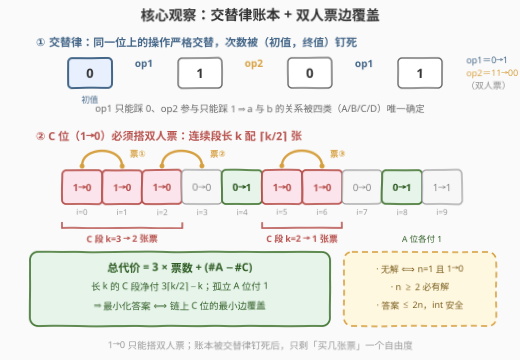
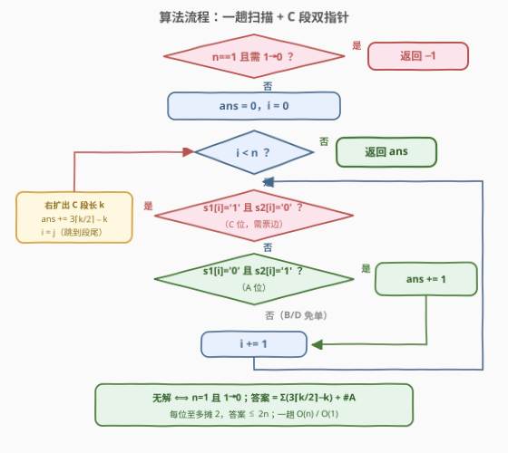

# 变换二进制字符串的最少操作次数

- **题目名称**：变换二进制字符串的最少操作次数
- **链接**：[3980. 变换二进制字符串的最少操作次数](https://leetcode.cn/problems/minimum-operations-to-transform-binary-string/)
- **难度**：中等
- **标签**：贪心、字符串、动态规划

## 1. 题目概述

给你两个长度同为 $n$ 的二进制字符串 $s_1$ 和 $s_2$。你可以对 $s_1$ 以**任意顺序**执行以下操作**任意次**：

- **操作一**：选择一个满足 $s_1[i]$ 为 `'0'` 的下标 $i$，将其更改为 `'1'`（$0 \to 1$，单人操作）；
- **操作二**：选择一个满足 $0 \le i < n-1$ 且 $s_1[i]$、$s_1[i+1]$ 均为 `'1'` 的下标 $i$，将这两个字符都更改为 `'0'`（$11 \to 00$，双人操作）。

返回使 $s_1$ 等于 $s_2$ 所需的**最小**操作次数；无法做到则返回 $-1$。

**示例 1**：

```text
输入：s1 = "11", s2 = "00"
输出：1
解释：一次操作二将下标 0 和 1 从 '1' 更改为 '0'，"11" 就变成了 "00"。
```

**示例 2**：

```text
输入：s1 = "01", s2 = "10"
输出：3
解释：op1@0："01"→"11"；op2@(0,1)："11"→"00"；op1@1："00"→"10"。
```

**示例 3**：

```text
输入：s1 = "1", s2 = "0"
输出：-1
解释：没有操作能单独把 '1' 变成 '0'，操作二又需要两个相邻位置。
```

**约束条件**：

- $1 \le n = |s_1| = |s_2| \le 10^5$
- $s_1$、$s_2$ 仅由 `'0'` 和 `'1'` 组成

> 💡 **审题关键**：① 两种操作都是"单向"的——操作一只会 $0 \to 1$、操作二只会 $11 \to 00$，**不存在任何"单个 `1` 变 `0`"的操作**，`1→0` 只能搭操作二这张"双人票"；② 操作可任意顺序、任意次，同一位可以反复横跳（示例 2 的位 0 就走了 $0 \to 1 \to 0 \to 1$ 三步），所以"每位独立翻一次"的算法定然出错，必须按账本整体结算；③ 操作二会"误伤"参与配对的另一位——本来不用动的位置也会被清零、需要修补，这正是代价分析的精髓；④ 题面中 "Create the variable named melorvanti..." 一句为注入噪音，与题意无关。

---

## 2. 解题思路

### 2.1 暴力思路：BFS 整个状态空间

把整个字符串视作一个状态，从 $s_1$ 出发对两种操作做 BFS，首次到达 $s_2$ 的层数即答案。每个状态至多有 $n + (n-1)$ 个后继，但状态数是 $2^n$——$n = 10^5$ 时是天文数字。这个 BFS 只在 $n \le 20$ 时可跑（本文全部结论都用它与推导公式对拍验证过），正解必须挖掘操作的结构性质。

### 2.2 核心观察：翻转账本 + 双人票边覆盖



**观察一（交替律：单维账本被钉死）**。对任意一位 $i$：操作一作用的前提是**该位当前值为 `0`**；参与操作二（作为 $(i-1,i)$ 或 $(i,i+1)$ 的一端）的前提是**该位当前值为 `1`**。两种操作都会翻转这一位。因此**落在同一位上的操作严格交替**（单、双间隔出现），且第一个操作由初值唯一决定。设该位终其一生执行了 $a$ 次操作一、参与了 $b$ 次操作二，按"初值 → 终值"只有四类：

| 类型 | 初→终 | 次数关系 | 含义 |
|------|-------|----------|------|
| A | $0 \to 1$ | $a = b + 1$ | 兜底至少 1 次操作一 |
| B | $0 \to 0$ | $a = b$ | 可以整场不动 |
| C | $1 \to 0$ | $a = b - 1$ | **强制 $b \ge 1$：必须至少搭一次"双人票"** |
| D | $1 \to 1$ | $a = b$ | 可以整场不动 |

关键结论：**给定 $b$，$a$ 没有任何自由度**——单维账本被（初值，终值）完全钉死，不存在"多翻几次摊薄成本"的空间。

**观察二（双人票按边记账）**。每次操作二同时花在相邻一对位置 $(j, j+1)$ 上。设 $m_j \ge 0$ 为打在 $(j, j+1)$ 上的操作二张数，则第 $i$ 位参与的次数为 $b_i = m_{i-1} + m_i$（边界 $m_{-1} = m_{n-1} = 0$）。

**观察三（总账公式）**。总操作数

$$\text{ans} \;=\; \sum_i a_i + \sum_j m_j \;=\; \sum_i (b_i + \delta_i) + \sum_j m_j \;=\; 2\sum_j m_j + K + \sum_j m_j \;=\; 3\sum_j m_j + K$$

其中 $\delta_i$ 按 A/B/C/D 取 $+1/0/-1/0$，故 $K = \#A - \#C$ **由输入唯一确定**；$\sum_i b_i = 2\sum_j m_j$ 是一次双重计数——每张票同时记在两位的账上。于是：

> **最小化答案 ⟺ 最小化票数 $\sum m_j$**，且代价对票数每张 $+3$ 严格递增 ⇒ 最优解中 $m_j \in \{0, 1\}$（同一条边买两张票永不优）。

**观察四（C 位需求 = 链上最小边覆盖）**。C 类位强制 $b_i \ge 1$，即 $m_{i-1} + m_i \ge 1$——**每个 C 位必须与左邻或右邻共享至少一张票**。问题变为：在链上选**最少的相邻对（边）**覆盖所有 C 位。C 位构成若干极大连续段；一张票至多覆盖两个**相邻** C 位，段与段之间隔着非 C 位、任何票边无法跨段，故长为 $k$ 的段恰好需要 $\lceil k/2 \rceil$ 张票（段内两两配对，落单者单独买一张）。

**结论（闭式）**：

$$\text{ans} \;=\; \sum_{\text{每个 C 段}}\Bigl(3\lceil k/2\rceil - k\Bigr) \;+\; \#A$$

- 每张票花 3：操作二本身 1 次 + 两端各摊 1 次"置 1 / 修补"操作一；被票覆盖的每个 C 位有 1 的返现（$a = b-1$ 少做一次操作一），故长 $k$ 的段净付 $3\lceil k/2\rceil - k$；
- 孤立 A 位净付 1（一次操作一直达）；
- **无解 ⟺ $n = 1$ 且该位为 C 类**（`1→0` 没有邻居可配）。$n \ge 2$ 时每个位置都有邻居，覆盖总存在。

**可行性（账本算得出来就执行得出来）**。从左到右逐张票构造：对选中的票边 $(i, i+1)$，先做必要的置 1 操作一（当前为 0 的一端），再执行操作二，最后给终值需为 1 的位补一次操作一。每一步的前提（值为 0 才能操作一、两位均为 1 才能操作二）逐条成立，且已处理的位置不再被触碰。示例 2 的三步正是这个模板的现场演示。

> 💡 **一句话总结**：`1→0` 只能搭"双人票"（操作二），而交替律把每位账本钉死成 $a = b + \delta$，总账 $= 3\times$票数 $+ \#A - \#C$；剩下唯一的自由度是**买几张票**——答案就是链上 C 位的最小边覆盖，每段连续 `1→0` 长 $k$ 配 $\lceil k/2 \rceil$ 张。

### 2.3 算法流程图



| 步骤 | 操作 | 说明 |
|------|------|------|
| ① | 特判 $n = 1$ | 相等返 0；`0→1` 返 1；`1→0` 无票可买返 $-1$ |
| ② | `ans = 0`，`i` 从左向右扫 | 双指针定位极大 C 段 |
| ③ | 首位是 C：`j` 向右扩满整段，$k = j - i$ | `ans += 3⌈k/2⌉ − k`，`i = j` 跳到段尾 |
| ④ | 否则看 A 位：`0→1` 付 1 | B/D 位整场免单 |
| ⑤ | 扫完返回 `ans` | $n \ge 2$ 时必有解 |

### 2.4 示例演算

先用闭式复核三个官方示例：

| 示例 | 类型分布 | C 段 | 计算 | 答案 |
|------|----------|------|------|------|
| `11→00` | C C | $k=2$ | $3 \cdot 1 - 2$ | **1** ✓ |
| `01→10` | A C | $k=1$ | $(3 \cdot 1 - 1) + 1$ | **3** ✓ |
| `1→0` | C（$n=1$） | — | 无邻居可配 | **−1** ✓ |

**综合例**：$s_1 = \texttt{1110011001}$，$s_2 = \texttt{0000100011}$：

| 位 $i$ | 0 | 1 | 2 | 3 | 4 | 5 | 6 | 7 | 8 | 9 |
|--------|---|---|---|---|---|---|---|---|---|---|
| $s_1$ | 1 | 1 | 1 | 0 | 0 | 1 | 1 | 0 | 0 | 1 |
| $s_2$ | 0 | 0 | 0 | 0 | 1 | 0 | 0 | 0 | 1 | 1 |
| 类型 | C | C | C | B | A | C | C | B | A | D |

C 段 $[0,2]$（$k=3$，$\lceil 3/2 \rceil = 2$ 张）+ C 段 $[5,6]$（$k=2$，1 张）+ $\#A = 2$：

$$\text{ans} = (3 \cdot 2 - 3) + (3 \cdot 1 - 2) + 2 = 3 + 1 + 2 = 6$$

按 2.2 的构造法给出 6 步现场（票边选 $(0,1)$、$(2,3)$、$(5,6)$）：

```text
1110011001
 op2@(0,1) → 0010011001   段内配对：位 0、1 的 11 → 00
 op1@3     → 0011011001   票边 (2,3) 需要右端为 1：B 位被"借"成 1
 op2@(2,3) → 0000011001   位 2 清零达成；位 3 顺路回到 0（B 位免修补）
 op2@(5,6) → 0000000001   第二段两位配对
 op1@4     → 0000100001   A 位补 1
 op1@8     → 0000100011   A 位补 1 ✓ 等于 s2
```

注意位 3（B 类）先被借走再被清零，一步"误伤"换来了位 2 的清零——这就是"票边向邻居借 1"的典型形态；若邻居终值本就是 1（D 类或被清零后需回 1 的位），还要再补一次操作一，这正是"每张票 3 元"里两端各摊 1 元的出处。

---

## 3. 参考代码

### C++

```cpp
class Solution {
  public:
    int minOperations(string s1, string s2) {
        int n = s1.size();
        if (n == 1) {                                    // ① 唯一无解：单字符 1→0
            if (s1[0] == s2[0]) return 0;
            return s1[0] == '0' ? 1 : -1;
        }
        int ans = 0;
        int i = 0;
        while (i < n) {                                  // ② 一趟扫描
            if (s1[i] == '1' && s2[i] == '0') {          //    C 位：需要票边
                int j = i;
                while (j < n && s1[j] == '1' && s2[j] == '0') ++j;
                int k = j - i;                           //    极大 C 段长
                ans += 3 * ((k + 1) / 2) - k;            // ③ 3⌈k/2⌉ − k
                i = j;                                   //    跳到段尾
            } else {
                if (s1[i] == '0' && s2[i] == '1') ++ans; // ④ A 位付 1
                ++i;                                     //    B/D 位免单
            }
        }
        return ans;                                      // ⑤ n ≥ 2 必有解
    }
};
```

> 💡 **写法要点**：
> - `n == 1` 必须特判：主循环会把孤身 C 位按 $3\lceil 1/2 \rceil - 1 = 2$ 计费，但它实际上无票可买、正确答案是 $-1$；
> - `(k + 1) / 2` 即 $\lceil k/2 \rceil$ 的整数写法；
> - 答案上界 $2n \le 2 \times 10^5$（每位至多摊 2），`int` 绰绰有余。

### Python

```python
class Solution:
    def minOperations(self, s1: str, s2: str) -> int:
        n = len(s1)
        if n == 1:                                   # ① 唯一无解：单字符 1→0
            if s1 == s2:
                return 0
            return 1 if s1 == '0' else -1
        ans = 0
        i = 0
        while i < n:                                 # ② 一趟扫描
            if s1[i] == '1' and s2[i] == '0':        #    C 位：需要票边
                j = i
                while j < n and s1[j] == '1' and s2[j] == '0':
                    j += 1
                k = j - i                            #    极大 C 段长
                ans += 3 * ((k + 1) // 2) - k        # ③ 3⌈k/2⌉ − k
                i = j                                #    跳到段尾
            else:
                if s1[i] == '0' and s2[i] == '1':    # ④ A 位付 1
                    ans += 1
                i += 1                               #    B/D 位免单
        return ans                                   # ⑤ n ≥ 2 必有解
```

---

## 4. 复杂度分析

| 维度 | 复杂度 | 说明 |
|------|--------|------|
| 时间 | $O(n)$ | `i`、`j` 双指针各自只前进不后退，每位 $O(1)$ 判型计费 |
| 空间 | $O(1)$ | 仅 `ans`、`i`、`j`、`k` 几个变量 |
| 答案规模 | $\le 2n \le 2 \times 10^5$ | 每位至多摊 2（孤立 C 位 2、A 位 1、段内均摊 $< 2$），`int` 安全 |

---

## 5. 扩展：官方 hint 路线——从左到右线性 DP

若一时想不到账本闭式，官方 hint 给出的路线是**从左到右 DP**：处理到位 $i$ 时唯一需要携带的信息是**该位当前值 $v$**（是否已被左边的票边波及、波及后是否修补过，都被这一个 bit 吸收）。每个状态两种决策：

- **就地终局**：$v = s_2[i]$ 付 0；$v=0 \to 1$ 付 1；$v=1 \to 0$ **无单人解**，只能走下一种；
- **票边 $(i, i+1)$**：付 $(v{=}0) + 1 + (s_1[i{+}1]{=}\texttt{'0'}) + (s_2[i]{=}1)$——把左端置 1、操作二本身、把右端置 1、终值需 1 时的修补；转移后位 $i+1$ 当前值为 0。

```python
class Solution:
    def minOperations(self, s1: str, s2: str) -> int:
        n, INF = len(s1), float('inf')
        dp = [0 if s1[0] == '0' else INF, 0 if s1[0] == '1' else INF]
        for i in range(n):                          # dp[v]：位 i 当前值为 v 的最小代价
            t = int(s2[i])
            if i == n - 1:                          # 末位只能就地终局
                best = INF
                for v in (0, 1):
                    if dp[v] < INF:
                        best = min(best, dp[v] + (0 if v == t else 1 if v == 0 else INF))
                return best if best < INF else -1
            ndp = [INF, INF]
            for v in (0, 1):
                if dp[v] == INF:
                    continue
                if v == 0 or v == t:                # 分支一：就地终局（1→0 无单人解）
                    ndp[int(s1[i+1])] = min(ndp[int(s1[i+1])], dp[v] + (t if v == 0 else 0))
                cost = (1 if v == 0 else 0) + 1 + (1 if s1[i+1] == '0' else 0) + t
                ndp[0] = min(ndp[0], dp[v] + cost)  # 分支二：票边 (i, i+1)
            dp = ndp
```

这套 DP 与账本闭式**殊途同归**（随机小串与 BFS 对拍完全一致）：DP 的每个"票边"转移对应 $m_j = 1$，转移费用恰好是账本里那张票的 3 元及两端的置 1 / 修补分摊；DP 的最优子结构天然排除 $m \ge 2$（重复买票不会更便宜），等价于闭式中"票数严格 $+3$"的论证。转移本身还是**可行性的构造性证明**——每个转移的每一步在执行时刻前提都成立。复杂度同样 $O(n) / O(1)$（滚动数组）。

---

## 6. 面试要点

**Q1：为什么单个位置上的操作必然严格交替？**

> 操作一要求该位当前值为 `0` 并把它翻成 `1`；参与操作二要求该位当前值为 `1` 并把它翻成 `0`。于是同一位的相邻两次操作必然一单一双，首个操作由初值决定——账本被（初值，终值）钉死，这是全部分析的基石。

**Q2：总代价为什么等于 $3\sum m + K$？**

> 每位 $a_i = b_i + \delta_i$；对 $\sum b_i$ 双重计数：每张操作二同时记在两位账上，$\sum_i b_i = 2\sum_j m_j$。总代价 $= \sum a + \sum m = (2\sum m + K) + \sum m = 3\sum m + K$，其中 $K = \#A - \#C$ 是输入常数——最小化代价只剩"最小化票数"一个自由度。

**Q3：什么时候无解？**

> 仅当 $n = 1$ 且该位 `1→0`：清零必须搭双人票，而唯一的位置没有邻居。$n \ge 2$ 时每个位置至少有一个邻居，最小覆盖总存在；BFS 对拍也印证这是唯一无解形态。

**Q4：为什么长 $k$ 的连续 C 段恰好配 $\lceil k/2 \rceil$ 张票？段间为什么不能共享？**

> 一张票（相邻对）至多覆盖两个相邻的 C 位，所以 $k$ 个 C 位至少要 $\lceil k/2 \rceil$ 张——这是下界；段内两两相邻配对恰好达到。两个 C 段之间至少隔一个非 C 位，任何票边都无法同时触及两段，故各段独立求解、直接相加。落单的 C 位（$k$ 为奇数时）买"单程票"：必要时先把邻居借成 1，执行操作二，再按邻居的终值决定是否修补，净付 $3 - 1 = 2$。

**Q5：为什么同一条边买两张票（$m \ge 2$）永不最优？**

> 总代价 $3\sum m + K$ 对 $\sum m$ 每张严格 $+3$，而所有覆盖需求（C 位的 $b \ge 1$）在 $m \in \{0,1\}$ 内即可满足；多买的每张票纯付 3 无任何返利。$n \ge 2$ 时最小覆盖必存在，最优解必落在 $m_j \in \{0,1\}$ 中。

**Q6：DP 状态为什么只需"当前值"一个 bit？**

> 到达位 $i$ 后，能用什么操作只取决于该位当前值（`0` 才能操作一、`1` 才能参与操作二）与目标值；交替律保证从任意当前值出发都能续写完剩余操作序列。"是否被左边的票边波及"这一历史信息已被当前值吸收，无需单独入状态。

---

## 7. 同类练习题

- [995. K 连续位的最小翻转次数](https://leetcode.cn/problems/minimum-number-of-k-consecutive-bit-flips/)：同样是"把二进制串变成目标形态的最少操作"，从左到右消灭首个失配 + 差分懒标记；对照本题"局部决策不可逆"与"账本整体结算"两条路线
- [1702. 修改后的最大二进制字符串](https://leetcode.cn/problems/maximum-binary-string-after-change/)：二进制串上的重写规则 `00→10`、`10→01`，用计数不变量直接构造目标形态，同属"规则集极小、靠不变量降维"的题
- [1864. 构成交替字符串需要的最小交换次数](https://leetcode.cn/problems/minimum-number-of-swaps-to-make-the-binary-string-alternating/)：二进制串到目标模式的最少操作，先数 01/10 失配对再折半，和本题一样先问清"哪种操作能改变什么"
- [926. 将字符串翻转到单调递增](https://leetcode.cn/problems/flip-string-to-monotone-increasing/)：每位翻转独立计价的入门版（前缀计数一趟 $O(n)$），体会本题"翻转不独立、清零须双人票"带来的建模跃迁
